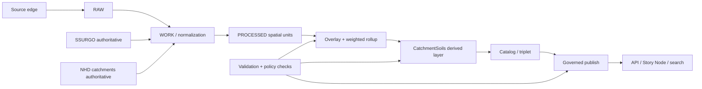
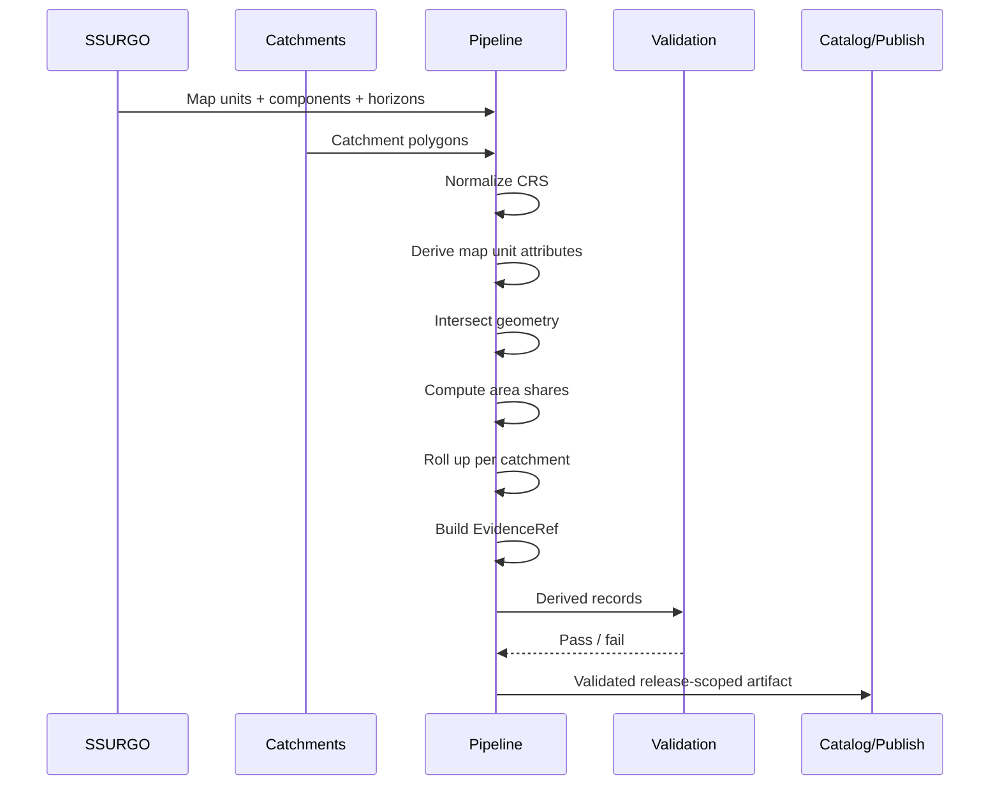

<!-- [KFM_META_BLOCK_V2]
doc_id: kfm://doc/<uuid-NEEDS-VERIFICATION>
title: SSURGO to NHD Catchment Overlay Pipeline
type: standard
version: v1
status: draft
owners: <owners-NEEDS-VERIFICATION>
created: <YYYY-MM-DD>
updated: <YYYY-MM-DD>
policy_label: public
related:
  - docs/pipelines/README.md
  - docs/architecture/TRUTH_PATH_LIFECYCLE.md
  - docs/architecture/TRUST_MEMBRANE.md
  - contracts/<path-NEEDS-VERIFICATION>
  - policy/<path-NEEDS-VERIFICATION>
tags:
  - kfm
  - pipelines
  - soils
  - hydrology
  - provenance
notes: Source-bounded draft derived from KFM doctrine and session design notes; live repo paths, owners, contracts, and workflow anchors NEED VERIFICATION before merge.
[/KFM_META_BLOCK_V2] -->

# SSURGO to NHD Catchment Overlay Pipeline

Area-weighted derivation of catchment-level soil attributes from SSURGO and NHD catchments for governed hydrologic, erosion, and Story Node use.

> [!IMPORTANT]
> **Truth posture:** This document is **source-bounded** to KFM doctrine and session design notes. It is written to be repo-ready, but live paths, owners, contract locations, workflow names, and enforcement hooks **NEED VERIFICATION** before merge.

**Status:** draft
**Owners:** `<owners-NEEDS-VERIFICATION>`
**Path:** `docs/pipelines/ssurgo_to_catchment.md`
**Repo fit:** pipeline design + operator reference for a derived, rebuildable publication surface
**Evidence posture:** evidence-first; fail-closed on missing provenance, insufficient spatial coverage, unresolved joins, or failed validation


**Quick jumps:** [Scope](#scope) · [Repo fit](#repo-fit) · [Inputs](#accepted-inputs) · [Exclusions](#exclusions) · [Flow](#pipeline-flow) · [Schema](#catchmentsoils-derived-record-shape) · [EvidenceRef](#evidenceref-pattern) · [Checks](#validation-and-fail-closed-gates) · [Usage](#usage-outline)

---

## Scope

This pipeline produces a **catchment-level derived soil layer** by spatially overlaying:

* **SSURGO** soil map units and component/horizon attributes
* **NHD catchments** (or equivalent governed catchment polygons)

The output is a rebuildable derived dataset that supports:

* catchment cards in Story Nodes
* hydrologic and erosion-oriented summaries
* drill-through provenance and evidence inspection
* downstream search, graph, and map experiences

The pipeline is **not** an authoritative soil source and **not** a replacement for SSURGO or NHD. It is a governed projection that must remain downstream of authoritative data and publication policy.

---

## Repo fit

**Primary path:** `docs/pipelines/ssurgo_to_catchment.md`
**Upstream:** authoritative source acquisition, licensing/rights review, RAW/WORK/PROCESSED soil and hydro layers
**Downstream:** catalog/triplet registration, governed API publication, Story Nodes, maps, search, graph, and analysis surfaces
**Adjacent:**

* `docs/pipelines/README.md`
* `docs/architecture/TRUTH_PATH_LIFECYCLE.md`
* `docs/architecture/TRUST_MEMBRANE.md`
* `docs/governance/README.md`
* `docs/standards/README.md`
* `contracts/` *(exact contract path NEEDS VERIFICATION)*
* `policy/` *(exact policy path NEEDS VERIFICATION)*
* `tests/` *(validation and release proof anchors NEEDS VERIFICATION)*

> [!NOTE]
> KFM architecture law still applies here: **authoritative truth remains upstream; derived layers stay rebuildable and downstream**. Clients should consume this surface through governed publication and APIs, not by bypassing the trust membrane to raw intermediates.

---

## Accepted inputs

This pipeline accepts only governed, versioned, provenance-bearing inputs.

| Input                       | Role                                 |  Expected granularity | Notes                                      |
| --------------------------- | ------------------------------------ | --------------------: | ------------------------------------------ |
| SSURGO map units            | authoritative soil geometry          |               polygon | base spatial unit for overlay              |
| SSURGO components           | authoritative soil composition       |          per map unit | used for weighted derivation where needed  |
| SSURGO horizons             | authoritative depth/property detail  | per component/horizon | optional depending on chosen rollups       |
| NHD catchments              | authoritative drainage unit geometry |               polygon | target reporting unit                      |
| CRS metadata                | spatial normalization control        |         dataset-level | must be explicit and validated             |
| release/version identifiers | provenance anchor                    |         dataset-level | required for EvidenceRef and publish proof |

### Expected attributes

The exact field names vary by extraction and normalization strategy, but typical derived candidates include:

* `hsg` or hydrologic soil group
* `k_factor`
* `awc`
* `ksat`
* `om_pct`
* `comppct_r`
* `MUKEY`
* catchment identifier such as `catchment_id`, `ComID`, or equivalent

> [!WARNING]
> Field names above are **INFERRED**, not asserted as the live KFM schema. Normalize to canonical internal names in a governed processing step rather than leaking source-specific naming downstream.

---

## Exclusions

This pipeline excludes the following:

* direct publication of raw SSURGO or raw NHD intermediate joins
* undocumented, manual GIS edits without preserved receipts
* irreversible enrichment that cannot be rebuilt from authoritative inputs
* policy truth, schema truth, or governance law embedded in convenience scripts
* client-side derivation that bypasses governed API or evidence resolution
* unsupported inference beyond the evidence carried in authoritative source data
* silent filling of missing soil coverage without an explicit confidence downgrade or block

---

## Why this exists

Users often reason about water, erosion, habitat, runoff, and upstream/downstream conditions at the **catchment** level, while soil truth is typically managed as **soil map units and components**. This pipeline creates a narrow, governed bridge between those units so downstream experiences can say things like:

* “This catchment is dominated by hydrologic soil group C.”
* “Mean K-factor suggests elevated erosion sensitivity.”
* “This statement is backed by these contributing MUKEYs and this overlay method.”

That bridge must remain:

* **rebuildable**
* **explainable**
* **auditable**
* **policy-gated**

---

## Pipeline flow



### Truth path expression

**Source edge → RAW → WORK / QUARANTINE → PROCESSED → CATALOG / TRIPLET → PUBLISHED**

This pipeline lives primarily in the **WORK → PROCESSED → CATALOG** span. Publication is allowed only after validation, provenance, and policy gates pass.

---

## Processing model

### 1) Normalize spatial units

Bring SSURGO polygons and catchment polygons into a common, validated CRS appropriate for area-based analysis.

Recommended operator stance:

* reject missing CRS metadata
* reject incompatible or ambiguous geometry types
* compute areas only after CRS normalization
* preserve source identifiers throughout transformation

### 2) Harmonize SSURGO attribute derivation

Where SSURGO component or horizon detail is required:

* derive component-level values first
* use `comppct_r` or equivalent component weighting
* promote to map unit-level attributes before overlay when possible
* preserve the set of contributing MUKEYs and weights

### 3) Spatial overlay

Intersect SSURGO map unit geometry with catchment geometry.

For each `(catchment, map unit)` pair:

* compute overlap area
* compute share of catchment area covered by that overlap
* retain source identifiers for provenance

### 4) Catchment rollup

Produce catchment-level summaries using area weighting.

Typical rollup strategy:

* **continuous fields** → area-weighted mean
* **categorical fields** → area-dominant class
* **mixed outcomes** → explicit “mixed” label when dominance is weak or ties remain unresolved

### 5) EvidenceRef assembly

Emit a provenance object per derived record that captures:

* authoritative inputs used
* method summary
* contributing source identifiers
* quality/coverage indicators
* release/version anchors where available

### 6) Validation and publish gating

Block or downgrade on:

* missing provenance
* low source coverage
* failed geometry integrity
* required field nulls
* unresolved category tie without explicit handling

---

## Heuristics and rollup rules

These are **PROPOSED** implementation heuristics consistent with the design intent from this session. Treat as doctrine-compatible defaults pending live repo confirmation.

| Case                             | Recommended handling                                               | Truth posture                      |
| -------------------------------- | ------------------------------------------------------------------ | ---------------------------------- |
| multiple components per map unit | weight component-level values by `comppct_r` before promotion      | PROPOSED                           |
| continuous soil attributes       | area-weighted mean at catchment level                              | CONFIRMED (standard practice)      |
| categorical soil group           | dominant class by area share                                       | CONFIRMED (common rollup approach) |
| weak dominance                   | emit `Mixed` if top share is below threshold                       | PROPOSED                           |
| partial catchment coverage       | carry `soil_coverage_share` and confidence downgrade               | CONFIRMED                          |
| sliver artifacts                 | threshold/filter or dissolve tiny intersections with receipts      | PROPOSED                           |
| seam-like discontinuity          | optional neighbor-aware smoothing as secondary analytic layer only | PROPOSED                           |

### Suggested thresholds

| Rule                     |             Suggested value | Effect                                |
| ------------------------ | --------------------------: | ------------------------------------- |
| low soil coverage        |                    `< 0.15` | block or mark low confidence          |
| weak primary category    |                    `< 0.40` | emit `Mixed`                          |
| tiny sliver contribution | `< 0.01` of catchment share | candidate for suppression/dissolve    |
| perfect balance tie      |   equal top category shares | emit explicit mixed / dual class note |

> [!CAUTION]
> Thresholds above are **PROPOSED** defaults. They should not be treated as live KFM policy until verified in `policy/`, workflow gates, or adjacent standards docs.

---

## Pipeline stages

### Stage A — Ingest and normalize

**Purpose:** move authoritative source extracts into a deterministic, analysis-ready shape.

**Inputs:** RAW or PROCESSED SSURGO extracts, RAW or PROCESSED catchments
**Outputs:** normalized GeoDataFrames/tables or equivalent persisted intermediates
**Required invariants:**

* CRS explicit and valid
* geometries non-empty
* source identifiers retained
* extraction/version metadata attached

### Stage B — Soil attribute derivation

**Purpose:** convert component/horizon detail into a stable map unit attribute surface.

**Inputs:** SSURGO map units + components + optional horizons
**Outputs:** map unit attribute table keyed by `MUKEY` or normalized equivalent
**Required invariants:**

* weighting method explicit
* no hidden field renaming
* unit semantics preserved

### Stage C — Catchment overlay

**Purpose:** intersect map units with catchments and compute overlap shares.

**Inputs:** normalized map unit polygons, normalized catchment polygons
**Outputs:** `(catchment_id, mukey, overlap_area, area_share, geometry?)`
**Required invariants:**

* area computed in valid projected CRS
* share calculation transparent
* topology anomalies captured or rejected

### Stage D — Derived record build

**Purpose:** produce one derived catchment record per catchment.

**Inputs:** overlay records + map unit attributes
**Outputs:** `CatchmentSoils` rows + `EvidenceRef`
**Required invariants:**

* provenance present
* coverage present
* confidence label derivable
* contract validation pass

### Stage E — Catalog and publish

**Purpose:** register the derived layer and expose it through governed surfaces.

**Inputs:** validated derived rows
**Outputs:** catalog entry, API-serving artifact, Story Node payloads
**Required invariants:**

* release-scoped
* policy-checked
* drill-through evidence available

---

## Directory sketch

> [!NOTE]
> This tree is **PROPOSED** and must be aligned to the live repo layout before merge.

```text
docs/
  pipelines/
    ssurgo_to_catchment.md

contracts/
  soil/
    catchment_soils.schema.json

policy/
  soils/
    catchment_soils.rego

scripts/
  soils/
    build_catchment_soils.py

tests/
  contracts/
    test_catchment_soils_contract.py
  policy/
    test_catchment_soils_policy.py
  integration/
    test_ssurgo_catchment_overlay.py

data/
  raw/
  work/
  processed/
  derived/
```

---

## CatchmentSoils derived record shape

Below is a **PROPOSED** logical shape for the derived record. The exact contract path and canonical field names **NEED VERIFICATION**.

| Field                 | Type               | Meaning                                           |
| --------------------- | ------------------ | ------------------------------------------------- |
| `catchment_id`        | string or integer  | stable catchment identifier from the hydro source |
| `hsg_primary`         | string             | dominant hydrologic soil group                    |
| `hsg_share_primary`   | number             | share of catchment area held by primary class     |
| `hsg_secondary`       | string nullable    | second-ranked soil group when useful              |
| `hsg_share_secondary` | number nullable    | share held by secondary class                     |
| `k_factor_mean`       | number             | area-weighted erodibility factor                  |
| `awc_mean`            | number             | area-weighted available water capacity            |
| `ksat_mean`           | number             | area-weighted saturated conductivity              |
| `om_mean_pct`         | number             | area-weighted organic matter percent              |
| `soil_coverage_share` | number             | SSURGO-covered area divided by catchment area     |
| `confidence_flag`     | enum               | `high`, `medium`, `low`, or equivalent            |
| `provenance_ref`      | string or JSON     | serialized EvidenceRef                            |
| `release_id`          | string nullable    | release-scoped publication anchor                 |
| `generated_at`        | timestamp nullable | derivation timestamp                              |

### Example JSON shape

```json
{
  "catchment_id": 12345678,
  "hsg_primary": "C",
  "hsg_share_primary": 0.68,
  "hsg_secondary": "B",
  "hsg_share_secondary": 0.19,
  "k_factor_mean": 0.34,
  "awc_mean": 0.17,
  "ksat_mean": 12.4,
  "om_mean_pct": 2.9,
  "soil_coverage_share": 0.92,
  "confidence_flag": "high",
  "provenance_ref": "{\"source\":\"USDA-NRCS SSURGO + USGS NHDPlus HR\",\"method\":\"area-weighted overlay\"}"
}
```

---

## EvidenceRef pattern

Every published derived catchment record should expose evidence sufficient for drill-through and audit.

### Minimum expected content

| EvidenceRef key | Meaning                                                       |
| --------------- | ------------------------------------------------------------- |
| `source`        | named authoritative datasets                                  |
| `method`        | concise derivation description                                |
| `inputs`        | dataset families and key tables/fields                        |
| `ops`           | ordered processing steps                                      |
| `catchment.id`  | target catchment identifier                                   |
| `contributors`  | contributing MUKEYs or normalized source units with shares    |
| `qc`            | quality indicators such as coverage, category tie, confidence |

### Example

```json
{
  "source": "USDA-NRCS SSURGO 2023 + USGS NHDPlus HR",
  "method": "area-weighted overlay",
  "inputs": {
    "nhd": {
      "dataset": "NHDPlus HR",
      "feature": "catchment",
      "id_field": "ComID"
    },
    "ssurgo": {
      "tables": ["mapunit", "component", "chorizon"],
      "keys": ["MUKEY", "cokey"]
    }
  },
  "ops": [
    "join component to horizon with component weighting",
    "derive mapunit attributes",
    "intersect mapunit with catchment",
    "area-weighted rollup per catchment"
  ],
  "catchment": {
    "id": 12345678
  },
  "contributors": [
    { "mukey": "123456", "area_share": 0.52 },
    { "mukey": "789012", "area_share": 0.31 },
    { "mukey": "345678", "area_share": 0.17 }
  ],
  "qc": {
    "soil_coverage_share": 0.93,
    "category_tie": false,
    "confidence_flag": "high"
  }
}
```

> [!IMPORTANT]
> Story Nodes and other user-facing surfaces should never stop at the summary value. They should always allow drill-through to this evidence object or an equivalent evidence bundle.

---

## Usage outline

### Quickstart operator outline

```bash
# 1) prepare normalized sources
python scripts/soils/build_catchment_soils.py \
  --ssurgo data/processed/ssurgo_mapunits.parquet \
  --catchments data/processed/nhd_catchments.parquet \
  --out data/derived/catchment_soils.parquet

# 2) validate contract
# command/path NEEDS VERIFICATION

# 3) validate policy gates
# command/path NEEDS VERIFICATION

# 4) register derived artifact
# command/path NEEDS VERIFICATION
```

### Processing logic at a glance



---

## Reference implementation sketch

This is a **PROPOSED** thin orchestration example, suitable for `scripts/` if aligned to the live repo structure.

```python
import json
import geopandas as gpd
import pandas as pd

TARGET_CRS = 5070

def weighted_mean(df: pd.DataFrame, col: str) -> float:
    x = df[col].fillna(0.0)
    w = df["area_share"].fillna(0.0)
    denom = w.sum()
    if denom == 0:
        return float("nan")
    return float((x * w).sum() / denom)

def build_evidence(catchment_id, contributors, coverage, confidence):
    return json.dumps({
        "source": "USDA-NRCS SSURGO + USGS NHD catchments",
        "method": "area-weighted overlay",
        "catchment": {"id": catchment_id},
        "contributors": contributors,
        "qc": {
            "soil_coverage_share": coverage,
            "confidence_flag": confidence
        }
    })

def dominant_class(df: pd.DataFrame, col: str) -> tuple[str, float]:
    grouped = (
        df.groupby(col, dropna=True)["area_share"]
        .sum()
        .sort_values(ascending=False)
    )
    if grouped.empty:
        return ("UNKNOWN", 0.0)
    label = grouped.index[0]
    share = float(grouped.iloc[0])
    if share < 0.40:
        return ("Mixed", share)
    return (str(label), share)

def main(ssurgo_path: str, catchments_path: str, out_path: str) -> None:
    ssurgo = gpd.read_parquet(ssurgo_path).to_crs(TARGET_CRS)
    catchments = gpd.read_parquet(catchments_path).to_crs(TARGET_CRS)

    overlay = gpd.overlay(ssurgo, catchments, how="intersection")
    overlay["overlap_area"] = overlay.geometry.area

    catchment_area = catchments[["catchment_id", "geometry"]].copy()
    catchment_area["catchment_area"] = catchment_area.geometry.area
    catchment_area = catchment_area.drop(columns=["geometry"])

    overlay = overlay.merge(catchment_area, on="catchment_id", how="left")
    overlay["area_share"] = overlay["overlap_area"] / overlay["catchment_area"]

    rows = []
    for catchment_id, df in overlay.groupby("catchment_id"):
        hsg_primary, hsg_share = dominant_class(df, "hsg")
        coverage = float(df["area_share"].sum())

        confidence = "high"
        if coverage < 0.15:
            confidence = "low"
        elif coverage < 0.75:
            confidence = "medium"

        contributors = [
            {"mukey": str(mukey), "area_share": float(share)}
            for mukey, share in (
                df.groupby("mukey")["area_share"].sum().sort_values(ascending=False).items()
            )
        ]

        rows.append({
            "catchment_id": catchment_id,
            "hsg_primary": hsg_primary,
            "hsg_share_primary": hsg_share,
            "k_factor_mean": weighted_mean(df, "k_factor"),
            "awc_mean": weighted_mean(df, "awc"),
            "ksat_mean": weighted_mean(df, "ksat"),
            "om_mean_pct": weighted_mean(df, "om_pct"),
            "soil_coverage_share": coverage,
            "confidence_flag": confidence,
            "provenance_ref": build_evidence(
                catchment_id=catchment_id,
                contributors=contributors,
                coverage=coverage,
                confidence=confidence,
            ),
        })

    pd.DataFrame(rows).to_parquet(out_path, index=False)

if __name__ == "__main__":
    # argument parsing omitted in this sketch
    pass
```

> [!WARNING]
> This code is an implementation sketch, not a claim that these exact paths, field names, or package choices already exist in the live repo.

---

## Validation and fail-closed gates

This pipeline should fail closed when trust-bearing conditions are not met.

### Minimum gates

| Gate             | Condition                                         | Action                                               |
| ---------------- | ------------------------------------------------- | ---------------------------------------------------- |
| provenance gate  | `provenance_ref` missing or malformed             | block                                                |
| coverage gate    | `soil_coverage_share` below threshold             | block or publish with explicit low-confidence policy |
| schema gate      | required fields missing or wrong type             | block                                                |
| geometry gate    | CRS missing, invalid geometry, or area failure    | block                                                |
| policy gate      | unresolved rights/sensitivity or release mismatch | block                                                |
| consistency gate | area shares outside expected range                | block                                                |

### Sanity checks

* `0 <= soil_coverage_share <= 1`
* per catchment, total `area_share` should approximately equal `soil_coverage_share`
* weighted numeric outputs should remain in plausible physical ranges
* category ties should be explicit, never silently resolved by unstable ordering

### Example policy sketch

```rego
package kfm.soils

deny[msg] {
  not input.provenance_ref
  msg := "missing EvidenceRef"
}

deny[msg] {
  input.soil_coverage_share < 0.15
  msg := "insufficient SSURGO coverage"
}

deny[msg] {
  input.hsg_primary == ""
  msg := "missing primary hydrologic soil group"
}
```

---

## Contract sketch

Below is a **PROPOSED** JSON Schema shape for the derived surface.

```json
{
  "$schema": "https://json-schema.org/draft/2020-12/schema",
  "title": "CatchmentSoils",
  "type": "object",
  "required": [
    "catchment_id",
    "hsg_primary",
    "k_factor_mean",
    "soil_coverage_share",
    "provenance_ref"
  ],
  "properties": {
    "catchment_id": {
      "type": ["string", "integer"]
    },
    "hsg_primary": {
      "type": "string"
    },
    "hsg_share_primary": {
      "type": "number"
    },
    "hsg_secondary": {
      "type": ["string", "null"]
    },
    "hsg_share_secondary": {
      "type": ["number", "null"]
    },
    "k_factor_mean": {
      "type": "number"
    },
    "awc_mean": {
      "type": ["number", "null"]
    },
    "ksat_mean": {
      "type": ["number", "null"]
    },
    "om_mean_pct": {
      "type": ["number", "null"]
    },
    "soil_coverage_share": {
      "type": "number",
      "minimum": 0,
      "maximum": 1
    },
    "confidence_flag": {
      "type": "string"
    },
    "provenance_ref": {
      "type": "string"
    }
  },
  "additionalProperties": false
}
```

---

## API and publication posture

This derived layer should be published only through a governed surface.

### Preferred access pattern

```text
GET /catchments/{id}/soils
```

### Example response

```json
{
  "catchment_id": 12345678,
  "hsg_primary": "C",
  "hsg_share_primary": 0.68,
  "k_factor_mean": 0.34,
  "soil_coverage_share": 0.92,
  "confidence_flag": "high",
  "evidence": {
    "method": "area-weighted overlay",
    "contributors": [
      { "mukey": "123456", "area_share": 0.52 },
      { "mukey": "789012", "area_share": 0.31 }
    ]
  }
}
```

### Publication rules

* derived responses must remain release-scoped
* evidence must be queryable or embedded
* no bypass to raw overlay tables from public client surfaces
* corrections, withdrawals, or superseding releases must be visible

---

## Story Node / UI behavior

A minimal Story Node experience for this layer should present:

* primary soil group summary
* key numeric rollups
* confidence badge
* “View evidence” expansion showing contributors and method
* drill-through links to source units where policy allows

### Example card behavior

| Element         | Example                               |
| --------------- | ------------------------------------- |
| headline        | `Hydrologic soil group: C`            |
| support metric  | `K-factor mean: 0.34`                 |
| quality line    | `Coverage: 92% · Confidence: high`    |
| evidence toggle | contributors, method, release context |

> [!NOTE]
> The Story Node should never imply this layer is sovereign truth. It should clearly behave as a derived interpretive view backed by authoritative source references.

---

## QA checklist

* [ ] live owners verified
* [ ] final path verified
* [ ] contract path verified
* [ ] policy path verified
* [ ] field names aligned to actual normalized schema
* [ ] example commands aligned to live scripts/tooling
* [ ] thresholds approved or replaced with actual policy
* [ ] at least one integration test present
* [ ] release proof includes provenance and policy pass
* [ ] Story Node drill-through verified end-to-end

---

## FAQ

### Is this authoritative soil truth?

No. SSURGO remains authoritative for soil truth. This is a catchment-oriented derived layer.

### Why area-weighted summaries?

Because the target reporting unit is the catchment, while the soil source unit is typically a map unit polygon. Area weighting provides a transparent bridge between those units.

### Why carry `soil_coverage_share`?

Because some catchments may only partially overlap available soil geometry, and downstream users need to see the quality of the derivation.

### Why embed or expose EvidenceRef?

Because KFM publication is evidence-first. Derived claims must be inspectable and auditable, not opaque.

### Can this layer be smoothed or enriched further?

Yes, but only as additional downstream derived layers. Smoothing should never overwrite the base derived truth without clear lineage.

---

## Known uncertainties

| Item                                        | Status             |
| ------------------------------------------- | ------------------ |
| exact repo script path                      | NEEDS VERIFICATION |
| exact contract file path                    | NEEDS VERIFICATION |
| exact policy bundle path                    | NEEDS VERIFICATION |
| exact API path and response envelope        | INFERRED           |
| exact field names in normalized soil tables | NEEDS VERIFICATION |
| exact thresholds used in CI/runtime         | NEEDS VERIFICATION |

---

## Change guidance

When revising this document:

1. preserve the trust membrane language
2. do not upgrade proposed thresholds to confirmed policy without evidence
3. keep authoritative vs. derived distinctions explicit
4. maintain drill-through provenance requirements
5. verify adjacent links, owners, and enforcement hooks against the live repo before publication

---

## Appendix: compact operator notes

<details>
<summary>Open for compact operator notes and implementation reminders</summary>

### Suggested canonical names

* `catchment_id`
* `mukey`
* `hsg`
* `k_factor`
* `awc`
* `ksat`
* `om_pct`
* `soil_coverage_share`
* `provenance_ref`

### Recommended confidence derivation

* **high:** coverage ≥ 0.75 and no major tie/anomaly
* **medium:** coverage between 0.15 and 0.75 or mild ambiguity
* **low:** coverage < 0.15 or unresolved quality issue

### Minimal test cases

* single map unit fully covering one catchment
* multiple map units with known weighted means
* category tie producing `Mixed`
* partial catchment overlap lowering confidence
* malformed geometry causing fail-closed block

</details>

---

[Back to top](#ssurgo-to-nhd-catchment-overlay-pipeline)
