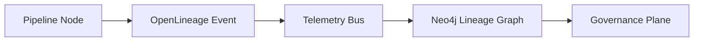
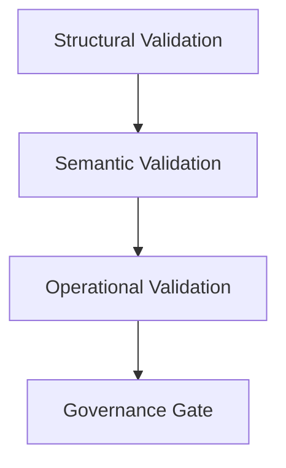

<div align="center">

# 🛰️ **Kansas Frontier Matrix — Pipeline Validation & Observability Guide (v11.2.2)**  
`docs/pipelines/validation-observability.md`

**Purpose:**  
Define the **v11.2.2 long-term validation & observability architecture** governing every KFM ETL, AI/ML, batch, and streaming pipeline. Establish deterministic quality gates, sovereign-safe lineage capture, FAIR+CARE compliance, sustainability telemetry, and governance enforcement across all data and model flows.

[]() ·
[]() ·
[]() ·
[]() ·
[]()  

</div>

---

## 📘 Overview

### Purpose  
This guide defines the **governed infrastructure** responsible for ensuring all pipelines in the Kansas Frontier Matrix meet strict v11.2.2 requirements for integrity, lineage, safety, sovereignty, environmental impact, reproducibility, and explainability.

### Executive Summary  
KFM v11.2.2 establishes a **self-auditing, self-governing pipeline ecosystem** with:

- Deterministic transformations  
- Comprehensive lineage (`prov:Activity`, OpenLineage v2.5)  
- FAIR+CARE enforcement at each stage  
- H3 r7 sovereignty masking for cultural/custodial datasets  
- Semantic validation across STAC/DCAT/GeoJSON/CIDOC/OWL-Time  
- Sustainability telemetry (energy, carbon, environmental cost)  
- Reliability engine (WAL, retry, rollback, hotfix, impact gating)  
- Real-time drift, bias, and failure pattern detection  
- Compliance surfaces to Focus Mode & Story Nodes  

This creates a **closed-loop validation and observability mesh** spanning ingest → ETL → graph → APIs → UI → narrative systems.

### Scope  
Applies to all KFM pipelines (ETL, AI/ML, streaming, batch, autonomous, hybrid). Covers standards, schemas, lineage, governance, and environmental metrics.

### Audience  
Pipeline architects, reliability engineers, governance reviewers, FAIR+CARE council members, graph engineers, and Focus Mode integrators.

---

## 🗂️ Directory Layout

```text
📁 KansasFrontierMatrix/                     — Monorepo root
│
├── 📂 docs/                                 — Documentation (standards, guides, analyses)
│   ├── 📂 standards/                        — Governance, FAIR+CARE, Markdown, sovereignty
│   ├── 📂 architecture/                     — System + subsystem architecture specs
│   ├── 📂 pipelines/                        — Pipeline-related docs (this file)
│   ├── 📂 data/                             — Data contracts, STAC/DCAT catalogs
│   ├── 📂 analyses/                         — Domain analyses (hydrology, archaeology, climate)
│   └── 📄 glossary.md                       — Shared terminology
│
├── 📂 src/                                  — Backend source (ETL, AI/ML, graph, APIs)
│   ├── 📂 pipelines/                        — ETL and AI pipelines (batch · streaming · autonomous)
│   ├── 📂 graph/                            — Neo4j schema, loader, query engines
│   ├── 📂 api/                              — FastAPI services, GraphQL gateway
│   └── 📂 tools/                            — Utilities, migration scripts, helpers
│
├── 📂 data/                                 — Full data lifecycle
│   ├── 📂 sources/                          — External dataset manifests
│   ├── 📂 raw/                              — Raw ingested files (LFS/DVC pointers)
│   ├── 📂 work/                             — Intermediate processing
│   ├── 📂 processed/                        — Validated + normalized outputs
│   └── 📂 stac/                             — STAC v11 collections and items
│
├── 📂 schemas/                              — STAC, DCAT, JSON-LD, SHACL, telemetry schemas
│   ├── 📂 telemetry/                        — Energy, carbon, lineage schemas
│   └── 📂 json/                             — Pipeline validation + governance schemas
│
├── 📂 .github/                              — CI/CD governance
│   └── 📂 workflows/                        — kfm-ci · lineage-audit · governance-check
│
└── 📂 mcp/                                  — Master Coder Protocol artifacts
    ├── 📂 experiments/                      — Experiment logs
    ├── 📂 model_cards/                      — Model documentation
    └── 📂 sops/                             — Standard operating procedures
```

---

## 🧭 Context

The v11.2.2 pipeline observability framework integrates:

- **Ontological rigor**  
  CIDOC-CRM, OWL-Time, GeoSPARQL, STAC/DCAT alignment.

- **Governance rigor**  
  FAIR+CARE, Indigenous data sovereignty, license adherence, risk scoring.

- **Technical rigor**  
  OpenLineage v2.5, Neo4j provenance graph, Prometheus telemetry, reliability engine instrumentation.

- **Narrative rigor**  
  Focus Mode + Story Nodes rely on validated graph entities, requiring impeccable provenance.

This document defines the **normative requirements** ensuring that data, models, lineage, and narratives remain trustworthy.

---

## 🗺️ Diagrams

### Pipeline → Lineage → Governance Flow



### Validation Layering



---

## 🧠 Story Node & Focus Mode Integration

### Validated Graph as Narrative Substrate  
Focus Mode and Story Nodes can only operate on entities that have passed:

- Temporal validation (OWL-Time)
- Spatial validation (GeoSPARQL)
- Semantic shape validation (SHACL)
- Sovereignty gate (H3 r7 generalization)
- Lineage completeness (PROV-O)

### Narrative Provenance  
All narrative output MUST include:

- Source entity IDs  
- Temporal scope  
- STAC/DCAT references where appropriate  
- Model explainability provenance (SHAP summaries)  

### AI Constraints  
Focus Mode is permitted to:

- Summarize pipeline validation results  
- Highlight anomalies  
- Extract metadata  

It is prohibited from:

- Modifying normative requirements  
- Generating speculative architectural claims  
- Falsifying lineage  

---

## 🧪 Validation & CI/CD

Validation is enforced across three layers:

### Structural Validation  
Ensures compatibility with:

- STAC v11  
- DCAT v11  
- JSON-LD (KFM context)  
- GeoJSON  
- CRS/bbox correctness  
- CIDOC-CRM/OWL-Time mapping  

Tools:  
- `schema-lint-v11`  
- `geojson-lint`  
- `crs-check`  
- `bbox-check`  

---

### Semantic Validation  
Verifies:

- Ontology compliance  
- Spatial/temporal topology consistency  
- Entity uniqueness  
- Sovereignty and FAIR+CARE labeling  
- Masking rules (H3 r7)  

Tools:  
- SHACL shapes  
- Ontology inference tests  
- `lineage-audit-v11`  

---

### Operational Validation  
Tracks:

- Latency  
- Throughput  
- Retry/rollback counts  
- Dead-letter queues  
- Energy / carbon cost  
- Drift/bias detection  

Metrics flow via the OpenLineage bus and are stored in the Neo4j provenance graph.

---

## 📦 Data & Metadata

Every pipeline generates:

- STAC Items  
- DCAT dataset entries  
- JSON-LD metadata  
- Telemetry bundles (energy, carbon, lineage)  
- Provenance packets (PROV-O)  

Metadata MUST include:

- Dataset identity & licensing  
- Spatial & temporal extent  
- Lineage chain  
- FAIR+CARE labels  
- Masking & sovereignty flags  
- Model explainability references (when applicable)

---

## 🧱 Architecture

### Validation Architecture (Merged Content)  

KFM v11.2.2 organizes validation into three normative layers:

- **Structural**: schema correctness, CRS, STAC/DCAT compliance, CIDOC mapping.  
- **Semantic**: ontology integrity, shape validation, sovereignty rules, FAIR+CARE gates.  
- **Operational**: runtime metrics, reliability metrics, energy/carbon telemetry.

### Observability Architecture (Merged Content)  

Observability is achieved through:

- OpenLineage v2.5 bus  
- Neo4j lineage graph (`prov:Activity`)  
- Prometheus/Grafana telemetry  
- SHAP/LIME explainability logs  
- Reliability engine events (WAL, retry, rollback, hotfix)  
- Governance plane audit logs  

### Quality Gates (QG-11)  

Every node MUST pass:

1. Structural Gate  
2. Semantic Gate  
3. Sovereignty Gate  
4. FAIR+CARE Gate  
5. Sustainability Gate  
6. Lineage Completeness Gate  
7. Downstream Impact Gate  

Failure triggers WAL rollback and quarantining.

### Drift, Bias & Stability  

AI/ML pipelines must track:

- Data + concept drift  
- Bias profiles  
- SHAP explainability freshness  
- Confidence distribution stability  
- Model age & staleness  

### Sustainability Telemetry  

Track:

- Energy (Wh)  
- Carbon (gCO₂e)  
- IO intensity  
- Memory/disk/network cost  

Published as STAC telemetry entries.

---

## ⚖ FAIR+CARE & Governance

### FAIR  
Ensures:

- Findability (UUIDs, semantic IDs)  
- Accessibility (public docs, clear licensing)  
- Interoperability (STAC/DCAT/JSON-LD)  
- Reusability (consistent metadata, provenance, open licensing)

### CARE  
Ensures:

- Collective benefit  
- Authority to control  
- Responsibility  
- Ethics  

### Governance Enforcement  
GovHooks v4 manages:

- Masking & sovereignty policies  
- Licensing restrictions  
- Lineage immutability  
- Promotion approvals  
- Risk scoring  

Any violation → automatic fail.

---

## 🕰️ Version History

| Version | Date       | Notes                                                         |
|--------:|-----------:|---------------------------------------------------------------|
| v11.2.2 | 2025-11-27 | Fully rewritten for v11.2.2. Adopted strict heading registry. |
| v11.0.0 | 2025-11-20 | Initial v11 release of validation & observability guide.      |

---

<div align="center">

**Kansas Frontier Matrix**  
Scientific Insight × FAIR+CARE Ethics × Sustainable Intelligence  

[⬅ Back to Pipelines](README.md) ·  
[📚 Documentation Root](../README.md) ·  
[🌐 Project Homepage](../../README.md)

</div>
