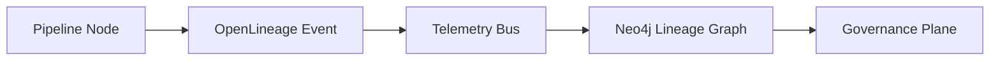

# 🛰️ **Kansas Frontier Matrix — Pipeline Validation & Observability Guide (v11.0.0)**  
`docs/pipelines/validation-observability.md`

**Purpose:**  
Define the full **v11 LTS** validation, observability, lineage-governance, and QA/QC requirements for all KFM ETL, AI/ML, streaming, and batch pipelines. Ensures deterministic quality gates, continuous lineage capture, FAIR+CARE adherence, sovereignty compliance, sustainability telemetry, and platform-wide traceability.

---

## 📘 Executive Summary

Pipeline validation and observability in KFM v11 enforce:

- Deterministic, reproducible transformations  
- Full lineage (PROV-O + OpenLineage v2.5)  
- FAIR+CARE + Indigenous sovereignty protection  
- Quality gates enforced at every DAG node  
- Rigorous schema validation (STAC, DCAT, JSON-LD, CIDOC-CRM, GeoSPARQL, OWL-Time)  
- Sustainability metrics (energy, carbon, environmental cost)  
- Automated governance gates (GovHooks v4)  
- Real-time monitoring of pipeline drift, bias, latency, and failure domains  

The result: **a self-auditing, self-governing ETL system** with complete traceability and observability from ingest → graph → APIs → UI → Story Nodes → Focus Mode.

---

## 🧪 1. Validation Architecture

Validation occurs at three layers:

### 1.1 Structural Validation  

Ensures all ingested and transformed data conforms to:

- STAC v11  
- DCAT v11  
- JSON-LD w/ KFM context  
- GeoJSON  
- CIDOC-CRM compatible graph nodes  
- OWL-Time temporal logic  
- PROV-O lineage  
- CRS and bounding box checks  

Tools:  

- `schema-lint-v11`  
- `geojson-lint`  
- `crs-check`  
- `bbox-check`  

---

### 1.2 Semantic Validation  

Verifies:

- Required ontology fields present  
- Temporal reasoning consistency  
- Spatial consistency and topology rules  
- FAIR+CARE labels applied  
- Sovereignty compliance (H3 r7 generalization for cultural sites)  
- Entity uniqueness, canonical IDs, and URI consistency  

Tools:  

- SHACL (shape_schema_ref)  
- Ontology-reasoning inference tests  
- `lineage-audit-v11`  

---

### 1.3 Operational Validation  

Monitors:

- Latency thresholds  
- Throughput  
- Retry success/failure  
- Dead-letter queues  
- Energy & carbon cost per pipeline step  
- Reliability engine metrics (WAL, rollback counts, lineage gaps)  

Metrics are sent to the lineage/telemetry bus automatically.

---

## 🔭 2. Observability Architecture

Observability comes from:

- OpenLineage v2.5 bus  
- Neo4j lineage nodes (`prov:Activity`)  
- Time-series telemetry (Prometheus/Grafana)  
- Sustainability instrumentation  
- AI/ML explainability logs (SHAP/LIME)  
- Error and exception propagation chain  
- Policy audit logs (GovHooks v4)  
- Masking / redaction logs  

---

## 📊 3. Quality Gates (QG-11)

Every pipeline node MUST pass:

1. **Structural Gate**  
2. **Semantic Gate**  
3. **Sovereignty Gate**  
4. **FAIR+CARE Gate**  
5. **Sustainability Gate**  
6. **Lineage Completeness Gate**  
7. **Downstream Impact Gate**  

Failure at any gate → WAL rollback + quarantine.

---

## 🧱 4. Drift, Bias & Stability Monitoring

AI/ML pipelines undergo:

- Bias profiling  
- Drift detection (concept + data drift)  
- Model age & staleness checks  
- Confidence distribution monitoring  
- Explainability freshness (SHAP decay)  

Results feed into the governance ledger and are surfaced in observability dashboards.

---

## 🛰️ 5. Sustainability Telemetry

Tracked per pipeline run:

- Energy consumption (Wh)  
- Carbon emissions (gCO₂e)  
- Compute intensity  
- Memory and disk IO  
- Data movement cost  
- Network carbon impact  

These are published as STAC Items in `data/stac/telemetry/` and linked into governance and sustainability reports.

---

## 🧭 6. Focus Mode & Story Node Integration

Validation ensures:

- Focus Mode summaries only use **validated** graph entities  
- Story Nodes derive only from validated narratives and entities  
- All narrative generation includes explicit provenance links  
- All temporal assertions pass OWL-Time checks  
- All spatial assertions pass GeoSPARQL checks  

This guarantees that AI-driven narratives sit atop a fully validated, traceable data substrate.

---

## 🛡️ 7. Governance Plane Enforcement

GovHooks v4 enforces:

- CARE/sovereignty restrictions  
- Data masking requirements  
- License validation  
- Risk scoring  
- Pipeline promotion approvals  
- Lineage immutability  

Any violation → automatic failure of pipeline promotion and emission of a governance incident record.

---

## 🕰️ Version History

| Version | Date       | Notes                                                                 |
|--------:|-----------:|-----------------------------------------------------------------------|
| v11.0.0 | 2025-11-20 | Initial release of the v11 Pipeline Validation & Observability Guide. |

---

## 🔗 Footer

**• [⬅ Back to Pipelines](README.md)** ·  
**[📚 KFM Documentation Root](../README.md)** ·  
**[🌐 Project Homepage](../../README.md)**  
