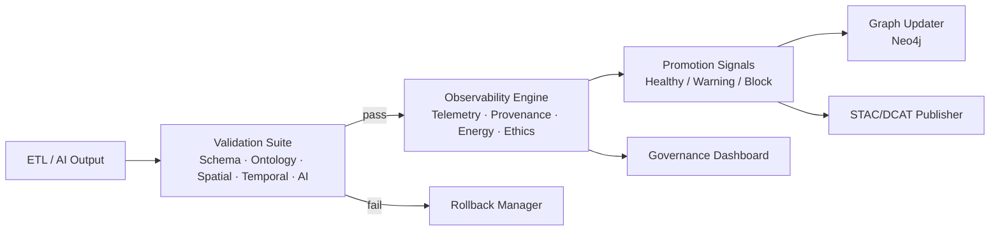
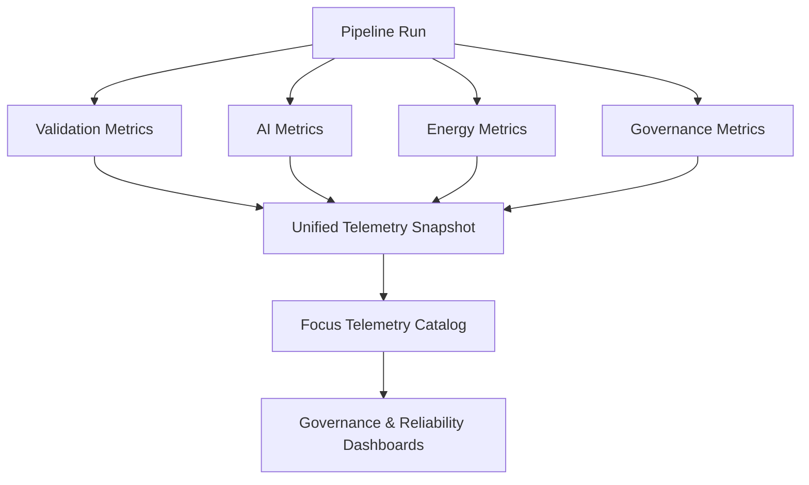

<div align="center">

# 🛡️ **Validation & Observability Pipeline (v11.2)**  
`docs/pipelines/validation-observability/README.md`

[]()
[]()
[]()
[]()
[]()
[]()

### Ensuring correctness, reproducibility, explainability, and ethical integrity for all autonomous KFM updates.

</div>

---

## 📘 1. Purpose

The **Validation & Observability Pipeline** is the **primary safety, governance, and quality-assurance backbone** for autonomous activities within the Kansas Frontier Matrix (KFM v11.2).

Its responsibilities include:

- Validating every ETL, AI, STAC, DCAT, and Neo4j update  
- Enforcing metadata completeness, schema validity, ontology alignment  
- Producing reproducible evidence (SBOM, SLSA, checksums, OpenLineage traces)  
- Guaranteeing FAIR+CARE ethics compliance  
- Powering operational reliability (halt-on-failure, rollback, WAL correctness)  
- Generating cross-domain observability and health metrics  

This pipeline ensures that **all promoted data is correct, verified, ethical, and reproducible**.

---

## 🗂️ 2. Directory Layout (v11.2 · Immediate + One Branch)

```text
📁 docs/pipelines/validation-observability/       — Root for validation & observability docs
│   📂 checkpoints-otel/                          — GE Checkpoints + OpenTelemetry metrics spec
│   📂 dashboards/                                — Observability & governance dashboard specs
│   📄 README.md                                  — This validation & observability root index
```

Deeper structure (schemas, tests, logs, governance reports) is defined in subordinate READMEs.

---

## 🧱 3. High-Level Architecture



Validation gates enforce correctness and ethics; observability layers provide the evidence and metrics required for governance and SLO decisions.

---

## 🧪 4. Validation Suite (5-Layer Model)

Validation executes in **strict sequence**. Any failure halts downstream processing and triggers rollback.

### 4.1 Structural Validation

Ensures syntactic and structural correctness:

- JSON Schema / Pydantic model validation  
- Great Expectations quality suites  
- STAC 1.0 validation  
- DCAT 3.0 field completeness  
- File integrity (size, encoding, hash match)  
- GeoTIFF/COG headers + CRS correctness  

### 4.2 Semantic Validation

Ensures semantic correctness using KFM ontologies:

- CIDOC-CRM entity classes and relations  
- OWL-Time intervals and temporal entities  
- GeoSPARQL geometry typing and spatial relationships  
- PROV-O event/process alignment  
- Story Node v3 link validity  
- Domain/range constraints and type compatibility  

### 4.3 Spatiotemporal Validation

Ensures geospatial and temporal grounding:

- `ST_IsValid` geometry checks  
- Bounding-box alignment, topology checks  
- Raster alignment with Vertical-Axis v11 (NAVD88/GEOID18)  
- Timeline precision, interval logic (no inverted intervals)  
- Indigenous-site masking (e.g. H3 generalization) for sensitive layers  

### 4.4 AI/ML Output Validation

Ensures AI output quality and trust:

- OCR confidence thresholds  
- NER accuracy benchmarks  
- Summarization factual-consistency guardrails  
- Embedding drift detection & distribution checks  
- SHAP/LIME explainability bundles  
- Hallucination detection based on Neo4j & STAC data  

Unverifiable or hallucinated AI output MUST be blocked.

### 4.5 Ethical & License Validation

Ensures FAIR+CARE & licensing compliance:

- Indigenous data protection policies  
- Archaeology masking rules  
- License + attribution correctness  
- CARE authority & consent checks  
- Jurisdiction and privacy/exposure risk scoring  

---

## 🛰️ 5. Observability Engine

The Observability Engine collects **multi-domain telemetry** for every run governed by this pipeline.

### 5.1 Performance Metrics

- CPU, memory, GPU usage  
- Node-by-node ETL timing  
- I/O and network latency  
- Cache effectiveness and hit rates  

### 5.2 Energy & Sustainability Metrics

Aligned with **ISO 50001** and **ISO 14064**:

- Energy consumption estimates (Wh)  
- Carbon impact (gCO₂e)  
- Peak usage patterns and anomalies  

### 5.3 Data Quality Telemetry

Tracks:

- Schema violations over time  
- Spatial/temporal error counts  
- AI performance drift  
- Changes in STAC and DCAT completeness  
- Diff size vs prior releases  

### 5.4 Governance Telemetry

Captures:

- FAIR+CARE health metrics  
- Sensitive-site usage patterns  
- Ethical violation signals  
- Attribution completeness  
- Provenance chain completeness  

---

## 📈 6. Observability Diagram



This unified snapshot ultimately feeds `focus-telemetry.json` per release.

---

## 🔁 7. Rollback, WAL & Fail-Safe Systems

### 7.1 Write-Ahead Log (WAL)

The WAL stores:

- All transformations and their parameters  
- All metadata edits (including STAC/DCAT changes)  
- All hash computations  
- Key ETL intermediates  

Supports deterministic replay and point-in-time recovery.

### 7.2 Deterministic Retry Engine

- Retries transient failures only  
- Uses exponential backoff  
- AI reruns use fixed random seeds  
- Output hashes must be stable across re-runs with identical inputs  

### 7.3 Rollback Manager

Rollback is triggered when:

- Validation fails at any critical gate  
- Ethics/CARE violation is detected  
- STAC/DCAT or ontology inconsistencies are found  
- Provenance is incomplete  
- Reproducibility checks fail  

Rollback restores:

- Previous graph snapshot  
- Previous STAC/DCAT catalogs  
- WAL checkpoint  
- Last-known-good ETL outputs  

---

## 🧩 8. Relationship to Checkpoints + OTel Module

The **GE Checkpoints + OpenTelemetry Metrics Integration** module is a sub-spec of this pipeline:

- Path: `docs/pipelines/validation-observability/checkpoints-otel/README.md`  
- Defines:
  - GE checkpoint contracts  
  - OTel metric names/labels  
  - Runner requirements  
  - CI/CD gating rules  

This root README describes the broader pipeline in which that module operates.

---

## 🗂️ 9. Related Documents

- `docs/pipelines/reliable-pipelines/README.md` — Reliable Pipelines v11 core  
- `docs/pipelines/validation-observability/checkpoints-otel/README.md` — GE + OTel integration spec  
- `docs/standards/kfm_markdown_protocol_v11.2.2.md` — Markdown rules  
- `docs/standards/security/sbom-standard.md` — SBOM requirements  
- `docs/standards/security/slsa-attestation-standard.md` — SLSA provenance  
- `docs/standards/faircare/FAIRCARE-GUIDE.md` — FAIR+CARE principles  
- `docs/architecture/data-governance/` — Data governance architecture  
- `docs/architecture/ai-system/` — AI system architecture and guards  

---

## 🕰️ 10. Version History

| Version  | Date       | Summary                                                                                             |
|---------:|------------|-----------------------------------------------------------------------------------------------------|
| v11.2.0  | 2025-11-27 | Upgraded to KFM-MDP v11.2.2; added directory layout, telemetry schemas, governance flags, and tighter CI gating. |
| v11.0.1  | 2025-11-23 | Full upgrade to KFM-MDP v11 style; fixed structure; enriched governance metadata.                  |
| v11.0.0  | 2025-11-18 | Initial v11 version prior to MDP full adoption.                                                     |

---

<div align="center">

**Kansas Frontier Matrix — Validation & Observability Pipeline (v11.2)**  
*Integrity · Reliability · FAIR+CARE Governance*  

[⬅ Back to Pipelines](../README.md) ·  
[🛡 Security Standards](../../standards/security/README.md) ·  
[🏛 Governance](../../standards/governance/ROOT-GOVERNANCE.md)

</div>
