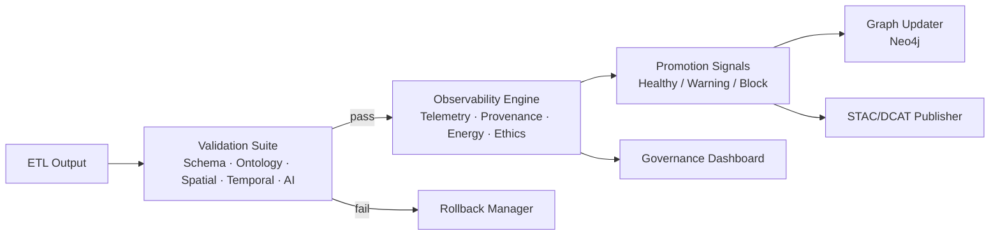
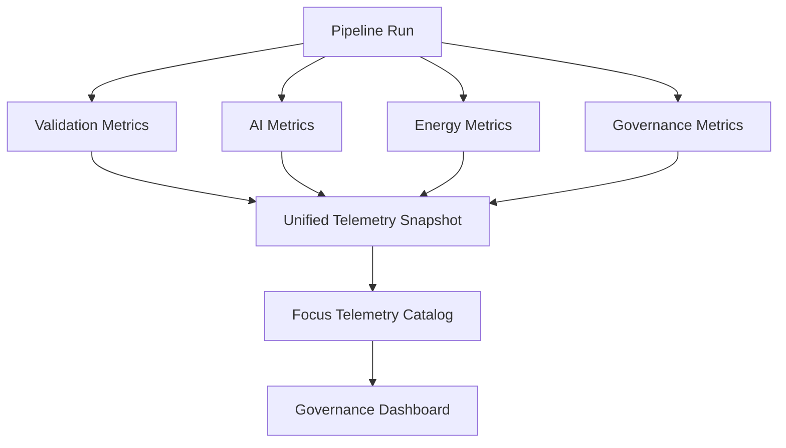

<div align="center">

# 🛡️ **Validation & Observability Pipeline**
`docs/pipelines/validation-observability/README.md`

### **Ensuring correctness, reproducibility, explainability, and ethical integrity for all autonomous KFM updates.**

</div>

--- ✦ ---

## 🧭 Purpose

The Validation & Observability Pipeline is the **central safety layer** for all autonomous operations within the Kansas Frontier Matrix.  
Its purpose is to:

- Validate **every dataset**, **ETL output**, **STAC item**, **DCAT record**, and **Neo4j update**
- Monitor system performance, AI behavior, data quality, energy usage, and governance metrics
- Provide **SLSA-grade provenance**, including reproducible logs and SBOM integration
- Guarantee FAIR+CARE compliance across all data entering the platform
- Support rollback, WAL integrity, and “halt-on-failure” reliability guarantees

--- ✦ ---

## 🧱 High-Level Architecture



--- ✦ ---

# 🧪 Validation Suite (Five Layers)

Validation is executed in strict order.  
Failure at any layer **halts the pipeline** and triggers a rollback + anomaly log.

---

## **1. Structural Validation**

Ensures the dataset is syntactically correct and well-formed:

- JSON Schema & Pydantic checks  
- Great Expectations quality suites  
- STAC item validation  
- DCAT field completeness  
- File integrity (hash match, size, encoding)  
- CRS verification for GeoJSON / TIFF / vector layers  

**Must pass for further processing.**

---

## **2. Semantic Validation**

Ensures **meaningful correctness**, aligned with:

- CIDOC-CRM  
- OWL-Time  
- GeoSPARQL  
- PROV-O  
- KFM Core Ontology  

Checks include:

- Event → Place → Time triads  
- Timeline logic (non-inverted intervals, proper precision)  
- Story Node linkage validity  
- Entity typing and domain/range constraints  

---

## **3. Spatiotemporal Validation**

Ensures data is correctly positioned in **space and time**:

- Geometry validity (`ST_IsValid`)  
- Bounding box / polygon alignment  
- Raster geospatial correctness  
- Temporal precision fields (`uncertain`, `approximate`, `interval`)  
- Archaeology-specific protections (blur / centroid shift)  

---

## **4. AI/ML Output Validation**

All AI-derived content receives:

- OCR confidence scoring  
- NER F1 threshold checks  
- Summarization factual consistency verification  
- Embedding drift detection  
- SHAP/LIME explainability snapshots  
- Hallucination guardrails (must match known graph entities)  

If any AI output cannot be verified → **blocked**.

---

## **5. Ethical & License Validation**

KFM is governed by FAIR+CARE ethics:

- License compliance checks  
- Indigenous community protection rules  
- Sensitive archaeology handling  
- Public-exposure risk scoring  
- Required attributions verified  
- Data governance metadata present  
- Legal compliance (jurisdictional filters)  

--- ✦ ---

# 🛰️ Observability System

The Observability Engine records **every measurable aspect** of an autonomous run:

---

## **Performance Metrics**

- CPU / RAM / GPU usage  
- ETL step duration  
- I/O and network latency  
- Cache hit/miss  

---

## **Energy & Sustainability Metrics**

KFM adheres to **ISO 50001**:

- kWh per data operation  
- Carbon impact estimates  
- Peak consumption alerts  

---

## **Data Quality Telemetry**

Automatically logs:

- Schema failures  
- Spatial errors  
- AI accuracy degradation  
- Missing STAC/DCAT metadata  
- Diff size vs baseline  

---

## **Governance Telemetry**

- CARE compliance signals  
- FAIR metric scoring  
- Privacy flags  
- Indigenous rights flag violations  
- Attribution completeness  

---

## Observability Diagram



--- ✦ ---

# 🔁 Rollback, WAL & Fail-Safe Mechanisms

## **Write-Ahead Log (WAL)**  
Stores:

- every transformation  
- every metadata edit  
- every computed hash  
- every ETL intermediate  

Supports:

- deterministic replay  
- forensics  
- rollback  
- version pinning  

---

## **Deterministic Retry Engine**

Retries occur only for transient failures (timeouts, rate limits).

Rules:

- exponential backoff  
- seed-fixed AI re-evaluations  
- no nondeterministic randomness  
- hashed reproducible outputs  

---

## **Rollback Manager**

Triggered when:

- validation fails  
- ethics violation occurs  
- telemetry anomaly detected  
- reproducibility fails  
- STAC/DCAT inconsistency found  

Restores:

- prior graph snapshot  
- prior STAC collection  
- prior DCAT catalog  
- prior ETL output  
- prior WAL state  

--- ✦ ---

# 🗂 Directory Layout

```
validation-observability/
├── README.md  ← this file
├── schemas/
│   ├── structural.json
│   ├── semantic.json
│   ├── spatiotemporal.json
│   ├── ai-validation.json
│   └── ethics.json
├── tests/
│   ├── gx/
│   ├── schema/
│   ├── ontology/
│   ├── ai/
│   └── ethics/
├── logs/
│   ├── telemetry/
│   ├── provenance/
│   └── anomalies/
└── dashboards/
    ├── observability.md
    ├── ai-behavior.md
    └── governance.md
```

--- ✦ ---

# 📘 Related Documents

- `docs/pipelines/reliable-pipelines.md`
- `docs/standards/kfm_markdown_protocol_v11.md`
- `docs/standards/markdown_rules.md`
- `docs/standards/faircare.md`
- `docs/architecture/AI-System/`
- `docs/architecture/Data-Governance/`

--- ✦ ---

<div align="center">

**© 2025 Kansas Frontier Matrix — FAIR+CARE Compliant  
Diamond⁹ Ω / Crown∞Ω Ultimate Certified**  
*Ad astra per data — to the stars through data.*

</div>
