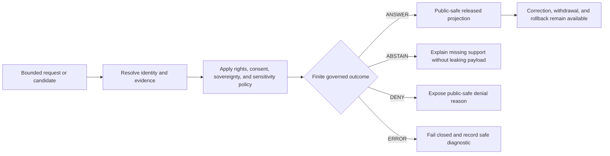

<!-- [KFM_META_BLOCK_V2]
doc_id: kfm://doc/policy/sensitivity/readme
title: Sensitivity guidance compatibility index
type: compatibility-index; sensitivity-guidance-routing; public-safe; non-enforcing
authority_class: human-readable-documentation
version: v0.2-draft
status: draft; repository-reconciled; noncanonical; non-enforcing; migration-hold
owners:
  - UNKNOWN — documentation, policy, domain, privacy, security, sovereignty, and release steward assignments require verification
created: 2026-08-23
updated: 2026-08-23
owning_root: docs/
responsibility: Contain and index public-safe domain sensitivity guidance while routing executable rules, decisions, validation, review, and release state to their canonical responsibility roots.
policy_label: public; sensitivity; compatibility; documentation-only
truth_posture: CONFIRMED current child inventory and repository responsibility boundaries; PROPOSED domain guidance and future consolidation; UNKNOWN deployed policy enforcement and external consumers; HOLD on migration or retirement without authority and consumer closure
source_basis:
  - repository evidence at the authoring checkpoint
  - connected KFM architecture and implementation documents used as read-only idea sources
related:
  - ../README.md
  - ../../domains/README.md
  - ../../security/README.md
  - ../../doctrine/directory-rules.md
  - ../../../policy/sensitivity/README.md
  - ../../../contracts/policy/sensitivity_label.md
  - ../../../tests/policy/README.md
non_effects:
  - does_not_create_a_parallel_policy_authority
  - does_not_classify_transform_release_or_publish_any_real_record
  - does_not_activate_or_modify_policy_or_runtime_enforcement
  - does_not_assign_review_release_or_sovereign_authority
  - does_not_move_rename_deprecate_tombstone_or_delete_any_path
  - does_not_authorize_release_deployment_promotion_or_publication
tags: [kfm, policy, sensitivity, compatibility, domains, public-safe]
[/KFM_META_BLOCK_V2] -->

<a id="sensitivity-guidance-compatibility-index"></a>

# Sensitivity guidance compatibility index

> [!IMPORTANT]
> `docs/policy/sensitivity/` is a **noncanonical documentation lane**. It contains public-safe navigation and domain review prompts. It does not own executable sensitivity policy, classifications, transformations, approvals, access decisions, release state, or publication authority.

> [!CAUTION]
> Do not place real protected payloads in this directory. Prohibited examples include living-person data, genomic material, consent tokens, exact protected species or archaeological locations, private well or household records, restricted infrastructure details, credentials, classified material, or reconstruction-enabling fixtures.

## Current status

| Item | Bounded status |
|---|---|
| Directory placement | **CONFIRMED existing path.** Same-path containment is allowed under `docs/`; substantive growth, migration, or retirement remains governed. |
| Canonical executable policy | **CONFIRMED responsibility root:** `policy/sensitivity/`. This index does not supersede it. |
| Domain cards | **PROPOSED, non-enforcing guidance.** Thirteen domain Markdown files are indexed below. |
| Existing fauna card | **PROPOSED scaffold.** It predates the remaining-domain build-out and is not silently upgraded by this index. |
| Runtime enforcement | **UNKNOWN.** No deployed evaluator, active bundle, or public enforcement claim is made here. |
| Steward assignments | **UNKNOWN / NEEDS VERIFICATION.** A complete-looking document does not assign authority. |
| Migration or deletion | **HOLD.** Requires accepted path authority, complete consumer inventory, replacement or deprecation plan, review, correction handling, and rollback. |

## Operating law

The documentation cards apply one bounded rule:

> When rights, consent, sovereignty, cultural care, living-person privacy, genomic sensitivity, rare-species or archaeological location exposure, private-land effects, critical infrastructure, emergency operations, or reconstruction risk cannot be resolved, narrow the claim and precision or return `HOLD`, `ABSTAIN`, `DENY`, or `ERROR` through the owning governed interface.

They do not select an outcome for a real record. A future operational decision must resolve the governing policy bundle, input identity, evidence, rights, sensitivity, review, release, correction, and rollback state.

## Domain guidance set

All cards are public-safe documentation. “PROPOSED” means the handling prompts are not accepted executable policy.

| Domain | Guidance card | Current bounded posture |
|---|---|---|
| Agriculture | [`agriculture.md`](./agriculture.md) | **PROPOSED.** Reviews operator/field linkage, livestock and biosecurity, water use, treatment, telemetry, small cells, and commercial reconstruction. |
| Archaeology | [`archaeology.md`](./archaeology.md) | **PROPOSED.** Defaults to strong protection for exact sites, burials, sacred places, cultural knowledge, private access, vulnerable collections, and 3D reconstruction. |
| Atmosphere | [`atmosphere.md`](./atmosphere.md) | **PROPOSED.** Separates observation, model, forecast, alert, regulatory, and low-cost sensor roles while protecting private sensing and live operations. |
| Fauna | [`fauna.md`](./fauna.md) | **PROPOSED scaffold.** Existing card; exact occurrence and protected-location treatment still require canonical policy and review evidence. |
| Flora | [`flora.md`](./flora.md) | **PROPOSED.** Reviews rare and culturally important plants, private land, specimen labels, restoration, harvest pressure, genetic resources, and absence semantics. |
| Geology and natural resources | [`geology.md`](./geology.md) | **PROPOSED.** Separates observations, interpretations, models, resource potential, legal status, and value while protecting proprietary and vulnerable subsurface detail. |
| Habitat | [`habitat.md`](./habitat.md) | **PROPOSED.** Prevents suitability, connectivity, designation, and occupancy collapse and reviews model inversion into protected occurrences. |
| Hazards | [`hazards.md`](./hazards.md) | **PROPOSED.** Protects responders, shelters, vulnerable people, hazardous materials, critical dependencies, and live operations while preserving alert validity. |
| Hydrology | [`hydrology.md`](./hydrology.md) | **PROPOSED.** Reviews private wells, water quality, water rights, tribal interests, critical water systems, contamination, and model/observation distinctions. |
| People, genealogy, DNA, and land | [`people-dna-land.md`](./people-dna-land.md) | **PROPOSED; highest caution.** Defaults fail-safe for living-person, genomic, biometric, kinship, affiliation, address, parcel, consent, and linkage risk. |
| Roads, rail, and trade | [`roads-rail-trade.md`](./roads-rail-trade.md) | **PROPOSED.** Protects live tracking, private shipments, hazardous-material movement, restricted access, critical chokepoints, and operational topology. |
| Settlements and infrastructure | [`settlements-infrastructure.md`](./settlements-infrastructure.md) | **PROPOSED.** Protects residents, occupancy, utilities, secure facilities, underground assets, access controls, dependencies, outages, and 3D reconstruction. |
| Soil | [`soil.md`](./soil.md) | **PROPOSED.** Separates map units, pedons, samples, sensors, and models while protecting private fields, contamination, cultural sites, rare habitat, and property-level inference. |

### Coverage rule

The presence of a card does not prove that the corresponding domain is admitted, implemented, active, released, or published. The set is a documentation inventory, not a runtime registry or policy-bundle selector.

## Common sensitivity dimensions

Every domain card asks reviewers to consider the complete composed output.

| Dimension | Review question |
|---|---|
| Identity | What stable subject, source, dataset, layer, model, decision, and release identities are involved? |
| Authority | Who can decide use, access, transformation, release, correction, withdrawal, and rollback? Is that authority evidenced? |
| Rights and consent | Do license, contract, confidentiality, lawful basis, consent, community authority, or sovereign conditions permit the proposed use? |
| Spatial precision | Can coordinates, centroids, bounding boxes, tiles, images, terrain, 3D scenes, directions, or nearby features reveal the subject? |
| Temporal precision | Can issue, observation, valid, event, movement, treatment, outage, or release time expose a person, operation, or vulnerable site? |
| Attribute precision | Do rarity, health, genomic, commercial, infrastructure, condition, count, or status fields increase consequence? |
| Source role | Are observation, model, forecast, scenario, interpretation, designation, advisory, and generated summary kept distinct? |
| Joinability | Can parcels, addresses, imagery, routes, ownership, telemetry, public records, or cross-domain links reconstruct protected detail? |
| Small cells and differencing | Can one subject dominate an aggregate or be isolated across repeated releases? |
| Carrier leakage | Do APIs, maps, tiles, URLs, search, exports, caches, logs, analytics, prompts, screenshots, or offline packages retain denied detail? |
| Currentness | Is the underlying policy, right, consent, sensitivity, alert, designation, correction, or source status current? |
| Recovery | Is there an auditable correction, withdrawal, revocation, and rollback path? |

A public source in one dimension does not automatically make a joined output public-safe.

## Public-safe handling posture

### Normally acceptable only after governed review

Potential public candidates generally use:

- broad geographic or sufficiently large cohort aggregation;
- intentional spatial generalization, displacement, or suppression;
- delayed or binned time rather than live operational precision;
- removal of direct and quasi-identifiers;
- observed-versus-modeled and authority-role disclosure;
- public-safe synthetic fixtures rather than real protected examples;
- EvidenceRefs that resolve to admissible evidence at the authorized access level;
- visible uncertainty, source limitations, correction state, and release identity.

### Fail-safe conditions

Return or retain `HOLD`, `ABSTAIN`, `DENY`, `ERROR`, or `QUARANTINE` when:

- required authority, rights, consent, sovereignty, or consultation is unresolved;
- a direct dependency or external consumer cannot be inventoried;
- a public carrier can reconstruct protected detail;
- the proposed output collapses observation, model, forecast, interpretation, designation, or generated language;
- small-cell, dominance, linkage, or differencing risk remains material;
- current sensitivity, policy, correction, or release state cannot be resolved;
- validation cannot execute safely or evidence closure fails;
- the only protection is client-side hiding, a disclaimer, or an unreviewed AI judgment.

## Responsibility routing

Directory Rules assign homes by responsibility, not by the word “sensitivity.”

| Responsibility | Owning surface | This directory’s role |
|---|---|---|
| Human public-safe guidance | `docs/` | **Contains navigation and review prompts.** |
| Executable sensitivity and access rules | `policy/sensitivity/` and accepted policy homes | **Links only; does not redefine.** |
| Domain meaning and context | accepted `docs/domains/` paths | **Links and escalates.** |
| Security, privacy, geoprivacy, and threat guidance | accepted `docs/security/` paths | **Links and escalates.** |
| Semantic contracts | `contracts/` | **No semantic authority here.** |
| Machine shape | `schemas/` | **No schema authority here.** |
| Synthetic test data | `fixtures/` | **No real protected payloads here.** |
| Reusable validators | `tools/validators/` | **No executable validator here.** |
| Executable tests | `tests/` | **No test authority here.** |
| Runtime policy evaluation | governed packages and APIs | **No browser-to-policy or browser-to-store shortcut here.** |
| Decisions, reviews, receipts, corrections, withdrawals, rollback, and release | their accepted governance, data, and release roots | **No approval or lifecycle transition here.** |

Do not create parallel policy, schema, contract, registry, fixture, proof, receipt, release, or publication homes beneath this directory.

## Governed flow

The cards assume, but do not implement, a flow such as:



The lifecycle remains:

```text
RAW -> WORK / QUARANTINE -> PROCESSED -> CATALOG / TRIPLET -> PUBLISHED
```

Promotion is a governed state transition, not a file move. A document, card, fixture, validator PASS, receipt, pull request, merge, or catalog row does not by itself move a record through that lifecycle.

## AI boundary

AI may help inventory, compare, summarize, and draft a candidate. It must not:

- invent authority, consent, consultation, rights, or living-person status;
- decide a real sensitivity tier or release outcome without the accepted policy and human authority;
- inspect or reproduce raw protected payloads beyond its authorized governed input;
- infer tribal affiliation, kinship, DNA, health, ownership, compliance, intent, exact protected location, or critical vulnerability from plausibility;
- turn a withheld input into a confident absence claim;
- expose hidden chain-of-thought, denied context, credentials, or restricted evidence;
- convert generated prose into an EvidenceBundle, PolicyDecision, ReviewRecord, release, or publication fact.

EvidenceBundle and accepted decision objects outrank generated language.

## Authoring requirements for domain cards

A new or revised card should:

1. remain public-safe and contain no real protected example;
2. use explicit `CONFIRMED`, `PROPOSED`, `UNKNOWN`, `NEEDS VERIFICATION`, and `HOLD` labels;
3. identify domain-specific sensitivity triggers without pretending to classify real records;
4. separate safer candidates from held or denied candidates;
5. cover precision, joins, reconstruction, time, source role, and carrier leakage;
6. define the minimum decision packet needed for operationalization;
7. identify cross-domain escalations;
8. route each responsibility to its existing root;
9. state validation and open verification work;
10. preserve correction, withdrawal, rollback, and non-effects.

## Validation posture

For this documentation set, useful bounded checks include:

- one H1 and one balanced `KFM_META_BLOCK_V2` per card;
- lowercase, portable filenames;
- balanced fenced blocks and Mermaid syntax;
- no duplicate explicit anchors or heading slugs within a file;
- all local index links resolve;
- no tabs, trailing whitespace, or missing final newline;
- no real coordinates, people, genomic data, credentials, or operational vulnerabilities;
- no claim that a card is executable policy or that a domain is released;
- exact diff and base/head lineage recorded in the pull request;
- hosted checks reported without smoothing over inherited or introduced failures.

These checks prove document structure and bounded assertions only. They do not prove policy correctness, sensitivity clearance, review, release, deployment, promotion, or publication.

## Migration and retirement hold

This directory is retained as a compatibility and containment lane. Substantive consolidation, move, deprecation, tombstoning, or deletion requires:

1. accepted path and authority decision;
2. complete internal and known external consumer inventory;
3. reviewed target under the correct responsibility root;
4. redirect, link, or migration plan as appropriate;
5. preservation of document identity, history, corrections, and citations;
6. validation of all inbound links and generated indexes;
7. rollback or forward-fix target;
8. separation of author, reviewer, release, and publication duties appropriate to materiality.

Until those dependencies close, migration and retirement remain **HOLD**.

## Open verification register

| Item | Current state | Required evidence |
|---|---|---|
| Canonical domain identifiers and exact path map | **NEEDS VERIFICATION** | Current accepted registries, ADRs, and domain documentation inventory. |
| Accepted sensitivity bundle for every domain | **UNKNOWN** | Bundle registry, semantic contracts, schemas, fixtures, validators, and evaluator binding. |
| Deployed enforcement | **UNKNOWN** | Runtime configuration, exact build, tests, logs, and governed response evidence. |
| Reviewer and release authority | **UNKNOWN / HOLD** | Accepted role register, independent review evidence, and platform controls. |
| External consumers of this docs lane | **UNKNOWN** | Repository, site, prompt, wiki, downstream, and deployment inventory. |
| Reconstruction resistance | **NEEDS VERIFICATION** | Adversarial tests across APIs, maps, tiles, exports, caches, logs, AI, and cross-domain joins. |
| Rights, consent, consultation, and sovereignty coverage | **NEEDS VERIFICATION** | Subject-specific authoritative records and current policy decisions. |
| Correction, withdrawal, and rollback drills | **NEEDS VERIFICATION** | Deterministic fixtures, receipts, exact-head tests, and reviewed run records. |
| Hosted validation for this set | **PENDING until observed** | Exact-head workflow results and human review. |

## Related repository paths

- [Documentation policy boundary](../README.md)
- [Domain documentation index](../../domains/README.md)
- [Security documentation index](../../security/README.md)
- [Directory Rules](../../doctrine/directory-rules.md)
- [Canonical sensitivity policy root](../../../policy/sensitivity/README.md)
- [Sensitivity label semantic contract](../../../contracts/policy/sensitivity_label.md)
- [Policy test boundary](../../../tests/policy/README.md)

## Non-effects

This index and its domain cards do not:

- classify, transform, redact, generalize, suppress, release, or publish any real record;
- activate a policy bundle or runtime evaluator;
- assign domain, privacy, security, tribal, legal, review, release, or publication authority;
- create a `SensitivityLabel`, `PolicyDecision`, `RedactionReceipt`, EvidenceBundle, proof, release, correction, withdrawal, or rollback object;
- expose a new API, map layer, tile, search index, AI route, export, source, or public client surface;
- move, rename, deprecate, tombstone, or delete any repository path;
- merge a pull request, deploy software, promote lifecycle state, or publish an artifact.

---

<sub>Version `v0.2-draft` · compatibility and containment index · thirteen public-safe domain guidance cards · executable authority remains outside `docs/`</sub>
