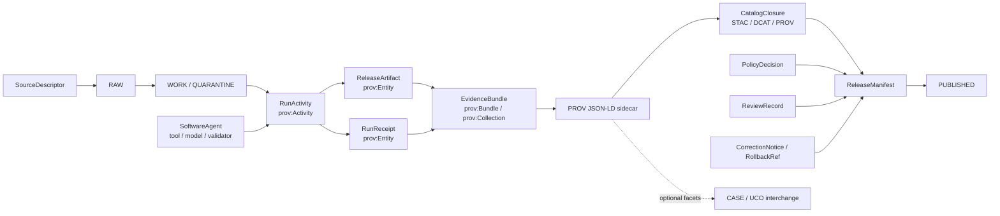

<!-- [KFM_META_BLOCK_V2]
doc_id: kfm://doc/NEEDS-VERIFICATION-docs-provenance-readme
title: docs/provenance
type: standard
version: v1
status: draft
owners: OWNER_TBD_NEEDS_VERIFICATION
created: 2026-05-06
updated: 2026-05-06
policy_label: POLICY_LABEL_TBD_NEEDS_VERIFICATION
related: [../../README.md, ../README.md, ../standards/KFM_PROV_PROFILE.md, ../adr/ADR-0018-prov-stac-dcat-catalog-mapping.md, ../adr/ADR-0017-meta-block-v2.md, ../standards/KFM_MARKDOWN_WORK_PROTOCOL.md]
tags: [kfm, provenance, prov-o, case, uco, evidencebundle, receipts, shacl, json-ld]
notes: [Target path docs/provenance/README.md is PROPOSED because the current GitHub main check did not find this file; created and updated dates reflect this draft generation date, not git history; owners and policy label need CODEOWNERS or document-registry verification; companion context, shape, and example paths are proposed scaffolds until committed and validated.]
[/KFM_META_BLOCK_V2] -->

<a id="top"></a>

# `docs/provenance/`

Machine-readable provenance guidance for KFM EvidenceBundle, RunReceipt, release artifact, and audit-ledger graphs using PROV-O first, with optional CASE/UCO alignment.

> [!IMPORTANT]
> **Status:** `experimental`  
> **Owners:** `OWNER_TBD_NEEDS_VERIFICATION`  
> **Path:** `docs/provenance/README.md`  
> **Truth posture:** `CONFIRMED KFM doctrine` / `PROPOSED new directory` / `UNKNOWN validator and CI enforcement depth`

<div align="left">


</div>

**Quick jumps:** [Scope](#scope) · [Repo fit](#repo-fit) · [Inputs](#inputs) · [Exclusions](#exclusions) · [Directory tree](#directory-tree) · [Quickstart](#quickstart) · [Usage](#usage) · [Flow](#flow) · [Crosswalks](#crosswalks) · [Definition of done](#definition-of-done) · [FAQ](#faq) · [Appendix](#appendix-companion-file-scaffolds)

---

## Scope

This directory is the proposed home for lightweight provenance authoring assets that help KFM emit, validate, and review public-safe provenance graphs.

The goal is narrow:

- describe **what happened** to an artifact, bundle, claim-support package, or release object;
- link KFM receipts, evidence, release, correction, and audit objects without flattening them;
- provide copy/paste starter assets for JSON-LD context, SHACL validation, and example graphs;
- keep PROV-O as the primary outward lineage vocabulary;
- use CASE/UCO only where digital-investigation interchange, file/tool/action/identity facets, or hash modeling materially help.

> [!WARNING]
> PROV, CASE, UCO, JSON-LD, and SHACL do not make a KFM artifact publishable by themselves. KFM policy, review, evidence, release, correction, and rollback objects remain first-class governance surfaces.

[Back to top](#top)

---

## Repo fit

| Relationship | Path | Status | Role |
|---|---|---:|---|
| This directory README | `docs/provenance/README.md` | `PROPOSED` | Orientation and starter scaffolds for provenance sidecars |
| Root project orientation | [`../../README.md`](../../README.md) | `CONFIRMED` | KFM trust law, lifecycle, object families, cite-or-abstain posture |
| Docs landing page | [`../README.md`](../README.md) | `CONFIRMED` | Minimal current docs scaffold |
| KFM PROV profile | [`../standards/KFM_PROV_PROFILE.md`](../standards/KFM_PROV_PROFILE.md) | `CONFIRMED` | Publication-facing PROV doctrine and closure constraints |
| Catalog mapping ADR | [`../adr/ADR-0018-prov-stac-dcat-catalog-mapping.md`](../adr/ADR-0018-prov-stac-dcat-catalog-mapping.md) | `CONFIRMED` | PROV / STAC / DCAT / ReleaseManifest closure decision |
| Meta Block V2 ADR | [`../adr/ADR-0017-meta-block-v2.md`](../adr/ADR-0017-meta-block-v2.md) | `CONFIRMED` | Required KFM metadata envelope |
| Markdown work protocol | [`../standards/KFM_MARKDOWN_WORK_PROTOCOL.md`](../standards/KFM_MARKDOWN_WORK_PROTOCOL.md) | `CONFIRMED` | README-like document rules and truth-label discipline |
| JSON-LD context | [`./contexts/kfm.jsonld`](./contexts/kfm.jsonld) | `PROPOSED` | KFM provenance compact terms |
| SHACL starter shapes | [`./shapes/evidencebundle-runreceipt.shacl.ttl`](./shapes/evidencebundle-runreceipt.shacl.ttl) | `PROPOSED` | Minimum machine-checkable graph rules |
| Example graph | [`./examples/evidencebundle-runreceipt.prov.jsonld`](./examples/evidencebundle-runreceipt.prov.jsonld) | `PROPOSED` | Public-safe illustrative EvidenceBundle + RunReceipt graph |

### Placement rule

`docs/provenance/` is a documentation and starter-scaffold surface. It should not become the authoritative schema, contract, policy, fixture, or validator home unless a later ADR explicitly moves authority here.

[Back to top](#top)

---

## Inputs

This directory accepts public-safe documentation and small scaffolds for:

| Accepted input | Belongs here when | Does not prove |
|---|---|---|
| JSON-LD contexts | They define compact KFM provenance terms for examples and sidecars | That production emitters use them |
| SHACL shapes | They express starter graph checks for review and CI planning | That CI currently enforces them |
| Example PROV graphs | They are public-safe, synthetic, and clearly labeled illustrative | That real artifacts passed release |
| Mapping tables | They clarify KFM → PROV → CASE/UCO relationships | That CASE/UCO is mandatory |
| Review checklists | They help maintainers evaluate graph completeness | That policy approval happened |
| Notes on identifiers and digests | They guide stable linking and audit reconstruction | That all hashes are canonicalized |

[Back to top](#top)

---

## Exclusions

| Excluded material | Why it does not belong here | Put it instead |
|---|---|---|
| RAW / WORK / QUARANTINE payload locations | Public provenance can leak sensitive source structure | Lifecycle data roots or restricted review surfaces |
| Full policy rules | Policy is a gate, not provenance prose | `policy/` or repo-confirmed policy home |
| Canonical JSON Schemas | Schema-home authority must not fork | `contracts/` or `schemas/` after ADR confirmation |
| Production run logs | Logs are operational memory, often sensitive | Runtime / receipt / artifact storage after policy review |
| Release manifests | Release closure is a release object, not a doc appendix | `release/` or repo-confirmed release home |
| Generated AI explanations | AI text is interpretive, not sovereign proof | Evidence Drawer / runtime response surfaces with citations |
| Private steward notes | Provenance sidecars may travel outward | Restricted review or governance records |
| Exact sensitive locations | Provenance itself can disclose risk | Redacted/generalized derivative plus transform receipt |

[Back to top](#top)

---

## Directory tree

PROPOSED starter layout:

```text
docs/provenance/
├── README.md
├── contexts/
│   └── kfm.jsonld
├── shapes/
│   └── evidencebundle-runreceipt.shacl.ttl
└── examples/
    └── evidencebundle-runreceipt.prov.jsonld
```

> [!NOTE]
> The tree above is a proposed patch shape. It should be verified against the actual branch before merge, and adjacent docs should link here only after the directory lands.

[Back to top](#top)

---

## Quickstart

Use this only after confirming the current branch, repository root, package manager, and validator conventions.

```bash
# PROPOSED scaffold creation.
mkdir -p docs/provenance/{contexts,shapes,examples}
```

Copy the companion snippets from [Appendix: companion file scaffolds](#appendix-companion-file-scaffolds) into:

```text
docs/provenance/contexts/kfm.jsonld
docs/provenance/shapes/evidencebundle-runreceipt.shacl.ttl
docs/provenance/examples/evidencebundle-runreceipt.prov.jsonld
```

Optional local validation, if the repo adopts a SHACL-capable validator:

```bash
# PROPOSED external validator command.
# Replace with the repo-native validator command if one exists.
python -m pyshacl \
  -s docs/provenance/shapes/evidencebundle-runreceipt.shacl.ttl \
  -f human \
  docs/provenance/examples/evidencebundle-runreceipt.prov.jsonld
```

> [!CAUTION]
> Do not report validation as passing until it actually runs on the current checkout. If the repository already has a validator framework, use that instead of introducing parallel tooling.

[Back to top](#top)

---

## Usage

### The core rule

KFM provenance should make an audit graph inspectable without turning the graph into the entire trust system.

```text
Claim / artifact
  -> EvidenceRef
  -> EvidenceBundle
  -> SourceDescriptor / Receipt / Catalog / Policy / Review / Release / Correction
  -> PROV sidecar for outward lineage
```

### The RunReceipt nuance

A `RunReceipt` has two RDF-facing roles:

| KFM concept | PROV representation | Why the distinction matters |
|---|---|---|
| The execution captured by a receipt | `prov:Activity` plus `kfm:RunActivity` | PROV activity describes what ran, what it used, who/what ran it, and what it generated |
| The receipt object or file | `prov:Entity` plus `kfm:RunReceipt` | The receipt is process memory and an audit artifact; it is not the activity itself |

### Identifier guidance

Use stable, public-safe identifiers wherever a graph may travel outside restricted review.

Preferred examples:

```text
kfm://bundle/<bundle-id>
kfm://activity/run/<run-id>
kfm://receipt/run/<run-id>
kfm://artifact/release/<artifact-id>
kfm://agent/software/<tool-name>/<version>
kfm://release-manifest/<release-id>
```

Avoid outward identifiers that expose:

- local machine paths;
- restricted storage buckets;
- exact sensitive geography;
- raw source filenames when filenames leak sensitive meaning;
- private steward names where not approved;
- runtime debug IDs that cannot be resolved later.

### Signing and ledger posture

A provenance graph should be digestible and signable, but the digest is not the proof by itself.

Minimum healthy pattern:

1. canonicalize or otherwise deterministically serialize the graph;
2. compute a graph digest;
3. attach or register the digest in the run receipt, release manifest, proof pack, or audit ledger;
4. keep the public graph redacted/generalized where policy requires;
5. preserve restricted resolution through governed review paths.

[Back to top](#top)

---

## Flow



The diagram is about responsibility boundaries, not implementation proof. It shows how provenance should link KFM objects; it does not claim current emitters, validators, CI workflows, or release artifacts already exist.

[Back to top](#top)

---

## Crosswalks

### KFM → PROV-O → CASE/UCO

| KFM object or field | PROV-O representation | Optional CASE/UCO alignment | KFM rule |
|---|---|---|---|
| `EvidenceBundle` | `prov:Bundle`, `prov:Collection`, and/or `prov:Entity` | CASE investigation collection pattern, if version-pinned | Bundle remains the public unit of inspection; do not replace it with generic triples |
| `EvidenceRef` | Link to a `prov:Entity` or member of a bundle | Observable object reference where digital-forensic interchange is needed | Must resolve; a citation string is not enough |
| Execution captured by `RunReceipt` | `prov:Activity` + `kfm:RunActivity` | `uco-action:Action` where appropriate | Captures what ran, used, generated, and who/what was associated |
| `RunReceipt` object/file | `prov:Entity` + `kfm:RunReceipt` | CASE/UCO artifact or observable facet where appropriate | Process memory; not proof pack or policy approval |
| Tool / model / validator | `prov:SoftwareAgent` | `uco-tool:Tool` | Include version and config hash where public-safe |
| Human or service account | `prov:Agent` | UCO identity/account classes, if needed | Do not expose private identity details beyond policy |
| Source artifact | `prov:Entity` | `uco-observable:ObservableObject` or file facet | Public graph may need generalized source identifiers |
| Derived artifact | `prov:Entity` | Observable object / file facet | Must link to generating activity and digest where available |
| Release manifest | `prov:Entity` linked from KFM terms | CASE/UCO not normally primary | Release closure remains first-class |
| Policy decision | Linked KFM object | Not a provenance replacement | Policy gates decide admissibility; PROV describes lineage |
| Correction / rollback | `prov:wasRevisionOf`, `prov:wasInvalidatedBy`, linked KFM correction objects | CASE action/event facets if useful | Must preserve public trust repair path |

### Run receipt field mapping

| RunReceipt field | Graph placement |
|---|---|
| `run_id` | `@id` of `kfm:RunActivity` / `prov:Activity` |
| `tool_name`, `tool_version` | `prov:SoftwareAgent` linked by `associatedWith` |
| `started_at`, `ended_at` | `startedAtTime`, `endedAtTime` |
| `inputs` | `used` edges to input entities |
| `outputs` | output entities with `generatedBy` |
| `config_hash` | `configSpecHash` on the activity or software agent |
| `spec_hash` | `specHash` on bundle, activity, artifact, or release object as appropriate |
| `outcome` | `runOutcome` using finite KFM runtime outcomes |
| `receipt_digest` | `sha256Digest` on `kfm:RunReceipt` entity |
| `release_manifest_ref` | `releaseManifestRef` on bundle and release artifacts |
| `policy_label`, `rights_status`, `sensitivity` | KFM annotations on bundle and outward artifacts |

### Finite outcome posture

| Outcome | Meaning for provenance emission |
|---|---|
| `ANSWER` | Graph can support a bounded answer or release-supporting statement |
| `ABSTAIN` | Evidence, resolver, or support is insufficient; graph should preserve why |
| `DENY` | Policy, rights, sensitivity, or release posture blocks use |
| `ERROR` | Tooling, validation, resolver, or execution failed |

[Back to top](#top)

---

## Definition of done

A provenance patch is review-ready when each item below is either complete or explicitly marked `NEEDS VERIFICATION`.

- [ ] `docs/provenance/README.md` has the KFM Meta Block V2 wrapper.
- [ ] Owner and policy label are verified or visibly placeholdered.
- [ ] Adjacent links from this file location are checked.
- [ ] Companion context, shapes, and examples are added or intentionally deferred.
- [ ] Example identifiers are public-safe and synthetic.
- [ ] SHACL shapes validate positive examples and reject at least one negative fixture.
- [ ] The graph distinguishes `RunActivity` from `RunReceipt`.
- [ ] Outputs link to inputs through `used`, `generatedBy`, and `derivedFrom` where appropriate.
- [ ] Bundle members include evidence, receipt, and derived artifact references.
- [ ] Release manifest, policy, review, correction, or rollback links are present where release-significant.
- [ ] No RAW / WORK / QUARANTINE locations leak into public graphs.
- [ ] CASE/UCO terms are optional and version-pinned before enforcement.
- [ ] A repo-native validator command or CI plan is documented before claiming enforcement.
- [ ] Any graph digest or signature is recorded in the correct KFM proof or ledger object.
- [ ] No generated language is treated as evidence authority.

[Back to top](#top)

---

## FAQ

### Is PROV-O replacing EvidenceBundle?

No. PROV-O describes provenance relationships. `EvidenceBundle` remains the KFM inspection package that can carry evidence references, receipts, source context, release context, policy posture, review state, and correction lineage.

### Is CASE/UCO required?

No. CASE/UCO is optional interoperability decoration for investigation-style exchange, especially around observable objects, actions, tools, identities, and hash facets. KFM should version-pin CASE/UCO terms before making them normative in validators.

### Should every KFM object become an RDF node?

No. Only expose the graph needed for audit, release closure, evidence resolution, and public-safe lineage. Keep sensitive details behind governed resolvers and policy gates.

### Can a valid SHACL report prove publication readiness?

No. SHACL can confirm graph shape. It cannot prove rights, source authority, review, public safety, correction handling, or release approval.

[Back to top](#top)

---

## Appendix: companion file scaffolds

The snippets below are proposed starter files. They are intentionally small so maintainers can land them, validate them, and replace placeholders with repo-native contracts later.

<details>
<summary><strong>contexts/kfm.jsonld</strong></summary>

```json
{
  "@context": {
    "@version": 1.1,

    "xsd": "http://www.w3.org/2001/XMLSchema#",
    "prov": "http://www.w3.org/ns/prov#",
    "dcterms": "http://purl.org/dc/terms/",
    "case-investigation": "https://ontology.caseontology.org/case/investigation/",
    "uco-action": "https://ontology.unifiedcyberontology.org/uco/action/",
    "uco-core": "https://ontology.unifiedcyberontology.org/uco/core/",
    "uco-observable": "https://ontology.unifiedcyberontology.org/uco/observable/",
    "uco-tool": "https://ontology.unifiedcyberontology.org/uco/tool/",
    "kfm": "kfm://vocab/",

    "EvidenceBundle": "kfm:EvidenceBundle",
    "EvidenceArtifact": "kfm:EvidenceArtifact",
    "ReleaseArtifact": "kfm:ReleaseArtifact",
    "RunActivity": "kfm:RunActivity",
    "RunReceipt": "kfm:RunReceipt",

    "hadMember": {
      "@id": "prov:hadMember",
      "@type": "@id"
    },
    "used": {
      "@id": "prov:used",
      "@type": "@id"
    },
    "generatedBy": {
      "@id": "prov:wasGeneratedBy",
      "@type": "@id"
    },
    "derivedFrom": {
      "@id": "prov:wasDerivedFrom",
      "@type": "@id"
    },
    "associatedWith": {
      "@id": "prov:wasAssociatedWith",
      "@type": "@id"
    },
    "attributedTo": {
      "@id": "prov:wasAttributedTo",
      "@type": "@id"
    },
    "startedAtTime": {
      "@id": "prov:startedAtTime",
      "@type": "xsd:dateTime"
    },
    "endedAtTime": {
      "@id": "prov:endedAtTime",
      "@type": "xsd:dateTime"
    },

    "title": "dcterms:title",
    "identifier": "dcterms:identifier",

    "policyLabel": "kfm:policyLabel",
    "rightsStatus": "kfm:rightsStatus",
    "sensitivity": "kfm:sensitivity",
    "specHash": "kfm:specHash",
    "configSpecHash": "kfm:configSpecHash",
    "sha256Digest": "kfm:sha256Digest",
    "runOutcome": "kfm:runOutcome",
    "runReceiptRef": {
      "@id": "kfm:runReceiptRef",
      "@type": "@id"
    },
    "releaseManifestRef": {
      "@id": "kfm:releaseManifestRef",
      "@type": "@id"
    },
    "describesActivity": {
      "@id": "kfm:describesActivity",
      "@type": "@id"
    },
    "publicSafeIdentifier": "kfm:publicSafeIdentifier"
  }
}
```

</details>

<details>
<summary><strong>shapes/evidencebundle-runreceipt.shacl.ttl</strong></summary>

```turtle
@prefix kfm: <kfm://vocab/> .
@prefix kfm-sh: <kfm://shapes/provenance/> .
@prefix prov: <http://www.w3.org/ns/prov#> .
@prefix sh: <http://www.w3.org/ns/shacl#> .
@prefix xsd: <http://www.w3.org/2001/XMLSchema#> .

kfm-sh:EvidenceBundleShape
  a sh:NodeShape ;
  sh:targetClass kfm:EvidenceBundle ;
  sh:property [
    sh:path prov:hadMember ;
    sh:minCount 1 ;
    sh:message "EvidenceBundle must list at least one member." ;
  ] ;
  sh:property [
    sh:path kfm:policyLabel ;
    sh:minCount 1 ;
    sh:datatype xsd:string ;
    sh:message "EvidenceBundle must declare a policy label." ;
  ] ;
  sh:property [
    sh:path kfm:rightsStatus ;
    sh:minCount 1 ;
    sh:datatype xsd:string ;
    sh:message "EvidenceBundle must declare rights status." ;
  ] ;
  sh:property [
    sh:path kfm:sensitivity ;
    sh:minCount 1 ;
    sh:datatype xsd:string ;
    sh:message "EvidenceBundle must declare sensitivity posture." ;
  ] .

kfm-sh:RunActivityShape
  a sh:NodeShape ;
  sh:targetClass kfm:RunActivity ;
  sh:property [
    sh:path prov:used ;
    sh:minCount 1 ;
    sh:message "RunActivity must use at least one input entity." ;
  ] ;
  sh:property [
    sh:path prov:wasAssociatedWith ;
    sh:minCount 1 ;
    sh:message "RunActivity must be associated with at least one agent, tool, model, service, or reviewer." ;
  ] ;
  sh:property [
    sh:path prov:startedAtTime ;
    sh:maxCount 1 ;
    sh:datatype xsd:dateTime ;
    sh:message "RunActivity startedAtTime must be an xsd:dateTime when present." ;
  ] ;
  sh:property [
    sh:path prov:endedAtTime ;
    sh:maxCount 1 ;
    sh:datatype xsd:dateTime ;
    sh:message "RunActivity endedAtTime must be an xsd:dateTime when present." ;
  ] ;
  sh:property [
    sh:path kfm:runOutcome ;
    sh:minCount 1 ;
    sh:maxCount 1 ;
    sh:in ("ANSWER" "ABSTAIN" "DENY" "ERROR") ;
    sh:message "RunActivity must declare one finite KFM runtime outcome." ;
  ] .

kfm-sh:RunReceiptShape
  a sh:NodeShape ;
  sh:targetClass kfm:RunReceipt ;
  sh:property [
    sh:path kfm:describesActivity ;
    sh:minCount 1 ;
    sh:message "RunReceipt must point to the RunActivity it describes." ;
  ] ;
  sh:property [
    sh:path kfm:sha256Digest ;
    sh:minCount 1 ;
    sh:pattern "^sha256:[A-Fa-f0-9]{64}$" ;
    sh:message "RunReceipt must carry a sha256 digest in sha256:<64 hex> form." ;
  ] .

kfm-sh:ReleaseArtifactShape
  a sh:NodeShape ;
  sh:targetClass kfm:ReleaseArtifact ;
  sh:property [
    sh:path prov:wasGeneratedBy ;
    sh:minCount 1 ;
    sh:message "ReleaseArtifact must link to the RunActivity that generated it." ;
  ] ;
  sh:property [
    sh:path prov:wasDerivedFrom ;
    sh:minCount 1 ;
    sh:message "ReleaseArtifact must link to at least one source or prior entity." ;
  ] ;
  sh:property [
    sh:path kfm:sha256Digest ;
    sh:minCount 1 ;
    sh:pattern "^sha256:[A-Fa-f0-9]{64}$" ;
    sh:message "ReleaseArtifact must carry a sha256 digest in sha256:<64 hex> form." ;
  ] ;
  sh:property [
    sh:path kfm:releaseManifestRef ;
    sh:minCount 1 ;
    sh:message "ReleaseArtifact must link to a ReleaseManifest or release closure reference." ;
  ] ;
  sh:property [
    sh:path kfm:policyLabel ;
    sh:minCount 1 ;
    sh:datatype xsd:string ;
    sh:message "ReleaseArtifact must declare policy label." ;
  ] .
```

</details>

<details>
<summary><strong>examples/evidencebundle-runreceipt.prov.jsonld</strong></summary>

```json
{
  "@context": "../contexts/kfm.jsonld",
  "@graph": [
    {
      "@id": "kfm://bundle/eb-example-ecology",
      "@type": ["EvidenceBundle", "prov:Bundle", "prov:Collection"],
      "title": "Illustrative Ecology EvidenceBundle provenance sidecar",
      "policyLabel": "public-safe",
      "rightsStatus": "controlled",
      "sensitivity": "review_required",
      "specHash": "sha256:cccccccccccccccccccccccccccccccccccccccccccccccccccccccccccccccc",
      "releaseManifestRef": "kfm://release-manifest/example-ecology",
      "hadMember": [
        "kfm://artifact/source/survey-csv",
        "kfm://activity/run/run-9f11",
        "kfm://receipt/run/run-9f11",
        "kfm://artifact/release/survey-redacted-parquet"
      ]
    },
    {
      "@id": "kfm://artifact/source/survey-csv",
      "@type": ["EvidenceArtifact", "prov:Entity", "uco-observable:ObservableObject"],
      "title": "Public-safe source reference for survey.csv",
      "publicSafeIdentifier": "kfm://source/public-safe/ecology-survey-csv",
      "policyLabel": "restricted",
      "rightsStatus": "controlled",
      "sensitivity": "review_required",
      "sha256Digest": "sha256:aaaaaaaaaaaaaaaaaaaaaaaaaaaaaaaaaaaaaaaaaaaaaaaaaaaaaaaaaaaaaaaa"
    },
    {
      "@id": "kfm://agent/software/ecology-bundle-validator/1.2.3",
      "@type": ["prov:SoftwareAgent", "uco-tool:Tool"],
      "title": "ecology-bundle-validator",
      "identifier": "ecology-bundle-validator@1.2.3",
      "configSpecHash": "sha256:bbbbbbbbbbbbbbbbbbbbbbbbbbbbbbbbbbbbbbbbbbbbbbbbbbbbbbbbbbbbbbbb"
    },
    {
      "@id": "kfm://activity/run/run-9f11",
      "@type": ["RunActivity", "prov:Activity", "uco-action:Action"],
      "title": "Validate and redact ecology survey bundle",
      "used": "kfm://artifact/source/survey-csv",
      "associatedWith": "kfm://agent/software/ecology-bundle-validator/1.2.3",
      "startedAtTime": "2026-05-06T06:20:12Z",
      "endedAtTime": "2026-05-06T06:20:17Z",
      "runOutcome": "ANSWER",
      "runReceiptRef": "kfm://receipt/run/run-9f11",
      "configSpecHash": "sha256:bbbbbbbbbbbbbbbbbbbbbbbbbbbbbbbbbbbbbbbbbbbbbbbbbbbbbbbbbbbbbbbb"
    },
    {
      "@id": "kfm://receipt/run/run-9f11",
      "@type": ["RunReceipt", "prov:Entity"],
      "title": "Run receipt for run-9f11",
      "describesActivity": "kfm://activity/run/run-9f11",
      "attributedTo": "kfm://agent/software/ecology-bundle-validator/1.2.3",
      "sha256Digest": "sha256:dddddddddddddddddddddddddddddddddddddddddddddddddddddddddddddddd"
    },
    {
      "@id": "kfm://artifact/release/survey-redacted-parquet",
      "@type": ["ReleaseArtifact", "prov:Entity", "uco-observable:ObservableObject"],
      "title": "Redacted survey release artifact",
      "publicSafeIdentifier": "kfm://release-artifact/public-safe/ecology-survey-redacted-parquet",
      "policyLabel": "public-safe",
      "rightsStatus": "controlled",
      "sensitivity": "public_safe_after_redaction",
      "generatedBy": "kfm://activity/run/run-9f11",
      "derivedFrom": "kfm://artifact/source/survey-csv",
      "releaseManifestRef": "kfm://release-manifest/example-ecology",
      "sha256Digest": "sha256:eeeeeeeeeeeeeeeeeeeeeeeeeeeeeeeeeeeeeeeeeeeeeeeeeeeeeeeeeeeeeeee"
    }
  ]
}
```

</details>

[Back to top](#top)
