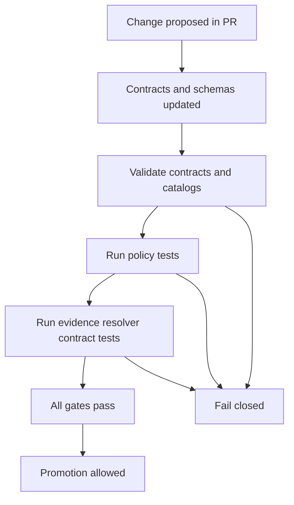

<!-- [KFM_META_BLOCK_V2]
doc_id: kfm://doc/6f14b8b0-4a5a-4b7a-9d7e-3d4c4f4b0d7a
title: Contract Tests
type: standard
version: v1
status: draft
owners: kfm-platform
created: 2026-03-04
updated: 2026-03-04
policy_label: public
related: []
tags: [kfm, quality, contract-tests, ci, governance]
notes: ["Defines the contract-test suite required to satisfy Promotion Contract Gate F (policy tests + contract tests)."]
[/KFM_META_BLOCK_V2] -->

# Contract Tests
One-line purpose: **Define and run fail-closed contract tests for KFM’s governed “contract surfaces” (API, catalogs, schemas, policy decisions, and evidence resolution).**

> **IMPACT (required)**
>
> **Status:** draft · **Owners:** `kfm-platform` (CODEOWNERS TBD) · **Last updated:** 2026-03-04  
> **Why this exists:** **CONFIRMED** KFM promotion is blocked unless CI-enforceable gates pass; contract tests are a required gate category (Gate F) alongside policy tests.【see Notes & Citations in PR / originating docs】  
> **Badges (TODO):** `CI` · `contracts` · `policy` · `catalog-triplet`  
> **Quick links:** [Scope](#scope) · [Where it fits](#where-it-fits) · [Contract surfaces](#contract-surfaces) · [Test matrix](#contract-test-matrix) · [Quickstart](#quickstart) · [CI wiring](#ci-wiring) · [Checklist](#gates-and-definition-of-done)

---

## Scope

**CONFIRMED (intent):** Contract tests are part of the Promotion Contract’s minimum gates, and KFM treats key interfaces (catalogs, policy, evidence resolution) as enforceable contract surfaces.【see Notes & Citations】

**Definition (this doc):**
- **Contract test** = an automated check that asserts a **published interface** stays valid and compatible.
- In KFM, “interface” includes **machine-readable metadata** (DCAT/STAC/PROV), **governed APIs**, and **policy decisions**.

### Non-goals

**PROPOSED:**
- Contract tests are **not** the same as unit tests.
- Contract tests are **not** performance benchmarks (those are separate quality gates).
- Contract tests do **not** “prove truth” of upstream sources; they prove KFM’s *interfaces* remain valid, linkable, and policy-correct.

---

## Where it fits

**CONFIRMED (intent):** Promotion to runtime surfaces is blocked unless minimum gates pass; Gate F explicitly covers **policy tests and contract tests**.【see Notes & Citations】

**Repo location:**
- This file: `docs/quality/CONTRACT_TESTS.md`
- Contract-test implementations (PROPOSED): `tests/contract/**`
- Contract definitions (PROPOSED): `contracts/**`, `schemas/**`, `policy/**`, plus catalog outputs under `data/**`.

### Relationship to the Promotion Contract

**CONFIRMED (intent):** CI gates should be automatable and fail-closed; promotion is blocked unless gates pass.【see Notes & Citations】



---

## Contract surfaces

KFM has multiple “contract surfaces” where correctness is defined by **validation**, **compatibility**, and **policy outcomes**.

**CONFIRMED (intent):**  
- Policy semantics must match in CI and runtime (or share fixtures and outcomes), otherwise CI guarantees are meaningless.  
- Catalogs are treated as canonical contract interfaces between pipelines and runtime surfaces.【see Notes & Citations】

### Acceptable inputs

**PROPOSED:**
- Versioned contract specs in `contracts/` (OpenAPI, DCAT profile, STAC profile, PROV profile).
- Versioned JSON Schemas in `schemas/` for:
  - `run_receipt.schema.json`
  - `policy_decision.schema.json`
  - domain schemas (Story Node, Layer Registry, etc.)
- Deterministic fixtures for contract testing in `tests/fixtures/**`.

### Exclusions

**PROPOSED:**
- Do not store secrets or credentials in fixtures.
- Do not store restricted/sensitive geometry in public fixtures; use generalized shapes and synthetic data.

---

## Contract test matrix

Blank line before table (required).

| Contract surface | What can break | Contract test type | Minimum artifact under test | Required behavior |
|---|---|---|---|---|
| API contracts | Breaking response shape, auth behavior | OpenAPI schema validation + compatibility checks | `contracts/openapi/**` | Fail PR on breaking change unless version bumped |
| Catalog triplet | Invalid DCAT/STAC/PROV, broken cross-links | Validators + linkcheck | `data/catalog/**`, `data/stac/**`, `data/prov/**` | Fail PR on invalid JSON or broken EvidenceRefs |
| Policy decisions | CI allows what runtime denies | OPA unit tests + fixture replay | `policy/**`, `tests/policy/**` | Fail PR if deny/allow outcomes change without review |
| Evidence resolver | Citations can’t resolve; restricted leakage | Integration contract tests | `tests/contract/evidence/**` | Fail PR if evidence cannot resolve for role or leaks restricted |
| Receipts | Missing spec_hash/digests/attestations | JSON Schema validation + digest verification | `receipts/**` | Fail PR if receipts invalid or digests mismatch |
| UI trust membrane | UI bypasses policy boundary | Static checks + smoke tests | `web/**` + network rules | Fail PR if UI can call DB/storage directly |

> **UNKNOWN:** The exact current paths in *your* repo for catalogs/receipts/policy may differ.  
> **Smallest verification steps:** `tree -L 3`, identify existing `tools/validators`, `policy/`, `schemas/`, and `.github/workflows` and then update this doc’s paths accordingly.

---

## Contract test suite

This section defines the **minimum** suite and how failures should look.

### 1) Catalog validators

**CONFIRMED (intent):** The blueprint includes catalog validation steps (DCAT, STAC, PROV) as CI gates, and contract tests for evidence resolution are explicitly called out as a CI step in an illustrative workflow.【see Notes & Citations】

**PROPOSED implementation rules:**
- Provide a single command that validates the triplet and returns non-zero on any failure.
- Keep validators deterministic and offline by default (no network).
- Emit machine-readable results: `reports/contract/catalog.json` plus a short console summary.

**PROPOSED command contract:**
- `make contract.catalog`
  - exit `0` on success
  - exit `1` on validation failure
  - exit `2` on usage/config error

### 2) Policy tests

**CONFIRMED (intent):** CI must block merges on policy tests, and CI policy semantics must match runtime policy semantics (or share fixtures and outcomes).【see Notes & Citations】

**PROPOSED minimum policy test categories:**
- `allow/deny` fixtures for:
  - licensing allowlist enforcement
  - sensitivity label enforcement
  - “no restricted leakage” rules
  - promotion eligibility rules

**PROPOSED “kill switch” invariant test (optional but high-leverage):**
- A synthetic `emergency_deny` flag that forces deny outcomes end-to-end, proving the system fails closed.

### 3) API contract tests

**PROPOSED minimums:**
- Validate OpenAPI file is syntactically valid.
- Detect breaking changes vs `main` (e.g., removed fields, widened auth scope).
- Require either:
  - a version bump, or
  - an explicit approved compatibility waiver artifact.

**UNKNOWN:** Whether your governed API is REST-only, GraphQL-only, or hybrid.  
**Smallest verification steps:** locate `contracts/openapi` or equivalent and any existing API schema generation.

### 4) Evidence resolver contract tests

**CONFIRMED (intent):** Evidence resolution and policy checks are core “trust membrane” behavior; CI is expected to enforce outcomes that match runtime behavior, and illustrative CI includes evidence-resolver contract tests.【see Notes & Citations】

**PROPOSED “contract” for evidence resolver integration tests:**
- Given a fixture bundle `{role, request, expected_outcome}`, assert:
  - all citations resolve for allowed evidence
  - restricted policy labels never appear in public responses
  - failure modes are safe and do not leak restricted metadata

**Fixture format (PROPOSED):**
- `tests/fixtures/evidence/cases.json`
- Each case contains:
  - `case_id`
  - `role`
  - `query` or `evidence_refs`
  - `expectations` (must_cite, must_abstain, must_not_include)

---

## Quickstart

> **IMPORTANT:** Commands below are **PROPOSED** until verified against the repo’s existing tooling.

```bash
# 1) Run the full contract suite
make contract

# 2) Only catalog validators + linkcheck
make contract.catalog

# 3) Only policy tests
make contract.policy

# 4) Only evidence resolver contract tests
make contract.evidence
```

**PROPOSED output artifacts (for CI uploads):**
- `reports/contract/catalog.json`
- `reports/contract/policy.json`
- `reports/contract/evidence.json`
- `reports/contract/junit.xml` (if your test runner supports JUnit)

---

## CI wiring

**CONFIRMED (intent):** CI should run catalog validation, policy tests, spec-hash drift checks, and evidence resolver contract tests as part of promotion gating in an illustrative workflow.【see Notes & Citations】

**PROPOSED CI job order (fail-closed):**
1. Lint + typecheck
2. Unit tests
3. Validate catalogs (DCAT, STAC, PROV)
4. Linkcheck citations / EvidenceRefs
5. Policy tests (OPA)
6. Spec hash drift check (if used)
7. Evidence resolver contract tests
8. Optional: Focus Mode evaluation harness

**PROPOSED GitHub Actions snippet (illustrative):**
```yaml
name: contract-tests
on:
  pull_request:

jobs:
  contract:
    runs-on: ubuntu-latest
    steps:
      - uses: actions/checkout@v4
      - name: Setup
        run: ./tools/setup.sh
      - name: Contract tests
        run: make contract
      - name: Upload reports
        uses: actions/upload-artifact@v4
        with:
          name: contract-reports
          path: reports/contract/
```

---

## Adding or changing a contract

### Change discipline

**PROPOSED:**
- Prefer additive changes.
- If you must introduce a breaking change:
  - bump the contract version
  - add migration notes
  - add fixtures proving both old and new behavior (or explicit deprecation window)

### Required PR contents

**PROPOSED (PR checklist):**
- [ ] Contract spec updated (OpenAPI/schema/profile)
- [ ] Fixtures updated (valid + invalid cases)
- [ ] Contract tests updated to cover the change
- [ ] Policy tests updated if semantics change
- [ ] Rollback plan included for any runtime-facing break

---

## Gates and definition of done

**CONFIRMED (intent):** Promotion gates are intended to be automated in CI and reviewed; contract and policy checks are required for safe promotion behavior.【see Notes & Citations】

### Minimum DoD for this document

- [ ] Paths in this doc match actual repo tree (or are explicitly marked UNKNOWN with verification steps)
- [ ] At least one end-to-end `make contract` target exists (or equivalent)
- [ ] At least one deterministic fixture suite exists for:
  - [ ] policy allow/deny
  - [ ] catalog validation
  - [ ] evidence resolution
- [ ] CI runs contract tests and blocks merges on failure (fail-closed)

---

## FAQ

### What’s the difference between schema validation and contract tests?
**PROPOSED:** Schema validation checks “is this shaped correctly?” Contract tests check “is this interface valid, compatible, and safe under policy for real usage paths?”

### Why are catalogs considered a contract surface?
**CONFIRMED (intent):** KFM treats catalogs as canonical interfaces between pipeline outputs and runtime surfaces; strict validation enables predictable evidence resolution.【see Notes & Citations】

### What makes a contract test “fail-closed”?
**PROPOSED:** Any ambiguity or missing artifact produces a non-zero exit and blocks merge/promotion.

---

## Version history

| Version | Date | Summary | Author |
|---|---:|---|---|
| v1 | 2026-03-04 | Initial draft of Contract Tests doc (Promotion Contract Gate F focus) | kfm-platform |

---

<p align="right"><a href="#contract-tests">Back to top</a></p>
