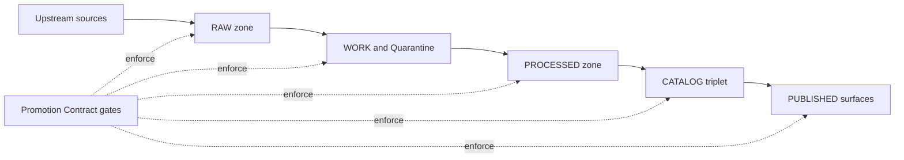

<!-- [KFM_META_BLOCK_V2]
doc_id: kfm://doc/8d44b0f7-5c0e-4bf3-9c4f-59b5f9b8c7ef
title: Determinism and Reproducibility
type: standard
version: v1
status: draft
owners: TBD
created: 2026-03-04
updated: 2026-03-04
policy_label: public
related: [
  "docs/quality/",
  "docs/governance/",
  "policy/",
  "tools/validation/",
  "data/"
]
tags: [kfm, quality, determinism, reproducibility, promotion-contract, receipts]
notes: [
  "Normative requirements use RFC2119 language (MUST/SHOULD/MAY).",
  "Major claims are tagged CONFIRMED / PROPOSED / UNKNOWN (see Definitions)."
]
[/KFM_META_BLOCK_V2] -->

# Determinism and Reproducibility
One-line purpose: Define KFM’s **determinism** and **reproducibility** requirements, and the **CI/policy gates** that enforce them across the truth path.

---

## Impact
**Status:**   
**Owners:** **TBD** (add CODEOWNERS entry)  
**Applies to:** pipelines, validators, agents, CI, releases, governed APIs

**Badges (TODO wire to CI):**
-  <!-- TODO -->
-  <!-- TODO -->
-  <!-- TODO -->

**Quick nav:**  
- [Scope](#scope) · [Where it fits](#where-it-fits) · [Definitions](#definitions) · [Determinism contract](#determinism-contract) · [Reproducibility contract](#reproducibility-contract) · [Receipts](#run-receipts-and-attestations) · [CI gates](#ci-gates-required) · [Checklist](#promotion-and-pr-checklist) · [Appendix](#appendix)

---

## Scope

### What this standard covers
- Deterministic identity (`dataset_id`, `dataset_version_id`, `spec_hash`)
- Deterministic artifact addressing (content digests)
- Reproducible runs (receipts, provenance, toolchain capture)
- Fail-closed validation gates (schema, policy, QA, reproducibility)
- How to design pipelines so reruns are safe (idempotency)

### What this standard does **not** cover
- Dataset-specific QA thresholds (belongs in dataset specs)
- Licensing policy allowlists (belongs in `policy/`)
- Security threat models (belongs in `docs/security/` or equivalent)
- Performance tuning beyond what impacts determinism

---

## Where it fits

### Repo placement
This file lives at:
- `docs/quality/DETERMINISM_AND_REPRO.md`

### Upstream/downstream connections
- **Upstream:** dataset specs, connectors, raw acquisition snapshots, build toolchain.
- **Downstream:** Promotion Contract gates (RAW → WORK → PROCESSED → CATALOG → PUBLISHED), validators, policy tests, evidence resolution, UI evidence drawers.

### KFM truth path context
KFM treats the lifecycle zones as the auditable “truth path.” Determinism and reproducibility are enforced at the transitions—especially before anything becomes **PUBLISHED**.



---

## Definitions

### Claim tags used in this doc
- **CONFIRMED:** documented KFM invariant/contract in the current design guides.
- **PROPOSED:** recommended implementation pattern that aligns with the invariants but may not be implemented yet.
- **UNKNOWN:** not verifiable from repo evidence in this doc; includes the smallest verification steps to confirm.

### Determinism vs reproducibility vs idempotency
- **Determinism (definition):** same inputs + same spec + same toolchain + same seed → **same outputs**.
- **Reproducibility (definition):** you can re-run later and obtain the same outputs (or provably equivalent outputs) using recorded evidence, pinned versions, and receipts.
- **Idempotency (definition):** re-running a job does not create duplicate or conflicting state; replays are safe.

### “Byte-identical” vs “semantically identical”
- **Byte-identical:** every output file digest matches exactly.
- **Semantically identical:** outputs are equivalent under a defined comparator (e.g., geometry equivalence within tolerance, stable ordering, normalized metadata).

**PROPOSED:** KFM should prefer **byte-identical** determinism for catalogs/receipts and any artifact that is directly served. For geospatial rasters/tiles, allow semantic equivalence only with an explicit comparator and documented tolerance.

---

## Determinism contract

### 1) Deterministic identity
- **CONFIRMED:** Every publishable dataset version MUST have:
  - `dataset_id`
  - `dataset_version_id`
  - `spec_hash` (deterministic)  
  - content digests for every artifact (e.g., `sha256`)  

**PROPOSED implementation rule:**  
`dataset_version_id` SHOULD be derived from:
- upstream snapshot identity (e.g., ETag + Last-Modified + fetch_time window) **and**
- `spec_hash` **and**
- an immutable run identifier (run receipt id)

### 2) spec_hash requirements
- **CONFIRMED:** `spec_hash` MUST be computed from **canonical JSON** to prevent “hash drift.”  
- **CONFIRMED:** Canonicalization SHOULD follow **RFC 8785 JSON Canonicalization Scheme (JCS)**.

**PROPOSED:** `spec_hash` format:
- `jcs:sha256:<64-hex>`

**Example (Python, runnable if you install a JCS lib):**
```python
# pseudocode-ish (library choice is repo-dependent)
import json, hashlib
from rfc8785 import canonicalize  # pip install rfc8785

spec = json.load(open("transform_spec.json", "r", encoding="utf-8"))
canon = canonicalize(spec)  # bytes
digest = hashlib.sha256(canon).hexdigest()
print(f"jcs:sha256:{digest}")
```

### 3) Artifact digests and addressing
- **CONFIRMED:** Every artifact MUST have a content digest recorded in receipts and referenced by catalogs.
- **PROPOSED:** Prefer digest-addressed storage paths (or OCI digests) so retrieval is deterministic and cacheable.

### 4) Stable ordering and stable serialization
Pipelines MUST ensure stable output ordering and stable serialization.

**MUST**
- Sort records by stable keys before writing (IDs, timestamps, stable geometry id).
- Emit timestamps in **UTC ISO 8601**; never locale-dependent formats.
- Normalize newline and encoding (UTF-8, LF).
- Avoid non-deterministic iteration (e.g., unordered maps) in emitted artifacts.

**SHOULD**
- Normalize floats (explicit precision) where the consumer requires determinism.
- Remove volatile metadata from digested payloads (e.g., “generated_at”) unless it is part of the contract.

### 5) Randomness and parallelism
**MUST**
- Record seeds in the run receipt for any stochastic step (modeling, sampling, randomized algorithms).
- Use deterministic algorithms or deterministic modes where possible.
- Ensure parallel writes are merged deterministically (stable sort + stable merge).

**SHOULD**
- Pin thread counts / BLAS behavior where it affects determinism.
- Avoid “race-determined” ordering (e.g., first-completer-wins) in output assembly.

### 6) Network dependence
**CONFIRMED:** Deterministic plans/runs MUST NOT depend on unpinned network responses.

**MUST**
- Snapshot upstream responses into **RAW** (immutable) and treat them as inputs.
- Record HTTP validators (`etag`, `last_modified`) and source URL in the run receipt.

**SHOULD**
- Use conditional requests (ETag/If-Modified-Since) to reduce drift and noise.
- Cache responses needed for planning, or pin them by digest.

---

## Reproducibility contract

### 1) Rebuild requirements
A run is reproducible when the following are captured and verifiable:

**MUST**
- Inputs: immutable raw artifacts (or their digests + retrievable locations)
- Spec: `transform_spec` and `spec_hash`
- Code identity: `git_sha` (or release version)
- Toolchain: container image digest and/or SBOM
- Output digests: sha256 for each artifact
- Catalog triplet: DCAT + STAC + PROV cross-linked to artifacts
- Receipt: a machine-readable run receipt capturing the above

### 2) Canonical vs rebuildable stores
**CONFIRMED:** Object storage + catalogs + provenance are treated as canonical; DB/search indexes are rebuildable projections.

**PROPOSED:** Rebuildable projections MUST be:
- derivable solely from promoted artifacts
- rebuildable via a documented job
- excluded from “source-of-truth” claims

### 3) Reproducibility levels
**PROPOSED** levels (use in CI reporting):
- **R0:** schema-valid + provenance-complete (minimum viable reproducibility)
- **R1:** byte-identical outputs on the same runner image
- **R2:** byte-identical outputs across Linux runners with pinned container digest
- **R3:** byte-identical outputs across architectures (rare; only if explicitly required)

---

## Run receipts and attestations

### Run receipt: required fields
**CONFIRMED:** Promotion requires a run receipt that captures inputs, tooling, hashes, and policy decisions.

**PROPOSED minimal schema (v1):**
```json
{
  "run_id": "2026-03-04T12:34:56Z-abc123",
  "dataset_id": "kfm:<domain>:<name>",
  "dataset_version_id": "kfmver:<domain>:<name>:<opaque>",
  "spec_hash": "jcs:sha256:<digest>",
  "code": {
    "git_sha": "<40-hex>",
    "repo": "unknown",
    "dirty": false
  },
  "environment": {
    "runner_image": "sha256:<image-digest>",
    "os": "linux",
    "arch": "amd64",
    "locale": "C",
    "timezone": "UTC"
  },
  "source": {
    "url": "https://example/source",
    "http_validators": { "etag": "\"...\"", "last_modified": "..." }
  },
  "inputs": [
    { "path": "data/raw/.../payload.json", "sha256": "<digest>" }
  ],
  "outputs": [
    { "path": "data/processed/.../artifact.parquet", "sha256": "<digest>" }
  ],
  "catalog": {
    "dcat_ref": "dcat://...",
    "stac_ref": "stac://...",
    "prov_ref": "prov://..."
  },
  "policy": {
    "policy_label": "public",
    "decisions": [{ "rule": "default-deny", "result": "pass" }]
  },
  "qa": {
    "reports": [{ "name": "schema-lint", "result": "pass" }],
    "thresholds_met": true
  },
  "attestations": [
    { "type": "cosign", "bundle_digest": "sha256:<digest>" }
  ]
}
```

### Attestations (supply chain)
**PROPOSED**
- If artifacts are published to registries or object stores, attach keyless attestations (e.g., cosign) and record the bundle digest in the receipt.
- CI MUST fail closed if attestation is required by policy and missing.

---

## CI gates required

### Gate set (minimum)
**CONFIRMED** gates exist as KFM intent and MUST be enforced before promotion:
- Identity and versioning (incl. `spec_hash`)
- Licensing and rights
- Sensitivity classification and obligations
- Catalog triplet validation (DCAT, STAC, PROV) + link resolution
- QA thresholds
- Run receipt + audit record
- Release manifest (when publishing)

### Reproducibility gate (required check)
**MUST**
- Recompute `spec_hash` from the checked-in spec and compare to receipt.
- Re-run the build in a pinned environment (container digest) and compare output digests.

**PROPOSED GitHub Actions sketch:**
```yaml
name: reproducibility-gate
on:
  pull_request:
    paths:
      - "data/**"
      - "tools/**"
      - "policy/**"
      - "docs/quality/**"
jobs:
  repro:
    runs-on: ubuntu-latest
    steps:
      - uses: actions/checkout@v4

      - name: Build in pinned runner image
        run: |
          # Example only: replace with your repo’s runner strategy.
          # MUST pin by digest, not tag.
          docker run --rm -v "$PWD:/work" -w /work \
            ghcr.io/kfm/runner@sha256:DEADBEEF \
            make ci.build

      - name: Verify spec_hash and artifact digests
        run: |
          make ci.verify-spec-hash
          make ci.verify-artifact-digests
```

### Policy gate (fail-closed)
**CONFIRMED intent:** OPA/Rego policy tests MUST fail closed on violations.

**PROPOSED**
- Run Conftest/OPA against:
  - run receipts
  - promotion manifests
  - catalog triplet
  - redaction/sensitivity obligations

---

## Determinism risk matrix

Blank line before table (style rule).

| Risk source | Symptoms | Required mitigation | Detection test |
|---|---|---|---|
| Unpinned dependencies | Hash drift between runs | Pin versions, record SBOM | CI rebuild diff |
| Unstable JSON ordering | spec_hash changes | RFC 8785 JCS canonicalization | spec_hash golden test |
| Time/locale leaks | output differs by machine | UTC, locale=C, fixed TZ | run receipt asserts |
| Parallel merge ordering | different row ordering | stable sort + deterministic merge | output digest check |
| Floating-point variance | small numeric deltas | fixed precision / comparator | semantic comparator |
| Network variability | changing inputs | snapshot to RAW, record validators | RAW integrity check |
| Non-deterministic geoprocessing | different raster/tiles | pinned toolchain + stable options | byte-compare or comparator |

---

## Promotion and PR checklist

### Definition of Done for determinism/repro
- [ ] **CONFIRMED:** `dataset_id` and `dataset_version_id` present
- [ ] **CONFIRMED:** `spec_hash` present and recomputable
- [ ] **CONFIRMED:** every artifact has a recorded `sha256`
- [ ] **CONFIRMED:** run receipt present, schema-valid, and references artifacts
- [ ] **CONFIRMED:** catalog triplet validates and cross-links resolve
- [ ] **CONFIRMED:** CI policy gate passes (fail-closed)
- [ ] **PROPOSED:** reproducibility gate rebuilds in pinned image and hashes match
- [ ] **PROPOSED:** attestations present when policy requires

---

## UNKNOWN items to verify in the repo

These are intentionally fail-closed until confirmed.

1) **UNKNOWN:** Does the repo already have a `spec_hash` library/CLI and golden tests?  
**Verify:** search `tools/` and CI workflows for `spec_hash`, `canonicalize`, or `rfc8785`.

2) **UNKNOWN:** Is there an existing run receipt schema under `contracts/`?  
**Verify:** search `contracts/` for `run_receipt` or `receipt.schema.json`.

3) **UNKNOWN:** Are catalog validators already wired in CI?  
**Verify:** check `.github/workflows/` for `validate_stac`, `validate_dcat`, `linkcheck`.

---

## Appendix

<details>
<summary>Appendix A — Minimal local commands (template)</summary>

```bash
# 1) Compute spec_hash (implementation depends on repo tool choice)
make spec-hash SPEC=transform_spec.json

# 2) Run pipeline in a pinned environment
make run DATASET=example MODE=apply

# 3) Validate catalogs + policy
make validate DATASET=example
make policy-gate RECEIPT=receipts/run_receipt.json

# 4) Rebuild and compare digests
make repro-check DATASET=example
```

</details>

<details>
<summary>Appendix B — Comparator guidance (when byte-identical is infeasible)</summary>

Use a comparator only when:
- you can document precisely what “equivalent” means, and
- you can enforce it in CI.

Examples (PROPOSED):
- GeoParquet: schema match, row count match, sorted primary key, geometry equals within tolerance.
- Raster tiles: same CRS, same bbox/extent, same nodata, same pixel stats within tolerance, same overviews.

</details>

---

Back to top: [Determinism and Reproducibility](#determinism-and-reproducibility)
