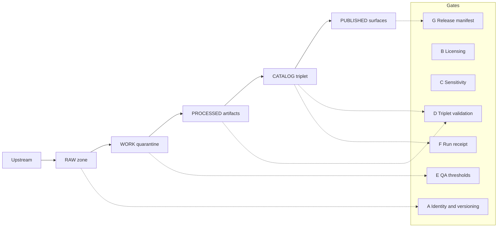

<!-- [KFM_META_BLOCK_V2]
doc_id: kfm://doc/2d2e0c4e-1313-4f9e-8d4a-7a7a2f4a4f95
title: Gates and Definition of Done
type: standard
version: v1
status: draft
owners: KFM Core Team
created: 2026-03-04
updated: 2026-03-04
policy_label: public
related: [
  "docs/quality/",
  "contracts/",
  "policy/",
  "tools/",
  "tests/"
]
tags: [kfm, quality, gates, definition-of-done, governance]
notes: ["Fail-closed gate definitions for merge, promotion, Story publishing, and Focus Mode."]
[/KFM_META_BLOCK_V2] -->

# Gates and Definition of Done
Fail-closed, test-enforced quality gates for KFM changes and promotions.

> **IMPACT**
> - **Status:** active (draft policy surface)
> - **Owners:** KFM Core Team
> - **Applies to:** PR merges, dataset promotion, Story Node publishing, Focus Mode releases
> - **Key principle:** If we can’t *verify*, we don’t *publish*.

## Quick navigation
- [Scope](#scope)
- [Terms](#terms)
- [Evidence status labels](#evidence-status-labels)
- [Core invariants](#core-invariants)
- [Gate registry](#gate-registry)
- [Definition of Done checklists](#definition-of-done-checklists)
- [Waivers and exceptions](#waivers-and-exceptions)
- [Verification TODOs](#verification-todos)
- [Appendix](#appendix)

## Scope
This document defines **what must be true** (Definition of Done) before we allow:

1. **Merge** to protected branches (code + contracts + policy)
2. **Promote** a dataset version to runtime surfaces (**PUBLISHED**)
3. **Publish** a Story Node to users
4. **Release** Focus Mode behavior changes

It intentionally does **not** define:
- Product roadmap, staffing, or schedules.
- Dataset-specific QA thresholds (those live in the dataset spec; this doc defines *how* thresholds gate promotion).
- Exact repo layout below the root (paths are *examples* and must be verified against the live repo).

## Terms

### Gate
A **gate** is a **fail-closed check** that blocks merge/promotion/publish until satisfied.

- **Fail-closed** means: missing artifact, missing test, unknown policy label, or non-resolvable citation ⇒ **block**.
- Gates are engineered to be **automatable in CI** and **reviewable** during steward sign-off.

### Definition of Done
**Definition of Done (DoD)** is the minimum set of:
- required artifacts (e.g., catalogs, receipts),
- validations/tests,
- documentation updates, and
- approvals
needed to consider a change safe and complete.

### Zones
KFM uses lifecycle **zones** that form an auditable truth path:

**Upstream → RAW → WORK/Quarantine → PROCESSED → CATALOG/Triplet → PUBLISHED**

Zones are not metaphors; they drive what is mutable/immutable and which gates apply.

## Evidence status labels
To prevent accidental “repo hallucination,” this file uses three status labels:

- **CONFIRMED:** anchored in KFM vNext documented invariants/gates and can be enforced as written.
- **PROPOSED:** recommended additions; adopt via ADR + implementation PR.
- **UNKNOWN:** depends on live repo/CI state; requires verification steps before treating as CONFIRMED.

> NOTE: A “PROPOSED” gate can still be used by a team immediately in a feature branch.  
> It becomes *repo policy* only once ratified (ADR) and enforced in CI.

## Core invariants
These invariants are **CONFIRMED** and must be enforced by tests and gates:

1. **Truth path with lifecycle zones**: artifacts are immutable in RAW; promotion requires receipts + validation; no PUBLISHED surface without passing gates.
2. **Promotion Contract gates**: identity, licensing, sensitivity, catalog triplet validation, QA thresholds, receipts/audit, release manifest.
3. **Trust membrane**: clients and UI must not access stores directly; all access is policy-evaluated at the Policy Enforcement Point (PEP) and mediated by governed interfaces.
4. **Catalog triplet as contract surfaces**: DCAT + STAC + PROV are canonical interfaces; cross-links must be deterministic; validators + link checks run in CI.
5. **Cite-or-abstain**: every map layer, story claim, and Focus Mode answer must be backed by resolvable EvidenceRefs or the system abstains/narrows scope.

## Gate registry

### Gate groups (overview)

| Group | Gate IDs | Applies to | Goal |
|---|---|---|---|
| Data Promotion Contract | A–G | dataset version promotion to **PUBLISHED** | safe publication with reproducibility + governance |
| Merge/CI Gates | M-* | PR merge to protected branches | safe code + contract + policy evolution |
| Story Publishing Gates | S-* | Story Node publish | citations resolve + review captured |
| Focus Mode Gates | F-* | Focus Mode code/config changes | cite-or-abstain enforced + regressions blocked |
| Release/Supply Chain Gates | R-* | tagged releases, deploys | integrity + provenance of build artifacts |

### Data Promotion Contract gates (A–G)

| Gate | Status | What must be present | How it fails closed (examples) |
|---|---|---|---|
| **A — Identity & versioning** | **CONFIRMED** | `dataset_id`, `dataset_version_id`, deterministic `spec_hash`, and content digests. | missing IDs, unstable hash, digest mismatch |
| **B — Licensing & rights metadata** | **CONFIRMED** | License/rights fields plus snapshot of upstream terms. | license missing/unknown; missing terms snapshot |
| **C — Sensitivity & redaction plan** | **CONFIRMED** | `policy_label` + obligations (generalize geometry, remove fields) when needed. | missing label; obligations not applied; default-deny tests fail |
| **D — Catalog triplet validation** | **CONFIRMED** | DCAT/STAC/PROV validate, cross-link, and EvidenceRefs resolve without guessing. | schema invalid; broken links; unresolved EvidenceRefs |
| **E — QA & thresholds** | **CONFIRMED** | Dataset-specific QA checks + thresholds documented in the spec; QA report present. | missing QA report; threshold regression; quarantine not respected |
| **F — Run receipt & audit record** | **CONFIRMED** | Receipt capturing inputs, tooling, hashes, policy decisions; append-only audit record. | receipt missing/invalid; audit append failed |
| **G — Release manifest** | **CONFIRMED** | Release/promotion manifest referencing artifacts + digests. | manifest missing; references don’t match stored objects |

#### Promotion artifacts checklist (minimum)
A dataset version may be promoted to **PUBLISHED** only if it has:

- **Processed artifacts** (GeoParquet, PMTiles, COG, etc.) with digests
- **Catalog triplet** (DCAT + STAC + PROV) that cross-links deterministically
- **QA report** with threshold results
- **Run receipt** (pipeline run details + hashes + policy decisions)
- **Promotion/release manifest** (release record referencing digests)

### Merge/CI gates (M-*)

These gates apply to all PRs. They are **CONFIRMED** as categories, but CI job names/commands are **UNKNOWN** until verified in `.github/workflows/`.

| Gate | Status | Requirement | Notes |
|---|---|---|---|
| **M-01 Lint + typecheck** | **CONFIRMED** | Static checks pass for affected languages. | e.g., `npm run lint && npm run typecheck` |
| **M-02 Unit tests** | **CONFIRMED** | Unit tests pass. | e.g., `npm test` |
| **M-03 Contract + schema validation** | **CONFIRMED** | Contract schemas validate (DCAT/STAC/PROV, OpenAPI, etc.). | validators must run in CI; broken schemas block merge |
| **M-04 Linkcheck citations** | **CONFIRMED** | Cross-links and citations resolve. | broken links block merge |
| **M-05 Policy tests (default-deny)** | **CONFIRMED** | OPA/Rego tests pass; default-deny enforced. | policy regressions block merge |
| **M-06 Spec hash drift check** | **CONFIRMED** | Deterministic spec hashing; CI blocks drift. | hash mismatch blocks merge |
| **M-07 Evidence resolver contract tests** | **CONFIRMED** | Evidence resolution works end-to-end and enforces policy. | contract/integration failures block merge |
| **M-08 Focus eval gate (when applicable)** | **CONFIRMED** | Evaluation harness runs and blocks regressions for Focus changes. | golden query regressions block merge |

### Story publishing gates (S-*)

Story publishing is a governed event that requires review state + resolvable citations.

| Gate | Status | Requirement | Fail-closed condition |
|---|---|---|---|
| **S-01 Story schema valid** | **CONFIRMED** | Story payload validates against Story schema. | schema invalid |
| **S-02 Map state sidecar valid** | **CONFIRMED** | Sidecar captures view state (bbox/time/layers) in schema-valid shape. | missing/invalid sidecar |
| **S-03 Review state captured** | **CONFIRMED** | Publishing requires an explicit review state (e.g., `draft → reviewed → published`). | missing review state |
| **S-04 Citations resolvable + policy-allowed** | **CONFIRMED** | Every citation is an EvidenceRef that resolves to an EvidenceBundle; policy allows it. | any citation unresolvable/unauthorized |
| **S-05 Audit record written** | **CONFIRMED** | Publish event is logged (who/when/what) in an append-only audit ledger. | missing audit record |

### Focus Mode gates (F-*)

A Focus Mode request is treated as a governed run with a receipt. The key hard gate is citation verification.

| Gate | Status | Requirement | Fail-closed condition |
|---|---|---|---|
| **F-01 Policy pre-check** | **CONFIRMED** | Determine whether the query is allowed for this role/context. | disallowed query proceeds |
| **F-02 Evidence bundles only** | **CONFIRMED** | Retrieval results must map to EvidenceRefs that resolve into evidence bundles. | “raw text from index” without evidence linking |
| **F-03 Citation verification (hard gate)** | **CONFIRMED** | Verify every citation resolves and is policy-allowed; else revise/abstain. | unverifiable citation included |
| **F-04 Governed run receipt** | **CONFIRMED** | Store query + evidence bundle digests + policy decision + model version + output hash. | missing/invalid receipt |
| **F-05 Evaluation harness** | **CONFIRMED** | CI runs golden queries; blocks merge on regressions for Focus changes. | harness missing or regressions ignored |

### Release / supply-chain gates (R-*) — PROPOSED
These gates are recommended for production hardening; adopt via ADR.

| Gate | Status | Requirement | Rationale |
|---|---|---|---|
| **R-01 SBOM attached** | **PROPOSED** | Every build artifact has an SBOM. | supply-chain transparency |
| **R-02 Provenance attestation** | **PROPOSED** | Artifact digest has provenance attestation (e.g., SLSA-style). | reproducible builds + audit |
| **R-03 Signed immutable releases** | **PROPOSED** | Releases promoted by digest (not mutable tags); tag mutation blocked. | prevents silent tampering |
| **R-04 Vulnerability scan gate** | **PROPOSED** | Block release on critical vulnerabilities without exception record. | reduces known-risk deploys |

## Definition of Done checklists

> **Status note:** Unless an item is explicitly tied to a **CONFIRMED** gate in the registry above, treat it as **PROPOSED** (policy intent) until it is ratified by ADR and enforced in CI.

### DoD: Any PR (baseline)
A PR is **Done** when:

- [ ] **All applicable gates** in [Merge/CI gates (M-*)](#mergeci-gates-m-) are green.
- [ ] The change is **small, reviewable, and reversible** (include rollback notes if operationally significant).
- [ ] Docs are updated when behavior changes (docs are production surfaces).
- [ ] No change introduces a **trust membrane bypass** (no direct UI→DB/storage access; no policy bypass).
- [ ] Any new/changed public endpoint has:
  - [ ] contract/schema update
  - [ ] authN/authZ tests (if governed)
  - [ ] threat model note (can be a short ADR)

### DoD: Contracts change (OpenAPI / JSON Schemas / controlled vocab)
In addition to baseline PR DoD:

- [ ] `spec_hash` updated (if the contract is a hashed input) and drift-guard tests updated.
- [ ] Validators updated (schema pinning, catalog profile rules).
- [ ] Backward compatibility plan stated (or explicit breaking-change note).
- [ ] Example fixtures updated (goldens).

### DoD: Policy change (OPA/Rego)
In addition to baseline PR DoD:

- [ ] Default-deny posture preserved (deny-by-default still true).
- [ ] Policy fixtures/tests added/updated to cover the new rule(s).
- [ ] Obligations (redaction/generalization) are test-covered.
- [ ] Evidence resolver contract still passes with the updated policy pack.

### DoD: Dataset onboarding (new dataset_id)
A dataset is onboarded when:

- [ ] Dataset registry entry exists with required fields:
  - [ ] `dataset_id`
  - [ ] title/description
  - [ ] publisher
  - [ ] license/rights
  - [ ] upstream url/type/cadence
  - [ ] `policy_label`
  - [ ] `spec_ref` + `spec_hash`
- [ ] A minimal RAW acquisition run exists (or a documented upstream-only “metadata mode” if mirroring is disallowed).
- [ ] A spec exists defining:
  - [ ] transforms
  - [ ] QA thresholds
  - [ ] redaction/generalization obligations (if any)
- [ ] A first dataset version can be promoted through A–G in a sandbox environment.

### DoD: Dataset promotion (new dataset_version_id)
A dataset version is promoted to **PUBLISHED** when:

- [ ] Promotion Contract gates **A–G** are satisfied.
- [ ] Catalog triplet is cross-linked and linkchecked.
- [ ] EvidenceRefs for representative records resolve end-to-end via evidence resolver.
- [ ] UI surfaces show dataset version + license/rights for the layer (where applicable).
- [ ] Audit record exists for the promotion event (who/what/when/why).

### DoD: Story Node publish
A Story Node is publishable when:

- [ ] Story schema + map state sidecar validate.
- [ ] Review state captured.
- [ ] **All citations** are resolvable EvidenceRefs and policy-allowed.
- [ ] Citations open evidence drawer (UX requirement) and show license + version.
- [ ] Publish event is recorded to the audit ledger.

### DoD: Focus Mode behavior change / release
A Focus Mode change is releasable when:

- [ ] Focus Mode gates **F-01…F-05** hold.
- [ ] Evaluation harness reports:
  - [ ] 100% citation resolvability for allowed users
  - [ ] refusal correctness on restricted prompts
  - [ ] no sensitive coordinate leakage
  - [ ] golden query regression checks across dataset versions
- [ ] Output receipts are emitted and stored for audit review.

## Waivers and exceptions
> **Status:** PROPOSED (requires governance decision + CI enforcement to be binding)
Waivers are allowed only as **time-bounded, documented exceptions**:

- **Allowed:** temporarily disabling a non-safety gate for a hotfix, with explicit steward approval and an issue to restore.
- **Not allowed:** bypassing policy enforcement, skipping licensing checks, or publishing with unverified citations.

A waiver must include:
- [ ] the gate(s) being waived
- [ ] risk statement (policy-safe)
- [ ] mitigation
- [ ] expiry date
- [ ] approving steward/principal
- [ ] audit ledger entry reference

## Verification TODOs
> **Status:** UNKNOWN until completed (these are the minimum checks to convert unknown repo state into CONFIRMED).
These items are **UNKNOWN** until verified in the live repo:

- [ ] Capture repo commit hash and root directory tree (`git rev-parse HEAD`, `tree -L 3`).
- [ ] Extract the exact set of CI checks that block merge from `.github/workflows/`.
- [ ] Confirm which work packages are already implemented (spec_hash, policy tests, validators, evidence resolver route, dataset registry schema).
- [ ] Validate UI cannot bypass the PEP (static analysis + network policies).
- [ ] Run Focus Mode evaluation harness and store artifacts and diffs.

## Appendix

### A. Mermaid overview: truth path + gates


### B. Example CI step mapping (pseudocode)
> Pseudocode only — replace commands with the repo’s real scripts.

```yaml
name: ci-gates
on: [pull_request]
jobs:
  gates:
    runs-on: ubuntu-latest
    steps:
      - uses: actions/checkout@v4

      - name: Lint + typecheck
        run: npm run lint && npm run typecheck

      - name: Unit tests
        run: npm test

      - name: Validate catalogs
        run: |
          node tools/validators/validate_dcat.js
          node tools/validators/validate_stac.js
          node tools/validators/validate_prov.js

      - name: Linkcheck citations
        run: node tools/linkcheck/catalog_linkcheck.js

      - name: Policy tests
        run: opa test policy/rego -v

      - name: Spec hash drift check
        run: node tools/hash/check_spec_hash.js

      - name: Evidence resolver contract tests
        run: npm run test:integration:evidence

      - name: Focus Mode eval
        if: contains(github.event.pull_request.title, 'focus') || contains(join(github.event.pull_request.changed_files, ' '), 'src/focus/')
        run: npm run test:eval:focus
```

### C. Status table for planned improvements
| Topic | Status | Next step |
|---|---|---|
| SBOM + provenance attestations as release gates | PROPOSED | Write ADR; implement CI verification; attach to releases |
| Energy/carbon telemetry gates | PROPOSED | Define schema + thresholds; add non-blocking collection first |
| Formal waiver workflow | PROPOSED | Add waiver template + audit ledger integration |
| Gate dashboard (what failed + why) | PROPOSED | Add CI summary job + artifact links |

---

[Back to top](#gates-and-definition-of-done)
