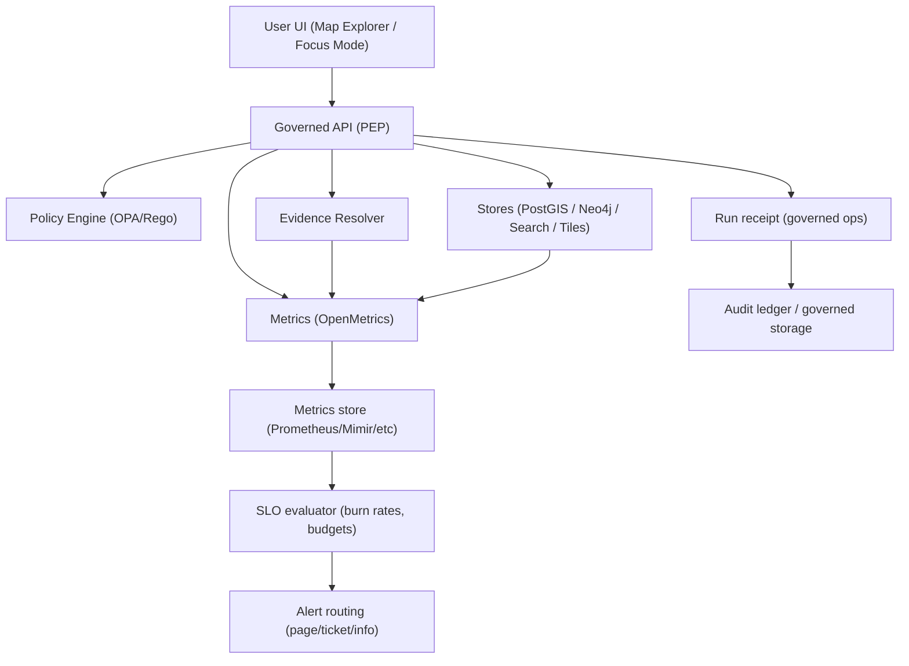

<!-- [KFM_META_BLOCK_V2]
doc_id: kfm://doc/6d2f7e4c-7d17-4e14-8e0c-24ed3c0b7c71
title: Performance SLOs
type: standard
version: v1
status: draft
owners: ["platform", "api", "ui", "data-engineering", "governance"]
created: 2026-03-04
updated: 2026-03-04
policy_label: public
related: ["docs/quality/", "docs/reports/security/telemetry/", "infra/", "policy/", "contracts/"]
tags: ["kfm", "quality", "performance", "slo", "sli", "observability"]
notes: ["SLO targets are PROPOSED until validated with load tests and recorded baselines."]
[/KFM_META_BLOCK_V2] -->

# Performance SLOs
Define KFM performance SLIs/SLOs (runtime + CI gates) **without weakening governance, provenance, or policy enforcement**.

<div align="center">


</div>

> **Status:** draft  
> **Owners:** platform, api, ui, data-engineering, governance  
> **Review cycle:** quarterly (or on any major architecture change)  
> **Applies to:** Governed API, Map Explorer, tiling/static assets, pipelines, Focus Mode, evidence resolver

---

## Quick navigation
- [Evidence discipline](#evidence-discipline)
- [Scope](#scope)
- [Where it fits](#where-it-fits)
- [Non-negotiable invariants](#non-negotiable-invariants)
- [SLI definitions](#sli-definitions)
- [SLO catalog](#slo-catalog)
- [Error budgets and burn rates](#error-budgets-and-burn-rates)
- [Instrumentation requirements](#instrumentation-requirements)
- [Alerting](#alerting)
- [CI performance gates](#ci-performance-gates)
- [Degraded-mode rules](#degraded-mode-rules)
- [How PROPOSED becomes CONFIRMED](#how-proposed-becomes-confirmed)
- [Appendix](#appendix)

---

## Evidence discipline

This repository treats performance goals like any other governed contract: we distinguish between:
- **CONFIRMED**: a *requirement* documented as an invariant/contract in KFM design guidance.
- **PROPOSED**: an initial target value or threshold that needs validation on representative fixtures.
- **UNKNOWN**: we do not yet have enough information to set a defensible target.

**Rule:** If an SLI is **missing** (we can’t measure), we treat compliance as **UNKNOWN** and do not “promote to PUBLISHED” based on it.

---

## Scope

This document defines:
- A **shared vocabulary** for performance SLIs/SLOs across KFM.
- A **baseline SLO catalog** for the primary runtime surfaces:
  - Governed API endpoints (catalog, evidence resolution, Focus Mode, tiles/assets)
  - Map Explorer (tiles + interaction loops)
  - Critical pipelines that directly impact user experience (freshness, publish latency)
- A **CI gate model** for performance regressions on fixtures (p95/p99 budgets).

This document does **not** define:
- Exact dashboards, Grafana layouts, or alert routing (see your ops runbooks).
- Dataset-specific benchmarks (those live with each dataset’s QA manifest / fixture pack).
- Vendor/platform commitments (cloud vs local); we specify *behavioral* targets.

---

## Where it fits

**Path:** `docs/quality/PERFORMANCE_SLOS.md`

**Upstream inputs (acceptable):**
- Architecture contracts and invariants (trust membrane, cite-or-abstain, promotion gates).
- Telemetry schemas and metric naming conventions.
- Representative fixtures for load/perf testing (tile fixtures, query fixtures, Focus Mode “golden queries”).

**Downstream outputs (what consumes this):**
- CI performance gates (regression tests fail closed when budgets are exceeded).
- SLO monitoring rules (error budget burn calculations).
- Release/promotion checklists (publish gate requires SLO compliance when applicable).

**Exclusions (what must not go here):**
- Ad-hoc “temporary” performance hacks that bypass policy/evidence flows.
- “We’ll skip verification in prod” proposals (explicitly out of scope and disallowed).

---

## Non-negotiable invariants

### Trust membrane is mandatory
**CONFIRMED:** Clients/UI do not directly access DB/object stores; access must cross the governed API and policy enforcement boundary.  
**Implication:** Performance optimizations must occur *inside* the membrane (caching, tiling, precompute, indexing), not by bypassing it.

### Cite-or-abstain is a hard gate
**CONFIRMED:** Focus Mode and Story publishing must verify citations and abstain/reduce scope if verification fails.  
**Implication:** Focus Mode SLOs include citation verification time; disabling verification is never an optimization path.

### Performance risks are managed via tiling + caching + progressive disclosure
**CONFIRMED (risk direction):** Large layers can cause performance collapse; mitigations include PMTiles/vector tiles, caching, progressive disclosure, and benchmarks.  
**Implication:** “Big layer” performance is addressed by *data products and UX constraints*, not by loosening controls.

---

## SLI definitions

### Core SLIs (system-wide)
| SLI | Definition | Units | Notes |
|---|---|---:|---|
| **Availability** | Successful responses / total requests (policy-safe). | ratio | Define what counts as “successful” per endpoint. |
| **Latency** | Request duration from first byte received to last byte sent (server-side) OR from request start to usable UI state (client-side). | ms | Use percentiles (p50/p95/p99). |
| **Error rate** | (5xx + selected 4xx) / total. | ratio | Policy denials (403/404) are tracked separately. |
| **Policy-deny rate** | Denied-by-policy responses / total. | ratio | High deny rates may indicate UX/policy mismatch or abuse. |
| **Freshness** | Now - dataset_version timestamp (or feed message timestamp). | seconds/minutes | “Freshness” is a quality SLI and can be a publish gate. |
| **Saturation** | CPU/GPU/RAM/IO utilization compared to safe operating thresholds. | % | Used for capacity alerts and degradation triggers. |

### Percentiles
- Use **p95** for “typical worst-case” interactive experience.
- Use **p99** for “tail latency” detection (queueing, GC pauses, hot shards, slow storage).

---

## SLO catalog

> **Important:** Most numeric targets below are **PROPOSED** defaults. They become **CONFIRMED** only after we run fixture-based tests and store baselines + run receipts.

### A. Map Explorer and tiles/assets

| Surface | SLI | SLO target | Window | Status | Notes |
|---|---|---|---|---|---|
| **Public tiles via CDN/static** | Tile fetch latency | **p95 < 150ms** | 30d | **PROPOSED** | Explicit target referenced in tiling guidance. |
| Public tiles via CDN/static | Tile error rate | < 0.5% | 30d | PROPOSED | Excludes client disconnects. |
| Governed tile/asset resolver | End-to-end latency | p95 < 500ms | 30d | PROPOSED | Includes policy check + signed URL generation. |
| Map interactions | “Feature click → EvidenceDrawer ready” | p95 < 800ms | 30d | PROPOSED | Must include evidence resolution path. |

### B. Governed API (general)

| Surface | SLI | SLO target | Window | Status | Notes |
|---|---|---|---|---|---|
| Read-only catalog browse (datasets, stac list) | Server latency | p95 < 300ms; p99 < 1s | 30d | PROPOSED | Excludes very large downloads. |
| Evidence resolution | Server latency | p95 < 400ms; p99 < 1.2s | 30d | PROPOSED | Includes bundle assembly + redaction obligations. |
| Story publish (governed) | Server latency | p95 < 2s | 30d | PROPOSED | Includes citation resolvability gate. |
| All API endpoints | Availability | ≥ 99.9% | 30d | PROPOSED | Adjust per deployment tier (local vs hosted). |

### C. Focus Mode (governed Q&A)

**CONFIRMED behavior requirements:**
- Focus Mode is treated as a governed run with a receipt.
- Citation verification is a hard gate; if verification fails, the system abstains or reduces scope.
- The run receipt should capture **latency** as part of the auditable record.

**Proposed performance targets:**

| Surface | SLI | SLO target | Window | Status | Notes |
|---|---|---|---|---|---|
| Focus Mode `/focus/ask` | End-to-end latency | p95 < 12s; p99 < 25s | 30d | PROPOSED | Includes: retrieval + evidence bundling + LLM + verification. |
| Focus Mode | Abstention latency | p95 < 4s | 30d | PROPOSED | “Fast fail” when policy denies or evidence missing. |
| Focus Mode | Citation resolvability | 100% (for allowed users) | per release | CONFIRMED (requirement) | This is an *integrity* gate, not a “best effort” metric. |

**Budget breakdown (recommended, PROPOSED):**
- Policy pre-check: ≤ 150ms p95
- Retrieval (catalog/search/graph/db): ≤ 700ms p95
- Evidence bundle resolution: ≤ 600ms p95
- LLM generation: remaining budget (varies by model + context)
- Citation verification pass: ≤ 300ms p95

### D. Knowledge graph/query fixtures (CI regression)

| Surface | SLI | SLO target | Window | Status | Notes |
|---|---|---|---|---|---|
| Graph QA fixture queries | Query latency | **p95 < 250ms; p99 < 800ms** | per PR | PROPOSED | Explicit example perf budget used in QA config patterns. |

### E. Pipeline-level SLOs (publish latency + freshness gates)

| Surface | SLI | SLO target | Window | Status | Notes |
|---|---|---|---|---|---|
| “Ingest → PROCESSED” batch | Publish latency | TBD (dataset-specific) | per run | UNKNOWN | Needs per-dataset expectations. |
| “PROCESSED → PUBLISHED” | Gate evaluation time | p95 < 5m | per run | PROPOSED | Includes validation + signing + catalog triplet checks. |
| Real-time/near-real-time feeds | Freshness | domain-specific TTLs | rolling | PROPOSED | Example TTLs exist for feed types; treat as per-domain profile. |
| Promotion pipeline | SLO compliance gate | deny if violation beyond budget | per run | PROPOSED | “Fail closed” at promotion boundary. |

---

## Error budgets and burn rates

**Error budget** = allowed “bad events” over the SLO window.

Recommended defaults (PROPOSED):
- For user-facing APIs: evaluate SLOs over **30 days**
- Track burn rate windows:
  - Fast window: 1h (early detection)
  - Slow window: 6h or 24h (trend validation)

**Policy-deny is not “error budget”:**
- Denials can be healthy (policy doing its job).
- But **spikes** can indicate broken UX, mislabeling, or abuse. Track separately.

---

## Instrumentation requirements

### What must be measured (CONFIRMED monitoring intent)
Instrument and store metrics for:
- **API latency**
- **LLM inference time**
- **Error rates**
- **System resource usage**
- Alerts on **CPU/GPU saturation** and **repeated policy denials** (especially in Focus Mode)

### Metric types and conventions (PROPOSED standard)
Use Prometheus/OpenMetrics guidance:
- Counters for good/bad events (e.g., request totals, validation failures).
- Histograms/summaries for latency distributions.

**Required labels (PROPOSED):**
- `env` (dev/stage/prod/local)
- `service` (api, evidence, tiles, focus, pipeline)
- `route` or `endpoint`
- `policy_label` (public/restricted/etc) — **only when safe**
- `status_class` (2xx/3xx/4xx/5xx)

**Example metric names (illustrative):**
- `kfm_http_requests_total{service="api",route="/api/v1/datasets",status_class="2xx"}`
- `kfm_http_request_duration_seconds_bucket{service="api",route="/api/v1/focus/ask",le="1"}`
- `kfm_focus_llm_inference_seconds_bucket{model="qwen3",le="5"}`
- `kfm_policy_denies_total{service="api",route="/api/v1/focus/ask",reason="restricted_topic"}`

### Receipts must include timing for governed operations (CONFIRMED intent)
For governed operations (Focus Mode, publish, promote), include latency in the audit/run receipt so performance is inspectable alongside policy decisions.

---

## Alerting

**Alert categories (PROPOSED):**
- **Page (sev1):** SLO burn rate indicates budget will be exhausted in < 24h for a primary user surface.
- **Ticket (sev2):** sustained p99 regressions, or rising saturation without errors.
- **Info (sev3):** policy-deny rate abnormal; cache hit rate drops; slow drift.

**Avoid sensitive leakage:**
Alert payloads must remain policy-safe (do not embed restricted dataset identifiers).

---

## CI performance gates

### Gate philosophy
- CI gates are **fixture-based** and **deterministic** where possible.
- Use **p95 and p99 budgets** to catch regressions, not “best effort” logging.

### Required gates (PROPOSED baseline)
- [ ] **Graph QA perf budget**: p95/p99 thresholds on representative queries.
- [ ] **Artifact perf guardrails**: throughput and open-time thresholds for common data products (e.g., GeoParquet open time, tile open time).
- [ ] **Focus Mode eval harness**: regression tests + “cite-or-abstain” correctness (performance tracked, but integrity is a hard gate).
- [ ] **Promotion SLO gate (where applicable)**: deny promotion if freshness/uptime/SLO violations exceed error budget.

---

## Degraded-mode rules

When performance threatens system stability, degrade **without bypassing governance**:

**CONFIRMED direction:** Prefer PMTiles/vector tiles, caching, progressive disclosure, and benchmarks to prevent large-layer collapse.

**PROPOSED degraded actions (safe):**
- Temporarily hide high-cost layers by default (user can opt-in).
- Reduce label density / simplify styles at low zoom.
- Serve generalized geometries for public views if policy requires/permits.
- Enforce request shaping: pagination, bbox limits, max feature counts.
- Increase cache TTLs for public, immutable artifacts.

**Never allowed:**
- Bypassing policy checks to “fix latency.”
- Returning uncited Focus Mode answers.
- Serving restricted artifacts due to cache misconfiguration.

---

## How PROPOSED becomes CONFIRMED

To promote a target value from **PROPOSED → CONFIRMED**, attach the following to a PR:

1. **Fixture definition** (what was tested, how to reproduce).
2. **Run receipt(s)** capturing:
   - environment hash
   - inputs + digests
   - timing summary (p50/p95/p99)
3. **Baseline artifact** (JSON summary) checked into a governed location.
4. **Change note / ADR** explaining tradeoffs and rollback.

Minimal verification steps (checklist):
- [ ] Run load test on representative hardware (local tier + hosted tier if applicable).
- [ ] Validate results are stable across 3 runs (variance within an agreed band).
- [ ] Confirm policy gates remain enforced during perf testing (no bypass).

---

## Appendix

### A. Telemetry + SLO evaluation flow



### B. Machine-readable SLO spec (starter stub)

> **PROPOSED:** Store this as `configs/quality/performance_slos.yml` (or equivalent) so CI and monitoring can share a single source of truth.

```yaml
version: 1
owners:
  - platform
  - api
  - ui
windows:
  default: 30d

slos:
  - id: ui.tiles.public.cdn.latency
    sli: latency_ms
    objective:
      p95_ms: 150
    window: 30d
    status: proposed

  - id: graph.qa.fixture.latency
    sli: latency_ms
    objective:
      p95_ms: 250
      p99_ms: 800
    window: per_pr
    status: proposed

  - id: focus.ask.e2e.latency
    sli: latency_ms
    objective:
      p95_ms: 12000
      p99_ms: 25000
    window: 30d
    status: proposed

  - id: api.catalog.read.latency
    sli: latency_ms
    objective:
      p95_ms: 300
      p99_ms: 1000
    window: 30d
    status: proposed
```

### C. PromQL patterns (illustrative)

> NOTE: These are examples only; adapt to your metric names and labels.

- Latency p95 (histogram):
  - `histogram_quantile(0.95, sum(rate(kfm_http_request_duration_seconds_bucket{route="/api/v1/datasets"}[5m])) by (le))`
- Error ratio:
  - `sum(rate(kfm_http_requests_total{status_class=~"5xx"}[5m])) / sum(rate(kfm_http_requests_total[5m]))`
- Policy deny ratio:
  - `sum(rate(kfm_policy_denies_total[5m])) / sum(rate(kfm_http_requests_total[5m]))`
