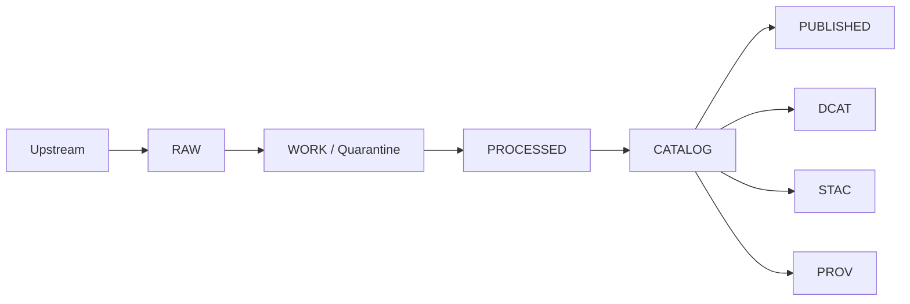

<!-- [KFM_META_BLOCK_V2]
doc_id: kfm://doc/68c04d80-8473-4f95-bb9b-1c959eb188b8
title: Quality Gates and Promotion Contract
type: standard
version: v1
status: draft
owners: kfm-core (TBD)
created: 2026-03-01
updated: 2026-03-01
policy_label: public
related:
  - ../governance/REVIEW_GATES.md
  - ../standards/KFM_STAC_PROFILE.md
  - ../standards/KFM_DCAT_PROFILE.md
  - ../standards/KFM_PROV_PROFILE.md
tags: [kfm, quality, governance, ci, promotion]
notes:
  - This README defines quality gates, artifacts, and verification steps across the KFM truth path.
[/KFM_META_BLOCK_V2] -->

# Quality (docs/quality)

> **Purpose:** gates, checklists, and runbooks to ship **governed** data, APIs, and narratives safely.
>
> This folder is where we define *what “good” means* and the *evidence* required to prove it.


---

## Quick navigation

- [What lives here](#what-lives-here)
- [Quality model](#quality-model)
- [Truth path and trust membrane](#truth-path-and-trust-membrane)
- [Promotion Contract gates](#promotion-contract-gates)
- [CI and local checks](#ci-and-local-checks)
- [Manual review queues](#manual-review-queues)
- [When a gate fails](#when-a-gate-fails)
- [Adding or changing a gate](#adding-or-changing-a-gate)
- [Glossary](#glossary)
- [Appendix: Minimum verification steps](#appendix-minimum-verification-steps)

---

## What lives here

### ✅ Acceptable inputs (belongs in `docs/quality/`)

- **Gate definitions**: what is enforced, where, and why (Promotion Contract, review gates, DoD).
- **Checklists**:
  - dataset onboarding / promotion
  - story publish readiness
  - Focus Mode evaluation runs
- **Metric definitions** and “how to read” guidance (not raw metric time series).
- **Runbooks** for diagnosing/triaging failures (broken catalogs, schema drift, policy regressions).
- **Templates** for QA reports / attestations / exception requests.

### ❌ Exclusions (do *not* put in `docs/quality/`)

- **Generated artifacts** (run receipts, catalog JSON, output datasets): these belong in the truth path
  zones (`RAW/`, `WORK/`, `PROCESSED/`, `CATALOG/`, `PUBLISHED/`) or a `runs/`/`releases/` area.
- **Secrets / credentials / access tokens**.
- **Restricted raw data** (especially anything with sensitive locations).  
  Store only *redacted examples* suitable for repo inclusion and policy review.

---

## Quality model

KFM quality is not just “unit tests passing.” It is a **contract** across four surfaces:

1. **Data quality**  
   Coverage, schema correctness, spatial/temporal validity, and dataset-specific thresholds.

2. **Catalog + provenance quality**  
   DCAT/STAC/PROV (the “catalog triplet”) is treated as a *contract surface*—not optional metadata.
   Catalogs must cross-link so evidence resolves deterministically.

3. **Policy quality**  
   Policy-as-code must have the **same semantics in CI and runtime**. If CI says “allowed” but runtime
   says “denied” (or vice versa), guarantees are meaningless.

4. **Product quality (API/UI/Focus Mode)**  
   - No direct storage access from clients (trust membrane).  
   - Every user-facing claim is traceable to resolvable evidence (cite-or-abstain).  
   - Publishing is a governed act: Story Nodes and Focus Mode runs emit receipts and are policy-checked.

---

## Truth path and trust membrane

### The truth path (data → catalogs → governed surfaces)



**Key idea:** quality gates apply at each transition, and promotion is blocked until gates are satisfied.

### The trust membrane (policy & provenance boundary)

```mermaid
flowchart LR
  Client[Clients: UI / external] --> PEP[Governed API (PEP)]
  PEP --> PDP[Policy Engine (OPA/Rego)]
  PEP --> Evidence[Evidence Resolver]
  PEP --> Stores[Storage and projections]
```

> **Invariant:** clients never access storage directly; all access is policy-evaluated at the PEP.

[Back to top](#quality-docsquality)

---

## Promotion Contract gates

These are the **minimum gates** documented for promotion to **PUBLISHED**. Treat them as *blocking*
unless an explicit exception is granted and linked (governance ticket / steward sign-off).

> NOTE: Some gates are described as “confirmed intent” or “proposed defaults” in the design docs.
> Verify repo implementation details in `.github/workflows/`, `tools/`, and policy bundles before
> treating a gate as implemented.

| Gate | Name | What must be present | Typical evidence artifact(s) | Typical automation check |
|---:|---|---|---|---|
| A | Identity & versioning | Stable IDs (`dataset_id`, `dataset_version_id`), deterministic spec hash, content digests | Spec hash output, artifact digest list | Schema validation + spec-hash golden tests |
| B | Licensing & rights metadata | License/rights fields + snapshot of upstream terms | License snapshot, attribution text | Fail if license missing/unknown |
| C | Sensitivity classification & redaction plan | `policy_label` + obligations (generalize geometry, remove fields, etc.) | Policy decision fixtures, redaction report | OPA tests, obligation verification |
| D | Catalog triplet validation | DCAT/STAC/PROV validate & cross-link; EvidenceRefs resolve | Validator logs, linkcheck report | Validators + linkcheck block merge |
| E | QA thresholds | Dataset-specific QA checks + documented thresholds | QA report in WORK, final QA summary in PROCESSED | Thresholds met; else quarantine |
| F | Run receipt & audit record | Inputs, tool versions, hashes, policy decisions captured; append-only audit | Receipt JSON, attestation (if enabled) | Receipt schema validation; signature checks |
| G | Release manifest | Promotion recorded as release manifest referencing artifact digests | Release manifest file | Manifest references match objects |

### Gate exceptions

Exceptions are allowed **only** when:
- the exception is **explicitly documented**, time-bounded, and reviewed
- the PR links to a governance ticket / steward approval
- the risk is captured (and ideally mitigated by compensating controls)

[Back to top](#quality-docsquality)

---

## CI and local checks

This section describes the **expected** CI posture. The canonical list of *actual* required checks should be
derived from `.github/workflows/` (see the Appendix verification checklist).

### Recommended minimum CI stages

- **Formatting & lint**
  - code formatting
  - doc formatting (markdown lint)
- **Unit/integration tests**
- **Schema & contract validation**
  - registry schemas
  - OpenAPI contracts
  - STAC/DCAT/PROV validators
  - link checking between catalog triplet and evidence references
- **Policy tests (OPA/Rego fixtures)**
  - allow/deny outcomes
  - obligation enforcement (redaction/generalization)
  - “never leak restricted metadata in errors”
- **Security basics**
  - dependency vulnerability scanning
  - container/image scanning where applicable
- **Focus Mode evaluation harness**
  - golden queries
  - regression diffs block merge

### Local developer workflow (proposed)

1. Run the full test + validation suite before opening a PR.
2. Ensure any new dataset includes:
   - spec + QA thresholds
   - license snapshot
   - policy label and obligations (if needed)
   - catalogs + provenance that validate
3. Attach or link the gate evidence (reports, validator outputs, receipts).

> TIP: Prefer “fail closed” defaults. If a validator can’t decide, it should fail and force review.

[Back to top](#quality-docsquality)

---

## Manual review queues

Some promotions require **human sign-off**, even if automation passes. The design docs describe two
review workflows to treat as first-class governance surfaces:

- **Promotion Queue**: steward review for new/updated datasets before publication.
- **Story Review Queue**: review of Story Nodes (citations, rights, sensitivity).

Where the repo implements these workflows (GitHub labels, CODEOWNERS, required reviewers, etc.) is
**to be verified**.

---

## When a gate fails

Use this triage order:

1. **Identify the failing gate** (A–G) and whether it is data, policy, catalog, or product.
2. **Locate the failing artifact** (schema validator output, policy test, linkcheck report, QA report).
3. **Fix at the earliest stage possible**:
   - schema drift → update mapping/spec, not downstream patches
   - missing license → add upstream terms snapshot, don’t “guess”
   - sensitive leak risk → default deny, then add a generalized derivative if permitted
4. **Re-run checks** and attach outputs to the PR.
5. If you *must* proceed with an exception, follow the [Gate exceptions](#gate-exceptions) rules.

---

## Adding or changing a gate

When you introduce a new rule that can block promotion, treat it like a product change:

1. **Write the rule down** (this folder): intent, scope, false positives, how to override.
2. **Decide the enforcement point(s)**:
   - CI gate (schema/policy/test)
   - runtime enforcement (PEP / evidence resolver)
3. **Make it testable**:
   - golden fixtures
   - regression tests
4. **Make it reversible**:
   - version gates
   - document rollback/disable path
5. **Attach evidence**:
   - example failing case
   - example passing case

---

## Glossary

- **Truth path**: the lifecycle zones from upstream acquisition to governed publication.
- **Trust membrane**: the boundary where *all* access is policy-checked (PEP + PDP) and evidence is enforced.
- **PEP**: Policy Enforcement Point (e.g., governed API).
- **PDP**: Policy Decision Point (OPA/Rego).
- **EvidenceRef / EvidenceBundle**: resolvable citation objects (not “random URLs”).
- **Catalog triplet**: DCAT (what), STAC (assets), PROV (lineage).

---

## Appendix: Minimum verification steps

Run these checks to convert “unknowns” into confirmed repo facts:

- [ ] Capture repo commit hash and a root directory tree (`git rev-parse HEAD`, `tree -L 3`)
- [ ] Extract the CI gate list from `.github/workflows/` and document which checks block merges
- [ ] Confirm presence of validators (STAC/DCAT/PROV), policy bundle tests, evidence resolver routes
- [ ] Promote one MVP dataset end-to-end and store receipts + catalogs as artifacts
- [ ] Validate the UI cannot bypass the PEP and EvidenceRefs resolve end-to-end
- [ ] Run Focus Mode evaluation harness and store golden outputs + diffs

---

<details>
<summary>Non-normative reading list (optional)</summary>

These references are **not** requirements; they’re helpful background for building robust quality gates:

- Git hygiene and review workflows
- Data validation and reproducibility
- Policy-as-code and secure-by-default systems

</details>
