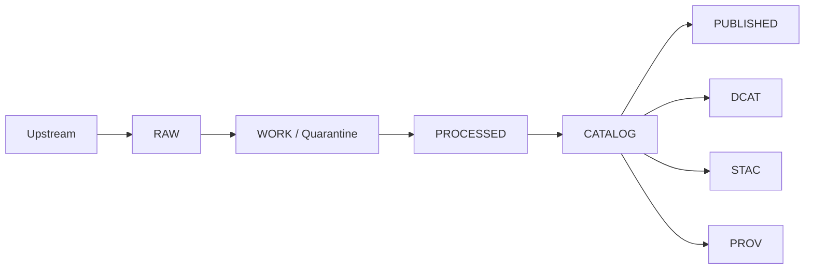

<!-- [KFM_META_BLOCK_V2]
doc_id: kfm://doc/68c04d80-8473-4f95-bb9b-1c959eb188b8
title: Quality Gates and Promotion Contract
type: standard
version: v1
status: draft
owners: kfm-core (TBD)
created: 2026-03-01
updated: 2026-03-05
policy_label: public
related:
  - ../governance/REVIEW_GATES.md
  - ../standards/KFM_STAC_PROFILE.md
  - ../standards/KFM_DCAT_PROFILE.md
  - ../standards/KFM_PROV_PROFILE.md
tags: [kfm, quality, governance, ci, promotion]
notes:
  - CONFIRMED: Defines the docs/quality folder contract (what belongs here, exclusions, and how to evolve gates safely).
  - CONFIRMED: Documents Promotion Contract gate intent (design) and provides a verification checklist for confirming repo enforcement.
  - UNKNOWN: Related links must be validated in-repo (run markdown link-check in CI).
[/KFM_META_BLOCK_V2] -->

<a id="top"></a>

# docs/quality — Quality gates and promotion contract
**CONFIRMED (purpose):** Gates, checklists, and runbooks to ship **governed** data, APIs, and narratives safely.

---

## Impact
> **CONFIRMED:** **Status:** draft  
> **CONFIRMED:** **Owners:** `kfm-core` (TBD)  
> **CONFIRMED:** **Policy label:** `public`  
> **CONFIRMED:** **Path:** `docs/quality/`  
>
> **CONFIRMED:** Jump to: [Scope](#scope) · [Promotion Contract](#promotion-contract) · [CI posture](#ci-and-local-checks) · [Definition of Done](#appendix-a--definition-of-done-dataset-integration-ticket) · [Verification](#appendix-b--minimum-verification-steps-turn-unknown--confirmed)


---

## Quick navigation
- [Evidence status legend](#evidence-status-legend)
- [Scope](#scope)
- [Where this fits in the repo](#where-this-fits-in-the-repo)
- [What lives here](#what-lives-here)
- [Directory tree](#directory-tree-recommended)
- [Quality model](#quality-model)
- [Truth path and trust membrane](#truth-path-and-trust-membrane)
- [Promotion Contract](#promotion-contract)
- [CI and local checks](#ci-and-local-checks)
- [Manual review queues](#manual-review-queues)
- [When a gate fails](#when-a-gate-fails)
- [Adding or changing a gate](#adding-or-changing-a-gate)
- [Glossary](#glossary)
- [Appendix A — Definition of Done](#appendix-a--definition-of-done-dataset-integration-ticket)
- [Appendix B — Minimum verification steps](#appendix-b--minimum-verification-steps-turn-unknown--confirmed)

---

## Evidence status legend
- **CONFIRMED:** Backed by a tracked KFM document *or* defined by this README as the folder contract.
- **PROPOSED:** Recommended pattern / future capability; not guaranteed to exist in the current repo.
- **UNKNOWN:** Not verified in the live repo at the current commit. The README provides the smallest steps to verify.

**CONFIRMED:** This README is written to be **anti-hallucination by default**: it distinguishes design intent from verified implementation and fails closed when uncertain.

[Back to top](#top)

---

## Scope
- **CONFIRMED:** Define **quality gates** that block unsafe promotion.
- **CONFIRMED:** Define **promotion artifacts** (catalogs, receipts, manifests) and how they are verified.
- **CONFIRMED:** Provide **runbooks** and **checklists** for triage and governance review.
- **PROPOSED:** Provide templates for “exception requests,” “QA attestations,” and “review packets.”
- **UNKNOWN:** Repo automation and exact command entrypoints (Makefile/scripts) must be verified per branch.

---

## Where this fits in the repo
- **CONFIRMED:** This directory defines “what good means” and the evidence required to prove it.
- **CONFIRMED:** This directory is a contract surface for CI policy, dataset promotion, and governed publishing.

### Upstream inputs (what this directory *references*)
- **CONFIRMED:** Governance rules (review gates, exception process, policy labels).
- **CONFIRMED:** Standards/profiles (DCAT/STAC/PROV profiles, schema contracts).
- **CONFIRMED:** Policy-as-code bundles and fixtures (used by CI and runtime).
- **UNKNOWN:** The precise paths to those artifacts in the current repo commit (verify via tree + link-check).

### Downstream consumers (what *uses* this directory)
- **CONFIRMED:** CI workflows that block merges and/or block promotion.
- **CONFIRMED:** Pipeline runners that decide whether a dataset can move zones.
- **CONFIRMED:** Steward review workflows (promotion queue / story queue).
- **PROPOSED:** UI trust surfaces (badges, evidence drawer) that read “quality state” artifacts.

[Back to top](#top)

---

## What lives here

### ✅ Acceptable inputs (belongs in `docs/quality/`)
- **CONFIRMED:** Gate definitions (Promotion Contract, story publish gates, review gates).
- **CONFIRMED:** Checklists:
  - **CONFIRMED:** dataset onboarding / promotion readiness
  - **CONFIRMED:** story publish readiness (citations, rights, sensitivity)
  - **CONFIRMED:** Focus Mode evaluation runs (golden queries, regressions)
- **CONFIRMED:** Metric definitions and interpretation guides (not raw time series).
- **CONFIRMED:** Runbooks for diagnosing failures (schema drift, broken catalog links, policy regressions).
- **PROPOSED:** Templates for QA reports / attestations / exception requests.

### ❌ Exclusions (do *not* put in `docs/quality/`)
- **CONFIRMED:** Generated outputs (catalog JSON, receipts, datasets).  
  **PROPOSED:** Store them under lifecycle zones (e.g., `data/`) or a dedicated `runs/`/`releases/` area.
- **CONFIRMED:** Secrets / credentials / access tokens.
- **CONFIRMED:** Restricted raw data (especially sensitive locations).  
  **CONFIRMED:** Only store **redacted** examples suitable for policy review.

---

## Directory tree (recommended)
- **PROPOSED:** The structure below keeps “policy/gates/runbooks/templates” separable and reviewable.
- **UNKNOWN:** Exact filenames should match your repo conventions; run link-check to confirm.

```text
docs/quality/
  README.md
  gates/
    PROMOTION_CONTRACT.md
    STORY_PUBLISH_GATES.md
    REVIEW_GATES.md
  checklists/
    dataset_promotion.md
    story_publish.md
    focus_eval.md
  runbooks/
    triage_promotion_failure.md
    triage_policy_regression.md
    triage_catalog_breakage.md
  templates/
    exception_request.md
    qa_attestation.md
    review_packet.md
```

[Back to top](#top)

---

## Quality model
**CONFIRMED:** KFM quality is a **contract**, not just “tests passing,” across four surfaces:

1. **CONFIRMED:** **Data quality**  
   Coverage, schema correctness, spatial/temporal validity, and dataset-specific thresholds.

2. **CONFIRMED:** **Catalog + provenance quality**  
   DCAT/STAC/PROV (“catalog triplet”) is treated as a contract surface; cross-links must be resolvable.

3. **CONFIRMED:** **Policy quality**  
   Policy-as-code must behave consistently between CI and runtime (otherwise “allow/deny” guarantees collapse).

4. **CONFIRMED:** **Product quality (API/UI/Focus Mode)**  
   - **CONFIRMED:** Clients do not access storage directly (trust membrane).
   - **CONFIRMED:** User-facing claims are traceable to resolvable evidence (cite-or-abstain).
   - **PROPOSED:** Publishing emits receipts and is policy-checked (confirm the current implementation).

---

## Truth path and trust membrane

### The truth path (data → catalogs → governed surfaces)
- **CONFIRMED (design intent):** Promotion gates apply at each transition, and promotion is blocked until required gates are met.
- **PROPOSED:** Map the lifecycle zones onto concrete repo/storage prefixes (e.g., `data/raw`, `data/work`, etc.).


```mermaid
flowchart LR
  U[Upstream] --> R[RAW]
  R --> W[WORK / Quarantine]
  W --> P[PROCESSED]
  P --> C[CATALOG]
  C --> Pub[PUBLISHED]

  C --> DC[DCAT]
  C --> ST[STAC]
  C --> PR[PROV]
```

### The trust membrane (policy & provenance boundary)
- **CONFIRMED (design intent):** All access is policy-evaluated at the governed API (PEP); clients never directly access storage.
- **PROPOSED:** Use OPA/Rego (or equivalent) as the policy engine (PDP) with contract tests.

```mermaid
flowchart LR
  Client[Clients: UI / external] --> PEP[Governed API (PEP)]
  PEP --> PDP[Policy Engine (OPA/Rego)]
  PEP --> Evidence[Evidence Resolver]
  PEP --> Stores[Storage and projections]
```

[Back to top](#top)

---

## Promotion Contract
**CONFIRMED (design intent):** Promotion to **PUBLISHED** is blocked unless minimum gates are met, and gates are framed to be CI-automatable and steward-reviewable.  
**UNKNOWN (repo status):** Which gates are currently enforced (and where) must be verified from `.github/workflows/` and pipeline entrypoints.

### Minimum gates (blocking by default)
**CONFIRMED:** Treat these gates as **blocking** unless a documented, time-bounded exception is granted.

| Gate | Name | What must be present (intent) | Evidence artifacts (examples) | Automation check (examples) | Implementation status |
|---:|---|---|---|---|---|
| A | Identity & versioning | **CONFIRMED:** `dataset_id` + `dataset_version_id`; deterministic `spec_hash`; content digests | spec-hash output; digest list | schema validation; spec-hash golden tests; digest verification | **UNKNOWN:** verify in repo |
| B | Licensing & rights metadata | **CONFIRMED:** License/rights fields + upstream terms snapshot | license snapshot; attribution | fail if license missing/unknown | **UNKNOWN:** verify in repo |
| C | Sensitivity classification & redaction plan | **CONFIRMED:** `policy_label` + obligations when needed (generalize geometry, remove fields, etc.) | policy fixtures; redaction report | OPA fixture tests; obligation checks | **UNKNOWN:** verify in repo |
| D | Catalog triplet validation | **CONFIRMED:** DCAT/STAC/PROV validate & cross-link; EvidenceRefs resolve | validator logs; linkcheck report | validators + linkcheck block merge/promotion | **UNKNOWN:** verify in repo |
| E | QA thresholds | **CONFIRMED:** Dataset-specific QA checks + documented thresholds | QA report (WORK); QA summary (PROCESSED) | thresholds met; else quarantine | **UNKNOWN:** verify in repo |
| F | Run receipt & audit record | **CONFIRMED:** receipt captures inputs, tool versions, hashes, policy decisions; append-only audit record | receipt JSON; attestation (if enabled) | receipt schema validation; signature checks (if enabled) | **UNKNOWN:** verify in repo |
| G | Release manifest | **CONFIRMED:** promotion recorded as a release manifest referencing artifact digests | release/promotion manifest | manifest references match objects | **UNKNOWN:** verify in repo |

#### Gate numbering note (anti-hallucination)
- **CONFIRMED:** Some KFM briefs/snapshots number “receipt + checksums” and “policy/contract tests” differently (letters vary across drafts).  
- **CONFIRMED:** **Treat gate *names* as stable** and gate letters as aliases; validate current canonical naming in the repo.

### Extended gates (recommended production posture)
- **PROPOSED:** Add these gates once the minimum A–G path is stable.
- **UNKNOWN:** Whether any are already enforced must be verified in CI configuration.

| Gate | Category | What it checks | Why it matters |
|---:|---|---|---|
| X1 | Policy & contract tests | evidence resolver contract tests (“public resolves”, “restricted 403 without leakage”), OpenAPI/schema contract tests | prevents silent policy drift and leakage |
| X2 | Supply chain | SBOM + build provenance for pipeline images and API/UI artifacts | reduces dependency/supply-chain risk |
| X3 | Performance & UX smokes | tile rendering smoke, evidence resolve latency budgets, basic accessibility checks | protects “trust surfaces” from regression |

### Gate exceptions
- **CONFIRMED:** Exceptions are allowed only when explicitly documented, time-bounded, reviewed, and linked to steward approval.
- **CONFIRMED:** Exceptions must include risk capture + compensating controls (or the promotion should fail closed).

[Back to top](#top)

---

## CI and local checks

### Minimum CI checks (design target)
- **CONFIRMED (design intent):** JSON schema validation for DCAT/STAC/PROV profiles.
- **CONFIRMED (design intent):** Link checking so cross-links resolve in repo context.
- **CONFIRMED (design intent):** Evidence resolver contract tests (public allowed; restricted denied without metadata leakage).
- **CONFIRMED (design intent):** `spec_hash` stability tests and golden tests for canonicalization/deterministic outputs.
- **PROPOSED:** Dependency vulnerability scanning and image scanning (where applicable).
- **PROPOSED:** Focus Mode evaluation harness with golden queries; block merge on regressions.
- **UNKNOWN:** Exact workflow names and required checks on the current branch.

### Local developer workflow (pseudocode; adapt to repo tooling)
- **UNKNOWN:** Replace the commands below with repo-real Make/npm/task commands discovered via `README`, `Makefile`, `package.json`, or `tools/`.

```bash
# [UNKNOWN] Example local workflow — replace with real repo commands
# format + lint
make lint

# unit/integration tests
make test

# validate catalogs (DCAT/STAC/PROV) + cross-links
make validate.catalogs

# run OPA/Conftest policy fixtures and contract tests
make test.policy

# run Focus Mode evaluation harness (golden queries)
make test.focus_eval
```

### “Fail closed” rule
- **CONFIRMED:** If a validator can’t decide, the correct default is to fail and force review.
- **CONFIRMED:** If licensing or sensitivity is unclear, promotion must not proceed (quarantine instead).

[Back to top](#top)

---

## Manual review queues
- **CONFIRMED (design intent):** Some promotions require human sign-off even if automation passes.
- **PROPOSED:** Treat these as first-class governance surfaces:
  - **PROPOSED:** Promotion Queue (steward review for new/updated datasets)
  - **PROPOSED:** Story Review Queue (citations, rights, sensitivity)

- **UNKNOWN:** Where these workflows are encoded (labels, CODEOWNERS, required reviewers) must be verified in-repo.

---

## When a gate fails
**CONFIRMED:** Triage order (fail-closed):

1. **CONFIRMED:** Identify the failing gate (by *name*) and classify it: data, policy, catalog, or product.
2. **CONFIRMED:** Locate the failing artifact (validator output, policy test output, linkcheck report, QA report).
3. **CONFIRMED:** Fix at the earliest stage possible:
   - **CONFIRMED:** schema drift → update mapping/spec, not downstream patches
   - **CONFIRMED:** missing license → add upstream terms snapshot; do not guess
   - **CONFIRMED:** sensitive leak risk → default deny; add generalized derivative if permitted
4. **CONFIRMED:** Re-run checks and attach outputs to the PR.
5. **CONFIRMED:** If an exception is required, follow [Gate exceptions](#gate-exceptions) rules.

[Back to top](#top)

---

## Adding or changing a gate
- **CONFIRMED:** Any new promotion-blocking rule is a product change and must be small, testable, and reversible.

1. **CONFIRMED:** Write the rule down here (intent, scope, false positives, override path).
2. **CONFIRMED:** Decide enforcement points:
   - **CONFIRMED:** CI gate (schema/policy/test)
   - **CONFIRMED:** runtime enforcement (PEP/evidence resolver)
3. **CONFIRMED:** Make it testable (fixtures, golden tests, regression tests).
4. **CONFIRMED:** Make it reversible (versioned gates, documented rollback/disable path).
5. **CONFIRMED:** Attach evidence (example failing + passing cases).

---

## Glossary
- **CONFIRMED:** **Truth path** — lifecycle zones from upstream acquisition to governed publication.
- **CONFIRMED:** **Trust membrane** — boundary where access is policy-checked (PEP + PDP) and evidence is enforced.
- **CONFIRMED:** **PEP** — Policy Enforcement Point (governed API).
- **CONFIRMED:** **PDP** — Policy Decision Point (e.g., OPA/Rego).
- **CONFIRMED:** **EvidenceRef** — structured citation reference that must resolve (not a pasted URL).
- **CONFIRMED:** **EvidenceBundle** — resolved evidence payload (human card + machine metadata + digests + audit refs).
- **CONFIRMED:** **Catalog triplet** — DCAT (dataset metadata), STAC (asset metadata), PROV (lineage).

[Back to top](#top)

---

## Appendix A — Definition of Done (dataset integration ticket)
- **CONFIRMED (design intent):** A dataset integration is DONE only when the following are true:

- [ ] **CONFIRMED:** Registry entry updated (owner, license, `policy_label`, cadence, contact).
- [ ] **CONFIRMED:** RAW acquisition artifacts are immutable with manifest + checksums.
- [ ] **CONFIRMED:** PROCESSED artifacts exist with digests and predictable paths.
- [ ] **CONFIRMED:** DCAT + STAC + PROV are schema-valid and cross-linked; link checks succeed.
- [ ] **CONFIRMED:** Policy decisions recorded; default-deny tests pass; generalized derivatives created if needed.
- [ ] **CONFIRMED:** Evidence resolver resolves representative EvidenceRefs into EvidenceBundles.
- [ ] **CONFIRMED:** UI smoke tests: evidence drawer resolves selections; restricted layers denied/generalized.
- [ ] **CONFIRMED:** Audit: run receipt emitted; audit ledger append; access controls verified.

[Back to top](#top)

---

## Appendix B — Minimum verification steps (turn UNKNOWN → CONFIRMED)
- **CONFIRMED:** Use these checks to eliminate “unknowns” and prevent accidental hallucination in future docs.

### Repo reality checks
- [ ] **CONFIRMED:** Capture repo commit hash and a root directory tree (`git rev-parse HEAD`, `tree -L 3`).
- [ ] **CONFIRMED:** Extract the CI gate list from `.github/workflows/` and document which checks block merges.
- [ ] **CONFIRMED:** Confirm presence of validators (DCAT/STAC/PROV), policy bundle tests, and evidence resolver contract tests.
- [ ] **CONFIRMED:** Promote one MVP dataset end-to-end and store receipts + catalogs as artifacts.
- [ ] **CONFIRMED:** Validate UI cannot bypass PEP and EvidenceRefs resolve end-to-end.
- [ ] **CONFIRMED:** Run Focus Mode evaluation harness and store golden outputs + diffs.

### Doc link integrity
- [ ] **CONFIRMED:** Run markdown link check for `docs/quality/README.md` and MetaBlock `related:` paths.
- [ ] **CONFIRMED:** Fail CI on broken internal references (no “docs that don’t exist”).

[Back to top](#top)

---

<details>
<summary>Non-normative reading list (optional)</summary>

- **PROPOSED:** Data validation + reproducibility patterns (dataset digests, deterministic builds).
- **PROPOSED:** Policy-as-code practices (default deny, fixture-driven tests, non-leak error handling).
- **PROPOSED:** Supply-chain security (SBOMs, signing, provenance attestations).

</details>
