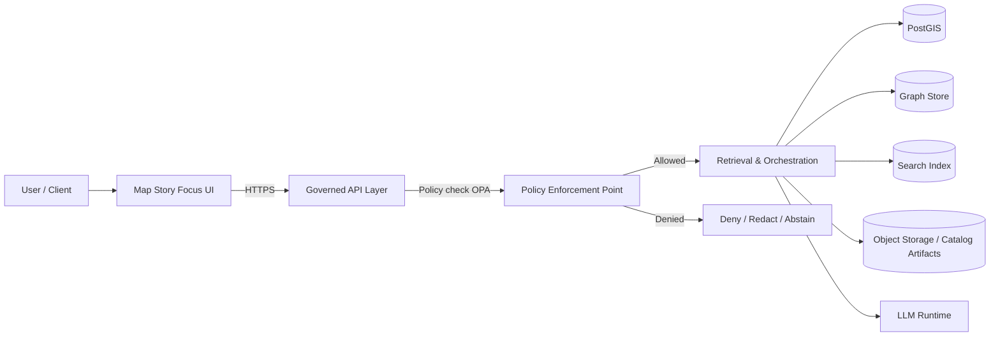

<!-- [KFM_META_BLOCK_V2]
doc_id: kfm://doc/4b8b4a8a-2d3f-4b4f-9ac4-7a8a2f2f4a1d
title: Security Baseline
type: standard
version: v1
status: draft
owners: kfm-platform-security
created: 2026-03-04
updated: 2026-03-04
policy_label: restricted
related: [
  "docs/governance/ROOT_GOVERNANCE_CHARTER.md",
  "docs/quality/RELIABILITY_BASELINE.md",
  "policy/",
  ".github/workflows/"
]
tags: [kfm, security, baseline, governance, supply-chain, policy, cicd]
notes: [
  "Normative: uses MUST/SHOULD/MAY.",
  "Non-normative: implementation status is UNKNOWN unless verified in-repo."
]
[/KFM_META_BLOCK_V2] -->

# SECURITY_BASELINE
Security controls that are required for KFM code, data pipelines, catalogs, APIs, UI, and automation.

---

> [!IMPORTANT]
> **This document is normative for “GOVERNED mode.”**  
> If a control cannot be satisfied, the change **MUST fail closed** (blocked from merge/publish) or be formally waived via governance.

---

## Impact
**Status:** active (baseline) · **Owners:** `kfm-platform-security` (TODO: CODEOWNERS mapping) · **Applies to:** repo, CI/CD, pipelines, APIs, UI, ops

**Badges (TODO):**    

**Quick nav:**  
- [Scope](#scope)  
- [Normative language](#normative-language)  
- [Security posture](#security-posture)  
- [Trust membrane and architecture invariants](#trust-membrane-and-architecture-invariants)  
- [Baseline control matrix](#baseline-control-matrix)  
- [Identity and access](#identity-and-access)  
- [Secrets management](#secrets-management)  
- [Supply chain security](#supply-chain-security)  
- [CI gates](#ci-gates)  
- [API and runtime security](#api-and-runtime-security)  
- [Data security](#data-security)  
- [Policy enforcement](#policy-enforcement)  
- [Logging, audit, and incident response](#logging-audit-and-incident-response)  
- [Definition of done checklists](#definition-of-done-checklists)  
- [Appendix: reference snippets](#appendix-reference-snippets)

---

## Scope
This baseline governs:

- **Code**: services, libraries, CLIs, infrastructure-as-code, scripts.
- **Pipelines**: ingestion, transforms, indexers, catalog builders, automation agents.
- **Artifacts**: datasets, STAC/DCAT/PROV, run receipts, SBOMs, attestations.
- **Runtime**: API layer, policy engine, UI, data stores, message/event plumbing.
- **Operational processes**: releases, incident response, backup/restore, access reviews.

**Out of scope (explicit):**
- Detailed pentest playbooks and exploit writeups (keep in security runbooks).
- Vendor-specific hardening guides (link from ops/runbooks if needed).

[Back to top](#security_baseline)

---

## Normative language
- **MUST**: required for merge/publish in GOVERNED mode.
- **SHOULD**: required unless there is a documented exception/waiver.
- **MAY**: optional; adopt when cost/benefit is favorable.

### Evidence labels (for implementation status)
To maintain “cite-or-abstain” discipline, statements about *current implementation* use:

- **CONFIRMED**: verified in-repo or by controlled evidence.
- **PROPOSED**: planned/desired but not yet proven.
- **UNKNOWN**: not verified.

> [!NOTE]
> This document primarily defines **requirements**. Any “status” claims below are **UNKNOWN by default** unless you explicitly link evidence (PR, commit, CI run, receipt).

[Back to top](#security_baseline)

---

## Security posture
KFM security is built around:

- **Default-deny, fail-closed** behavior across policy, access, and promotions.
- **Least privilege** for humans and machines.
- **Evidence-first** operations: every meaningful output is traceable to artifacts and attestations.
- **Reproducibility** as a security property: deterministic builds reduce “unknown unknowns.”
- **No bypass of governance**: all changes flow through governed PRs and gates.

[Back to top](#security_baseline)

---

## Trust membrane and architecture invariants
### Invariants (MUST)
1. **UI/clients MUST NOT access DB/storage directly.** All access crosses the governed API + policy boundary.
2. **Core logic MUST NOT bypass repository/adapter layers** to reach storage directly.
3. **Policy enforcement MUST be centrally applied** at the API boundary for all reads/writes.
4. **Promotion MUST be gated** by validation + provenance + policy tests (fail closed).

### Conceptual security boundary


**MUST:** Any new data access path must demonstrate (via tests) that it crosses `API → PEP` before reaching storage.

[Back to top](#security_baseline)

---

## Baseline control matrix
This is the “minimum viable security posture” for GOVERNED mode.

| Control area | Requirement (normative) | Enforcement surface | Required evidence artifact(s) | Impl status |
|---|---|---|---|---|
| AuthN/AuthZ | Requests MUST be authenticated and authorized by role/scope | API middleware + policy | AuthZ tests; policy tests | UNKNOWN |
| Policy engine | Policy MUST be evaluated on every governed API request | PEP | OPA/Conftest CI results | UNKNOWN |
| Secrets | Secrets MUST NOT be committed to repo | Repo + CI | secret scan report; `.env.example` | UNKNOWN |
| Supply chain | Releases MUST include SBOM + vulnerability scan | CI release workflow | SPDX SBOM; vuln report | UNKNOWN |
| Attestations | Release artifacts MUST be signed/attested | CI release workflow | cosign bundle; Rekor log ref | UNKNOWN |
| Dependency pinning | Dependencies SHOULD be pinned and updated via PRs | Build tooling | lockfiles; update PRs | UNKNOWN |
| Transport | All external traffic MUST use TLS | ingress/proxy | config + tests | UNKNOWN |
| Storage | Sensitive data SHOULD be encrypted at rest | storage layer | config + KMS policy | UNKNOWN |
| Auditing | Security-relevant actions MUST be logged | API + ops | audit logs; run receipts | UNKNOWN |
| Incident response | A documented escalation + kill-switch MUST exist | ops + repo | runbook; feature flag | UNKNOWN |

[Back to top](#security_baseline)

---

## Identity and access
### Human access (MUST)
- Use **SSO-backed** identities where possible (org-managed).
- **RBAC MUST be explicit** (roles, scopes, and data labels).
- **Privileged operations MUST require review** (e.g., CODEOWNERS for `policy/`, `infra/`, `docs/governance/`).
- **Access reviews MUST occur on a schedule** (at least quarterly).

### Service-to-service access (MUST)
- Prefer **short-lived credentials** (OIDC, workload identity).
- Tokens MUST be **scoped** to the minimal permissions.
- Secrets MUST be rotated on a defined cadence and on suspected compromise.

### GitHub / CI identities (SHOULD)
- Prefer a **GitHub App** over long-lived PATs for automation.
- CI tokens MUST be **time-bound and scoped** to the job.

[Back to top](#security_baseline)

---

## Secrets management
### Prohibitions (MUST)
- No secrets (API keys, private keys, DB passwords, tokens) in:
  - git history
  - issues
  - PR descriptions
  - logs
  - example fixtures

### Required patterns (MUST)
- Provide `.env.example` files that contain **placeholders only**.
- Store secrets in a **secret manager** (or encrypted CI secrets) with least privilege.
- Any tooling that needs secrets MUST support **non-interactive injection** via CI (no local-only hacks).

### Detection (SHOULD)
- CI SHOULD run secret scanning (push + PR).
- Preventive hooks (pre-commit) MAY be used, but CI remains the enforcement authority.

[Back to top](#security_baseline)

---

## Supply chain security
### SBOM (MUST for releases)
- Every released build artifact MUST produce an **SPDX SBOM** (or CycloneDX if standardized).
- SBOM MUST be stored alongside release artifacts and referenced by digest.

### Artifact signing and attestations (MUST for releases; SHOULD for promotion candidates)
- Release artifacts MUST be:
  - **content-addressed** (digests)
  - **signed/attested** (keyless when feasible)
  - **verifiable** in CI before publish/promotion

### Dependency and vulnerability management (MUST)
- CI MUST run dependency vulnerability scanning for:
  - application deps
  - base images
  - build toolchains
- High severity issues MUST fail the build (unless waived with explicit governance approval).

### Reproducibility (SHOULD → MUST for critical artifacts)
- Where feasible, builds SHOULD be reproducible and verified (hash comparison).
- For “PUBLISHED zone” artifacts, reproducibility checks SHOULD be treated as MUST.

[Back to top](#security_baseline)

---

## CI gates
### Minimum PR gates (MUST)
A PR MUST NOT merge unless all applicable gates pass:

- **Lint/typecheck/unit tests**
- **Policy tests** (OPA/Rego + Conftest where applicable)
- **Contract tests** (OpenAPI/JSON schema validation)
- **Dependency/security scans** (SAST + dependency)
- **No secrets detected**
- **(When producing artifacts)** checksums + run receipt + provenance present

### Fail-closed rules (MUST)
- Any missing required evidence → **fail**.
- Any policy evaluation error → **deny** (not “warn”).
- Any unsigned release artifact (when signing required) → **fail**.

[Back to top](#security_baseline)

---

## API and runtime security
### API boundary controls (MUST)
- **Authentication** on all non-public endpoints.
- **Authorization** on every request (role/scope/data-label).
- **Input validation**: schema-validated request bodies and parameters.
- **Rate limiting** on public-facing endpoints (or an upstream gateway).
- **CORS** configured to allow-list trusted origins only.

### Network segmentation (SHOULD)
- Limit east-west traffic to required ports only.
- Data stores SHOULD be private (no public ingress).

### Web UI baseline (SHOULD)
- Apply CSP, strict transport, and safe embedding defaults.
- Browser MUST NOT fetch untrusted remote attestations directly; verify via server proxy.

[Back to top](#security_baseline)

---

## Data security
### Classification (MUST)
- Every dataset MUST carry:
  - license/rights metadata
  - sensitivity classification label
  - redaction/generalization obligations (if applicable)

### Encryption (SHOULD)
- Encrypt in transit (TLS) for all network links.
- Encrypt at rest for sensitive datasets and production stores.

### Retention and deletion (MUST)
- Retention policy MUST exist per zone:
  - RAW is immutable (retention by design / governance)
  - WORK may be purged per policy
  - PUBLISHED retention aligns with legal + governance rules

### Sensitive geospatial data (MUST)
- Do not publish precise coordinates for sensitive entities unless policy explicitly allows.
- Apply aggregation/generalization at publish time when required by policy labels.

[Back to top](#security_baseline)

---

## Policy enforcement
### Policy-as-code (MUST)
- OPA/Rego (or equivalent) policies MUST be versioned in-repo.
- CI MUST run:
  - formatting/lint (where available)
  - strict checks compatible with the repo’s Rego version
  - policy tests against representative fixtures

### Rego v1 posture (SHOULD)
- Policy code SHOULD be compatible with Rego v1 semantics.
- Migration steps SHOULD be tracked and enforced in CI (strict checks).

### Runtime behavior (MUST)
- If policy evaluation fails (error/timeout), the system MUST deny by default.

[Back to top](#security_baseline)

---

## Logging, audit, and incident response
### Logging and audit (MUST)
- Emit structured logs for:
  - authN/authZ decisions
  - policy decisions and obligations applied
  - promotions/publishes
  - admin actions (config changes, key rotations)
- Logs MUST avoid secrets and minimize PII.
- Audit trails SHOULD be tamper-evident (append-only where feasible).

### Incident response (MUST)
- Maintain:
  - a security incident runbook
  - an on-call/escalation path (even if small team)
  - a rollback plan for releases and publishes

### Kill-switch (MUST)
- A documented kill-switch MUST exist to stop:
  - automation that opens PRs
  - publishing/promotions
  - high-risk runtime features
- Kill-switch MUST fail closed (disable the action, not degrade to bypass).

[Back to top](#security_baseline)

---

## Definition of done checklists
### New API endpoint DoD (MUST)
- [ ] AuthN required (or explicitly public with justification)
- [ ] AuthZ enforced via policy (tests included)
- [ ] Input validation (schema)
- [ ] Rate limiting considered (documented)
- [ ] Threat model note added (brief but explicit)
- [ ] Logs/audit events emitted (PII-safe)
- [ ] Contract tests updated (OpenAPI)

### New pipeline / watcher DoD (MUST)
- [ ] Immutable run receipt emitted (who/what/when/why)
- [ ] Checksums for all produced artifacts
- [ ] Provenance bundle (PROV/OpenLineage) written
- [ ] License + sensitivity labels carried through
- [ ] Policy gate in CI for promotion
- [ ] Rollback strategy documented
- [ ] Secrets model documented (ideally none; otherwise least privilege)

### New dataset DoD (MUST)
- [ ] Registry entry complete (identity, schema, license, sensitivity)
- [ ] Validation outputs meet thresholds
- [ ] Catalog triplet (DCAT + STAC + PROV) present
- [ ] Checksums/integrity proof present
- [ ] Policy tests pass
- [ ] Access controls verified for labels

[Back to top](#security_baseline)

---

## Appendix: reference snippets
> These snippets are examples. Treat them as templates and tailor to repo layout.

### Conftest policy gate example (GitHub Actions)
```yaml
name: policy-gate
on:
  pull_request:
    paths:
      - "policy/**"
      - "data/**"
jobs:
  conftest:
    runs-on: ubuntu-latest
    steps:
      - uses: actions/checkout@v4
      - name: Install conftest
        uses: YubicoLabs/action-conftest@v1
      - name: Run policy tests (fail closed)
        run: |
          conftest test data/ --policy policy/
```

### OPA strict check (Rego v1-compatible) example
```bash
opa fmt --write --v0-v1 ./policy
opa check --v0-v1 --strict ./policy
```

### Minimal threat model note template
```markdown
## Threat model note (endpoint: POST /api/v1/example)
- Assets: user identity, dataset access decisions, audit logs
- Entry points: HTTP request body + query params
- Trust boundaries: UI → API → policy engine → data stores
- Key risks: authZ bypass, injection, data exfiltration, replay
- Mitigations: policy tests, schema validation, rate limits, audit logs
```

[Back to top](#security_baseline)
