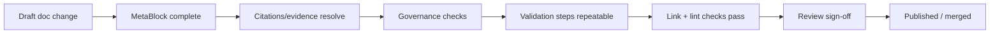

<!-- [KFM_META_BLOCK_V2]
doc_id: kfm://doc/79020f3d-b4a8-4f62-98f5-cd073b9d3605
title: Doc Quality Checklist
type: standard
version: v1
status: draft
owners: KFM Docs
created: 2026-03-02
updated: 2026-03-02
policy_label: public
related:
  - docs/MASTER_GUIDE_v13.md
  - docs/standards/KFM_MARKDOWN_WORK_PROTOCOL.md
tags:
  - kfm
  - docs
  - quality
notes:
  - Merge-blocking checklist for KFM documentation changes (design docs, runbooks, dataset specs, Story Nodes).
[/KFM_META_BLOCK_V2] -->

# KFM Doc Quality Checklist

**Purpose:** A merge-blocking checklist to keep KFM documentation *governed, evidence-first, and buildable*.


<!-- TODO: Replace badges with repo CI badges once paths are known. -->

---

## Navigation

- [When to use this](#when-to-use-this)
- [Non-negotiable principles](#non-negotiable-principles)
- [Quality gates](#quality-gates)
- [Checklist](#checklist)
  - [1) Metadata and identity](#1-metadata-and-identity)
  - [2) Scope, audience, and promises](#2-scope-audience-and-promises)
  - [3) Evidence, citations, and traceability](#3-evidence-citations-and-traceability)
  - [4) Governance, policy, and safety](#4-governance-policy-and-safety)
  - [5) Reproducibility and validation steps](#5-reproducibility-and-validation-steps)
  - [6) Structure, formatting, and readability](#6-structure-formatting-and-readability)
  - [7) Diagrams, tables, and visuals](#7-diagrams-tables-and-visuals)
  - [8) Links, references, and durability](#8-links-references-and-durability)
  - [9) Change management](#9-change-management)
- [Appendix](#appendix)
  - [A) Doc type requirements](#a-doc-type-requirements)
  - [B) “Validation steps” template](#b-validation-steps-template)
  - [C) “Claim card” template](#c-claim-card-template)
  - [D) CI checks](#d-ci-checks)

---

## When to use this

Use this checklist for **any PR that changes**:

- `docs/**` (architecture docs, standards, runbooks, ADRs, templates)
- narrative artifacts (e.g., Story Nodes)
- dataset specs (inputs to `spec_hash`) and any doc that claims a dataset is “publishable”
- API contract docs that define or change an interface surface

> NOTE  
> If a doc creates or changes user-facing meaning (policy, governance, access control, public narrative, or operational behavior),
> treat it as a **governed artifact** and apply the *full* checklist.

[Back to top](#navigation)

---

## Non-negotiable principles

These principles should be reflected explicitly in the doc (or the doc should scope itself so they do not apply):

1. **Contract-first:** schemas and API contracts are first-class artifacts; changes require strict versioning + compatibility thinking.
2. **Deterministic pipeline posture:** transformations should be reproducible and logged; docs should describe deterministic inputs/outputs where relevant.
3. **Evidence-first / cite-or-abstain:** every material claim is traceable; unsupported claims should be labeled as *Unknown* and include verification steps.
4. **Trust membrane:** clients must not bypass governed APIs/policy; docs must not instruct bypass patterns.
5. **Default-deny when unclear:** if licensing, sensitivity, or permissions are uncertain, do not promote or publish details.

[Back to top](#navigation)

---

## Quality gates

Think of doc publication as a small “promotion” workflow: **Draft → Review → Published** with checks that fail closed.



**Merge MUST be blocked** if any of these are true:

- Missing/invalid MetaBlock (identity, status, owners, policy_label)
- The doc makes “Confirmed” claims without evidence pointers (or uses ambiguous wording that implies confirmation)
- The doc instructs behavior that bypasses policy/trust membrane
- The doc exposes sensitive locations/data without an explicit, approved redaction/generalization policy
- Validation steps are absent for procedures that can be tested
- Links are broken (or “TODO links” ship without an explicit tracking issue)

[Back to top](#navigation)

---

## Checklist

### 1) Metadata and identity

- [ ] **MetaBlock v2 is present** at the top of the file (HTML comment) and follows the template.
- [ ] `doc_id` is **stable** (do not regenerate on edits).
- [ ] `status` is correct (`draft`, `review`, or `published`).
- [ ] `owners` is specific (team or named owners).
- [ ] `policy_label` is present and appropriate for the content.
- [ ] `related` includes *at least one* traceable pointer (e.g., dataset/story IDs or doc paths) when applicable.
- [ ] If the doc is a template, it is clearly labeled as a template and includes a “how to use” section.

### 2) Scope, audience, and promises

- [ ] Title + one-line purpose are present in the first screen.
- [ ] The doc states:
  - [ ] intended audience (engineer / steward / analyst / public)
  - [ ] what the doc covers
  - [ ] what the doc explicitly does **not** cover (non-goals)
- [ ] “Must/should/may” wording is consistent and intentional.
- [ ] No “magic capability” claims (e.g., implying the system can do something that is not backed by code/contracts).
- [ ] Any time-sensitive statements include **explicit dates** (YYYY-MM-DD) instead of “recently / currently” when possible.

### 3) Evidence, citations, and traceability

- [ ] Every *material* claim is tagged as one of:
  - [ ] **Confirmed** (backed by a repo artifact; point to it)
  - [ ] **Proposed** (a recommendation; include rationale + tradeoffs)
  - [ ] **Unknown** (needs verification; include minimum verification steps)
- [ ] Dataset-related claims point to:
  - [ ] dataset registry entry / dataset spec (as applicable)
  - [ ] the DCAT/STAC/PROV “triplet” artifacts (as applicable)
  - [ ] a run receipt or audit record when asserting lineage
- [ ] Numbers (counts, percentages, benchmarks) cite their origin or show how to reproduce them.
- [ ] The doc does **not** rely on “LLM citations” (random URLs). Citations should be resolvable internal references (EvidenceRefs or repo paths).
- [ ] The doc clearly separates:
  - [ ] **requirements** (must pass gates)
  - [ ] **implementation options** (tradeoffs)

### 4) Governance, policy, and safety

- [ ] If the doc touches sensitive domains (people, precise locations, cultural/Indigenous data, endangered species, archaeology):
  - [ ] policy_label is restrictive enough
  - [ ] redaction/generalization rules are explicit
  - [ ] the doc avoids publishing precise coordinates or targeting details
- [ ] Licensing/rights:
  - [ ] source license is named (not “unknown”)
  - [ ] any “terms snapshot” requirement is described when relevant
  - [ ] prohibited redistribution/usage constraints are captured (if present)
- [ ] The doc does not include:
  - [ ] secrets, tokens, private keys, internal credentials
  - [ ] doxxing or personally identifying info beyond what policy allows
- [ ] Any instructions that could cause harm (security, safety, operational risk) include a safety note and are scoped to authorized contexts.

### 5) Reproducibility and validation steps

- [ ] If the doc describes a procedure (pipeline run, ingest step, migration, release):
  - [ ] it includes a **copy/paste validation section**
  - [ ] commands are safe-by-default (no destructive steps without an explicit warning)
  - [ ] expected outputs are described (files produced, exit codes, checksums, screenshots)
- [ ] Determinism expectations are stated:
  - [ ] input(s) are versioned and identified
  - [ ] output(s) include stable IDs/digests where relevant
- [ ] “Minimum verification steps” are included for any Unknowns.

### 6) Structure, formatting, and readability

- [ ] Uses headings in a predictable hierarchy (`#`, `##`, `###`).
- [ ] Long sections include “Back to top” links.
- [ ] Lists are scannable; avoid paragraph walls.
- [ ] Code blocks:
  - [ ] include a language tag
  - [ ] are runnable or explicitly labeled as pseudo
  - [ ] do not depend on hidden context
- [ ] Uses callouts (`NOTE`, `WARNING`, `TIP`) sparingly and consistently.

### 7) Diagrams, tables, and visuals

- [ ] At least one diagram is included when the doc explains architecture or process flows.
- [ ] Mermaid diagrams render and avoid special characters that break parsing.
- [ ] Tables have:
  - [ ] headers
  - [ ] consistent units
  - [ ] no over-wide columns that destroy readability
- [ ] Images:
  - [ ] have meaningful alt text
  - [ ] avoid embedding sensitive data (screenshots can leak secrets/IDs)

### 8) Links, references, and durability

- [ ] Internal links prefer **relative paths** (not hard-coded external URLs).
- [ ] External links are:
  - [ ] minimized
  - [ ] stable (specs, standards, primary sources)
  - [ ] not the *only* support for a critical claim (mirror essential info inside KFM artifacts)
- [ ] Link rot mitigation:
  - [ ] include commit SHAs / version numbers when pointing to code behavior
  - [ ] avoid “latest” references without dates

### 9) Change management

- [ ] The PR includes a short “What changed / Why” summary.
- [ ] If the doc changes a contract or policy, it includes:
  - [ ] impact statement (who/what breaks)
  - [ ] migration notes
  - [ ] rollback notes (or explains why rollback is not applicable)
- [ ] If the doc is meant to be enforced as a gate, it identifies:
  - [ ] the CI check name (or a TODO + tracking issue)
  - [ ] who owns it
  - [ ] what blocks merges vs warnings

[Back to top](#navigation)

---

## Appendix

### A) Doc type requirements

Use this table to fail closed when a doc type is missing required sections.

| Doc type | MUST include | SHOULD include |
|---|---|---|
| **Standard / guide** | MetaBlock; purpose; scope/non-goals; checklist or requirements; evidence pointers | diagram; examples; FAQ |
| **ADR** | decision; context; options; decision; consequences; rollback | links to issues/PRs; open questions |
| **Runbook** | prerequisites; step-by-step; validation steps; failure modes; escalation | screenshots; troubleshooting matrix |
| **Dataset spec** | canonical spec content (spec_hash input); rights; sensitivity; QA thresholds; artifacts | sample rows/tiles; edge cases |
| **Story Node** | narrative; resolvable citations; review state; policy label | map state snapshot; evidence drawer links |
| **API contract extension** | endpoint/schema change; versioning; error model; auth/policy notes | examples; compatibility notes |

> NOTE  
> Paths like “Story Node template” and “API contract extension template” may exist in the repo; if not, treat them as **Unknown**
> and file a tracking issue rather than inventing a structure.

### B) “Validation steps” template

Copy/paste and fill this in whenever the doc describes a process.

```text
## Validation steps (copy/paste)

Environment
- OS:
- Tool versions:
- Commit SHA:

Steps
1) ...
2) ...

Expected outputs
- Files created:
- Commands exit codes:
- Checksums/digests:
- Screenshots (if UI):
```

### C) “Claim card” template

Use this when a doc contains a high-impact claim.

```text
### Claim: <short claim>

Status: Confirmed | Proposed | Unknown

Evidence (required if Confirmed):
- <repo path / EvidenceRef / receipt id>

Assumptions:
- ...

Risks:
- ...

Tradeoffs:
- ...

Minimum verification steps (required if Unknown):
1) ...
2) ...
```

### D) CI checks

Below is a **proposed** set of CI checks for doc quality. Add/adjust to fit the repo’s actual workflows.

- [ ] Markdown lint (style + structure)
- [ ] Link checker (internal + external)
- [ ] Mermaid render/validate
- [ ] Spell/grammar (optional, warning-level at first)
- [ ] “Cite-or-abstain” lint (detect unresolvable EvidenceRefs / broken doc refs)
- [ ] Secrets scan (ensure docs don’t leak credentials)

[Back to top](#navigation)
