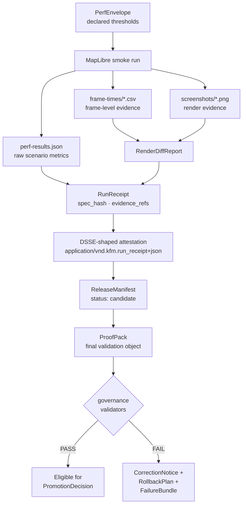

<!-- [KFM_META_BLOCK_V2]
doc_id: kfm://doc/NEEDS_VERIFICATION
title: MapLibre Performance Governance
type: standard
version: v1
status: draft
owners: ["NEEDS_VERIFICATION"]
created: 2026-05-14
updated: 2026-05-14
policy_label: public
related: [
  "docs/doctrine/directory-rules.md",
  "docs/doctrine/lifecycle-law.md",
  "docs/doctrine/trust-membrane.md",
  "docs/architecture/map-shell.md",
  "tools/README.md",
  ".github/workflows/maplibre-perf-governance.yml"
]
tags: ["kfm","maplibre","performance","governance","proof-pack","release-manifest","run-receipt"]
notes: [
  "Path under docs/quality/ is PROPOSED; not in Directory Rules §6.1 canonical docs/ tree.",
  "Trust-bearing artifacts (RunReceipt, ProofPack, ReleaseManifest) placement requires review per Directory Rules §8.1."
]
[/KFM_META_BLOCK_V2] -->

# MapLibre Performance Governance

> Governed performance lane that turns MapLibre renderer smoke runs into inspectable KFM evidence — bounding latency, frame stability, and render diffs through canonical receipts, attestations, and manifests before any release-candidate posture is permitted.


**Status:** draft · **Owners:** `NEEDS_VERIFICATION` · **Last reviewed:** 2026-05-14

> [!IMPORTANT]
> This document is **doctrine-grounded** but **implementation-bounded**. Every concrete path, script name, validator name, schema reference, and CI workflow name in this file is **PROPOSED** until a mounted-repo inspection or an accepted ADR confirms it. Treat the workflow shape as a contract design, not as a snapshot of repo state.

---

## Quick links

- [Purpose](#purpose)
- [Where this fits](#where-this-fits)
- [Artifact flow](#artifact-flow)
- [Canonical artifacts](#canonical-artifacts)
- [Finite outcomes](#finite-outcomes)
- [Gate sequence](#gate-sequence)
- [Negative-state coverage](#negative-state-coverage)
- [Failure handling](#failure-handling)
- [CI workflow shape](#ci-workflow-shape)
- [Release rule](#release-rule)
- [Rollback and correction](#rollback-and-correction)
- [Open questions](#open-questions)
- [Related docs](#related-docs)

---

## Purpose

The MapLibre performance governance lane verifies that renderer changes remain **fast, visually stable, and publication-safe** before they can be treated as release candidates. It exists because:

- Renderer performance is **operationally current** evidence — last quarter's frame-time numbers cannot stand in for this release's behavior. *(CONFIRMED doctrine — Unified Build Manual §25; Master MapLibre Components §T.)*
- Render-diff regressions are a publication risk: a small style or symbol change can silently degrade public maps. *(CONFIRMED doctrine — Master MapLibre Components §V, §W.)*
- KFM's trust posture forbids treating renderer output as canonical truth. **Performance evidence must resolve to inspectable artifacts** (PerfEnvelope, RenderDiffReport, RunReceipt, ReleaseManifest, ProofPack) — not "the chart looked fine in the PR." *(CONFIRMED doctrine — Directory Rules §11, §19.)*

This lane produces a set of finite, auditable artifacts that downstream promotion and release gates can read deterministically.

> [!NOTE]
> Performance evidence is **derived** — it does not establish canonical truth on its own. It binds renderer behavior to `spec_hash`, EvidenceBundle references, and a signed RunReceipt, so a PromotionDecision can consult it without re-running the smoke suite.

[Back to top](#maplibre-performance-governance)

---

## Where this fits

```text
WORK candidates
    │
    ├── style / source / layer manifest changes
    │
    ▼
MapLibre perf governance lane  ◄── this document
    │
    ├── PerfEnvelope (declared thresholds)
    ├── RunReceipt
    ├── RenderDiffReport
    ├── DSSE-shaped attestation
    ├── ReleaseManifest
    └── ProofPack
    │
    ▼
PromotionDecision (governed gate, separate duty)
    │
    ▼
PUBLISHED
```

**Authority placement (PROPOSED — Directory Rules §6, §7, §8.1):**

| Object family | Suggested home | Authority class | Status |
|---|---|---|---|
| Perf envelope declaration | `configs/maplibre/perf-envelope.v1.json` | canonical (configs/) | PROPOSED |
| Validator entry point | `tools/validators/maplibre/validate_perf_governance.py` | canonical (tools/) | PROPOSED |
| Smoke and packaging scripts | `tools/maplibre/perf/...` (graduated from `scripts/`) | canonical (tools/) | PROPOSED |
| RunReceipt | `data/receipts/maplibre-perf/...` | canonical (data/) | PROPOSED |
| RenderDiffReport | `data/proofs/maplibre-perf/...` *(or `artifacts/qa/`)* | canonical / compatibility | PROPOSED — see §[Open questions](#open-questions) |
| ProofPack | `data/proofs/maplibre-perf/...` | canonical (data/) | PROPOSED |
| ReleaseManifest | `release/maplibre-perf/...` | canonical (release/) | PROPOSED |

> [!WARNING]
> Several MapLibre perf draft layouts have placed trust-bearing artifacts (RunReceipt, ProofPack, ReleaseManifest) under `artifacts/perf/`. Directory Rules **§8.1** and the §16 Path-Validation Checklist require these to live under `data/receipts/`, `data/proofs/`, or `release/` respectively. **`artifacts/` is build/docs/qa/temporary only and is not a trust-bearing home.** This is a known migration item; see [Open questions](#open-questions). *(CONFIRMED — Directory Rules §8.1, §13 anti-patterns row "Trust-bearing material in `artifacts/`".)*

[Back to top](#maplibre-performance-governance)

---

## Artifact flow



> [!NOTE]
> The diagram above describes the **doctrinal artifact flow**, not a verified runtime DAG. Step names, script paths, and validator names are PROPOSED until ADR or repo evidence confirms them. *(Directory Rules §0.)*

[Back to top](#maplibre-performance-governance)

---

## Canonical artifacts

Each artifact in the lane has a single responsibility. None substitutes for another. *(CONFIRMED doctrine — Master MapLibre Components §V, Unified Build Manual §10–12, §32.)*

| Artifact | Role | Suggested path | Status |
|---|---|---|---|
| `PerfEnvelope` | Declares governed thresholds (median, p95, frame-drop %, decode time, render time) | `configs/maplibre/perf-envelope.v1.json` | PROPOSED |
| `perf-results.json` | Raw scenario metrics emitted by the smoke run | `data/work/maplibre-perf/<run_id>/perf-results.json` | PROPOSED |
| `frame-times/*.csv` | Reconstructable, frame-level evidence for p95/p99 derivations | `data/work/maplibre-perf/<run_id>/frame-times/` | PROPOSED |
| `screenshots/*.png` | Render evidence inputs to RenderDiffReport | `data/work/maplibre-perf/<run_id>/screenshots/` | PROPOSED |
| `RenderDiffReport` | Visual regression report linking pre/post screenshots and pixel-diff scores | `data/proofs/maplibre-perf/<run_id>/render-diff-report.json` | PROPOSED |
| `RunReceipt` | Governed perf run receipt: inputs, outputs, hashes, tool versions, timestamps, policy posture, evidence refs *(CONFIRMED definition — Build Manual §32.2)* | `data/receipts/maplibre-perf/<run_id>/run-receipt.json` | PROPOSED |
| DSSE envelope | Canonical signing wrapper; `payloadType: application/vnd.kfm.run_receipt+json` | `data/receipts/maplibre-perf/<run_id>/run-receipt.dsse.json` | PROPOSED |
| `ReleaseManifest` | Hash-locked release candidate manifest; records `status`, correction path, rollback target *(CONFIRMED definition — Build Manual §32.2)* | `release/maplibre-perf/<run_id>/release-manifest.json` | PROPOSED |
| `ProofPack` | Final validation proof object pinning the manifest, receipt, and validator outcomes together *(CONFIRMED family — Master MapLibre Components §V)* | `data/proofs/maplibre-perf/<run_id>/proof-pack.json` | PROPOSED |

### `spec_hash` requirement

Every artifact in this lane MUST carry a deterministic `spec_hash` over canonicalized JSON (UTF-8, sorted keys, compact separators). This is the same canonicalization rule used by the broader KFM receipt and proof-pack families — it is not a MapLibre-specific convention. *(CONFIRMED doctrine — Master MapLibre Components §V; New Ideas canonicalization rules.)*

```python
# Canonical hashing input (PROPOSED — common helper)
canonical = json.dumps(obj, sort_keys=True, separators=(",", ":"))
spec_hash = hashlib.sha256(canonical.encode("utf-8")).hexdigest()
```

[Back to top](#maplibre-performance-governance)

---

## Finite outcomes

Every governed gate in KFM returns one of a small, well-known set of finite outcomes. The MapLibre perf lane is no exception. *(CONFIRMED doctrine — KFM Domains Atlas §24.3; Whole-UI + Governed AI Expansion §19.)*

| Outcome | When | Lane effect |
|---|---|---|
| `PASS` | Validator and threshold checks all succeed; evidence resolves | Eligible for ReleaseManifest `status: candidate` and downstream PromotionDecision |
| `FAIL` | One or more validator checks rejected the input | Promotion blocked; `failure-bundle` emitted |
| `ABSTAIN` | Evidence is insufficient or stale; the validator cannot decide | Promotion blocked; lane waits for fresh evidence |
| `DENY` | Policy, rights, sensitivity, or release-state posture forbids promotion | Promotion blocked; reason code recorded |
| `ERROR` | The validator itself could not evaluate — missing schema, malformed input, infra failure | Lane errors out finitely; no claim leakage |

> [!IMPORTANT]
> A validator that returns `PASS` does **not** authorize publication. Publication requires a separate, governed PromotionDecision and a release-authority signature. Performance validation is **necessary but not sufficient**. *(CONFIRMED doctrine — Directory Rules §11; Unified Build Manual §17.)*

[Back to top](#maplibre-performance-governance)

---

## Gate sequence

A single command (PROPOSED) runs the governance gate sequence. Each step is a separately auditable check; the aggregate outcome is a finite `PASS` / `FAIL` / `ABSTAIN` / `ERROR`.

```bash
python3 tools/validators/maplibre/validate_perf_governance.py
```

The sequence:

1. **PerfEnvelope validation** — declared thresholds parse against schema; values are within sane bounds.
2. **RenderDiffReport validation** — schema valid; references resolve; pixel-diff scores present for every claimed scenario.
3. **RunReceipt validation** — schema valid; `spec_hash` present; tool versions captured; `evidence_refs` resolve.
4. **Frame-derived metric verification** — p50/p95/p99 values in `perf-results.json` match those derivable from `frame-times/*.csv` to a documented tolerance.
5. **Threshold re-evaluation** — every metric is compared against PerfEnvelope; out-of-envelope metrics produce a finite failure.
6. **ReleaseManifest validation** — schema valid; subjects link to artifacts; `status` value is governed; rollback target present.
7. **Artifact hash verification** — every artifact named in the manifest hashes to the recorded digest.
8. **Subject-link verification** — DSSE-shaped attestation subjects resolve to the same artifacts the manifest names.
9. **Manifest coverage verification** — every scenario in PerfEnvelope appears in the manifest's subjects.
10. **Render-diff coverage verification** — every visual scenario in PerfEnvelope appears in RenderDiffReport.

> [!NOTE]
> The numbered ordering above is the **suggested** evaluation order. Implementations MAY interleave independent checks for parallelism, but the public finite outcome MUST be deterministic for the same inputs.

[Back to top](#maplibre-performance-governance)

---

## Negative-state coverage

> [!IMPORTANT]
> **Negative-state rule (CONFIRMED — Unified Build Manual §§20, 30; BLD-GREEN §24):** validators MUST exercise `DENY`, `ABSTAIN`, `ERROR`, quarantine, stale, restricted, and review-needed paths — not only the success path. The matrix below names PROPOSED fixtures that satisfy this rule for the perf lane.

| Negative state | Fixture (PROPOSED) | Expected outcome |
|---|---|---|
| Missing `spec_hash` in RunReceipt | `fixtures/maplibre-perf/invalid/missing_spec_hash.json` | `FAIL` |
| Out-of-envelope p95 frame time | `fixtures/maplibre-perf/invalid/p95_over_envelope.json` | `FAIL` |
| Render-diff coverage gap (scenario missing from report) | `fixtures/maplibre-perf/invalid/diff_coverage_gap.json` | `FAIL` |
| Frame-time CSV missing rows for declared scenario | `fixtures/maplibre-perf/invalid/csv_underflow.json` | `FAIL` |
| Stale source (PerfEnvelope older than declared cadence) | `fixtures/maplibre-perf/invalid/stale_envelope.json` | `ABSTAIN` |
| DSSE signature missing or invalid | `fixtures/maplibre-perf/invalid/invalid_dsse.json` | `FAIL` |
| ReleaseManifest hash digest mismatch | `fixtures/maplibre-perf/invalid/hash_mismatch.json` | `FAIL` |
| Sensitive content in screenshots (per published-content policy) | `fixtures/maplibre-perf/invalid/sensitive_screenshot.json` | `DENY` |
| Malformed PerfEnvelope JSON | `fixtures/maplibre-perf/invalid/malformed_envelope.json` | `ERROR` |
| Subject-link mismatch (attestation subject ≠ manifest artifact) | `fixtures/maplibre-perf/invalid/subject_mismatch.json` | `FAIL` |

[Back to top](#maplibre-performance-governance)

---

## Failure handling

When governance fails, the lane emits a structured failure record set — not a bare error message — so that downstream review, correction, and rollback paths remain auditable. *(CONFIRMED doctrine — Unified Build Manual §17; Directory Rules §13 "Publication, rights, and sensitivity".)*

| Artifact | Purpose | Suggested path |
|---|---|---|
| `CorrectionNotice` | Explains why publication is blocked; links back to the failing run | `data/receipts/maplibre-perf/<run_id>/correction-notice.json` *(PROPOSED)* |
| `RollbackPlan` | Defines safe rollback / non-promotion posture; names the prior known-good release target | `release/maplibre-perf/<run_id>/rollback-plan.json` *(PROPOSED)* |
| `FailureBundle` | Captures failure evidence, hashes, and validator outputs for forensic review | `data/proofs/maplibre-perf/<run_id>/failure-bundle.json` *(PROPOSED)* |

> [!CAUTION]
> Do not skip these on failure. A perf failure with no CorrectionNotice, no RollbackPlan, and no FailureBundle is indistinguishable from a silent regression. The lane MUST emit a finite failure record set, even if the only failure mode is `ERROR`. *(CONFIRMED doctrine — Build Manual §10–12; Directory Rules §11.)*

[Back to top](#maplibre-performance-governance)

---

## CI workflow shape

A PROPOSED workflow shape is shown below. The exact `name:` keys, script paths, and step ordering are subject to an accepted workflow ADR and to graduation of perf scripts from `scripts/` to `tools/` per Directory Rules §7.5 (graduation rule).

<details>
<summary><b>Click to expand — PROPOSED <code>.github/workflows/maplibre-perf-governance.yml</code> shape</b></summary>

```yaml
# PROPOSED — .github/workflows/maplibre-perf-governance.yml
# All script paths shown as `scripts/...` are candidates for graduation
# to `tools/maplibre/perf/...` per Directory Rules §7.5.

name: maplibre-perf-governance

on:
  pull_request:
    paths:
      - "packages/maplibre/**"
      - "apps/explorer-web/**"
      - "configs/maplibre/**"
      - "tools/validators/maplibre/**"
      - ".github/workflows/maplibre-perf-governance.yml"

jobs:
  maplibre-perf-governance:
    runs-on: ubuntu-latest
    steps:
      - uses: actions/checkout@v4

      - name: Run MapLibre smoke perf
        run: node scripts/maplibre-smoke-perf.mjs

      - name: Build MapLibre render diff report
        run: node scripts/build-maplibre-render-diff.mjs

      - name: Attest MapLibre perf receipt
        run: node scripts/attest-maplibre-perf.mjs

      - name: Build MapLibre perf release manifest
        run: node scripts/build-maplibre-perf-release-manifest.mjs

      - name: Validate MapLibre perf governance
        run: python3 tools/validators/maplibre/validate_perf_governance.py

      - name: Build MapLibre perf ProofPack
        run: node scripts/build-maplibre-perf-proof-pack.mjs

      - name: Validate MapLibre perf ProofPack
        run: |
          python3 tools/validators/maplibre/validate_perf_proof_pack.py \
            data/proofs/maplibre-perf/${{ github.run_id }}/proof-pack.json

      - name: Upload perf governance bundle
        if: always()
        uses: actions/upload-artifact@v4
        with:
          name: maplibre-perf-governance-${{ github.run_id }}
          path: |
            data/receipts/maplibre-perf/${{ github.run_id }}/
            data/proofs/maplibre-perf/${{ github.run_id }}/
            release/maplibre-perf/${{ github.run_id }}/
```

</details>

> [!NOTE]
> **No-network-by-default rule (CONFIRMED — Unified Build Manual §25):** CI for `tools/validators/` MUST be no-network by default. The MapLibre smoke run is the **opt-in** runtime-bearing job in this lane; the validator suite that consumes its output is offline. Do not collapse them.

[Back to top](#maplibre-performance-governance)

---

## Release rule

A MapLibre perf run is **publishable** only when all three of the following hold:

```text
validate_perf_governance.py  → PASS  (outcome JSON: "ANSWER")
validate_perf_proof_pack.py  → PASS  (outcome JSON: "ANSWER")
ReleaseManifest.status       → candidate
```

Anything else maps to `DENY` (policy / posture forbids) or `review_required` (steward intervention needed).

| Lane state | Validator outcome | Manifest status | Release rule effect |
|---|---|---|---|
| Healthy candidate | `PASS` | `candidate` | Eligible for PromotionDecision |
| Threshold breach | `FAIL` | `blocked` | Promotion denied; CorrectionNotice emitted |
| Insufficient evidence | `ABSTAIN` | `blocked` | Promotion paused; lane awaits fresh evidence |
| Sensitive content / policy refusal | `DENY` | `blocked` | Promotion denied; reason code recorded |
| Validator infra failure | `ERROR` | `unknown` | Lane errors finitely; no candidate posture |

> [!IMPORTANT]
> A `candidate` ReleaseManifest is **not a public release**. PUBLISHED state is reached only through a separate, governed PromotionDecision authored by an actor other than the perf-lane author when materiality applies. *(CONFIRMED doctrine — KFM Domains Atlas §24.7.2 separation-of-duties matrix; Directory Rules §11 "Separate policy-significant release duties when maturity justifies it.")*

[Back to top](#maplibre-performance-governance)

---

## Rollback and correction

Rollback and correction in this lane follow the broader KFM correction discipline. *(CONFIRMED doctrine — Unified Build Manual §10–12; New Ideas attestation reference.)*

- **Rollback target** — every ReleaseManifest names a prior known-good `rollback_target` (a previous ReleaseManifest hash or PUBLISHED PMTiles digest). The lane MUST verify that the rollback target is itself a previously-PASSED governance run.
- **CorrectionNotice** — when a regression is discovered after promotion, a CorrectionNotice is emitted referencing the offending RunReceipt and ReleaseManifest. CorrectionNotices are not silent; they appear in the public correction lineage.
- **Rollback drill** — at maturity, the lane SHOULD include a periodic rollback drill (a dry-run of `rollback_target` restoration with hash verification) under `docs/runbooks/`. *(PROPOSED.)*

[Back to top](#maplibre-performance-governance)

---

## Open questions

These items are **explicitly unresolved** and SHOULD be tracked in `docs/registers/VERIFICATION_BACKLOG.md` and addressed via ADR or per-root README. *(Directory Rules §18 pattern.)*

| # | Question | Why it matters | Status |
|---|---|---|---|
| Q1 | Does `docs/quality/` belong in the canonical `docs/` tree, or should this document live under `docs/architecture/`, `docs/runbooks/`, or `docs/governance/`? | `docs/quality/` is not listed in Directory Rules §6.1 canonical `docs/` tree. | **NEEDS VERIFICATION** — open ADR candidate |
| Q2 | Where do RunReceipt, ProofPack, and ReleaseManifest physically live for this lane? Several draft layouts placed them under `artifacts/perf/`; Directory Rules §8.1 routes them to `data/receipts/`, `data/proofs/`, and `release/`. | Trust-bearing content MUST NOT live in `artifacts/` per §8.1, §13, §16 path checklist. | **OPEN** — migration required if any current placement differs |
| Q3 | Should perf smoke and packaging scripts (`scripts/maplibre-*.mjs`) graduate from `scripts/` to `tools/maplibre/perf/...` per the §7.5 graduation rule? | These are long-lived, trust-bearing CI gates, not one-offs. | **PROPOSED** — graduation candidate |
| Q4 | What is the canonical home for `perf-envelope.v1.json` — `configs/maplibre/` or under a schema-registered path like `schemas/contracts/v1/maplibre/perf-envelope/`? | Determines whether the envelope is a config or a versioned schema instance. | **NEEDS VERIFICATION** |
| Q5 | What numeric exit codes does `validate_perf_governance.py` return for each finite outcome? | Per `tools/README.md` validator exit-code contract (idea ML-U-105), a stable mapping is required and is ADR-class. | **PROPOSED — pending ADR** |
| Q6 | Does the lane emit a `PromotionDecision` directly, or does it stop at `ReleaseManifest.status: candidate` and let a separate promotion lane decide? | Separation of duties (KFM Atlas §24.7.2) favors the latter. | **PROPOSED** — separation preferred |

[Back to top](#maplibre-performance-governance)

---

## Related docs

- `docs/doctrine/directory-rules.md` — placement authority for every path quoted in this file. **(authoritative)**
- `docs/doctrine/lifecycle-law.md` — RAW → WORK / QUARANTINE → PROCESSED → CATALOG / TRIPLET → PUBLISHED. *(PROPOSED link target.)*
- `docs/doctrine/trust-membrane.md` — why public clients consume governed artifacts, not raw renderer output. *(PROPOSED link target.)*
- `docs/architecture/map-shell.md` — MapLibre map shell architecture. *(PROPOSED link target.)*
- `tools/README.md` — validator exit-code contract; negative-state rule; graduation rule.
- `docs/adr/ADR-0001-schema-home.md` — schema home rule referenced by Q4. *(PROPOSED link target.)*
- `docs/registers/VERIFICATION_BACKLOG.md` — tracking home for the [Open questions](#open-questions) above. *(PROPOSED link target.)*

[Back to top](#maplibre-performance-governance)

---

## Appendix A — Glossary (lane-local)

<details>
<summary><b>Click to expand — terms used in this document</b></summary>

| Term | Definition | Source |
|---|---|---|
| **PerfEnvelope** | Declarative thresholds (median, p95, p99, frame drop %, decode and render times) the lane enforces. | Lane-local (PROPOSED) |
| **RunReceipt** | Execution record pinning inputs, outputs, hashes, tool versions, timestamps, failures, policy posture, and evidence refs. | CONFIRMED — Unified Build Manual §32.2 |
| **DSSE** | Dead Simple Signing Envelope; wrapper used to carry a canonicalized receipt and signature. | CONFIRMED — Unified Build Manual §32.3 |
| **RenderDiffReport** | Visual regression report linking pre/post screenshots, scenario IDs, and pixel-diff scores. | Lane-local (PROPOSED) |
| **ReleaseManifest** | Record of published artifact set, digests, policy posture, release state, correction path, and rollback target. | CONFIRMED — Unified Build Manual §32.2 |
| **ProofPack** | Final validation proof object pinning manifest, receipts, and validator outcomes. | CONFIRMED family — Master MapLibre Components §V |
| **PromotionDecision** | Governed state-transition record enumerating Promotion Gates A–G as auditable promotion memory. | CONFIRMED — Unified Build Manual §32.2 |
| **RollbackPlan** | Defines safe rollback / non-promotion posture; names a prior known-good release target. | CONFIRMED family — New Ideas attestation reference |
| **CorrectionNotice** | Lineage correction record emitted when a regression is found after publication. | CONFIRMED family — Unified Build Manual §10–12 |
| **`spec_hash`** | Deterministic hash over canonicalized JSON (UTF-8, sorted keys, compact separators). | CONFIRMED — Master MapLibre Components §V; New Ideas canonicalization rules |
| **Finite outcomes** | `PASS`, `FAIL`, `ABSTAIN`, `DENY`, `ERROR` — the closed set every governed gate returns. | CONFIRMED — KFM Domains Atlas §24.3 |

</details>

---

## Appendix B — Doctrine grounding

<details>
<summary><b>Click to expand — where each rule in this document is grounded</b></summary>

| Rule asserted here | Grounding | Label |
|---|---|---|
| Receipts/proofs/manifests do not live in `artifacts/` | Directory Rules §8.1, §13, §16 | CONFIRMED |
| Validators must exercise DENY/ABSTAIN/ERROR/quarantine/stale paths | Unified Build Manual §§20, 30; BLD-GREEN §24 | CONFIRMED |
| Finite outcomes are a closed set | KFM Domains Atlas §24.3; Whole-UI+Governed AI §19 | CONFIRMED |
| Trust-bearing scripts must graduate from `scripts/` to `tools/` | Directory Rules §7.5 | CONFIRMED |
| CI for validators is no-network by default | Unified Build Manual §25 | CONFIRMED |
| Separation of duties for promotion authority | KFM Domains Atlas §24.7.2 | CONFIRMED |
| `spec_hash` canonicalization (UTF-8, sorted keys, compact separators) | Master MapLibre Components §V; New Ideas canonicalization rules | CONFIRMED |
| DSSE payloadType `application/vnd.kfm.run_receipt+json` | New Ideas attestation reference | CONFIRMED for receipt family; **PROPOSED** for perf-specific subtype |
| Specific path under `docs/quality/` | Not in Directory Rules §6.1 canonical tree | **PROPOSED — needs ADR or relocation** |
| Specific paths under `tools/validators/maplibre/`, `configs/maplibre/`, `data/receipts/maplibre-perf/`, `data/proofs/maplibre-perf/`, `release/maplibre-perf/` | Plausible under §6, §7, §8 patterns | **PROPOSED** until mounted-repo inspection confirms |

</details>

---

**Related:** [Directory Rules](../doctrine/directory-rules.md) · [Tools README](../../tools/README.md) · [Verification Backlog](../registers/VERIFICATION_BACKLOG.md)

**Last reviewed:** 2026-05-14 · **Version:** v1 (draft)

[⬆ Back to top](#maplibre-performance-governance)
