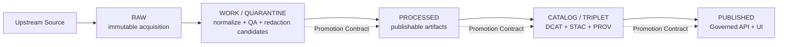

<!-- [KFM_META_BLOCK_V2]
doc_id: kfm://doc/feb59151-e36f-4675-8e0d-bc6efd3f5e7b
title: Promotion Readiness Checklist
type: standard
version: v1
status: draft
owners: TBD (KFM Maintainers / Data Stewardship)
created: 2026-03-02
updated: 2026-03-02
policy_label: public
related:
  - docs/quality/
  - docs/governance/ (TODO: add exact governance doc links)
  - docs/policy/ (TODO)
tags: [kfm, quality, promotion, governance]
notes:
  - This checklist is intentionally fail-closed and maps directly to the Promotion Contract gates.
[/KFM_META_BLOCK_V2] -->

# Promotion Readiness Checklist


Promote a **dataset version** (and its catalog/provenance) from **WORK/QUARANTINE → PROCESSED → CATALOG → PUBLISHED** only when every required artifact is present, validated, policy-labeled, and auditable.

> **FAIL-CLOSED RULE:** If any item below is **Unknown**, **Missing**, or **Not Verified**, promotion **MUST NOT** proceed.

---

## Quick navigation

- [Where this fits](#where-this-fits)
- [Scope](#scope)
- [Truth path and gate flow](#truth-path-and-gate-flow)
- [Promotion contract summary](#promotion-contract-summary)
- [Promotion readiness checklist](#promotion-readiness-checklist-1)
  - [Pre-flight](#pre-flight)
  - [Gate A: Identity and versioning](#gate-a-identity-and-versioning)
  - [Gate B: Licensing and rights metadata](#gate-b-licensing-and-rights-metadata)
  - [Gate C: Sensitivity classification and redaction plan](#gate-c-sensitivity-classification-and-redaction-plan)
  - [Gate D: Catalog triplet validation](#gate-d-catalog-triplet-validation)
  - [Gate E: QA and thresholds](#gate-e-qa-and-thresholds)
  - [Gate F: Run receipt and audit record](#gate-f-run-receipt-and-audit-record)
  - [Gate G: Release manifest](#gate-g-release-manifest)
- [Post-promotion smoke tests](#post-promotion-smoke-tests)
- [Promotion worksheet template](#promotion-worksheet-template)
- [Appendix: Suggested CI checks](#appendix-suggested-ci-checks)

---

## Where this fits

**Repo location:** `docs/quality/promotion-readiness-checklist.md`

**Purpose:** A single, reviewer-friendly checklist that maps directly to KFM’s truth path zones and **Promotion Contract** gates.

**Intended users:** contributors, operators, reviewers/stewards.

### Directory tree (minimum)

```text
docs/
  quality/
    promotion-readiness-checklist.md  # this file
```

---

## Scope

### This checklist covers

- Promoting a **dataset version** into governed surfaces (API/UI) by ensuring:
  - truth path artifacts exist (**RAW**, **WORK/QUARANTINE**, **PROCESSED**, **CATALOG/TRIPLET**)
  - policy gates are satisfied (Promotion Contract)
  - evidence and provenance are resolvable (DCAT/STAC/PROV + EvidenceRefs)
  - auditing is reproducible (run receipt + append-only audit record)

### This checklist does NOT cover

- Day-to-day data exploration in WORK (non-promoted experiments)
- Full security hardening guidance (use the security docs/runbooks)
- “How to write a pipeline” (use pipeline authoring docs)

---

## Truth path and gate flow

KFM’s lifecycle is a set of **storage zones + validation gates** that create an auditable “truth path”.



**Zone reminders (operational intent):**

- **RAW** is append-only and contains acquisition manifest + raw artifacts + checksums + minimal metadata, including upstream license/terms snapshot.
- **WORK/QUARANTINE** is where normalization, QA reports, and candidate redactions happen; **quarantined items are not promoted**.
- **PROCESSED** contains publishable artifacts in approved formats with checksums and derived runtime metadata.
- **CATALOG/TRIPLET** is cross-linked **DCAT + STAC + PROV** (and run receipts) that form the canonical interface to runtime.
- **PUBLISHED** surfaces may only serve promoted dataset versions via governed API/UI with policy enforcement.

---

## Promotion contract summary

Promotion to **PUBLISHED** is blocked unless **minimum gates** are met. Gates are framed to be automatable in CI and reviewable for steward sign-off.

| Gate | What must be present (minimum) | What fails promotion |
|---|---|---|
| **A** Identity & versioning | `dataset_id`, `dataset_version_id`, deterministic `spec_hash`, artifact digests | Missing/unstable IDs or hashes |
| **B** Licensing & rights | License/rights metadata + snapshot of upstream terms | Missing/unknown license or rights |
| **C** Sensitivity & redaction | `policy_label` + obligations/redaction plan (generalize geometry, remove fields, etc.) | Any sensitivity uncertainty; obligations not enforced |
| **D** Catalog triplet validation | DCAT/STAC/PROV validate and cross-link; EvidenceRefs resolve without guessing | Broken validation, broken links, unresolvable evidence |
| **E** QA & thresholds | Dataset-specific QA checks + thresholds documented in spec, and met | Thresholds unmet or QA missing |
| **F** Run receipt & audit | Run receipt captures inputs, tooling, hashes, policy decisions; append-only audit record | Missing receipt/audit or unverifiable receipt |
| **G** Release manifest | Promotion recorded as release manifest referencing artifacts and digests | Missing/incorrect manifest |

---

## Promotion readiness checklist

### Pre-flight

**Goal:** ensure scope, roles, and target are clear before you spend time validating artifacts.

- [ ] Identify **what is being promoted**:
  - [ ] dataset_id: `______________`
  - [ ] dataset_version_id: `______________`
  - [ ] promotion target: `PROCESSED` / `CATALOG` / `PUBLISHED`
- [ ] Identify governance owner(s):
  - [ ] steward/reviewer: `______________`
  - [ ] operator running pipelines: `______________`
- [ ] Confirm **no quarantine blockers**:
  - [ ] licensing is clear (or explicitly “metadata-only reference” is intended)
  - [ ] sensitivity is classified (no “we’ll decide later”)
  - [ ] upstream acquisition is reproducible (or the non-reproducibility is documented and accepted)

> **TIP:** If you cannot name the steward and the policy label, you are not ready to promote.

---

### Gate A: Identity and versioning

**Intent:** every promoted dataset version has stable identity and deterministic hashing.

- [ ] Dataset identity is present and stable:
  - [ ] `dataset_id` exists and is stable across rebuilds
  - [ ] `dataset_version_id` exists and is stable for this release candidate
- [ ] Deterministic spec hashing is in place:
  - [ ] `spec_hash` is computed from canonicalized inputs (no OS-dependent drift)
  - [ ] `spec_hash` is stored in metadata and/or run receipt
- [ ] Artifact digests exist:
  - [ ] Every promoted artifact has a cryptographic digest (e.g., sha256)
  - [ ] Digests in catalogs match digests of the underlying artifacts

**Evidence to attach (minimum):**
- [ ] the dataset spec/registry entry that defines identity + version
- [ ] a machine-readable list of artifact digests for the release candidate

---

### Gate B: Licensing and rights metadata

**Intent:** licensing is enforced as a policy input, not treated as optional paperwork.

- [ ] License/rights metadata is complete:
  - [ ] license field present for the dataset
  - [ ] rights holder and reuse constraints are present (when applicable)
- [ ] Upstream terms snapshot exists:
  - [ ] a frozen copy of upstream license/terms used for the acquisition is stored with the release artifacts
- [ ] Any restricted rights are respected:
  - [ ] if rights do **not** allow mirroring, the dataset is **cataloged without mirroring** (metadata-only reference)
  - [ ] exports/downloads (if enabled) include attribution/license text automatically

**Evidence to attach (minimum):**
- [ ] license/rights fields (in registry/spec)
- [ ] upstream terms snapshot artifact

---

### Gate C: Sensitivity classification and redaction plan

**Intent:** policy labels and obligations prevent leakage and enforce safe publication.

- [ ] A **policy_label** is assigned (not “TBD”):
  - [ ] policy_label: `public | public_generalized | restricted | restricted_sensitive_location | internal | embargoed | quarantine` (choose one)
- [ ] Obligations are explicit and testable:
  - [ ] if public is allowed only with generalization, a **separate public_generalized dataset version** exists
  - [ ] redaction/generalization transforms are recorded as first-class PROV activities
  - [ ] restricted metadata is not leaked via error messages or catalogs
- [ ] Sensitive-location handling:
  - [ ] no precise coordinates are exposed for sensitive sites unless policy explicitly allows
  - [ ] geometry is generalized (snap-to-grid / aggregation / bbox-only) when required by obligations

**Evidence to attach (minimum):**
- [ ] policy decision record (allow/deny + obligations)
- [ ] redaction/generalization plan (what changes, how validated)
- [ ] proof that obligations are enforced in CI (policy tests / fixtures)

---

### Gate D: Catalog triplet validation

**Intent:** catalogs are canonical contract surfaces, not optional metadata.

- [ ] **DCAT** validates and includes minimum dataset-level fields:
  - [ ] title, description, publisher
  - [ ] license/rights
  - [ ] spatial + temporal coverage
  - [ ] distributions (one per artifact class)
  - [ ] `kfm:policy_label`, `kfm:dataset_id`, `kfm:dataset_version_id`
- [ ] **STAC** validates:
  - [ ] collection: id/title/description/extent/license + link to DCAT
  - [ ] items: geometry/bbox consistent with policy + datetime + assets with href + checksum/media_type
  - [ ] STAC items link to PROV run receipt and DCAT distribution
- [ ] **PROV** validates and is complete enough to reproduce:
  - [ ] prov:Activity per run
  - [ ] prov:Entity per artifact
  - [ ] prov:Agent includes pipeline and steward approval
  - [ ] environment capture (container image digest, git commit, parameters)
- [ ] Cross-links are present and verified:
  - [ ] DCAT → distributions → artifact digests
  - [ ] DCAT → prov:wasGeneratedBy → PROV bundle
  - [ ] STAC collection rel="describedby" → DCAT dataset
  - [ ] STAC item → PROV activity / run receipt
- [ ] EvidenceRefs resolve without guessing:
  - [ ] representative EvidenceRefs resolve through the evidence resolver into EvidenceBundles

**Evidence to attach (minimum):**
- [ ] DCAT record(s)
- [ ] STAC collection + sample items (or item list)
- [ ] PROV bundle(s)
- [ ] linkcheck report (or validation output) proving cross-links are intact

---

### Gate E: QA and thresholds

**Intent:** quality gates are dataset-specific, documented, and enforced.

- [ ] QA checks are defined in the dataset spec (not “tribal knowledge”):
  - [ ] schema checks (types, required fields)
  - [ ] spatial checks (CRS, bbox sanity, geometry validity)
  - [ ] temporal checks (time coverage, gaps, ordering)
  - [ ] completeness checks (null rates, counts)
  - [ ] domain checks (controlled vocab, allowed ranges)
- [ ] Thresholds are explicit and pass/fail:
  - [ ] thresholds are documented
  - [ ] QA report proves thresholds are met
- [ ] Failure path is enforced:
  - [ ] if thresholds fail, dataset version is quarantined and **not** promoted

**Evidence to attach (minimum):**
- [ ] QA report artifact (machine-readable preferred)
- [ ] threshold config or spec section that defines pass/fail

---

### Gate F: Run receipt and audit record

**Intent:** every promotion is reproducible and auditable.

- [ ] Run receipt exists for the pipeline run(s):
  - [ ] inputs captured (source identifiers, timestamps, manifests)
  - [ ] tooling captured (container digest, git commit, parameters)
  - [ ] outputs captured (artifact list + digests)
  - [ ] policy decisions captured (decision id + obligations applied)
- [ ] Receipt is validated:
  - [ ] receipt matches a versioned schema
  - [ ] if signatures/attestations are enabled, verification is recorded and failures fail closed
- [ ] Audit ledger append exists:
  - [ ] promotion action recorded as append-only audit record
  - [ ] audit retention and access policy is satisfied

**Evidence to attach (minimum):**
- [ ] run receipt JSON (or equivalent)
- [ ] receipt validation output
- [ ] audit record reference / pointer

---

### Gate G: Release manifest

**Intent:** promotion is an explicit release event referencing the exact digests promoted.

- [ ] Release manifest exists:
  - [ ] references dataset_id + dataset_version_id
  - [ ] references all promoted artifacts and their digests
  - [ ] references catalogs (DCAT/STAC/PROV) and run receipts
- [ ] Release manifest is consistent:
  - [ ] manifest references match actual objects and digests

**Evidence to attach (minimum):**
- [ ] release manifest artifact
- [ ] validation output showing referenced digests exist and match

---

## Post-promotion smoke tests

These checks confirm that PUBLISHED surfaces enforce policy and expose trust signals.

- [ ] Governed API surfaces
  - [ ] datasets discovery lists the promoted `dataset_version_id` (policy-filtered)
  - [ ] STAC browse/query works and returns checksums/digests
- [ ] Evidence resolution
  - [ ] evidence resolver resolves representative EvidenceRefs into EvidenceBundles
  - [ ] policy deny paths do not leak restricted metadata
- [ ] UI trust surfaces
  - [ ] map evidence drawer shows license + version and is navigable
  - [ ] restricted layers are denied or shown only as generalized derivatives

> **NOTE:** Story publishing and Focus Mode add additional citation + receipt gates. If you are enabling those surfaces, complete the extra checks in the relevant docs.

---

## Promotion worksheet template

Copy into your PR description (or attach as `promotion_readiness.md`).

### Summary

- Dataset: `______________`
- Version: `______________`
- Target policy_label: `______________`
- Promotion date: `YYYY-MM-DD`
- Steward sign-off: `______________`

### Evidence bundle links

| Gate | Evidence artifact(s) | Link / path | Verified by |
|---|---|---|---|
| A | IDs + spec_hash + digests |  |  |
| B | license + terms snapshot |  |  |
| C | policy decision + obligations + redaction proof |  |  |
| D | DCAT/STAC/PROV + linkcheck |  |  |
| E | QA report + thresholds |  |  |
| F | run receipt + audit ref |  |  |
| G | release manifest |  |  |

### Steward decision

- [ ] **ALLOW promotion**
- [ ] **DENY promotion** (reason + next step required)

Reason / notes:

- `______________________________________________________________`

---

## Appendix: Suggested CI checks

These are examples of CI checks that commonly implement the gates. Exact job names and paths are repo-specific.

- Identity/versioning checks: schema validation; spec_hash golden tests; digest verification.
- Licensing checks: fail if license missing/unknown; require upstream terms snapshot.
- Policy checks: deny-by-default policy tests; verify redaction obligations honored.
- Catalog checks: DCAT/STAC/PROV validators; cross-link linkchecker; EvidenceRef resolution tests.
- QA checks: run dataset QA suite; fail if thresholds unmet (quarantine).
- Receipt checks: validate receipt schema; verify signature/attestation (if enabled).
- Release checks: require release manifest; verify referenced digests exist and match.

<details>
<summary>Suggested artifacts to attach to a promotion PR (copy/paste)</summary>

- `registry/spec` (identity + license + policy_label)
- `RAW` acquisition manifest + checksums
- `QA report` (with thresholds)
- `PROCESSED` artifact digests
- `DCAT/STAC/PROV` artifacts
- `linkcheck report`
- `policy decision record` (+ obligations)
- `run receipt` (+ verification output)
- `release manifest`

</details>

<details>
<summary>Promotion manifest template (JSON) — starter</summary>

> This is a **starter shape** for a release/promotion manifest. Treat it as a contract artifact:
> it should be schema-validated and referenced by digest.

```json
{
  "kfm_promotion_manifest_version": "v1",
  "dataset_slug": "<dataset_slug>",
  "dataset_version_id": "<dataset_version_id>",
  "spec_hash": "sha256:<spec_hash>",
  "released_at": "YYYY-MM-DDTHH:MM:SSZ",
  "artifacts": [
    { "path": "<relative_or_uri>", "digest": "sha256:<...>", "media_type": "<media_type>" }
  ],
  "catalogs": [
    { "path": "<dcat_path>", "digest": "sha256:<...>" },
    { "path": "<stac_collection_path>", "digest": "sha256:<...>" },
    { "path": "<prov_bundle_path>", "digest": "sha256:<...>" }
  ],
  "qa": { "status": "pass|fail", "report_digest": "sha256:<...>" },
  "policy": { "policy_label": "<policy_label>", "decision_id": "kfm://policy_decision/<id>" },
  "approvals": [
    { "role": "steward", "principal": "<id>", "approved_at": "YYYY-MM-DDTHH:MM:SSZ" }
  ]
}
```

</details>

<details>
<summary>Run receipt template (JSON) — starter</summary>

> A run receipt is emitted for every pipeline run that produces promotable artifacts.
> It should capture **inputs, outputs, environment, validations, and policy decision references**.

```json
{
  "kfm_run_receipt_version": "v1",
  "run_id": "kfm://run/<timestamp>.<dataset>.<hash>",
  "run_type": "pipeline",
  "dataset_slug": "<dataset_slug>",
  "dataset_version_id": "<dataset_version_id>",
  "spec_hash": "sha256:<spec_hash>",
  "inputs": [
    { "artifact_id": "kfm://artifact/sha256:<...>", "zone": "raw", "uri": "<uri>", "digest": "sha256:<...>" }
  ],
  "outputs": [
    { "artifact_id": "kfm://artifact/sha256:<...>", "zone": "processed", "path": "<path>", "digest": "sha256:<...>", "media_type": "<media_type>" }
  ],
  "environment": {
    "container_digest": "sha256:<image_digest>",
    "git_commit": "<commit_sha>",
    "params_digest": "sha256:<...>"
  },
  "validation": { "status": "pass|fail", "report_digest": "sha256:<...>" },
  "policy": { "decision_id": "kfm://policy_decision/<id>" },
  "created_at": "YYYY-MM-DDTHH:MM:SSZ"
}
```

</details>

---

## References (internal)

- **Kansas Frontier Matrix (KFM) — Architecture, Governance, and Delivery Plan** (Feb 27, 2026): data lifecycle zones and the Promotion Contract gates A–G.
- **Kansas Frontier Matrix (KFM) — Definitive Design & Governance Guide (vNext)** (snapshot bundle; Feb 2026): policy labels, catalog triplet intent (DCAT/STAC/PROV), run receipt template, promotion manifest template, and policy-as-code expectations.

---

### Back to top

[↑ Back to top](#promotion-readiness-checklist)
