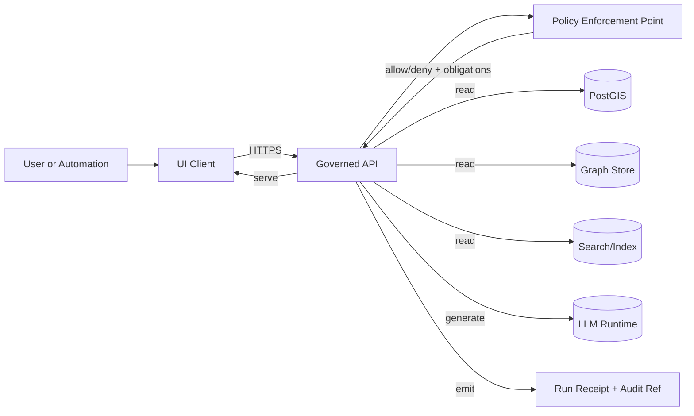

<!-- [KFM_META_BLOCK_V2]
doc_id: kfm://doc/a7b6f58c-3a9b-4a5c-9c59-9b41c66c7f2e
title: Threat Model Checklist
type: standard
version: v1
status: draft
owners: ["@security", "@platform", "@data-governance"]
created: 2026-03-04
updated: 2026-03-04
policy_label: restricted
related: ["docs/governance/", "docs/standards/", "policy/", "contracts/"]
tags: ["kfm", "security", "threat-model", "checklist", "governance"]
notes: ["Fail-closed. Default-deny. Evidence-first. Use for APIs, pipelines, UI, and AI/LLM features."]
[/KFM_META_BLOCK_V2] -->

# Threat Model Checklist
One-page (plus appendices) checklist for threat modeling KFM components, pipelines, and integrations.

> **Default posture:** **fail-closed** and **default-deny**.  
> **Evidence discipline:** every non-trivial statement in the threat model must be labeled **CONFIRMED / PROPOSED / UNKNOWN**.

---

## Impact
- **Status:** active (draft v1; ready to use)
- **Owners:** @security @platform @data-governance
- **Applies to:** PRs, new services, new pipeline domains, new external integrations, auth/policy changes
- **Outputs:** a “Threat Model Packet” (see below) attached to the PR and stored under `docs/quality/`

**Badges (TODO):**  
 

**Quick links:**  
- [When to run this](#when-to-run-this) · [Threat model packet](#threat-model-packet-required-artifacts) · [Core checklist](#core-checklist) · [AI-specific checklist](#ai-llm-specific-checklist) · [Definition of done](#definition-of-done) · [Appendix templates](#appendix)

---

## Scope
Use this checklist to identify, document, and mitigate security/privacy/safety threats for:

- governed APIs (public/internal)
- ingestion pipelines and promotion workflows (RAW→WORK→PROCESSED→PUBLISHED)
- catalog + provenance generation (DCAT/STAC/PROV)
- UI features (Map/Timeline/Story/Focus Mode)
- policy engines and enforcement points (e.g., OPA/PEP)
- AI/LLM integrations (Focus Mode, summarizers, agents, automation)

---

## Where it fits
- **Path:** `docs/quality/threat-model-checklist.md`
- **Upstream inputs:** architecture diagrams, API contracts, data classification, policy constraints
- **Downstream outputs:** PR gates, policy tests, runbooks, monitoring/alerts, incident response steps

### Acceptable inputs
- DFDs (Mermaid ok), sequence diagrams, architecture reference models
- OpenAPI contracts and schema diffs
- Data inventories + classification labels (policy + sensitivity)
- Threat statements and mitigations
- Test plans (unit/integration/contract/policy)
- Operational plans (logging/metrics/traces, rollback, kill-switch)

### Exclusions
- **Do not** use this doc as a substitute for:
  - secure coding standards
  - a full risk register
  - compliance/legal review
- **Do not** put secrets, tokens, private endpoints, or sensitive coordinates into the threat model.

---

## When to run this
Run this checklist when any of the following occurs:

- new external data source, connector, or watcher
- new API endpoint or authZ/authN change
- policy logic changes (OPA/Rego, obligations, redaction)
- new datastore, indexer, or runtime query path
- new UI feature that changes data exposure or aggregation
- any AI/LLM feature that consumes or produces user-visible claims

**Rule of thumb:** if it changes **what data can be accessed, by whom, and how it’s justified**, run this.

---

## Threat model packet required artifacts
Attach these to the PR (or link them from the PR description). If something is missing, mark **UNKNOWN** and list the smallest verification steps.

**Minimum packet (required)**
- [ ] **System summary**: what is being changed and why (1–2 paragraphs)
- [ ] **Trust boundaries & data flow** (DFD/sequence diagram)
- [ ] **Assets & sensitivity classification** (data + secrets + integrity-critical artifacts)
- [ ] **Threats & mitigations table** (STRIDE-style ok)
- [ ] **Policy and governance impact** (what policies enforce this; what new obligations exist)
- [ ] **Verification plan** (tests, monitors, and “how we know the mitigation works”)
- [ ] **Residual risks** + explicit sign-off (who accepts what)

**Recommended packet (strongly suggested)**
- [ ] abuse cases / misuse scenarios
- [ ] supply chain posture (SBOM, pinned deps, SLSA attestations, provenance)
- [ ] rollback plan and kill-switch behavior (fail-closed demonstration)

---

## System invariants to assert
These are “must hold” invariants. If a change violates one, it must be explicitly approved and counter-mitigated.

- [ ] **Invariant A:** UI/clients do not access DB/storage/LLM directly; all access crosses the governed API + policy boundary. **(CONFIRMED/UNKNOWN)**
- [ ] **Invariant B:** Core logic does not bypass repository/adapter layers to reach storage. **(CONFIRMED/UNKNOWN)**
- [ ] **Invariant C:** Data lifecycle promotion requires catalog + provenance + policy gates (no silent publish). **(CONFIRMED/UNKNOWN)**
- [ ] **Invariant D:** Fail-closed on missing provenance, missing licenses, missing policy decisions, or missing checksums. **(CONFIRMED/UNKNOWN)**

> If any invariant is **UNKNOWN**, list the smallest steps to make it **CONFIRMED** (e.g., “add CI contract test that asserts all UI calls go through /api/v1/*”).

---

## Core checklist

### 0) Meta
- [ ] Threat model author + reviewers named
- [ ] Date + version + links to PR/ADR
- [ ] Scope is explicit (in-scope vs out-of-scope)
- [ ] Assumptions listed and labeled **CONFIRMED/PROPOSED/UNKNOWN**

### 1) Assets and security goals
List assets and what “bad” looks like.

- [ ] **Confidentiality goals**: what must not leak (data, secrets, internal topology)
- [ ] **Integrity goals**: what must not be altered undetectably (catalogs, STAC items, receipts, policies)
- [ ] **Availability goals**: what must remain available (governed API, policy engine, catalogs)
- [ ] Assets enumerated:
  - [ ] secrets (tokens, signing keys, OIDC identities)
  - [ ] datasets (RAW/WORK/PROCESSED/PUBLISHED)
  - [ ] catalogs (DCAT/STAC)
  - [ ] provenance (PROV, run receipts, attestations)
  - [ ] indexes (search, tiles, graph indices)
  - [ ] policy bundles / rules (OPA/Rego)

**Evidence discipline:** label each asset inventory statement as **CONFIRMED/PROPOSED/UNKNOWN**.

### 2) Actors and entry points
- [ ] Actors identified:
  - [ ] anonymous public user
  - [ ] authenticated user (role: …)
  - [ ] contributor/steward/operator
  - [ ] external upstream systems
  - [ ] automation/agents/CI runners
  - [ ] attacker models (opportunistic, insider, supply-chain, targeted)
- [ ] Entry points enumerated:
  - [ ] API endpoints
  - [ ] web UI
  - [ ] pipeline triggers (cron, events, PR merges)
  - [ ] object storage/registry reads and writes
  - [ ] policy evaluation endpoints/bundles
  - [ ] admin interfaces / dashboards

### 3) Data flow and trust boundaries
Provide a diagram. Example (edit for your change):

Checklist:
- [ ] All trust boundaries are explicitly labeled
- [ ] All cross-boundary calls are authenticated and authorized
- [ ] Any “bypass” path is either removed or justified + mitigated

### 4) Authorization and policy enforcement
- [ ] AuthN mechanism documented (session/JWT/OIDC/etc.)
- [ ] AuthZ documented by role and action (read/query/export/promote/admin)
- [ ] Policy enforcement is centralized at the PEP (or equivalent)
- [ ] Obligations are explicit (redaction, aggregation thresholds, logging/audit)
- [ ] **Fail-closed** behavior: if policy engine is unavailable or policy decision is missing → deny
- [ ] Policy tests exist (unit + integration) for:
  - [ ] default-deny
  - [ ] least privilege
  - [ ] redaction/obligation correctness
  - [ ] “no direct DB access from UI” contract

### 5) STRIDE-style threat sweep
For each trust boundary and major component, consider:

- [ ] **S**poofing: identity theft, token replay, forged identities
- [ ] **T**ampering: artifact modification, catalog poisoning, receipt rewriting
- [ ] **R**epudiation: missing audit trails, unverifiable actions
- [ ] **I**nformation disclosure: sensitive layers, private coords, secrets in logs
- [ ] **D**enial of service: expensive queries, unbounded fanout, input bombs
- [ ] **E**levation of privilege: role bypass, policy bypass, SSRF to internal systems

Use a table (copy/paste template):

| Threat | Category | Boundary/Component | Scenario | Impact | Likelihood | Risk | Mitigation | Verification | Status |
|---|---|---|---|---:|---:|---:|---|---|---|
| (e.g., policy bypass) | E | API→DB | Direct DB query path added accidentally | High | Med | High | Enforce repository layer + CI test | Contract test fails if bypass exists | PROPOSED |

**Scoring (simple):**
- Impact: Low/Med/High
- Likelihood: Low/Med/High
- Risk: max(Impact, Likelihood) or a 3×3 matrix (pick one and stick to it)

### 6) Input handling and abuse resistance
- [ ] All external inputs validated (schema + bounds)
- [ ] Pagination and limits enforced (page size, time range, bbox size, result cap)
- [ ] Rate limiting strategy documented (per-IP, per-user, per-token)
- [ ] Expensive operations protected:
  - [ ] query cost guards / timeouts
  - [ ] caching where safe
  - [ ] circuit breakers / bulkheads
- [ ] File upload/download endpoints:
  - [ ] content-type validation
  - [ ] size limits
  - [ ] antivirus/malware scanning (if applicable)
  - [ ] safe storage paths and no path traversal

### 7) Data integrity, provenance, and promotion gates
- [ ] Every published dataset has:
  - [ ] deterministic identity/version
  - [ ] checksums/hashes for artifacts
  - [ ] provenance/run receipt (who/what/when/why)
  - [ ] license/rights metadata
  - [ ] sensitivity classification + redaction plan
- [ ] Promotion gates are enforced in CI and/or policy (not tribal process)
- [ ] Replay/rebuild determinism is tested (same inputs + seed → same outputs)

### 8) Secrets and key material
- [ ] No secrets in repo (checked by secret scanning)
- [ ] Least-privilege tokens (scoped, short-lived where possible)
- [ ] Signing/verifying keys handled safely:
  - [ ] rotation plan
  - [ ] audit logs
  - [ ] revocation steps
- [ ] CI uses identity-bound signing/attestation where feasible
- [ ] “Break-glass” procedures documented (restricted access)

### 9) Supply chain security
- [ ] Dependencies pinned (lockfiles) and reviewed
- [ ] SBOM produced for releases (or for components that ship)
- [ ] Provenance attestations produced/verified (SLSA/in-toto/cosign pattern)
- [ ] Third-party integrations reviewed:
  - [ ] scopes and permissions
  - [ ] data sent/received
  - [ ] failure modes and fallbacks

### 10) Observability, auditability, and incident readiness
- [ ] Logs are structured and omit secrets/PII
- [ ] Audit events exist for:
  - [ ] policy decisions
  - [ ] access to sensitive layers
  - [ ] promotion/publish actions
  - [ ] admin actions
- [ ] Metrics and SLOs defined for critical APIs/pipelines
- [ ] Alerts for:
  - [ ] policy engine failures
  - [ ] elevated error rates
  - [ ] unusual access patterns
  - [ ] integrity failures (checksum mismatch, signature invalid)
- [ ] Runbook exists for incident response + rollback

---

## AI/LLM-specific checklist
Use this section if the change involves Focus Mode, summarization, agents, or any LLM runtime.

### 1) Threats unique to LLM workflows
- [ ] Prompt injection / instruction hijacking (from retrieved text, web content, user input)
- [ ] Data exfiltration via model output (secrets, restricted coordinates, embargoed layers)
- [ ] Over-trust / hallucinations presented as facts
- [ ] Training-data leakage assumptions documented (if using any hosted model)
- [ ] Tool misuse: LLM triggers actions it shouldn’t (writes, publishes, merges)

### 2) Controls required
- [ ] Retrieval is governed (only policy-allowed evidence is eligible)
- [ ] Output is citation-gated:
  - [ ] if citations missing/invalid → abstain or reduce scope
- [ ] Redaction/obligation enforcement occurs **after** generation (and ideally also before)
- [ ] Strict tool boundary:
  - [ ] LLM cannot directly access storage/DB
  - [ ] tools are allowlisted + parameter-bounded
- [ ] Determinism strategy documented where required (seed/temp=0 or deterministic templates)

### 3) Agent / automation safety (if applicable)
- [ ] Watcher/Planner/Executor separation is maintained
- [ ] Planner is deterministic/spec-driven (no uncontrolled network calls)
- [ ] Executor cannot merge or push to protected branches
- [ ] Kill-switch exists and is tested (fail-closed)

---

## Definition of Done
A change is “threat-modeled” only if:

- [ ] Threat Model Packet attached to PR
- [ ] All invariants asserted (or exceptions approved with mitigations)
- [ ] Top risks have mitigations + verification
- [ ] Policy tests exist and fail-closed
- [ ] Supply chain posture documented (SBOM/attestations where relevant)
- [ ] Rollback/kill-switch documented for ops-significant changes
- [ ] Residual risks explicitly accepted by named owner(s)

**Sign-off**
- Author: ____________________  Date: __________
- Security reviewer: ___________  Date: __________
- Data governance: _____________  Date: __________
- Platform/ops: ________________  Date: __________

---

## Appendix

### Appendix A — “UNKNOWN → CONFIRMED” smallest steps
Use this mini-template wherever something is UNKNOWN:

- **UNKNOWN claim:** …
- **Why it matters:** …
- **Smallest verification step(s):**
  1) …
  2) …
- **Owner:** …
- **Target PR/Test:** …

### Appendix B — STRIDE worksheet (copy/paste)

Expand STRIDE worksheet

- **Spoofing**
  - Attack: …
  - Control: …
  - Verify: …

- **Tampering**
  - Attack: …
  - Control: …
  - Verify: …

- **Repudiation**
  - Attack: …
  - Control: …
  - Verify: …

- **Information Disclosure**
  - Attack: …
  - Control: …
  - Verify: …

- **Denial of Service**
  - Attack: …
  - Control: …
  - Verify: …

- **Elevation of Privilege**
  - Attack: …
  - Control: …
  - Verify: …

### Appendix C — Suggested storage location for packets (PROPOSED)
- `docs/quality/threat_models/<area>/<YYYY-MM-DD>__<short-title>.md`
- Link from PR description and/or ADR

> PROPOSED because repo conventions may differ; adopt if it matches your doc taxonomy.

---

## Back to top
↑ [Back to top](#threat-model-checklist)
