<div align="center">

# ⚡ Kansas-Frontier-Matrix — Quickstart

**Mission:** Get up and running with Kansas-Frontier-Matrix in **minutes**,  
ensuring you can fetch data, build terrain, validate STAC, and serve the viewer locally.  

[](.github/workflows/site.yml)  
[](.github/workflows/tests.yml)  
[](.github/workflows/stac-validate.yml)  
[](.github/workflows/stac-badges.yml)  

  
  
  

</div>

---

## 🚀 Quick Setup

Clone the repo, create a virtual environment, and install dependencies:

```bash
git clone https://github.com/bartytime4life/Kansas-Frontier-Matrix.git
cd Kansas-Frontier-Matrix

python -m venv .venv
. .venv/bin/activate

pip install -r requirements.txt
````

---

## 🏗 Build Data & Validate

Use the provided **Makefile targets** to fetch, process, and validate:

```bash
make fetch cogs terrain stac

# Validate STAC catalog
kgt validate-stac stac/items --no-strict

# Render viewer config from STAC
kgt render-config --stac stac/items \
  --output web/app.config.json --pretty
```

---

## 🌐 Serve the Viewer

Run a lightweight local server:

```bash
python -m http.server -d web 8080
```

Then open: [http://localhost:8080](http://localhost:8080)

---

## 🔄 Quickstart Lifecycle

```mermaid
flowchart TD
  A["Clone & venv\npython -m venv .venv"] --> B["Install deps\npip install -r requirements.txt"]
  B --> C["Make targets\nfetch · cogs · terrain · stac"]
  C --> D["Validate STAC\nkgt validate-stac"]
  D --> E["Render config\nkgt render-config"]
  E --> F["Serve locally\nhttp.server:8080"]
```



<!-- END OF MERMAID -->

---

## 🧮 Next Steps

* Explore **[data/](../data/README.md)** for sources & policies
* Browse **[stac/](../stac/)** catalog (collections/items)
* Customize configs in **[web/config/](../web/config/)**
* Review **[Makefile](../Makefile)** for advanced targets
* See **[docs/](../docs/)** for templates, SOPs, experiments

---

## ✅ Checklist

* [ ] Python 3.10+ installed
* [ ] `make` available on host
* [ ] All dependencies installed with `pip install -r requirements.txt`
* [ ] `make fetch` and `make stac-validate` complete without errors
* [ ] Viewer accessible at [http://localhost:8080](http://localhost:8080)

---

## 📚 References

* [STAC Spec 1.0.0](https://stacspec.org/)
* [GDAL/PROJ](https://gdal.org/)
* [GNU Make](https://www.gnu.org/software/make/)

---

✅ With this Quickstart, you can:

* Build & validate the catalog
* Render configs from STAC
* Serve the web viewer locally in **less than 10 minutes**
