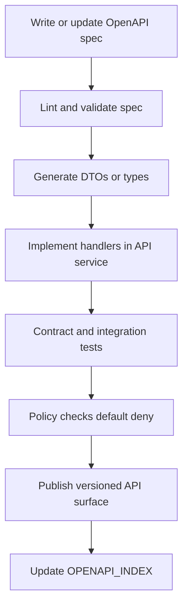

<!-- [KFM_META_BLOCK_V2]
doc_id: kfm://doc/9c1b5ae0-4d87-47e0-bb88-8b7c0fa4c1d8
title: OpenAPI Index
type: standard
version: v1
status: draft
owners: TBD
created: 2026-03-04
updated: 2026-03-04
policy_label: public
related:
  - ../../contracts/openapi/
  - ../governance/
tags: [kfm, openapi, api-contracts, reference]
notes:
  - Contract-first index for KFM governed API surfaces and their OpenAPI specs.
[/KFM_META_BLOCK_V2] -->

# OpenAPI Index
Index of KFM OpenAPI contract surfaces (what exists, what must exist, and how to keep them validated and governed).

> **IMPACT (required)**
> - **Status:** draft
> - **Owners:** TBD (assign CODEOWNERS for `contracts/openapi/**` + this file)
> - **Badges:**   
> - **Quick links:** [Spec registry](#openapi-spec-registry) · [Endpoint index](#endpoint-surface-index-v1) · [Schemas](#shared-schema-index) · [Quickstart](#quickstart) · [Checklist](#gates-and-definition-of-done)

---

## Scope

**CONFIRMED:** KFM treats OpenAPI as a *contract-first* artifact for the governed runtime API surface (the “trust membrane”).  
**PROPOSED:** This file is the **human-readable index** to keep the OpenAPI inventory discoverable, reviewable, and CI-checkable.

### Audience
- API implementers (`apps/api/**`)
- Policy/PEP implementers (`policy/**`)
- UI/clients that call the governed APIs (`apps/ui/**`)
- Reviewers who need a single place to confirm “what endpoints exist in v1”

[Back to top](#openapi-index)

---

## Where it fits

**Path:** `docs/reference/OPENAPI_INDEX.md`

**Upstream:** `contracts/openapi/**` (OpenAPI YAML/JSON)  
**Downstream:** API server DTOs/handlers, contract tests, client generation, and documentation rendering.

### Expected repository shape (verify in live repo)
```text
contracts/
  openapi/
    # OpenAPI specs live here (YAML/JSON)

docs/
  reference/
    OPENAPI_INDEX.md

apps/
  api/
    # Server implementation should conform to OpenAPI (contract-first)
```

[Back to top](#openapi-index)

---

## Acceptable inputs

- OpenAPI specs (`.yaml`, `.yml`, `.json`) under `contracts/openapi/`
- Shared schema fragments referenced from OpenAPI (`components/schemas`)
- Security scheme definitions (OAuth2/OIDC, API keys, etc.) declared in OpenAPI

---

## Exclusions

- **Do not** store generated clients/SDKs in `docs/reference/`
- **Do not** store runtime secrets or environment-specific URLs in OpenAPI
- **Do not** document “private backdoors” or direct DB/storage access endpoints here  
  (Architecture invariant: clients must cross the governed API + policy boundary.)

---

## Evidence labels

This repo uses **evidence discipline** in docs:

- **CONFIRMED:** backed by a KFM blueprint/design source *and* (ideally) verified in the repo.
- **PROPOSED:** design-intent or recommended pattern; implementation may vary.
- **UNKNOWN:** not verified yet; smallest verification steps are provided.

> Tip: when you promote UNKNOWN → CONFIRMED, update this index and link the verifying artifact (CI log, contract test, commit).

---

## OpenAPI spec registry

This table is the **inventory** of OpenAPI specs that define contract surfaces.

Blank fields are intentional: fill them only when verified (fail-closed mindset).

| Spec ID | Path | Base path | Purpose | Design status | Repo presence | Notes / smallest verification steps |
|---|---|---:|---|---|---|---|
| `kfm-api-v1` | `contracts/openapi/kfm-api-v1.yaml` | `/api/v1` | Core governed API: datasets, STAC, evidence resolver, story, focus | CONFIRMED | UNKNOWN | Verify file exists; then ensure it includes endpoint surface in [Endpoint index](#endpoint-surface-index-v1). |
| `kfm-policy-pep` | `contracts/openapi/kfm-policy-pep.yaml` | `/policy` | (Optional) explicit Policy Decision API used by CI/UI/pipelines | PROPOSED | UNKNOWN | Only add if you actually expose a policy decision endpoint; otherwise keep policy internal. |

**Repo verification snippet (runnable):**
```bash
# List all OpenAPI specs that should appear in the registry
find contracts/openapi -maxdepth 2 -type f \( -name "*.yaml" -o -name "*.yml" -o -name "*.json" \) -print
```

[Back to top](#openapi-index)

---

## Endpoint surface index v1

This is the **minimum endpoint surface** the OpenAPI v1 contract is expected to cover.

| Method | Path | Purpose | Design status | Spec coverage |
|---|---|---|---|---|
| `POST` | `/api/v1/evidence/resolve` | Resolve `EvidenceRef` → `EvidenceBundle` (policy + obligations + inspectable evidence) | CONFIRMED | UNKNOWN |
| `GET` | `/api/v1/datasets` | Discover datasets and versions (policy-filtered; returns `dataset_version_id`) | CONFIRMED | UNKNOWN |
| `GET` | `/api/v1/stac/collections` | Browse/query STAC collections (cross-linked to DCAT/PROV) | CONFIRMED | UNKNOWN |
| `GET` | `/api/v1/stac/items` | Browse/query STAC items (assets include digests/checksums) | CONFIRMED | UNKNOWN |
| `GET` / `POST` | `/api/v1/story` | Read/publish Story Nodes (publish gate requires resolvable citations + review state) | CONFIRMED | UNKNOWN |
| `POST` | `/api/v1/focus/ask` | Focus Mode Q&A with cite-or-abstain; governed run receipts | CONFIRMED | UNKNOWN |
| `GET` | `/api/v1/tiles/{layer}/{z}/{x}/{y}.pbf` | Vector tiles (or PMTiles alternative) | PROPOSED | UNKNOWN |

### Smallest verification steps
1. Confirm the OpenAPI spec includes **every** CONFIRMED endpoint above.
2. Add/verify contract tests that fail if any endpoint is removed or its schema changes without review.

[Back to top](#openapi-index)

---

## Shared schema index

These are cross-cutting schemas that should be treated as **stable primitives** across the API.

| Schema | Intended role | Design status | Notes |
|---|---|---|---|
| `ErrorResponse` | Standard error envelope with an audit reference | PROPOSED | Keep stable to make clients deterministic. |
| `EvidenceResolveRequest` | Input to `/evidence/resolve` (`refs[]`) | PROPOSED | Prefer batch resolving for UI efficiency. |
| `EvidenceBundle` | Output of evidence resolution (policy decision + cards + artifacts) | PROPOSED | Must include policy decision + obligations; only include artifact links if allowed. |

**Authoring rule (recommended):** Prefer small, reusable schemas and reference them from endpoint responses via `$ref`.

[Back to top](#openapi-index)

---

## Contract-first workflow



**CONFIRMED invariant:** the API contract is part of the trust membrane; clients should not bypass it.

[Back to top](#openapi-index)

---

## Quickstart

> Everything here is **PROPOSED** until you confirm the repo’s chosen tooling. The commands below are safe defaults.

### Lint/validate OpenAPI locally
```bash
# Option A: redocly (popular OpenAPI linter)
npx @redocly/cli@latest lint contracts/openapi/kfm-api-v1.yaml

# Option B: python validator (basic structural validation)
python -m pip install --upgrade openapi-spec-validator
python -m openapi_spec_validator contracts/openapi/kfm-api-v1.yaml
```

### Render docs locally
```bash
# Option A: Redoc static HTML
npx @redocly/cli@latest build-docs contracts/openapi/kfm-api-v1.yaml -o /tmp/kfm-api-v1.html
```

[Back to top](#openapi-index)

---

## Update procedure

1. **Add or modify** spec in `contracts/openapi/`.
2. **Run lint + validation** (CI must also run and fail-closed).
3. **Update this index**:
   - Add the spec to [OpenAPI spec registry](#openapi-spec-registry)
   - Add/confirm any new endpoints in [Endpoint surface index v1](#endpoint-surface-index-v1)
   - Add/confirm any shared schemas in [Shared schema index](#shared-schema-index)
4. **Add/Update contract tests** (required when behavior changes).
5. **Record change discipline**:
   - small diffs
   - rollback path documented for breaking changes

---

## Gates and Definition of Done

- [ ] **Inventory gate:** every OpenAPI spec in `contracts/openapi/**` is listed in [OpenAPI spec registry](#openapi-spec-registry)
- [ ] **Lint gate:** OpenAPI lint/validate passes in CI (fail-closed)
- [ ] **Security gate:** security schemes declared; no undocumented auth bypass
- [ ] **Schema gate:** request/response schemas are strict and versioned
- [ ] **Policy gate:** endpoints that return data are policy-filtered; obligations flow back to clients
- [ ] **Evidence gate:** any citation-like reference used by UI/Focus/Story resolves via `/api/v1/evidence/resolve`
- [ ] **Contract test gate:** breaking changes require explicit review + version bump (e.g., `/api/v2`)

[Back to top](#openapi-index)

---

## FAQ

### Why is `/api/v1/evidence/resolve` singled out?
Because KFM’s “citations” are meant to be resolvable evidence objects, not just pasted URLs. The evidence resolver is the gateway that turns references into inspectable bundles and applies policy obligations.

### Where do I add a new endpoint?
1) Add it to the relevant OpenAPI spec under `contracts/openapi/`  
2) Add it to [Endpoint surface index v1](#endpoint-surface-index-v1)  
3) Add contract tests that fail if the implementation drifts from the spec

---

<details>
<summary>Appendix: naming conventions (recommended)</summary>

- **Spec IDs:** `kfm-<surface>-v<major>`
- **File names:** `kfm-<surface>-v<major>.yaml`
- **Paths:** version in URL (`/api/v1`) and in spec metadata
- **Components:** keep shared schemas in `components/schemas` and reuse via `$ref`

</details>
