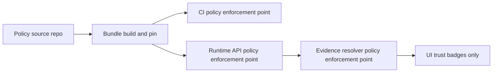

<!-- [KFM_META_BLOCK_V2]
doc_id: kfm://doc/ebc436e6-c35f-4beb-a508-a618deb517c9
title: POLICY_BUNDLE_INDEX
type: standard
version: v1
status: draft
owners: Data Governance; DevSecOps; Platform Engineering
created: 2026-03-04
updated: 2026-03-04
policy_label: restricted
related: [docs/reference/, policy/, tests/]
tags: [kfm, policy, opa, rego, conftest, governance, fail-closed]
notes: [
  "Template index until repo paths are verified.",
  "Do not publish bundle digests publicly unless governance approves."
]
[/KFM_META_BLOCK_V2] -->

# Policy Bundle Index
One canonical registry of policy bundles (OPA/Rego or equivalent) used across CI and runtime.

---

## Impact
**Status:** draft (template; requires repo verification)  
**Owners:** Data Governance · DevSecOps · Platform Engineering  
**Policy label:** restricted (contains governance + enforcement surface inventory)  

<!-- Badges (placeholders; wire up when repo metadata exists) -->


**Quick nav:**  
- [Scope](#scope)  
- [Where it fits](#where-it-fits)  
- [Bundle registry](#bundle-registry)  
- [Bundle manifest contract](#bundle-manifest-contract)  
- [CI and runtime parity rules](#ci-and-runtime-parity-rules)  
- [Change process and gates](#change-process-and-gates)  
- [FAQ](#faq)  
- [Appendix](#appendix)  

---

## Scope

This document is the **single source of truth** for:

- **Which policy bundles exist** (bundle IDs)
- **What they decide** (allow/deny + obligations)
- **Where they run** (CI, runtime API, evidence resolver, etc.)
- **How they are pinned** (digest / version) to keep CI and runtime semantics aligned

### Evidence discipline labels
Each bundle entry is labeled:

- **CONFIRMED** — verified in repo (paths, tests, pins)
- **PROPOSED** — defined pattern, not yet verified in repo
- **UNKNOWN** — placeholder; must be resolved before enforcement depends on it

> IMPORTANT  
> If anything in the registry is UNKNOWN, treat it as **not enforceable** and fail closed by *disallowing promotion* (or restricting the surface) until verified.

---

## Where it fits

**Path:** `docs/reference/POLICY_BUNDLE_INDEX.md`

**Upstream (inputs):**
- `policy/…` (Rego source, bundle manifests, fixtures)
- `tests/policy/…` (golden allow/deny fixtures, contract tests)
- `.github/workflows/…` (CI wiring and required checks)
- `contracts/…` (run_receipt / run_manifest schemas referenced by policy)

**Downstream (consumers):**
- CI gates (Conftest / OPA test runs)
- Runtime API policy enforcement point (PEP)
- Evidence resolver PEP (resolves EvidenceRefs → EvidenceBundles)
- Story publish gate
- Focus Mode pre-checks (topic/role/sensitivity constraints)

---

## Acceptable inputs

This file should only contain:
- Bundle registry entries (IDs, decision entrypoints, pins, owners, status)
- Bundle manifest contract (schema/fields)
- Parity rules and change process

---

## Exclusions

Do **not** put the following here:
- Secrets, tokens, credentials, private endpoints
- Full Rego source code (belongs in `policy/…`)
- Sensitive policy data fixtures (store in `policy/data/…` with classification and access controls)
- “Hidden enforcement”: any enforcement not represented here is treated as an **audit gap**

---

## System diagram



---

## Bundle registry

> NOTE  
> Bundle IDs, paths, and digests are **PROPOSED** until verified against the repo tree.  
> Verification steps are listed in [Change process and gates](#change-process-and-gates).

### Core platform bundles

Blank line before table.

| Bundle ID | Primary decisions | Obligations emitted | Runs at | Pin (digest / git) | Owners | Status | Confidence |
|---|---|---|---|---|---|---|---|
| `kfm.authz` | `allow`, `deny[]` for dataset/story/focus access | redaction/generalization requirements | CI + Runtime API + Evidence resolver | TODO | Platform + Governance | draft | PROPOSED |
| `kfm.licensing` | license allow/deny; “metadata-only allowed” rules | attribution inclusion; export restrictions | CI + Runtime API | TODO | Governance + Legal | draft | PROPOSED |
| `kfm.sensitivity` | policy_label enforcement; 403/404 non-leak behavior constraints | geometry generalization; temporal coarsening; field masking | CI + Runtime API + Evidence resolver | TODO | Governance | draft | PROPOSED |
| `kfm.receipts` | run_receipt/run_manifest required fields; signature/attestation checks | promotion block reasons | CI (merge gates) | TODO | DevSecOps | draft | PROPOSED |

### Promotion gates and QA bundles

Blank line before table.

| Bundle ID | Gate / purpose | Inputs expected | Runs at | Pin (digest / git) | Owners | Status | Confidence |
|---|---|---|---|---|---|---|---|
| `kfm.gates.promotion` | Promotion Contract (RAW→WORK→PROCESSED→CATALOG→PUBLISHED) | `run_receipt`, `catalog_triplet`, `rights`, `dq_summary` | CI + Promotion runner | TODO | Governance + DevSecOps | draft | PROPOSED |
| `kfm.gates.artifact_integrity` | artifact digest / ETag drift checks | `artifact.current`, `artifact.recorded` | CI + Promotion runner | TODO | DevSecOps | draft | PROPOSED |
| `kfm.gates.dq` | dataset-specific thresholds | `dq_summary` | CI + Promotion runner | TODO | Data Engineering | draft | UNKNOWN |

### Application-specific bundles

Blank line before table.

| Bundle ID | Surface | Primary decisions | Runs at | Pin (digest / git) | Owners | Status | Confidence |
|---|---|---|---|---|---|---|---|
| `kfm.story.publish` | Story Node publish | claims require evidence refs; sensitivity/redaction consistency | CI + Story API | TODO | Story Steward | draft | PROPOSED |
| `kfm.focus.precheck` | Focus Mode pre-check | topic/role constraints; scope narrowing requirements | Runtime API | TODO | Platform + Governance | draft | PROPOSED |
| `kfm.search.drift` | Governed retrieval indexing | allowlists for labels/rels/fields; no geometry unless allowed | CI + Search pipeline | TODO | Search Platform | draft | PROPOSED |

---

## Bundle manifest contract

Each bundle MUST ship with a machine-readable manifest stored adjacent to the bundle (path is PROPOSED).

```yaml
# policy/<bundle_id>/bundle.manifest.yml  (PROPOSED)
bundle_id: kfm.sensitivity
version: 0.1.0
status: draft            # draft|active|deprecated
owners:
  - Data Governance
posture:
  default: deny
entrypoints:
  - query: data.kfm.sensitivity.allow
  - query: data.kfm.sensitivity.deny
inputs:
  - name: policy_context
    schema_ref: contracts/policy_context.schema.json
  - name: resource
    schema_ref: contracts/resource_descriptor.schema.json
decisions:
  - name: allow
    type: boolean
  - name: deny
    type: array
obligations:
  - name: redaction
    type: enum
    values: [none, required, applied]
data_dependencies:
  - policy/data/licenses.json
  - policy/data/sensitivity_rubric.json
tests:
  - opa_test: policy/kfm.sensitivity/*_test.rego
  - conftest:
      inputs: policy/fixtures/inputs/*.json
      expected: tests/policy/golden/*.json
distribution:
  method: oci_bundle        # oci_bundle|git_sha|file_bundle
  ref: registry.example.com/kfm/policy@sha256:TODO
updated: 2026-03-04
confidence: proposed
```

### Minimum required fields

- `bundle_id`
- `version`
- `owners`
- `posture.default` (MUST be deny)
- `entrypoints[]` (explicit OPA queries)
- `inputs[]` (schema references)
- `tests[]`
- `distribution.ref` (pinned to digest or immutable commit)

---

## CI and runtime parity rules

KFM policy is only meaningful if CI and runtime evaluate **the same bundle** (or the same fixtures and outcomes).

### Parity rules (non-negotiable)

1. **Same bundle ID + same pin**
   - CI and runtime reference the **same** bundle by immutable digest (OCI digest or git SHA).
2. **Same fixtures**
   - Policy data (`policy/data/…`) and test inputs (`policy/fixtures/…`) are versioned and pinned.
3. **Contract tests against a live PDP**
   - CI should run a local PDP (OPA server) and execute HTTP decision calls for at least one golden suite.
4. **Decision logging parity**
   - Decision logs must include: input, path, result, and reason codes (policy-safe).
5. **Golden regression harness**
   - A small “golden” allow/deny suite MUST run on every PR that touches policy or contracts.

---

## Change process and gates

### When you MUST update this index

- Adding a new bundle
- Renaming an OPA package or decision entrypoint
- Changing required inputs or obligation shapes
- Changing distribution method (e.g., file bundle → OCI bundle)
- Deprecating a bundle

### PR checklist (fail-closed)

- [ ] Bundle manifest updated (or created)
- [ ] `_test.rego` unit tests added/updated
- [ ] Golden fixtures updated (allow + deny + obligations)
- [ ] CI workflow references the pinned bundle digest/commit
- [ ] Runtime deployment references the pinned bundle digest/commit
- [ ] This index updated (registry row + manifest metadata)
- [ ] Evidence of parity: CI log includes bundle pin and PDP decision checks

### Minimal repo verification steps (to convert PROPOSED → CONFIRMED)

Run these and attach outputs to the PR description:

```bash
# 1) Confirm policy tree exists and discover bundle manifests (example commands)
git rev-parse HEAD
git ls-files | rg -n '^policy/' || true
git ls-files | rg -n 'bundle\.manifest\.(yml|yaml|json)$' || true

# 2) Confirm CI wiring exists
git ls-files | rg -n '^\.github/workflows/' || true

# 3) Run policy tests (if tools exist in dev env)
opa version
opa test ./policy -v

conftest --version
conftest test ./policy/fixtures/inputs -p ./policy --all-namespaces

# 4) (Optional) PDP contract test
opa run --server --addr=127.0.0.1:8181 --log-level=info --bundle "$POLICY_BUNDLE" &
curl -s -X POST http://127.0.0.1:8181/v1/data/kfm/authz/allow -d @policy/fixtures/inputs/allow_example.json | jq .
```

---

## FAQ

### Why is this “restricted”?
Policy inventories often reveal enforcement surfaces and operational wiring. If governance decides this can be public, downgrade `policy_label` and scrub sensitive operational details.

### Why do we pin by digest?
Because tags drift. If CI uses “latest” and runtime uses a different “latest,” governance guarantees are not real.

### Where do decision explanations live?
In policy-safe reason codes returned by `deny[]` and recorded in run receipts / audit logs.

---

## Appendix

<details>
<summary>Example: Conftest-based merge gate invocation</summary>

```bash
# Example: evaluate run receipts/manifests with fail-closed behavior
conftest test receipts/run_receipt.json -p policy/opa --no-fail
./tools/ensure_policy_pass.sh receipts/run_receipt.json
```

</details>

<details>
<summary>Example: “micro-policy” folder layout (composable concerns)</summary>

```text
policy/
  provenance/
    main.rego
    main_test.rego
  licensing/
    main.rego
    main_test.rego
  sensitivity/
    main.rego
    main_test.rego
  sbom/
    main.rego
    main_test.rego
  signatures/
    main.rego
    main_test.rego
  data/
    licenses.json
    sensitivity.json
  pack.rego
```

</details>

---

[Back to top](#policy-bundle-index)
