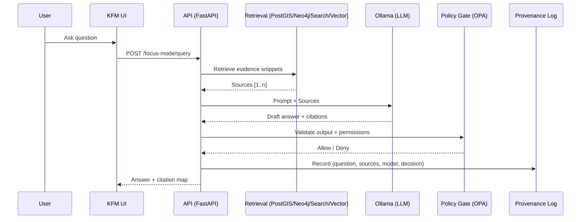

# 📚 KFM Reference Library


A curated index of **project docs + book-length references** used to build **Kansas Frontier Matrix (KFM)** — an evidence-first geospatial knowledge platform where every map layer, chart, and AI answer can be traced back to sources (“the map behind the map”) 🗺️🔎

---

## 🧭 Table of Contents

- [How to use this folder](#how-to-use-this-folder)
- [Start here: canonical project docs](#start-here-canonical-project-docs)
- [Reading map: pick the right reference fast](#reading-map-pick-the-right-reference-fast)
- [Reference PDF library](#reference-pdf-library)
  - [KFM system & architecture](#kfm-system--architecture)
  - [Web UI, HTML/CSS, and front-end](#web-ui-htmlcss-and-front-end)
  - [Node.js, JavaScript, and app backends](#nodejs-javascript-and-app-backends)
  - [DevOps, databases, and performance engineering](#devops-databases-and-performance-engineering)
  - [GIS, cartography, and spatial thinking](#gis-cartography-and-spatial-thinking)
  - [Data science, stats, ML, and scientific computing](#data-science-stats-ml-and-scientific-computing)
  - [Creativity, semantics, and organization](#creativity-semantics-and-organization)
- [Citation discipline](#citation-discipline)
- [Searching PDFs like a pro](#searching-pdfs-like-a-pro)
- [Suggested folder layout](#suggested-folder-layout)
- [Adding new references](#adding-new-references)
- [Licensing & distribution](#licensing--distribution)

---

## ✅ How to use this folder

This folder is **not** the spec for KFM — it’s the **reference index + workflow** for:
- 📌 Finding the right source quickly (book/PDF/internal doc)
- 🧠 Capturing key takeaways as reusable notes
- 🧾 Maintaining *provenance* (what informed what)

**Recommended habit (lightweight):**
1. Skim the “Reading map” table below.
2. Open the relevant PDF(s).
3. Write a short note in `docs/reference/notes/` using the template in [Citation discipline](#citation-discipline).
4. Link the note from the PR/issue that uses it.

---

## 🚀 Start here: canonical project docs

If you only read five things, read these:

- 🧱 **System architecture**
  - `docs/architecture/system_overview.md` (truth-path pipeline + core components)
- 🤖 **AI architecture**
  - `docs/architecture/AI_SYSTEM_OVERVIEW.md`
  - `docs/architecture/ai/OLLAMA_INTEGRATION.md` (RAG + policy gates + audit trail)
- 🏭 **Pipelines**
  - `pipelines/README.md` (ingestion/ETL conventions, dataset lifecycle)
- 🌐 **API contract**
  - `src/server/api/README.md` (REST/GraphQL surface, patterns, examples)

> Tip: Treat these as **source-of-truth** docs. Everything else in this folder supports them.

---

## 🧠 Reading map: pick the right reference fast

| What you’re building | Start with (project docs) | Then open (PDF references) |
|---|---|---|
| 🗺️ Map UI / cartography decisions | `docs/architecture/system_overview.md` | *Making Maps*, *Mapping Urban Spaces*, *GIS-Mapping-Topology* |
| 🎨 UI layouts / typography / CSS | `src/client/*` + UI docs | *Learn to Code HTML & CSS*, *Professional Web Design*, *Web Design* |
| 🌐 API design + endpoint conventions | `src/server/api/README.md` | *Database-Docker-CI…*, *Performance Engineering…* |
| 📥 Data ingestion / ETL pipeline | `pipelines/README.md` | *Database-Docker-CI…*, *Data Science-Data Engineering…* |
| 🧠 Focus Mode (RAG) & safety gates | `docs/architecture/ai/OLLAMA_INTEGRATION.md` | *Neural Networks…*, *AI Safety…*, *ML in Health Care…* |
| 📊 Analytics & visualization | analytics docs | *Graphical Data Analysis with R*, *MATLAB/PyTorch/Numpy…* |

---

## 📦 Reference PDF library

> 📌 Convention (recommended): store PDFs in `docs/reference/pdfs/` (use **Git LFS** if committing to Git).
> If your repo stores them elsewhere, update the paths below.

### KFM system & architecture

- **Kansas Frontier Matrix Comprehensive System Documentation**  
  👉 `docs/reference/pdfs/Kansas%20Frontier%20Matrix%20Comprehensive%20System%20Documentation.pdf`  
  Use for: mission, “truth path” architecture, governance/provenance-first design, Focus Mode principles, and stack overview (PostGIS/Neo4j/search/API/UI).

#### 🧭 “Truth path” (mental model)

```mermaid
flowchart LR
  A[Raw sources 📥] --> B[ETL / Processing 🏭]
  B --> C[Catalog + Provenance 🧾]
  C --> D[(Runtime Stores 🗃️\nPostGIS • Neo4j • Search • Object Storage)]
  D --> E[API Layer 🌐\nFastAPI + Policies]
  E --> F[UI 🗺️\nReact + Map rendering]
  E --> G[AI 🤖\nFocus Mode (RAG)]
```

#### 🤖 Focus Mode (RAG + policy gate) flow



#### 🧩 Standards & terms you’ll see in KFM docs

- **STAC / DCAT** — metadata/catalog standards to make datasets discoverable.
- **W3C PROV** — provenance model (“how this was made”) to support auditability.
- **COG / MVT / PMTiles** — common cloud/web-friendly geospatial formats (rasters + vector tiles).
- **RAG** — Retrieval-Augmented Generation (answer using retrieved evidence).
- **OPA** — Open Policy Agent (policy enforcement gate).

> The architecture docs are the source of truth for which of these are *implemented* vs *planned*.

---

### Web UI, HTML/CSS, and front-end

- **learn-to-code-html-and-css-develop-and-style-websites.pdf**  
  👉 `docs/reference/pdfs/learn-to-code-html-and-css-develop-and-style-websites.pdf`  
  Use for: semantic HTML, CSS cascade/specificity, box model, positioning/layout patterns, typography, forms, tables, and clean code practices.

- **professional-web-design-techniques-and-templates.pdf**  
  👉 `docs/reference/pdfs/professional-web-design-techniques-and-templates.pdf`  
  Use for: end-to-end web design process (requirements → layouts → implementation), reusable templates, and practical production patterns.

- **Web Design.pdf**  
  👉 `docs/reference/pdfs/Web%20Design.pdf`  
  Use for: broad UX/UI fundamentals, layout patterns, and design thinking.

- **CSS-HTML-JAVA-WebDesign.pdf**  
  👉 `docs/reference/pdfs/CSS-HTML-JAVA-WebDesign.pdf`  
  Use for: grab-bag reference when working across HTML/CSS/JS topics.

---

### Node.js, JavaScript, and app backends

- **Node.js-React-CSS-HTML.pdf**  
  👉 `docs/reference/pdfs/Node.js-React-CSS-HTML.pdf`  
  Use for: Node.js fundamentals, REPL, scripts, module patterns, and event-loop mental models (plus front-end tie-ins).

---

### DevOps, databases, and performance engineering

- **Database-Docker-CI-Pipeline-DevOps-Security-Git-Shell-PowerShell.pdf**  
  👉 `docs/reference/pdfs/Database-Docker-CI-Pipeline-DevOps-Security-Git-Shell-PowerShell.pdf`  
  Use for: practical DevOps glue — containers, CI/CD, database basics, shell workflows, and security posture.

- **foundations-of-software-and-system-performance-engineering-process-performance-modeling-requirements-testing-scalability-and-practice.pdf**  
  👉 `docs/reference/pdfs/foundations-of-software-and-system-performance-engineering-process-performance-modeling-requirements-testing-scalability-and-practice.pdf`  
  Use for: performance requirements, modeling, scalability thinking, and how to test performance *intentionally* (not vibes).

- **Various Programming Concepts.pdf**  
  👉 `docs/reference/pdfs/Various%20Programming%20Concepts.pdf`  
  Use for: quick refreshers and breadth when you’re switching domains.

- **Programming Design-Flexibility-Machine Learning-Test Development-Verilog-Software Qualify Assurance.pdf**  
  👉 `docs/reference/pdfs/Programming%20Design-Flexibility-Machine%20Learning-Test%20Development-Verilog-Software%20Qualify%20Assurance.pdf`  
  Use for: design flexibility, testing discipline, QA thinking, and cross-domain patterns.

---

### GIS, cartography, and spatial thinking

- **making-maps-a-visual-guide-to-map-design-for-gis.pdf**  
  👉 `docs/reference/pdfs/making-maps-a-visual-guide-to-map-design-for-gis.pdf`  
  Use for: map design fundamentals — hierarchy, labeling, color choices, typography, and map composition.

- **Mapping Urban Spaces.pdf**  
  👉 `docs/reference/pdfs/Mapping%20Urban%20Spaces.pdf`  
  Use for: spatial narratives, urban representation, and map-as-story patterns.

- **Archaeological 3D GIS.pdf**  
  👉 `docs/reference/pdfs/Archaeological%203D%20GIS.pdf`  
  Use for: 3D GIS concepts, spatial analysis approaches, and when 3D representation changes understanding.

- **GIS-Mapping-Topology.pdf**  
  👉 `docs/reference/pdfs/GIS-Mapping-Topology.pdf`  
  Use for: topology, spatial relationships, and GIS modeling correctness (the stuff that breaks maps quietly).

---

### Data science, stats, ML, and scientific computing

- **graphical-data-analysis-with-r.pdf**  
  👉 `docs/reference/pdfs/graphical-data-analysis-with-r.pdf`  
  Use for: exploratory data analysis, distribution thinking, and communicating uncertainty visually.

- **R-Python-Ruby-Various.pdf**  
  👉 `docs/reference/pdfs/R-Python-Ruby-Various.pdf`  
  Use for: multi-language reference snippets and comparisons.

- **Data Science-Data Engineering-Machine Learing-Steganography-Bilogical Atonomy-PYthon Scripting-Sine Cosine Algorithm-People Anylitics-Experimental Design-Visualizations of Time-Oriented Data-Creativity.pdf**  
  👉 `docs/reference/pdfs/Data%20Science-Data%20Engineering-Machine%20Learing-Steganography-Bilogical%20Atonomy-PYthon%20Scripting-Sine%20Cosine%20Algorithm-People%20Anylitics-Experimental%20Design-Visualizations%20of%20Time-Oriented%20Data-Creativity.pdf`  
  Use for: broad DS/DE patterns, experimental design, and time-oriented visualization ideas.

- **Neural Nerworks-Build Ai-Statistical Learning-Deep Learing-AI Safety-Linear Regression-bayesian.pdf**  
  👉 `docs/reference/pdfs/Neural%20Nerworks-Build%20Ai-Statistical%20Learning-Deep%20Learing-AI%20Safety-Linear%20Regression-bayesian.pdf`  
  Use for: core ML/stat learning concepts + safety framing (useful for Focus Mode guardrails).

- **Artificial Intelligence & Machine Learning in Health Care & Medical Sciences.pdf**  
  👉 `docs/reference/pdfs/Artificial%20Intelligence%20%26%20Machine%20Learning%20in%20Health%20Care%20%26%20Medical%20Sciences.pdf`  
  Use for: applied ML patterns, validation mindset, and “what could go wrong” thinking in high-stakes contexts.

- **MATLAB-PyTorch-Numpy-SciPy-Statisctics-Programming Science Tools.pdf**  
  👉 `docs/reference/pdfs/MATLAB-PyTorch-Numpy-SciPy-Statisctics-Programming%20Science%20Tools.pdf`  
  Use for: scientific computing toolchain patterns (simulation → analysis → visualization).

- **Applications from Engineering with MATLAB Concepts.pdf**  
  👉 `docs/reference/pdfs/Applications%20from%20Engineering%20with%20MATLAB%20Concepts.pdf`  
  Use for: MATLAB fundamentals with engineering framing (good for signal-ish or model-ish tasks).

- **Hands-On Accelerator Physics Using MATLAB.pdf**  
  👉 `docs/reference/pdfs/Hands-On%20Accelerator%20Physics%20Using%20MATLAB.pdf`  
  Use for: advanced MATLAB modeling workflows and numerics patterns (repurpose as needed).

---

### Creativity, semantics, and organization

- **ssoar-2022-zipp-Programming_Creativity_Semantics_and_Organisation.pdf**  
  👉 `docs/reference/pdfs/ssoar-2022-zipp-Programming_Creativity_Semantics_and_Organisation.pdf`  
  Use for: thinking about creativity in programming, semantics, and how organization shapes systems.

---

## 🧾 Citation discipline

KFM lives and dies on provenance. When you use a reference, leave a trail.

### ✅ Note template (copy/paste)

Create a file like `docs/reference/notes/2026-02-05__map-label-hierarchy.md`:

```md
# Map label hierarchy (summary)

- **Source**: `making-maps-a-visual-guide-to-map-design-for-gis.pdf` (pp. __–__)
- **Why it matters to KFM**: (1–2 sentences)
- **Key takeaways**:
  - …
  - …
- **Where we applied it**:
  - PR/Issue: #
  - Component: (UI / tiles / API / pipeline / AI)
- **Open questions / follow-ups**:
  - …
```

### ✅ When in doubt…

- If it changes a *user-facing* map, UI, or AI answer: **write the note**.
- If it changes governance/provenance behavior: **write the note + link policy text**.
- If it affects correctness (topology, ETL transformations): **write the note + add a test case** 🧪

---

## 🔎 Searching PDFs like a pro

### Option A: `pdftotext` + `rg` (fast)

```bash
pdftotext "docs/reference/pdfs/making-maps-a-visual-guide-to-map-design-for-gis.pdf" - \
  | rg -n "label|typography|hierarchy"
```

### Option B: `pdfgrep` (if installed)

```bash
pdfgrep -ni "provenance" "docs/reference/pdfs/Kansas Frontier Matrix Comprehensive System Documentation.pdf"
```

### Option C: Make a local “search cache” (recommended for big PDFs)

```bash
mkdir -p .cache/pdftxt
pdftotext "docs/reference/pdfs/Kansas Frontier Matrix Comprehensive System Documentation.pdf" ".cache/pdftxt/kfm.txt"
rg -n "Ollama|RAG|OPA|No Source" .cache/pdftxt/kfm.txt
```

---

## 📂 Suggested folder layout

```text
docs/reference/
  README.md                 # 📌 this file (index + workflow)
  pdfs/                     # 📚 reference PDFs (Git LFS recommended)
  notes/                    # 🧠 summaries + “where we applied it”
  excerpts/                 # ✂️ optional: tiny excerpts when licensing allows
  .cache/                   # ⚡ local text extracts for fast search (gitignored)
```

> Keep `.cache/` out of Git. Notes are encouraged; full PDFs may not be, depending on licensing.

## ➕ Adding new references

1. ✅ Put the PDF in `docs/reference/pdfs/` (or wherever the repo standard is).
2. 🏷️ Add a bullet entry in this README under the right category.
3. 🧾 (Optional but encouraged) Create a short metadata note:
   - `docs/reference/notes/<date>__<short-title>__meta.md`
4. 🔒 Confirm licensing (see below). If the PDF can’t be redistributed, **do not commit** — store externally and add a pointer.

> Tip: If you keep PDFs in-repo, use **Git LFS**. These files are large and will wreck clones otherwise.

---

## ⚖️ Licensing & distribution

This repo may contain a mix of:
- ✅ permissive / public-domain references  
- ⚠️ copyrighted books/articles (allowed for personal/internal use in some contexts, not for redistribution)

**Rule of thumb:** if you can’t legally redistribute it, don’t commit it to a public repo.  
Instead:
- store it privately (drive/volume),
- add a pointer here (title + where to request access),
- and keep your notes **original and short** (summaries, not copy/paste excerpts).
