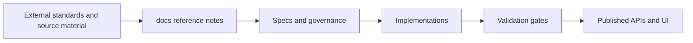

<!-- [KFM_META_BLOCK_V2]
doc_id: kfm://doc/9df4f9b9-8e85-4d49-8a30-1e1704fa6f74
title: docs/reference
type: standard
version: v0.2
status: draft
owners: [TBD]
created: 2026-03-04
updated: 2026-03-05
policy_label: TBD
related: [
  "docs/README.md",
  "docs/governance/ROOT_GOVERNANCE_CHARTER.md",
  "docs/specs/README.md",
  "docs/security/supply-chain/README.md"
]
tags: [kfm, docs, reference]
notes: [
  "Index + contribution guide for docs/reference.",
  "Uses evidence labels (CONFIRMED/PROPOSED/UNKNOWN) to avoid inventing repo state."
]
[/KFM_META_BLOCK_V2] -->

# Reference
Curated, version-pinned reference material used to build and operate KFM.

> **Status:** experimental (draft)  
> **Owners:** TBD  
> **Policy label:** TBD  
> **Review cycle:** TBD  
> **Jump to:** [Scope](#scope) · [Directory tree](#directory-tree) · [Quickstart](#quickstart) · [Definition of done](#definition-of-done)


> [!IMPORTANT]
> `docs/reference/` is **supporting material**. It may inform design and implementation, but it **does not override**
> authoritative requirements in `docs/specs/` and `docs/governance/`.

---

## Quick navigation

- [Scope](#scope)
- [Where it fits](#where-it-fits)
- [Acceptable inputs](#acceptable-inputs)
- [Exclusions](#exclusions)
- [Directory tree](#directory-tree)
- [Source material archive](#source-material-archive)
- [Quickstart](#quickstart)
- [Conventions](#conventions)
- [Reference types matrix](#reference-types-matrix)
- [Governance and sensitivity](#governance-and-sensitivity)
- [Definition of done](#definition-of-done)
- [FAQ](#faq)
- [Appendix](#appendix)

---

## Scope

### Evidence labels used in this README

- **CONFIRMED** — Supported by an existing KFM source document *or* an in-repo artifact.
  - A PR that changes a **CONFIRMED** statement must include a link/citation to the supporting evidence.
- **PROPOSED** — Recommended default or convention; reasonable to adopt, but not yet verified against repo reality.
- **UNKNOWN** — Requires verification (paths, owners, automation, CI rules, etc.). Include smallest steps to verify.

> [!NOTE]
> This README is designed to avoid “repo hallucinations.” Anything about **actual repo layout, commands, owners,**
> or **automation** should be **UNKNOWN** unless verified.

### What this directory is

- **PROPOSED:** A *non‑normative* library of background material that supports KFM **specs**, **governance**, **pipelines**, **APIs**, and **UI**.
- **PROPOSED:** A home for “how it works” explainers, standards primers, and cross-cutting technology notes.
- **CONFIRMED (KFM posture):** KFM is built around governance, reproducibility, and evidence-led operation; reference docs should not weaken those expectations.

### What this directory is not

- **PROPOSED:** Not a place for authoritative requirements or policy (put those in `docs/specs/` and `docs/governance/`).
- **PROPOSED:** Not a place for raw datasets, processed artifacts, credentials, or restricted content.
- **PROPOSED:** Not a place to vendor third-party content unless redistribution is permitted and recorded.

### KFM invariants that reference docs must not contradict

These are included here because reference docs often describe pipelines/APIs and can accidentally recommend unsafe patterns.

- **CONFIRMED:** Trust membrane — clients/UI do not access storage directly; access crosses the governed API + policy boundary.
- **CONFIRMED:** Fail-closed policy — deny-by-default posture for governed requests.
- **CONFIRMED:** Promotion gates — RAW → WORK/QUARANTINE → PROCESSED → CATALOG/TRIPLET → PUBLISHED; promotion requires checksums and catalogs.
- **CONFIRMED:** Cite-or-abstain — when evidence cannot be verified/resolved, the system must abstain or narrow scope.

(If you change any of the above, treat it as a governance/spec change and update the authoritative docs first.)

---

## Where it fits

**PROPOSED mental model:** Reference material helps teams move faster *without* weakening governance.


```mermaid
flowchart LR
  A[External standards and source material] --> B[docs reference notes]
  B --> C[Specs and governance]
  C --> D[Implementations]
  D --> E[Validation gates]
  E --> F[Published APIs and UI]
```

- **PROPOSED:** Prefer placing domain-scoped references near their domain (e.g., security references near security docs), and place cross-cutting references here.
- **UNKNOWN:** The repo’s canonical “docs index” file and doc build/lint/link-check commands (add links once verified).

---

## Acceptable inputs

Put these here:

- **PROPOSED:** “How it works” explainers that support implementation, review, or operations.
- **PROPOSED:** Summaries of external standards/specs with **pinned version identifiers** and **what we adopted**.
- **PROPOSED:** Compatibility notes (e.g., “how KFM interprets DCAT terms”, “STAC extensions used”).
- **PROPOSED:** Glossaries and canonical definitions used across the repo.
- **PROPOSED:** Thin “decision summaries” that point to the authoritative ADR/design record (if ADRs are used).

---

## Exclusions

Do **not** put these here:

- **PROPOSED:** Authoritative policy, invariants, or promotion gates → `docs/governance/` and/or `docs/specs/`.
- **PROPOSED:** Runbooks tied to a specific subsystem → store near that subsystem (or in your designated runbooks directory).
- **PROPOSED:** Secrets/tokens/credentials → never commit; use the approved secret system.
- **PROPOSED:** Raw/processed data artifacts → store under governed data lifecycle paths (`data/...`) or artifact storage.
- **PROPOSED:** Restricted location guidance or sensitive targeting content → requires governance review; store only redacted/generalized summaries if approved.

---

## Source material archive

- **CONFIRMED:** Imported seed documents and large reference artifacts are stored in `docs/reference/source-material/`.
- **CONFIRMED:** This keeps `docs/` root focused on navigational entrypoints while preserving all source files.

## Directory tree

**UNKNOWN:** The actual subdirectories in `docs/reference/` (verify with a repo tree snapshot).

**PROPOSED starter layout** (edit after verifying actual repo structure):

```text
docs/reference/
├── README.md
├── _template/
│   └── README.template.md
├── standards/
│   ├── README.md
│   ├── stac/
│   │   └── README.md
│   ├── dcat/
│   │   └── README.md
│   └── prov/
│       └── README.md
├── platform/
│   ├── README.md
│   ├── api/
│   │   └── README.md
│   ├── ui/
│   │   └── README.md
│   └── data-pipelines/
│       └── README.md
├── glossary/
│   └── README.md
└── vendor/
    ├── README.md
    └── LICENSES/
        └── README.md
```

**PROPOSED:** Keep one topic per folder, and use `README.md` as the topic index for LLM ingestion and human scanning.

---

## Quickstart

### Find reference topics

```bash
# List reference entrypoints
find docs/reference -maxdepth 4 -name "README.md" -print | sort
```

### Create a new reference topic

```bash
TOPIC="platform/example-topic"
mkdir -p "docs/reference/${TOPIC}"

cat > "docs/reference/${TOPIC}/README.md" <<'EOF'
<!-- [KFM_META_BLOCK_V2]
doc_id: kfm://doc/<uuid>
title: <Topic title>
type: standard
version: v0.1
status: draft
owners: [TBD]
created: 2026-03-05
updated: 2026-03-05
policy_label: TBD
related: []
tags: [kfm, reference]
notes: ["Reference doc. Pin upstream versions. Non-normative."]
[/KFM_META_BLOCK_V2] -->

# <Topic title>
One-line purpose.

## Scope

- CONFIRMED: <claim backed by a cited source>
- PROPOSED: <suggestion / local convention>
- UNKNOWN: <needs verification>

## Pinned upstream sources

| Source | Version or date | Identifier | License | Notes |
|---|---|---|---|---|
| <name> | <vX.Y or YYYY-MM-DD> | <sha, tag, DOI, URL> | <license or UNKNOWN> | <what we adopted> |

## Notes

## Version history

| Version | Date       | Summary |
|--------:|------------|---------|
| v0.1    | 2026-03-05 | Initial draft. |
EOF
```

### Update the root index (this file)

```bash
# After adding topics:
# - update "Directory tree" if needed
# - (optional) add a "Topics" section with links once paths are verified
git status
```

---

## Conventions

### Reference doc requirements

- **PROPOSED:** Every reference doc includes a `KFM_META_BLOCK_V2` header.
- **PROPOSED:** Every reference doc includes “Pinned upstream sources” (or explicitly states `UNKNOWN` + next steps).
- **PROPOSED:** Avoid “latest/current” without an explicit date, version, or tag.
- **PROPOSED:** Prefer small, additive docs; link out to primary sources instead of copying large chunks.
- **PROPOSED:** If you include examples/snippets, ensure they are runnable or clearly labeled as pseudocode.

### Pinning rules

- **PROPOSED:** Pin using one of:
  - **Commit SHA** (preferred for repos)
  - **Release tag**
  - **DOI**
  - **Document version + publication date**
- **PROPOSED:** If you link to a mutable webpage, add an “as-of” date and (if possible) a snapshot identifier.

### Citation and traceability

- **PROPOSED:** For each non-trivial claim, include:
  - a source pointer (primary doc preferred),
  - what part was adopted,
  - any KFM-specific interpretation notes,
  - and the decision owner/review path (if applicable).

### Hallucination control

- **PROPOSED:** Do not assert repo structure, CI rules, or commands are real unless verified.
- **PROPOSED:** If you must speculate, label it `PROPOSED` and include the smallest verification steps.
- **PROPOSED:** Prefer describing *interfaces/invariants* over naming concrete tools unless pinned by evidence.

---

## Reference types matrix

| Doc kind | Intended use | Must include | Should not include |
|---|---|---|---|
| Standard summary | Explain external standards in KFM terms | Pinned upstream version, license, mapping notes | Normative KFM requirements |
| Technology note | Help implement or operate a subsystem | Compatibility constraints, pitfalls, links to specs | Credentials, internal secrets |
| Glossary | Stabilize terms across the project | Definitions, synonyms, pointers to canonical specs | Debated policy decisions |
| Runbook pointer | Route readers to operational docs | Links to the real runbook, scope boundary | The runbook itself (unless this is the runbook directory) |
| Decision summary | Quick context for reviewers | Link to ADR/design record, decision date | Unreviewed policy changes |
| Vendored material record | Track third‑party material stored in repo | Redistribution permission, license file, provenance | Unlicensed PDFs, “unknown license” binaries |

---

## Governance and sensitivity

- **CONFIRMED (KFM posture):** Governance checks are first-class gates; some content must be redacted/aggregated before publication.
- **PROPOSED:** Default posture:
  - Treat `docs/reference/` as **public** unless a specific doc is explicitly classified otherwise.
  - If a reference doc touches sensitive topics, keep it generalized and route details to governed systems.

### Sensitivity handling matrix

| Sensitivity | Allowed in `docs/reference/` | Handling |
|---|---:|---|
| Public | ✅ | Normal review |
| Restricted | ⚠️ | Governance review required; prefer summaries only; no raw restricted content |
| Secret | ❌ | Do not commit; store only via approved secret systems |

---

## Definition of done

When adding/updating a reference doc:

- [ ] **PROPOSED:** `KFM_META_BLOCK_V2` present and filled (owners/status/policy_label not blank or explicitly `TBD`)
- [ ] **PROPOSED:** “Pinned upstream sources” present (or `UNKNOWN` with explicit next steps)
- [ ] **PROPOSED:** Upstream license stated (or `UNKNOWN` and content *not* vendored)
- [ ] **PROPOSED:** No restricted content included (or governance approval recorded)
- [ ] **PROPOSED:** Version history updated
- [ ] **PROPOSED:** Any referenced repo paths are verified or explicitly marked `UNKNOWN`
- [ ] **PROPOSED:** Links do not silently break (run link-check if available, or record as `UNKNOWN` until verified)

---

## FAQ

### Is `docs/reference/` authoritative?

- **PROPOSED:** No. Treat it as supporting material. Authoritative requirements belong in governance/specs.

### Can we vendor external PDFs here?

- **PROPOSED:** Only if redistribution is allowed by the license and governance approves.
- **PROPOSED:** Prefer: links + pinned identifiers + “as-of” dates.
- **PROPOSED:** If you vendor, record:
  - license and redistribution permission,
  - provenance (where it came from),
  - and a checksum/digest (to detect drift).

### What if I don’t know the license?

- **CONFIRMED (KFM posture):** Missing license/rights metadata is treated as a promotion risk in governed lanes.
- **PROPOSED (docs posture):** Mark license as `UNKNOWN`, do not redistribute the content, and open a tracking issue to resolve it.

---

## Appendix

<details>
<summary>Reference topic skeleton</summary>

Use this when creating a new topic under `docs/reference/<topic>/README.md`.

```markdown
<!-- [KFM_META_BLOCK_V2]
doc_id: kfm://doc/<uuid>
title: <Topic title>
type: standard
version: v0.1
status: draft
owners: [TBD]
created: 2026-03-05
updated: 2026-03-05
policy_label: TBD
related: []
tags: [kfm, reference]
notes: []
[/KFM_META_BLOCK_V2] -->

# <Topic title>
One-line purpose.

## Scope

- CONFIRMED: <claim backed by source>
- PROPOSED: <local convention>
- UNKNOWN: <needs verification>

## Pinned upstream sources

| Source | Version or date | Identifier | License | Notes |
|---|---|---|---|---|
| <name> | <vX.Y or YYYY-MM-DD> | <sha, tag, DOI, URL> | <license or UNKNOWN> | <what we adopted> |

## Notes

## Version history

| Version | Date       | Summary |
|--------:|------------|---------|
| v0.1    | 2026-03-05 | Initial draft. |
```

</details>

---

<a id="back-to-top"></a>
**Back to top:** [Quick navigation](#quick-navigation)
