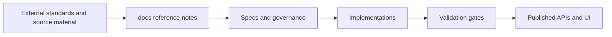

<!-- [KFM_META_BLOCK_V2]
doc_id: kfm://doc/9df4f9b9-8e85-4d49-8a30-1e1704fa6f74
title: docs/reference
type: standard
version: v0.1
status: draft
owners: [TBD]
created: 2026-03-04
updated: 2026-03-04
policy_label: TBD
related: [
  "docs/README.md",
  "docs/governance/ROOT_GOVERNANCE_CHARTER.md",
  "docs/specs/README.md",
  "docs/security/supply-chain/README.md"
]
tags: [kfm, docs, reference]
notes: [
  "Index + contribution guide for docs/reference.",
  "Uses evidence labels (CONFIRMED/PROPOSED/UNKNOWN) to avoid inventing repo state."
]
[/KFM_META_BLOCK_V2] -->

<div align="center">

# Reference

Curated, version-pinned reference material used to build and operate KFM.


</div>

---

## Quick navigation

- [Scope](#scope)
- [Where it fits](#where-it-fits)
- [Acceptable inputs](#acceptable-inputs)
- [Exclusions](#exclusions)
- [Directory tree](#directory-tree)
- [Quickstart](#quickstart)
- [Conventions](#conventions)
- [Reference types matrix](#reference-types-matrix)
- [Governance and sensitivity](#governance-and-sensitivity)
- [Definition of done](#definition-of-done)
- [FAQ](#faq)
- [Appendix](#appendix)

---

## Scope

### Evidence labels used in this README

- **CONFIRMED** — Supported by an existing KFM source document or an in-repo artifact (link/citation required in the PR).
- **PROPOSED** — A recommended default for this repo; safe to adopt but not yet verified against repo reality.
- **UNKNOWN** — Requires verification (e.g., actual paths, owners, automation, CI rules).

### What this directory is

- **CONFIRMED:** Upstream references evolve; KFM adaptations should pin versions and record what was adopted.  
- **CONFIRMED:** KFM is governed and evidence-producing: license-first, determinism, provenance-by-default, and validation gates are expected patterns.  
- **PROPOSED:** `docs/reference/` is a *non-normative* library of background material that supports (but does not override) KFM **specs**, **governance**, **pipelines**, **APIs**, and **UI**.
- **UNKNOWN:** The repo’s canonical “docs index” file and doc build/lint commands (add links once confirmed).

### What this directory is not

- **PROPOSED:** Not a place for authoritative requirements (those should live in `docs/specs/` and `docs/governance/`).
- **PROPOSED:** Not a place for raw datasets, processed artifacts, credentials, or restricted content.

---

## Where it fits

**PROPOSED mental model:** Reference material helps teams move faster *without* weakening governance.


```mermaid
flowchart LR
  A[External standards and source material] --> B[docs reference notes]
  B --> C[Specs and governance]
  C --> D[Implementations]
  D --> E[Validation gates]
  E --> F[Published APIs and UI]
```

- **CONFIRMED:** Some reference-grade docs may live *outside* `docs/reference/` when they are domain-scoped (example: supply-chain “reference repos” under security).  
- **PROPOSED:** Use `docs/reference/` for cross-cutting, reusable references (standards summaries, design primers, technology notes, glossary).

---

## Acceptable inputs

Put these here:

- **PROPOSED:** “How it works” explainers that support implementation, review, or operations.
- **PROPOSED:** Summaries of external standards or specs, with **pinned version identifiers** and a **change log**.
- **PROPOSED:** Compatibility notes (e.g., “how KFM interprets DCAT terms”, “STAC extensions used”).
- **PROPOSED:** Glossaries and canonical definitions used across the repo.
- **PROPOSED:** Thin “decision summaries” that *point to* the authoritative ADR/design record (if you use ADRs elsewhere).

---

## Exclusions

Do **not** put these here:

- **PROPOSED:** Authoritative policy, invariants, or promotion gates → put in `docs/governance/` and/or `docs/specs/`.
- **PROPOSED:** Runbooks tied to a specific subsystem → put near that subsystem (example: `docs/specs/qa/runbooks/`).
- **PROPOSED:** Secrets, tokens, API keys, credentials → never commit; use the approved secret manager.
- **PROPOSED:** Raw or processed data artifacts → keep under the governed data lifecycle paths (`data/...` or artifact storage), not in docs.
- **PROPOSED:** Restricted location guidance or sensitive targeting content → requires governance review; store only redacted/generalized summaries if approved.

---

## Directory tree

**UNKNOWN:** The actual subdirectories in `docs/reference/` (this README is being created now).

**PROPOSED starter layout** (edit after verifying actual repo structure):

```text
docs/reference/
├── README.md
├── _template/
│   └── README.template.md
├── standards/
│   ├── README.md
│   ├── stac/
│   │   └── README.md
│   ├── dcat/
│   │   └── README.md
│   └── prov/
│       └── README.md
├── platform/
│   ├── README.md
│   ├── api/
│   │   └── README.md
│   ├── ui/
│   │   └── README.md
│   └── data-pipelines/
│       └── README.md
└── glossary/
    └── README.md
```

**PROPOSED:** Keep one topic per folder, and use `README.md` as the topic index for LLM-ingestion and human scanning.

---

## Quickstart

### Find reference topics

```bash
# List reference entrypoints
find docs/reference -maxdepth 3 -name "README.md" -print | sort
```

### Create a new reference topic

```bash
TOPIC="platform/example-topic"
mkdir -p "docs/reference/${TOPIC}"

cat > "docs/reference/${TOPIC}/README.md" <<'EOF'
<!-- [KFM_META_BLOCK_V2]
doc_id: kfm://doc/<uuid>
title: <Topic title>
type: standard
version: v0.1
status: draft
owners: [TBD]
created: 2026-03-04
updated: 2026-03-04
policy_label: TBD
related: []
tags: [kfm, reference]
notes: ["Reference doc. Pin upstream versions. Non-normative."]
[/KFM_META_BLOCK_V2] -->

# <Topic title>

One-line purpose.

## Scope

- CONFIRMED: <claim backed by a cited source>
- PROPOSED: <suggestion / local convention>
- UNKNOWN: <needs verification>

## Pinned upstream sources

- Source: <name>
- Version or date: <vX.Y or YYYY-MM-DD>
- Identifier: <commit, tag, DOI, URL, etc.>
- License: <license or UNKNOWN>

## Notes

## Version history

| Version | Date       | Summary |
|--------:|------------|---------|
| v0.1    | 2026-03-04 | Initial draft. |
EOF
```

### Update the root index (this file)

```bash
# After adding topics, update the "Directory tree" and (optional) add a bullet link
# to the new topic README in a "Topics" section (if you add one).
git status
```

---

## Conventions

### Reference doc requirements

- **PROPOSED:** Every reference doc includes a `KFM_META_BLOCK_V2` header.
- **PROPOSED:** Every doc has “Pinned upstream sources” (or explicitly states `UNKNOWN`).
- **PROPOSED:** Avoid “latest/current” without an explicit date or version tag.
- **PROPOSED:** Prefer small, additive docs; link out to primary sources instead of copying large chunks.

### Pinning rules

- **CONFIRMED:** KFM patterns expect version pinning and recording what was adopted when upstream references evolve.  
- **PROPOSED:** Pin using one of:
  - **Commit SHA** (preferred for repos)
  - **Release tag**
  - **DOI**
  - **Document version + publication date**
- **PROPOSED:** If you must link to a webpage that changes, add an “as-of” date and (if possible) a snapshot identifier.

### Citation and traceability

- **PROPOSED:** For each non-trivial claim, include:
  - a source pointer (primary doc preferred),
  - what part was adopted,
  - any KFM-specific interpretation notes,
  - and the decision owner/review path (if applicable).

---

## Reference types matrix

| Doc kind | Intended use | Must include | Should not include |
|---|---|---|---|
| Standard summary | Explain external standards in KFM terms | Pinned upstream version, license, mapping notes | Normative KFM requirements |
| Technology note | Help implement or operate a subsystem | Compatibility constraints, pitfalls, links to specs | Credentials, internal secrets |
| Glossary | Stabilize terms across the project | Definitions, synonyms, pointers to canonical specs | Debated policy decisions |
| Runbook pointer | Route readers to operational docs | Links to the real runbook, scope boundary | The runbook itself (unless this is the runbook directory) |
| Decision summary | Quick context for reviewers | Link to ADR/design record, decision date | Unreviewed policy changes |

---

## Governance and sensitivity

- **CONFIRMED:** Some KFM patterns treat governance checks as first-class gates and can require redaction/aggregation before publication.  
- **PROPOSED:** Default posture:
  - Keep `docs/reference/` **public** unless a specific doc is explicitly classified otherwise.
  - If a reference doc touches sensitive topics, keep it generalized and route details to governed systems.

### Sensitivity handling matrix

| Sensitivity | Allowed in `docs/reference/` | Handling |
|---|---:|---|
| Public | ✅ | Normal review |
| Restricted | ⚠️ | Governance review required; prefer summaries only; no raw restricted content |
| Secret | ❌ | Do not commit; store only via approved secret systems |

---

## Definition of done

When adding/updating a reference doc:

- [ ] **PROPOSED:** `KFM_META_BLOCK_V2` present and filled (owners/status/policy_label not blank or explicitly `TBD`)
- [ ] **PROPOSED:** “Pinned upstream sources” present (or `UNKNOWN` with explicit next steps)
- [ ] **PROPOSED:** License stated for upstream source (or `UNKNOWN` with quarantine note)
- [ ] **PROPOSED:** Changes are additive and reversible (no silent rewrites)
- [ ] **PROPOSED:** No restricted content included (or governance approval recorded)
- [ ] **PROPOSED:** Version history updated
- [ ] **PROPOSED:** Any referenced repo paths are verified or marked `UNKNOWN`

---

## FAQ

### Is `docs/reference/` authoritative?

- **PROPOSED:** No. Treat it as supporting material. Authoritative requirements should live in governance/specs.

### Can we vendor external PDFs here?

- **PROPOSED:** Only if the license allows redistribution and governance approves. Prefer links + pinned identifiers.

### What if I don’t know the license?

- **CONFIRMED (pattern expectation):** License unknown should block promotion of governed artifacts.  
- **PROPOSED (docs posture):** Mark the license as `UNKNOWN`, do not redistribute the content, and open a tracking issue to resolve it.

---

## Appendix

<details>
<summary>Reference topic skeleton</summary>

Use this when creating a new topic under `docs/reference/<topic>/README.md`.

```markdown
<!-- [KFM_META_BLOCK_V2]
doc_id: kfm://doc/<uuid>
title: <Topic title>
type: standard
version: v0.1
status: draft
owners: [TBD]
created: 2026-03-04
updated: 2026-03-04
policy_label: TBD
related: []
tags: [kfm, reference]
notes: []
[/KFM_META_BLOCK_V2] -->

# <Topic title>

One-line purpose.

## Scope

- CONFIRMED: <claim backed by source>
- PROPOSED: <local convention>
- UNKNOWN: <needs verification>

## Pinned upstream sources

| Source | Version or date | Identifier | License | Notes |
|---|---|---|---|---|
| <name> | <vX.Y or YYYY-MM-DD> | <sha, tag, DOI, URL> | <license or UNKNOWN> | <what we adopted> |

## Notes

## Version history

| Version | Date       | Summary |
|--------:|------------|---------|
| v0.1    | 2026-03-04 | Initial draft. |
```

</details>

---

<a id="back-to-top"></a>
**Back to top:** [Quick navigation](#quick-navigation)
