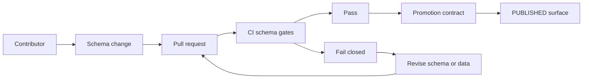

<!-- [KFM_META_BLOCK_V2]
doc_id: kfm://doc/3f0a2c3a-0f60-4e2d-8aa1-4c2b3e5d9b7a
title: Schema Registry
type: standard
version: v1
status: draft
owners: [kfm-schema-stewards]
created: 2026-03-04
updated: 2026-03-04
policy_label: restricted
related:
  - docs/reference/SCHEMA_REGISTRY.md
  - docs/governance/ROOT_GOVERNANCE_CHARTER.md
  - tools/validators/
  - policy/opa/
tags: [kfm, schemas, contracts, validation, ci]
notes:
  - This file is the *human-readable index* of KFM contract surfaces (schemas/specs). Keep it synchronized with the machine registry (see "Machine registry").
[/KFM_META_BLOCK_V2] -->

# Schema Registry
One source of truth for **every schema/spec KFM uses to validate, gate, and publish artifacts**.

> **IMPACT**
>
> [](#)
> [](#)
> [](#)
>
> **Owners:** `kfm-schema-stewards` (TODO: name the team)  
> **Status:** draft (not yet enforced as a hard gate)  
> **Last updated:** 2026-03-04  
>
> **Quick links:**  
> - [Scope](#scope) · [Where it fits](#where-it-fits) · [Registry](#registry) · [Change control](#change-control) · [Add a schema](#add-a-schema) · [DoD](#definition-of-done)

---

## Scope

This document covers **contract surfaces** that can block or allow work to move through KFM’s lifecycle (RAW → WORK → PROCESSED → CATALOG/TRIPLET → PUBLISHED), including:

- **JSON Schemas** (Draft 2020-12 preferred) for:
  - registry entries (dataset/source/watcher definitions)
  - run receipts / promotion manifests
  - domain-specific artifacts (optional but recommended when publishing)
- **OpenAPI specs** for governed APIs
- **Catalog profile rules** (DCAT / STAC / PROV profiles + required fields)
- **Policy inputs** (OPA/Rego inputs that must be stable and testable)

### Exclusions

Do **not** treat the following as “schemas” for purposes of this registry:

- ad-hoc, one-off JSON validation logic embedded in code without a versioned schema file
- UI-only “shape expectations” that are not used for gating/promotion
- internal parsing heuristics used only for retrieval (unless they gate promotion)

---

## Where it fits

- This file lives at: `docs/reference/SCHEMA_REGISTRY.md`
- It is the **human index** for all schemas/specs that are (or will be) enforced in CI and promotion gates.
- The **machine-readable registry** (recommended) should live at: `schemas/registry.yaml` (see below).

---

## Status labels

Every registry entry MUST include **one** evidence label:

- **CONFIRMED** — required by governance docs *and* present in the repo (verified by CI or a maintainer).
- **PROPOSED** — planned/desired contract surface but not yet enforced (or not yet present).
- **UNKNOWN** — referenced somewhere, but not yet verified as present/authoritative.

> IMPORTANT: If a schema is **UNKNOWN**, treat it as **non-authoritative** for gating until verified.

---

## Diagram



---

## Registry

### Machine registry

**PROPOSED (recommended):** a machine-readable registry used by CI tooling.

- Path: `schemas/registry.yaml`
- Purpose: list all schemas with IDs, paths, compatibility mode, and owners
- CI can:
  - validate schemas compile
  - validate fixtures
  - run compatibility checks on changed schemas
  - generate a report back to PRs

#### Suggested `schemas/registry.yaml` shape (template)

```yaml
# schemas/registry.yaml
schemas:
  - id: kfm.dataset_entry.v1
    type: jsonschema
    path: data/registry/schemas/dataset_entry.schema.json
    version: 1.0.0
    mode: backward  # backward|forward|full
    owners: [kfm-schema-stewards]
    evidence: UNKNOWN
    used_by:
      - tools/validators/registry_validator
    notes: "Dataset registry entry schema."

  - id: kfm.watcher.v1
    type: jsonschema
    path: schemas/watcher.v1.json
    version: 1.0.0
    mode: backward
    owners: [kfm-schema-stewards]
    evidence: PROPOSED
    used_by:
      - tools/validators/watchers_registry_validator
    notes: "Watchers allow-list schema."

  - id: kfm.run_receipt.v1
    type: jsonschema
    path: schemas/run_receipt.v1.json
    version: 1.0.0
    mode: backward
    owners: [kfm-schema-stewards]
    evidence: PROPOSED
    used_by:
      - policy/opa/receipt.rego
    notes: "Run receipt schema for provenance + gating."
```

---

### A. JSON Schemas

| ID | Format | Canonical path (repo) | Gating surface | Evidence | Repo-verified | Owners | Notes |
|---|---|---|---|---|---:|---|---|
| `kfm.dataset_entry.v1` | JSON Schema | `data/registry/schemas/dataset_entry.schema.json` | Registry validity | UNKNOWN | ❌ | `kfm-schema-stewards` | Dataset/source registry entry contract. |
| `kfm.watcher.v1` | JSON Schema | `schemas/watcher.v1.json` | Automation allow-list | PROPOSED | ❌ | `kfm-schema-stewards` | Typed watcher registry w/ signature + spec_hash. |
| `kfm.run_receipt.v1` | JSON Schema | `schemas/run_receipt.v1.json` | Promotion gate | PROPOSED | ❌ | `kfm-schema-stewards` | Receipt is the “unit of audit.” |
| `kfm.promotion_manifest.v1` | JSON Schema | `schemas/promotion_manifest.v1.json` | Promotion gate | PROPOSED | ❌ | `kfm-schema-stewards` | Manifest ties release to artifact digests. |
| `kfm.prov_bundle.profile.v1` | JSON Schema (or profile rules) | `contracts/prov/profile.v1/` | Catalog triplet gate | PROPOSED | ❌ | `kfm-schema-stewards` | Prefer explicit profile rules even if PROV is JSON-LD. |
| `kfm.stac.profile.v1` | JSON Schema (or profile rules) | `contracts/stac/profile.v1/` | Catalog triplet gate | PROPOSED | ❌ | `kfm-schema-stewards` | STAC core + extensions + required properties. |
| `kfm.dcat.profile.v1` | JSON Schema (or profile rules) | `contracts/dcat/profile.v1/` | Catalog triplet gate | PROPOSED | ❌ | `kfm-schema-stewards` | DCAT minimum required fields + cross-links. |

> NOTE: “Profile rules” can be implemented as JSON Schema, SHACL, or custom validators — the registry just tracks the **contract surface** and its **version**.

---

### B. OpenAPI specs

| ID | Format | Canonical path (repo) | Surface | Evidence | Repo-verified | Owners | Notes |
|---|---|---|---|---|---:|---|---|
| `kfm.api.v1` | OpenAPI | `contracts/openapi/kfm-api/v1/openapi.yaml` | Governed API boundary | PROPOSED | ❌ | `api-platform` | Versioned `/api/v1/*` endpoints. |

---

### C. Policy inputs and test fixtures

| ID | Format | Canonical path (repo) | Surface | Evidence | Repo-verified | Owners | Notes |
|---|---|---|---|---|---:|---|---|
| `kfm.policy.receipt_input.v1` | JSON Schema (recommended) | `schemas/policy/receipt_input.v1.json` | OPA test inputs | PROPOSED | ❌ | `policy-stewards` | Makes policy tests deterministic + reviewable. |
| `kfm.policy.merge_input.v1` | JSON Schema (recommended) | `schemas/policy/merge_input.v1.json` | OPA test inputs | PROPOSED | ❌ | `policy-stewards` | Useful for PR gate decisions. |

---

## Directory layout

### Target layout (PROPOSED)

```text
schemas/
  registry.yaml
  kfm/
    dataset_entry/
      v1/schema.json
    watcher/
      v1/schema.json
    run_receipt/
      v1/schema.json
    promotion_manifest/
      v1/schema.json

contracts/
  openapi/
    kfm-api/
      v1/openapi.yaml
  stac/
    profile.v1/...
  dcat/
    profile.v1/...
  prov/
    profile.v1/...

tools/
  schema/
    validate_schemas.sh
    schema_compat_report.sh
```

### Acceptable “real world” variants

- Keeping some schemas near their owning domain (e.g., `data/registry/schemas/`) is fine **if** the machine registry points to the canonical path.
- If you publish schemas as URLs, the registry should still include a repo path that is the source of truth.

---

## Change control

### Versioning (SemVer)

- **PATCH** — doc/examples/metadata-only changes; no validation behavior changes
- **MINOR** — additive change compatible with existing producers/consumers (e.g., new optional field)
- **MAJOR** — breaking change (e.g., new required field, type change, narrowed enum)

### Compatibility rule (fail closed)

**PROPOSED:** For every schema change, CI must produce a compatibility report:
- base vs head schema diff
- compatible/incompatible decision using a declared `mode` in `schemas/registry.yaml`
- links to remediation steps

---

## Add a schema

1. **Create the schema**
   - JSON Schema should include:
     - `$schema` (Draft 2020-12 recommended)
     - `$id` (stable URI)
     - `title`
     - `type`
     - `additionalProperties: false` (default for governance contracts)
2. **Add a registry entry**
   - Add or update `schemas/registry.yaml`
3. **Add fixtures**
   - Add at least:
     - `fixtures/valid/*.json`
     - `fixtures/invalid/*.json`
4. **Wire validators**
   - Ensure a tool exists to validate:
     - schema compilation
     - fixtures
     - real artifacts (optional for early draft)
5. **Update this doc**
   - Add the schema entry in the appropriate table with evidence label and owners

---

## Definition of Done

- [ ] Schema file exists, versioned, with `$id` and `$schema`
- [ ] Entry added to `schemas/registry.yaml`
- [ ] Fixtures added (valid + invalid)
- [ ] CI runs schema compile + fixture validation and **fails closed**
- [ ] Compatibility check report exists for schema changes (or explicitly waived with steward approval)
- [ ] This registry updated (human index)
- [ ] Owners assigned and review cadence set (at least quarterly)

---

## FAQ

### Why keep both a human registry and a machine registry?
- The machine registry makes CI deterministic.
- The human registry makes reviews faster and provides a single index for engineers and stewards.

### What if a schema is referenced but not present?
Mark it **UNKNOWN**, add minimal verification steps, and do **not** make it a promotion gate until verified.

---

## Appendix

<details>
<summary>JSON Schema header template</summary>

```jsonc
{
  "$schema": "https://json-schema.org/draft/2020-12/schema",
  "$id": "https://kfm.org/schemas/example.v1.json",
  "title": "KFM Example Schema",
  "type": "object",
  "additionalProperties": false,
  "required": [],
  "properties": {}
}
```

</details>

---

_Back to top:_ [Schema Registry](#schema-registry)
