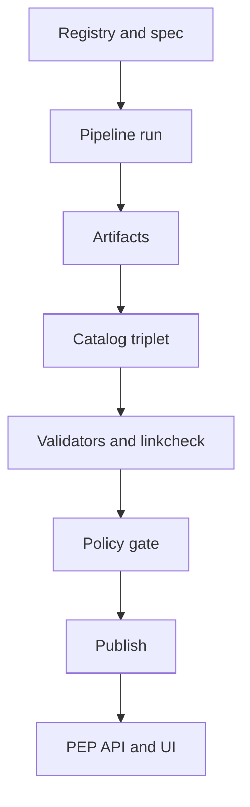

<!-- [KFM_META_BLOCK_V2]
doc_id: kfm://doc/2edea83c-1556-499f-b3d7-298b62acd825
title: Tooling Index
type: standard
version: v1
status: draft
owners: platform, data-pipelines, governance
created: 2026-03-04
updated: 2026-03-04
policy_label: public
related: [docs/reference/TOOLING_INDEX.md]
tags: [kfm, tooling, validators, policy, provenance, ci]
notes: [This index is evidence-labeled (CONFIRMED/PROPOSED/UNKNOWN). Run the Verification Checklist before treating any entry as implemented in the current repo HEAD.]
[/KFM_META_BLOCK_V2] -->

# Tooling Index
A curated index of the tools, scripts, and external CLIs used to validate, govern, and publish Kansas Frontier Matrix (KFM) artifacts.

> **Status:** draft  
> **Owners:** `platform`, `data-pipelines`, `governance`  
> **Last updated:** 2026-03-04  
> **Audience:** engineers, data stewards, reviewers


**Quick links:**  
[Scope](#scope) · [Status legend](#status-legend) · [Tool registry](#tool-registry) · [Promotion gate mapping](#promotion-gate-mapping) · [Verification checklist](#verification-checklist) · [Add a new tool entry](#add-a-new-tool-entry) · [Appendix](#appendix)

---

## Scope

This doc answers:

- **What tooling exists (or is expected) in KFM**
- **Where it lives** (repo path when known)
- **What contract surface it protects** (schemas, policies, catalogs, receipts)
- **How it maps to promotion gates**

It is intentionally an **index**, not a tutorial. If you need “how to deploy,” prefer runbooks under `docs/runbooks/`. If you need “what fields must exist,” prefer the relevant schema or validator README.

## Where this fits

- **Path:** `docs/reference/TOOLING_INDEX.md`
- **Upstream:** governance and contract docs (schemas, policy packs)
- **Downstream:** CI workflows, promotion automation, steward review checklists

## Acceptable inputs

- Tool entries for:
  - **In-repo tools** (scripts/validators/linkcheckers)
  - **External CLIs** invoked by CI or local validation
  - **Gate checks** (promotion, publish, release integrity)

## Exclusions

- Domain pipeline runbooks (put those in `docs/runbooks/` or domain-specific `packages/<lane>/README.md`)
- Policy text (put that in `policy/` and document it in a policy pack README)
- Large “how-to install everything” guides (put those in `docs/runbooks/dev/`)

[Back to top](#tooling-index)

---

## Status legend

KFM uses **evidence labels** for every meaningful claim.

- **CONFIRMED** — documented as present in a repo branch/snapshot, or explicitly described as existing tooling.
- **PROPOSED** — documented as intended tooling/patterns, but not verified as present in the current repo HEAD.
- **UNKNOWN** — referenced informally or implied, but no concrete evidence of existence or intended adoption.

> **Important:** “CONFIRMED” here means *confirmed by available documentation/snapshots*, not a guarantee that the tool exists in your current checkout.  
> Use the [Verification checklist](#verification-checklist) to turn “CONFIRMED (doc)” into “CONFIRMED (in HEAD)”.

---

## Tool registry

### In-repo tooling

These entries are expected to be runnable inside the repo (usually via Node, Python, or shell).

| Tool | Primary purpose | Inputs | Outputs | Where | Status |
|---|---|---|---|---|---|
| `node tools/validators/validate_dcat.js` | Fail-closed validation of DCAT records (profile-required fields, shape expectations) | DCAT JSON-LD | exit code + logs | `tools/validators/` | **CONFIRMED** |
| `node tools/validators/validate_stac.js` | Fail-closed validation of STAC catalogs/collections/items against KFM profile constraints | STAC JSON | exit code + logs | `tools/validators/` | **CONFIRMED** |
| `tools/validators/dcat_validator/` | Canonical rules for DCAT-required fields and validator behavior (incl. exit codes) | DCAT JSON-LD | validator docs + rules | `tools/validators/dcat_validator/` | **CONFIRMED** |
| `node tools/validators/validate_prov.js` | PROV validation (schema + cross-link expectations) | PROV bundle (JSON-LD/PROVN) | exit code + logs | `tools/validators/` | **PROPOSED** |
| `node tools/linkcheck/catalog_linkcheck.js` | Link integrity for catalog triplet and evidence references | DCAT/STAC/PROV | exit code + report | `tools/linkcheck/` | **PROPOSED** |
| `node tools/hash/check_spec_hash.js` | Determinism check for `spec_hash` (detect drift across canonicalization) | dataset spec + receipts | exit code + diff | `tools/hash/` | **PROPOSED** |
| `npm run test:integration:evidence` | Contract tests for evidence resolution (EvidenceRef → EvidenceBundle) | fixtures + API | test results | `tests/` | **PROPOSED** |
| `npm run test:eval:focus` | Focus Mode evaluation harness (must-cite / abstain / safety expectations) | golden queries + fixtures | eval report + diffs | `tests/` | **PROPOSED** |

### Policy tooling

Policy tools must support **fail-closed** behavior: if the policy engine or tests are missing, CI should fail.

| Tool | Primary purpose | Inputs | Outputs | Where | Status |
|---|---|---|---|---|---|
| `opa test policy/rego -v` | Unit tests for Rego policy packs | Rego + fixtures | pass/fail | `policy/rego/` | **PROPOSED** |
| `conftest test <file> -p policy/` | Run Rego assertions over JSON/YAML (often used in CI gates) | JSON/YAML | exit code + reasons | `policy/` | **PROPOSED** |

### External CLIs commonly used by CI and reviewers

These tools may be installed in CI images or developer machines, but are not “owned” by the repo.

| Tool | Primary purpose | Typical usage | Pinning guidance | Status |
|---|---|---|---|---|
| `stac-validator` | Validate STAC Items/Collections/Catalogs | `stac-validator data/catalog/stac/<dataset>/collection.json` | pin version in CI (avoid `latest`) | **PROPOSED** |
| `stac-check` | Lint STAC (style + best practices) | `stac-check <path>` | pin version in CI | **PROPOSED** |
| `provconvert` (ProvToolbox) | Validate/convert W3C PROV | `provconvert -infile <prov> -validator` | pin toolkit version | **PROPOSED** |
| `pyshacl` (or equivalent) | Validate DCAT JSON-LD/RDF shapes | `pyshacl -s <shape> <dcat.jsonld>` | pin version, pin shapes | **PROPOSED** |
| `oras` | OCI artifacts + referrers (attach/pull by digest) | `oras attach ...` / `oras pull ...@sha256:<digest>` | pin version; use digest addressing | **PROPOSED** |
| `cosign` | Sign/verify blobs and attestations (in-toto/DSSE) | `cosign attest ...` / `cosign verify-attestation ...` | pin version; define trust root | **PROPOSED** |

[Back to top](#tooling-index)

---

## Promotion gate mapping

KFM’s “promotion contract” can be enforced as a set of checks. This section maps each gate to the most relevant tooling.



| Gate | What must be true | Primary checks | Suggested tools | Status |
|---|---|---|---|---|
| A. Identity and versioning | dataset ids exist; `spec_hash` deterministic; content digests stable | deterministic hashing + drift test | `check_spec_hash.js` | **PROPOSED** |
| B. Licensing and rights | license fields present; rights snapshot captured; unknown licenses quarantined | schema + policy checks | `validate_dcat.js` + policy pack | **PROPOSED** |
| C. Sensitivity and redaction | policy label assigned; obligations applied | policy enforcement | OPA/Conftest policies | **PROPOSED** |
| D. Catalog triplet validity | DCAT, STAC, PROV validate and cross-link; EvidenceRefs resolve | validators + linkcheck | `validate_*` + `catalog_linkcheck.js` | **PROPOSED** |
| E. QA thresholds | dataset-specific tests pass | QA reports exist | lane-specific QA tooling | **UNKNOWN** |
| F. Run receipt and audit record | receipts emitted; policy decision recorded | receipt schema validation + policy gate | receipt validators + OPA gate | **PROPOSED** |
| G. Release manifest | promotion recorded as immutable manifest referencing digests | manifest schema validation | release script(s) + schema | **UNKNOWN** |

> If Gate E/G is still UNKNOWN for your lane, treat promotion as blocked until the lane’s QA + release tooling is defined and enforced.

[Back to top](#tooling-index)

---

## Verification checklist

Use this checklist to turn “documented tooling” into “verified tooling.”

### 1) Confirm repo snapshot and tree

```bash
git rev-parse HEAD
tree -L 3
```

### 2) Confirm tool files exist in your checkout

```bash
git ls-files tools | sed -n '1,200p'
git ls-files policy | sed -n '1,200p'
```

### 3) Run validators locally (if present)

```bash
# Node validators (examples)
node tools/validators/validate_dcat.js
node tools/validators/validate_stac.js
```

### 4) Run policy tests (if configured)

```bash
# OPA unit tests
opa test policy/rego -v

# Conftest gate
conftest test data/work/<dataset>/run_manifest.json -p policy/
```

### 5) Run catalog link integrity checks (if present)

```bash
node tools/linkcheck/catalog_linkcheck.js
```

### 6) Record results as evidence

Attach the following to your PR (or store in your run receipts):

- tool versions (`node -v`, `opa version`, `conftest --version`, `stac-validator --version`)
- exit codes + logs
- the commit hash used for the run

---

## Add a new tool entry

When adding a new tool (or introducing a new gate check), update this file with:

- **Tool name**
- **Owner** (team or CODEOWNERS group)
- **Inputs + outputs** (including file formats and schemas)
- **How CI invokes it**
- **Status label** (CONFIRMED / PROPOSED / UNKNOWN)
- **Version pinning strategy** (how we avoid “latest” drift)

**Do not** merge a new promotion gate unless:

- it is **fail-closed** in CI
- it has **fixtures** and at least one **golden test**
- it has a documented **rollback path**

---

## Appendix

<details>
<summary>Suggested minimum “toolchain pins” policy (template)</summary>

- Pin external CLIs in CI (avoid `latest`).
- Capture tool versions into receipts/manifests.
- Prefer digest-addressed artifacts (OCI) over mutable tags.
- If a tool is missing in CI, the job should **fail** (not skip silently), unless the lane explicitly opts out.

</details>

<details>
<summary>Common failure modes and what to check</summary>

- **Validator fails:** confirm you are running against the lane’s pinned schema/profile version.
- **Policy fails:** check policy label assignment and obligations; ensure you’re testing the correct namespace/package.
- **Linkcheck fails:** identify which EvidenceRef is broken; fix at the source (catalog triplet), not in UI.
- **Spec hash drift:** verify canonicalization rules (key ordering, normalization); ensure no nondeterministic timestamps are included.

</details>

[Back to top](#tooling-index)
