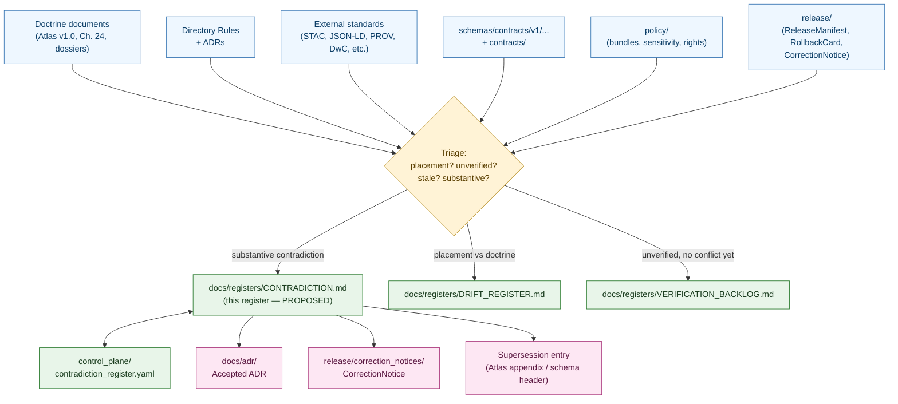
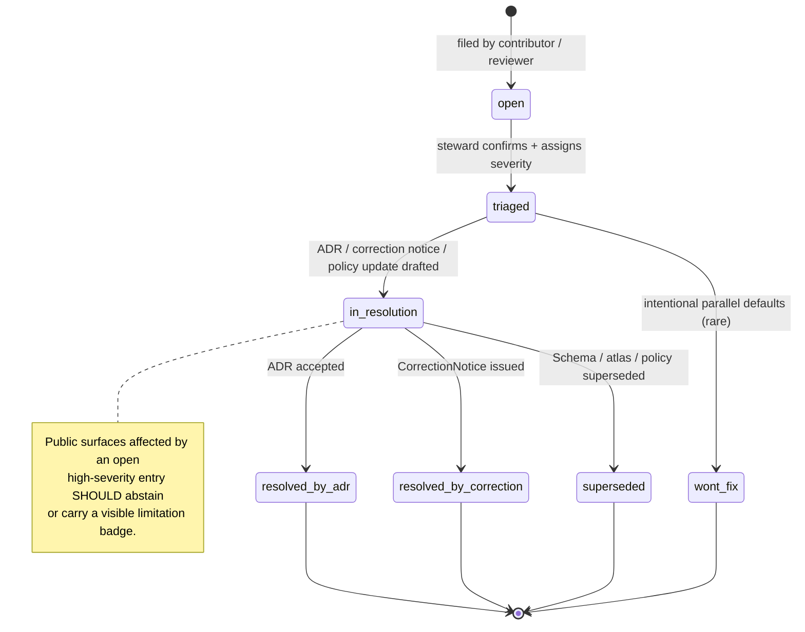

<!-- [KFM_META_BLOCK_V2]
doc_id: kfm://doc/registers/contradiction
title: Contradiction Register
type: standard
version: v0.1
status: draft
owners: Docs steward + Subsystem owners (PROPOSED)
created: 2026-05-12
updated: 2026-05-12
policy_label: public
related:
  - docs/doctrine/directory-rules.md
  - docs/registers/DRIFT_REGISTER.md
  - docs/registers/VERIFICATION_BACKLOG.md
  - docs/registers/AUTHORITY_LADDER.md
  - docs/registers/CANONICAL_LINEAGE_EXPLORATORY.md
  - control_plane/contradiction_register.yaml
  - docs/adr/
tags: [kfm, governance, registers, contradictions, doctrine, evidence]
notes:
  - PROPOSED file path; not explicitly listed in Directory Rules §6.1.
  - Human-facing companion to control_plane/contradiction_register.yaml.
  - Separation from DRIFT_REGISTER.md may need an ADR (see §2 / §11).
[/KFM_META_BLOCK_V2] -->

# Contradiction Register

> **A register of unresolved substantive contradictions inside the Kansas Frontier Matrix corpus — between sources, doctrines, standards, schemas, contracts, or policies — kept visible so they can be resolved by ADR, correction notice, or supersession rather than smoothed over.**

  <em>Kansas Frontier Matrix — Evidence First · Cite or Abstain · Fail Closed · Reversible</em>

  
  
  
  
  
  

| Field | Value |
|---|---|
| **Status** | `draft` |
| **Owners** | Docs steward + subsystem owners (**PROPOSED**) |
| **Last updated** | `2026-05-12` |
| **Authority of these rules** | **PROPOSED** — the *file* is not explicitly enumerated in Directory Rules §6.1 |
| **Authority of the entries** | Each entry carries its own truth label and resolution status |
| **Companion register (machine)** | `control_plane/contradiction_register.yaml` |
| **Adjacent registers (human)** | `docs/registers/DRIFT_REGISTER.md` · `docs/registers/VERIFICATION_BACKLOG.md` · `docs/registers/AUTHORITY_LADDER.md` |

---

## Quick Links

- [1. Scope](#1-scope)
- [2. Repo fit and authority basis](#2-repo-fit-and-authority-basis)
- [3. What counts as a Contradiction](#3-what-counts-as-a-contradiction)
- [4. Contradiction vs Drift vs Verification gap](#4-contradiction-vs-drift-vs-verification-gap)
- [5. Register topology](#5-register-topology)
- [6. Entry schema](#6-entry-schema)
- [7. Severity, scope, and resolution status](#7-severity-scope-and-resolution-status)
- [8. Lifecycle of a contradiction entry](#8-lifecycle-of-a-contradiction-entry)
- [9. How to file an entry](#9-how-to-file-an-entry)
- [10. Anti-patterns](#10-anti-patterns)
- [11. Open questions](#11-open-questions)
- [12. Seeded entries](#12-seeded-entries-illustrative)
- [13. Related docs](#13-related-docs)

---

## 1. Scope

This register tracks **substantive contradictions** in the KFM corpus that have **not yet been resolved** by an ADR, correction notice, supersession entry, or policy decision. A contradiction is recorded here when two authoritative sources, two doctrine statements, two standards, two schemas, two contracts, or two policies make claims that **cannot both be true simultaneously without further disposition**.

The register exists because KFM doctrine requires that contradictions be **named, not smoothed**: the operating posture is evidence-first, cite-or-abstain, and policy-aware, and silent reconciliation between authoritative sources erodes all three. **CONFIRMED doctrine.** ([directory-rules.md §2; Atlas v1.1 conflict rule; Pass 10 §8])

### 1.1 In scope

- Conflicts **between two attached project documents** (e.g., Atlas v1.0 vs Chapter 24 supplement).
- Conflicts **between project doctrine and a chosen external standard** (e.g., a KFM-specific extension to CIDOC-CRM that an external profile would not accept).
- Conflicts **between two declared defaults** where both appear in the corpus (e.g., JCS vs URDNA2015 for canonical hashing).
- Conflicts **between a contract and a schema**, **a schema and a policy**, or **a policy and a release decision**, when both are otherwise authoritative.
- **Unsettled choices** the corpus surfaces but does not commit to (e.g., orchestrator selection across Dagster, Prefect, Temporal). **CONFIRMED** as enumerated in the Pass 10 corpus §8.

### 1.2 Out of scope

- **Placement / directory drift** between Directory Rules and the mounted repo. → `docs/registers/DRIFT_REGISTER.md` per Directory Rules §2.5.
- **Items needing verification** that are not yet known to conflict. → `docs/registers/VERIFICATION_BACKLOG.md`.
- **Stale-state markers** (source freshness expired, schema version drift, etc.). → handled by stale-state lifecycle per Atlas v1.1 §24.8.
- **Routine ADR-class questions** that are open but not yet contradictions. → ADR backlog (e.g., Atlas v1.1 §24.12 ADR-S items).
- **Generation vs evidence disagreements** (AI output disagreeing with a cited bundle). → `AIReceipt` and Focus Mode governance, not this register.

> [!IMPORTANT]
> This register **does not decide** which side of a contradiction is correct. Resolution is the job of an ADR, a correction notice, a policy update, or a supersession entry. The register's only job is to keep the contradiction **visible and traceable** until it is resolved.

---

## 2. Repo fit and authority basis

The file `docs/registers/CONTRADICTION.md` is **PROPOSED**. Directory Rules §6.1 explicitly names the human-facing registers as `AUTHORITY_LADDER`, `CANONICAL_LINEAGE_EXPLORATORY`, `DRIFT_REGISTER`, `VERIFICATION_BACKLOG`, and `OBJECT_FAMILY_MAP`. Directory Rules §6.2 separately names `control_plane/contradiction_register.yaml` as a machine-readable register. There is therefore **no enumerated human-facing companion** to the YAML register today; this document fills that gap as a **proposed addition**, not as a silently introduced canon. **PROPOSED.** ([directory-rules.md §§6.1, 6.2])

### 2.1 Why a separate human-facing file at all

| Concern | Where it lives today | Gap this document addresses |
|---|---|---|
| Machine-readable contradiction tracking | `control_plane/contradiction_register.yaml` (**CONFIRMED** in Directory Rules §6.2) | YAML alone is hard to read in PR review and lacks narrative context. |
| Conflicts between *placement* and Directory Rules | `docs/registers/DRIFT_REGISTER.md` (**CONFIRMED** in Directory Rules §2.5 / §6.1) | DRIFT_REGISTER scope is repo-vs-rules, not source-vs-source. |
| Conflicts between *doctrine versions* (e.g., Atlas v1.0 vs Ch. 24) | Currently routed to `DRIFT_REGISTER.md` per Atlas v1.1 conflict rule (**CONFIRMED** in Atlas v1.1 front matter) | Routing substantive doctrinal conflicts through a placement-named register conflates two different concerns. |

> [!NOTE]
> **Possible ADR.** Whether to split substantive contradictions from placement drift, and whether `docs/registers/CONTRADICTION.md` is the right name and home, is **PROPOSED** and may require an ADR per Directory Rules §2.4 if it adds a new register file to the §6.1 enumeration. Until that ADR is accepted, this register operates *alongside* `DRIFT_REGISTER.md` and entries that legitimately belong in either are cross-referenced rather than duplicated.

### 2.2 Directory Rules basis cited

- Owning root: `docs/` — **canonical** human-facing control plane (Directory Rules §6.1).
- Sub-lane: `docs/registers/` — register lane (Directory Rules §6.1 register list).
- Lifecycle: not a `data/` artifact; not a release record; not a receipt. **No lifecycle invariant invoked.**
- ADR linkage: **NEEDS VERIFICATION** — no ADR currently formalizes this file.

---

## 3. What counts as a Contradiction

A **Contradiction** is recorded here when **all five** of the following are true:

1. **Two or more authoritative sources** make claims that bear on the same KFM object, decision, schema, contract, policy, or release surface.
2. The claims **cannot both be operationally true** without one being overridden, narrowed, deferred, or marked stale.
3. **At least one** of the sources is something KFM would otherwise treat as canon, doctrine, contract, schema, policy, or release-class evidence.
4. The conflict is **not** a placement / directory drift question (that is `DRIFT_REGISTER.md`).
5. The conflict has **not yet been resolved** by an accepted ADR, correction notice, supersession entry, or policy update.

If a candidate fails any of these tests, route it elsewhere — see §4.

---

## 4. Contradiction vs Drift vs Verification gap

A short triage table for reviewers and contributors.

| Symptom | Best home | Why |
|---|---|---|
| The repo's directory structure disagrees with Directory Rules. | `docs/registers/DRIFT_REGISTER.md` | Directory Rules §2.5 names this register for placement drift. **CONFIRMED.** |
| A path / schema home / route / module name is not yet verified against the mounted repo. | `docs/registers/VERIFICATION_BACKLOG.md` | The item is unverified, not yet known to conflict. **CONFIRMED.** |
| Two authoritative sources make claims that cannot both be true (e.g., JCS vs URDNA2015 as the default hash, with no committed rule). | **This register** (PROPOSED) or `DRIFT_REGISTER.md` (today, per Atlas v1.1 conflict rule) | The contradiction is substantive, not placement. **PROPOSED separation.** |
| A claim's underlying source has aged past its freshness cadence. | Stale-state markers, Atlas v1.1 §24.8 | Stale is not the same as wrong. **CONFIRMED doctrine.** |
| A published claim has been determined to be incorrect. | `CorrectionNotice` + supersession in `release/correction_notices/` and Atlas v1.1 §24.8 supersession lineage | Correction is a release-class artifact, not a register entry. **CONFIRMED.** |
| AI-generated text disagrees with the cited EvidenceBundle. | Governed AI runtime — `AIReceipt` with `ABSTAIN` / `DENY` outcome | The trust membrane handles this at runtime, not in a register. **CONFIRMED.** ([Atlas v1.1 §24.9.2; GAI doctrine]) |

---

## 5. Register topology

The register sits at the intersection of doctrine, evidence, schemas, policy, and release decisions. The diagram below shows where a contradiction can originate and where its resolution paths run.

> [!NOTE]
> The diagram is structural (responsibility boundaries), not deployment. It does **not** imply that the registers, ADRs, or correction notices exist in the mounted repository today; per Directory Rules §0, any specific path is **PROPOSED until verified against mounted-repo evidence**.

---

## 6. Entry schema

Every entry MUST include the fields below. The shape mirrors what a machine-readable companion would carry in `control_plane/contradiction_register.yaml`, so an entry can later be migrated without rewriting.

| Field | Required | Description |
|---|---|---|
| `id` | yes | Stable identifier, format `CON-YYYY-NNN` (e.g., `CON-2026-001`). |
| `title` | yes | Short, neutral statement of the conflict — no recommendation. |
| `summary` | yes | One- or two-sentence description; **no prescription** of which side wins. |
| `parties` | yes | The two (or more) authoritative sources whose claims conflict. Cite by stable reference (doc id, schema path, ADR id, standard URL). |
| `claim_a` / `claim_b` | yes | The two competing statements, quoted or paraphrased, with citations. |
| `evidence_refs` | yes | List of references to attached docs, schemas, contracts, policies, or external specs. Each should resolve to an EvidenceBundle when it depends on evidence. |
| `domain_scope` | yes | Which domain(s) the contradiction touches (e.g., `evidence-identity`, `archaeology`, `cross-cutting`). |
| `surface_scope` | yes | Which KFM surfaces are affected — schema, contract, policy, release, UI, governed-API, AI, none. |
| `severity` | yes | `low` · `medium` · `high` (see §7). |
| `status` | yes | `open` · `triaged` · `in-resolution` · `resolved-by-adr` · `resolved-by-correction` · `superseded` · `wont-fix` (see §7). |
| `truth_label` | yes | The narrowest truthful label: `CONFIRMED` (the conflict is verified to exist in the corpus), `PROPOSED`, `NEEDS VERIFICATION`, or `UNKNOWN`. |
| `policy_label` | yes | `public` · `restricted` · `sensitive` — derived from the highest-sensitivity party. |
| `opened_by` | yes | The person, role, or process that filed the entry. |
| `opened_on` | yes | ISO date (`YYYY-MM-DD`). |
| `proposed_resolution` | optional | Sketch of the path forward (e.g., "ADR-SCM-0001 to pin JCS as default; URDNA2015 behind explicit opt-in"). |
| `resolution_artifact` | conditional | If `status` is resolved-*, the artifact id (ADR, CorrectionNotice, supersession entry). |
| `last_review` | yes | ISO date of last review; entries older than the review cadence are flagged. |
| `cross_refs` | optional | Linked entries in `DRIFT_REGISTER.md`, `VERIFICATION_BACKLOG.md`, ADRs, or supersession entries. |

> [!TIP]
> Keep `claim_a` and `claim_b` as **neutral paraphrases with citations**. The register is a tracking surface, not a debate. Recommendations live in `proposed_resolution`, not in the claims themselves.

---

## 7. Severity, scope, and resolution status

### 7.1 Severity

Severity is **qualitative** and proportionate to risk, mirroring the posture of Atlas v1.1 §24.10's risk-register language.

| Severity | When to use |
|---|---|
| **`high`** | Affects publication trust, sensitivity, rights, evidence resolution, or release lineage. Public surfaces may already be misleading if unresolved. |
| **`medium`** | Affects internal consistency between contracts, schemas, or policy bundles; not yet user-visible, but blocks downstream work or causes silent drift. |
| **`low`** | Affects documentation, naming, or non-critical defaults; no near-term operational risk but worth recording. |

### 7.2 Status lifecycle

| Status | Meaning |
|---|---|
| `open` | Newly filed; not yet reviewed by a steward. |
| `triaged` | Confirmed, severity assigned, owner identified, but resolution not yet underway. |
| `in-resolution` | An ADR draft, correction-notice draft, or policy update is in progress. |
| `resolved-by-adr` | An accepted ADR resolves the contradiction; `resolution_artifact` cites the ADR id. |
| `resolved-by-correction` | A `CorrectionNotice` resolves the contradiction; `resolution_artifact` cites the notice. |
| `superseded` | Resolved by edition or schema supersession; `resolution_artifact` cites the supersession entry. |
| `wont-fix` | Both sides are kept intentionally (e.g., as parallel defaults under explicit opt-in); a one-paragraph note explains why. **Rare.** |

### 7.3 Severity × status quick reference

| | `open` | `triaged` | `in-resolution` | resolved-* | `wont-fix` |
|---|---|---|---|---|---|
| **`high`** | Steward review within current sprint | Owner + ADR-class question raised | ADR / correction in flight | Verify resolution artifact is linked | Requires senior-sign-off note |
| **`medium`** | Steward review within current release window | Owner identified | Plan recorded | Verify | Requires note |
| **`low`** | Routine review | Owner identified | Plan optional | Verify | Note optional |

---

## 8. Lifecycle of a contradiction entry

> [!WARNING]
> An `open` or `triaged` high-severity contradiction **affecting a published claim** is itself a publication-readiness defect. Per KFM doctrine, public surfaces should prefer **`ABSTAIN`** or a visible limitation over confident prose while a high-severity contradiction is unresolved. **CONFIRMED** doctrine; specific UI behavior is **PROPOSED** until verified in the runtime.

---

## 9. How to file an entry

A short, ordered checklist for contributors and reviewers.

1. **Triage first.** Confirm the candidate is a substantive contradiction (§3) and not drift (§4). If it is drift, file in `docs/registers/DRIFT_REGISTER.md` instead.
2. **Assign an id.** Use the next free `CON-YYYY-NNN`. The register MUST keep ids monotonically increasing per calendar year.
3. **Draft `claim_a` and `claim_b` neutrally.** Paraphrase with citations to attached docs, schemas, contracts, policies, or ADRs.
4. **Cite EvidenceRefs** — every claim that depends on evidence must reference something that resolves to an `EvidenceBundle` per KFM's cite-or-abstain doctrine.
5. **Assign initial severity** (§7.1). Err high when sensitivity, rights, or release lineage are involved.
6. **Set `status: open`** and a `last_review` equal to `opened_on`.
7. **Open a PR** touching this file. The PR description SHOULD link the corresponding YAML entry in `control_plane/contradiction_register.yaml` once that companion register exists (currently **PROPOSED**).
8. **Notify the relevant steward(s)** by CODEOWNERS routing (**NEEDS VERIFICATION** — CODEOWNERS rules not inspected in this session).

> [!CAUTION]
> Do **not** propose a "winner" in `claim_a` / `claim_b`. The register is not the place to decide which authority controls — that belongs to an ADR, a correction notice, or a supersession entry. The register only **names** the conflict and keeps it visible.

---

## 10. Anti-patterns

Patterns that should not appear in this register. They are listed here so reviewers can call them out before they harden into precedent.

| Anti-pattern | What goes wrong | Counter-rule |
|---|---|---|
| Using `CONTRADICTION.md` as an alternative ADR queue. | Decisions slip in without the ADR discipline (§2.4 of Directory Rules). | Resolution belongs to ADRs / correction notices; this register tracks the conflict, not the decision. |
| Folding placement / repo drift entries here. | Two registers race to be the home of the same item. | Placement drift → `DRIFT_REGISTER.md`. Always. **CONFIRMED.** |
| Recording stale-state issues as contradictions. | Stale ≠ wrong; stale lifecycle is already covered by Atlas v1.1 §24.8. | Use stale-state markers; only record if a substantive disagreement persists after refresh. |
| Stripping citations from `claim_a` / `claim_b`. | The register stops being inspectable; entries become rumor. | Every claim **must** carry a citation. |
| Closing an entry without naming a `resolution_artifact`. | Entry appears resolved while doctrine is unchanged elsewhere. | `resolved-*` requires an explicit artifact id. |
| Marking an entry `wont-fix` without senior sign-off. | Parallel defaults harden silently into doctrine. | `wont-fix` requires a brief note signed by docs steward + the affected subsystem owner. |
| Treating this register as evidence for a downstream claim. | Registers are navigational; they are not `EvidenceBundle`s. | A register entry **cites** evidence; it does **not** substitute for one. **CONFIRMED** (Atlas v1.1 non-collapse rule). |

---

## 11. Open questions

Items explicitly **not resolved** by this document; they SHOULD be tracked in `docs/registers/VERIFICATION_BACKLOG.md` and addressed by ADR.

- **PROPOSED / ADR-class:** Whether `docs/registers/CONTRADICTION.md` is added to the Directory Rules §6.1 enumeration of human-facing registers, or whether substantive contradictions continue to be filed in `DRIFT_REGISTER.md` per the Atlas v1.1 conflict rule.
- **NEEDS VERIFICATION:** Whether `control_plane/contradiction_register.yaml` exists in the mounted repo today, and what schema it expects.
- **NEEDS VERIFICATION:** Whether CODEOWNERS routing exists for `docs/registers/`.
- **OPEN:** Cadence for reviewing `open` / `triaged` entries — proposed default is *every release window* for `medium`/`high` and *quarterly* for `low`. Confirm by ADR.
- **OPEN:** Whether to mirror this register's entries as forward-links from individual schemas / contracts / policies that participate in the contradiction (a "back-pointer" pattern).
- **OPEN:** Whether `resolved-*` entries are pruned, archived to `docs/archive/registers/`, or retained inline as historical record. This document currently assumes **retained inline** with a clear `status`, consistent with KFM's supersession-by-extension posture.

---

## 12. Seeded entries (illustrative)

The entries below are **illustrative examples** drawn from project knowledge to show the schema in use. Each is **CONFIRMED** to exist in the project corpus as named tensions; their status as *open contradictions* in the live KFM repo is **PROPOSED until verified against mounted-repo evidence and ADR record**.

<strong>CON-2026-001 — JCS vs URDNA2015 as default canonicalization for evidence bundles</strong>

| Field | Value |
|---|---|
| `id` | `CON-2026-001` |
| `title` | JCS vs URDNA2015 as default canonicalization for evidence bundles |
| `summary` | The corpus identifies a tension between RFC 8785 JCS (JSON-layer) and W3C URDNA2015 (RDF-layer) canonicalization; the two can produce different hashes for the same logical bundle. The corpus names JCS as the default but does not specify when URDNA2015 is mandatory or how the two hashes interact in receipts. |
| `parties` | Pass 10 §8.2 (JCS-default doctrine) · Pass 10 C8-05 / C4-04 (URDNA2015 as alternative for graph documents) |
| `claim_a` | "The KFM default for receipts and bundle hashes is JCS, with URDNA2015 reserved for cases where RDF semantic equivalence is the relevant invariant." (Pass 10 C8-05) |
| `claim_b` | "Each catalog entry references an evidence bundle … canonicalized via JCS or URDNA2015 and hashed; the hash becomes `kfm:id` and `kfm:spec_hash`." (Pass 10 C4-04) — i.e., both are admitted without a normative rule. |
| `evidence_refs` | Pass 10 §8.2; Pass 10 C1-02; Pass 10 C4-04; Pass 10 C8-04; Pass 10 C8-05 |
| `domain_scope` | `evidence-identity`, `cross-cutting` |
| `surface_scope` | `schema`, `contract`, `release` |
| `severity` | `high` — silent verification failure mode for downstream consumers |
| `status` | `open` (**PROPOSED**) |
| `truth_label` | `CONFIRMED` (the tension is verified in the source corpus) |
| `policy_label` | `public` |
| `opened_by` | Docs steward (PROPOSED) |
| `opened_on` | `2026-05-12` |
| `proposed_resolution` | ADR pinning JCS as default with URDNA2015 behind explicit opt-in; publish a test-vector suite; record the chosen canonicalization in every receipt. (Pass 10 C8-05 expansion direction) |
| `resolution_artifact` | — |
| `last_review` | `2026-05-12` |
| `cross_refs` | `docs/registers/VERIFICATION_BACKLOG.md` (test vectors), proposed ADR-S |

<strong>CON-2026-002 — kfm: vs ks-kfm: namespace for state-specific extensions</strong>

| Field | Value |
|---|---|
| `id` | `CON-2026-002` |
| `title` | `kfm:` vs `ks-kfm:` namespace prefix for KFM extensions |
| `summary` | Several categories use the `kfm:` namespace prefix without specifying the IRI base, version-pinning strategy, or whether a Kansas-specific subnamespace (`ks-kfm:`) is appropriate for state-specific extensions vs all extensions living under `kfm:` regardless of geographical scope. |
| `parties` | Pass 10 §8.3 (unsettled namespace) · CIDOC-CRM extension practice cited throughout C8 |
| `claim_a` | "KFM extends CRM only through the `kfm:` namespace and only where the corpus identifies a clear gap." (Pass 10 C8-01) |
| `claim_b` | "There is also a question — implied but not resolved — of whether a Kansas-specific subnamespace (`ks-kfm:`) is appropriate for state-specific extensions, or whether all KFM extensions live under `kfm:` regardless of geographical scope." (Pass 10 §8.3) |
| `evidence_refs` | Pass 10 §8.3; Pass 10 C8-01 |
| `domain_scope` | `cross-cutting`, `vocabularies` |
| `surface_scope` | `schema`, `contract` |
| `severity` | `medium` |
| `status` | `open` (**PROPOSED**) |
| `truth_label` | `CONFIRMED` |
| `policy_label` | `public` |
| `opened_by` | Docs steward (PROPOSED) |
| `opened_on` | `2026-05-12` |
| `proposed_resolution` | ADR pinning the IRI base, the version-pinning strategy, and a rule for state-specific extensions (single namespace or sub-namespace). |
| `last_review` | `2026-05-12` |

<strong>CON-2026-003 — Orchestrator overlap: Dagster vs Prefect vs Temporal</strong>

| Field | Value |
|---|---|
| `id` | `CON-2026-003` |
| `title` | Three orchestrators named without a default or decision rubric |
| `summary` | The corpus names Dagster, Prefect, and Temporal without committing to a default and without specifying a decision rubric. The practical risk is a multi-orchestrator deployment in which different domains adopt different tools and the cross-domain operational surface expands without need. |
| `parties` | Pass 10 §8.1 · C2 orchestration category |
| `claim_a` | "C2 names three orchestrators without committing to one." (Pass 10 §8.1) |
| `claim_b` | "The three overlap substantially in the simple-pipeline case and diverge in the complex-pipeline case. The corpus does not name a default and does not specify a decision rubric." (Pass 10 §8.1) |
| `evidence_refs` | Pass 10 §8.1; Pass 10 C2 entries |
| `domain_scope` | `cross-cutting`, `pipelines` |
| `surface_scope` | `pipelines`, `release` |
| `severity` | `medium` |
| `status` | `open` (**PROPOSED**) |
| `truth_label` | `CONFIRMED` |
| `policy_label` | `public` |
| `opened_by` | Docs steward (PROPOSED) |
| `opened_on` | `2026-05-12` |
| `proposed_resolution` | ADR selecting a default orchestrator and a decision rubric for when a domain may diverge. |
| `last_review` | `2026-05-12` |

<strong>CON-2026-004 — STAC vs DCAT canonical form for spatiotemporal datasets</strong>

| Field | Value |
|---|---|
| `id` | `CON-2026-004` |
| `title` | STAC vs DCAT canonical form for spatiotemporal datasets that fit both profiles |
| `summary` | DCAT and STAC overlap for spatiotemporal datasets; the corpus does not fully specify which is canonical for any given dataset class, leaving room for divergent catalog records for the same dataset. |
| `parties` | Pass 10 C4-05 (DCAT) · Pass 10 C4-01 (STAC) |
| `claim_a` | "Non-spatial datasets are catalogued as DCAT Dataset and Distribution objects … (DCAT for everything else, STAC for spatiotemporal data, with a small bridge that mints a DCAT mirror of every STAC Collection)." (Pass 10 C4-05) |
| `claim_b` | "DCAT and STAC overlap for spatiotemporal datasets; the corpus does not fully specify which is canonical for any given dataset class." (Pass 10 C4-05, Tensions) |
| `evidence_refs` | Pass 10 C4-01; Pass 10 C4-04; Pass 10 C4-05 |
| `domain_scope` | `cross-cutting`, `catalog` |
| `surface_scope` | `contract`, `release`, `governed-api` |
| `severity` | `low` |
| `status` | `open` (**PROPOSED**) |
| `truth_label` | `CONFIRMED` |
| `policy_label` | `public` |
| `opened_by` | Docs steward (PROPOSED) |
| `opened_on` | `2026-05-12` |
| `proposed_resolution` | ADR fixing STAC as canonical for spatiotemporal datasets and DCAT as a mirror, with a converter and parity tests. |
| `last_review` | `2026-05-12` |

<strong>CON-2026-005 — Schema home: <code>schemas/contracts/v1/</code> vs <code>contracts/&lt;domain&gt;/&lt;x&gt;.schema.json</code></strong>

| Field | Value |
|---|---|
| `id` | `CON-2026-005` |
| `title` | Schema home — `schemas/contracts/v1/...` (Directory Rules / ADR-0001 default) vs `contracts/<domain>/<x>.schema.json` (some domain blueprints) |
| `summary` | Directory Rules and ADR-0001 default the machine-schema home to `schemas/contracts/v1/...`. Some domain blueprints place schemas under `contracts/<domain>/`. Directory Rules §6.4 calls this **lineage / CONFLICTED** and MUST be migrated under ADR-0001. |
| `parties` | Directory Rules §§6.4, 2.4(3) · ADR-0001 (schema home) · Domain blueprints placing schemas under `contracts/<domain>/` |
| `claim_a` | "Schema-home rule (ADR-0001): the default machine-schema home is `schemas/contracts/v1/...`." (`directory-rules.md` §6.4) |
| `claim_b` | "If a domain blueprint shows `contracts/<domain>/<x>.schema.json`, that is lineage / CONFLICTED and MUST be migrated under ADR-0001." (`directory-rules.md` §6.4) — i.e., divergence exists in upstream blueprints. |
| `evidence_refs` | `directory-rules.md` §§6.4, 2.4(3); ADR-0001 (**NEEDS VERIFICATION** — accepted state not inspected this session) |
| `domain_scope` | `cross-cutting`, `schemas` |
| `surface_scope` | `schema`, `contract` |
| `severity` | `high` |
| `status` | `open` (**PROPOSED** — partially routed today through `DRIFT_REGISTER.md`; this entry tracks the *substantive* claim, the placement consequence belongs to drift) |
| `truth_label` | `CONFIRMED` (the rule is stated; the divergence is also stated) |
| `policy_label` | `public` |
| `opened_by` | Docs steward (PROPOSED) |
| `opened_on` | `2026-05-12` |
| `proposed_resolution` | Verify ADR-0001 acceptance; complete migration of any `contracts/<domain>/<x>.schema.json` to `schemas/contracts/v1/...`; cross-reference drift entries from `DRIFT_REGISTER.md`. |
| `cross_refs` | `docs/registers/DRIFT_REGISTER.md` (placement consequence); `docs/adr/ADR-0001-schema-home.md` |
| `last_review` | `2026-05-12` |

> [!NOTE]
> These five entries are seeded to demonstrate the register schema. Adding them to the operational register requires a steward review pass and (where indicated) the corresponding entry in `control_plane/contradiction_register.yaml`.

---

## 13. Related docs

- [`docs/doctrine/directory-rules.md`](../doctrine/directory-rules.md) — placement law and authority order. **CONFIRMED** doctrine.
- [`docs/registers/DRIFT_REGISTER.md`](./DRIFT_REGISTER.md) — placement / repo-vs-rules drift. **CONFIRMED** in Directory Rules §6.1.
- [`docs/registers/VERIFICATION_BACKLOG.md`](./VERIFICATION_BACKLOG.md) — items NEEDS VERIFICATION. **CONFIRMED** in Directory Rules §6.1.
- [`docs/registers/AUTHORITY_LADDER.md`](./AUTHORITY_LADDER.md) — authority order across doctrine, repo, source, runtime. **CONFIRMED** in Directory Rules §6.1.
- [`docs/registers/CANONICAL_LINEAGE_EXPLORATORY.md`](./CANONICAL_LINEAGE_EXPLORATORY.md) — canon / lineage / exploratory classification. **CONFIRMED** in Directory Rules §6.1.
- `control_plane/contradiction_register.yaml` — machine-readable companion to this register. **CONFIRMED** in Directory Rules §6.2; **NEEDS VERIFICATION** for mounted-repo presence.
- `docs/adr/` — Architecture Decision Records (resolution path for `resolved-by-adr` entries).
- `release/correction_notices/` — `CorrectionNotice` artifacts (resolution path for `resolved-by-correction` entries).

---

Last updated: 2026-05-12 · Doc id: `kfm://doc/registers/contradiction` · Status: `draft` · [Back to top ↑](#top)
