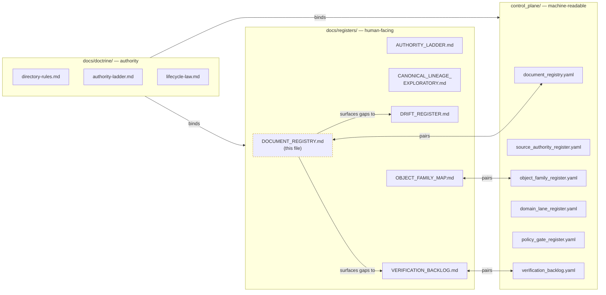

<!-- [KFM_META_BLOCK_V2]
doc_id: kfm://doc/document-registry
title: KFM Document Registry
type: standard
version: v1
status: draft
owners: [TODO — assign docs steward + governance reviewer]
created: 2026-05-12
updated: 2026-05-12
policy_label: public
related:
  - control_plane/document_registry.yaml
  - docs/doctrine/directory-rules.md
  - docs/registers/AUTHORITY_LADDER.md
  - docs/registers/CANONICAL_LINEAGE_EXPLORATORY.md
  - docs/registers/DRIFT_REGISTER.md
  - docs/registers/VERIFICATION_BACKLOG.md
  - docs/registers/OBJECT_FAMILY_MAP.md
tags: [kfm, register, governance, docs, control-plane, inventory]
notes:
  - Human-facing companion to control_plane/document_registry.yaml
  - Path PROPOSED — Directory Rules §6.1 does not yet enumerate DOCUMENT_REGISTRY.md
  - Establishes pairing pattern observed for other registers (yaml in control_plane / md in docs/registers)
[/KFM_META_BLOCK_V2] -->

<a id="top"></a>

# KFM Document Registry

> Human-facing inventory and classification of governance-bearing documents in the Kansas Frontier Matrix repository — the index that records **what authority each document carries, what lifecycle phase it occupies, and where its evidence lives.**

<p align="left">
  
  
  
  
  
  
  
</p>

| Field | Value |
|---|---|
| **Document type** | Standard / Register (`docs/registers/`) |
| **Authority of these rules** | CONFIRMED for the *register pattern* (paired md/yaml registers per Directory Rules §6.1–§6.2). |
| **Authority of this file's path** | PROPOSED — `DOCUMENT_REGISTRY.md` is not explicitly enumerated in Directory Rules §6.1's `docs/registers/` listing. |
| **Authority of individual entries** | PROPOSED until inventory is reconciled against a mounted repository. |
| **Machine counterpart** | [`control_plane/document_registry.yaml`](../../control_plane/document_registry.yaml) — the canonical, machine-readable register. |
| **Owners** | TODO — docs steward + governance reviewer (CODEOWNERS reference) |
| **Last reviewed** | 2026-05-12 (draft) |
| **Supersedes** | None — initial form. |
| **Schema-home convention** | `schemas/contracts/v1/<…>` (ADR-0001). Register entries that reference schemas MUST cite that home. |

---

## Quick Navigation

- [1. Purpose](#1-purpose)
- [2. Repo Fit](#2-repo-fit)
- [3. What Belongs Here · What Does Not](#3-what-belongs-here--what-does-not)
- [4. Relationship to the Machine Register](#4-relationship-to-the-machine-register-control_planedocument_registryyaml)
- [5. Classification Schema](#5-classification-schema)
- [6. Lifecycle Status Enum](#6-lifecycle-status-enum)
- [7. Registry Body — Illustrative Entries](#7-registry-body--illustrative-entries)
- [8. Operations — Add · Update · Deprecate · Retire](#8-operations--add--update--deprecate--retire)
- [9. Drift, Verification, and Conflict Handling](#9-drift-verification-and-conflict-handling)
- [10. Validation](#10-validation)
- [11. Review Burden](#11-review-burden)
- [12. Related Docs](#12-related-docs)
- [Appendix A — KFM Meta Block V2 Reference](#appendix-a--kfm-meta-block-v2-reference)
- [Appendix B — Worked Example Entries (Collapsible)](#appendix-b--worked-example-entries)
- [Appendix C — Open Questions / NEEDS VERIFICATION](#appendix-c--open-questions--needs-verification)

---

## 1. Purpose

The **Document Registry** is the *human-facing* inventory of governance-bearing documents in KFM. It exists so that, when a reader, reviewer, or steward picks up any markdown file in the repository, they can answer four questions at a glance:

1. **What does this document do?** (purpose / scope)
2. **What authority does it carry?** (canonical · lineage · exploratory · compatibility · archive)
3. **Where does it sit in its lifecycle?** (draft · review · published · deprecated · superseded)
4. **What other artifacts depend on it?** (schemas, contracts, policies, ADRs, releases)

The registry does **not** decide whether a document *should* exist — `contracts/`, `schemas/`, `policy/`, ADRs, and reviews decide that. The registry indexes documents *once they exist* and surfaces drift when reality diverges from intent.

> [!NOTE]
> The registry is an **index**, not a source of truth. EvidenceBundle, ADRs, Directory Rules, and the machine register (`control_plane/document_registry.yaml`) outrank any narrative claim made here. When this file and the machine register disagree, open an entry in [`DRIFT_REGISTER.md`](DRIFT_REGISTER.md) — do not silently amend.

---

## 2. Repo Fit

**Path (PROPOSED):** `docs/registers/DOCUMENT_REGISTRY.md`

**Upstream (consumes):**

- [`docs/doctrine/directory-rules.md`](../doctrine/directory-rules.md) — defines where files belong; this registry inventories what's *there*.
- [`docs/registers/AUTHORITY_LADDER.md`](AUTHORITY_LADDER.md) — defines the canonical authority order.
- [`docs/registers/CANONICAL_LINEAGE_EXPLORATORY.md`](CANONICAL_LINEAGE_EXPLORATORY.md) — defines the canon · lineage · exploratory classification.
- ADRs under `docs/adr/` — accepted decisions that bind specific documents to specific authority levels.

**Downstream (feeds):**

- [`control_plane/document_registry.yaml`](../../control_plane/document_registry.yaml) — machine-readable mirror; the operational register.
- [`docs/registers/DRIFT_REGISTER.md`](DRIFT_REGISTER.md) — receives drift entries when narrative and reality diverge.
- [`docs/registers/VERIFICATION_BACKLOG.md`](VERIFICATION_BACKLOG.md) — receives items requiring repository inspection.
- CI workflows (PROPOSED) — link-check, meta-block validation, registry-completeness scans.

> [!IMPORTANT]
> **Path-status disclosure.** Directory Rules §6.1 enumerates `docs/registers/` as containing `AUTHORITY_LADDER`, `CANONICAL_LINEAGE_EXPLORATORY`, `DRIFT_REGISTER`, `VERIFICATION_BACKLOG`, and `OBJECT_FAMILY_MAP` — it does **not** explicitly list `DOCUMENT_REGISTRY.md`. This document is **PROPOSED** as a natural human-facing companion to the already-listed `control_plane/document_registry.yaml` (Directory Rules §6.2). A short PR amending Directory Rules §6.1's enumeration would resolve the gap; an ADR is not required (per §17, "new placement example" → PR + reviewer sign-off).

---

## 3. What Belongs Here · What Does Not

### Belongs here

- **Index entries** for every governance-bearing document in the repository: doctrine, registers, architecture docs, ADRs, runbooks, source standards, domain dossiers, contracts narratives.
- **Classification metadata** for each indexed document: authority level, lifecycle status, owners, policy label, related artifacts.
- **Pointers** to the machine-readable counterpart and to the documents themselves.

### Does **not** belong here

| Content | Lives instead in | Why |
|---|---|---|
| Generated reports, release-cycle reports | `docs/reports/` (read-only) | Reports are emitted artifacts; the registry indexes durable docs, not throughput. |
| Source data, fixtures, receipts, proofs | `data/raw/`, `tests/fixtures/`, `data/receipts/`, `data/proofs/` | The lifecycle invariant lives in `data/`; the registry is not a data store. |
| Schemas (machine-checkable shape) | `schemas/contracts/v1/<…>` per ADR-0001 | `schemas/` owns shape; this registry indexes the narrative *describing* schemas, not the schemas themselves. |
| Contracts (object meaning) | `contracts/<…>` | `contracts/` owns object meaning; the registry points to it but does not duplicate it. |
| Policy bundles, rego, OPA | `policy/` | `policy/` decides admissibility; the registry points to policy docs, not policy bytecode. |
| Idea packets, drafts, brainstorm notes | `docs/intake/IDEA_INTAKE.md`, `docs/intake/NEW_IDEAS_INDEX.md` | Exploratory packets are not yet canon; the registry indexes documents whose authority is already classified. |
| Superseded documents themselves | `docs/archive/lineage/`, `docs/archive/deprecated/` | The registry records *that* a document was superseded; the artifact itself lives in `archive/`. |

> [!CAUTION]
> The registry must not become a parallel home for content that already has a canonical lane. If you find yourself copying a schema, a contract, a policy, or a source descriptor *into* a registry entry, stop. Link to the canonical artifact instead.

[Back to top](#top)

---

## 4. Relationship to the Machine Register (`control_plane/document_registry.yaml`)

KFM separates **narrative** from **index** by design:

- `docs/` **explains** — prose, decisions, doctrine, runbooks (human-readable).
- `control_plane/` **indexes** — structured registers, crosswalks (machine-readable).

This file is the *narrative* half. The yaml in `control_plane/` is the *index* half. Both must exist; neither replaces the other.



> [!NOTE]
> The dashed border on `DOCUMENT_REGISTRY.md` indicates **PROPOSED** path status — the diagram reflects intended structure, not verified repo state. See §9 for drift handling.

**Sync rules:**

1. Every entry in this file **MUST** have a corresponding key in `control_plane/document_registry.yaml` once the yaml exists.
2. Every key in the yaml **SHOULD** have a narrative entry here; entries-without-yaml are tolerated only during transitional periods, with a drift entry filed.
3. When fields diverge, the yaml is authoritative for **structured fields** (path, status, policy_label, hashes); this file is authoritative for **narrative context** (why, history, related-doc reasoning).
4. Conflicts on **authority level** must be resolved via [`AUTHORITY_LADDER.md`](AUTHORITY_LADDER.md), not by edit-war.

[Back to top](#top)

---

## 5. Classification Schema

Each indexed document carries five orthogonal classification axes. None of these is optional; "unknown" is a valid value but must be marked.

### 5.1 Authority Level

| Level | Meaning | Example placement |
|---|---|---|
| **canonical** | Authoritative; binds reviewers and CI. Changes require ADR or scoped PR per Directory Rules §17. | `docs/doctrine/*`, `docs/adr/*` (accepted), `contracts/*`, `schemas/*`. |
| **implementation-bearing** | Operational doc tied to a running surface; changes when behavior changes. | `docs/runbooks/*`, `docs/architecture/*`. |
| **generated** | Produced by tooling; never hand-edited; rebuilt from source. | `docs/reports/*` (read-only). |
| **compatibility** | Mirror, legacy, deprecated, transitional, external-export. README MUST declare class. | `policies/`, `jsonschema/`, `ui/`, `web/`, `styles/`, `viewer_templates/`. |
| **archive** | Retained for traceability; not current truth. | `docs/archive/lineage/`, `docs/archive/deprecated/`. |
| **exploratory** | Idea packets, drafts not yet promoted. | `docs/intake/*`. |

### 5.2 Document Type (`type:`)

Used in the KFM Meta Block V2. The canonical set:

- `standard` — typical doctrine, register, architecture, or runbook page.
- `adr` — Architecture Decision Record.
- `readme` — directory or package README.
- `runbook` — operational procedure.
- `register` — index file (this document is one).
- `domain-dossier` — domain-specific narrative under `docs/domains/<domain>/`.
- `source-standard` — source descriptor or family standard under `docs/sources/`.
- `report` — generated, read-only output.

### 5.3 Policy Label (`policy_label:`)

Aligns with publication, rights, and sensitivity discipline:

| Label | Meaning |
|---|---|
| `public` | Safe for general access; no sensitivity gating. |
| `restricted` | Internal or steward-only; requires reviewer-bound access. |
| `sensitive` | Touches living-person data, DNA/genomic, rare-species locations, archaeology, or precise infrastructure exposure. Requires policy review before any release. |
| `embargoed` | Held pending review state; may not be cited as authority. |

### 5.4 Lifecycle Status (`status:`)

See [§6](#6-lifecycle-status-enum) for the full enum and transition rules.

### 5.5 Truth Label for Registry Entry

Independent of the document's own authority level — this is **how confident the registry is** in its index entry, per KFM truth-label discipline:

- `CONFIRMED` — verified against repository evidence in this session.
- `PROPOSED` — placement / classification not yet verified.
- `UNKNOWN` — entry was placed without sufficient evidence; needs inspection.
- `NEEDS VERIFICATION` — checkable, not yet checked.

> [!TIP]
> A document can be `canonical` in authority but `PROPOSED` in registry truth — meaning the doctrine says it should exist as canon, but the registry hasn't verified its current repository presence. Keep these axes separate.

[Back to top](#top)

---

## 6. Lifecycle Status Enum

| Status | Meaning | Allowed transitions |
|---|---|---|
| `draft` | Authoring in progress; not authoritative. | → `review`, → `withdrawn` |
| `review` | Submitted for steward / governance review. | → `published`, → `draft` (revise), → `withdrawn` |
| `published` | Accepted; carries the authority level declared in its meta block. | → `deprecated`, → `superseded` |
| `deprecated` | Replaced or no longer recommended; retained for grace window. | → `superseded`, → `archived` |
| `superseded` | Replaced by a specific successor; must carry a forward link. | → `archived` |
| `archived` | Moved to `docs/archive/`; not current truth; retained for lineage. | (terminal) |
| `withdrawn` | Abandoned before publication; not archived as canon. | (terminal) |

**Transition discipline.** All transitions are recorded both here (entry update + line in changelog footer) and in the corresponding `control_plane/document_registry.yaml` record. `superseded` entries MUST link forward to the replacing document; the replacing document MUST link back.

```text
draft ──▶ review ──▶ published ──▶ deprecated ──▶ superseded ──▶ archived
   │         │            │              │
   └─▶ withdrawn          └─▶ (skip deprecation only for hard supersession)
```

[Back to top](#top)

---

## 7. Registry Body — Illustrative Entries

> [!NOTE]
> The entries below are **illustrative**, drawn from Directory Rules §6.1–§6.2 and the Whole-UI + Governed AI Expansion Report's path-by-path tables. Until the registry is reconciled against a mounted repository, **every row is PROPOSED** for placement and presence. CONFIRMED rows will be those whose paths, schemas, ADRs, and review state have been verified in repo.

### 7.1 Doctrine

| Doc | Path | Type | Authority | Status | Policy | Entry truth | Owners |
|---|---|---|---|---|---|---|---|
| Directory Rules | `docs/doctrine/directory-rules.md` | standard | canonical | published* | public | PROPOSED | TODO |
| Authority Ladder | `docs/doctrine/authority-ladder.md` | standard | canonical | review* | public | PROPOSED | TODO |
| Truth Posture | `docs/doctrine/truth-posture.md` | standard | canonical | review* | public | PROPOSED | TODO |
| Trust Membrane | `docs/doctrine/trust-membrane.md` | standard | canonical | review* | public | PROPOSED | TODO |
| Lifecycle Law | `docs/doctrine/lifecycle-law.md` | standard | canonical | review* | public | PROPOSED | TODO |

<sub>* `Status` values marked `*` are the **proposed target status** per doctrine documents; actual current status in the repository is PROPOSED.</sub>

### 7.2 Registers (this family)

| Doc | Path | Type | Authority | Status | Policy | Entry truth | Pairs with |
|---|---|---|---|---|---|---|---|
| Document Registry | `docs/registers/DOCUMENT_REGISTRY.md` | register | canonical | draft | public | PROPOSED | `control_plane/document_registry.yaml` |
| Authority Ladder Register | `docs/registers/AUTHORITY_LADDER.md` | register | canonical | draft | public | PROPOSED | (no yaml counterpart listed in Directory Rules §6.2) |
| Canonical / Lineage / Exploratory Register | `docs/registers/CANONICAL_LINEAGE_EXPLORATORY.md` | register | canonical | draft | public | PROPOSED | — |
| Drift Register | `docs/registers/DRIFT_REGISTER.md` | register | canonical | draft | public | PROPOSED | (no yaml counterpart listed; PROPOSED) |
| Verification Backlog | `docs/registers/VERIFICATION_BACKLOG.md` | register | canonical | draft | public | PROPOSED | `control_plane/verification_backlog.yaml` |
| Object Family Map | `docs/registers/OBJECT_FAMILY_MAP.md` | register | canonical | draft | public | PROPOSED | `control_plane/object_family_register.yaml` |

### 7.3 Architecture

| Doc | Path | Type | Authority | Status | Policy | Entry truth |
|---|---|---|---|---|---|---|
| Architecture Index | `docs/architecture/README.md` | readme | canonical | review* | public | PROPOSED |
| System Context | `docs/architecture/system-context.md` | standard | canonical | review* | public | PROPOSED |
| Governed API | `docs/architecture/governed-api.md` | standard | canonical | review* | public | PROPOSED |
| Map Shell | `docs/architecture/map-shell.md` | standard | canonical | review* | public | PROPOSED |
| Contract / Schema / Policy Split | `docs/architecture/contract-schema-policy-split.md` | standard | canonical | review* | public | PROPOSED |

### 7.4 ADRs

| Doc | Path | Type | Authority | Status | Policy | Entry truth |
|---|---|---|---|---|---|---|
| ADR Index | `docs/adr/README.md` | readme | canonical | review* | public | PROPOSED |
| ADR-0001 — Schema Home | `docs/adr/ADR-0001-schema-home.md` | adr | canonical | accepted* | public | PROPOSED |

<sub>ADR status values follow the ADR template (`proposed | accepted | superseded | rejected`) rather than the general lifecycle enum.</sub>

### 7.5 Sources, Standards, Runbooks, Governance, Security

Indexed but elided here for brevity; see Appendix B for a worked entry. The same column schema applies.

> [!WARNING]
> Do not treat the rows above as proof that these documents currently exist in the repository. Directory Rules §5 status states: *"Status of the rules below: CONFIRMED. Status of any specific repo's presence of these roots: PROPOSED until verified."* The same applies here.

[Back to top](#top)

---

## 8. Operations — Add · Update · Deprecate · Retire

### 8.1 Adding a new document

1. Author the document with a full **KFM Meta Block V2** (see Appendix A).
2. Place it under the correct responsibility root per Directory Rules.
3. Open a PR that:
   - adds the document file,
   - adds a row to the relevant subsection in §7,
   - adds a matching key in `control_plane/document_registry.yaml`,
   - cites the Directory Rules section that justifies the placement (per Directory Rules §4 Step 5).
4. Reviewer applies the §11 review checklist; merge after sign-off.

### 8.2 Updating a document

- **Material behavior change** (the document drives a runnable surface and that surface changed) → bump `updated:` in the meta block, update the registry row's `status` if it has changed, run link-check, and update `control_plane/document_registry.yaml`.
- **Editorial change** (typo, clarification, dead-link fix) → meta-block `updated:` only.
- **Authority-level change** (e.g., promoting a draft to canonical) → ADR or reviewer-blessed PR per Directory Rules §17; registry row must reflect the new level after merge.

### 8.3 Deprecating

- Set `status: deprecated` in the meta block and registry row.
- Add a banner at the top of the document pointing to the successor, if any.
- Schedule sunset window (default 90 days) and add a `control_plane/deprecation_register.yaml` entry.

### 8.4 Superseding

- The replacing document must carry a `supersedes:` link in its meta block.
- The superseded document gets `status: superseded` and a forward link.
- Both rows in §7 update; both yaml records update.
- If the superseded doc was canonical, an ADR is required per Directory Rules §2.4.

### 8.5 Retiring / Archiving

- After the deprecation window, move the file to `docs/archive/deprecated/<…>` under `git mv` (preserve history).
- Update the registry row's path; do **not** delete the row — archive entries remain in §7 for lineage.

> [!TIP]
> Retirement is a **placement change**, not an existence change. The registry continues to index archived documents so that prior citations, ADR references, and lineage links continue to resolve.

[Back to top](#top)

---

## 9. Drift, Verification, and Conflict Handling

The registry's job is partly to **make drift visible**. Three kinds of drift commonly appear:

1. **Doc-vs-repo drift.** The registry lists a doc that isn't present in the repo, or the repo contains a governance-bearing doc not in the registry. → File a [`DRIFT_REGISTER.md`](DRIFT_REGISTER.md) entry; mark the registry row's `Entry truth` as `UNKNOWN` until resolved.
2. **Narrative-vs-machine drift.** This file and `control_plane/document_registry.yaml` disagree on a structured field (path, status, policy_label). → The yaml wins on structured fields (§4 sync rules). File a drift entry only if the disagreement is intentional and unresolved.
3. **Doctrine-vs-presence drift.** Doctrine (e.g., Directory Rules §6.1) requires a register that does not yet exist in the repo. → Mark `NEEDS VERIFICATION` in `Entry truth` and add a row to [`VERIFICATION_BACKLOG.md`](VERIFICATION_BACKLOG.md).

**Conflict resolution order** (mirrors Directory Rules §2.1):

```text
1. KFM core invariants + doctrine
2. Accepted ADRs that amend Directory Rules
3. Directory Rules itself
4. Per-root README.md files
5. Domain dossiers and prior architecture reports (lineage only)
6. Convention from the current mounted repo state
```

This file never outranks any of the above. When it disagrees with any of them, raise a drift entry; do not edit silently.

[Back to top](#top)

---

## 10. Validation

The registry is checkable. The validators below are **PROPOSED** for `tools/validators/` until they exist in the repository.

| Validator (PROPOSED) | Purpose | Failure mode |
|---|---|---|
| `meta_block_v2_validator` | Confirms every doc indexed here carries a parseable `[KFM_META_BLOCK_V2]` block. | Missing / malformed meta block → row marked `NEEDS VERIFICATION`. |
| `registry_consistency_check` | Diffs §7 entries against `control_plane/document_registry.yaml`. | Divergence → drift entry. |
| `link_resolution_check` | Confirms every path in §7 resolves in the working tree. | Broken link → drift entry. |
| `authority_level_consistency` | Confirms meta-block `type:` matches §5.1 authority placement. | Mismatch → review. |
| `lifecycle_transition_check` | Confirms `status:` transitions follow the §6 enum. | Illegal transition → fail-closed; PR blocked. |

> [!IMPORTANT]
> Validators belong in `tools/validators/` per Directory Rules (test-only validators are a §13 anti-pattern). Tests in `tests/` call into them; fixtures live under `fixtures/` or `tests/fixtures/` (whichever the repo declares canonical).

[Back to top](#top)

---

## 11. Review Burden

Per Directory Rules §17 conformance language:

- **MUST** be reviewed by the **docs steward** for any change.
- **MUST** be reviewed by the **governance reviewer** for changes to §5 (classification schema) or §6 (lifecycle enum).
- **MUST** open an ADR for changes that affect Directory Rules §6.1's register enumeration.
- **SHOULD** be co-reviewed by the owner of any subsystem whose documents are added, updated, or reclassified.

CODEOWNERS reference: **TODO — confirm against `.github/CODEOWNERS` once mounted.**

[Back to top](#top)

---

## 12. Related Docs

- [`docs/doctrine/directory-rules.md`](../doctrine/directory-rules.md) — placement law.
- [`docs/registers/AUTHORITY_LADDER.md`](AUTHORITY_LADDER.md) — authority order.
- [`docs/registers/CANONICAL_LINEAGE_EXPLORATORY.md`](CANONICAL_LINEAGE_EXPLORATORY.md) — canon · lineage · exploratory classification.
- [`docs/registers/DRIFT_REGISTER.md`](DRIFT_REGISTER.md) — receives drift entries.
- [`docs/registers/VERIFICATION_BACKLOG.md`](VERIFICATION_BACKLOG.md) — receives items needing inspection.
- [`docs/registers/OBJECT_FAMILY_MAP.md`](OBJECT_FAMILY_MAP.md) — object family register.
- [`control_plane/document_registry.yaml`](../../control_plane/document_registry.yaml) — machine counterpart.
- [`control_plane/README.md`](../../control_plane/README.md) — machine-register family overview.

[Back to top](#top)

---

## Appendix A — KFM Meta Block V2 Reference

Every indexed document carries the following block at the top of the file. Fields are CONFIRMED required unless marked optional.

<details>
<summary><b>Click to expand the canonical Meta Block V2 template</b></summary>

```text
<!-- [KFM_META_BLOCK_V2]
doc_id: kfm://doc/<uuid-or-stable-slug>
title: <Title>
type: standard | adr | readme | runbook | register | domain-dossier | source-standard | report
version: v1
status: draft | review | published | deprecated | superseded | archived | withdrawn
owners: <team or names>
created: YYYY-MM-DD
updated: YYYY-MM-DD
policy_label: public | restricted | sensitive | embargoed
related: [<paths or kfm:// ids>]
tags: [kfm, ...]
notes: [<short notes>]
[/KFM_META_BLOCK_V2] -->
```

**Field notes:**

- `doc_id` is a stable identifier. Use a UUID, a slug, or a `kfm://` URN. Once issued, it MUST NOT change across renames, moves, or supersessions — successor documents receive a new `doc_id` and link back via `supersedes:`.
- `type` SHOULD match one of the §5.2 values. Custom types require a PR amending §5.2.
- `status` MUST be a valid §6 enum value.
- `policy_label` MUST be one of §5.3.
- `related` SHOULD be paths or `kfm://` IDs, not free text. The link-resolution validator depends on this.
- `tags` MUST include `kfm`. Additional tags are free-form but SHOULD be reused across documents (the registry surfaces tag overlap).

</details>

---

## Appendix B — Worked Example Entries

<details>
<summary><b>Example 1 — A canonical doctrine doc (illustrative)</b></summary>

```yaml
# Excerpt from control_plane/document_registry.yaml (illustrative)
- doc_id: kfm://doc/directory-rules
  path: docs/doctrine/directory-rules.md
  title: Directory Rules
  type: standard
  authority: canonical
  status: published
  policy_label: public
  owners: [docs-steward]
  created: 2026-04-01
  updated: 2026-05-12
  related:
    - docs/doctrine/authority-ladder.md
    - docs/doctrine/lifecycle-law.md
    - docs/adr/ADR-0001-schema-home.md
  entry_truth: PROPOSED
  notes: "Authority of placement rules is CONFIRMED; specific repo paths PROPOSED until inspection."
```

</details>

<details>
<summary><b>Example 2 — A runbook (illustrative)</b></summary>

```yaml
- doc_id: kfm://doc/runbook-ui-rollback
  path: docs/runbooks/ui_ROLLBACK.md
  title: UI Rollback Runbook
  type: runbook
  authority: implementation-bearing
  status: draft
  policy_label: restricted
  owners: [ui-subsystem]
  created: 2026-05-01
  updated: 2026-05-12
  related:
    - docs/architecture/ui/README.md
    - release/rollback_cards/
  entry_truth: PROPOSED
  notes: "Tied to a running surface; revisit on each governed-API route change."
```

</details>

<details>
<summary><b>Example 3 — A superseded ADR (illustrative)</b></summary>

```yaml
- doc_id: kfm://doc/adr-00xx-evidence-identity
  path: docs/adr/ADR-00XX-evidence-identity.md
  title: Evidence Identity Resolution & Deterministic IDs (DRAFT)
  type: adr
  authority: canonical
  status: superseded
  policy_label: public
  superseded_by: kfm://doc/adr-00yy-evidence-identity-v2
  owners: [governance-reviewer]
  created: 2026-05-08
  updated: 2026-05-12
  entry_truth: PROPOSED
  notes: "Retained for lineage per Directory Rules §2.4."
```

</details>

[Back to top](#top)

---

## Appendix C — Open Questions / NEEDS VERIFICATION

The following items are explicitly **not resolved** by this document and SHOULD be tracked in [`docs/registers/VERIFICATION_BACKLOG.md`](VERIFICATION_BACKLOG.md):

- **NEEDS VERIFICATION:** Whether `docs/registers/DOCUMENT_REGISTRY.md` should be added to Directory Rules §6.1's enumeration via PR.
- **NEEDS VERIFICATION:** Whether `control_plane/document_registry.yaml` exists in the current mounted repository, and what its current shape is. Field names here are PROPOSED.
- **NEEDS VERIFICATION:** CODEOWNERS assignment for `docs/registers/`.
- **NEEDS VERIFICATION:** Whether `meta_block_v2_validator` and `registry_consistency_check` validators exist in `tools/validators/` or remain PROPOSED.
- **OPEN:** Should the `type:` enum (§5.2) be defined here or migrated to a small ADR for stability?
- **OPEN:** Should superseded entries remain in §7 indefinitely, or be moved to a §7-Archive subsection after the deprecation window closes?
- **OPEN:** What is the canonical relationship, if any, between `tags` in the meta block and the `topic` axis of a future search/discovery surface?

[Back to top](#top)

---

<sub>**Related registers:** [AUTHORITY_LADDER](AUTHORITY_LADDER.md) · [CANONICAL_LINEAGE_EXPLORATORY](CANONICAL_LINEAGE_EXPLORATORY.md) · [DRIFT_REGISTER](DRIFT_REGISTER.md) · [VERIFICATION_BACKLOG](VERIFICATION_BACKLOG.md) · [OBJECT_FAMILY_MAP](OBJECT_FAMILY_MAP.md)</sub>
<br/>
<sub>**Machine counterpart:** [`control_plane/document_registry.yaml`](../../control_plane/document_registry.yaml)</sub>
<br/>
<sub>**Last updated:** 2026-05-12 · **Status:** draft · **Path status:** PROPOSED · [Back to top ↑](#top)</sub>
