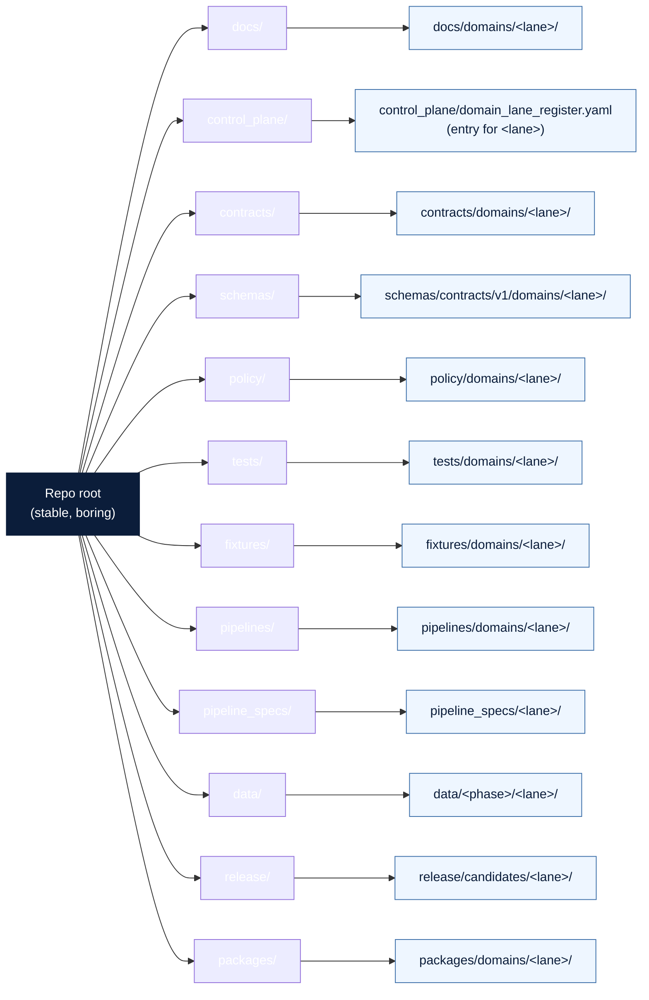

<!-- [KFM_META_BLOCK_V2]
doc_id: kfm://doc/registers/domain-lane
title: Domain Lane Register
type: standard
version: v0.1
status: draft
owners: Docs steward + subsystem owners (placeholder, NEEDS VERIFICATION)
created: 2026-05-12
updated: 2026-05-12
policy_label: public
related:
  - docs/doctrine/directory-rules.md
  - docs/registers/AUTHORITY_LADDER.md
  - docs/registers/OBJECT_FAMILY_MAP.md
  - docs/registers/DRIFT_REGISTER.md
  - docs/registers/VERIFICATION_BACKLOG.md
  - control_plane/domain_lane_register.yaml
tags: [kfm, governance, register, domain-lane, directory-rules]
notes:
  - Companion human-facing index to control_plane/domain_lane_register.yaml.
  - All specific paths are PROPOSED until verified against mounted-repo evidence.
[/KFM_META_BLOCK_V2] -->

# Domain Lane Register

> **The canonical, human-facing index of KFM domain lanes — what each lane owns, where its responsibility roots route to, and what governance posture it carries by default.**


| Field | Value |
|---|---|
| **Document type** | Governance register (human-facing) |
| **Authority of these rules** | CONFIRMED — canonical index of KFM domain lanes |
| **Authority of specific paths in this register** | PROPOSED — confirmed only against mounted-repo evidence |
| **Companion machine register** | `control_plane/domain_lane_register.yaml` (PROPOSED) |
| **Doctrinal anchor** | `docs/doctrine/directory-rules.md` §§3–5, §12 |
| **Atlas evidence** | KFM Domains Culmination Atlas v1.1 §24.13 (Atlas ↔ Dossier ↔ Responsibility-Root Crosswalk) |
| **Owner** | Docs steward + subsystem owners *(placeholder, NEEDS VERIFICATION)* |
| **Reviewers required for change** | Docs steward + at least one subsystem owner; ADR required to add, remove, rename, or re-home a domain lane |
| **Supersedes** | None (first edition) |
| **Last reviewed** | 2026-05-12 |

---

## Quick jump

- [1. Purpose](#1-purpose)
- [2. Authority and conformance](#2-authority-and-conformance)
- [3. Relation to the machine register](#3-relation-to-the-machine-register)
- [4. What is a domain lane](#4-what-is-a-domain-lane)
- [5. Lane-in-responsibility-root diagram](#5-lane-in-responsibility-root-diagram)
- [6. Canonical domain lane register](#6-canonical-domain-lane-register)
- [7. Cross-cutting and non-domain lanes](#7-cross-cutting-and-non-domain-lanes)
- [8. Responsibility-root pattern for any domain lane](#8-responsibility-root-pattern-for-any-domain-lane)
- [9. Sensitivity tier defaults per lane](#9-sensitivity-tier-defaults-per-lane)
- [10. Lane lifecycle phases reference](#10-lane-lifecycle-phases-reference)
- [11. Anti-patterns to watch for](#11-anti-patterns-to-watch-for)
- [12. Naming conflicts surfaced for ADR resolution](#12-naming-conflicts-surfaced-for-adr-resolution)
- [13. How to add, rename, or retire a domain lane](#13-how-to-add-rename-or-retire-a-domain-lane)
- [14. Open questions and NEEDS VERIFICATION](#14-open-questions-and-needs-verification)
- [15. Related docs](#15-related-docs)

---

## 1. Purpose

This register is the **single human-facing index** of KFM domain lanes. It exists to make four things visible at a glance for any lane:

1. The lane's identity and one-line scope.
2. The source dossier(s) that supply its primary evidence.
3. The responsibility roots its files route into (per Directory Rules §12).
4. Its default sensitivity posture (per Atlas v1.1 §24.5 / §24.13).

> [!IMPORTANT]
> This register is a **navigational aid**. It does not substitute for `EvidenceBundle`, source authority, review state, policy decisions, or release state. Per Atlas v1.1 doctrine, summaries, tables, registers, and master atlases **never** stand in for evidence. (See §11.)

Existence of a lane is decided by Atlas chapters, source dossiers, ADRs, and reviews. Placement is decided by Directory Rules. This register only records what already has standing.

---

## 2. Authority and conformance

### 2.1 Authority order

When the contents of this register conflict with another source, resolve in this order — adapted from `directory-rules.md` §2.1:

1. KFM core invariants and doctrine.
2. Accepted ADRs that explicitly amend domain-lane membership or naming.
3. `docs/doctrine/directory-rules.md` (especially §3–§5 and §12).
4. KFM Domains Culmination Atlas v1.1 §24.13 (and §24.5 for sensitivity defaults).
5. **This register.**
6. Per-lane README files under `docs/domains/<lane>/` *(PROPOSED home; NEEDS VERIFICATION)*.
7. Domain dossiers and prior architecture reports — lineage / PROPOSED only.
8. Convention in the current mounted repo. When it conflicts, raise a `docs/registers/DRIFT_REGISTER.md` entry, not new canon.

### 2.2 What this register does not do

- It does **not** create or remove a domain lane. That is an ADR-class change per Directory Rules §2.4.
- It does **not** decide schema-home, policy-home, or release rules. Those live in `schemas/`, `policy/`, and `release/` under their own governance.
- It does **not** publish anything. Public surfaces consume governed APIs over canonical stores.

### 2.3 Conformance rule

Any PR that touches a domain-lane segment (e.g., `data/processed/<lane>/`, `schemas/contracts/v1/domains/<lane>/`, `policy/domains/<lane>/`) MUST cite **either** this register's row **or** Directory Rules §12 in the PR description.

[↑ Back to top](#quick-jump)

---

## 3. Relation to the machine register

This Markdown register is paired with a machine-readable register at:

```text
control_plane/domain_lane_register.yaml
```

The pairing roles, per Directory Rules §6.2:

| Surface | Role | Audience |
|---|---|---|
| `docs/registers/DOMAIN_LANE.md` *(this file)* | **Human-facing** narrative index of domain lanes | Reviewers, contributors, stewards |
| `control_plane/domain_lane_register.yaml` *(PROPOSED home; NEEDS VERIFICATION)* | **Machine-readable** "what governs what" register consumed by validators and CI | Tooling, validators, CI gates |

> [!NOTE]
> When the two registers disagree, the **machine register is canonical for validation** and **this register is canonical for narrative meaning**. A mismatch is a `DRIFT_REGISTER` entry, not a silent fix. The two MUST be kept in sync per `directory-rules.md` §6.2.

[↑ Back to top](#quick-jump)

---

## 4. What is a domain lane

**CONFIRMED doctrine** (Directory Rules §12; Atlas v1.1 §24.13):

A **domain lane** is a *bounded responsibility area inside shared KFM governance*. A lane MAY define its own object families, source roles, validators, policy gates, pipelines, catalog entries, graph edges, UI layers, Evidence Drawer payloads, and Focus Mode constraints. A lane MUST NOT own root-folder authority, global schema-home decisions, publication law, or public bypasses around governed APIs.

> [!WARNING]
> **Domain Placement Law (Directory Rules §12):** A domain MUST NOT become a root folder. Hydrology, soil, fauna, flora, habitat, geology, atmosphere, roads-rail-trade, settlements-infrastructure, archaeology, hazards, agriculture, and people-dna-land all live as **segments** inside responsibility roots — never as `hydrology/`, `archaeology/`, or `people/` at the repo root.

The canonical placement pattern is in [§8](#8-responsibility-root-pattern-for-any-domain-lane).

[↑ Back to top](#quick-jump)

---

## 5. Lane-in-responsibility-root diagram

The diagram below shows how a single domain segment (e.g., `<lane>`) appears as a segment under each owning responsibility root. Roots are stable; the lane is the moving variable.



> [!NOTE]
> **NEEDS VERIFICATION:** The diagram reflects Directory Rules §5, §6, and §12 doctrine. Per-root presence in the current mounted repo is PROPOSED until inspection confirms it.

[↑ Back to top](#quick-jump)

---

## 6. Canonical domain lane register

**CONFIRMED domain set** (Directory Rules §12; Atlas v1.1 chapters 4–16): the 13 domain lanes below are the canonical KFM domains. Adding, renaming, removing, or merging any lane is an ADR-class change.

| # | Lane id | One-line scope | Source dossier(s) | Default sensitivity posture | Notes |
|---|---|---|---|---|---|
| 1 | `hydrology` | Watersheds, streamflow, regulatory flood zones, surface and groundwater context. | DOM-HYD | T0 most products; NFHL clearly labeled as regulatory, not observed. | Early proof lane (Atlas roadmap phase 5). |
| 2 | `soil` | Soil map units, components, properties; agriculture/hydrology adjacency. | DOM-SOIL (with DOM-AG, DOM-HYD) | T0 most products. | Support-type separation required per dossier. |
| 3 | `habitat` | Habitat patches, ecological systems; pairs with Fauna under thin-slice plan. | DOM-HAB (with DOM-HF) | T0 mostly; T1 for stewardship zones. | — |
| 4 | `fauna` | Species occurrences, ranges, sensitive-occurrence handling. | DOM-FAUNA (with DOM-HF) | T4 default for sensitive occurrences; T1 generalized derivative. | Sensitive-occurrence lane; geoprivacy mandatory. |
| 5 | `flora` | Vegetation, rare/protected plants, ethnobotanical context. | DOM-FLORA | T4 default for rare/culturally sensitive locations; T1 generalized derivative. | Rare-plant lane. |
| 6 | `agriculture` | Crop, yield, producer-adjacent context with privacy. | DOM-AG | T0 (aggregate) / T1 (field candidate); private joins denied by default. | Aggregation receipts central. |
| 7 | `geology` | Lithology, geologic units, mineral occurrences, resource estimates. | DOM-GEOL | T0 most products; T2 for resource detail in sensitive contexts. | Subsurface / resource-estimate contexts. |
| 8 | `atmosphere` | Weather observations, climate normals, air quality. | DOM-AIR | T0. | Source-role anti-collapse for observed / regulatory / modeled / aggregate is acute. |
| 9 | `hazards` | Hazard events, observations, warning context, disaster declarations. | DOM-HAZ | T0 for cited context; **T4 forever** for KFM-as-alert-authority. | KFM is **never** an emergency-alert authority. |
| 10 | `roads-rail-trade` | Road / rail segments, corridor routes, network identity. | DOM-ROADS | T0 mostly; T2/T4 for sensitive condition detail. | Network identity governance. |
| 11 | `settlements-infrastructure` | Settlements, municipalities, townsites, infrastructure assets. | DOM-SETTLE | T0 for settlements; T4 default for critical asset detail; T1 generalized footprint. | Critical-asset deny lane. |
| 12 | `archaeology` | Archaeological sites, cultural temporal periods, survey records. | DOM-ARCH | T4 default for site coords; T4 forever for human remains / sacred sites; T1 generalized only after steward + cultural review. | Sovereignty review path. |
| 13 | `people-dna-land` | Person assertions, life events, genealogy, DNA evidence, land parcels. | DOM-PEOPLE | T4 default for living-person fields, DNA segments, private person-parcel joins; aggregate T0/T1 only after AggregationReceipt. | Consent and policy review mandatory. |

> [!CAUTION]
> **Sensitivity defaults are doctrine, not preference.** Lowering a lane's default tier (e.g., T4 → T1) requires the artifacts and reviewers named in Atlas v1.1 §24.5.3 (RedactionReceipt / AggregationReceipt / PolicyDecision / ReviewRecord, with appropriate steward sign-off). Defaults are PROPOSED in Atlas v1.1 and become CONFIRMED only via ADR-S-05 (Atlas v1.1 §24.12).

[↑ Back to top](#quick-jump)

---

## 7. Cross-cutting and non-domain lanes

**CONFIRMED doctrine** (Atlas v1.1 §24.13, Atlas chapters 3, 17, 18, 19): three additional bounded areas are lane-shaped but **are not domain lanes** in the Directory Rules §12 sense. They are listed here for crosswalk completeness and to discourage accidental treatment as domains.

| Area | Atlas chapter | Lane id (PROPOSED) | What it owns | What it does **not** own |
|---|---|---|---|---|
| Spatial Foundation | 3 | `spatial` | Coordinate reference profiles, geography versions, geometry validity, base layers, generalization, map style rules. | Hydrology, soil, geology, hazards, transport, settlements, archaeology, people, habitat, fauna, flora, agriculture, or atmosphere truth. |
| Frontier Matrix | 17 | `matrix` (Atlas §24.13) | Frontier definitions, geography versions, county-year panels, matrix-cell release rules. | Any individual domain's source truth. |
| Planetary / 3D / Digital Twin / Synthetic | 18 | `scene` (Atlas §24.13) | Scene manifests, terrain models, 3D tilesets, glTF assets, point clouds, digital twin views, synthetic surfaces. | Truth — Cesium / 3D is an alternate renderer, never an alternate truth path. |
| Cross-Domain Systems | 19 | n/a | MapLibre, governed AI, governed API, master atlases, doctrine indexes. | Any single domain. |

> [!NOTE]
> **NEEDS VERIFICATION:** Lane ids `spatial`, `matrix`, and `scene` are taken from Atlas v1.1 §24.13. They are PROPOSED until ADR confirms whether they appear in `control_plane/domain_lane_register.yaml` alongside the 13 domain lanes or in a separate `cross_cutting_lane_register.yaml`. See [§14](#14-open-questions-and-needs-verification).

[↑ Back to top](#quick-jump)

---

## 8. Responsibility-root pattern for any domain lane

**CONFIRMED doctrine** (Directory Rules §12). For any domain lane `<lane>` from [§6](#6-canonical-domain-lane-register), the lane appears as a **segment** inside the following responsibility roots. The roots are canonical; the segment moves.

```text
docs/domains/<lane>/
contracts/domains/<lane>/
schemas/contracts/v1/domains/<lane>/
policy/domains/<lane>/
tests/domains/<lane>/
fixtures/domains/<lane>/
packages/domains/<lane>/
pipelines/domains/<lane>/
pipeline_specs/<lane>/
data/raw/<lane>/
data/work/<lane>/
data/quarantine/<lane>/
data/processed/<lane>/
data/catalog/domain/<lane>/
data/published/layers/<lane>/
data/registry/sources/<lane>/
release/candidates/<lane>/
```

> [!IMPORTANT]
> **PROPOSED** status applies to the *specific repo's presence* of these paths. Every path above is canonical-by-rule; whether the current mounted repo materializes any one of them is PROPOSED until inspected. This mirrors Directory Rules §0 and §5.

### 8.1 Sensitivity- and consent-aware segments

Two lanes carry extra policy segments per Atlas v1.1 §24.13:

| Lane | Extra segments (PROPOSED) | Reason |
|---|---|---|
| `fauna` | `policy/sensitivity/fauna/` | Sensitive-occurrence redaction rules. |
| `flora` | `policy/sensitivity/flora/` | Rare-plant location redaction. |
| `hazards` | `policy/release/hazards/` | KFM-is-never-an-alert-authority release gate. |
| `settlements-infrastructure` | `policy/sensitivity/infrastructure/` | Critical-asset deny lane. |
| `archaeology` | `policy/sensitivity/archaeology/` | Sovereignty / cultural review. |
| `people-dna-land` | `policy/sensitivity/people/`, `policy/consent/people/` | Living-person / DNA / consent governance. |

### 8.2 Cross-lane and multi-domain files

Per `directory-rules.md` §12 — when a file legitimately spans two or more domain lanes (e.g., a habitat × fauna × hydrology validator):

- Place it at the **lowest common responsibility root** that owns its responsibility, **without** a domain segment.
- Example — shared validator: `tools/validators/<topic>/...`, not `tools/validators/domains/<one-picked-domain>/...`.
- Example — cross-domain doctrine: `docs/architecture/<topic>.md`, not under `docs/domains/<one-picked-domain>/`.

[↑ Back to top](#quick-jump)

---

## 9. Sensitivity tier defaults per lane

**CONFIRMED tier scheme** (Atlas v1.1 §24.5.1): T0 Open · T1 Generalized · T2 Reviewer · T3 Restricted · T4 Denied.

The table below consolidates per-lane **defaults** from Atlas v1.1 §24.5.2 and §20.5. Defaults are PROPOSED in Atlas v1.1 (pending ADR-S-05) and become CONFIRMED only when that ADR is accepted.

| Lane | Default tier (PROPOSED) | Strictest deny-by-default | Allowed transforms to lower tier |
|---|---|---|---|
| `hydrology` | T0 | — | n/a |
| `soil` | T0 | — | n/a |
| `habitat` | T0 (T1 for stewardship zones) | — | n/a |
| `fauna` | T4 for sensitive occurrence; T1 for range polygon | Sensitive occurrence, nests/dens/roosts/hibernacula/spawning | Geoprivacy generalization + RedactionReceipt → T1 |
| `flora` | T4 for rare/protected/culturally sensitive; T0 for general | Rare/protected/culturally sensitive plant location | Generalized geometry + steward review → T2 or T1 |
| `agriculture` | T0 (aggregate) / T1 (field candidate) | Private person-parcel joins | Aggregation by tract/county + AggregationReceipt → T1 |
| `geology` | T0 (T2 for sensitive resource detail) | — | Aggregation; steward review |
| `atmosphere` | T0 | KFM-as-life-safety-instruction | Not permitted |
| `hazards` | T0 (for cited context) | **T4 forever** for KFM-as-alert-authority | Boundary holds — no transform |
| `roads-rail-trade` | T0 (T2/T4 for sensitive condition detail) | — | Generalization where applicable |
| `settlements-infrastructure` | T0 (T4 for critical asset detail) | Critical assets, dependencies, condition detail | Generalized facility footprint + RedactionReceipt → T1; T3 to named authorities only |
| `archaeology` | T4 for site coords; **T4 forever** for human remains / sacred sites | Exact sites, burial, human remains, sacred sites, looting-risk detail | Steward review + cultural review + generalized geometry (coarse cell) + RedactionReceipt → T2 or T1 |
| `people-dna-land` | T4 for living-person, DNA segments, private person-parcel joins | Living-person private output, raw DNA ids, DNA segments | Aggregation + AggregationReceipt → T1; named consent + ReviewRecord + PolicyDecision (other paths) |

> [!CAUTION]
> **T4-forever rules carry no transform path.** Hazards (KFM as alert authority), archaeology (human remains / sacred sites), and the AI surface's access to RAW/WORK are denied at the doctrine layer — no redaction, aggregation, or steward sign-off promotes them. See Atlas v1.1 §24.5.2.

[↑ Back to top](#quick-jump)

---

## 10. Lane lifecycle phases reference

**CONFIRMED invariant** (Directory Rules §0; Atlas v1.1 §24.6): every domain lane follows the same lifecycle.

```text
RAW → WORK / QUARANTINE → PROCESSED → CATALOG / TRIPLET → PUBLISHED
```

| Phase | Lane-segment home (PROPOSED) | Gate to advance |
|---|---|---|
| RAW | `data/raw/<lane>/` | `SourceDescriptor` exists; rights, role, cadence recorded. |
| WORK / QUARANTINE | `data/work/<lane>/`, `data/quarantine/<lane>/` | Schema, geometry, time, identity, evidence, rights, and policy normalization pass — or quarantine reason is recorded. |
| PROCESSED | `data/processed/<lane>/` | `EvidenceRef`, `ValidationReport`, and digest closure exist. |
| CATALOG / TRIPLET | `data/catalog/domain/<lane>/`, `data/triplets/<lane>/` *(NEEDS VERIFICATION: `triplets/` vs. `triplet/` — directory-rules.md §18)* | Catalog/proof closure passes; `EvidenceBundle` resolves. |
| PUBLISHED | `data/published/layers/<lane>/` (assets); `release/candidates/<lane>/` → `release/manifests/` (decision) | `ReleaseManifest` signed; policy gates pass; rollback target exists. |

> [!IMPORTANT]
> **Promotion is a governed state transition, not a file move.** Moving a file from `data/work/<lane>/` to `data/processed/<lane>/` without the corresponding receipts, validation reports, and policy decisions is drift, not advancement.

[↑ Back to top](#quick-jump)

---

## 11. Anti-patterns to watch for

These anti-patterns are the most common ways a domain lane drifts out of its responsibility root. Catch them at review.

<details>
<summary><strong>Anti-pattern A — Domain promoted to a root folder</strong></summary>

> **Symptom:** A repo-root folder named `hydrology/`, `archaeology/`, `people/`, etc., containing its own `data/`, `schemas/`, `policy/`, `docs/`.
>
> **Why it harms:** Collapses governance boundaries; responsibility root becomes the topic name; lifecycle invariants fragment across the repo.
>
> **Fix:** Migrate to the lane pattern in [§8](#8-responsibility-root-pattern-for-any-domain-lane). File a `DRIFT_REGISTER` entry; create an ADR if the root cannot be retired immediately.

</details>

<details>
<summary><strong>Anti-pattern B — Domain validator placed inside a single domain lane</strong></summary>

> **Symptom:** A shared validator that legitimately spans multiple domains (e.g., habitat × fauna × hydrology geometry validator) lives at `tools/validators/domains/<one-picked-domain>/`.
>
> **Fix:** Move it to the lowest common responsibility root, **without** a domain segment: `tools/validators/<topic>/...`. See [§8.2](#82-cross-lane-and-multi-domain-files).

</details>

<details>
<summary><strong>Anti-pattern C — Sensitivity defaults silently relaxed</strong></summary>

> **Symptom:** A `fauna` or `archaeology` layer is published at T0 without a RedactionReceipt + ReviewRecord + PolicyDecision; the lane README quietly says "public-safe."
>
> **Fix:** Revert publication; require the artifacts named in Atlas v1.1 §24.5.3. File a `DRIFT_REGISTER` entry. The lane README is not authority to override the tier matrix.

</details>

<details>
<summary><strong>Anti-pattern D — Lane Markdown register substituted for evidence</strong></summary>

> **Symptom:** A consumer (UI, AI, downstream lane) reads this register or `control_plane/domain_lane_register.yaml` and treats a row as proof of source authority, review state, or release state.
>
> **Fix:** Per Atlas v1.1 non-collapse rule, registers are navigational. Re-route the consumer to `EvidenceBundle` and the governed API.

</details>

<details>
<summary><strong>Anti-pattern E — Hazards lane used as an emergency-alert authority</strong></summary>

> **Symptom:** A UI surface, AI answer, or export presents KFM as the operational alert authority for a flood, fire, tornado, or other life-safety event.
>
> **Fix:** Deny at runtime. KFM is **never** an alert authority (Atlas v1.1 §24.5.2; this is a T4-forever boundary). Redirect users to the appropriate official source.

</details>

[↑ Back to top](#quick-jump)

---

## 12. Naming conflicts surfaced for ADR resolution

Per Directory Rules §2.1, lower-tier sources may not silently override higher-tier ones. The conflicts below are surfaced here — **not smoothed** — for resolution by ADR or migration note.

| # | Conflict | Directory Rules §12 form | Atlas v1.1 §24.13 form | PROPOSED resolution |
|---|---|---|---|---|
| C-1 | Transport lane id | `roads-rail-trade` | `transport` (paths use `schemas/contracts/v1/transport/`) | ADR required to choose canonical id; this register uses Directory Rules form pending ADR. |
| C-2 | Settlements lane id | `settlements-infrastructure` | `settlement` (paths use `schemas/contracts/v1/settlement/`) | ADR required to choose canonical id. |
| C-3 | Planetary/3D lane id | n/a (cross-cutting; not in §12) | `scene` (paths use `schemas/contracts/v1/scene/`) | ADR required to confirm `scene` as the lane id and whether it sits in `control_plane/domain_lane_register.yaml` or a sibling register. |
| C-4 | Atmosphere/Air lane id | `atmosphere` | `air` (paths use `schemas/contracts/v1/air/`) | ADR required; this register uses `atmosphere` per §12. |
| C-5 | Per-domain contracts placement | `contracts/domains/<domain>/` | `contracts/<domain>/` (no `domains/` segment) | Directory Rules wins (§2.1); Atlas-form paths are lineage / migration targets. |

> [!NOTE]
> All five conflicts above are PROPOSED for resolution under the Atlas v1.1 §24.12 Open-ADR Backlog discipline. None can be resolved silently in this register.

[↑ Back to top](#quick-jump)

---

## 13. How to add, rename, or retire a domain lane

| Change type | Required artifacts |
|---|---|
| Add a new domain lane | ADR (Directory Rules §2.4); update to this register; update to `control_plane/domain_lane_register.yaml`; per-lane `docs/domains/<lane>/README.md`; placement of segments in every applicable responsibility root from [§8](#8-responsibility-root-pattern-for-any-domain-lane); sensitivity-tier entry per Atlas v1.1 §24.5. |
| Rename a domain lane | ADR; migration plan in `migrations/`; transition window with both names recorded; `DRIFT_REGISTER` entry; rollback path. |
| Retire / merge a domain lane | ADR; supersession notice in Atlas successor edition; preserved as lineage under `docs/archive/`; `DRIFT_REGISTER` entry. |
| Adjust default sensitivity tier | ADR-S-05 (per Atlas v1.1 §24.12); update to §9 of this register; update to `policy/sensitivity/<lane>/`. |
| Adjust responsibility-root segments | Directory Rules amendment (§17); ADR if a new canonical root is implied. |

> [!TIP]
> Every PR that touches this register MUST cite the rule that justifies it — either a Directory Rules section, an ADR, or an Atlas v1.1 §24.13 row.

[↑ Back to top](#quick-jump)

---

## 14. Open questions and NEEDS VERIFICATION

These items are explicitly **not resolved** by this register and SHOULD be tracked in `docs/registers/VERIFICATION_BACKLOG.md`:

- **NEEDS VERIFICATION:** Whether `control_plane/domain_lane_register.yaml` exists in the mounted repo, and what its current schema looks like. Per Directory Rules §6.2 it is canonical-by-rule; per-repo presence is PROPOSED.
- **NEEDS VERIFICATION:** Whether per-lane README files live at `docs/domains/<lane>/README.md` in the mounted repo. PROPOSED home; unverified.
- **OPEN (ADR-S-05):** Adoption of the T0–T4 tier scheme as canonical (Atlas v1.1 §24.12). Until accepted, [§9](#9-sensitivity-tier-defaults-per-lane) defaults remain PROPOSED.
- **OPEN:** Lane id reconciliation — conflicts C-1 through C-4 in [§12](#12-naming-conflicts-surfaced-for-adr-resolution).
- **OPEN:** Whether cross-cutting lanes (`spatial`, `matrix`, `scene`) appear in `control_plane/domain_lane_register.yaml` or in a sibling register (e.g., `control_plane/cross_cutting_lane_register.yaml`).
- **OPEN:** Whether `data/triplets/<lane>/` (plural) or `data/triplet/<lane>/` (singular) is the chosen form. Directory Rules §18 currently uses plural; ADR pending.
- **OPEN:** Whether `tests/domains/<lane>/` is the canonical home for lane-bound tests or whether all tests share a flatter `tests/<topic>/` structure. Directory Rules §12 implies the former; not verified in repo.

[↑ Back to top](#quick-jump)

---

## 15. Related docs

- `docs/doctrine/directory-rules.md` — placement law (especially §§3–5, §12, §17).
- `docs/registers/AUTHORITY_LADDER.md` *(PROPOSED)* — authority order across doctrine, repo, source, runtime.
- `docs/registers/OBJECT_FAMILY_MAP.md` *(PROPOSED)* — object families per lane; pairs with this register.
- `docs/registers/DRIFT_REGISTER.md` *(PROPOSED)* — drift entries for lane / placement / tier mismatches.
- `docs/registers/VERIFICATION_BACKLOG.md` *(PROPOSED)* — unresolved verification items.
- `docs/registers/CANONICAL_LINEAGE_EXPLORATORY.md` *(PROPOSED)* — lineage classification for prior dossiers.
- `docs/adr/ADR-0001-schema-home.md` — schema-home convention.
- `docs/atlases/` *(PROPOSED home)* — KFM Domains Culmination Atlas v1.1 (this register's primary doctrinal anchor for §§6, 7, 9, 12).
- `control_plane/domain_lane_register.yaml` — machine-readable companion register.

---

> **Last reviewed:** 2026-05-12  ·  **Version:** v0.1 (draft)  ·  **Owner:** Docs steward + subsystem owners *(placeholder, NEEDS VERIFICATION)*
>
> [↑ Back to top](#quick-jump)
