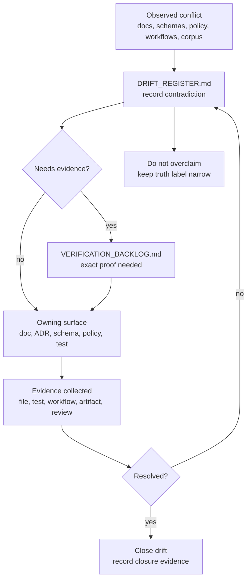

<!-- [KFM_META_BLOCK_V2]
doc_id: TODO-NEEDS-DOC-ID
title: Drift Register
type: standard
version: v1
status: draft
owners: TODO-NEEDS-CODEOWNERS-VERIFICATION
created: TODO-NEEDS-GIT-HISTORY-VERIFICATION
updated: 2026-04-28
policy_label: TODO-NEEDS-POLICY-LABEL-VERIFICATION
related: [docs/registers/README.md, docs/registers/VERIFICATION_BACKLOG.md, docs/registers/CANONICAL_LINEAGE_EXPLORATORY.md]
tags: [kfm, documentation-control, register, drift, governance]
notes: [Expanded from thin public-main register; doc_id, owners, created date, and policy label require verification.]
[/KFM_META_BLOCK_V2] -->

<a id="top"></a>

# Drift Register

Tracks contradictions, naming splits, overclaims, authority ambiguity, and repo/corpus drift across KFM documentation and implementation-facing surfaces.


> [!IMPORTANT]
> **Status:** `draft`  
> **Owners:** `TODO-NEEDS-CODEOWNERS-VERIFICATION`  
> **Path:** `docs/registers/DRIFT_REGISTER.md`  
> **Repo fit:** sibling register under [`docs/registers/`](README.md), paired with [`VERIFICATION_BACKLOG.md`](VERIFICATION_BACKLOG.md) and [`CANONICAL_LINEAGE_EXPLORATORY.md`](CANONICAL_LINEAGE_EXPLORATORY.md)  
> **Current drafting boundary:** this revision preserves the existing register entries but upgrades the file into a maintained governance surface. Active branch ownership, policy label, `doc_id`, creation date, and full sibling-file coverage remain `NEEDS VERIFICATION`.  
> **Quick jumps:** [Scope](#scope) · [Repo fit](#repo-fit) · [Accepted inputs](#accepted-inputs) · [Exclusions](#exclusions) · [Evidence snapshot](#evidence-snapshot) · [Status model](#status-model) · [Active drift](#active-drift-at-a-glance) · [Entries](#drift-entries) · [Workflow](#workflow) · [Diagram](#diagram) · [Validation](#validation) · [Definition of done](#definition-of-done) · [Appendix](#appendix)

---

## Scope

This register records **meaningful drift**: places where KFM source material, repo-facing docs, implementation evidence, naming, ownership, or maturity signals do not yet line up.

A drift item belongs here when it could cause a maintainer, contributor, reviewer, steward, or public-facing surface to overstate what KFM knows, owns, enforces, publishes, or has implemented.

This file is intentionally narrow. It does **not** replace the authority ladder, canon register, verification backlog, ADRs, policy rules, schemas, release manifests, or tests. It routes contradictions toward the right resolution surface.

### Drift is not blame

KFM treats visible disagreement as useful control-plane evidence. A drift entry means:

- a claim needs a clearer source boundary,
- a doc needs a successor or correction,
- a name/path is drifting,
- a proposed object family needs executable proof,
- or a maturity signal needs verification before stronger wording is allowed.

[Back to top](#top)

---

## Repo fit

| Relationship | Surface | Use |
|---|---|---|
| Parent directory | [`docs/registers/`](README.md) | Register landing page and local operating rules. |
| Verification partner | [`VERIFICATION_BACKLOG.md`](VERIFICATION_BACKLOG.md) | Converts drift into exact evidence needed before closure. |
| Authority partner | `AUTHORITY_LADDER.md` | Expected sibling for source-order rules; `NEEDS VERIFICATION` because public-main availability was not confirmed in this drafting pass. |
| Canon partner | [`CANONICAL_LINEAGE_EXPLORATORY.md`](CANONICAL_LINEAGE_EXPLORATORY.md) | Classifies source/document families before they are cited as governing. |
| Upstream docs hub | [`../README.md`](../README.md) | Documentation control-plane entry point. |
| Downstream resolution surfaces | `docs/adr/`, `docs/architecture/`, `contracts/`, `schemas/`, `policy/`, `tests/fixtures/`, `release/` | Candidate homes for fixes after drift is understood and verified. |

> [!WARNING]
> Do not close a drift item merely because a newer document sounds more polished. Closure requires concrete evidence, review, and an update to any linked backlog item or ADR.

[Back to top](#top)

---

## Accepted inputs

| Accepted input | Belongs here when… | Typical next surface |
|---|---|---|
| Documentation contradiction | Two docs imply different path, maturity, authority, or policy posture. | This register → `VERIFICATION_BACKLOG.md` → owning doc. |
| Naming/path drift | A README, schema, test, workflow, or runbook references a path/name that may not match the active tree. | This register → verification backlog → rename note or ADR. |
| Maturity overclaim | A document implies enforcement, runtime behavior, release state, workflow coverage, or implementation depth without direct proof. | This register → verification backlog → tests/workflows/proof artifacts. |
| Authority ambiguity | Canon, lineage, exploratory, reference, or superseded material could be mistaken for peer authority. | `CANONICAL_LINEAGE_EXPLORATORY.md` and the expected authority ladder. |
| Contract/schema/policy split | A concern spans `contracts/`, `schemas/`, `policy/`, fixtures, and docs without a settled home. | ADR plus affected parent READMEs. |
| Register-maintenance drift | A register has placeholders, stale owners, broken links, or unsupported closure language. | This register plus `VERIFICATION_BACKLOG.md`. |

---

## Exclusions

| Do not put here | Why not | Put it instead |
|---|---|---|
| Full doctrine rewrites | This register records conflicts; it does not become the canon spine. | `docs/doctrine/` or `docs/architecture/` after verification. |
| ADR decisions | Drift can motivate an ADR, but the ADR records the decision. | `docs/adr/`. |
| Source descriptors | Drift may identify source-role confusion, but descriptors need fields, rights, cadence, and steward review. | `docs/sources/` or `data/registry/` after repo convention verification. |
| Machine schemas | Drift may identify schema-home ambiguity, but schemas do not live in this register. | `schemas/` or `contracts/` after ADR resolution. |
| Policy rules | This file can record policy/document drift; it does not enforce policy. | `policy/`. |
| Fixtures and proof packs | This file can request fixture/proof evidence; it does not store emitted evidence. | `tests/fixtures/`, `data/proofs/`, `data/receipts/`, or `release/`. |
| Vague TODOs | Drift entries must name a concrete conflict, risk, and next evidence step. | `VERIFICATION_BACKLOG.md` only after the verification item is specific. |

[Back to top](#top)

---

## Evidence snapshot

| Evidence surface | Current status | How this register uses it |
|---|---:|---|
| Existing `docs/registers/DRIFT_REGISTER.md` | `CONFIRMED` thin baseline | Preserved original two drift concerns and expanded them into maintainable entries. |
| `docs/registers/README.md` | `CONFIRMED` adjacent convention | Uses its register map, accepted-inputs posture, and "record conflicts instead of flattening them" rule. |
| `docs/registers/VERIFICATION_BACKLOG.md` | `CONFIRMED` sibling | Keeps drift closure tied to exact evidence requirements. |
| `docs/registers/CANONICAL_LINEAGE_EXPLORATORY.md` | `CONFIRMED` sibling | Keeps authority class separate from drift resolution. |
| `docs/registers/AUTHORITY_LADDER.md` | `NEEDS VERIFICATION` | Expected sibling named by local register conventions, but active-branch existence must be confirmed before linking. |
| Local drafting workspace | `CONFIRMED` no mounted checkout in this pass | Current branch state, CODEOWNERS, policy label, workflow enforcement, and emitted artifacts remain unverified here. |
| KFM doctrine corpus | `CONFIRMED` doctrine / `UNKNOWN` implementation depth | Supplies recurring drift themes: inspectable claims, proof objects, source status, schema-home ambiguity, trust membrane, and verification discipline. |

[Back to top](#top)

---

## Status model

| Status | Meaning | Allowed next moves |
|---|---|---|
| `OPEN` | Drift exists and has not yet been resolved. | Add verification item, assign owner, propose ADR/doc/test fix. |
| `IN_PROGRESS` | A fix is drafted but not verified as landed and reviewed. | Keep evidence current; do not close yet. |
| `REOPENED` | A prior closure or closure-like note is contradicted by newer evidence. | Reverify original closure evidence and update affected docs. |
| `WATCH` | Drift is plausible and important, but direct repo evidence is incomplete. | Create targeted verification item before broad remediation. |
| `RESOLVED` | Evidence and review show convergence. | Record closure evidence and date; keep row for audit. |
| `SUPERSEDED` | Drift item was replaced by a broader or clearer item. | Point to successor item. |
| `DEFERRED` | Real drift, but lower priority or blocked by inaccessible evidence. | Keep reason and revisit trigger. |

### Truth labels

| Truth label | Use in this register |
|---|---|
| `CONFIRMED` | Verified from direct repo evidence, public-main evidence, attached KFM doctrine, visible workspace evidence, generated artifact evidence, or command output. |
| `INFERRED` | Strongly grounded by project sources but not directly verified as implementation. |
| `PROPOSED` | Recommended structure, fix, or resolution not verified as current repo behavior. |
| `UNKNOWN` | Not verified strongly enough; do not imply certainty. |
| `NEEDS VERIFICATION` | Exact next evidence is required before stronger wording is allowed. |
| `CONFLICTED` | Sources, paths, terms, or authority claims appear unresolved and need explicit decision. |

[Back to top](#top)

---

## Active drift at a glance

| ID | Status | Area | Current truth | Linked verification | Next move |
|---|---:|---|---:|---|---|
| [`DRIFT-001`](#drift-001--register-coverage-and-sibling-file-completeness) | `REOPENED` | Register coverage | `CONFLICTED / NEEDS VERIFICATION` | `VB-003` | Verify or create expected sibling registers; update register README tree. |
| [`DRIFT-002`](#drift-002--register-metadata-placeholders) | `OPEN` | Metadata quality | `CONFIRMED` | `VB-001`, `VB-002` | Confirm owners and policy labels; update meta blocks consistently. |
| [`DRIFT-003`](#drift-003--drift-register-operability) | `IN_PROGRESS` | Register operability | `CONFIRMED baseline / PROPOSED expansion` | `VB-003` | Land this expanded register and run link/placeholder checks. |
| [`DRIFT-004`](#drift-004--schema-and-contract-authority-split) | `OPEN` | Schema/contract authority | `CONFLICTED / NEEDS VERIFICATION` | `NEEDS-BACKLOG-ITEM` | Resolve through schema-home ADR and parent README alignment. |
| [`DRIFT-005`](#drift-005--workflow-documentation-versus-enforcement-proof) | `OPEN` | Workflow evidence | `NEEDS VERIFICATION` | `VB-003` | Inventory workflow YAML, branch rules, and recent run evidence before enforcement claims. |
| [`DRIFT-006`](#drift-006--proof-object-language-versus-executable-definitions) | `WATCH` | Proof objects | `NEEDS VERIFICATION` | `NEEDS-BACKLOG-ITEM` | Map recurring proof-object names to schemas, fixtures, validators, or emitted artifacts. |

[Back to top](#top)

---

## Drift entries

### DRIFT-001 — Register coverage and sibling-file completeness

| Field | Value |
|---|---|
| Date opened | `2026-04-27` |
| Status | `REOPENED` |
| Area | Register coverage |
| Conflict summary | The original drift row said missing sibling register files were closed by adding initial register files. Adjacent register documentation names a broader sibling register surface, but active-branch coverage still needs verification before the drift item can remain closed. |
| Current truth | `CONFLICTED / NEEDS VERIFICATION` |
| Risk if ignored | Maintainers may assume the register control plane is complete when an expected sibling file, link target, or authority rule is still absent. |
| Owner | `TODO-NEEDS-CODEOWNERS-VERIFICATION` |
| Linked verification | `VB-003` |
| Next action | In a mounted checkout, run `find docs/registers -maxdepth 1 -type f | sort`; confirm expected sibling files; either create missing files or update [`README.md`](README.md) so the directory tree does not overstate coverage. |
| Closure evidence | File inventory from active branch, link-check result, and reviewer acknowledgement that register coverage is complete or intentionally narrowed. |

### DRIFT-002 — Register metadata placeholders

| Field | Value |
|---|---|
| Date opened | `2026-04-27` |
| Status | `OPEN` |
| Area | Metadata quality |
| Conflict summary | Register docs still contain placeholders for owners, policy labels, and related review routing. |
| Current truth | `CONFIRMED` |
| Risk if ignored | Ownership ambiguity delays review, escalation, policy classification, and correction of stale register entries. |
| Owner | `TODO-NEEDS-CODEOWNERS-VERIFICATION` |
| Linked verification | `VB-001`, `VB-002` |
| Next action | Confirm owning team in `.github/CODEOWNERS` or repo-native ownership source; confirm approved policy label source; update all `docs/registers/*.md` meta blocks consistently. |
| Closure evidence | CODEOWNERS or stewardship evidence, policy-label evidence, updated metadata blocks, and linked backlog closure. |

### DRIFT-003 — Drift register operability

| Field | Value |
|---|---|
| Date opened | `2026-04-28` |
| Status | `IN_PROGRESS` |
| Area | Register operability |
| Conflict summary | The previous drift register was too thin to operate as a maintained governance surface: it lacked the required meta block, scope, status model, closure rules, evidence snapshot, backlinks, validation commands, and detailed entry structure. |
| Current truth | `CONFIRMED` for thin baseline; `PROPOSED` for this expanded structure until merged. |
| Risk if ignored | Drift rows become a passive list rather than a reviewable mechanism for preventing authority collision and overclaiming. |
| Owner | `TODO-NEEDS-CODEOWNERS-VERIFICATION` |
| Linked verification | `VB-003` |
| Next action | Replace the thin file with this expanded Markdown; run the validation checks below; update linked backlog item after review. |
| Closure evidence | Merged file, one-H1 check, link check, placeholder scan, and confirmation that the original DRIFT-001 and DRIFT-002 concerns were preserved. |

### DRIFT-004 — Schema and contract authority split

| Field | Value |
|---|---|
| Date opened | `2026-04-28` |
| Status | `OPEN` |
| Area | Schema/contract authority |
| Conflict summary | KFM doctrine and adjacent docs repeatedly flag ambiguity between `contracts/`, `schemas/`, and versioned schema/contract homes. The drift risk is not merely path naming; it affects which surface owns executable payload definitions and which surface owns human-readable interface guidance. |
| Current truth | `CONFLICTED / NEEDS VERIFICATION` |
| Risk if ignored | Duplicate or divergent definitions can make validators, fixtures, APIs, policy gates, and documentation disagree while appearing equally authoritative. |
| Owner | `TODO-NEEDS-SCHEMA-CONTRACT-OWNER` |
| Linked verification | `NEEDS-BACKLOG-ITEM` |
| Next action | Create or update a schema-home ADR; align parent READMEs; state whether each path is canonical, mirrored, legacy, or documentation-only. |
| Closure evidence | Accepted ADR, updated parent README files, schema/contract inventory, and fixture or validator evidence showing the chosen home is executable. |

### DRIFT-005 — Workflow documentation versus enforcement proof

| Field | Value |
|---|---|
| Date opened | `2026-04-28` |
| Status | `OPEN` |
| Area | Workflow evidence |
| Conflict summary | Documentation can name workflow families, checks, or validation expectations without proving that workflow YAML, required checks, branch protection, and recent runs enforce them in the active repository. |
| Current truth | `NEEDS VERIFICATION` |
| Risk if ignored | Docs may imply CI, policy, release, or verification enforcement that is not actually required or current. |
| Owner | `TODO-NEEDS-PLATFORM-OWNER` |
| Linked verification | `VB-003` |
| Next action | Inventory `.github/workflows/*.yml`, required checks, branch protection, and recent run evidence; distinguish historical workflow docs from active enforcement. |
| Closure evidence | Workflow file inventory, current run evidence, platform-setting evidence where needed, and updated docs that avoid overstating enforcement. |

### DRIFT-006 — Proof-object language versus executable definitions

| Field | Value |
|---|---|
| Date opened | `2026-04-28` |
| Status | `WATCH` |
| Area | Proof objects |
| Conflict summary | KFM doctrine repeatedly uses proof-object vocabulary such as `EvidenceBundle`, `EvidenceRef`, `SourceDescriptor`, `DecisionEnvelope`, `PolicyDecision`, `ReleaseManifest`, `ProofPack`, `RunReceipt`, and `CorrectionNotice`. The implementation-bearing home and executable status of those object families still need active repo proof. |
| Current truth | `NEEDS VERIFICATION` |
| Risk if ignored | Proof-object language can remain rhetorical instead of enforceable; downstream docs may cite object names without schemas, fixtures, validators, emitted artifacts, or tests. |
| Owner | `TODO-NEEDS-CONTRACT-PROOF-OBJECT-OWNER` |
| Linked verification | `NEEDS-BACKLOG-ITEM` |
| Next action | Map each proof-object name to current schema, contract, fixture, validator, emitted artifact, or explicit `PROPOSED` placeholder. |
| Closure evidence | Object map, schema/contract references, fixture coverage, validator output, or emitted artifact evidence. |

[Back to top](#top)

---

## Candidate watchlist

These are not promoted to active drift entries until a mounted checkout or accepted source inventory confirms the conflict.

| Candidate | Why it may matter | Trigger to promote |
|---|---|---|
| Source descriptor standard versus registry reality | Source-role discipline is central to KFM, but registry placement must match active repo conventions. | Source registry or descriptor docs are inspected and conflict with doctrine or sibling docs. |
| Lineage archive coverage | Older manuals and generated passes should remain useful without becoming peer canon. | A lineage source is cited as canonical without successor status or archive pointer. |
| Domain burden flattening | Hydrology, archaeology, rare species, living-person/DNA, infrastructure, and hazards do not share the same release burden. | A README, schema, or UI rule applies one generic release standard to unlike lanes. |
| Public-release posture | Published/semi-public claims require release, proof, review, policy, rights, and correction evidence. | A doc says "published" without release manifest, catalog/proof closure, or review state. |
| Local exposure posture | Home firewall, reverse proxy, or VPN exposure requires deny-by-default boundaries and auditability. | A deployment doc implies public access without corresponding policy/security gate. |

---

## Workflow

1. **Detect** drift from docs, code, configs, tests, workflows, fixtures, source registries, emitted artifacts, or corpus updates.
2. **Record** the smallest accurate drift entry here.
3. **Label** the current truth with the narrowest truthful label.
4. **Link** to a verification backlog item when evidence is required.
5. **Route** the fix to the right surface: ADR, README, schema, contract, policy, fixture, workflow, runbook, release artifact, or source registry.
6. **Validate** with direct evidence.
7. **Close** only after evidence and review show convergence.

### Closure rule

A drift item can close only when all of the following are true:

- the conflict summary is no longer true or has been intentionally superseded,
- the closure evidence is concrete and inspectable,
- linked verification backlog items are updated,
- adjacent docs or references are corrected,
- no public-facing claim is upgraded without direct evidence,
- and a reviewer confirms the resolution or ADR.

[Back to top](#top)

---

## Diagram



[Back to top](#top)

---

## Validation

Run these checks in the active mounted checkout before marking this file ready for stronger claims.

```bash
# Confirm branch-local state first.
git status --short
git branch --show-current

# Inspect the register surface.
find docs/registers -maxdepth 1 -type f | sort

# Confirm this file has exactly one H1.
grep -n '^# ' docs/registers/DRIFT_REGISTER.md

# Find unresolved placeholders and truth-label pressure points.
grep -RInE 'TODO|NEEDS VERIFICATION|UNKNOWN|CONFLICTED|PROPOSED' docs/registers || true

# Confirm linked sibling docs exist before keeping relative links active.
test -f docs/registers/README.md
test -f docs/registers/VERIFICATION_BACKLOG.md
test -f docs/registers/CANONICAL_LINEAGE_EXPLORATORY.md
test -f docs/registers/DRIFT_REGISTER.md
```

> [!NOTE]
> Replace these shell checks with the repo-native documentation validator when its entry point is verified.

[Back to top](#top)

---

## Definition of done

This register is ready for promotion from draft only when:

- [ ] `doc_id` is assigned or intentionally reserved by the repo-native document registry.
- [ ] `owners` is confirmed from CODEOWNERS or stewardship records.
- [ ] `created` date is confirmed from Git history or accepted as a documented placeholder.
- [ ] `policy_label` is confirmed from the repo-native policy classification source.
- [ ] All active drift entries have owners or explicit owner placeholders.
- [ ] Each open drift entry has a linked verification backlog item or a clear reason why one is not needed.
- [ ] DRIFT-001 through DRIFT-002 preserve the original register concerns.
- [ ] Any reopened item records why the prior closure language is no longer sufficient.
- [ ] Link checks pass from `docs/registers/DRIFT_REGISTER.md`.
- [ ] No entry treats corpus repetition as independent implementation proof.
- [ ] No entry claims workflow, runtime, schema, policy, release, dashboard, or branch-protection enforcement without direct evidence.
- [ ] Adjacent docs are updated when this register changes their stated directory map, closure state, or authority posture.

[Back to top](#top)

---

## Appendix

<details>
<summary>Entry template</summary>

```markdown
### DRIFT-### — <Short title>

| Field | Value |
|---|---|
| Date opened | `YYYY-MM-DD` |
| Status | `OPEN` |
| Area |  |
| Conflict summary |  |
| Current truth | `CONFIRMED` / `INFERRED` / `PROPOSED` / `UNKNOWN` / `NEEDS VERIFICATION` / `CONFLICTED` |
| Risk if ignored |  |
| Owner | `TODO-NEEDS-OWNER-VERIFICATION` |
| Linked verification | `VB-###` or `NEEDS-BACKLOG-ITEM` |
| Next action |  |
| Closure evidence |  |
```

</details>

<details>
<summary>Compact row template</summary>

```markdown
| DRIFT-### | OPEN | <Area> | <Current truth> | <Linked verification> | <Next move> |
```

</details>

<details>
<summary>Reviewer prompts</summary>

1. What exact claim would become false if the active repo is inspected?
2. Is this drift caused by a source conflict, path conflict, maturity overclaim, or ownership gap?
3. Is the current truth label narrow enough?
4. Does this entry need a verification backlog item?
5. Does resolution require an ADR, README update, schema/contract change, policy change, fixture, workflow update, or release/proof artifact?
6. Would closing this item hide unresolved uncertainty?
7. Did any public-facing claim become stronger without direct evidence?
8. Did the fix preserve the KFM trust membrane and cite-or-abstain posture?

</details>

[Back to top](#top)
