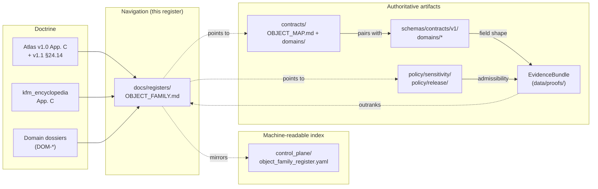
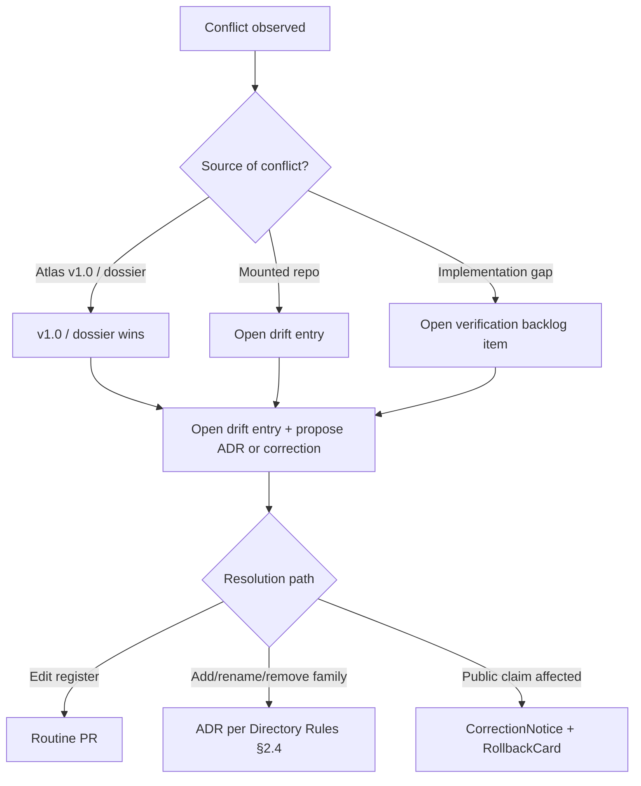

<!-- [KFM_META_BLOCK_V2]
doc_id: kfm://doc/registers/object-family
title: Object Family Register
type: standard
version: v1
status: draft
owners: docs-steward, domain-stewards
created: 2026-05-12
updated: 2026-05-12
policy_label: public
related: [docs/registers/AUTHORITY_LADDER.md, docs/registers/DRIFT_REGISTER.md, docs/registers/VERIFICATION_BACKLOG.md, control_plane/object_family_register.yaml, contracts/OBJECT_MAP.md, schemas/contracts/v1/, KFM_Domains_Culmination_Atlas_v1_1.pdf]
tags: [kfm, register, object-family, doctrine, navigation]
notes: [Navigational register only. EvidenceBundle and source dossiers remain authoritative. Adding, removing, or renaming an object family requires an ADR per Directory Rules §2.4.]
[/KFM_META_BLOCK_V2] -->

# Object Family Register

> Navigational index of KFM **object families** — cross-cutting and per-domain — with owners, citing domains, identity rule, temporal handling, and sensitivity defaults. **Not** a source of truth; doctrine lives in the Atlas and source dossiers, meaning lives in `contracts/`, shape lives in `schemas/`.

  
  
  
  
  
  

**Status:** draft · **Owners:** docs-steward · domain-stewards · **Last updated:** 2026-05-12

---

## Contents

- [1. Scope](#1-scope)
- [2. Repo fit](#2-repo-fit)
- [3. What this register accepts](#3-what-this-register-accepts)
- [4. What this register does *not* do](#4-what-this-register-does-not-do)
- [5. Authority and lineage](#5-authority-and-lineage)
- [6. Cross-cutting object families](#6-cross-cutting-object-families)
- [7. Per-domain object family spine](#7-per-domain-object-family-spine)
- [8. Identity rule and temporal handling](#8-identity-rule-and-temporal-handling)
- [9. Sensitivity defaults](#9-sensitivity-defaults)
- [10. Lifecycle and change discipline](#10-lifecycle-and-change-discipline)
- [11. Conflict and drift handling](#11-conflict-and-drift-handling)
- [12. Reviewer's one-line check](#12-reviewers-one-line-check)
- [13. Related docs](#13-related-docs)
- [Appendix A — Full per-domain object family lists](#appendix-a--full-per-domain-object-family-lists)

---

## 1. Scope

**CONFIRMED doctrine.** An **object family** is a named class of evidence or released derivative within a KFM domain (or, for cross-cutting families, owned by a steward function rather than a domain). Object families carry:

- a fixed **purpose** within their owning lane,
- a **deterministic identity rule** (PROPOSED basis: `source id + object role + temporal scope + normalized digest`),
- a **temporal grammar** that keeps `source`, `observed`, `valid`, `retrieval`, `release`, and `correction` times distinct where material,
- a **sensitivity default** drawn from the tier scheme T0–T4,
- a **citing relationship** to other domains that consume but do not own the family.

This file is the **human-facing register** of those families. It is a navigational aid — it consolidates the object family material in Atlas v1.0 Appendix C, `kfm_encyclopedia.pdf` Appendix C, and Atlas v1.1 §24.14 into a single browsable view to help reviewers see at a glance where an object-family change ripples.

> [!IMPORTANT]
> Registers are **navigational aids**. They do not substitute for evidence, policy, review state, source authority, or release state. `EvidenceBundle` and the governing dossiers remain authoritative. (Atlas v1.1 non-collapse rule.)

[↑ Back to top](#object-family-register)

---

## 2. Repo fit

| Aspect | Value | Status |
|---|---|---|
| File path | `docs/registers/OBJECT_FAMILY.md` | PROPOSED — see note below on naming |
| Responsibility root | `docs/` — human-facing control plane | CONFIRMED (Directory Rules §6.1) |
| Authority class | Navigational register; doctrine lives upstream | CONFIRMED doctrine |
| Upstream doctrine | Atlas v1.0 Appendix C; `kfm_encyclopedia.pdf` Appendix C; Atlas v1.1 §24.14 | CONFIRMED |
| Parallel machine-readable form | `control_plane/object_family_register.yaml` | PROPOSED (Directory Rules §6.2) |
| Object **meaning** home | `contracts/` (Markdown), entry index at `contracts/OBJECT_MAP.md` | CONFIRMED Rules / PROPOSED repo presence |
| Object **shape** home | `schemas/contracts/v1/...` (ADR-0001) | CONFIRMED Rules / PROPOSED repo presence |
| Sensitivity tier source | Atlas v1.1 §24.5 (T0–T4) | CONFIRMED doctrine |

> [!NOTE]
> Directory Rules §6.1 lists the register under the name `OBJECT_FAMILY_MAP` alongside `AUTHORITY_LADDER`, `CANONICAL_LINEAGE_EXPLORATORY`, `DRIFT_REGISTER`, and `VERIFICATION_BACKLOG`. This file uses the shorter `OBJECT_FAMILY.md`. The two names refer to the same artifact role; a one-line ADR is recommended to freeze the chosen name. Until then, the path is **PROPOSED**.

**Position of this register in the governance stack:**

[↑ Back to top](#object-family-register)

---

## 3. What this register accepts

- A **name** for an object family that already appears in Atlas v1.0 App. C, `kfm_encyclopedia.pdf` App. C, or Atlas v1.1 §24.14.
- Its **owning domain** (or steward function, for cross-cutting families).
- The **citing domains** that consume but do not own the family.
- The **sensitivity default** drawn from T0–T4 (Atlas v1.1 §24.5).
- A pointer to the family's **meaning** entry under `contracts/` and **shape** entry under `schemas/contracts/v1/...`.
- A truth label per entry: **CONFIRMED doctrine** vs. **PROPOSED implementation**.

## 4. What this register does *not* do

- It does **not** define field-level shape. That is `schemas/contracts/v1/...`.
- It does **not** define admissibility, release, or redaction. Those are `policy/`.
- It does **not** define source identity, rights, or sensitivity for a specific source. Those are `data/registry/` and `policy/sensitivity/`.
- It does **not** add, rename, or remove an object family by editorial action. Per Atlas v1.1 front matter and Directory Rules §2.4, any such change is **ADR-class** and is out of scope for an extension edition of doctrine.
- It does **not** override anything in Atlas v1.0 or v1.1. Conflicts route to `docs/registers/DRIFT_REGISTER.md` (see §11).

[↑ Back to top](#object-family-register)

---

## 5. Authority and lineage

The authority order for the content below is governed by Directory Rules §2.1:

1. Operating law (lifecycle, truth posture, trust membrane, authority ladder, watcher-as-non-publisher).
2. Accepted ADRs that explicitly amend Directory Rules.
3. Directory Rules itself.
4. Per-root `README.md` files.
5. **Domain dossiers and prior architecture reports** — lineage / proposed only.
6. Current mounted repo state — when it conflicts with the Rules, the conflict is a drift entry, not new authority.

For object-family **content** specifically:

| Source | Role | Status |
|---|---|---|
| Atlas v1.0 Appendix C (Object family index) | Per-domain index. Retained verbatim under v1.1. | CONFIRMED doctrine |
| `kfm_encyclopedia.pdf` Appendix C | Domain object index — same per-domain spine. | CONFIRMED doctrine |
| Atlas v1.1 §24.14 (Master Object Family × Domain Reference Matrix) | Cross-cutting owner / citing / sensitivity-default view. | CONFIRMED doctrine (matrix), PROPOSED sensitivity defaults |
| Domain dossiers (DOM-*) | Per-domain F. (cross-lane relations) and E. (main object families). | CONFIRMED doctrine |
| `contracts/OBJECT_MAP.md` and `contracts/<domain>/...` | Object meaning, field intent, invariants. | PROPOSED implementation |
| `schemas/contracts/v1/...` | Machine-checkable field shape. | PROPOSED implementation (ADR-0001) |
| `control_plane/object_family_register.yaml` | Machine-readable register. | PROPOSED implementation |

[↑ Back to top](#object-family-register)

---

## 6. Cross-cutting object families

**Source: Atlas v1.1 §24.14.** Cross-cutting object families are not owned by a single domain. They are either owned by a steward function (e.g., source steward) or by repo-wide doctrine (e.g., the encyclopedia for `EvidenceBundle`). Every public claim surface depends on at least one of these.

| Object family | Owner | Citing domains | Sensitivity default | Citation |
|---|---|---|---|---|
| `GeographyVersion` | Spatial Foundation | All domains (any spatial product carries a version) | T0 | Atlas v1.1 §24.14 |
| `CoordinateReferenceProfile` | Spatial Foundation | All map producers | T0 | Atlas v1.1 §24.14 |
| `SourceDescriptor` | Source steward (cross-cutting) | All domains | varies by source; per-domain rules | Atlas v1.1 §24.14 |
| `EvidenceBundle` | ENCY doctrine (cross-cutting) | All public claim surfaces | varies; mirrors the claim's tier | Atlas v1.1 §24.14 |
| `HUC / Watershed / Reach` | Hydrology | Soil; Habitat; Fauna; Flora; Agriculture; Hazards; Settlements; Frontier Matrix | T0 | Atlas v1.1 §24.14 |
| `NFHLZone` | Hydrology (regulatory channel) | Hazards; Settlements; UI | T0 (regulatory) | Atlas v1.1 §24.14 |
| `GaugeSite / FlowObservation` | Hydrology | Hazards; Agriculture; Frontier Matrix | T0 (PROPOSED) | Atlas v1.1 §24.14 |

> [!TIP]
> When in doubt about which domain owns a family, search Atlas v1.0 Appendix C first; if the family is genuinely cross-cutting (owned by a steward function or by repo-wide doctrine), it belongs in this section, not in §7.

[↑ Back to top](#object-family-register)

---

## 7. Per-domain object family spine

**Source: Atlas v1.0 §2.2 + Appendix C; `kfm_encyclopedia.pdf` Appendix C.** Truth label per row: **CONFIRMED object-family spine / PROPOSED implementation** unless noted otherwise. Lists below are spines, not exhaustive — see Appendix A for the full per-domain object lists.

| Domain | Core object families (excerpt) | Source dossier |
|---|---|---|
| Spatial Foundation | `CoordinateReferenceProfile`, `GeographyVersion`, `ProjectionTransformReceipt`, `GeometryFingerprint`, `BaseLayerDescriptor`, `MapStyleRule`, `ScaleSupportProfile`, `UncertaintySurface`, `GeneralizationTransform`, `LayerManifest`, `GeoManifest` | [ENCY] [MAP-MASTER] [INDEX-18] |
| Hydrology | `Watershed`, `HUCUnit`, `HydroFeature`, `ReachIdentity`, `GaugeSite`, `FlowObservation`, `WaterLevelObservation`, `WaterQualityObservation`, `GroundwaterWell`, `NFHLZone`, `Hydrograph` | [DOM-HYD] [ENCY] |
| Soil | `SoilMapUnit`, `SoilComponent`, `Horizon`, `SoilProperty`, `HydrologicSoilGroup`, `SoilMoistureObservation`, `Pedon`, `ErosionRisk`, `SuitabilityRating`, `ComponentHorizonJoin`, `SoilTimeCaveat` | [DOM-SOIL] [ENCY] |
| Habitat | `HabitatPatch`, `LandCoverObservation`, `EcologicalSystem`, `HabitatQualityScore`, `SuitabilityModel`, `ConnectivityEdge`, `Corridor`, `RestorationOpportunity`, `StewardshipZone`, `ModelRunReceipt`, `UncertaintySurface` | [DOM-HAB] [DOM-HF] [ENCY] |
| Fauna | `Taxon`, `TaxonCrosswalk`, `ConservationStatus`, `OccurrenceEvidence`, `OccurrenceRestricted`, `OccurrencePublic`, `RangePolygon`, `SeasonalRange`, `MigrationRoute`, `SensitiveSite`, `MortalityObservation`, `DiseaseObservation` | [DOM-FAUNA] [DOM-HF] [ENCY] |
| Flora | `PlantTaxon`, `FloraTaxonCrosswalk`, `FloraOccurrence`, `SpecimenRecord`, `RarePlantRecord`, `VegetationCommunity`, `InvasivePlantRecord`, `PhenologyObservation`, `RangePolygon`, `HabitatAssociation`, `BotanicalSurvey`, `RestorationPlanting` | [DOM-FLORA] [ENCY] |
| Agriculture | `CropObservation`, `FieldCandidate`, `CropRotation`, `YieldObservation`, `IrrigationLink`, `ConservationPractice`, `SoilCropSuitability`, `AgriculturalEconomyObservation`, `SupplyChainNode`, `DroughtStressIndicator`, `PestStressIndicator`, `AggregationReceipt` | [DOM-AG] [ENCY] |
| Geology | `GeologicUnit`, `SurficialUnit`, `Lithology`, `StratigraphicInterval`, `StructureFeature`, `GeologyBoundaryVersion`, `BoreholeReference`, `WellLogReference`, `GeochemistrySampleReference`, `MineralOccurrence`, `ResourceDeposit`, `ResourceEstimate` | [DOM-GEOL] [ENCY] |
| Atmosphere / Air | Observation-family spine (specific list NEEDS VERIFICATION against [DOM-AIR] §E in the mounted dossier) | [DOM-AIR] [ENCY] |
| Hazards | `HazardEvent`, `HazardObservation`, `WarningContext`, `AdvisoryContext`, `DisasterDeclaration`, `FloodContext`, `WildfireDetection`, `SmokeContext` | [DOM-HAZ] [ENCY] |
| Roads / Rail | `RoadSegment`, `RailSegment`, `CorridorRoute`, `RouteMembership`, `NetworkNode`, `Crossing`, `Bridge`, `Ferry` | [DOM-ROADS] [ENCY] |
| Settlements / Infrastructure | `Settlement`, `Municipality`, `CensusPlace`, `Townsite`, `GhostTown`, `Fort`, `Mission`, `ReservationCommunity` | [DOM-SETTLE] [ENCY] |
| Archaeology | `ArchaeologicalSite`, `SiteComponent`, `CulturalTemporalPeriod`, `SurveyProject`, `SurveyTransect`, `ShovelTest`, `TestUnit`, `ExcavationUnit`, `ProvenienceContext`, `StratigraphicUnit` | [DOM-ARCH] [ENCY] |
| People / DNA / Land | `PersonAssertion`, `PersonCanonical`, `NameAssertion`, `LifeEvent`, `ResidenceEvent`, `MigrationEvent`, `GenealogyRelationship`, `FamilyGroup`, `DNAMatchEvidence`, `DNASegment`, `LegalDescription`, `LandInstrument` | [DOM-PEOPLE] [ENCY] |
| Frontier Matrix | `FrontierDefinition`, `GeographyVersion`, `County-YearPanel`, `PopulationObservation`, `EconomicObservation`, `AgricultureObservation`, `AccessObservation`, `SettlementStatus`, `LandOfficeRecord`, `PublicLandRecord` | [ENCY] [UNIFIED] |
| Planetary / 3D | `SceneManifest`, `TerrainModel`, `3DTileSet`, `glTFAsset`, `PointCloud`, `DigitalTwinView`, `SyntheticSurface`, `ViewState` | [ENCY] [MAP-MASTER] [UIAI] |

[↑ Back to top](#object-family-register)

---

## 8. Identity rule and temporal handling

### Identity rule (PROPOSED)

Per Atlas v1.0 chs. 3–18 (E. Main object families) and the v0.1 evidence-identity decision in `New_Ideas_5-8-26.pdf`:

> **Deterministic basis:** `source id + object role + temporal scope + normalized digest`.

Operationalization (PROPOSED in the v0.1 evidence-identity dossier):

- `spec_hash` is a SHA-256 over a canonical JSON serialization (UTF-8, sorted keys, no whitespace variance) of the fields that change the evidentiary meaning: `object_type`, `schema_version`, `source_refs`, `dataset_refs`, `evidence_refs`, `object_refs`, `policy_label`, `rights_status`, `sensitivity`.
- Transport / runtime / transient fields (timestamps, storage URLs, signatures, nonces) are **excluded** from `spec_hash`.
- `bundle_id` and `evidence_ref_id` derive only from the normalized spec; no environment entropy.

> [!NOTE]
> The exact normalization rules are PROPOSED to live at `schemas/evidence/spec_normalization.md` and to be enforced by validators. **NEEDS VERIFICATION** in the mounted repo.

### Temporal handling (CONFIRMED)

For every object family, the following times are kept distinct where material:

| Time | Meaning |
|---|---|
| `source` time | When the source authored or asserted the value. |
| `observed` time | When the phenomenon was observed in the world. |
| `valid` time | The interval over which the value is held valid by the asserter. |
| `retrieval` time | When KFM pulled the value from the source. |
| `release` time | When the value was promoted to PUBLISHED. |
| `correction` time | When a `CorrectionNotice` amended a prior release. |

Collapsing any of these into a single "timestamp" is a doctrine violation; see Atlas v1.1 §24.4 (Cross-Lane Relation Atlas) and §24.8 (Stale-State and Supersession Reference) for the cross-lane implications.

[↑ Back to top](#object-family-register)

---

## 9. Sensitivity defaults

Sensitivity defaults are drawn from **Atlas v1.1 §24.5 (Sensitivity / Rights Tier Reference, T0–T4)**, which extends Atlas v1.0 §20.5 (Deny-by-Default Register). The defaults shown in §6 are tier *defaults*; a specific instance may carry a stricter tier inherited from its `SourceDescriptor`, its sensitivity reviewer's decision, or a `RedactionReceipt`.

> [!WARNING]
> Default tiers are **PROPOSED** in Atlas v1.1 §24.14. They are not a release decision and they do not bind a specific record. Living-person, DNA, person-parcel, archaeology, rare-species, and critical-infrastructure lanes **fail closed by default**; see the encyclopedia §13 Deny-by-Default Register. A register entry is never a substitute for `policy/sensitivity/...` or for a `RedactionReceipt`.

[↑ Back to top](#object-family-register)

---

## 10. Lifecycle and change discipline

Per **Atlas v1.1 front matter** (CONFIRMED): *"v1.1 introduces no new domain, no new lifecycle phase, no new authority root, and no new object family. Doing any of those would require an ADR per Directory Rules §2.4."*

Per **Directory Rules §2.4** (CONFIRMED): a new ADR is required before creating a parallel home for any of: **schemas, contracts, policy, sources, registries, releases, proofs, receipts**. Renaming or splitting a lifecycle phase, or adding a canonical root, also requires an ADR.

| Change | What's required |
|---|---|
| Typo, link fix, clarifying note | Routine PR; no ADR. |
| New citing-domain row for an existing family | PR + reviewer sign-off; no ADR. |
| Update a sensitivity default for an existing family | PR + sensitivity-reviewer sign-off; cross-link `policy/sensitivity/...`; no ADR. |
| **Add a new object family** | **ADR required.** Update Atlas / dossier lineage too. |
| **Rename an existing object family** | **ADR required.** Migration plan in `migrations/`; correction notices for any released artifact that named the old family. |
| **Remove an object family** | **ADR required.** Plus supersession entry; deprecation path. |
| Move object meaning from `contracts/` to elsewhere | **ADR required** (parallel-home rule). |
| Move object shape from `schemas/contracts/v1/...` to elsewhere | **ADR required** (ADR-0001 amendment). |

Relevant open ADR items from the **Master Open-ADR Backlog** (Atlas v1.1 §24.12) that touch this register:

- `ADR-S-01` Confirm schema home (`schemas/contracts/v1/...`) or amend ADR-0001.
- `ADR-S-04` Source-role enum — canonical vocabulary and evolution rule.
- `ADR-S-05` Sensitivity tier scheme (T0–T4) — adopt as canonical or revise.
- `ADR-S-14` Cross-lane join policy — which joins require steward review, which are denied.

[↑ Back to top](#object-family-register)

---

## 11. Conflict and drift handling

**CONFIRMED conflict rule (Atlas v1.1 front matter):** *"Where a Chapter 24 register and a v1.0 section appear to disagree, v1.0 retains authority for the original claim and the conflict is filed to `docs/registers/DRIFT_REGISTER.md` per Directory Rules §2.5 to be resolved by an ADR or correction notice."*

This register **inherits that rule**. Specifically:

1. If a row here disagrees with **Atlas v1.0 Appendix C** or with `kfm_encyclopedia.pdf` Appendix C, **v1.0 wins.** Open a drift entry.
2. If a row here disagrees with the per-domain dossier (DOM-* §E or §F), the **dossier wins.** Open a drift entry.
3. If the **mounted repo** shows an object family that this register does not list, do **not** silently conform — open a drift entry in `docs/registers/DRIFT_REGISTER.md` and a verification item in `docs/registers/VERIFICATION_BACKLOG.md`.
4. Until a drift entry resolves, mark affected rows **PROPOSED / CONFLICTED** and avoid creating divergent siblings.

[↑ Back to top](#object-family-register)

---

## 12. Reviewer's one-line check

> **"Does this entry name a family that already exists in the Atlas / dossiers, with the right owner, the right citing domains, and a sensitivity default that does not relax `policy/sensitivity/...`? If not, is there an ADR?"**

A reviewer who cannot answer "yes" SHOULD request changes or open a drift entry.

[↑ Back to top](#object-family-register)

---

## 13. Related docs

> [!NOTE]
> Links below are **PROPOSED** until verified against the mounted repo. Where a target may not yet exist, the link is intentionally relative so it can be filled in without rewriting prose.

- [`docs/registers/AUTHORITY_LADDER.md`](./AUTHORITY_LADDER.md) — canonical authority order
- [`docs/registers/CANONICAL_LINEAGE_EXPLORATORY.md`](./CANONICAL_LINEAGE_EXPLORATORY.md) — canon vs. lineage vs. exploratory classification
- [`docs/registers/DRIFT_REGISTER.md`](./DRIFT_REGISTER.md) — open conflicts between Rules and repo
- [`docs/registers/VERIFICATION_BACKLOG.md`](./VERIFICATION_BACKLOG.md) — explicit open verification items
- [`docs/doctrine/directory-rules.md`](../doctrine/directory-rules.md) — placement and lifecycle doctrine
- [`docs/adr/ADR-0001-schema-home.md`](../adr/ADR-0001-schema-home.md) — schema-home rule (`schemas/contracts/v1/...`)
- [`control_plane/object_family_register.yaml`](../../control_plane/object_family_register.yaml) — machine-readable counterpart
- [`contracts/OBJECT_MAP.md`](../../contracts/OBJECT_MAP.md) — object meaning index
- [`schemas/contracts/v1/`](../../schemas/contracts/v1/) — object shape (per ADR-0001)
- `KFM_Domains_Culmination_Atlas_v1_1.pdf` (project knowledge) — Chapter 24.14 and Appendix C
- `kfm_encyclopedia.pdf` (project knowledge) — Appendix C, Domain object index

[↑ Back to top](#object-family-register)

---

## Appendix A — Full per-domain object family lists

<b>Click to expand: per-domain object families, verbatim from Atlas v1.0 Appendix C / <code>kfm_encyclopedia.pdf</code> Appendix C</b>

> **Status of every list below:** CONFIRMED object-family spine / PROPOSED implementation. Source: Atlas v1.0 Appendix C (retained verbatim under v1.1) and `kfm_encyclopedia.pdf` Appendix C. Where the dossier list and the Atlas list agree, both citations apply; where they diverge, follow §11.

### A.1 Spatial Foundation, Cartography, Reference Systems

`CoordinateReferenceProfile`; `GeographyVersion`; `ProjectionTransformReceipt`; `GeometryFingerprint`; `BaseLayerDescriptor`; `MapStyleRule`; `ScaleSupportProfile`; `UncertaintySurface`; `GeneralizationTransform`; `LayerManifest`; `GeoManifest`

### A.2 Hydrology

`Watershed`; `HUCUnit`; `HydroFeature`; `ReachIdentity`; `GaugeSite`; `FlowObservation`; `WaterLevelObservation`; `WaterQualityObservation`; `GroundwaterWell`; `AquiferObservation`; `NFHLZone`; `Hydrograph`; `UpstreamTrace`; `WaterUseLink`; `DroughtLink`; `IrrigationLink`

### A.3 Soil

`SoilMapUnit`; `SoilComponent`; `Horizon`; `SoilProperty`; `HydrologicSoilGroup`; `SoilMoistureObservation`; `ErosionRisk`; `SuitabilityRating`; `Pedon`; `SoilProfileView`; `ComponentHorizonJoin`; `SoilTimeCaveat`

### A.4 Habitat

`HabitatPatch`; `LandCoverObservation`; `EcologicalSystem`; `HabitatQualityScore`; `SuitabilityModel`; `ConnectivityEdge`; `Corridor`; `RestorationOpportunity`; `StewardshipZone`; `ModelRunReceipt`; `UncertaintySurface`

### A.5 Fauna

`Taxon`; `OccurrenceEvidence`; `RangePolygon`; `SeasonalRange`; `MigrationRoute`; `SensitiveSite`; `NestDenRoostSpawningSite`; `MortalityObservation`; `DiseaseObservation`; `InvasiveSpeciesRecord`; `ConservationStatus`; `AbundanceIndicator`; `RichnessIndicator`; `RedactionReceipt`

> *Atlas v1.1 §24.4 row adds:* `TaxonCrosswalk`, `OccurrenceRestricted`, `OccurrencePublic`.

### A.6 Flora

`PlantTaxon`; `SpecimenRecord`; `FloraOccurrence`; `RarePlantRecord`; `VegetationCommunity`; `InvasivePlantRecord`; `PhenologyObservation`; `RangePolygon`; `HabitatAssociation`; `BotanicalSurvey`; `RestorationPlanting` *(list continues in `kfm_encyclopedia.pdf` App. C — full list NEEDS VERIFICATION)*

### A.7 Agriculture

`CropObservation`; `FieldCandidate`; `CropRotation`; `YieldObservation`; `IrrigationLink`; `ConservationPractice`; `SoilCropSuitability`; `AgriculturalEconomyObservation`; `SupplyChainNode`; `DroughtStressIndicator`; `PestStressIndicator`; `AggregationReceipt`

### A.8 Geology / Natural Resources

`GeologicUnit`; `SurficialUnit`; `Lithology`; `StratigraphicInterval`; `StructureFeature`; `GeologyBoundaryVersion`; `BoreholeReference`; `WellLogReference`; `GeochemistrySampleReference`; `MineralOccurrence`; `ResourceDeposit`; `ResourceEstimate`

### A.9 Atmosphere / Air

**NEEDS VERIFICATION.** Specific family list from [DOM-AIR] §E was truncated in the evidence available for this draft. Atlas v1.0 §2.2 confirms the family spine ends in `...Observation`-typed families. Resolve against the mounted dossier and update.

### A.10 Hazards

`HazardEvent`; `HazardObservation`; `WarningContext`; `AdvisoryContext`; `DisasterDeclaration`; `FloodContext`; `WildfireDetection`; `SmokeContext`

### A.11 Roads / Rail / Trade Routes

`RoadSegment`; `RailSegment`; `CorridorRoute`; `RouteMembership`; `NetworkNode`; `Crossing`; `Bridge`; `Ferry`

### A.12 Settlements / Infrastructure

`Settlement`; `Municipality`; `CensusPlace`; `Townsite`; `GhostTown`; `Fort`; `Mission`; `ReservationCommunity`

### A.13 Archaeology / Cultural Heritage

`ArchaeologicalSite`; `SiteComponent`; `CulturalTemporalPeriod`; `SurveyProject`; `SurveyTransect`; `ShovelTest`; `TestUnit`; `ExcavationUnit`; `ProvenienceContext`; `StratigraphicUnit`

### A.14 People / Genealogy / DNA / Land Ownership

`PersonAssertion`; `PersonCanonical`; `NameAssertion`; `LifeEvent`; `ResidenceEvent`; `MigrationEvent`; `GenealogyRelationship`; `FamilyGroup`; `DNAMatchEvidence`; `DNASegment`; `LegalDescription`; `LandInstrument`

> *Land Office Record and Public Land Record* are listed in Atlas v1.0 ch. 17 (Frontier Matrix), not here. See §A.15.

### A.15 Frontier Matrix

`FrontierDefinition`; `GeographyVersion`; `County-YearPanel`; `PopulationObservation`; `EconomicObservation`; `AgricultureObservation`; `AccessObservation`; `SettlementStatus`; `LandOfficeRecord`; `PublicLandRecord`

### A.16 Planetary / 3D / Digital Twin / Synthetic

`SceneManifest`; `TerrainModel`; `3DTileSet`; `glTFAsset`; `PointCloud`; `DigitalTwinView`; `SyntheticSurface`; `ViewState`

---

## Footer

**Authoritative upstream:** Atlas v1.0 Appendix C (retained verbatim under v1.1); Atlas v1.1 §24.14; `kfm_encyclopedia.pdf` Appendix C; per-domain dossiers DOM-*.
**Authoritative downstream meaning:** `contracts/OBJECT_MAP.md` + `contracts/<domain>/...`.
**Authoritative downstream shape:** `schemas/contracts/v1/...` (per ADR-0001).
**Machine-readable mirror:** `control_plane/object_family_register.yaml`.

This register is **not** a release decision, **not** a policy decision, and **not** evidence. It is a navigational index.

---

**Last updated:** 2026-05-12 · **Status:** draft · **Next review:** ≤ 6 months from `updated`

[↑ Back to top](#object-family-register)
