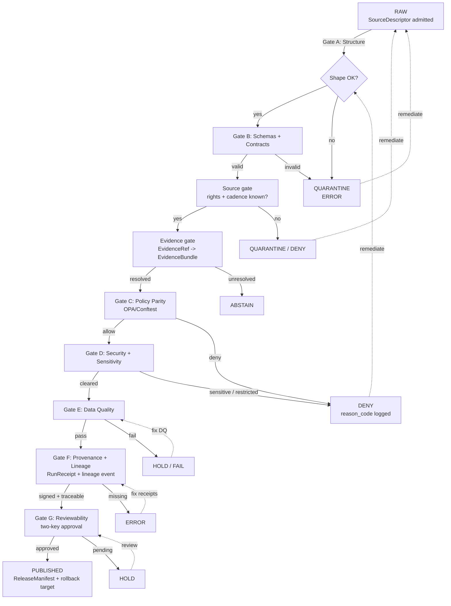

<!-- [KFM_META_BLOCK_V2]
doc_id: kfm://doc/register-policy-gate
title: Policy Gate Register
type: standard
version: v1
status: draft
owners: Docs steward + Policy/Governance steward (TBD — confirm via CODEOWNERS)
created: 2026-05-12
updated: 2026-05-12
policy_label: public
related:
  - docs/doctrine/directory-rules.md
  - docs/registers/AUTHORITY_LADDER.md
  - docs/registers/DRIFT_REGISTER.md
  - docs/registers/VERIFICATION_BACKLOG.md
  - control_plane/policy_gate_register.yaml
  - policy/README.md
  - schemas/contracts/v1/policy/
  - schemas/contracts/v1/runtime/decision_envelope.schema.json
tags: [kfm, register, governance, policy, promotion, gates, opa, conftest, parity]
notes:
  - Human-facing register; machine counterpart is control_plane/policy_gate_register.yaml.
  - Path claims for policy/, schemas/, control_plane/ are PROPOSED per Directory Rules §0 until verified against a mounted repo.
  - Doctrine claims (gate ladder, A–G matrix, fail-closed, finite outcomes, policy parity) are CONFIRMED from the KFM corpus.
[/KFM_META_BLOCK_V2] -->

# Policy Gate Register

> The human-facing index of every policy-bearing gate in KFM: what each gate decides, what evidence it needs, what it fails to when evidence is missing, and how its CI form stays identical to its runtime form.

> **Status:** draft · **Owners:** Docs steward + Policy/Governance steward (TBD) · **Last updated:** 2026-05-12

---

## Contents

- [1. Purpose and scope](#1-purpose-and-scope)
- [2. Authority and conflict resolution](#2-authority-and-conflict-resolution)
- [3. Two senses of "policy gate"](#3-two-senses-of-policy-gate)
- [4. Validator-class gate ladder](#4-validator-class-gate-ladder)
- [5. Promotion Gate Matrix A–G](#5-promotion-gate-matrix-ag)
- [6. Flow of a promotion through the gates](#6-flow-of-a-promotion-through-the-gates)
- [7. Finite decision outcomes](#7-finite-decision-outcomes)
- [8. Evidence required per gate](#8-evidence-required-per-gate)
- [9. Policy parity — CI ≡ Runtime](#9-policy-parity--ci--runtime)
- [10. Fail-closed and negative-path rule](#10-fail-closed-and-negative-path-rule)
- [11. Companion artifacts](#11-companion-artifacts)
- [12. How to add or change a gate](#12-how-to-add-or-change-a-gate)
- [13. Open questions and NEEDS VERIFICATION](#13-open-questions-and-needs-verification)
- [14. Related docs](#14-related-docs)

---

## 1. Purpose and scope

This register is the **human-facing index of the policy-bearing gates** in the Kansas Frontier Matrix (KFM) promotion pipeline. Its job is to give reviewers, stewards, and contributors a fixed vocabulary and a fixed evidence list for every transition between authoring and publication.

**This document explains; it does not decide.** Decisions belong to `policy/` (Rego bundles), `schemas/contracts/v1/policy/` (decision shape), `tests/` and `fixtures/` (enforceability proof), and `control_plane/policy_gate_register.yaml` (the machine-readable counterpart). This file translates those into prose a reviewer can read in five minutes.

> [!NOTE]
> **Companion artifact.** The machine-readable register is `control_plane/policy_gate_register.yaml` (PROPOSED path per Directory Rules §6.2). If the two disagree, the machine register wins for runtime semantics; this document wins for human-facing definitions. Drift between them is filed to `docs/registers/DRIFT_REGISTER.md`.

**In scope.**

- The validator-class **gate ladder** (Shape → Meaning → Source → Evidence → Policy → Lifecycle → Receipt → Release).
- The **Promotion Gate Matrix A–G** that maps human-facing intent to machine check and required evidence.
- The **finite decision outcomes** every gate returns (ANSWER / ABSTAIN / DENY / ERROR / HOLD / PASS / FAIL).
- The **policy-parity rule** that the same Rego bundle (pinned by digest) runs in CI and at runtime.
- The **fail-closed default** and the **negative-path coverage requirement** for validators.

**Out of scope.**

- Object-family meaning (lives in `contracts/`).
- Field-level shape (lives in `schemas/`).
- The actual Rego logic (lives in `policy/bundles/`).
- Sensitivity tiers and rights tables (live in `policy/sensitivity/` and `policy/rights/`, indexed by `docs/registers/` siblings).

[⬆ Back to top](#contents)

---

## 2. Authority and conflict resolution

Authority order for any disagreement about gate behavior or placement:

1. **KFM core invariants and doctrine** — lifecycle law, truth posture (cite-or-abstain), trust membrane, authority ladder, watcher-as-non-publisher.
2. **Accepted ADRs that amend the gate set,** by ADR number. Superseded ADRs do not count.
3. **The Rego bundle in `policy/`,** pinned by digest — this is the operational truth.
4. **This register and `control_plane/policy_gate_register.yaml`** — the human and machine indexes.
5. **Per-root `README.md` files** that refine but cannot contradict the above.
6. **Convention from the current mounted repo state.** When it conflicts with the above, file it to `docs/registers/DRIFT_REGISTER.md`, not as new authority.

> [!IMPORTANT]
> **This register is not the source of truth for whether a gate allows or denies.** A claim like "the policy gate denies X" must be checked against the actual Rego bundle, its pinned digest, the relevant fixtures, and the test that proves the decision. Words in this file are not policy. The bundle is policy.

[⬆ Back to top](#contents)

---

## 3. Two senses of "policy gate"

The phrase **"policy gate"** appears in the KFM corpus with two distinct meanings. Reviewers should know which one is being used in any given sentence.

| Sense | What it refers to | Where it appears |
|---|---|---|
| **Narrow (validator-class)** | One specific gate family — the one that asks: *"Is exposure allowed for this user, purpose, release class?"* — sitting between the Evidence gate and the Lifecycle gate. Default failure is **DENY**. | KFM Unified Manual §24 gate family table. |
| **Wide (promotion gate matrix)** | The full set of seven gates **A through G** between authoring and publication. Includes structure, schemas, policy parity, sensitivity, data quality, lineage, and reviewability. | KFM Components Pass-10 §6.5 (Category C5). |

This register documents **both senses** because the corpus uses both, and conflating them is one of the most common sources of confusion in policy reviews.

[⬆ Back to top](#contents)

---

## 4. Validator-class gate ladder

**Status:** CONFIRMED doctrine. Specific implementation paths: PROPOSED.

KFM validation is a **promotion boundary, not a cleanup pass.** Validators must prove that source admission, machine shape, object meaning, evidence closure, policy decision, sensitivity posture, release posture, correction path, and rollback support are adequate before public or semi-public exposure.

A safe order layers cheap deterministic checks before evidence, policy, catalog, signing, and UI checks:

| # | Gate family | Must answer | Default failure outcome |
|---|---|---|---|
| 1 | **Shape** | Does the object match its schema and required version? | `ERROR` / quarantine |
| 2 | **Meaning** | Does it conform to contract and vocabulary? | `ERROR` / review |
| 3 | **Source** | Is source role, rights, cadence, and sensitivity known? | `DENY` / quarantine |
| 4 | **Evidence** | Do `EvidenceRef`s resolve to `EvidenceBundle`s? | `ABSTAIN` |
| 5 | **Policy** | Is exposure allowed for this user, purpose, release class? | `DENY` |
| 6 | **Lifecycle** | Is object in correct RAW → PUBLISHED state? | `DENY` |
| 7 | **Receipt** | Are `RunReceipt` / `PromotionReceipt` / decision logs present? | `ERROR` |
| 8 | **Release** | Does manifest include proof, correction, rollback? | `DENY` |

> [!NOTE]
> **Why this order matters.** Cheap structural checks (Shape, Meaning) catch the majority of defects before any evidence resolution, policy evaluation, or signing cost is incurred. A Shape failure produces `ERROR` and quarantines the object; it does **not** silently fall through to a Policy or Release check.

[⬆ Back to top](#contents)

---

## 5. Promotion Gate Matrix A–G

**Status:** CONFIRMED in doctrine (KFM Components Pass-10 §6.5, C5-01). Label set is canonical; the corpus notes the matrix appears in slightly different forms in different sections, so any single-row deviation in this register from another source is filed to `docs/registers/DRIFT_REGISTER.md`.

These seven gates run between authoring and publication. Auto-merge fires only when **all seven** pass; any failure blocks the merge until remediation.

| Gate | Human-facing intent | Machine check (PROPOSED naming) | Required evidence | Default failure |
|---|---|---|---|---|
| **A** | Structure and metadata | `check_structure` — MetaBlock presence and zone correctness | KFM Meta Block v2; correct path; required headers | `FAIL` → fix and re-run |
| **B** | Schemas and contracts | Schema validation + OpenAPI validation | Valid JSON Schema match; OpenAPI conformance | `FAIL` → schema repair |
| **C** | Policy parity | OPA/Conftest decision against pinned bundle | `PolicyDecision = allow`; pinned bundle digest | `DENY` |
| **D** | Security and sensitivity | Sensitivity scan + license scan + secret scan | SPDX in allowlist; sensitivity tier resolved; no secrets | `DENY` / quarantine |
| **E** | Data quality | DQ profilers and assertions against thresholds | `ValidationReport` pass; DQ check `status = pass` | `FAIL` / `HOLD` |
| **F** | Provenance and lineage | `RunReceipt` validation + lineage event present | Cosign-signed `RunReceipt`; lineage `run_id` discoverable | `ERROR` / `DENY` |
| **G** | Reviewability | CODEOWNERS-enforced human approval + policy approval (two-key) | `ReviewRecord`; release authority distinct from author when materiality applies | `HOLD` |

> [!IMPORTANT]
> **Default-deny is the bedrock.** Promotion is denied unless `spec_hash` is present and matches a recomputation, the run receipt is cosign-signed and verifiable, SPDX rights are in the allowlist, at least one attestation bundle is published, and every DQ check has status `pass`. The absence of evidence blocks promotion. This is the structural meaning of evidence-first governance.

[⬆ Back to top](#contents)

---

## 6. Flow of a promotion through the gates

The diagram below shows how a candidate moves through the validator-class ladder and the A–G matrix toward publication. Solid arrows are the success path; dashed arrows are the fail-closed paths back to `QUARANTINE`, `HOLD`, or `DENY`.

> [!NOTE]
> **Diagram status:** PROPOSED visualization. The lifecycle invariant (RAW → WORK / QUARANTINE → PROCESSED → CATALOG / TRIPLET → PUBLISHED) is CONFIRMED doctrine; the mapping of A–G gates onto specific transitions is the editorial choice of this register and should be reviewed against `control_plane/policy_gate_register.yaml` once that file lands.

[⬆ Back to top](#contents)

---

## 7. Finite decision outcomes

**Status:** CONFIRMED doctrine. Every governed API surface, validator, policy gate, and Focus Mode answer returns a finite outcome from a small, well-known set. Gates never return free-form or ambiguous states.

| Outcome | Meaning | Where emitted | Public-surface effect |
|---|---|---|---|
| `ANSWER` | Evidence sufficient; policy permits; release state allows; review (if required) recorded. | Runtime / Focus Mode / API. | Substantive answer with Evidence Drawer and citation. |
| `ABSTAIN` | Evidence insufficient, stale, or unciteable. | Runtime / Focus Mode. | Non-substantive note with reason; never invents. |
| `DENY` | Policy, rights, sensitivity, or release state forbids the answer. | All gates. | Returns denial reason; offers alternative non-restricted surface where possible. |
| `ERROR` | Cannot evaluate — missing schema, malformed query, contract violation, infrastructure failure. | All gates. | Finite, actionable error; never silently falls through. |
| `HOLD` | Promotion / release / correction paused pending steward, rights-holder, or policy review. | Gate G; release queue. | Surface remains in prior state; no silent rollback. |
| `PASS` | Validator-class success. | Validators only. | Internal; does not directly emit a public answer. |
| `FAIL` | Validator-class failure. | Validators only. | Promotion blocked; quarantine where appropriate. |

> [!WARNING]
> **No silent transitions.** A gate that returns `HOLD` does not later be promoted to `ANSWER` by an untracked mechanism. A gate that returns `DENY` does not be re-issued as `ABSTAIN` by another path. Every outcome change is traceable through a `DecisionEnvelope` with its own `decision_id`.

[⬆ Back to top](#contents)

---

## 8. Evidence required per gate

The table below names the **minimum evidence** that must be present and admissible at each gate. Implementation paths are PROPOSED per Directory Rules §6.x.

| Gate | Minimum required evidence | Proposed evidence home |
|---|---|---|
| Shape | Schema digest match | `schemas/contracts/v1/...` |
| Meaning | Contract reference resolves | `contracts/<family>/...` |
| Source | `SourceDescriptor` with role, rights, sensitivity, cadence | `data/registry/source_descriptors/` |
| Evidence | `EvidenceRef` → `EvidenceBundle` resolves | `data/proofs/evidence_bundle/` |
| Policy (Gate C) | `PolicyDecision = allow`; pinned bundle digest | `policy/bundles/` + `data/receipts/policy/` |
| Sensitivity (Gate D) | SPDX license in allowlist; sensitivity tier resolved | `policy/sensitivity/`, `policy/rights/` |
| Data quality (Gate E) | `ValidationReport pass` with deterministic inputs | `data/proofs/validation_report/` |
| Lifecycle | Object in correct phase; promotion is governed transition | `data/` lifecycle tree |
| Receipt | `RunReceipt` / `PromotionReceipt` cosign-signed | `data/receipts/` |
| Lineage (Gate F) | OpenLineage `run_id` discoverable | lineage backend (tool TBD) |
| Review (Gate G) | `ReviewRecord` with reviewer distinct from author (when materiality applies) | `contracts/governance/review_record.md` + record store |
| Release | `ReleaseManifest` includes proof refs, correction path, rollback target | `release/manifests/` + `release/rollback_cards/` |

> [!NOTE]
> Receipts created earlier in the ladder are **referenced, not duplicated** at later phases via `EvidenceRef`. A gate at position 6 should never re-emit a `SourceDescriptor`; it should resolve the one from position 3.

[⬆ Back to top](#contents)

---

## 9. Policy parity — CI ≡ Runtime

**Status:** CONFIRMED doctrine (C5-03). What is enforced in production must be **exactly** what was tested.

| Parity rule | Enforcement |
|---|---|
| Same bundle digest | The OPA bundle is pinned by **OCI digest or git SHA** in both CI workflows and runtime deployment manifests. |
| Same PDP version | The PDP container used in CI matches the production sidecar tag. |
| Same data fixtures | Fixtures are pinned with a `fixtures.lock`. |
| Same decision fields | Decision logs in CI and runtime share the same field names and shape. |
| Golden suite | A versioned allow/deny golden suite runs in every PR; deterministic comparison against expected outcomes. |

> [!IMPORTANT]
> Parity is the difference between **policy theatre** and **enforced policy.** Without parity, a rule that looks right in CI can fail differently in production, and an audit cannot answer what the system was actually enforcing yesterday. A CI check **MUST** fail when the deployment manifest digest does not match the workflow's digest.

**Bundle ownership.** Who owns updating the bundle digest, and on what cadence, is `NEEDS VERIFICATION`. The doctrine names the constraint but not the role; this register expects an ADR or per-root README in `policy/` to name it.

**Policy tooling.** OPA/Conftest is the **PROPOSED** first policy-as-code candidate per BLD-GREEN v1.1, conditional on repo evidence and dependency pins. The choice is not yet ADR-frozen.

[⬆ Back to top](#contents)

---

## 10. Fail-closed and negative-path rule

**Status:** CONFIRMED doctrine.

Every gate **MUST** test its DENY, ABSTAIN, ERROR, quarantine, stale, restricted, and review-needed paths — not only successful publication. A proof slice is incomplete if any of the following holds:

- Unknown rights are allowed through.
- Unresolved `EvidenceRef`s receive substantive answers.
- Invalid fixtures pass.
- Public routes read `RAW` / `WORK` / `QUARANTINE`.
- AI output bypasses citation validation.
- Release candidates lack rollback targets.

> [!CAUTION]
> **Fail-closed is the structural posture.** Default-deny means the absence of evidence blocks promotion. The remediation path must be straightforward — default-deny without a clear remediation playbook produces operational friction that drives bypass attempts. Both halves are required: the deny, **and** the documented path to fix the missing evidence.

**Required negative fixtures** (per the corpus's minimum set):

- `missing_spec_hash.json` → `DENY`
- `unresolved_evidence.json` → `DENY`
- `restricted_exact_geometry.json` → `DENY`
- `stale_evidence.json` → `DENY` or `ERROR`
- `unknown_policy_label.json` → `DENY`
- `publication_before_review.json` → `DENY`
- `missing_rights.json` → `DENY`
- `revoked_credential.json` → `DENY`
- `scope_mismatch.json` → `DENY`

[⬆ Back to top](#contents)

---

## 11. Companion artifacts

| Artifact | Role | Proposed path | Status |
|---|---|---|---|
| Machine register | Authoritative, machine-readable gate index | `control_plane/policy_gate_register.yaml` | PROPOSED (path named in Directory Rules §6.2) |
| Rego bundle | The actual policy logic | `policy/bundles/` | PROPOSED |
| Promotion gate policy | Rego for promotion transitions | `policy/promotion/` | PROPOSED |
| Runtime gate policy | Rego for Focus Mode, evidence resolution, abstain | `policy/runtime/` | PROPOSED |
| Release gate policy | Rego for release-time checks | `policy/release/` | PROPOSED |
| Sensitivity classes | Sensitivity tier definitions and redaction rules | `policy/sensitivity/` | PROPOSED |
| Rights enforcement | Rights status, license enforcement | `policy/rights/` | PROPOSED |
| Policy fixtures | Golden allow/deny fixtures (distinct from `tests/fixtures/`) | `policy/fixtures/` | PROPOSED |
| Policy tests | Proof the rules are enforceable | `policy/tests/` | PROPOSED |
| Decision shape | Schema for `DecisionEnvelope` and `PolicyDecision` | `schemas/contracts/v1/policy/`, `schemas/contracts/v1/runtime/` | PROPOSED |
| Decision meaning | Markdown contract for `DecisionEnvelope`, `PolicyDecision` | `contracts/runtime/`, `contracts/release/` | PROPOSED |
| Receipts | Cosign-signed `RunReceipt`, `PromotionReceipt`, decision logs | `data/receipts/policy/`, `data/receipts/promotion/` | PROPOSED |
| Drift entries | Conflicts between this register and the machine register | `docs/registers/DRIFT_REGISTER.md` | PROPOSED |
| Verification backlog | Unchecked claims in this register | `docs/registers/VERIFICATION_BACKLOG.md` | PROPOSED |

> [!NOTE]
> `policy/` is the **canonical singular**. If `policies/` exists in the repo, it is treated as compatibility / mirror until an ADR resolves it (Directory Rules §5).

[⬆ Back to top](#contents)

---

## 12. How to add or change a gate

> [!IMPORTANT]
> **Gates are governance.** Adding, changing, or removing a gate changes what the system means by "publish." Treat gate changes with ADR discipline.

**Add a new gate.**

1. Open an ADR per Directory Rules §2.4 covering: context, decision, consequences, alternatives, migration plan, rollback plan.
2. Land the Rego module under `policy/<family>/` with explicit `allow`, `deny`, `reasons`, and `obligations`.
3. Land the schema for the gate's `DecisionEnvelope` extension under `schemas/contracts/v1/policy/`.
4. Land golden fixtures — at least one `allow`, one `deny`, one `abstain`, one `error`, and one `hold` where applicable.
5. Add the gate to `control_plane/policy_gate_register.yaml`.
6. Add the corresponding row to **Sections 4 / 5 / 8** of this register.
7. Wire the CI check; pin the bundle digest in CI **and** in the runtime deployment manifest.
8. Verify parity: same digest, same PDP version, same fixtures, same decision fields.

**Change an existing gate.**

1. If the change alters semantics, raise an ADR.
2. Bump the bundle version; emit a `CorrectionNotice` if any released artifact's decision would change retroactively.
3. Update fixtures **before** changing the Rego — keep the golden suite as the regression anchor.
4. Update both this register and `control_plane/policy_gate_register.yaml` in the same PR.
5. Run `opa fmt --fail`, `opa check`, schema validation, policy unit tests, negative-path fixtures, promotion dry-run, and release manifest validation — in that order.

**Remove a gate.**

1. ADR required (Directory Rules §2.4).
2. Migration plan: how do existing artifacts that relied on the gate's decision get re-evaluated?
3. Add a deprecation entry in `control_plane/deprecation_register.yaml` with sunset date.
4. Keep the gate's fixtures as regression tests against unintended re-introduction.

> [!WARNING]
> Do **not** silently relax a gate. Default-allow as a temporary workaround is a violation of the fail-closed posture. The correct remediation is to either widen the deny rule with a precise allow path, or to mark the artifact `HOLD` and route it to review.

[⬆ Back to top](#contents)

---

## 13. Open questions and NEEDS VERIFICATION

These items are not yet resolved by attached doctrine and **MUST** be tracked in `docs/registers/VERIFICATION_BACKLOG.md`:

Open questions (click to expand)

- **NEEDS VERIFICATION** — Whether `control_plane/policy_gate_register.yaml` exists in the current mounted repo. Its path is named in Directory Rules §6.2; presence is PROPOSED.
- **NEEDS VERIFICATION** — Whether `policy/` or `policies/` is the live canonical home in the current repo. Default per Directory Rules §5 is `policy/`; resolve by inspection.
- **NEEDS VERIFICATION** — Whether `schemas/contracts/v1/policy/` is the live home for `PolicyDecision` shape. Default per ADR-0001 is `schemas/contracts/v1/...`; resolve by inspection.
- **NEEDS VERIFICATION** — Current policy engine and version (OPA / Conftest / Gatekeeper). BLD-GREEN v1.1 names OPA/Conftest as a **PROPOSED** bootstrap; IMPL-PIPE treats engine details as UNKNOWN without repo evidence.
- **NEEDS VERIFICATION** — Whether KFM's runtime is Kubernetes-based (Gatekeeper applicable), serverless, or a mix (PDP sidecar required instead).
- **NEEDS VERIFICATION** — Canonical SPDX allowlist. CC0-1.0 and CC-BY-4.0 are mentioned; whether ODC-By, PDDL, and US-PD also belong on the list is open.
- **OPEN** — Per-gate SLA in CI. Slow gates push merge latency; the corpus names the constraint but not the budget.
- **OPEN** — Owner and cadence for updating the bundle digest in CI and runtime manifests simultaneously.
- **OPEN** — Canonicalization form for JSON-LD specs (JCS vs URDNA2015) for the `spec_hash` gate.
- **OPEN** — Whether `gate.<letter>.<short>` is the canonical `policy_id` naming for the A–G gates, or whether a different scheme applies.
- **OPEN** — Whether the **narrow** "policy gate" (validator-class family 5) and the **wide** "policy gate" (the A–G matrix as a whole) should retain distinct names in code, or whether the corpus's overloaded usage should be reconciled with new vocabulary.

[⬆ Back to top](#contents)

---

## 14. Related docs

- [`docs/doctrine/directory-rules.md`](../doctrine/directory-rules.md) — Where every file belongs; the placement rules for `policy/`, `control_plane/`, `docs/registers/`. (CONFIRMED in attached corpus.)
- [`docs/registers/AUTHORITY_LADDER.md`](./AUTHORITY_LADDER.md) — Authority order between doctrine, repo, source, and runtime evidence. (PROPOSED; see Whole-UI Expansion Report path-by-path table.)
- [`docs/registers/DRIFT_REGISTER.md`](./DRIFT_REGISTER.md) — Where conflicts between this register and the machine register are filed. (PROPOSED.)
- [`docs/registers/VERIFICATION_BACKLOG.md`](./VERIFICATION_BACKLOG.md) — Unchecked claims, including those in §13 above. (PROPOSED.)
- `control_plane/policy_gate_register.yaml` — Machine-readable counterpart to this register. (PROPOSED.)
- `policy/README.md` — The policy root README; states canonical-singular rule. (PROPOSED.)
- `contracts/runtime/decision_envelope.md` — `DecisionEnvelope` meaning. (PROPOSED.)
- `schemas/contracts/v1/runtime/decision_envelope.schema.json` — `DecisionEnvelope` shape. (PROPOSED.)
- `docs/adr/` — ADRs that amend the gate set. (PROPOSED.)

---

> _Last updated: **2026-05-12** · Maintainers: Docs steward + Policy/Governance steward (TBD via CODEOWNERS)._
>
> [⬆ Back to top](#contents)
