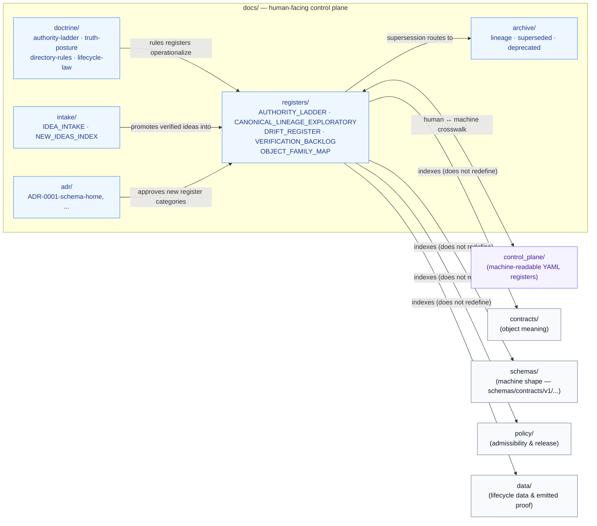
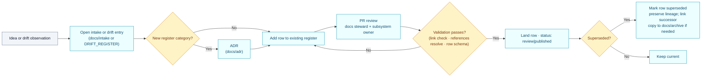

# `docs/registers/` — Documentation Registers

> The human-readable register lane for the Kansas Frontier Matrix: ranked authority, lineage classification, drift tracking, verification queues, and cross-lane object maps. Markdown registers live here; their machine-readable counterparts live in [`control_plane/`](../../control_plane/).

<!-- Badges (Shields.io) — placeholders until owners and CI gates are wired -->


| Field | Value |
|---|---|
| **Status** | `experimental` — directory and member files are **PROPOSED** until verified against mounted-repo evidence |
| **Authority class** | **Canonical** within `docs/` (Directory Rules §6.1) |
| **Owners** | _Docs steward_ + _control-plane steward_ — confirm in `CODEOWNERS` _(placeholder)_ |
| **Pair (machine register lane)** | [`control_plane/`](../../control_plane/) |
| **Schema home rule** | `schemas/contracts/v1/...` per **ADR-0001** (binds entries that point at schemas) |
| **Last reviewed** | `YYYY-MM-DD` _(placeholder — set on first land)_ |

**Quick jump:**
[1. Scope](#1-scope) ·
[2. Repo fit](#2-repo-fit) ·
[3. Inputs](#3-accepted-inputs) ·
[4. Exclusions](#4-exclusions) ·
[5. Directory tree](#5-directory-tree-proposed) ·
[6. Register catalog](#6-register-catalog) ·
[7. Diagram](#7-how-this-lane-connects) ·
[8. Naming convention](#8-naming-convention) ·
[9. Lifecycle](#9-lifecycle-of-a-register-entry) ·
[10. Validation & rollback](#10-validation--rollback) ·
[11. Quickstart](#11-quickstart) ·
[12. FAQ](#12-faq) ·
[Appendix](#appendix)

---

## 1. Scope

`docs/registers/` is one of the lanes inside the **human-facing control plane** (`docs/`). It holds the **explanatory, prose-friendly** registers that a reviewer, steward, or contributor reads to understand:

- **Who outranks whom** when sources of truth disagree (authority).
- **What is canonical, lineage, exploratory, generated, or deprecated** (lineage classification).
- **Where doctrine, code, paths, schemas, or policies are drifting** apart (drift).
- **What still needs verification** before a claim can be treated as fact (backlog).
- **How object families relate across domains** (cross-lane map).

> [!IMPORTANT]
> `docs/registers/` does **not** publish data, define object meaning, define machine shape, or decide admissibility. Those responsibilities belong to `data/`, `contracts/`, `schemas/`, and `policy/` respectively. Collapsing those boundaries is a Directory Rules violation.

The four-layer separation is doctrinal:

> `docs/` **explains** · `control_plane/` **indexes** · `contracts/` **defines meaning** · `schemas/` **defines shape**

— and they MUST NOT collapse into one another.

---

## 2. Repo fit

| Direction | Lane | Relationship |
|---|---|---|
| **Upstream** (authority) | [`docs/doctrine/`](../doctrine/) | Doctrine sets the rules that registers operationalize |
| **Sibling (machine pair)** | [`control_plane/`](../../control_plane/) | YAML registers; same governance domain, machine-readable form |
| **Sibling (intake)** | [`docs/intake/`](../intake/) | New ideas, supersession logs, deprecation indices feed register entries |
| **Sibling (decisions)** | [`docs/adr/`](../adr/) | ADRs are the authority that approves or amends register categories |
| **Sibling (history)** | [`docs/archive/`](../archive/) | Lineage and superseded register revisions go here |
| **Downstream consumers** | Domain dossiers, runbooks, validators, CI link-check, reviewers, release gates | Cite register rows; expect them to resolve |

Per **Directory Rules §6.1**, the register lane is enumerated as part of `docs/`:

> `registers/  # AUTHORITY_LADDER, CANONICAL_LINEAGE_EXPLORATORY, DRIFT_REGISTER, VERIFICATION_BACKLOG, OBJECT_FAMILY_MAP`

That five-file list is the **doctrinal baseline**. Additional register files are admissible when an ADR or domain blueprint establishes the new category and an owner.

---

## 3. Accepted inputs

Files that belong in `docs/registers/`:

- **Markdown register documents** intended for human reading and review.
- **Tabular register rows** with at minimum: `id`, `path`, `status`, `owner`, `version` (where applicable), `validation method`, and `supersession link`.
- **Cross-lane indexes** that point into `contracts/`, `schemas/`, `policy/`, `data/registry/`, `release/`, and domain dossiers — but do not redefine those objects.
- **Drift entries** that surface conflicts between doctrine, repo, schema, or policy without silently absorbing them as authority.
- **Verification backlog items** with a defined verification step and a default outcome until verified.

---

## 4. Exclusions

Files that **do not** belong here, with the correct home:

| What | Where it goes | Why |
|---|---|---|
| Machine-readable register data (`*.yaml`, `*.json`) | [`control_plane/`](../../control_plane/) | Machine vs human plane separation |
| Object-family meaning (Markdown that defines fields/invariants) | [`contracts/`](../../contracts/) | Meaning is `contracts/`'s responsibility |
| Machine-checkable shape | [`schemas/contracts/v1/...`](../../schemas/) | Default schema home per ADR-0001 |
| Admissibility / allow-deny-restrict-abstain | [`policy/`](../../policy/) | Policy is the canonical singular |
| Source identity, rights, sensitivity records | [`data/registry/`](../../data/) and [`policy/sensitivity/`](../../policy/) | Source identity is data-plane, not docs-plane |
| Doctrine itself (authority-ladder, truth-posture, lifecycle-law, directory-rules) | [`docs/doctrine/`](../doctrine/) | Doctrine is the authority registers serve, not a register |
| Architecture decisions | [`docs/adr/`](../adr/) | ADRs are decisions; registers reflect their effect |
| New ideas / proposed sources | [`docs/intake/`](../intake/) | Intake is the proposal lane |
| Generated review/release reports | [`docs/reports/`](../reports/) | Reports are read-only outputs, not living registers |

> [!CAUTION]
> Do not create a parallel register surface (e.g., a competing `registry/` root, or a per-domain `*/registers/` subtree that mirrors `docs/registers/`). Per Directory Rules §2.4, parallel homes for registers require an **ADR** before landing.

[Back to top ↑](#docsregisters--documentation-registers)

---

## 5. Directory tree (PROPOSED)

Status of the **rules** below: derived from doctrine.
Status of the **specific files** below: **PROPOSED** until verified against a mounted repo.

```
docs/registers/
├── README.md                                # this file
├── AUTHORITY_LADDER.md                      # ranked authority across doctrine, repo, sources, runtime
├── CANONICAL_LINEAGE_EXPLORATORY.md         # canon vs lineage vs exploratory vs generated vs deprecated
├── DRIFT_REGISTER.md                        # doctrine ↔ repo / schema / path / policy drift
├── VERIFICATION_BACKLOG.md                  # checkable items not yet checked strongly enough to act as fact
└── OBJECT_FAMILY_MAP.md                     # cross-lane object family map
```

**Optional extension files** (introduced per domain dossier; **PROPOSED / NEEDS VERIFICATION** until ADR-approved):

<details>
<summary>Domain-dossier proposed extensions (click to expand)</summary>

> These are **lineage proposals** drawn from in-project domain blueprints. None override the doctrinal baseline. Each requires an ADR or steward decision before landing as a new register category, **and** must not duplicate something `control_plane/` already indexes.

```
docs/registers/
├── SOURCE_FAMILY_INDEX.md                   # admitted / candidate / restricted / rejected source families
├── SCHEMA_REGISTRY_INDEX.md                 # schema homes, versions, owners, spec_hash rules
├── VALIDATOR_REGISTRY.md                    # deterministic validators + ValidationReport contracts
├── POLICY_REGISTRY.md                       # policy modules and outcome mappings
├── DATA_LIFECYCLE_INDEX.md                  # raw / work / quarantine / processed / catalog / triplet / published
├── ARTIFACT_FLOW_INDEX.md                   # source edge → release manifest → Evidence Drawer
├── LAYER_REGISTER.md                        # public layer manifests and MapLibre delivery surfaces
├── RECEIPT_AND_PROOF_REGISTER.md            # receipt/proof object families and storage rules
├── CATALOG_OBJECT_REGISTER.md               # STAC / DCAT / PROV / catalog matrix and closure
└── CHANGELOG_OR_EVOLUTION_LOG.md            # evolution log for this lane
```

</details>

---

## 6. Register catalog

The doctrinal baseline (Directory Rules §6.1):

| File | Purpose | Authority class | Status | Owner _(placeholder)_ |
|---|---|---|---|---|
| [`AUTHORITY_LADDER.md`](./AUTHORITY_LADDER.md) | Ranked order for resolving authority across doctrine, repo evidence, generated outputs, external sources, and steward decisions. | Canonical | **PROPOSED** | Docs steward |
| [`CANONICAL_LINEAGE_EXPLORATORY.md`](./CANONICAL_LINEAGE_EXPLORATORY.md) | Classifies materials as **canon**, **lineage**, **exploratory**, **generated**, or **deprecated**. | Canonical | **PROPOSED** | Docs steward + subsystem owner |
| [`DRIFT_REGISTER.md`](./DRIFT_REGISTER.md) | Records doctrine ↔ repo / path / schema / policy drift, owner decisions, and resolution path. | Canonical | **PROPOSED** | Docs steward + subsystem owner |
| [`VERIFICATION_BACKLOG.md`](./VERIFICATION_BACKLOG.md) | Checkable items not yet verified strongly enough to act as fact, with default outcome until verified. | Canonical | **PROPOSED** | Docs steward + subsystem owner |
| [`OBJECT_FAMILY_MAP.md`](./OBJECT_FAMILY_MAP.md) | Cross-lane object family map: which contracts, schemas, policies, and data lanes touch each family. | Canonical | **PROPOSED** | Docs steward + contracts steward |

> [!NOTE]
> Every link above resolves to a file that does not yet exist in this session's evidence. Status remains `PROPOSED` until either (a) the repository is mounted and the file is observed, or (b) the file is created in a PR that satisfies the rules in §9.

---

## 7. How this lane connects

> Diagram intent: show how `docs/registers/` operationalizes doctrine, pairs with the machine register lane, and feeds review and CI surfaces. Diagram is doctrine-grounded; specific paths remain PROPOSED until repo-verified.



[Back to top ↑](#docsregisters--documentation-registers)

---

## 8. Naming convention

> [!IMPORTANT]
> Naming convention has visible drift across project sources. Do not silently pick one. Until an ADR resolves the question, follow the doctrine baseline below and record exceptions in [`DRIFT_REGISTER.md`](./DRIFT_REGISTER.md).

| Convention | Form | Source | Use for |
|---|---|---|---|
| **Doctrine baseline** | `ALL_CAPS_SNAKE_CASE.md` | Directory Rules §6.1; People/DNA/Land blueprint; UI/Governed AI report | Canonical registers in this directory |
| **Lineage / drift** | `kebab-case.md` (e.g., `domain-file-index.md`, `lineage-register.md`) | Settlements/Infrastructure plan; some domain dossiers | **Lineage** — record drift; do not adopt without ADR |
| **Subdirectories** | _(none by default)_ | Doctrine | Flat layout; only nest by ADR |

**Required minimum row contents** for any register file in this lane (per Agriculture dossier; consistent with doctrine):

`id`, `path`, `status`, `owner`, `version`, `validation method`, `supersession link`

---

## 9. Lifecycle of a register entry



**Rules of motion** (PROPOSED until repo-verified):

1. **No silent rename.** Renaming a register file requires a supersession link and a row in the affected register's history.
2. **No silent removal.** Removed rows are marked `superseded` with a forward link, not deleted, until they age out per archive policy.
3. **No parallel register.** A second register on the same topic requires an ADR (Directory Rules §2.4 #5).
4. **Drift before doctrine.** When the repo contradicts the rules, open a `DRIFT_REGISTER.md` row first; do not absorb the drift as new authority.

---

## 10. Validation & rollback

| Concern | Default expectation | Status |
|---|---|---|
| **Markdown lint / front matter** | All register files lint clean; required fields present | **PROPOSED** — wire to CI |
| **Link resolution** | Every register row resolves to an existing or PROPOSED file | **PROPOSED** — `docs link check` |
| **Row schema** | Every row has `id`, `path`, `status`, `owner`, `version` (where applicable), `validation method`, `supersession link` | **PROPOSED** — register-lint validator |
| **Crosswalk to `control_plane/`** | Each Markdown register that has a YAML pair must point at it; YAML pair must point back | **PROPOSED** |
| **Authority compliance** | No register entry creates a new canonical or compatibility root without ADR | **CONFIRMED rule** (Directory Rules §2.4) |
| **Schema-home compliance** | Entries pointing at schemas use `schemas/contracts/v1/...` per ADR-0001 | **CONFIRMED rule** |

**Rollback path:**

> [!TIP]
> Per Directory Rules §2.5, the rollback for a register-level change is to **revert the PR and preserve the prior row as `superseded`**. Removal from the visible register does not erase the reason for the change.

1. Revert the offending PR.
2. Mark the affected row `status: superseded` with a forward link if a successor exists.
3. If the change introduced a category that should not have landed, open a follow-up ADR explaining the reversal.
4. Update [`DRIFT_REGISTER.md`](./DRIFT_REGISTER.md) and [`VERIFICATION_BACKLOG.md`](./VERIFICATION_BACKLOG.md) so the removal does not erase _why_ the change was attempted.

---

## 11. Quickstart

### A. Add a row to an existing register

```bash
# 1. Pick the register; check existing IDs to avoid collisions
$ ls docs/registers/

# 2. Edit the file; preserve table shape
$ ${EDITOR:-vi} docs/registers/DRIFT_REGISTER.md

# 3. Validate locally (PROPOSED — wire when CI lands)
$ python tools/ci/check_registers.py        # NEEDS VERIFICATION (path TBD)
$ markdownlint docs/registers/

# 4. Open a PR; cite Directory Rules §6.1
```

### B. Open a drift entry

```text
- id: DRIFT-YYYYMMDD-NN
  observed_in: <path or doc>
  conflicts_with: <doctrine ref, e.g., directory-rules.md §6.1>
  default_until_resolved: <PROPOSED / CONFLICTED / ABSTAIN>
  proposed_resolution: <ADR / migration / steward decision>
  owner: <steward>
  status: open | accepted | resolved | rejected
```

### C. File a verification task

```text
- id: VERIFY-YYYYMMDD-NN
  claim: <what would become a fact if verified>
  default_until_verified: <UNKNOWN / NEEDS VERIFICATION>
  verification_step: <command / inspection / runbook ref>
  owner: <steward>
  blocks: <release stage or doc, if any>
```

> [!NOTE]
> Snippets above are **illustrative**. Final row formats are governed by the per-register file (which carries the canonical row schema for that register) and by the register-lint validator once it lands.

[Back to top ↑](#docsregisters--documentation-registers)

---

## 12. FAQ

**Q: When does a register go in `docs/registers/` versus `control_plane/`?**
If a human reviewer needs prose, examples, and links to act on it → `docs/registers/`. If a validator, CI step, or runtime check consumes it as data → `control_plane/`. Many topics warrant both, paired with a crosswalk.

**Q: Is `docs/registers/` itself authority?**
Within `docs/`, yes — it is canonical (Directory Rules §6.1). But it is not the **root** of authority; doctrine in `docs/doctrine/` outranks it. Registers operationalize doctrine; they do not replace it.

**Q: Why are most files marked PROPOSED?**
Because the repository is not mounted in this session and these doctrinal lists come from in-project planning artifacts. Per the KFM evidence rule, planning artifacts are **lineage**, not proof of repo state. Once a file lands and is observed in a mounted repo, status moves to `review` or `published`.

**Q: Can a domain create its own register here?**
A domain may **add rows** to existing registers. A new register **file** that establishes a new authority category requires an ADR (Directory Rules §2.4 #5). Domains MAY keep domain-internal indexes inside `docs/domains/<name>/`, but those are not authority and may not duplicate this lane.

**Q: Why ALL_CAPS_SNAKE_CASE for register files?**
That form matches the doctrine baseline in Directory Rules §6.1 and the People/DNA/Land and UI/Governed AI blueprints. Some domain dossiers use kebab-case. The drift is real and tracked in §8; resolve via ADR before adopting kebab-case here.

**Q: How does this relate to `docs/intake/`?**
`docs/intake/` is where ideas, supersession logs, and deprecation indices originate. Once an item is verified and accepted, it produces or updates a row in `docs/registers/`. Intake is upstream; registers are the steady state.

**Q: What if a register entry conflicts with the mounted repo?**
Open a row in [`DRIFT_REGISTER.md`](./DRIFT_REGISTER.md). Do not silently rewrite the register to match the repo (Directory Rules §2.5).

---

## Appendix

<details>
<summary><strong>A.1 — Lineage register inventory observed across in-project sources</strong></summary>

The table below catalogs **every** `docs/registers/*.md` filename observed in attached project documents. All rows are **PROPOSED / NEEDS VERIFICATION**. Multiple naming conventions are present and intentional drift is recorded — do not silently consolidate.

| Filename (as observed) | Source dossier | Convention | Notes |
|---|---|---|---|
| `AUTHORITY_LADDER.md` | Directory Rules §6.1; People/DNA/Land; UI/Governed AI | ALL_CAPS | **Doctrine baseline** |
| `CANONICAL_LINEAGE_EXPLORATORY.md` | Directory Rules §6.1; People/DNA/Land; UI/Governed AI | ALL_CAPS | **Doctrine baseline** |
| `DRIFT_REGISTER.md` | Directory Rules §6.1; UI/Governed AI; Atmosphere | ALL_CAPS | **Doctrine baseline** |
| `VERIFICATION_BACKLOG.md` | Directory Rules §6.1; UI/Governed AI; Atmosphere | ALL_CAPS | **Doctrine baseline** |
| `OBJECT_FAMILY_MAP.md` | Directory Rules §6.1; People/DNA/Land | ALL_CAPS | **Doctrine baseline** |
| `SOURCE_FAMILY_INDEX.md` | People/DNA/Land | ALL_CAPS | Lineage proposal — overlaps `control_plane/source_authority_register.yaml` |
| `SCHEMA_REGISTRY_INDEX.md` | People/DNA/Land | ALL_CAPS | Lineage proposal — bound by ADR-0001 |
| `VALIDATOR_REGISTRY.md` | People/DNA/Land | ALL_CAPS | Lineage proposal |
| `POLICY_REGISTRY.md` | People/DNA/Land | ALL_CAPS | Lineage proposal — overlaps `control_plane/policy_gate_register.yaml` |
| `DATA_LIFECYCLE_INDEX.md` | People/DNA/Land | ALL_CAPS | Lineage proposal |
| `ARTIFACT_FLOW_INDEX.md` | People/DNA/Land | ALL_CAPS | Lineage proposal |
| `CHANGELOG_OR_EVOLUTION_LOG.md` | People/DNA/Land | ALL_CAPS | Lineage proposal |
| `SCHEMA_REGISTER.md` | Agriculture dossier | ALL_CAPS | Lineage; possibly duplicates `SCHEMA_REGISTRY_INDEX.md` |
| `SOURCE_DESCRIPTOR_REGISTER.md` | Agriculture dossier | ALL_CAPS | Lineage |
| `DATASET_REGISTER.md` | Agriculture dossier | ALL_CAPS | Lineage |
| `LAYER_REGISTER.md` | Agriculture dossier | ALL_CAPS | Lineage |
| `RECEIPT_AND_PROOF_REGISTER.md` | Agriculture dossier | ALL_CAPS | Lineage |
| `CATALOG_OBJECT_REGISTER.md` | Agriculture dossier | ALL_CAPS | Lineage |
| `domain-file-index.md` | Settlements/Infrastructure plan | kebab-case | **Drift** — record in `DRIFT_REGISTER.md` |
| `correction-index.md` | Settlements/Infrastructure plan | kebab-case | **Drift** |
| `lineage-register.md` | Settlements/Infrastructure plan | kebab-case | **Drift** |
| `layer-index.md` | Settlements/Infrastructure plan | kebab-case | **Drift** |
| `run-receipt-index.md` | Settlements/Infrastructure plan | kebab-case | **Drift** |
| `evidence-bundle-index.md` | Settlements/Infrastructure plan | kebab-case | **Drift** |
| `release-manifest-index.md` | Settlements/Infrastructure plan | kebab-case | **Drift** |

> Convention drift between ALL_CAPS_SNAKE_CASE and kebab-case is unresolved. Until an ADR adjudicates, the doctrine baseline (ALL_CAPS) is preferred for new files; kebab-case files (when observed in a mounted repo) are recorded as lineage in `DRIFT_REGISTER.md` rather than adopted as new authority.

</details>

<details>
<summary><strong>A.2 — Open verification items for this README</strong></summary>

| Item | Status | Action when repo is mounted |
|---|---|---|
| Existence of `docs/registers/` directory | **UNKNOWN** | Confirm presence; if absent, this README defines the create plan |
| Existence of each baseline file (§6) | **UNKNOWN** | Confirm or mark `MISSING_NEEDS_CREATE` |
| Owner identities for `CODEOWNERS` | **PROPOSED** | Resolve with docs steward |
| CI hook for register-lint | **PROPOSED** | Replace placeholder commands in §11 with real workflow paths |
| Adoption of ADR-0001 schema-home rule by entries that reference schemas | **CONFIRMED rule, NEEDS VERIFICATION in entries** | Sweep on first land |
| Naming-convention ADR | **PROPOSED** | Open ADR; until then, doctrine baseline applies |
| Crosswalk file/format between `docs/registers/*.md` and `control_plane/*.yaml` | **PROPOSED** | Define in ADR or in a `CROSSWALK.md` pair file |

</details>

<details>
<summary><strong>A.3 — References (in-project)</strong></summary>

- `docs/doctrine/directory-rules.md` — canonical placement rules; §6.1 enumerates this lane.
- KFM People, Genealogy-DNA, and Land Ownership Architecture blueprint — §8 and Appendix A enumerate the extension list.
- KFM Whole-UI + Governed AI Expansion Report — Appendix A and B reference the doctrine baseline.
- KFM Agriculture Domain Implementation Dossier — proposes `SCHEMA_REGISTER`, `SOURCE_DESCRIPTOR_REGISTER`, `DATASET_REGISTER`, `LAYER_REGISTER`, `RECEIPT_AND_PROOF_REGISTER`, `CATALOG_OBJECT_REGISTER`.
- KFM Atmosphere/Air Architecture Report — Appendix I update triggers reference `DRIFT_REGISTER.md` and `VERIFICATION_BACKLOG.md`.
- KFM Settlements/Infrastructure Extended Pro Plan — uses kebab-case naming; treat as drift.
- KFM Hydrology Extended Pro Reference Report — file/folder reference register pattern.

</details>

[Back to top ↑](#docsregisters--documentation-registers)
