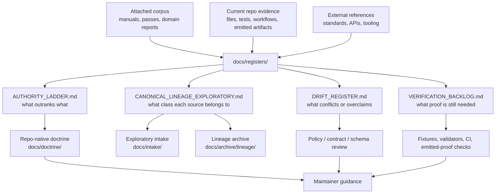

<!-- [KFM_META_BLOCK_V2]
doc_id: kfm://doc/TODO-NEEDS-UUID
title: Documentation Registers
type: standard
version: v1
status: draft
owners: TODO-NEEDS-CODEOWNERS-VERIFICATION
created: TODO-NEEDS-REPO-CREATION-DATE
updated: 2026-04-22
policy_label: TODO-NEEDS-POLICY-LABEL
related: [../README.md, ../doctrine/DOCUMENTATION_LAW.md, AUTHORITY_LADDER.md, CANONICAL_LINEAGE_EXPLORATORY.md, DRIFT_REGISTER.md, VERIFICATION_BACKLOG.md, ../intake/IDEA_INTAKE.md, ../sources/SOURCE_DESCRIPTOR_STANDARD.md, ../../contracts/OBJECT_MAP.md]
tags: [kfm, documentation, registers, authority, evidence, governance]
notes: [Generated as a repo-ready draft from the KFM documentation-architecture corpus; owner, created date, policy label, and sibling file existence need live-repo verification before merge.]
[/KFM_META_BLOCK_V2] -->

<a id="top"></a>

# Documentation Registers

Directory landing page for KFM’s documentation registers: the control-plane records that classify authority, canon status, drift, and verification gaps.


> [!IMPORTANT]
> **Status:** experimental  
> **Owners:** `TODO-NEEDS-CODEOWNERS-VERIFICATION`  
> **Path:** `docs/registers/README.md`  
> **Repo fit:** directory index for KFM register files under the documentation control plane  
> **Quick jumps:** [Scope](#scope) · [Repo fit](#repo-fit) · [Accepted inputs](#accepted-inputs) · [Exclusions](#exclusions) · [Directory tree](#directory-tree) · [Quickstart](#quickstart) · [Usage](#usage) · [Register map](#register-map) · [Diagram](#diagram) · [Task list](#task-list--definition-of-done) · [FAQ](#faq) · [Appendix](#appendix)

> [!NOTE]
> This README is intentionally conservative. It describes the **register surface** KFM needs and the first register files the corpus repeatedly proposes, but it does **not** claim those sibling files already exist until the live repository is inspected.

---

## Scope

`docs/registers/` is the documentation-control directory for **short, reviewable, repo-native registers** that answer four recurring KFM questions:

1. **What outranks what?**
2. **Which materials are canonical, lineage-bearing, exploratory, reference, or superseded?**
3. **Where are contradictions, overclaims, or naming drift recorded?**
4. **What exact evidence is still needed before stronger implementation claims can be made?**

This directory exists because KFM is doctrine-rich and source-rich. Without visible registers, strong but mixed-status materials can accidentally compete as peer canon.

### Register posture in one glance

| Register concern | KFM posture |
|---|---|
| Authority | Make source order explicit before citing a file as governing. |
| Canon formation | Extract stable doctrine into repo-native docs; preserve older manuals as lineage. |
| Exploratory material | Keep useful packets visible, but do not let them become implementation proof. |
| Drift | Record conflicts instead of smoothing them over. |
| Verification | Name the exact missing evidence needed to upgrade a claim. |

[Back to top](#top)

---

## Repo fit

**Path:** `docs/registers/README.md`

**Upstream / owning surfaces**

| Surface | Relationship | Verification posture |
|---|---|---|
| [`../README.md`](../README.md) | Expected documentation landing page that should point maintainers into this register directory. | NEEDS VERIFICATION if this README lands before `docs/README.md` is verified. |
| `../doctrine/DOCUMENTATION_LAW.md` | Expected doctrine home for documentation rules that registers operationalize. | PROPOSED until verified in repo. |
| Root `README.md` | Expected repo orientation surface that should point to canonical docs and registers, not a flat pile of sources. | NEEDS VERIFICATION in the live checkout. |

**Downstream / consumed-by surfaces**

| Surface | How it should use this directory |
|---|---|
| `../intake/` | Uses register decisions to keep New Ideas and packet material from becoming accidental canon. |
| `../sources/` | Uses authority and drift records to decide when source-descriptor guidance needs review. |
| `../../contracts/` and `../../schemas/` | Use register decisions to avoid duplicated or conflicted schema/contract authority. |
| `../../policy/` | Uses drift and verification records to keep deny/allow rules aligned with doctrine. |
| `../../tests/fixtures/` | Uses verification backlog entries to build valid/invalid examples. |
| `../../data/receipts/`, `../../data/proofs/`, and `../../release/` | Use register decisions to avoid treating emitted artifacts as normative definitions. |

> [!WARNING]
> If a sibling register file does not exist yet, create it in the same PR or keep references as code paths until link checks can pass.

[Back to top](#top)

---

## Accepted inputs

The registers may accept concise entries that improve authority clarity, verification clarity, or correction discipline.

| Accepted input | Belongs here when... | Typical destination |
|---|---|---|
| Source-class decision | A maintainer needs to know whether a file is canonical, lineage, exploratory, reference, superseded, or implementation evidence. | `CANONICAL_LINEAGE_EXPLORATORY.md` |
| Authority rule | Two source families could conflict and need a resolution order. | `AUTHORITY_LADDER.md` |
| Drift or contradiction | Docs, schemas, policies, fixtures, or generated artifacts appear inconsistent. | `DRIFT_REGISTER.md` |
| Verification gap | A claim needs exact repo evidence, workflow evidence, emitted artifact evidence, or runtime evidence before promotion. | `VERIFICATION_BACKLOG.md` |
| Register maintenance note | A register itself needs ownership, update cadence, or placeholder cleanup. | This README or the affected register |

---

## Exclusions

`docs/registers/` should stay compact. It is not a dumping ground for full doctrine, packets, schemas, source data, or proofs.

| Do not put here | Why not | Put it instead |
|---|---|---|
| Full master manuals or long synthesis reports | They are source material or lineage, not lightweight registers. | `docs/archive/lineage/` or the designated doctrine home |
| New Ideas packets | They are exploratory until triaged and promoted. | `docs/intake/` |
| Source descriptors | They need source-role fields, rights, cadence, and steward review. | `docs/sources/` or `data/registry/` after verification |
| JSON Schemas and machine contracts | Registers classify authority; they are not the schema source of truth. | `schemas/` or `contracts/` after the schema-home ADR is resolved |
| Policy rules | Registers record policy drift; they do not enforce allow/deny logic. | `policy/` |
| Fixtures and golden packs | Registers may request fixtures; fixtures live with tests. | `tests/fixtures/` |
| Receipts, proof packs, release manifests, or emitted artifacts | Emitted evidence is process/release memory, not register law. | `data/receipts/`, `data/proofs/`, `release/`, or repo-native artifact homes |
| Runtime behavior claims | Runtime truth requires inspected logs, responses, tests, dashboards, or emitted envelopes. | Verification backlog first; implementation docs after proof |

[Back to top](#top)

---

## Directory tree

Current sibling file presence is **NEEDS VERIFICATION** until the live repository is inspected.

```text
docs/registers/
├── README.md                             # this directory landing page
├── AUTHORITY_LADDER.md                   # PROPOSED P0: source hierarchy and conflict-resolution rules
├── CANONICAL_LINEAGE_EXPLORATORY.md      # PROPOSED P0: canon, lineage, exploratory, reference, superseded classes
├── DRIFT_REGISTER.md                     # PROPOSED P1: contradictions, overclaims, naming drift, authority gaps
└── VERIFICATION_BACKLOG.md               # PROPOSED P1: exact evidence needed before stronger claims
```

> [!TIP]
> Keep register files small enough to review. When a register entry grows into guidance, move the guidance to the owning doc and leave a short pointer here.

---

## Quickstart

Use these checks before editing or reviewing this directory.

```bash
# Inspect the register surface without mutating the repo.
find docs/registers -maxdepth 1 -type f | sort

# Find unresolved review markers in this register surface.
grep -RInE 'TODO|NEEDS VERIFICATION|UNKNOWN|CONFLICTED|PROPOSED' docs/registers || true

# Confirm this README has exactly one H1.
grep -RIn '^# ' docs/registers/README.md
```

> [!NOTE]
> Replace these shell checks with the repo-native documentation validator when that entry point is verified.

---

## Usage

### 1. Classify before citing as authority

Before a document, packet, fixture, or generated artifact is cited as governing, classify it.

| Question | Register action |
|---|---|
| Is it current repo-native doctrine? | Record or confirm as canonical. |
| Is it older but still useful? | Preserve as lineage with successor pointer. |
| Is it a strong idea without implementation proof? | Route to exploratory intake. |
| Is it repeated material that only corroborates? | Cross-reference once; do not count repetition as independent proof. |
| Is it external technical context? | Mark as reference; do not let it override KFM doctrine silently. |

### 2. Record conflicts instead of flattening them

A conflict is useful evidence. Put it in the drift register with:

- what conflicts,
- which files or source families are involved,
- current truth label,
- risk if ignored,
- proposed resolution owner,
- exact verification needed.

### 3. Upgrade claims only with evidence

A claim should not move from `PROPOSED` or `UNKNOWN` to `CONFIRMED` merely because multiple PDFs say similar things. Use the verification backlog to name the proof required.

Examples of upgrade evidence:

| Claim type | Evidence needed |
|---|---|
| “The repo contains this file.” | Current checkout file path and contents. |
| “The workflow enforces this.” | Workflow YAML and recent run evidence. |
| “The schema is canonical.” | Schema-home ADR and parent README alignment. |
| “The API emits this envelope.” | Sample response, route test, or runtime fixture. |
| “This release is published.” | Release manifest, proof pack, catalog entry, and promotion decision. |

[Back to top](#top)

---

## Register map

| File | Register role | Authority class | Update trigger | Must not become |
|---|---|---|---|---|
| `README.md` | Orientation for this register directory | Governance support | New register family, ownership update, parent navigation update | A replacement for the register files |
| `AUTHORITY_LADDER.md` | Source hierarchy and conflict-resolution rules | Canonical / governance | New source class, source-order change, doctrine conflict | A bibliography |
| `CANONICAL_LINEAGE_EXPLORATORY.md` | Canon, lineage, exploratory, reference, superseded classification | Canonical / governance | New document family, supersession, canon promotion | A file inventory with no authority meaning |
| `DRIFT_REGISTER.md` | Known contradictions, overclaim risks, naming drift, unresolved authority gaps | Governance control | Any source conflict, implementation mismatch, or terminology split | A blame log |
| `VERIFICATION_BACKLOG.md` | Evidence required before stronger claims can be made | Governance control | Any `UNKNOWN`, `NEEDS VERIFICATION`, or blocked promotion | A vague TODO list |

---

## Diagram



The diagram shows the register directory as a routing surface. It does not imply that every target directory already exists.

[Back to top](#top)

---

## Task list / definition of done

This README is ready to carry stronger claims only when the following are true:

- [ ] `owners` is verified against live repo ownership or CODEOWNERS.
- [ ] `created`, `updated`, and `policy_label` are replaced with repo-verified values.
- [ ] `AUTHORITY_LADDER.md` exists or this README clearly marks it as not yet created.
- [ ] `CANONICAL_LINEAGE_EXPLORATORY.md` exists or this README clearly marks it as not yet created.
- [ ] `DRIFT_REGISTER.md` exists or the first drift entries are intentionally deferred.
- [ ] `VERIFICATION_BACKLOG.md` exists or the backlog home is explicitly resolved elsewhere.
- [ ] Parent navigation from `docs/README.md` is present or deliberately deferred.
- [ ] Link checks pass, or proposed paths are left as code spans rather than active links.
- [ ] No register entry cites an exploratory packet as implementation proof.
- [ ] No register entry claims active workflow, schema, policy, API, runtime, release, or dashboard maturity without direct evidence.

---

## FAQ

### Why does this directory exist?

Because KFM’s documentation problem is not lack of material. It is authority clarity under growth. Registers make the difference between **useful source abundance** and **accidental peer canon**.

### Can a register contain `PROPOSED` items?

Yes. A register may contain `PROPOSED`, `UNKNOWN`, and `NEEDS VERIFICATION` entries when those labels are explicit. The problem is not uncertainty; the problem is hidden uncertainty.

### Can external standards appear in the registers?

Yes, as reference or verification context. External standards can refine technical accuracy, but they do not silently override KFM doctrine.

### Can this directory prove implementation maturity?

No. It can record what evidence would prove implementation maturity. It cannot substitute for inspected files, tests, workflow runs, emitted artifacts, logs, dashboards, or deployment evidence.

### What is the first review burden for this README?

Confirm owner, policy label, sibling files, parent links, and whether the repository already has a register convention that should override this proposed structure.

---

## Appendix

<details>
<summary>Register entry template</summary>

Use this template when adding a compact register row or expanding a row into a short register entry.

```markdown
## <Register item title>

**Status:** CONFIRMED | INFERRED | PROPOSED | UNKNOWN | NEEDS VERIFICATION | CONFLICTED  
**Authority class:** canonical | current support | lineage | exploratory | reference | superseded  
**Owning surface:** <path or owner to verify>  
**Evidence basis:** <specific file, artifact, test, workflow, or source family>  
**Decision / disposition:** <what maintainers should do next>  
**Update trigger:** <what event requires this entry to change>  
**Linked surfaces:** <docs / contracts / schemas / policy / tests / release paths>  
**Open verification:** <exact evidence needed to upgrade or close>
```

</details>

<details>
<summary>Truth labels used by this README</summary>

| Label | Meaning here |
|---|---|
| CONFIRMED | Verified from direct repo evidence, attached KFM doctrine, visible workspace evidence, or generated artifact evidence. |
| INFERRED | Strongly grounded by project sources but not directly verified as implementation. |
| PROPOSED | Recommended structure or behavior that fits KFM doctrine but is not verified as current repo fact. |
| UNKNOWN | Not verified strongly enough; do not imply certainty. |
| NEEDS VERIFICATION | Exact next evidence is required before stronger wording is allowed. |
| CONFLICTED | Sources, paths, terms, or authority claims appear unresolved and need explicit decision. |

</details>

<details>
<summary>Pre-publish checklist for maintainers</summary>

- [ ] Meta block wrapper preserved exactly.
- [ ] One H1 only.
- [ ] One-line purpose directly below the title.
- [ ] Status, owners, badges, and quick jumps present.
- [ ] Repo fit includes path and upstream/downstream relationships.
- [ ] Accepted inputs and exclusions are explicit.
- [ ] Directory tree is labeled as current, proposed, or needs verification.
- [ ] Mermaid diagram reflects real responsibility boundaries, not decoration.
- [ ] Tables are compact and reviewable.
- [ ] Code fences are language-tagged.
- [ ] Appendix content is collapsed.
- [ ] No unsupported implementation, workflow, runtime, or release claims.
- [ ] Relative links are verified or converted to code spans until sibling files exist.

</details>

[Back to top](#top)
