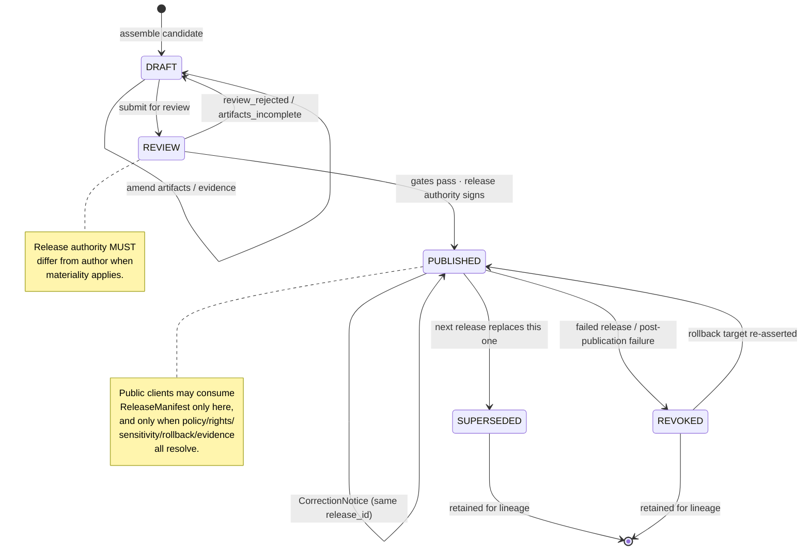
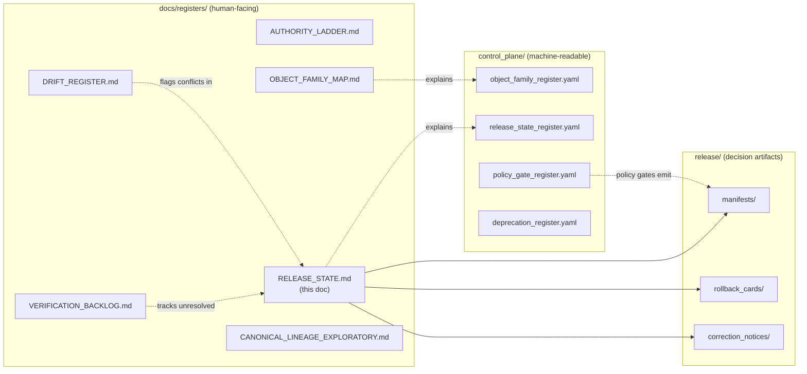

<!-- [KFM_META_BLOCK_V2]
doc_id: kfm://doc/registers/release-state
title: Release State Register
type: standard
version: v1
status: draft
owners: Docs steward; Release authority (per ADR when assigned)
created: 2026-05-12
updated: 2026-05-12
policy_label: public
related:
  - docs/doctrine/directory-rules.md
  - docs/doctrine/lifecycle-law.md
  - docs/doctrine/trust-membrane.md
  - control_plane/release_state_register.yaml
  - schemas/contracts/v1/release/ReleaseManifest.schema.json
  - release/manifests/
  - release/rollback_cards/
  - release/correction_notices/
tags: [kfm, registers, release, governance, lifecycle]
notes:
  - "PROPOSED placement: docs/registers/ pattern per Directory Rules §6.1; not explicitly listed in canonical examples but matches the AUTHORITY_LADDER / DRIFT_REGISTER / VERIFICATION_BACKLOG family."
  - "Human-facing companion to control_plane/release_state_register.yaml (per Directory Rules: docs explains; control_plane indexes)."
[/KFM_META_BLOCK_V2] -->

# Release State Register

> **Authoritative human-facing reference for KFM release states, the transitions between them, the artifacts each state requires, and the separation of duties that governs publication. Pairs with the machine-readable `control_plane/release_state_register.yaml`.**

<!-- Badges: placeholders until repo-side targets are confirmed -->


| Field | Value |
|---|---|
| **Status** | `draft` |
| **Owners** | Docs steward; Release authority (per ADR when assigned) |
| **Authority** | Canonical (register) — refines doctrine; never overrides it |
| **Last reviewed** | 2026-05-12 |
| **Authority of the rules below** | CONFIRMED (derived from KFM doctrine) |
| **Authority of any specific repo path quoted** | PROPOSED until verified against mounted-repo evidence |

---

## Quick jump

- [1. Purpose](#1-purpose)
- [2. Repo fit](#2-repo-fit)
- [3. What belongs here](#3-what-belongs-here)
- [4. What does *not* belong here](#4-what-does-not-belong-here)
- [5. The five release states](#5-the-five-release-states)
- [6. State transition diagram](#6-state-transition-diagram)
- [7. Required artifacts per transition](#7-required-artifacts-per-transition)
- [8. Public runtime rule (the PUBLISHED gate)](#8-public-runtime-rule-the-published-gate)
- [9. Release-related reason codes](#9-release-related-reason-codes)
- [10. Separation of duties](#10-separation-of-duties)
- [11. Stale, superseded, and rollback semantics](#11-stale-superseded-and-rollback-semantics)
- [12. Relationship to other registers](#12-relationship-to-other-registers)
- [13. FAQ](#13-faq)
- [14. Related docs](#14-related-docs)
- [Appendix A — ReleaseManifest `release_state` enum reference](#appendix-a--releasemanifest-release_state-enum-reference)
- [Appendix B — Change discipline for this register](#appendix-b--change-discipline-for-this-register)

---

## 1. Purpose

**CONFIRMED doctrine.** Release is one of the five governed transitions in KFM's lifecycle invariant — `RAW → WORK/QUARANTINE → PROCESSED → CATALOG/TRIPLET → PUBLISHED`. It is *not* a file move; it is a recorded state change with required artifacts, a recorded policy decision, and a rollback target.

This register exists so that every reader — steward, reviewer, release authority, downstream consumer, or auditor — can answer four questions from one page:

1. **What release states does KFM recognize?**
2. **What artifacts must exist for a release to enter, leave, or revert a state?**
3. **Who is allowed to make the decision, and when must the author *not* be the approver?**
4. **What does a public client see, and under what conditions may a `ReleaseManifest` be consumed publicly?**

> [!IMPORTANT]
> Release is a **trust-membrane gate.** Public clients, normal UI surfaces, and any released AI surface reach content *only* via `PUBLISHED` releases. They never reach `RAW`, `WORK`, `QUARANTINE`, canonical/internal stores, graph internals, vector indexes, source APIs, or direct model runtimes.

[↑ Back to top](#release-state-register)

---

## 2. Repo fit

This document is the **human-facing** half of the release state register. Its machine-readable counterpart is `control_plane/release_state_register.yaml`. Per Directory Rules: `docs/` explains, `control_plane/` indexes, `contracts/` defines meaning, `schemas/` defines shape. These four are different layers of the same governance function and **MUST NOT** collapse into one another.

**Proposed location:** `docs/registers/RELEASE_STATE.md` (PROPOSED — not explicitly named in Directory Rules §6.1's canonical examples, but is the natural sibling of `AUTHORITY_LADDER.md`, `CANONICAL_LINEAGE_EXPLORATORY.md`, `DRIFT_REGISTER.md`, `VERIFICATION_BACKLOG.md`).

```text
docs/
└── registers/
    ├── AUTHORITY_LADDER.md
    ├── CANONICAL_LINEAGE_EXPLORATORY.md
    ├── DRIFT_REGISTER.md
    ├── VERIFICATION_BACKLOG.md
    ├── OBJECT_FAMILY_MAP.md
    └── RELEASE_STATE.md          ← this document (PROPOSED)
```

**Upstream (what this register depends on):**

- `docs/doctrine/lifecycle-law.md` — the `RAW → … → PUBLISHED` invariant.
- `docs/doctrine/trust-membrane.md` — the boundary that keeps internal state out of public surfaces.
- `docs/doctrine/authority-ladder.md` — who decides what at each gate.
- `schemas/contracts/v1/release/ReleaseManifest.schema.json` — the `release_state` enum and binding fields. *(PROPOSED path; verify against repo.)*

**Downstream (what this register binds together):**

- `release/manifests/` — `ReleaseManifest` artifacts.
- `release/rollback_cards/` — `RollbackCard` decisions.
- `release/correction_notices/` — `CorrectionNotice` records.
- `control_plane/release_state_register.yaml` — machine-readable mirror.
- Validators under `tools/validators/release/`. *(PROPOSED path.)*

[↑ Back to top](#release-state-register)

---

## 3. What belongs here

- The **enumerated set** of release states KFM recognizes and the semantics of each.
- The **transitions** between states, with required pre-conditions and artifacts.
- The **failure-closed posture** for each transition (what holds when a precondition is unresolved).
- The **public runtime rule** that governs when a `ReleaseManifest` may be consumed by a public client.
- The **separation-of-duties matrix** for release-class decisions.
- **Reason codes** that release-related gates may emit.
- Pointers to the artifacts, schemas, policies, validators, and tests that operationalize each state.

## 4. What does *not* belong here

- ❌ **`ReleaseManifest` field-level shape.** That lives in `schemas/contracts/v1/release/`.
- ❌ **Object-family meaning** for `ReleaseManifest`, `RollbackCard`, `CorrectionNotice`. That lives in `contracts/`.
- ❌ **Admissibility / publication policy rules** (allow / deny conditions). Those live in `policy/release/` and are evaluated by OPA / equivalent.
- ❌ **Per-domain release decisions, artifact inventories, or release notes.** Those live in `release/manifests/<release_id>/` and per-domain release dossiers.
- ❌ **Drift entries.** Those live in `docs/registers/DRIFT_REGISTER.md`.
- ❌ **Open verification questions.** Those live in `docs/registers/VERIFICATION_BACKLOG.md`.

[↑ Back to top](#release-state-register)

---

## 5. The five release states

**CONFIRMED doctrine, derived from the `ReleaseManifest.release_state` enum:**
`DRAFT | REVIEW | PUBLISHED | REVOKED | SUPERSEDED`.

| State | What it means | Public-visible? | Counts as truth? |
|---|---|---|---|
| **DRAFT** | A release candidate is being assembled. Artifacts, evidence refs, rollback target, and policy decisions are being collected. | ❌ No | ❌ No |
| **REVIEW** | The candidate has been submitted for steward, sensitivity, rights-holder, or release-authority review per separation-of-duties rules. | ❌ No | ❌ No |
| **PUBLISHED** | The release has cleared all gates. It is the **only** state from which the governed API may emit `ANSWER`, and the only state public clients may consume. | ✅ Yes | ✅ Yes (until corrected, revoked, or superseded) |
| **REVOKED** | A previously `PUBLISHED` release has been withdrawn. A `RollbackCard` and/or `CorrectionNotice` records why; downstream derivatives are invalidated. | Stale-marked, not silently | ❌ No |
| **SUPERSEDED** | The release has been replaced by a newer `ReleaseManifest`. Both manifests are retained; the supersession lineage is queryable. | Stale-marked, lineage visible | ❌ As current truth; ✅ as historical record |

> [!NOTE]
> A `release_state` value of `DRAFT` or `REVIEW` is **never** a basis for a public claim. A consumer that sees `release_state != "PUBLISHED"` must treat the artifact as non-truth and surface that state, not silently render it.

[↑ Back to top](#release-state-register)

---

## 6. State transition diagram



> [!NOTE]
> The diagram is **normative** for transitions but **illustrative** for cardinality (a single `PUBLISHED` release may be amended by multiple `CorrectionNotice` events without changing `release_state`).

[↑ Back to top](#release-state-register)

---

## 7. Required artifacts per transition

**CONFIRMED doctrine (lifecycle gates):** a transition is closed only when (i) the required artifacts below exist, (ii) every required artifact *resolves* the artifacts it depends on (`EvidenceRef → EvidenceBundle`, `source_id → SourceDescriptor`, `model_id → ModelRunReceipt`), and (iii) the policy gate evaluated and recorded its decision. Missing any of these → **fail closed**, prior state preserved.

| From → To | Pre-conditions | Required artifacts | Failure-closed outcome |
|---|---|---|---|
| `— → DRAFT` | Catalog closure complete; `EvidenceRef`s resolve; `CatalogMatrix` entry exists. | `ReleaseManifest` (draft); inventoried artifacts; evidence refs; provisional rollback target. | Stay at `CATALOG`. No `ReleaseManifest` created. |
| `DRAFT → REVIEW` | All `ReleaseManifest` required fields present; artifact digests computed; policy pre-check passes. | `ValidationReport` (release-level); `PolicyDecision` (pre-publication); rollback target identified. | Stay in `DRAFT`. Structured FAIL outcome. |
| `REVIEW → PUBLISHED` | Review state adequate; release authority distinct from original author when materiality applies. | `ReviewRecord`(s); final `PolicyDecision` (ALLOW); `ReleaseManifest` signed; `RollbackCard` plan reference. | `HOLD at CATALOG`; no public surface change. |
| `PUBLISHED → PUBLISHED′` *(correction)* | Detected error or new evidence; downstream derivatives identified. | `CorrectionNotice`; `ReviewRecord`; invalidation list; `ReleaseManifest` update or supersession. | Stale-state announcement on the affected claim; **no silent edit**. |
| `PUBLISHED → SUPERSEDED` | A newer `ReleaseManifest` has been `PUBLISHED` for the same scope. | New `ReleaseManifest` with `correction_lineage` link; supersession entry. | Old manifest retained; not deleted. |
| `PUBLISHED → REVOKED` | Failed release or post-publication failure; targeted prior release identified. | `RollbackCard`; `CorrectionNotice`; `ReleaseManifest` reverts to prior release; downstream derivative invalidation. | Held at current state until rollback validated. |
| `REVOKED → PUBLISHED` *(rollback re-assertion)* | Rollback target validated; rollback drill executed. | Re-issued `ReleaseManifest` referencing rollback target; `ReviewRecord` of the rollback decision. | Stay `REVOKED` until validation passes. |

[↑ Back to top](#release-state-register)

---

## 8. Public runtime rule (the PUBLISHED gate)

**CONFIRMED doctrine.** A public client may consume a `ReleaseManifest` **only when every following condition holds simultaneously**:

> [!IMPORTANT]
> **All six must hold. Any one missing → DENY.**
> 1. `release_state == "PUBLISHED"`
> 2. `policy_label` is known and not `unknown`
> 3. `rights_status` is known and not `unknown`
> 4. `sensitivity == "public"` (not `generalized`, `restricted`, or `review_required`)
> 5. `evidence_refs` is non-empty and each ref resolves to an `EvidenceBundle`; each artifact has a content digest (`sha256` / `blake3`)
> 6. `rollback.rollback_supported == true` and `rollback` has a valid plan / previous-release reference

A release that satisfies (1) but fails any of (2)–(6) is a **release-infrastructure error**, not a public artifact. The governed API responds with `DENY` and the corresponding reason code (§9). This is the operational form of *cite-or-abstain*: missing rollback or unknown rights → fail closed, never silently degrade.

[↑ Back to top](#release-state-register)

---

## 9. Release-related reason codes

> [!NOTE]
> **PROPOSED catalog.** These are the reason codes the release and adjacent gates may emit. Codes are stable identifiers; their messages may be localized. See `policy/release/` for the authoritative rule set (PROPOSED path) and the per-domain releases for examples.

| Reason code | Gate(s) where it fires | Recovery path |
|---|---|---|
| `MISSING_RECEIPT` | Catalog / Release | Re-emit the missing receipt; re-run gate. |
| `MISSING_EVIDENCE` | Catalog / Release | Resolve `EvidenceRef`s; re-run validator. |
| `MISSING_REVIEW` | Catalog / Release | Run required review; supply `ReviewRecord`. |
| `SCHEMA_MISMATCH` | Validation / Release | Schema fix and/or ADR; re-run validator. |
| `CONTRACT_DRIFT` | Validation / Release | Reconcile contract; re-run validator. |
| `RIGHTS_UNKNOWN` | Admission / Validation / Catalog / Release | Steward review; rights resolution. |
| `SENSITIVITY_UNRESOLVED` | Admission / Validation / Catalog / Release | Sensitivity reviewer; tier reassignment. |
| `ROLE_COLLAPSE` | Validation / Catalog / Release | Restore source role; refuse upcast. |
| `ROLE_DOWNCAST_FORBIDDEN` | Validation / Catalog / Release | Reject downcast. |
| `REVIEW_NEEDED` | Catalog / Release | Open review queue entry. |
| `REVIEW_INSUFFICIENT` | Catalog / Release | Escalate / re-review with adequate role coverage. |
| `REVIEW_REJECTED` | Catalog / Release | Return to `DRAFT`; revise. |
| `RELEASE_MANIFEST_INVALID` | Release | Manifest fix; re-validate against `ReleaseManifest` schema. |
| `ROLLBACK_TARGET_MISSING` | Release | Supply rollback target; verify with rollback drill. |
| `CORRECTION_DERIVATIVES_UNRESOLVED` | Correction | Resolve and invalidate derivatives. |
| `CORRECTION_PRIOR_RELEASE_MISSING` | Correction | Supersession entry; chain repair. |

[↑ Back to top](#release-state-register)

---

## 10. Separation of duties

**CONFIRMED doctrine (operating-law invariant 9):** KFM separates policy-significant release duties when maturity justifies it. The table below reflects the **PROPOSED** separation matrix consolidated from the Domains Culmination Atlas.

| Action | May the author also approve? | Required separation | Notes |
|---|---|---|---|
| **Release to PUBLISHED** | ❌ No when materiality applies. | Author ≠ release authority; rights-holder rep where applicable. | The default for any non-trivial public-facing release. |
| **Sensitive-lane release** | ❌ No. | Author + sensitivity reviewer + release authority + rights-holder rep. | Applies to archaeology, sovereign data, living-person data, DNA data, rare-species locations, and infrastructure detail. |
| **Correction / rollback** | ❌ No when correction is steward-significant. | Author / detector + correction reviewer + release authority. | Corrections of policy-significant claims always separated. |
| **AI surface change** (template / policy binding) | ❌ No. | AI surface steward + docs steward (policy binding). | Focus Mode template changes are release-class. |
| **Atlas / supplement publication** | ❌ No. | Docs steward + at least one subsystem owner. | Per Directory Rules. |

> [!WARNING]
> **Maturity caveat.** Directory Rules §2 and operating law treat separation of duties as **maturity-dependent**. Early-stage doctrine work may be authored and approved by the same actor when materiality is low. As the public trust surface expands, separation **must** be enforced through tooling (CODEOWNERS, branch protection, required-review automation) and not by custom. This register documents the rule; it does not certify the enforcement.

[↑ Back to top](#release-state-register)

---

## 11. Stale, superseded, and rollback semantics

KFM separates **stale** (evidence has aged past tolerance) from **wrong** (substance is incorrect). Both have visible markers; neither permits silent edits.

| Situation | Manifest state | Required marker | Required action |
|---|---|---|---|
| Source freshness expired | `PUBLISHED` (stale-flagged) | Stale source badge in Evidence Drawer | Re-admit or supersede; otherwise mark dependents stale. |
| Schema version drift | `PUBLISHED` (stale-flagged) | Schema-drift badge; migration ADR if any | Migrate, re-validate, re-release — *or* mark stale. |
| Geography version drift | `PUBLISHED` (stale-flagged) | Geography-version banner | Rebind, re-release, or mark stale. |
| Model version superseded | `PUBLISHED` (stale-flagged) | Model-version badge | Re-run model; supersede; or mark stale. |
| Review aged out | `PUBLISHED` (stale-flagged) | Review-aged badge | Trigger steward review; potentially downgrade tier. |
| Rights changed | `PUBLISHED` → potentially `REVOKED` | Rights-changed badge | Re-evaluate tier; emit `CorrectionNotice`; revoke if necessary. |
| Policy version changed | `PUBLISHED` (stale-flagged) | Policy-version badge | Re-run gate; potentially supersede. |
| Substantive error detected | `PUBLISHED` → `PUBLISHED′` or `REVOKED` | `CorrectionNotice` | Issue correction; invalidate derivatives. |
| Failed release | `PUBLISHED` → `REVOKED` | `RollbackCard` | Revert to prior release; validate. |
| Newer release replaces this | `PUBLISHED` → `SUPERSEDED` | Supersession lineage entry | Retain both manifests; chain `correction_lineage`. |

> [!CAUTION]
> A stale-flagged `PUBLISHED` release is still `PUBLISHED`, but its public surface **must** carry the marker. Hiding staleness is a publication failure and a candidate `DRIFT_REGISTER` entry.

[↑ Back to top](#release-state-register)

---

## 12. Relationship to other registers



- **`control_plane/release_state_register.yaml`** is the machine-readable form of the same enum and transition table. If the two diverge, the **doctrine** wins; reconcile by raising a `DRIFT_REGISTER` entry, not by silently editing either side.
- **`docs/registers/DRIFT_REGISTER.md`** is where release-state conflicts (e.g., a manifest in `PUBLISHED` without a rollback target) are recorded for triage.
- **`docs/registers/VERIFICATION_BACKLOG.md`** is where unresolved release-class ADRs live (e.g., ADR-S-08, ADR-S-11 from the Culmination Atlas).

[↑ Back to top](#release-state-register)

---

## 13. FAQ

> [!TIP]
> Questions that recur in review should be added here, not re-litigated each time.

**Q. Can a release skip `REVIEW` and go directly from `DRAFT` to `PUBLISHED`?**
A. Only when materiality is low *and* separation-of-duties does not apply. Sensitive lanes (archaeology, sovereign data, living-person data, DNA, rare-species locations, infrastructure detail) **always** require `REVIEW`. When in doubt, route through `REVIEW`.

**Q. What's the difference between `REVOKED` and `SUPERSEDED`?**
A. `REVOKED` says *"this release was wrong or failed; do not consume it."* `SUPERSEDED` says *"this release was correct for its time; a newer release replaces it for current consumers."* Both are retained for lineage; neither permits silent deletion.

**Q. If I find a bug in a `PUBLISHED` release, do I edit the manifest?**
A. **No.** Issue a `CorrectionNotice`; depending on severity, transition to `PUBLISHED′` (corrected, same `release_id`), `SUPERSEDED` (new `release_id` replaces it), or `REVOKED` (withdraw and roll back). Silent edits are the canonical anti-pattern.

**Q. Where does the AI surface fit?**
A. The governed API may emit `ANSWER` **only** from `PUBLISHED` releases that satisfy all six public-runtime conditions (§8). `DRAFT`, `REVIEW`, `REVOKED`, and `SUPERSEDED` are not reachable by released AI surfaces.

**Q. Is `release_state` the same as lifecycle phase?**
A. No. Lifecycle phase tracks the **content's** journey (`RAW → … → PUBLISHED`); `release_state` tracks the **release decision's** journey (`DRAFT → REVIEW → PUBLISHED → {REVOKED, SUPERSEDED}`). A `ReleaseManifest` only exists once content reaches `CATALOG/TRIPLET`; from that point, the release decision has its own state machine.

[↑ Back to top](#release-state-register)

---

## 14. Related docs

| Document | Role |
|---|---|
| [`docs/doctrine/lifecycle-law.md`](../doctrine/lifecycle-law.md) | The `RAW → … → PUBLISHED` invariant. *(Path PROPOSED.)* |
| [`docs/doctrine/trust-membrane.md`](../doctrine/trust-membrane.md) | Why public clients may not reach internal state. *(Path PROPOSED.)* |
| [`docs/doctrine/authority-ladder.md`](../doctrine/authority-ladder.md) | Who decides what at each gate. *(Path PROPOSED.)* |
| [`docs/doctrine/directory-rules.md`](../doctrine/directory-rules.md) | Placement law for the paths quoted in this register. |
| [`docs/registers/OBJECT_FAMILY_MAP.md`](./OBJECT_FAMILY_MAP.md) | Where `ReleaseManifest`, `RollbackCard`, `CorrectionNotice` live. *(Path PROPOSED.)* |
| [`docs/registers/DRIFT_REGISTER.md`](./DRIFT_REGISTER.md) | Where release-state conflicts are filed. |
| [`docs/registers/VERIFICATION_BACKLOG.md`](./VERIFICATION_BACKLOG.md) | Where open release-class ADRs are tracked. |
| `control_plane/release_state_register.yaml` | Machine-readable mirror. *(Path PROPOSED.)* |
| `schemas/contracts/v1/release/ReleaseManifest.schema.json` | `ReleaseManifest` shape & `release_state` enum. *(Path PROPOSED.)* |
| `release/manifests/` | The `ReleaseManifest` artifacts themselves. *(Path PROPOSED.)* |

[↑ Back to top](#release-state-register)

---

<details>
<summary><strong>Appendix A — <code>ReleaseManifest</code> <code>release_state</code> enum reference</strong></summary>

The `release_state` enum below is **CONFIRMED** doctrine derived from the project's `ReleaseManifest` schema sketch. Field-level shape is defined in `schemas/contracts/v1/release/ReleaseManifest.schema.json` (PROPOSED path).

```json
{
  "release_state": {
    "enum": ["DRAFT", "REVIEW", "PUBLISHED", "REVOKED", "SUPERSEDED"]
  }
}
```

**Companion `ReleaseManifest` fields that interact with `release_state`:**

| Field | Type | Public-runtime requirement |
|---|---|---|
| `release_id` | `string` | Required in every state. |
| `created` | `date-time` | Required. |
| `spec_hash` | `string` | Required; deterministic identity. |
| `policy_label` | `enum: public \| restricted \| unknown` | Must not be `unknown` when `PUBLISHED` for public consumption. |
| `rights_status` | `enum: open \| controlled \| restricted \| unknown` | Must not be `unknown` when `PUBLISHED` for public consumption. |
| `sensitivity` | `enum: public \| generalized \| restricted \| review_required` | Must be `public` for public consumption. |
| `artifacts[]` | array of `{artifact_id, kind, path, sha256, blake3?}` | Required; `kind ∈ {pmtiles, stac, geojson, parquet, model, manifest, receipt}`. |
| `evidence_refs[]` | array of references | Required; must resolve to `EvidenceBundle`. |
| `attestations[]` | array of references | Required when policy demands signed attestation (e.g., DSSE / cosign). |
| `correction_lineage[]` | array of references | Records correction / supersession ancestry. |
| `rollback.rollback_supported` | `boolean` | Must be `true` for public consumption. |
| `rollback.previous_release` | `string \| null` | Required when `rollback_supported == true`. |
| `rollback.rollback_plan_ref` | `string \| null` | Pointer to the rollback drill / plan. |

> [!NOTE]
> Treat this appendix as **explanatory**, not normative. The schema file is the normative source; if they diverge, raise a `DRIFT_REGISTER` entry.

</details>

<details>
<summary><strong>Appendix B — Change discipline for this register</strong></summary>

| Change type | What's required |
|---|---|
| Typo, clarification, dead-link fix | Routine PR. |
| Adding / removing a reason code | PR + reviewer sign-off; mirror change in `control_plane/release_state_register.yaml` and `policy/release/`. |
| Adding / removing a `release_state` enum value | **ADR required.** Mirror in `ReleaseManifest` schema with version bump; update all manifest fixtures and validators. |
| Changing the public-runtime rule (§8) | **ADR required.** Coordinate with `docs/doctrine/trust-membrane.md` owner and `policy/release/`. |
| Changing the separation-of-duties matrix (§10) | **ADR required.** Coordinate with `docs/doctrine/authority-ladder.md`. |
| Reversing a previously canonical rule | **ADR + supersession notice + drift register entry.** |

Every PR touching this file MUST update the "Last reviewed" line in the impact block and cite the ADR if it falls in an ADR-required row above. Anchor stability matters: §-numbered headings are referenced from `policy/release/` rule comments and `control_plane/release_state_register.yaml` notes; renumbering them is a breaking change.

</details>

---

### Related docs

- [`docs/doctrine/directory-rules.md`](../doctrine/directory-rules.md)
- [`docs/doctrine/lifecycle-law.md`](../doctrine/lifecycle-law.md)
- [`docs/registers/DRIFT_REGISTER.md`](./DRIFT_REGISTER.md)
- [`docs/registers/VERIFICATION_BACKLOG.md`](./VERIFICATION_BACKLOG.md)
- `control_plane/release_state_register.yaml` *(PROPOSED path)*
- `schemas/contracts/v1/release/ReleaseManifest.schema.json` *(PROPOSED path)*

**Last reviewed:** 2026-05-12 · **Status:** `draft` · [↑ Back to top](#release-state-register)
