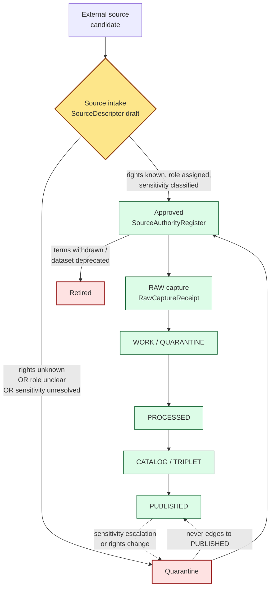

<!-- [KFM_META_BLOCK_V2]
doc_id: kfm://doc/registers/source-authority
title: Source Authority Register
type: standard
version: v1
status: draft
owners: Source steward (primary); Docs steward (co-maintainer)
created: TODO-YYYY-MM-DD
updated: TODO-YYYY-MM-DD
policy_label: public
related:
  - docs/doctrine/directory-rules.md
  - docs/doctrine/authority-ladder.md
  - docs/doctrine/truth-posture.md
  - docs/doctrine/trust-membrane.md
  - docs/doctrine/lifecycle-law.md
  - docs/registers/AUTHORITY_LADDER.md
  - docs/registers/DRIFT_REGISTER.md
  - docs/registers/VERIFICATION_BACKLOG.md
  - control_plane/source_authority_register.yaml
  - contracts/source/source_descriptor.md
  - schemas/contracts/v1/source/source-descriptor.json
  - policy/sensitivity/
  - data/registry/
  - docs/adr/ADR-0001-schema-home.md
tags: [kfm, register, source, authority, governance, source-role, doctrine]
notes:
  - Doctrinal register; human-facing pair to control_plane/source_authority_register.yaml.
  - Source role is fixed at admission and never upgraded by promotion.
  - Path placement PROPOSED until per-root README and ADR confirm.
[/KFM_META_BLOCK_V2] -->

# Source Authority Register

> **What KFM treats as a source, what role each source carries, and the governance gates that prevent those roles from collapsing into one another.**


<!-- TODO: replace placeholder Shields.io badges with verified status, CI, and last-updated targets once mounted-repo and CI evidence is available. -->

| Field | Value |
|---|---|
| **Document type** | Doctrinal register (human-facing) |
| **Authority of contents** | CONFIRMED — source-role taxonomy, anti-collapse rule, admission discipline |
| **Authority of file path** | PROPOSED — placement under `docs/registers/` follows Directory Rules §6.1; not yet verified in mounted repo |
| **Machine-readable counterpart** | `control_plane/source_authority_register.yaml` (PROPOSED per Directory Rules §6.2) |
| **Owners** | Source steward (primary); Docs steward (co-maintainer) |
| **Reviewers required** | Source steward + Docs steward; ADR required to change source-role vocabulary (Directory Rules §2.4) |
| **Last updated** | TODO-YYYY-MM-DD |

> [!IMPORTANT]
> This register is **navigational, not authoritative**. EvidenceBundle, the canonical schemas under `schemas/contracts/v1/source/`, and the machine-readable register at `control_plane/source_authority_register.yaml` remain the canonical sources for any specific claim. If a row here disagrees with the machine register or with a SourceDescriptor in the catalog, file a drift entry in [`docs/registers/DRIFT_REGISTER.md`](./DRIFT_REGISTER.md) — do not treat this page as a correction.

---

## Quick jump

- [1 · Scope and authority](#1--scope-and-authority)
- [2 · Repo fit](#2--repo-fit)
- [3 · Canonical source roles](#3--canonical-source-roles)
- [4 · Anti-collapse rule (the doctrine)](#4--anti-collapse-rule-the-doctrine)
- [5 · SourceDescriptor field surface](#5--sourcedescriptor-field-surface)
- [6 · SourceAuthorityRegister states](#6--sourceauthorityregister-states)
- [7 · Source families crosswalk](#7--source-families-crosswalk)
- [8 · Source admission lifecycle](#8--source-admission-lifecycle)
- [9 · Roles and separation of duties](#9--roles-and-separation-of-duties)
- [10 · Anti-patterns](#10--anti-patterns)
- [11 · Verification backlog](#11--verification-backlog)
- [12 · Related docs](#12--related-docs)
- [Appendix A · Illustrative SourceDescriptor (PROPOSED)](#appendix-a--illustrative-sourcedescriptor-proposed)
- [Appendix B · Conformance language](#appendix-b--conformance-language)

---

## 1 · Scope and authority

This register answers four operational questions:

1. **What is a source in KFM?** A named, rights-evaluated, role-tagged input registered through the admission gate.
2. **What roles can a source carry?** A closed vocabulary of seven: `observed`, `regulatory`, `modeled`, `aggregate`, `administrative`, `candidate`, `synthetic`.
3. **What may a source role become?** **It does not change.** Source role is fixed at admission and preserved through every promotion. Correction issues a new descriptor; promotion does not relabel.
4. **What does this register decide?** Nothing on its own. It documents the doctrine, names the families, and points at the machine-readable register, schemas, contracts, and policies that decide.

**What this register does:**

- States the canonical source-role vocabulary (`§3`).
- States the anti-collapse rule and its DENY surfaces (`§4`).
- Maps source-role to the `SourceDescriptor` field surface (`§5`).
- Names approved / quarantined / retired states for the register itself (`§6`).
- Names source families per domain at a level of abstraction navigable by reviewers (`§7`).
- Documents admission lifecycle and steward separation (`§8`–`§9`).
- Lists anti-patterns and open ADR-class verification items (`§10`–`§11`).

**What this register does not do:**

- Decide whether a specific source may be admitted. (That is the source steward's call, recorded in a `SourceDescriptor` and a `SourceIntakeRecord`, against `policy/sensitivity/` and `policy/rights/`.)
- Define field-level shape. (That lives in `schemas/contracts/v1/source/`.)
- Define object meaning. (That lives in `contracts/source/`.)
- Decide release. (That is `release/`, gated by `ReleaseManifest` and the separation-of-duties matrix.)

> [!NOTE]
> **Authority of contents** is CONFIRMED — the source-role taxonomy, the anti-collapse rule, the admission discipline, and the "role fixed at admission" rule are doctrine of long standing in the KFM domain materials. **Authority of any specific path quoted here** is PROPOSED until verified against mounted-repo evidence, per Directory Rules §0.

[↑ Back to top](#source-authority-register)

---

## 2 · Repo fit

This register is one of several governance layers that, together, make source authority inspectable. They MUST NOT collapse into one another.

| Layer | Path (PROPOSED) | Role | Authority class |
|---|---|---|---|
| Doctrine | `docs/doctrine/directory-rules.md`, `…/authority-ladder.md` | Tells reviewers **why** source role is first-class. | Canonical doctrine |
| **This register** | `docs/registers/SOURCE_AUTHORITY.md` | Human-facing reference: roles, anti-collapse, families. | Navigational |
| Machine register | `control_plane/source_authority_register.yaml` | Operational "what governs what" — approved/quarantined/retired entries with metadata. | Machine-readable register |
| Object meaning | `contracts/source/source_descriptor.md`, `…/ingest_receipt.md` | What a `SourceDescriptor` **means**. | Canonical meaning |
| Machine shape | `schemas/contracts/v1/source/source-descriptor.json` (default per ADR-0001) | What a `SourceDescriptor` **is shaped like**. | Canonical shape |
| Policy | `policy/sensitivity/`, `policy/rights/` | Admissibility decisions; fail-closed defaults. | Canonical policy |
| Data registry | `data/registry/` | Per-source identity, rights, sensitivity records (operational). | Canonical data |
| Lineage anchor | `docs/sources/` | Source-descriptor standards, source-family standards. | Canonical doctrine |

**Directory Rules basis:** Directory Rules §6.1 lists `docs/registers/` as the home for governance registers (`AUTHORITY_LADDER`, `CANONICAL_LINEAGE_EXPLORATORY`, `DRIFT_REGISTER`, `VERIFICATION_BACKLOG`, `OBJECT_FAMILY_MAP`). Directory Rules §6.2 lists `control_plane/source_authority_register.yaml` as the machine-readable form. Adding a human-facing `SOURCE_AUTHORITY.md` sibling fits the pattern but is not pre-listed in §6.1; flag as PROPOSED until the per-root `docs/registers/README.md` accepts it.

> [!WARNING]
> **Do not collapse layers.** A diff that moves source-role enum into `policy/`, or moves a `SourceAuthorityRegister` entry into `contracts/`, or treats this page as the canonical decision record for a source admission, violates Directory Rules §2.4(5) (no parallel home for sources / registries) and requires an ADR.

[↑ Back to top](#source-authority-register)

---

## 3 · Canonical source roles

KFM treats **source role** as a first-class identity attribute set at admission and preserved through every promotion. The vocabulary is **closed**.

| Role | Definition (CONFIRMED doctrine) | Typical example | Allowed downstream usage |
|---|---|---|---|
| **observed** | A direct reading, measurement, or first-hand evidentiary record tied to a place and time. | Stream-gauge stage reading; soil pedon description; air-quality monitor sample; ground archaeological observation. | May feed `modeled` or `aggregate` products. **Never** relabeled as `regulatory` or `administrative`. |
| **regulatory** | An authoritative determination by a regulating body with legal or administrative force. | NFHL flood-zone designation; air-quality non-attainment ruling; designated critical-habitat unit; protected-species listing. | Cite as regulatory context. **Never** labeled an `observed` event or a `modeled` estimate. |
| **modeled** | A derived product from inputs, assumptions, or fitted parameters; uncertainty and input provenance MUST be preserved. | Hydrograph reconstruction; smoke-trajectory model; suitability raster; population-estimation surface; AOD raster. | Cite with model identity, run receipt, and bounds. **Never** labeled an observation. |
| **aggregate** | A published summary, total, or average over a unit (county, year, watershed) with irreversible loss of individual-record fidelity. | USDA county-level crop totals; Census tract aggregates; decadal climate normal; resource-estimate summary. | Cite with an `AggregationReceipt`. **Never** treated as a per-place record. |
| **administrative** | A compiled record produced by an agency for administration, registration, or accounting — not necessarily an observation or a regulation. | Land-office tract book; deed-index compilation; county-incorporation record; transport-facility roster. | Cite as administrative context. **Never** collapsed with observation or regulation. |
| **candidate** | A proposed record awaiting validation, evidence resolution, deduplication, or steward review; not yet authoritative. | Quarantined connector output; unresolved person assertion; duplicate site candidate; unmerged crop observation. | May be cited as `candidate` evidence in `WORK` / `QUARANTINE`. **MUST NOT** appear in `PUBLISHED` without promotion. |
| **synthetic** | Content generated by simulation, reconstruction, AI, or interpolation that has no underlying first-hand observation. | Synthetic terrain surface; reconstructed historical scene; AI-drafted summary of an `EvidenceBundle`. | Carries a `RealityBoundaryNote` and a `RepresentationReceipt`. **Never** presented or queried as observed reality. |

> [!IMPORTANT]
> **Promotion does not upgrade source role.** A `modeled` reconstruction does not become `observed` because it was promoted to `PROCESSED`. An `aggregate` summary does not become a per-place observation because it was joined into a layer. A `candidate` record does not become authoritative because it crossed a gate without explicit role transition. Role transition is a **separate governed transition** with its own evidence and review requirements, and it produces a **new** `SourceDescriptor` with a `CorrectionNotice` rather than editing the old one in place.

[↑ Back to top](#source-authority-register)

---

## 4 · Anti-collapse rule (the doctrine)

> **CONFIRMED doctrine.** An observed reading is not interchangeable with a modeled estimate. A regulatory determination is not interchangeable with an administrative compilation. An aggregate publication is not interchangeable with candidate evidence. Synthetic content is never the same thing as observed reality. The lifecycle and the governed API both **fail closed** when these roles are conflated.

### 4.1 Collapse patterns and DENY surfaces

| Collapse pattern | Domains most at risk | Denied outcome | Required guardrail |
|---|---|---|---|
| `modeled` product labeled or queried as `observed`. | Air; Hydrology; Habitat; Agriculture; 3D/Planetary | DENY at publication; ABSTAIN at AI surface. | `ModelRunReceipt` + uncertainty surface + role-preserving DTO field. |
| `regulatory` zone labeled as an `observed` flood / event. | Hydrology; Hazards; Air | DENY publication of regulatory layer as event evidence. | Separate regulatory-layer and observed-event lanes; banner in UI. |
| `aggregate` cited as a per-place truth. | Agriculture; People; Geology; Air | DENY join from aggregate cell to single record; ABSTAIN at AI. | `AggregationReceipt`; geometry-scope guard; matrix-cell semantics. |
| `administrative` compilation cited as `observation`. | People/Land; Settlements; Roads | DENY publication of compilation as observed-event timeline. | Source-role tag preserved; named `LifeEvent` / `AdminEvent` types. |
| `candidate` record exposed on a public surface. | All | DENY at trust membrane; route back to `QUARANTINE`. | Promotion gate; no `PUBLISHED` edge to `WORK` / `QUARANTINE`. |
| `synthetic` content presented as observed reality. | Planetary / 3D; AI; Archaeology; Habitat | DENY publication; HOLD for steward review; ABSTAIN at AI. | `RealityBoundaryNote`; `RepresentationReceipt`; UI badge. |
| AI text treated as evidence. | All Focus Mode surfaces | DENY publication; ABSTAIN at Focus Mode; `AIReceipt` mandatory. | Cite-or-abstain; `AIReceipt`; release state required. |

### 4.2 Where the guardrails live

The doctrine is doctrine, not enforcement. Enforcement lives elsewhere — and **must** live elsewhere, or this register is doing the wrong job.

- **Schema-level enforcement** — `schemas/contracts/v1/source/source-descriptor.json` rejects out-of-vocabulary roles. *(PROPOSED — NEEDS VERIFICATION: actual file presence and enum membership.)*
- **Validator-level enforcement** — `tools/validators/source/` runs role-pair consistency checks at admission and at promotion gates. *(PROPOSED — NEEDS VERIFICATION.)*
- **Policy-level enforcement** — `policy/runtime/` denies cross-role joins (aggregate ↔ point, synthetic ↔ observed) at the governed-API boundary. *(PROPOSED — NEEDS VERIFICATION.)*
- **UI-level signaling** — Evidence Drawer and trust-state badges surface the role explicitly so that public clients never paraphrase a role away. *(CONFIRMED doctrine; implementation NEEDS VERIFICATION.)*

[↑ Back to top](#source-authority-register)

---

## 5 · SourceDescriptor field surface

> [!NOTE]
> **PROPOSED shape — not authoritative.** The canonical schema home for `SourceDescriptor` defaults to `schemas/contracts/v1/source/source-descriptor.json` per Directory Rules §7.4 and ADR-0001. The fields below are illustrative of the role surface only. The authoritative field list is whatever the mounted schema admits. **NEEDS VERIFICATION: actual field names, enum members, and presence in the repository.**

| Field | Type / vocabulary | Required? | Notes |
|---|---|---|---|
| `source_role` | enum: `observed \| regulatory \| modeled \| aggregate \| administrative \| candidate \| synthetic` | MUST | Set at admission. Never edited in place; corrections produce a new descriptor and a `CorrectionNotice`. |
| `role_authority` | string (issuing body / model identity / steward) | MUST when role in `{regulatory, modeled, aggregate}` | Disambiguates the authoring authority for downstream cite text. |
| `role_aggregation_unit` | geometry-scope token (county, HUC, tract, year, decade, …) | MUST when `source_role = aggregate` | Prevents geometry-scope drift on join. |
| `role_model_run_ref` | `EvidenceRef` → `ModelRunReceipt` | MUST when `source_role = modeled` | Pins inputs, parameters, version that produced the value. |
| `role_synthetic_basis` | `{ method, inputs, reality_boundary_note_ref }` | MUST when `source_role = synthetic` | Records what is and is not real in the carrier. |
| `role_candidate_disposition` | enum: `pending \| merged \| rejected \| quarantined` | MUST when `source_role = candidate` | Tracks promotion state; `PUBLISHED` edge forbidden until merged. |

Other `SourceDescriptor` fields (identity, rights, sensitivity, cadence, retrieval plan, citation block) are documented in `contracts/source/source_descriptor.md` and are out of scope here.

[↑ Back to top](#source-authority-register)

---

## 6 · SourceAuthorityRegister states

`SourceAuthorityRegister` is the **operational** record of which sources KFM has admitted, which it has quarantined, and which it has retired. The doctrine recognises four lifecycle states for a source authority entry.

| State | Meaning | Public exposure | Required to leave state |
|---|---|---|---|
| **proposed** | Source candidate registered; rights / role / sensitivity not yet resolved. | None. Visible only to source steward and reviewers. | Admission decision recorded as `SourceIntakeRecord`. |
| **approved** | Admitted source; role assigned; rights and sensitivity classified. | Permitted in `RAW` and downstream lanes subject to lifecycle gates and policy. | Retirement, quarantine on rights/sensitivity change, or a role-transition correction (new descriptor). |
| **quarantined** | Approved source that failed a downstream check (validation, rights revocation, sensitivity escalation, source-role inconsistency). | None until cleared. Any downstream derivatives are flagged stale and audited for invalidation. | Re-evaluation by source steward; resolution recorded; either restoration to `approved` or transition to `retired`. |
| **retired** | Source removed from active use (terms withdrawn, dataset deprecated, owner notice, superseded by a successor source). | Existing `PUBLISHED` artifacts citing the source remain valid until correction lineage decides otherwise. No new admissions. | One-way transition. Successor source (if any) is admitted as a new entry. |

> [!CAUTION]
> **Quarantine is not a publishable staging area.** A quarantined source has zero edge to `PUBLISHED`; the trust membrane DENIES any public-surface read of `WORK` or `QUARANTINE`. Quarantine is a place from which sources either return to `approved` or move to `retired`. Treating it as a soft-launch holding pen collapses the trust membrane.

[↑ Back to top](#source-authority-register)

---

## 7 · Source families crosswalk

The families below are **representative**, not exhaustive. The authoritative per-source detail is the per-source entry in `control_plane/source_authority_register.yaml` (PROPOSED) and the relevant `SourceDescriptor` in `data/registry/`. Domain-specific dossiers (Atlas chapters 3–18) name the families per domain.

> [!NOTE]
> Every row below carries **NEEDS VERIFICATION** for rights, current terms, sensitivity tier, and update cadence. The role column is **typical** for the family — actual role is set per source at admission and may differ.

| Domain | Source family (representative) | Typical role(s) | Sensitivity hooks |
|---|---|---|---|
| Hydrology | USGS NWIS gauges; HUC / WBD | observed / regulatory | Public-safe; standard attribution. |
| Soil / Agriculture | SSURGO / gSSURGO; Kansas Mesonet; USDA NASS QuickStats / Crop Progress | observed / aggregate / modeled | Aggregate fields require `AggregationReceipt`; private-landowner sensitive joins fail closed. |
| Habitat / Flora / Fauna | KDWP listings; Kansas Biological Survey / KU herbarium; USFWS ECOS; NatureServe Explorer; GBIF; iDigBio; iNaturalist | observed / regulatory / aggregate | Rare-species exact location DENIED by default; geoprivacy transform receipt required. |
| Atmosphere / Air | OpenAQ-like aggregators; EPA AQS; AirNow; CAMS / ECMWF model fields; HRRR-Smoke; HMS smoke; GOES/ABI AOD; VIIRS fire/hotspot | observed / modeled / aggregate | Emergency / life-safety replacement forbidden; not-for-life-safety disclaimer. |
| Hazards | NOAA Storm Events / NCEI; NWS alerts; FEMA Disaster Declarations / OpenFEMA; FEMA NFHL; USGS Earthquake Catalog; NOAA HMS Fire and Smoke; NASA FIRMS | observed / regulatory / administrative | Regulatory layer MUST NOT be cited as observed event. |
| Geology | KGS surfaces; mineral / resource summaries | observed / aggregate / modeled | Aggregate resource estimates require role tag preservation. |
| Roads / Rail / Trade | WZDx feeds; DOT inventories; rail / highway facility rosters | administrative / observed | Administrative compilation MUST NOT be cited as observed event timeline. |
| Settlements / Infrastructure | Incorporation records; facility rosters; critical-infrastructure inventories | administrative / observed | Exact critical-infrastructure detail RESTRICTED/DENIED public precision. |
| Archaeology | State site inventory (SHPO-equivalent); NRHP-like listings; field survey forms; excavation records; artifact / collection / repository records; lab reports; historic maps / plats / land records / newspapers; oral history and cultural knowledge | observed / context / model | Exact site location DENIED public by default; cultural / steward review required. |
| People / DNA / Land | Vital, cemetery, church, school, military, census, court, probate records; GEDCOM / GEDZip; DNA vendor match data; land instruments; assessor / tax rolls; plat / survey / PLSS geometry | administrative / observed / aggregate | Living-person data DENIED by default; DNA / genomics DENIED by default; aggregate-to-point inference checks required. |
| Planetary / 3D / Synthetic | Reconstructed scenes; synthetic terrain surfaces; generated narrative | synthetic | `RealityBoundaryNote` + `RepresentationReceipt` mandatory; never presented as observed. |

[↑ Back to top](#source-authority-register)

---

## 8 · Source admission lifecycle

The admission gate is the membrane between an external candidate and the KFM lifecycle. Role is set here. After this point, role is no longer editable.



> [!NOTE]
> The diagram reflects the doctrine in [Directory Rules](../doctrine/directory-rules.md) and the lifecycle invariant `RAW → WORK / QUARANTINE → PROCESSED → CATALOG / TRIPLET → PUBLISHED`. The presence of any specific receipt type (`RawCaptureReceipt`, etc.) in the mounted repo is **NEEDS VERIFICATION**.

### 8.1 Receipts emitted along the path

| Step | Receipt or record (PROPOSED) | Citation |
|---|---|---|
| Pre-RAW admission attempt | `event_envelope`, `prefilter_output`, `event_run_receipt` *(PROPOSED — pre-RAW edge)* | Build manual §7 lifecycle |
| Source admission | `SourceDescriptor`, `SourceIntakeRecord` | Encyclopedia Appendix E |
| Rights / terms evaluation | `RightsDecision`, `PolicyDecision` | Encyclopedia §13 |
| RAW capture | `RawCaptureReceipt` | Encyclopedia Appendix E |
| Quarantine | `QuarantineRecord` | Encyclopedia Appendix E |
| Normalization | `TransformReceipt`, `DatasetVersion` | Encyclopedia Appendix E |
| Validation | `ValidationReport` | Encyclopedia Appendix E |
| Aggregation | `AggregationReceipt` | Atlas v1.1 §24.2 |
| Synthetic-content publication path | `RealityBoundaryNote`, `RepresentationReceipt` | Atlas v1.1 §24.1.2 |
| Public release | `ReleaseManifest`, `PromotionDecision`, rollback target | Encyclopedia Appendix E |
| Correction | `CorrectionNotice`, `RollbackCard` | Atlas v1.1 §24.2 |

[↑ Back to top](#source-authority-register)

---

## 9 · Roles and separation of duties

Source authority touches at least four reviewer roles. They MAY overlap in routine cases; they MUST NOT collapse in policy-significant or sensitive lanes.

| Role | Owns | Separation requirement |
|---|---|---|
| **Source steward** | Source admission, rights confirmation, sensitivity tag, role assignment. Owns the `SourceDescriptor` lifecycle. | Yes, for routine admission. **No** when source has unresolved rights or sovereignty — a sensitivity reviewer or rights-holder representative MUST co-sign. |
| **Sensitivity reviewer** | `RedactionReceipt`s, tier transitions, deny-by-default reviews for sensitive content. | Co-required for sensitive families (archaeology, fauna/flora rare-species, living-person/DNA, critical infrastructure). |
| **Rights-holder representative** | Sovereignty, cultural-heritage, or consent-based release decisions. | Required for archaeology, sovereign data, living-person data, DNA data. |
| **Docs steward** | Integrity of this register, drift entries, ADR index. | Co-required for changes to this file and to the source-role vocabulary. |

> [!TIP]
> If you cannot identify which steward owns the admission of a given source, the answer is not "the AI" and not "the renderer." The answer is **the source steward** for that source family. If no steward is named, that itself is a drift entry: file it under [`docs/registers/DRIFT_REGISTER.md`](./DRIFT_REGISTER.md).

[↑ Back to top](#source-authority-register)

---

## 10 · Anti-patterns

> [!WARNING]
> These patterns are **DENIED**, not "discouraged." Each has a guardrail named in `§4.1` or a stewardship rule named in `§9`.

- **Role upgrade by promotion.** Promoting a `modeled` raster to `PROCESSED` and citing it as `observed`. Role is fixed at admission; promotion is a state transition, not a relabel.
- **Public read of `WORK` or `QUARANTINE`.** The trust membrane forbids it. Renderers, AI surfaces, and exports MUST use the governed API and consume only `PUBLISHED` artifacts.
- **AI relabel by paraphrase.** Focus Mode paraphrasing an `aggregate` summary as a per-place fact. Cite-or-abstain, `AIReceipt`, and outcome envelope are mandatory.
- **Aggregate-as-point join.** Joining a county-level aggregate to a parcel for inference. `AggregationReceipt` is required; geometry-scope guard MUST DENY.
- **Synthetic-as-observed.** Surfacing a reconstructed scene without a `RealityBoundaryNote` and `RepresentationReceipt`. Synthetic content is never observed reality.
- **Silent role rewrite.** Editing `source_role` on an existing `SourceDescriptor` in place. Corrections produce a **new** descriptor + a `CorrectionNotice`; old derivatives MUST be invalidated.
- **Treating this register as authority.** This file is navigational. Authority lives in the schemas, contracts, policies, machine register, and EvidenceBundle. A diff that cites only this page as justification is a missed review.

[↑ Back to top](#source-authority-register)

---

## 11 · Verification backlog

These are items this register does **not** resolve; track them in [`docs/registers/VERIFICATION_BACKLOG.md`](./VERIFICATION_BACKLOG.md) and address by ADR or schema PR.

- **NEEDS VERIFICATION** — Presence of `control_plane/source_authority_register.yaml` in the mounted repo, and conformance with this register's vocabulary.
- **NEEDS VERIFICATION** — Presence and shape of `schemas/contracts/v1/source/source-descriptor.json`; in particular, whether the `source_role` enum matches §3 exactly.
- **NEEDS VERIFICATION** — Whether `contracts/source/source_descriptor.md` exists and is the single authoritative meaning document.
- **NEEDS VERIFICATION** — Policy bundles in `policy/sensitivity/` and `policy/rights/` that DENY cross-role joins and gate sensitivity tiers.
- **NEEDS VERIFICATION** — Validator presence under `tools/validators/source/` (role-pair consistency, aggregation scope, candidate disposition).
- **OPEN (ADR-S-04)** — Canonical source-role vocabulary and evolution rule. *(Directory Rules §2.4 requires an ADR before adding, removing, or renaming a source-role enum member.)*
- **OPEN (ADR-S-05)** — Sensitivity tier scheme adoption (T0–T4) for source-authority entries, per Atlas v1.1 §24.5.
- **OPEN** — Per-source CARE / sovereignty workflow for archaeology and people/DNA/land sources (see Atlas v1.1 §24.7).

[↑ Back to top](#source-authority-register)

---

## 12 · Related docs

- [Directory Rules](../doctrine/directory-rules.md) — placement authority for this register.
- [Authority Ladder](./AUTHORITY_LADDER.md) — how doctrine, repo, source, and runtime evidence are ranked. *(PROPOSED neighbor; TODO if absent.)*
- [Drift Register](./DRIFT_REGISTER.md) — where to file disagreements between this page and the machine register.
- [Verification Backlog](./VERIFICATION_BACKLOG.md) — where the open items in `§11` are tracked.
- [Object Family Map](./OBJECT_FAMILY_MAP.md) — crosswalk of object families to semantic homes. *(PROPOSED neighbor; TODO if absent.)*
- `control_plane/source_authority_register.yaml` — the machine-readable counterpart.
- `contracts/source/source_descriptor.md` — `SourceDescriptor` meaning.
- `schemas/contracts/v1/source/source-descriptor.json` — `SourceDescriptor` shape.
- `policy/sensitivity/`, `policy/rights/` — admissibility decisions.
- `docs/sources/` — source-descriptor standards, source-family standards.
- `docs/adr/ADR-0001-schema-home.md` — schema-home convention.

[↑ Back to top](#source-authority-register)

---

## Appendix A · Illustrative SourceDescriptor (PROPOSED)

> [!NOTE]
> This snippet is **illustrative**. Field names and structure are PROPOSED to communicate intent; the authoritative shape is whatever `schemas/contracts/v1/source/source-descriptor.json` admits.

<details>
<summary>Example: a modeled smoke-trajectory source (illustrative only)</summary>

```json
{
  "source_id": "kfm://source/example-smoke-traj-2026q1",
  "source_role": "modeled",
  "role_authority": "NOAA HRRR-Smoke v4 (illustrative)",
  "role_model_run_ref": "kfm://evidence/model-run/hrrr-smoke/2026-05-12T18Z",
  "rights": {
    "license": "Public domain (US Govt work)",
    "attribution_required": true,
    "redistribution_allowed": true
  },
  "sensitivity": {
    "tier": "T0",
    "deny_by_default": false
  },
  "cadence": {
    "update_interval": "PT1H",
    "stale_after": "PT3H"
  },
  "retrieval": {
    "method": "HTTPS pull",
    "endpoint": "TODO"
  },
  "temporal_scope": {
    "source_time_field": "valid_time",
    "valid_time_required": true
  },
  "ingest_hash": "sha256:TODO",
  "citation": "TODO citation block"
}
```

</details>

<details>
<summary>Example: an aggregate USDA county-total source (illustrative only)</summary>

```json
{
  "source_id": "kfm://source/example-usda-county-corn-2024",
  "source_role": "aggregate",
  "role_authority": "USDA NASS QuickStats (illustrative)",
  "role_aggregation_unit": "county-year",
  "rights": {
    "license": "Public",
    "attribution_required": true,
    "redistribution_allowed": true
  },
  "sensitivity": {
    "tier": "T0",
    "deny_by_default": false,
    "join_guards": [
      "DENY join from aggregate cell to single record",
      "ABSTAIN at AI for per-place questions"
    ]
  },
  "cadence": { "update_interval": "P1M", "stale_after": "P3M" },
  "ingest_hash": "sha256:TODO",
  "citation": "TODO citation block"
}
```

</details>

[↑ Back to top](#source-authority-register)

---

## Appendix B · Conformance language

This register uses RFC 2119-style conformance language consistent with Directory Rules §2.2:

- **MUST / MUST NOT** — non-negotiable. PRs that violate MUST are not merged absent an approved ADR.
- **SHOULD / SHOULD NOT** — strong default. Deviation requires justification.
- **MAY** — permitted; stay consistent within the lane.

Truth labels used in this document:

- **CONFIRMED** — verified from attached doctrine (Directory Rules, Atlas v1.1, Encyclopedia).
- **PROPOSED** — design or path not yet verified in mounted-repo implementation.
- **NEEDS VERIFICATION** — checkable, but not yet checked strongly enough to act as fact.
- **UNKNOWN** — not resolvable without more evidence.

[↑ Back to top](#source-authority-register)

---

**Related docs:** [Directory Rules](../doctrine/directory-rules.md) · [Drift Register](./DRIFT_REGISTER.md) · [Verification Backlog](./VERIFICATION_BACKLOG.md) · `control_plane/source_authority_register.yaml` · `contracts/source/source_descriptor.md`

**Last updated:** TODO-YYYY-MM-DD · **Doc id:** `kfm://doc/registers/source-authority` · **Status:** draft

[↑ Back to top](#source-authority-register)
