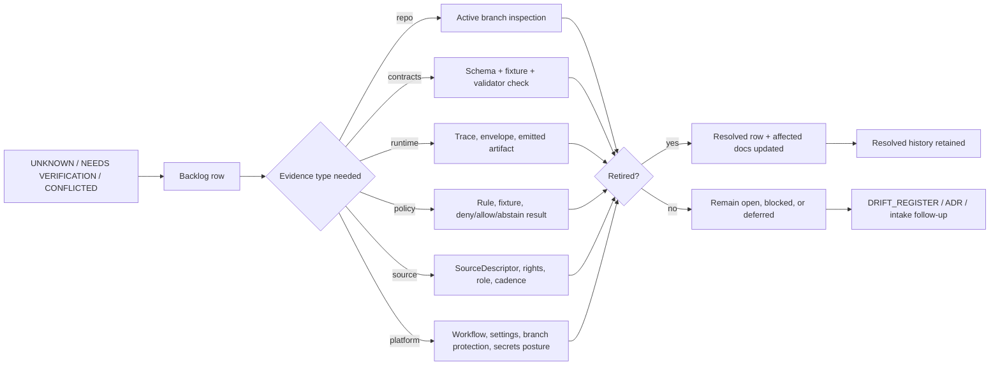

<!-- [KFM_META_BLOCK_V2]
doc_id: kfm://doc/TODO-NEEDS-UUID
title: KFM Verification Backlog
type: standard
version: v1
status: draft
owners: TODO-NEEDS-VERIFICATION
created: 2026-04-28
updated: 2026-04-28
policy_label: TODO-NEEDS-VERIFICATION
related: [docs/registers/AUTHORITY_LADDER.md, docs/registers/CANONICAL_LINEAGE_EXPLORATORY.md, docs/registers/DRIFT_REGISTER.md, docs/intake/IDEA_INTAKE.md, docs/runbooks/publication.md, docs/runbooks/correction.md, docs/runbooks/rollback.md, contracts/OBJECT_MAP.md, schemas/README.md, policy/README.md, tests/README.md]
tags: [kfm, verification, backlog, governance, evidence, control-plane]
notes: [Draft register for docs/registers/VERIFICATION_BACKLOG.md. doc_id, owners, policy_label, active-branch path existence, and related-link validity require direct repo verification before merge. created/updated dates reflect draft generation date and should be reconciled with commit history if different.]
[/KFM_META_BLOCK_V2] -->

<a id="top"></a>

# KFM Verification Backlog

Maintained register of **UNKNOWN**, **NEEDS VERIFICATION**, and **CONFLICTED** claims that must be retired before KFM documentation, contracts, tests, release notes, or public-facing outputs can state them as fact.


> [!IMPORTANT]
> This file is a **control-plane register**, not a proof object and not a substitute for verification.  
> A row in this backlog means: “this claim is important enough to track, but not yet proven strongly enough to use as implementation fact.”

**Quick jump:** [Scope](#scope) · [Repo fit](#repo-fit) · [Accepted inputs](#accepted-inputs) · [Exclusions](#exclusions) · [How to use this register](#how-to-use-this-register) · [Backlog lifecycle](#backlog-lifecycle) · [Open backlog](#open-backlog) · [Closure checklist](#closure-checklist) · [Appendix](#appendix)

---

## Scope

`docs/registers/VERIFICATION_BACKLOG.md` tracks unresolved verification work across KFM’s doctrine, repo structure, contracts, schemas, policy, tests, data lifecycle, source registries, UI/runtime boundaries, release controls, and sensitive domain lanes.

It exists to prevent three failure modes:

1. **Doctrinal overclaiming** — treating a strong architecture PDF or README statement as proof of current implementation.
2. **Repo-surface overclaiming** — treating directory presence, README language, or scaffold lineage as proof of runtime behavior.
3. **Silent uncertainty loss** — allowing `UNKNOWN`, `NEEDS VERIFICATION`, or `CONFLICTED` items to disappear without evidence, review, or closure.

### Verification posture

| Label | Use in this register | Closure condition |
|---|---|---|
| `UNKNOWN` | Not verified strongly enough from active repo, tests, artifacts, source records, logs, or current external authority. | Replace with `CONFIRMED`, `PROPOSED`, `DEFERRED`, or `REJECTED` after reviewable evidence. |
| `NEEDS VERIFICATION` | Check is concrete and required before a claim, release, source activation, or enforcement statement. | Evidence is inspected and linked; affected docs/contracts/tests are updated. |
| `CONFLICTED` | Source materials, path conventions, schema homes, or ownership surfaces imply incompatible interpretations. | ADR, register decision, or migration note resolves the conflict. |
| `PROPOSED` | Recommended design or path not verified as current implementation. | Accepted as planned work, implemented and tested, or explicitly deferred. |
| `CONFIRMED` | Verified from admissible evidence. | Remove from open backlog or preserve in resolved history with evidence reference. |

[Back to top](#top)

---

## Repo fit

> [!NOTE]
> Adjacent paths below are expected KFM control-plane neighbors. Verify active-branch existence and relative-link validity before merge.

| Relationship | Target path | Expected role |
|---|---|---|
| Sibling | `docs/registers/AUTHORITY_LADDER.md` | Defines how source classes are ranked before a claim is upgraded. |
| Sibling | `docs/registers/CANONICAL_LINEAGE_EXPLORATORY.md` | Classifies canon, lineage, exploratory inputs, emitted artifacts, and proof families. |
| Sibling | `docs/registers/DRIFT_REGISTER.md` | Records contradictions, naming drift, source drift, schema drift, and path drift. |
| Upstream | `docs/intake/IDEA_INTAKE.md` | Sends `REPO VERIFY`, `EVIDENCE GAP`, and `ADR CANDIDATE` items here. |
| Upstream | `docs/runbooks/publication.md` | Uses this backlog to block release claims that still lack proof. |
| Upstream | `docs/runbooks/correction.md` and `docs/runbooks/rollback.md` | Uses this backlog when withdrawal, supersession, or rollback exposes unresolved proof gaps. |
| Downstream | `contracts/OBJECT_MAP.md` | Retires object-family ambiguity by defining semantic objects and lifecycle roles. |
| Downstream | `schemas/README.md` | Retires executable shape and schema-home ambiguity. |
| Downstream | `policy/README.md` | Retires fail-closed, rights, sensitivity, AI-runtime, and promotion-policy uncertainty. |
| Downstream | `tests/README.md` | Retires fixture, validator, runtime-proof, release-assembly, correction, and accessibility uncertainty. |

[Back to top](#top)

---

## Accepted inputs

Add a row here when the uncertainty affects KFM truth, review, publication, policy, runtime trust, source activation, or maintainer navigation.

| Accepted input | Example | Why it belongs here |
|---|---|---|
| Repo/path uncertainty | `schemas/contracts/v1/` vs `contracts/` authority | Prevents duplicate or conflicting machine contracts. |
| Runtime uncertainty | Whether `ANSWER / ABSTAIN / DENY / ERROR` envelopes are emitted by actual routes | Prevents docs from claiming finite runtime behavior without traces. |
| Workflow uncertainty | Whether workflow YAML exists and is merge-blocking | Prevents enforcement claims from being inferred from README prose. |
| Review/ownership uncertainty | CODEOWNERS scope or branch protection status | Prevents false claims about separation of duty or required review. |
| Source rights uncertainty | Redistribution terms, steward requirements, source role | Blocks unsafe public release. |
| Sensitive-location uncertainty | Rare species, archaeology, critical infrastructure, living-person, DNA, cultural sensitivity | Fails closed until exact-location exposure and release class are reviewed. |
| Proof-object uncertainty | Receipts, proofs, manifests, release bundles, rollback references | Prevents rhetorical proof vocabulary from becoming a fake control. |
| External standard/version uncertainty | OpenAPI, STAC, DCAT, PROV, GeoParquet, OPA/Rego, Sigstore/Cosign, MapLibre/Cesium pins | Ensures version-sensitive claims are rechecked before package or contract pinning. |

[Back to top](#top)

---

## Exclusions

Do **not** use this register as a catch-all backlog.

| Does not belong here | Goes instead | Reason |
|---|---|---|
| New feature ideas without a concrete evidence gap | `docs/intake/IDEA_INTAKE.md` | Ideas need triage before they become verification work. |
| Known contradictions with enough evidence to describe both sides | `docs/registers/DRIFT_REGISTER.md` | Drift belongs in the drift register until a concrete verification action is needed. |
| Domain expansion wish lists | Domain backlog or lane plan | This register tracks truth-risk checks, not scope growth. |
| Release-blocking policy decisions already proven by tests | Promotion or policy runbook | Proven gate behavior should be documented where it is enforced. |
| Generated receipts, proof packs, manifests, and release bundles | `data/receipts/`, `data/proofs/`, `data/manifests/`, or release lane | This file tracks the need to verify them; it does not store them. |
| Long prose explaining doctrine | `docs/doctrine/` or `docs/architecture/` | Registers should stay compact and actionable. |

[Back to top](#top)

---

## How to use this register

### Add a row when

- a doc wants to say “the repo contains…” but current evidence only says “the corpus proposes…”
- a path appears in prior reports but active-branch presence has not been confirmed
- a workflow, validator, policy gate, or test is described but executable inventory is not proven
- source rights, role, sensitivity, cadence, or release class is unresolved
- a UI, map, AI, API, or release surface could accidentally bypass the trust membrane
- a contradiction requires an ADR, register decision, migration note, or active repo inspection

### Close a row only when

- evidence is inspected directly
- the row records what changed
- affected docs, contracts, schemas, policies, tests, runbooks, or registers are updated
- the closure preserves correction lineage instead of deleting uncertainty history
- the result is marked `CONFIRMED`, `DEFERRED`, `REJECTED`, or `SUPERSEDED`

> [!WARNING]
> Do not close a row because a later document repeats the same claim. Repetition is continuity and weighting, not independent proof.

[Back to top](#top)

---

## Backlog lifecycle



### Status values

| Status | Meaning |
|---|---|
| `OPEN` | Verification is needed and unassigned or not started. |
| `IN_PROGRESS` | Verification work has a named owner or active PR. |
| `BLOCKED` | Verification depends on missing access, missing repo checkout, external source terms, steward review, or platform settings. |
| `DEFERRED` | Valid issue, but not required for the next safe slice. |
| `RESOLVED` | Closed with evidence and affected-surface updates. |
| `SUPERSEDED` | Replaced by a newer row, ADR, or register decision. |

### Blocker levels

| Level | Blocks |
|---|---|
| `B0` | Public release, policy-significant release, or trust-boundary claim. |
| `B1` | Implementation-facing docs, contract/schema claims, workflow claims, or runtime claims. |
| `B2` | Maintainer navigation, source intake clarity, or future PR sequencing. |
| `B3` | Maturity improvement; not blocking a safe fixture-first slice. |

[Back to top](#top)

---

## Open backlog

### P0 — Trust boundary, repo truth, and governance controls

| ID | Item | Current label | Blocks | Evidence needed | Expected closure artifact |
|---|---|---:|---|---|---|
| `VFY-000` | Active repo tree, branch, and current commit hash | `NEEDS VERIFICATION` | `B1` implementation-facing docs | Mount or inspect active checkout; record root tree, branch, commit, dirty state, and package markers. | Repo inventory note or updated `docs/architecture/REPO_MAP.md`. |
| `VFY-001` | Adjacent register path existence and naming | `NEEDS VERIFICATION` | `B2` register cross-links | Verify `docs/registers/` files and current naming style. | Link-check pass and register index update. |
| `VFY-002` | CODEOWNERS, branch protection, rulesets, environments, and required checks | `NEEDS VERIFICATION` | `B0` ownership and enforcement claims | Inspect `.github/CODEOWNERS`, repository rulesets, branch protections, environments, and required check settings. | Governance evidence note; update authority/ownership docs. |
| `VFY-003` | Workflow YAML inventory and merge-gate reality | `NEEDS VERIFICATION` | `B1` automation claims | Inventory `.github/workflows/*.yml` or `*.yaml`; distinguish active, drafted, historical, and README-only workflows. | Workflow inventory table plus CI run evidence where available. |
| `VFY-004` | Package manager, language stack, and test runner | `UNKNOWN` | `B1` executable instructions | Inspect lockfiles, package files, CI configs, Makefile, test configs, and app/package boundaries. | Runtime/tooling summary in repo map or relevant README. |
| `VFY-005` | Schema-home authority: `contracts/` vs `schemas/` vs `schemas/contracts/v1/` | `CONFLICTED` | `B1` contract/schema claims | Inspect current tree and docs; decide semantic vs executable authority. | ADR and updated `contracts/OBJECT_MAP.md` / schema README. |
| `VFY-006` | Public clients cannot reach `RAW`, `WORK`, `QUARANTINE`, canonical stores, or direct model runtime | `NEEDS VERIFICATION` | `B0` trust membrane | Inspect routes, client code, deployment config, CORS/proxy rules, and tests. | No-forbidden-path test or security boundary note. |
| `VFY-007` | Source of truth for promotion state | `NEEDS VERIFICATION` | `B0` publication claims | Inspect promotion gate docs, release manifests, policy inputs, review records, and emitted decision objects. | Promotion-state ADR or runbook update. |
| `VFY-008` | Correction and rollback mechanics preserve history | `NEEDS VERIFICATION` | `B0` release/correction claims | Inspect correction tests, rollback references, release history, cache invalidation, and withdrawal flow. | Correction drill evidence or rollback runbook update. |

[Back to top](#top)

---

### P1 — Proof objects, contracts, policy, fixtures, and emitted evidence

| ID | Item | Current label | Blocks | Evidence needed | Expected closure artifact |
|---|---|---:|---|---|---|
| `VFY-009` | `SourceDescriptor` registry and source-role standard | `NEEDS VERIFICATION` | `B1` source activation | Verify source registry home, descriptor schema, role taxonomy, rights fields, cadence fields, and source-status policy. | Source descriptor standard and valid/invalid fixtures. |
| `VFY-010` | `EvidenceRef -> EvidenceBundle` resolution | `NEEDS VERIFICATION` | `B0` cite-or-abstain claims | Inspect schema, resolver, tests, fixtures, and at least one public-safe fixture. | Evidence closure test and fixture bundle. |
| `VFY-011` | `DecisionEnvelope` and `RuntimeResponseEnvelope` finite outcomes | `NEEDS VERIFICATION` | `B1` runtime outcome claims | Inspect schemas, API routes, actual responses, and tests for `ANSWER`, `ABSTAIN`, `DENY`, `ERROR`. | Runtime proof trace and schema validation report. |
| `VFY-012` | `RunReceipt`, `AIReceipt`, validation reports, and process-memory records | `NEEDS VERIFICATION` | `B1` audit/replay claims | Verify emitted receipt examples, fields, linkage to source/ref/run, and replay/correction semantics. | Receipt index and fixture-backed validator pass. |
| `VFY-013` | Proof packs and release manifests are separate from receipts | `NEEDS VERIFICATION` | `B0` release-evidence claims | Inspect `data/proofs/`, release lane, manifest schemas, signing/digest flow, and proof-pack tests. | Proof/receipt separation note and emitted examples register. |
| `VFY-014` | Catalog closure: STAC / DCAT / PROV consistency | `NEEDS VERIFICATION` | `B0` discovery/publication claims | Verify catalog records, cross-links, identifiers, release refs, provenance, and closure validators. | Catalog closure report or test fixture set. |
| `VFY-015` | Policy bundle inventory and fail-closed behavior | `NEEDS VERIFICATION` | `B0` rights/sensitivity claims | Inspect Rego/OPA/Conftest or repo-native policy files, tests, reason codes, obligations, and default-deny rules. | Policy inventory with valid/invalid fixtures. |
| `VFY-016` | Validator entrypoints and command contracts | `NEEDS VERIFICATION` | `B1` CI/validation docs | Verify validator scripts, arguments, expected outputs, failure modes, and CI integration. | Validator command matrix and smoke-test evidence. |
| `VFY-017` | Valid/invalid fixtures for core object families | `NEEDS VERIFICATION` | `B1` schema enforcement | Inspect fixture homes and coverage for source, evidence, runtime, release, policy, correction, and catalog objects. | Fixture coverage table. |
| `VFY-018` | Deterministic identity and `spec_hash` / digest discipline | `NEEDS VERIFICATION` | `B1` reproducibility claims | Verify canonical serialization, digest rules, identity fields, migration behavior, and validator coverage. | Identity/hash ADR or validator report. |

[Back to top](#top)

---

### P2 — Runtime, UI, map shell, AI, and local exposure

| ID | Item | Current label | Blocks | Evidence needed | Expected closure artifact |
|---|---|---:|---|---|---|
| `VFY-019` | Governed API route homes and response contracts | `UNKNOWN` | `B1` route/runtime docs | Inspect backend app, route files, OpenAPI/GraphQL contracts, middleware, and tests. | API route map and envelope examples. |
| `VFY-020` | UI/web shell path and state ownership | `UNKNOWN` | `B1` UI architecture docs | Inspect app tree, state modules, map shell code, router config, and component naming. | UI route/state map. |
| `VFY-021` | MapLibre renderer boundary | `NEEDS VERIFICATION` | `B0` public map trust claims | Verify map shell consumes released artifacts and governed APIs only; no raw/canonical browser path. | Map boundary test or architecture note. |
| `VFY-022` | Evidence Drawer payload and rendering behavior | `NEEDS VERIFICATION` | `B0` trust-visible UI claims | Inspect payload schema, component behavior, citation display, stale/denied/restricted states, and tests. | Evidence Drawer fixture and UI smoke proof. |
| `VFY-023` | Focus Mode governed-AI boundary | `NEEDS VERIFICATION` | `B0` AI trust claims | Verify Focus receives only released/evidence-bounded context, validates citations, emits finite outcomes, and records receipt. | Focus Mode trace and citation validation report. |
| `VFY-024` | No direct public model-provider access | `NEEDS VERIFICATION` | `B0` AI safety claims | Inspect frontend calls, backend adapters, deployment secrets, CORS/proxy settings, and no-direct-client tests. | No-direct-model-client test or security note. |
| `VFY-025` | Accessibility baseline for trust-visible surfaces | `NEEDS VERIFICATION` | `B1` public UI quality claims | Verify keyboard navigation, focus order, non-color trust cues, contrast, text alternatives, reduced motion, and screen reader smoke tests. | Accessibility smoke report. |
| `VFY-026` | Local exposure posture for home-hosted/reverse-proxy/VPN access | `NEEDS VERIFICATION` | `B0` exposed-system claims | Inspect deployment manifests, reverse proxy, firewall/VPN assumptions, auth, logging, secrets handling, and least-privilege controls. | Deployment/security posture note. |

[Back to top](#top)

---

### P3 — Source families, domain lanes, and external standards

| ID | Item | Current label | Blocks | Evidence needed | Expected closure artifact |
|---|---|---:|---|---|---|
| `VFY-027` | Hydrology-first or soil-moisture proof slice artifacts | `NEEDS VERIFICATION` | `B1` thin-slice claims | Inspect emitted fixture, source descriptor, validation report, catalog closure, runtime proof, release dry-run, rollback ref. | Proof-slice packet and summary. |
| `VFY-028` | Rights and source-role review for live source activation | `NEEDS VERIFICATION` | `B0` source activation | Recheck source terms, redistribution rules, API limits, attribution, cadence, steward constraints, and public-release intent. | SourceAuthorityDecision or source descriptor update. |
| `VFY-029` | Sensitive exact-location controls by lane | `NEEDS VERIFICATION` | `B0` public release | Verify archaeology, rare species, critical infrastructure, living-person, DNA, cultural/sovereignty, and private-land controls. | Sensitivity policy matrix and deny/generalization tests. |
| `VFY-030` | External standards/version pins | `NEEDS VERIFICATION` | `B1` package/contract pins | Verify current OpenAPI, STAC, DCAT, PROV-O, GeoParquet, OPA/Rego, Sigstore/Cosign, SLSA, MapLibre, Cesium, PMTiles, and 3D Tiles references. | Standards pin register and tooling compatibility note. |
| `VFY-031` | Domain-lane verification backlogs are not duplicative | `NEEDS VERIFICATION` | `B2` maintainer navigation | Inspect domain docs for lane-specific backlog files; decide when items stay here vs move to domain backlog. | Cross-register index. |
| `VFY-032` | Public release labels and policy labels | `NEEDS VERIFICATION` | `B0` publication posture | Verify policy label vocabulary and how `public`, `restricted`, `internal`, `quarantine`, and `draft` states are enforced. | Policy label glossary and validator coverage. |
| `VFY-033` | Documentation meta-block validation | `NEEDS VERIFICATION` | `B2` docs consistency | Verify KFM Meta Block V2 checker, required keys, placeholder rules, and affected doc roots. | Meta-block validation report. |
| `VFY-034` | Link-check and relative-path validity across control-plane docs | `NEEDS VERIFICATION` | `B2` repo navigation | Run repo-native link checker; resolve missing paths or mark intended paths as proposed. | Link-check report. |

[Back to top](#top)

---

## Resolution log

Use this section for closed items that are important enough to preserve as history.

| ID | Closed date | Resolution | Evidence reference | Follow-up |
|---|---|---|---|---|
| _None yet_ | `NEEDS VERIFICATION` | No rows have been closed in this draft. | — | Reconcile after active-branch inspection. |

[Back to top](#top)

---

## Closure checklist

Before marking a row `RESOLVED`, confirm:

- [ ] The row has an evidence reference, not only a repeated statement.
- [ ] The active branch, artifact, source, log, workflow, schema, policy, or test was inspected directly.
- [ ] Any affected Markdown was updated in the same PR or explicitly listed as follow-up.
- [ ] Any affected schema, contract, policy, fixture, validator, source descriptor, or runbook was updated or explicitly marked out of scope.
- [ ] Any public or semi-public claim was checked against rights, sensitivity, review, source role, and release state.
- [ ] Any rollback, correction, or supersession impact was recorded.
- [ ] The row is not being closed by deleting uncertainty from history.

[Back to top](#top)

---

## Appendix

<details>
<summary><strong>Backlog row template</strong></summary>

```markdown
| `VFY-###` | <verification item> | `<UNKNOWN | NEEDS VERIFICATION | CONFLICTED | PROPOSED>` | `<B0 | B1 | B2 | B3>` | <evidence needed> | <expected closure artifact> |
```

Recommended row fields for a fuller issue or PR note:

| Field | Meaning |
|---|---|
| `id` | Stable `VFY-###` identifier. |
| `item` | Short, concrete verification task. |
| `current_label` | Narrowest truthful label. |
| `blocker_level` | Release/doc/runtime/navigation impact. |
| `blocked_claims` | Claims that must not be upgraded until resolved. |
| `evidence_needed` | Direct proof required. |
| `verification_method` | Command, inspection target, source recheck, test, or steward review. |
| `owner` | Reviewer, steward, or team responsible. Use `TODO-NEEDS-VERIFICATION` if unknown. |
| `closure_artifact` | ADR, test report, schema fixture, source decision, receipt, proof pack, or docs update. |
| `resolution` | `CONFIRMED`, `DEFERRED`, `REJECTED`, `SUPERSEDED`, or still open. |

</details>

<details>
<summary><strong>Evidence classes that can retire a row</strong></summary>

| Evidence class | Examples | Typical rows retired |
|---|---|---|
| Active repo evidence | `git status`, tree scan, checked-in files, lockfiles, route files, schema files | `VFY-000`, `VFY-004`, `VFY-005`, `VFY-019`, `VFY-020` |
| Workflow/platform evidence | workflow YAML, Actions runs, branch protections, rulesets, CODEOWNERS | `VFY-002`, `VFY-003` |
| Contract/schema evidence | JSON Schema, examples, validator outputs, valid/invalid fixtures | `VFY-010`, `VFY-011`, `VFY-017`, `VFY-018` |
| Policy evidence | Rego/policy files, tests, reason codes, obligations, deny/abstain outputs | `VFY-015`, `VFY-029`, `VFY-032` |
| Runtime evidence | actual response envelopes, logs, route tests, no-direct-client tests | `VFY-011`, `VFY-019`, `VFY-023`, `VFY-024` |
| Source/steward evidence | source terms, SourceDescriptor, steward decision, rights review, sensitivity review | `VFY-009`, `VFY-028`, `VFY-029` |
| Release/proof evidence | release manifest, proof pack, catalog closure, rollback reference, correction notice | `VFY-007`, `VFY-008`, `VFY-013`, `VFY-014`, `VFY-027` |

</details>

<details>
<summary><strong>Anti-patterns this register rejects</strong></summary>

- Closing verification rows because the same claim appears in multiple PDFs.
- Treating README-only lanes as executable implementation.
- Treating emitted receipts as proof packs.
- Treating proof packs as catalog truth.
- Treating catalog metadata as canonical truth.
- Treating MapLibre, Cesium, tiles, graphs, summaries, or AI answers as root authority.
- Treating source availability as rights clearance.
- Treating public-safe fixture success as live-source readiness.
- Treating `PROPOSED` paths as current repo paths before active-branch inspection.
- Removing unresolved uncertainty because it is uncomfortable or visually noisy.

</details>

---

## Maintainer note

This register should be updated whenever a PR changes:

- authority or canon classification
- contracts, schemas, object maps, fixtures, or validators
- policy gates, reason codes, obligations, or release controls
- source descriptors, source roles, source rights, or source cadence
- UI, MapLibre, Cesium, Evidence Drawer, Focus Mode, or API trust boundaries
- receipts, proofs, manifests, catalogs, release bundles, rollback references, or correction notices
- docs that upgrade a claim from `UNKNOWN`, `NEEDS VERIFICATION`, `CONFLICTED`, or `PROPOSED` to `CONFIRMED`

[Back to top](#top)
