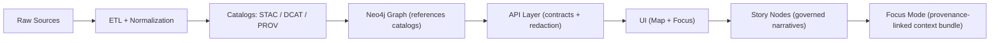

# 📑 `docs/reports/` — Reports, Audits & Story Nodes


> **Purpose:** A single, governed home for **evidence-backed reports** and **machine-ingestible narrative content** (“Story Nodes”) used by KFM’s UI + Focus Mode.  
> **Non‑negotiable:** No unsourced narrative. No bypassing the pipeline ordering.  [oai_citation:0‡MARKDOWN_GUIDE_v13.md.gdoc](file-service://file-UYVruFXfueR8veHMUKeugU)

---

## 🔎 What belongs here

### ✅ Yes
- **🧠 Story Nodes** (draft + published) — curated narrative content with citations and provenance, intended for UI parsing/Focus Mode.  [oai_citation:1‡MARKDOWN_GUIDE_v13.md.gdoc](file-service://file-UYVruFXfueR8veHMUKeugU)
- **🧪 Research / analysis reports** — methods, results, maps, stats, and conclusions *with evidence links*.
- **🧩 Design audits / gap analyses** — product + architecture evaluations and recommendations.
- **🧯 Postmortems** — incidents, regressions, data issues, or governance breaches (with corrective actions).
- **📦 Release notes (report-style)** — when you need more than a changelog.

### ❌ No
- API schemas/contracts (those live with the API contracts/templates, not in reports) [oai_citation:2‡MARKDOWN_GUIDE_v13.md.gdoc](file-service://file-UYVruFXfueR8veHMUKeugU)
- ETL code, validators, or pipelines (live in `src/` / `tools/`) [oai_citation:3‡MARKDOWN_GUIDE_v13.md.gdoc](file-service://file-UYVruFXfueR8veHMUKeugU)

---

## 🧭 Canonical pipeline rule (non‑negotiable)

KFM’s pipeline ordering is **inviolable**:

> **ETL → Catalogs (STAC/DCAT/PROV) → Graph → API → UI → Story Nodes → Focus Mode**  [oai_citation:4‡MARKDOWN_GUIDE_v13.md.gdoc](file-service://file-UYVruFXfueR8veHMUKeugU)

Also:
- **UI must never query Neo4j directly** — all data access goes through governed APIs.  [oai_citation:5‡MARKDOWN_GUIDE_v13.md.gdoc](file-service://file-UYVruFXfueR8veHMUKeugU)
- **Provenance-first** — data must be registered (STAC/DCAT/PROV) before graph/UI/story usage.  [oai_citation:6‡MARKDOWN_GUIDE_v13.md.gdoc](file-service://file-UYVruFXfueR8veHMUKeugU)

### 🗺️ Pipeline sketch (for orientation)

(Adapted from the v13 guide’s high-level flow.)  [oai_citation:7‡MARKDOWN_GUIDE_v13.md.gdoc](file-service://file-UYVruFXfueR8veHMUKeugU)

---

## 🗂️ Directory layout

Story Nodes have a **canonical home** and structure:

- `docs/reports/story_nodes/` is the **exclusive** narrative content directory.  
- `draft/` = work-in-progress, `published/` = officially released.  
- Each published story lives in its **own folder** with markdown + assets.  [oai_citation:8‡MARKDOWN_GUIDE_v13.md.gdoc](file-service://file-UYVruFXfueR8veHMUKeugU)

Recommended “minimum viable” structure:

```text
📁 docs/
└─ 📁 reports/                              📊 authored outputs (reviewed + versioned)
   ├─ 📄 README.md                            📘 reports index + publishing rules
   └─ 📁 story_nodes/                         📚 Story Node reports (narrative + citations + map hooks)
      ├─ 📁 draft/                            📝 in-progress Story Nodes (working)
      │  └─ 📁 <story_slug>/                  🏷️ one Story Node (draft)
      │     ├─ 📄 STORY.md                    📚 draft narrative + citations + map/timeline hooks
      │     └─ 📁 assets/                     📎 working assets (images, clips, small tables)
      └─ 📁 published/                        ✅ released Story Nodes (versioned)
         └─ 📁 <story_slug>/                  🏷️ one Story Node (published)
            ├─ 📄 STORY.md                    📚 final narrative + citations + map/timeline hooks
            └─ 📁 assets/                     📎 released assets (stable + checksummed if needed)
```

> 🧩 Tip: keep **all story-specific images** in that story’s folder so the UI/story exporter can bundle cleanly.

---

## 🧱 Governance: YAML front‑matter + templates

### Why YAML front‑matter?
Even though GitHub ignores YAML front‑matter in plain Markdown rendering, it’s crucial for **governance metadata**, doc lifecycle, and tooling.  [oai_citation:9‡Comprehensive Markdown Guide_ Syntax, Extensions, and Best Practices.docx](file-service://file-J6rFRcp4ExCCeCdTevQjxz)

KFM’s docs practice expects:
- clear doc identity (UUID), status, versioning
- governance & ethics references
- FAIR/CARE labeling & classification fields  [oai_citation:10‡Comprehensive Markdown Guide_ Syntax, Extensions, and Best Practices.docx](file-service://file-J6rFRcp4ExCCeCdTevQjxz)

### Canonical templates
The v13 guide points to these governed templates:
- `docs/templates/TEMPLATE__KFM_UNIVERSAL_DOC.md`
- `docs/templates/TEMPLATE__STORY_NODE_V3.md`  [oai_citation:11‡MARKDOWN_GUIDE_v13.md.gdoc](file-service://file-UYVruFXfueR8veHMUKeugU)

---

## 🧾 Front‑matter example (copy/paste)

> ⚠️ Don’t delete fields you “don’t need yet.” Use `TBD` / `n/a` to keep schema checks happy.  [oai_citation:12‡Comprehensive Markdown Guide_ Syntax, Extensions, and Best Practices.docx](file-service://file-J6rFRcp4ExCCeCdTevQjxz)

```yaml
---
title: "REPORT — <short, specific title>"
path: "docs/reports/<your_subfolder>/<yyyy-mm-dd>__<slug>.md"
version: "v0.1.0"
last_updated: "2026-01-30"
status: "draft"                # draft | active | deprecated
doc_kind: "Report"             # Report | Audit | StoryNode | Postmortem | ...
license: "CC-BY-4.0"

markdown_protocol_version: "1.0"
pipeline_contract_version: "v13"

governance_ref: "docs/governance/ROOT_GOVERNANCE.md"
ethics_ref: "docs/governance/ETHICS.md"
fair_category: "FAIR+CARE"
care_label: "Public"           # Public | Restricted · Tribal Sensitive | ...
sensitivity: "public"
classification: "open"
jurisdiction: "US"

doc_uuid: "urn:kfm:doc:reports:<slug>:v0.1.0"
commit_sha: "<commit-hash>"
doc_integrity_checksum: "sha256:<to-be-filled>"
---
```

(Fields/structure inspired by KFM-style governance front-matter patterns.)  [oai_citation:13‡Comprehensive Markdown Guide_ Syntax, Extensions, and Best Practices.docx](file-service://file-J6rFRcp4ExCCeCdTevQjxz)

---

## ✅ Evidence-first rules (how reports stay “ship‑worthy”)

### 1) Every claim must point to evidence
KFM requires **evidence-first narrative** — no unsourced story/report content.  [oai_citation:14‡MARKDOWN_GUIDE_v13.md.gdoc](file-service://file-UYVruFXfueR8veHMUKeugU)

**Acceptable evidence targets include:**
- STAC Item/Collection IDs
- DCAT dataset entries
- PROV lineage bundles
- schemas/contracts
- commit SHAs / PRs / tickets
- peer-reviewed sources (when appropriate)

### 2) AI outputs are “evidence artifacts”
If a report includes AI-generated analysis outputs, treat them as first-class artifacts:
- stored under `data/processed/...`
- cataloged (STAC/DCAT)
- traced (PROV)
- exposed only via governed APIs  [oai_citation:15‡MARKDOWN_GUIDE_v13.md.gdoc](file-service://file-UYVruFXfueR8veHMUKeugU)

### 3) Classification + sovereignty propagate
Outputs cannot be **less restricted** than their inputs; sensitive location info may require redaction/generalization.  [oai_citation:16‡MARKDOWN_GUIDE_v13.md.gdoc](file-service://file-UYVruFXfueR8veHMUKeugU)

---

## 🧪 Definition of Done (DoD) for any report in this folder

Use this as your PR-ready checklist:

- [ ] Front-matter complete + valid (template/profile compliant)  [oai_citation:17‡MARKDOWN_GUIDE_v13.md.gdoc](file-service://file-UYVruFXfueR8veHMUKeugU)
- [ ] All claims link to datasets/schemas/sources (as applicable)  [oai_citation:18‡MARKDOWN_GUIDE_v13.md.gdoc](file-service://file-UYVruFXfueR8veHMUKeugU)
- [ ] Validation steps listed and repeatable (commands + expected outputs)  [oai_citation:19‡MARKDOWN_GUIDE_v13.md.gdoc](file-service://file-UYVruFXfueR8veHMUKeugU)
- [ ] Governance + FAIR/CARE + sovereignty considerations explicitly stated  [oai_citation:20‡MARKDOWN_GUIDE_v13.md.gdoc](file-service://file-UYVruFXfueR8veHMUKeugU)
- [ ] No broken internal links; assets load in GitHub UI
- [ ] (If Story Node) UI rendering tested; citations/patterns parse correctly  [oai_citation:21‡Comprehensive Markdown Guide_ Syntax, Extensions, and Best Practices.docx](file-service://file-J6rFRcp4ExCCeCdTevQjxz)

> 📌 KFM’s broader guidance explicitly recommends embedding DoD checklists in docs to improve review transparency.  [oai_citation:22‡Comprehensive Markdown Guide_ Syntax, Extensions, and Best Practices.docx](file-service://file-J6rFRcp4ExCCeCdTevQjxz)

---

## ✍️ Create a new report (workflow)

1) **Pick the right template**
   - Report/Audit/Postmortem → Universal Doc Template  [oai_citation:23‡MARKDOWN_GUIDE_v13.md.gdoc](file-service://file-UYVruFXfueR8veHMUKeugU)
   - Narrative UI content → Story Node Template  [oai_citation:24‡MARKDOWN_GUIDE_v13.md.gdoc](file-service://file-UYVruFXfueR8veHMUKeugU)

2) **Place it in the correct canonical home**
   - Story Nodes only: `docs/reports/story_nodes/draft/` (then move to `published/` on release)  [oai_citation:25‡MARKDOWN_GUIDE_v13.md.gdoc](file-service://file-UYVruFXfueR8veHMUKeugU)

3) **Fill YAML front-matter** (keep it boring + strict)  [oai_citation:26‡Comprehensive Markdown Guide_ Syntax, Extensions, and Best Practices.docx](file-service://file-J6rFRcp4ExCCeCdTevQjxz)

4) **Attach evidence**
   - Prefer stable IDs (STAC/DCAT/PROV, commit SHAs, schema versions)  [oai_citation:27‡MARKDOWN_GUIDE_v13.md.gdoc](file-service://file-UYVruFXfueR8veHMUKeugU)

5) **Add visuals**
   - Put images next to the doc (or in `assets/`) and use relative links

6) **Write repeatable validation**
   - “How to re-run analysis,” “how to regenerate figures,” “what should match”

7) **PR + review gates**
   - CI should reject missing provenance, broken links, missing citations, etc.  [oai_citation:28‡MARKDOWN_GUIDE_v13.md.gdoc](file-service://file-UYVruFXfueR8veHMUKeugU)

---

## 🗺️ Maps & spatial references in reports

### Map design: projection + metadata matters
- Map projections are purpose-driven: there’s no one “best” projection; choose based on region + goal.  [oai_citation:29‡making-maps-a-visual-guide-to-map-design-for-gis.pdf](sediment://file_00000000602471f786dfbbaac9329fb9)
- Metadata enables discoverability/interoperability; also consider copyright and proper attribution.  [oai_citation:30‡Scalable Data Management for Future Hardware.pdf](sediment://file_000000007d74722fa87beabc663630f7)

**Minimum map metadata (put in the figure caption or a “Map Specs” block):**
- CRS/EPSG (or “WGS84 lat/long”)
- projection (if applicable)
- data sources + dates
- processing steps (high level)
- license + attribution
- uncertainty caveats / resolution

### Coordinates: be explicit (Lat/Lon vs UTM vs MGRS)
KFM’s UI supports multiple coordinate entry formats (Lat/Lon, UTM, MGRS).  [oai_citation:31‡Kansas Frontier Matrix (KFM) – Comprehensive Technical Blueprint.pdf](sediment://file_000000006dbc71f89a5094ce310a452d)

If you cite coordinates in a report:
- Always state the coordinate system (e.g., “MGRS 14S…”).
- When using MGRS, remember it’s zone + grid square + easting/northing; “read right and up.”  [oai_citation:32‡Map Reading & Land Navigation.pdf](sediment://file_00000000b14c7230b1b262ddd9df4e5d)
- Include declination/“north” assumptions when relevant (field navigation contexts).  [oai_citation:33‡Map Reading & Land Navigation.pdf](sediment://file_00000000b14c7230b1b262ddd9df4e5d)

> 🧠 UI note: the KFM map UI can overlay an MGRS grid and display a coordinate readout, and it emphasizes the “read right and up” convention.  [oai_citation:34‡Kansas Frontier Matrix (KFM) – Comprehensive Technical Blueprint.pdf](sediment://file_000000006dbc71f89a5094ce310a452d)

---

## ⏱️ Time-oriented charts & queries (for reports + UI reasoning)

Time-oriented analysis benefits from interactive filtering patterns:
- Use range sliders for time/numeric filtering, and combine filters to reduce clutter.  [oai_citation:35‡Visualization of Time-Oriented Data.pdf](sediment://file_000000001468722f929b8752236e5a72)
- “Timeboxes” let users draw rectangles (time interval + value range) to filter multivariate time series.  [oai_citation:36‡Visualization of Time-Oriented Data.pdf](sediment://file_000000001468722f929b8752236e5a72)

**In reports:** when presenting time series results, describe:
- sampling interval + missing data handling
- smoothing/aggregation choices
- why the visualization choice supports the decision being made

---

## ⚙️ Performance / scale reporting (when the report is about “it’s slow”)

If you’re writing a performance report, capture workload patterns (not just a single benchmark):
- “Regular reporting” workloads often differ only by parameters; reuse strategies (accelerators/caches/materializations) matter.  [oai_citation:37‡Scalable Data Management for Future Hardware.pdf](sediment://file_000000007d74722fa87beabc663630f7)
- Query logs + history help identify repeated sequences and guide optimization decisions.  [oai_citation:38‡Scalable Data Management for Future Hardware.pdf](sediment://file_000000007d74722fa87beabc663630f7)

---

## 🤖 Local AI assistance (Ollama) — allowed, but governed

Ollama can run models locally (privacy: prompts/responses stay on-device once models are downloaded).  [oai_citation:39‡Comprehensive Guide to Ollama and Its Supported Open-Source LLMs.pdf](file-service://file-WLPhJVNoBxYKcy3utQSwBi)

**Basic usage:**
- `ollama pull <model_name>` or `ollama run <model_name>` (auto-pulls if missing).  [oai_citation:40‡Comprehensive Guide to Ollama and Its Supported Open-Source LLMs.pdf](file-service://file-WLPhJVNoBxYKcy3utQSwBi)

**Why this matters for reports:**  
If you use AI to draft text or generate an “evidence artifact,” you must:
- label AI-generated content
- attach provenance (model + version, prompt, inputs)
- treat derived outputs as governed artifacts (catalog + PROV)  [oai_citation:41‡MARKDOWN_GUIDE_v13.md.gdoc](file-service://file-UYVruFXfueR8veHMUKeugU)

> ✅ In other words: AI can help you write, but it can’t replace evidence.  [oai_citation:42‡MARKDOWN_GUIDE_v13.md.gdoc](file-service://file-UYVruFXfueR8veHMUKeugU)

---

## 📚 Key project references (start here)

**Core governance + architecture**
- 🧭 **KFM Master Guide v13 (draft)** — contracts, invariants, canonical homes, templates  
   [oai_citation:43‡MARKDOWN_GUIDE_v13.md.gdoc](file-service://file-UYVruFXfueR8veHMUKeugU)
- 🏗️ **KFM Technical Blueprint** — system components, UI/API behavior, dev endpoints  
   [oai_citation:44‡Kansas Frontier Matrix (KFM) – Comprehensive Technical Blueprint.pdf](sediment://file_000000006dbc71f89a5094ce310a452d)
- 🧾 **Comprehensive Markdown Guide (KFM-style governance patterns)** — YAML front‑matter, DoD, provenance conventions  
   [oai_citation:45‡Comprehensive Markdown Guide_ Syntax, Extensions, and Best Practices.docx](file-service://file-J6rFRcp4ExCCeCdTevQjxz)

**Reports that model the standard**
- 🧩 **KFM Design Audit — Gaps & Enhancement Opportunities** (example audit format)  
   [oai_citation:46‡Kansas-Frontier-Matrix Design Audit – Gaps and Enhancement Opportunities.pdf](file-service://file-TkRzAfTnxCYDUHauCf1NcH)
- 🌐 **KFM Open-Source Hub Design** (ecosystem + OS structure thinking)  
   [oai_citation:47‡Kansas-Frontier-Matrix_ Open-Source Geospatial Historical Mapping Hub Design.pdf](file-service://file-ShqHKgjxCS9UT9vbcxDNzA)

**Mapping + visualization**
- 🗺️ **Making Maps — Visual Guide to Map Design for GIS**  
   [oai_citation:48‡making-maps-a-visual-guide-to-map-design-for-gis.pdf](sediment://file_00000000602471f786dfbbaac9329fb9)
- 🧭 **Map Reading & Land Navigation** (MGRS/UTM conventions, “read right and up”)  
   [oai_citation:49‡Map Reading & Land Navigation.pdf](sediment://file_00000000b14c7230b1b262ddd9df4e5d)
- ⏱️ **Visualization of Time-Oriented Data**  
   [oai_citation:50‡Visualization of Time-Oriented Data.pdf](sediment://file_000000001468722f929b8752236e5a72)
- 🧱 **KFM Python Geospatial Analysis Cookbook**  
   [oai_citation:51‡KFM- python-geospatial-analysis-cookbook-over-60-recipes-to-work-with-topology-overlays-indoor-routing-and-web-application-analysis-with-python.pdf](file-service://file-2gpiGDZS8iw6EdxGswEdHp)

**AI tooling (local)**
- 🤖 **Comprehensive Guide to Ollama & Supported Open-Source LLMs**  
   [oai_citation:52‡Comprehensive Guide to Ollama and Its Supported Open-Source LLMs.pdf](file-service://file-WLPhJVNoBxYKcy3utQSwBi)

**Optional deep dives (use as needed)**
- 🏺 **Archaeological 3D GIS** (3D documentation + workflows)  
   [oai_citation:53‡MARKDOWN_GUIDE_v13.md.gdoc](file-service://file-UYVruFXfueR8veHMUKeugU)
- 📱 **Mobile Mapping** (field/mobile considerations)  
   [oai_citation:54‡Comprehensive Markdown Guide_ Syntax, Extensions, and Best Practices.docx](file-service://file-J6rFRcp4ExCCeCdTevQjxz)
- 📈 **Graphical Data Analysis with R** (EDA patterns for report work)  
   [oai_citation:55‡Archaeological 3D GIS.pdf](sediment://file_0000000033b871f5a9f07d3c95f6ad4a)
- ⚙️ **Scalable Data Management for Future Hardware** (workload-aware performance thinking)  
   [oai_citation:56‡Scalable Data Management for Future Hardware.pdf](sediment://file_000000007d74722fa87beabc663630f7)

---

## 🧰 Appendix: compact report skeleton (optional)

<details>
  <summary>📄 Click to expand a “minimum report” outline</summary>

```markdown
---
title: "REPORT — <title>"
version: "v0.1.0"
status: "draft"
doc_kind: "Report"
last_updated: "YYYY-MM-DD"
license: "CC-BY-4.0"
fair_category: "FAIR+CARE"
care_label: "Public"
classification: "open"
doc_uuid: "urn:kfm:doc:reports:<slug>:v0.1.0"
---

## 📘 Overview
- **Purpose**
- **Scope (in/out)**
- **Audience**
- **Definitions**

## 🧩 Problem / Question
## 🧪 Method
## 📦 Data & Evidence
- Datasets (STAC/DCAT IDs)
- Provenance (PROV bundle IDs)
- Assumptions

## 📈 Results
- Figures + captions (include CRS/projection for maps)

## ✅ Conclusions / Decisions
## ⚠️ Risks / Governance Notes
## 🔁 How to Reproduce
## ✅ Definition of Done
- [ ] Front-matter complete
- [ ] All claims cited
- [ ] Repro steps verified
```
</details>
