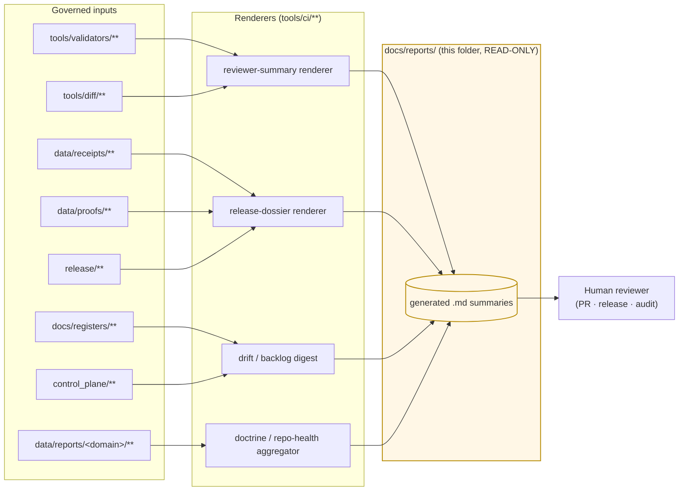

<!-- [KFM_META_BLOCK_V2]
doc_id: kfm://doc/docs-reports-readme
title: docs/reports/ — Generated Review & Release Reports
type: readme
version: v1
status: draft
owners: TODO docs-steward; TODO release-steward
created: TODO YYYY-MM-DD
updated: TODO YYYY-MM-DD
policy_label: public
related:
  - docs/doctrine/directory-rules.md
  - docs/doctrine/lifecycle-law.md
  - docs/doctrine/truth-posture.md
  - docs/doctrine/trust-membrane.md
  - docs/registers/DRIFT_REGISTER.md
  - docs/registers/VERIFICATION_BACKLOG.md
  - control_plane/release_state_register.yaml
  - data/reports/
  - data/published/reports/
  - release/
  - tools/ci/
tags: [kfm, docs, reports, governance, generated]
notes:
  - Folder concept is CONFIRMED by Directory Rules §6.1.
  - Specific generators, schemas, and CI wiring NEEDS VERIFICATION against mounted repo.
  - "Read-only" means generator-emitted; not hand-edited in place.
[/KFM_META_BLOCK_V2] -->

# `docs/reports/` — Generated Review & Release Reports

> Repo-wide, machine-emitted **review and release reports** for human consumption on GitHub. Generated outputs only — change the generator, never the file.

<!-- impact block -->

| Field | Value |
|---|---|
| **Authority level** | Generated *(per Directory Rules §15)* |
| **Status** | PROPOSED — folder concept CONFIRMED in doctrine; presence in any specific repo NEEDS VERIFICATION |
| **Owners** | `TODO` Docs steward · `TODO` Release steward · `TODO` CI/Renderer steward |
| **Lifecycle** | REVIEW (regenerated per run) |
| **Truth class** | `truth=receipt≠proof≠catalog≠publication` — reports **summarize** evidence, they are **not** evidence |
| **Last reviewed** | `TODO YYYY-MM-DD` |

<!-- badges (placeholders; targets unverified until repo is mounted) -->

> [!IMPORTANT]
> **Read-only invariant.** Files under `docs/reports/` are emitted by tools and CI. They MUST NOT be hand-edited. To change content, **change the generator** in `tools/ci/`, `tools/validators/`, or the appropriate pipeline, then regenerate. A reviewer who finds a hand-edited report SHOULD flag it as drift.

**Quick jumps:**
[Purpose](#1-purpose) · [Repo fit](#2-repo-fit) · [Authority](#3-authority-level) · [Status](#4-status) ·
[Belongs](#5-what-belongs-here) · [Does not belong](#6-what-does-not-belong-here) ·
[Boundary](#7-the-four-reports-homes--boundary-table) · [Inputs](#8-inputs) · [Outputs](#9-outputs) ·
[Diagram](#10-diagram) · [Validation](#11-validation) · [Review burden](#12-review-burden) ·
[Related](#13-related-folders) · [ADRs](#14-adrs) · [Runbook](#15-how-to-add-a-new-report-type) ·
[Open questions](#16-open-questions) · [Last reviewed](#17-last-reviewed)

---

## 1. Purpose

`docs/reports/` is the **human-facing landing place** for repo-wide, machine-emitted **review and release reports** — short, scannable documents that summarize the state of the repository, a release candidate, a doctrine sweep, or a cross-domain review at a single point in time.

It exists because reviewers need a stable, navigable, GitHub-rendered surface for **summary reads** that:

- live next to the doctrine they answer to,
- update only by re-running their generator,
- never substitute for the canonical evidence they cite, and
- never become a parallel decision authority.

In KFM's layer split — *`docs/` **explains**; `control_plane/` **indexes**; `contracts/` **defines meaning**; `schemas/` **defines shape*** — this folder belongs squarely under **explanation**, with the additional discipline that explanations here are **generated**, not authored.

---

## 2. Repo fit

| Aspect | Value |
|---|---|
| **Path** | `docs/reports/` |
| **Owning root** | `docs/` *(human-facing control plane)* |
| **Doctrine basis** | Directory Rules §6.1 — `reports/` listed as `# generated review/release reports (read-only)` |
| **README contract** | Directory Rules §15 — Required README Contract (followed by this file) |
| **Upstream** | `tools/ci/` renderers · `tools/validators/` outputs · `tools/diff/` outputs · `data/receipts/` · `data/proofs/` · `release/` decisions · `control_plane/` registers · `docs/registers/` |
| **Downstream** | Human reviewers (PR review, release review, audits) · `docs/registers/DRIFT_REGISTER.md` (when reports surface drift) · `docs/registers/VERIFICATION_BACKLOG.md` (when reports surface verification debt) |
| **Lifecycle** | REVIEW — content is append-or-replace per run; generators preserve prior reports as part of process memory where appropriate |

> [!NOTE]
> Specific upstream tool paths above are PROPOSED, consistent with Directory Rules §7 conventions. Their presence in any given repo NEEDS VERIFICATION.

---

## 3. Authority level

**Generated.**

This is one of the explicit authority levels enumerated by Directory Rules §15 (`Canonical | implementation-bearing | generated | compatibility | archive | exploratory`). Reports here:

- **do not** carry release authority (that lives in `release/` decisions),
- **do not** carry source authority (that lives in `data/registry/` and source descriptors),
- **do not** carry policy authority (that lives in `policy/`),
- **do not** carry shape or meaning authority (those live in `schemas/` and `contracts/`),
- **do** provide a **scannable view** of authority that lives elsewhere.

A report MUST link to the canonical artifact(s) it summarizes (release manifest, evidence bundle, validation receipt, register snapshot). A claim that exists *only* inside a report is doctrinally suspect.

---

## 4. Status

**PROPOSED.**

| Sub-claim | Truth label | Notes |
|---|---|---|
| Folder concept (`docs/reports/`) is part of KFM doctrine | **CONFIRMED** | Directory Rules §6.1 |
| §15 README contract applies | **CONFIRMED** | Directory Rules §15 |
| "Read-only / generated" semantics for this folder | **CONFIRMED** | Directory Rules §6.1 annotation |
| This README's specific structure, badges, and owner placeholders | **PROPOSED** | This file |
| Folder presence at this exact path in any specific KFM repo checkout | **NEEDS VERIFICATION** | Repo not mounted in this session |
| Specific generator names, schemas, CI wiring | **NEEDS VERIFICATION** | Resolve against mounted repo |

> [!CAUTION]
> Until the repo is mounted and the generator(s) confirmed, treat any specific filename, schema reference, or CI workflow named in this README as PROPOSED. Update this README when those become CONFIRMED.

---

## 5. What belongs here

Generated, repo-wide, **summary** documents whose primary audience is a human reviewer reading on GitHub. Each file MUST be emitted by a named generator and MUST link to the canonical artifacts it summarizes.

**Illustrative families** *(PROPOSED — exact filenames, schemas, and triggers NEEDS VERIFICATION until generators land)*:

| Family | Example filename pattern | Generator (PROPOSED) | Trigger |
|---|---|---|---|
| **Release dossier** | `release/<release_id>/dossier.md` | release renderer in `tools/ci/` | release candidate review |
| **Reviewer summary (cross-domain)** | `review/<period_or_pr>/summary.md` | reviewer-summary renderer | PR / release review window |
| **Doctrine compliance sweep** | `doctrine/<sweep_id>/compliance.md` | doctrine validator in `tools/validators/` | scheduled or on-demand |
| **Drift snapshot** | `drift/<snapshot_id>/snapshot.md` | drift compiler over `docs/registers/DRIFT_REGISTER.md` | scheduled |
| **Verification backlog digest** | `verification/<digest_id>/backlog.md` | backlog renderer | scheduled |
| **Repo-health summary** | `health/<period>/repo-health.md` | repo-health aggregator | scheduled |
| **Catalog closure summary** | `catalog/<release_id>/closure.md` | catalog-matrix summarizer | release review |
| **Policy decision digest** | `policy/<window>/decisions.md` | policy-decision aggregator | scheduled |

> [!TIP]
> A useful test: **if you would lose nothing essential by deleting this file and re-running its generator, it belongs here.** If deleting it would lose evidence, decisions, or original analysis, it belongs in `data/proofs/`, `data/receipts/`, `release/`, `docs/registers/`, `docs/architecture/`, or an ADR — not here.

Every report SHOULD include, at minimum:

- the **generator name and version** that produced it,
- the **inputs and their content hashes / `spec_hash`** where applicable,
- the **timestamp** of generation,
- **links** to the canonical artifacts it summarizes (release manifest, evidence bundle, register entry),
- **truth labels** on any forward-looking claim,
- the report's **schema reference**.

---

## 6. What does NOT belong here

**A redirect, not a list of vibes.** Each entry names where the content actually goes.

| If you're tempted to put this here… | …it belongs in | Why |
|---|---|---|
| **Hand-authored prose** | `docs/architecture/`, `docs/runbooks/`, `docs/governance/`, `docs/sources/`, `docs/standards/`, or `docs/domains/<domain>/` | This folder is for *generated* content. Authored prose belongs to the appropriate canonical doc lane. |
| **An ADR** | `docs/adr/` | ADRs are decisions, not reports about decisions. |
| **A register entry** *(authority ladder, drift, verification backlog, object-family map, etc.)* | `docs/registers/` | Registers are stateful sources; reports are point-in-time views over them. |
| **A receipt, proof, evidence bundle, run receipt, AI receipt, redaction receipt, correction receipt, rollback card** | `data/receipts/`, `data/proofs/`, `release/rollback_cards/`, `release/correction_notices/` | Trust-bearing objects live in canonical lifecycle / release homes. Reports cite them; they are not them. |
| **A release manifest, signed decision, policy decision log, signature artifact** | `release/manifests/`, `release/signatures/`, `release/decisions/` *(per §9 of Directory Rules)* | Release decisions live in `release/`, not in `docs/`. |
| **A per-domain pipeline run report** *(e.g., `validation_summary.md`, `diff_summary.json` per run)* | `data/reports/<domain>/<run_id>/` | Per-run pipeline outputs are data, not docs. See [§7](#7-the-four-reports-homes--boundary-table). |
| **A public-facing released report artifact** | `data/published/reports/` | Public release artifacts go through the lifecycle. See [§7](#7-the-four-reports-homes--boundary-table). |
| **A CI-generated QA / lint / coverage / build artifact** | `artifacts/qa/`, `artifacts/build/`, `artifacts/docs/` | Build-time artifacts live under `artifacts/` per §8.2 of Directory Rules. |
| **A schema, contract, or policy file** | `schemas/`, `contracts/`, `policy/` | Authority files don't live in `docs/`. |
| **Source data, processed data, catalog records, published layers** | `data/raw/`, `data/processed/`, `data/catalog/`, `data/published/` | Lifecycle invariant. Reports summarize these; they don't replace them. |
| **A site or static-site build** | `artifacts/docs/` | Generated documentation site goes there per §8.2. |

> [!WARNING]
> **No release manifest in `docs/reports/`.** A release **dossier** (a human-readable summary referencing the manifest) MAY live here. The **manifest itself** lives in `release/manifests/`. Mixing them is one of the four canonical drift patterns (Directory Rules §10).

---

## 7. The four "reports" homes — boundary table

KFM intentionally distinguishes **four** "reports" homes. Choose the one whose **responsibility** matches yours, not the one whose name reads most natural.

| Home | Responsibility | Lifecycle | Audience | Authority | Edited by hand? |
|---|---|---|---|---|---|
| **`docs/reports/`** *(this folder)* | Repo-wide, generated **review & release summaries** for human reading | REVIEW | Reviewers, stewards, readers on GitHub | Generated *(no decision authority)* | **No** — regenerate |
| **`data/reports/<domain>/<run_id>/`** | **Per-run** pipeline validation summaries and reviewer summaries (e.g., `validation_summary.md`, `diff_summary.json`) | REVIEW (append per run) | Pipeline reviewers, PR readers | Generated *(per-run)* | No — emitted by validators / diff tools |
| **`data/published/reports/`** | **Released** public-facing report artifacts under the data lifecycle | PUBLISHED | Public consumers of releases | Released artifact | No — promoted via release gates |
| **`artifacts/qa/`** | Build-time **QA / lint / coverage** artifacts (compatibility root, §8.2) | Build / ephemeral | Developers, CI | Compatibility *(not trust-bearing)* | No — emitted by CI |

> [!NOTE]
> Common mistake: dropping a per-domain validation summary into `docs/reports/` because "it's a report and it's about review." It belongs in `data/reports/<domain>/<run_id>/` because the responsibility is **per-run pipeline output**, not **repo-wide governance summary**.

---

## 8. Inputs

Reports here are **rendered from** governed inputs. Every report SHOULD declare its inputs and their content hashes.

Typical input families *(PROPOSED placement, consistent with Directory Rules)*:

- **Validators and diff tools** — `tools/validators/**`, `tools/diff/**` *(per §7.5)*
- **Renderers** — `tools/ci/**` reviewer-summary, dossier, and digest renderers
- **Registers** — `docs/registers/**` and `control_plane/**` (`document_registry.yaml`, `release_state_register.yaml`, `verification_backlog.yaml`, `contradiction_register.yaml`, `deprecation_register.yaml`)
- **Receipts and proofs** — `data/receipts/**`, `data/proofs/**`
- **Release decisions** — `release/manifests/**`, `release/decisions/**`, `release/correction_notices/**`, `release/rollback_cards/**`
- **Catalog closure** — `data/catalog/stac/**`, `data/catalog/dcat/**`, `data/prov/**`
- **Per-run pipeline reports** *(as inputs to repo-wide aggregations)* — `data/reports/<domain>/**`

Inputs MUST be referenced by stable identifier (path + content hash / `spec_hash` / `release_id`), never by mutable description alone.

---

## 9. Outputs

This folder **does not** emit downstream system outputs. It is a **terminal surface for human reading**. Its only "output" is reviewer attention.

If a report is being read by another tool, that tool SHOULD instead read the report's **upstream inputs** (registers, receipts, proofs, manifests). A report is a **view**, not an authority.

If a report **is** being depended on by tooling, that is a drift signal: open a `docs/registers/DRIFT_REGISTER.md` entry and propose moving the dependency to a stable canonical surface (a register, a schema, a contract, a release manifest).

---

## 10. Diagram

```mermaid
flowchart LR
    subgraph Inputs["Governed inputs"]
        V[tools/validators/**]
        D[tools/diff/**]
        REG[docs/registers/**]
        CP[control_plane/**]
        REC[data/receipts/**]
        PRF[data/proofs/**]
        REL[release/**]
        DRP[data/reports/&lt;domain&gt;/**]
    end

    subgraph Renderers["Renderers (tools/ci/**)"]
        R1[reviewer-summary renderer]
        R2[release-dossier renderer]
        R3[drift / backlog digest]
        R4[doctrine / repo-health aggregator]
    end

    subgraph DocsReports["docs/reports/  (this folder, READ-ONLY)"]
        OUT[(generated .md summaries)]
    end

    Reviewer["Human reviewer<br/>(PR · release · audit)"]

    V --> R1
    D --> R1
    REG --> R3
    CP --> R3
    REC --> R2
    PRF --> R2
    REL --> R2
    DRP --> R4

    R1 --> OUT
    R2 --> OUT
    R3 --> OUT
    R4 --> OUT
    OUT --> Reviewer

    classDef readonly fill:#fff7e6,stroke:#b58900,stroke-width:1.5px;
    class DocsReports,OUT readonly;
```

> Diagram is **structure-grounded** but **PROPOSED** at the level of specific renderer names, which NEEDS VERIFICATION against the mounted repo.

---

## 11. Validation

| Check | Where it lives | What it enforces |
|---|---|---|
| **README §15 contract** | `tools/validators/docs_readme_contract` *(PROPOSED)* | Required sections present and in order |
| **No hand-edited content** | `tools/validators/docs_reports_readonly` *(PROPOSED)* | Files declare a generator; no orphan / hand-authored files |
| **Report schema** | `schemas/contracts/v1/docs/report.*.schema.json` *(PROPOSED, per ADR-0001 schema-home rule)* | Required fields: generator, version, inputs, content hashes, timestamp, links, truth labels |
| **Link / path lint** | `tools/validators/link_lint` *(PROPOSED)* | Links resolve; relative paths valid; permalinks pinned where required |
| **Truth-label review** | manual + lint | Every forward-looking claim carries a label |
| **No trust-content drift** | `tools/validators/no_trust_content_in_docs` *(PROPOSED)* | No receipts, proofs, manifests, decisions land here |
| **Generator-version pin** | report header + CI | Generator name + version recorded in every report |

> [!IMPORTANT]
> Specific validator names above are **PROPOSED**, consistent with Directory Rules §7.5 (`tools/validators/`). Resolve against the mounted repo and update truth labels before relying on them.

Validation runs in CI on every PR that touches `docs/reports/**` or any of its declared input families.

---

## 12. Review burden

| Role | Reviews |
|---|---|
| **Docs steward** | This README, structural changes, link health, truth-label discipline |
| **Release steward** | Release dossiers and any output that summarizes release decisions |
| **CI / Renderer steward** | Generators in `tools/ci/**`, schema conformance, regeneration cadence |
| **Subsystem owners (per report family)** | Domain-specific summaries that touch their lane |
| **CODEOWNERS** | `TODO` confirm `CODEOWNERS` entry for `docs/reports/**` and the relevant generator paths |

PRs that:

- modify a generator MUST regenerate affected reports in the same PR (or document why not),
- add a new report family MUST add a generator, a schema, validators, and an entry in [§5](#5-what-belongs-here) of this README,
- delete a report family MUST link the deprecation rationale and the replacement surface (often a register or an ADR).

---

## 13. Related folders

| Folder | Relationship |
|---|---|
| [`docs/doctrine/directory-rules.md`](../doctrine/directory-rules.md) | The path doctrine that places this folder. §6.1 lists it; §15 is the README contract this file follows. |
| [`docs/doctrine/lifecycle-law.md`](../doctrine/lifecycle-law.md) | Lifecycle invariant. Reports summarize lifecycle; they do not bypass it. |
| [`docs/doctrine/truth-posture.md`](../doctrine/truth-posture.md) | Cite-or-abstain. Reports without resolvable EvidenceRefs are suspect. |
| [`docs/registers/`](../registers/) | The stateful sources reports view. |
| [`docs/runbooks/`](../runbooks/) | How to *operate* — including how to regenerate reports. |
| [`docs/architecture/`](../architecture/) | Where authored architectural prose lives (not here). |
| [`docs/adr/`](../adr/) | Decisions that govern this folder are referenced in [§14](#14-adrs). |
| [`control_plane/`](../../control_plane/) | Machine-readable governance maps that feed many reports. |
| [`release/`](../../release/) | Release decisions. Reports here may *summarize* release decisions; they never carry them. |
| [`data/reports/`](../../data/reports/) | **Per-domain, per-run** pipeline reports. Distinct from this folder — see [§7](#7-the-four-reports-homes--boundary-table). |
| [`data/published/reports/`](../../data/published/) | **Released** report artifacts. Distinct — see [§7](#7-the-four-reports-homes--boundary-table). |
| [`artifacts/qa/`](../../artifacts/) | Build-time QA artifacts. Distinct — see [§7](#7-the-four-reports-homes--boundary-table). |
| [`tools/ci/`](../../tools/) | Where renderers live. |

> Path links above assume Directory Rules §6 layout. Targets exist as **PROPOSED** placements; if any target is missing in the mounted repo, mark the link broken and open a `VERIFICATION_BACKLOG.md` entry.

---

## 14. ADRs

| ADR | Relationship | Status |
|---|---|---|
| **ADR-0001 — schema home** | Determines where any report schema lives (`schemas/contracts/v1/docs/report.*.schema.json` per default rule). | Referenced in Directory Rules §0; status NEEDS VERIFICATION against `docs/adr/` in the mounted repo. |
| **`TODO` ADR — `docs/reports/` content contract** | Would freeze: required report families, required header fields, regeneration triggers, retention policy. | **PROPOSED** — open as candidate ADR if/when the first generator lands. |
| **`TODO` ADR — `docs/reports/` retention & supersession** | Would resolve: append vs replace per family, history retention horizon, archival path to `docs/archive/`. | **PROPOSED**. |

A new ADR is **required** before promoting `docs/reports/` from generated to canonical, per Directory Rules §2.4.

---

## 15. How to add a new report type

A short runbook. Each step is a gate.

1. **Justify the report.** Open an issue: who reads it, what decision it informs, what canonical input(s) it summarizes. If the answer is "another tool reads it," redirect the dependency to a stable surface (register, schema, contract).
2. **Place the schema.** Add `schemas/contracts/v1/docs/report.<family>.schema.json`, per ADR-0001 schema-home rule.
3. **Place the generator.** Add the renderer under `tools/ci/<family>_renderer/` (or the closest existing generator family). Pin a version. Emit deterministic output.
4. **Place the validator.** Add or extend `tools/validators/docs_reports_*` to cover the new family's required fields and link integrity.
5. **Wire CI.** The generator runs on the right trigger (PR, release, schedule). The validator runs on every PR touching `docs/reports/**`.
6. **Update this README.** Add the family to [§5](#5-what-belongs-here). If the family touches a boundary in [§7](#7-the-four-reports-homes--boundary-table), update that table too.
7. **Open the ADR** if the addition changes the README contract or adds a new sub-folder under `docs/reports/`.
8. **Land a worked example.** First commit MUST include a real generated artifact under `docs/reports/<family>/...`, not a stub.
9. **Record review state.** Update `docs/registers/VERIFICATION_BACKLOG.md` if any verification is deferred.

> [!TIP]
> If steps 2–4 cannot be satisfied — no schema, no generator, no validator — the family does not yet belong in `docs/reports/`. It belongs in `docs/registers/` (stateful, hand-curated) or `docs/archive/exploratory/` (lineage) until it does.

---

## 16. Open questions

The doctrine deliberately mandates an **Open Questions** section in every README, per the corpus. Pretending a folder has no open questions is a documentation smell.

- **Q1.** Should `docs/reports/` enforce a fixed sub-folder taxonomy *(e.g., `release/`, `review/`, `drift/`, `doctrine/`, `health/`)*, or remain flat with name-prefixed files? **PROPOSED:** sub-folders by family. Resolve via ADR.
- **Q2.** Retention policy: do prior dossiers live here forever, get rotated to `docs/archive/`, or get pruned by hash-stable supersession? **PROPOSED:** keep most-recent N per family in-folder; archive older to `docs/archive/lineage/reports/`. Resolve via ADR.
- **Q3.** Should reports be authored as **Markdown only**, or also emit JSON / JSON-LD sidecars for machine consumption? **PROPOSED:** Markdown is canonical for humans; sidecars MAY accompany when tooling reads the report (rare). Resolve via ADR.
- **Q4.** How are reports cryptographically associated with their inputs — header-embedded hashes, sidecar manifest, or both? **PROPOSED:** header-embedded `inputs[]` with `path` + content hash; sidecar manifest only if a release report is signed. Resolve via ADR.
- **Q5.** Does a report ever count as evidence in `data/proofs/`? **PROPOSED:** **No.** Reports cite proofs; proofs are not promoted from reports. Confirm in the truth-posture doctrine.

---

## 17. Last reviewed

- **Last reviewed:** `TODO YYYY-MM-DD`
- **Next review due:** `TODO YYYY-MM-DD` *(Directory Rules §15: older than 6 months → flag for review)*
- **Reviewer:** `TODO`
- **Review notes:** `TODO`

---

This README follows the Required README Contract in **Directory Rules §15** and the README structural conventions described in the KFM documentation discipline corpus *(KFM_META_BLOCK_V2 + badges + mandatory Open Questions)*. Specific paths in this file are PROPOSED unless otherwise marked; resolve against mounted-repo evidence and update truth labels accordingly.

[⬆ Back to top](#docsreports--generated-review--release-reports)
