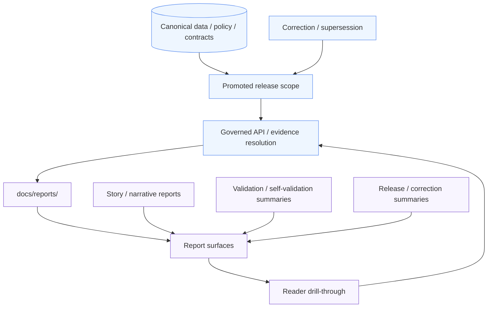

# reports

Governed index for human-readable report artifacts, review-facing summaries, and report-adjacent evidence surfaces in Kansas Frontier Matrix (KFM).

> **Status:** experimental  
> **Owners:** NEEDS VERIFICATION — confirm docs / platform / domain ownership from live governance or ownership files  
> 
> 
> 
> 
>   
> **Quick jumps:** [Scope](#scope) · [Repo fit](#repo-fit) · [Accepted inputs](#accepted-inputs) · [Exclusions](#exclusions) · [Current verified snapshot](#current-verified-snapshot) · [Directory tree](#directory-tree) · [Quickstart](#quickstart) · [Usage](#usage) · [Diagram](#diagram) · [Reference tables](#reference-tables) · [Task list](#task-list) · [FAQ](#faq) · [Appendix](#appendix)

> [!IMPORTANT]
> `docs/reports/` is a **governed documentation surface**, not a bypass around contracts, policy, release manifests, proof packs, or governed APIs. Reports may explain, summarize, validate, review, or contextualize released scope, but they do **not** create new authoritative truth on their own.

**Status markers used in this README:** **CONFIRMED** · **PROPOSED** · **NEEDS VERIFICATION**

## Scope

`docs/reports/` is the documentation-facing home for report-shaped artifacts that are meant to be read, reviewed, or navigated by humans.

In KFM terms, this directory should hold materials such as:

- report indexes and landing pages
- validation or self-validation summaries intended for documentation surfaces
- release-facing or correction-facing human summaries
- report-adjacent assets that are safe to publish and small enough to belong in docs
- narrative/report surfaces that remain explicitly downstream of release scope, evidence, policy, and review state

This directory should **not** become a shadow data lake, a schema registry, a policy bundle store, or a second UI/backend truth path.

## Repo fit

| Field | Value |
|---|---|
| Path | `docs/reports/README.md` |
| Local role | Directory contract and navigation index for report-shaped documentation under `docs/` |
| Upstream links | [`../README.md`](../README.md) · [`../architecture/`](../architecture/) · [`../governance/`](../governance/) · [`../standards/`](../standards/) · [`../runbooks/`](../runbooks/) |
| Adjacent governed boundaries | [`../../data/`](../../data/) · [`../../schemas/`](../../schemas/) · [`../../contracts/`](../../contracts/) · [`../../policy/`](../../policy/) · [`../../tests/`](../../tests/) |
| Downstream links | [`./README.md`](./README.md) only at present; additional child families described below are **PROPOSED** until materialized |
| Core rule | Reports stay **downstream** of governed release scope and must preserve drill-through to evidence, release state, and correction context |

## Accepted inputs

| Input type | Belongs here? | Notes |
|---|---|---|
| Human-readable report indexes and landing pages | Yes | Best fit for directory contracts, report family indexes, and reader-facing navigation |
| Validation / QA summaries meant for docs consumption | Yes | Keep them report-shaped and traceable back to validators, run receipts, or release scope |
| Release-facing human summaries | Yes | Must point back to `release_manifest`, proof-pack, correction, or rollback context |
| Report-adjacent figures, diagrams, small tables, or exported visuals | Yes, selectively | Must be public-safe, provenance-aware, and sized for docs rather than data delivery |
| Narrative/report surfaces tied to released scope | Yes | Keep geography, time basis, evidence route, and caveats visible |
| Small machine-readable rollups used only as report companions | Sometimes | Allowed when they are clearly derivative, stable, and not pretending to be the authoritative artifact |

## Exclusions

| Does **not** belong here | Put it here instead | Why |
|---|---|---|
| Canonical raw / work / processed / catalog data | [`../../data/`](../../data/) | Reports are documentation surfaces, not canonical data stores |
| Schemas, contract definitions, API envelopes | [`../../schemas/`](../../schemas/) · [`../../contracts/`](../../contracts/) | Machine-validated interfaces belong in contract-bearing locations |
| Policy bundles, reason-code registries, enforcement rules | [`../../policy/`](../../policy/) | Policy must remain explicit and enforceable outside report prose |
| Tests, fixtures, validation harnesses, workflow logic | [`../../tests/`](../../tests/) and execution surfaces | Reports may summarize tests, but they do not replace them |
| Secrets, tokens, signed URLs, internal endpoints | Nowhere in public docs | These are never acceptable report payloads |
| Precise restricted coordinates or other sensitive detail | Governed redaction/generalization path | Reports must preserve policy-safe visibility |
| Free-form AI narrative without evidence linkage | Not here | KFM report surfaces remain evidence-linked and bounded |

## Current verified snapshot

| Path / state | Status | Notes |
|---|---|---|
| `docs/reports/README.md` | **CONFIRMED** | Present and currently functioning as the directory’s only verified child artifact in this pass |
| Additional child paths under `docs/reports/` | **NEEDS VERIFICATION** | No other child entries were directly verified in the live repo view used for this rewrite |
| Expansion layout below | **PROPOSED** | Intended target shape only; add families when the repo actually needs them |

## Directory tree

### Current verified tree

```text
docs/reports/
└── README.md
```

<details>
<summary><strong>Proposed expansion footprint</strong> (add only when the repo actually materializes the need)</summary>

```text
docs/reports/
├── README.md                      # governed directory contract (this file)
├── story_nodes/                   # PROPOSED / NEEDS VERIFICATION
├── self-validation/               # PROPOSED docs-facing lint / validation summaries
├── validation/                    # PROPOSED domain-facing validation report families
├── releases/                      # PROPOSED human-readable release summaries
├── audits/                        # PROPOSED audit / review / correction summaries
└── telemetry/                     # PROPOSED governance-safe rollups and trends
```

**Guidance**

- `story_nodes/` is treated as a **source-reported / needs-verification** location in broader KFM documentation, but it is **not** asserted here as a currently mounted child path.
- `self-validation/`, `validation/`, `releases/`, `audits/`, and `telemetry/` are **PROPOSED** families for report-shaped artifacts only. They should be created only when the repo gains enough real content to justify a stable contract.
- New top-level families should be rare. The default bias is to keep this directory small, legible, and intentionally governed.

</details>

## Quickstart

```bash
# inspect the directory contract
sed -n '1,240p' docs/reports/README.md

# list what currently exists under docs/reports
find docs/reports -maxdepth 3 -type f | sort

# find report content that claims evidence or release linkage
rg -n "EvidenceRef|EvidenceBundle|audit_ref|release_manifest|validation_report|STAC|DCAT|PROV" docs/reports

# review docs-adjacent context from the wider docs surface
sed -n '1,240p' docs/README.md
```

## Usage

### Add a report without creating a new truth path

1. Start from an already governed scope: a released dataset, a proof-backed release, a validation run, a correction event, or another inspectable source of truth.
2. Make the report’s **time basis**, **release basis**, and **evidence route** explicit.
3. Keep modeled, generalized, partial, stale, withdrawn, or correction-pending states visible rather than smoothing them away.
4. Put the authoritative machine-readable object somewhere else when that object already has a canonical home.
5. Update this README if the addition introduces a stable new report family rather than a one-off file.

### Recommended minimum trust block inside any consequential report

```md
> **Scope:** published / review / draft
> **Time basis:** valid time / as-of time / publication time / correction time
> **Release basis:** release ID, manifest, or proof-pack reference
> **Evidence route:** EvidenceRef / EvidenceBundle / validation report / source descriptor / correction notice
> **Sensitivity posture:** public-safe / generalized / restricted / withheld
> **Derived status:** observed / documentary / modeled / summarized / AI-assisted
```

That block is not a substitute for real contracts. It is a reader-facing reminder that reports are downstream of governed evidence and release state.

### Add a new top-level report family only when all of the following are true

- the family will hold multiple files over time
- the family has a stable reader need and a stable trust contract
- the content cannot live more clearly under an existing child family
- the new family does not duplicate `data/`, `schemas/`, `contracts/`, `policy/`, or `tests/`
- this README is updated in the same change

## Diagram


```mermaid
flowchart TD
    A[(Canonical data / policy / contracts)] --> B[Promoted release scope]
    B --> C[Governed API / evidence resolution]
    C --> D[docs/reports/]
    D --> E[Report surfaces]
    E --> F[Reader drill-through]
    F --> C

    E1[Story / narrative reports] --> E
    E2[Validation / self-validation summaries] --> E
    E3[Release / correction summaries] --> E

    G[Correction / supersession] --> B

    classDef core fill:#eef6ff,stroke:#5b8def,stroke-width:1px;
    classDef reports fill:#f8f5ff,stroke:#8a63d2,stroke-width:1px;
    class A,B,C,G core;
    class D,E,E1,E2,E3,F reports;
```

## Reference tables

### Report classes at a glance

| Report class | Primary use | Minimum linkage | Must **not** do |
|---|---|---|---|
| Narrative / explainer report | Human-readable interpretation of released scope | Time basis + release scope + evidence route + caveat state | Invent unsupported claims or detach narrative from evidence |
| Validation / QA summary | Explain what was checked and what passed/failed | Validation report, run receipt, checksums, or equivalent | Quietly replace authoritative validation artifacts |
| Release / correction summary | Explain what changed, why, and how it propagates | `release_manifest`, proof-pack, `correction_notice`, rollback/supersession context | Pretend release or correction happened without evidence-bearing objects |
| Review / stewardship summary | Capture policy/review context in human-readable form | Decision path, obligations, sensitivity posture, approval/correction context | Bypass formal review objects or hide restrictions |

### Minimum trust cues for any consequential report

| Cue | Why it matters | Example |
|---|---|---|
| Time basis | Prevents hidden temporal collapse | “As-of 2026-03-14 release scope” |
| Release basis | Keeps reports downstream of governed publication | `rel.kansas.water.2026-03-14` |
| Evidence route | Preserves drill-through | `EvidenceRef`, `EvidenceBundle`, validation report, or correction notice |
| Policy / sensitivity note | Makes withholding and generalization visible | “Generalized”, “public-safe”, “withheld” |
| Derived / modeled marker | Prevents reports from masquerading as direct observation | “Modeled”, “summarized”, “AI-assisted”, “documentary” |
| Correction path | Keeps truth reversible and inspectable | superseded-by / withdrawn / correction-pending |

## Task list

- [ ] The file states what belongs here and what does not.
- [ ] Reports are kept downstream of governed release scope rather than acting as source-of-truth stores.
- [ ] Every consequential report shows a time basis and evidence route.
- [ ] Sensitive locations, secrets, tokens, and signed URLs are excluded.
- [ ] Generalized / withheld / stale / correction states are visible where relevant.
- [ ] New top-level report families update this index in the same change.
- [ ] Links, code fences, and Mermaid all render cleanly.
- [ ] The README does not imply current repo structure beyond what is actually present.
- [ ] Any machine-readable companion is clearly derivative and points back to the authoritative object.

## FAQ

### Are reports authoritative in KFM?

No. Reports are governed documentation surfaces. Authoritative truth still lives in the governed evidence path, contract layer, policy layer, release layer, and evidence-resolution path.

### Can reports include AI-assisted material?

Yes, but only when it remains explicitly downstream of admissible scope, evidence linkage, and policy-safe release state. A report must not let AI prose become a second truth path.

### Where should Story Nodes live?

Broader KFM guidance points to governed Story Node content under `docs/reports/story_nodes/`, but that child path is treated here as **NEEDS VERIFICATION** until it is confirmed in the live repo and materialized as a real family.

### Can this directory hold large exports or raw dumps?

No. Large or canonical payloads belong in governed data locations. Reports may reference them, summarize them, or render small public-safe derivatives, but they should not absorb them.

## Appendix

<details>
<summary><strong>Directory rules worth keeping explicit</strong></summary>

### Keep `docs/reports/` small

This directory should grow by **clear family** and **clear reader need**, not by drift.

### Prefer one canonical home per subsystem

If something is primarily a dataset, a schema, a policy bundle, a test harness, or a deployment artifact, its canonical home is elsewhere even when a report references it.

### Reports should be inspection-friendly

A report should help a reader answer:

- What am I looking at?
- What scope and time basis apply?
- What evidence or release supports this?
- What caveats, generalizations, or policy states apply?
- How would correction or supersession be communicated?

### Strong non-goals for this directory

- not a second catalog system
- not a contract registry
- not a policy bundle store
- not a raw evidence dump
- not a place to hide unverified implementation claims

</details>

[Back to top](#reports)
