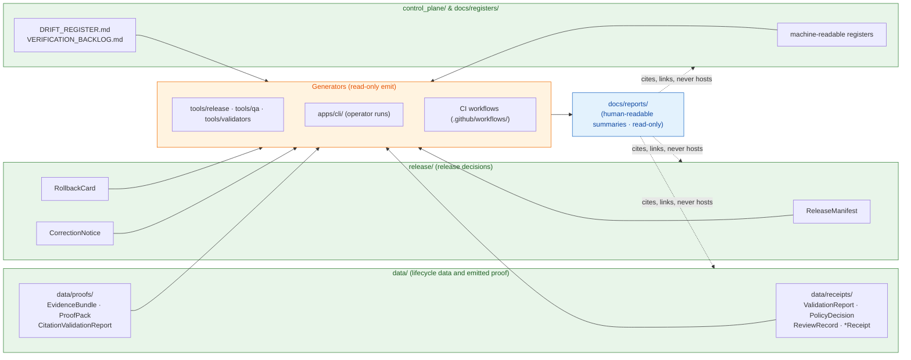

# docs/reports — Generated Review & Release Reports

> Human-readable, machine-generated, read-only summaries of governance, validation, release, and rollback outcomes. The *narrative window* onto the trust spine; never its source of truth.

-2e7d32)


-607d8b)
<!-- TODO: replace badges with live Shields.io endpoints once CI is wired:
  build status, last-generated timestamp, generator coverage, drift count. -->

| Field | Value |
|---|---|
| **Folder** | `docs/reports/` |
| **Authority class** | Canonical sub-tree under `docs/` · derivative / generated *(per Directory Rules §6.1)* |
| **Doctrine status** | **CONFIRMED** — placement is named in Directory Rules §6.1 |
| **Repo presence** | **PROPOSED / NEEDS VERIFICATION** — not verified against a mounted repo in this session |
| **Edit posture** | **Read-only** — content is emitted by generators; humans read, do not author |
| **Owners** | *TODO* — Docs steward + Release/Review tooling owner *(placeholder; confirm in `CODEOWNERS`)* |
| **Last reviewed** | *TODO — YYYY-MM-DD* |
| **Governing doctrine** | [`../doctrine/directory-rules.md`](../doctrine/directory-rules.md) §6.1, §13, §15 |
| **Related ADRs** | *None directly govern this folder.* [ADR-0001 (schema home)](../adr/) is context for reports that reference schemas. |

---

## Table of contents

1. [Scope](#1-scope)
2. [Repo fit](#2-repo-fit)
3. [What belongs here](#3-what-belongs-here)
4. [What does **not** belong here](#4-what-does-not-belong-here)
5. [Directory layout (proposed)](#5-directory-layout-proposed)
6. [How a report gets here — flow](#6-how-a-report-gets-here--flow)
7. [Inputs and outputs](#7-inputs-and-outputs)
8. [Authoring vs. generation](#8-authoring-vs-generation)
9. [Naming and report shape](#9-naming-and-report-shape)
10. [Validation](#10-validation)
11. [Review burden](#11-review-burden)
12. [Anti-patterns and drift](#12-anti-patterns-and-drift)
13. [Quickstart (reader)](#13-quickstart-reader)
14. [FAQ](#14-faq)
15. [Related folders and docs](#15-related-folders-and-docs)
16. [Open questions · verification backlog](#16-open-questions--verification-backlog)
17. [Appendix](#17-appendix)

---

## 1. Scope

`docs/reports/` is the human-facing **reading room** for governance outcomes already recorded elsewhere as canonical trust artifacts. It holds *narratives about* receipts, proofs, manifests, reviews, drills, and registers — not the receipts, proofs, or manifests themselves.

The four-way non-collapse rule from Directory Rules §6.1 applies in full:

> `docs/` **explains** · `control_plane/` **indexes** · `contracts/` **defines meaning** · `schemas/` **defines shape**.
> These four MUST NOT collapse into one another.

Inside `docs/`, a further internal split applies:

| Sibling | What it does | Authority |
|---|---|---|
| [`../doctrine/`](../doctrine/) | Authored rules, posture, lifecycle law | Canonical doctrine |
| [`../architecture/`](../architecture/) | Authored system descriptions | Canonical design |
| [`../adr/`](../adr/) | Authored decision records | Canonical decisions |
| [`../registers/`](../registers/) | Authored human-facing registers (drift, verification backlog) | Canonical registers |
| [`../runbooks/`](../runbooks/) | Authored ops procedures | Canonical procedures |
| [`../intake/`](../intake/) | Authored idea intake | Working / exploratory |
| **`./` (this folder)** | **Generated** narrative summaries derived from canonical receipts, proofs, manifests, reviews, and registers | **Generated · read-only** |
| [`../archive/`](../archive/) | Lineage / exploratory / deprecated | Archive |

> [!IMPORTANT]
> `docs/reports/` is **derivative**. Every claim in a report MUST resolve to a canonical artifact under `data/receipts/`, `data/proofs/`, `release/`, `control_plane/`, or `docs/registers/`. A report that asserts a fact with no canonical anchor is drift.

[↑ Back to top](#table-of-contents)

---

## 2. Repo fit

```text
Kansas-Frontier-Matrix/
└── docs/
    └── reports/   ← you are here
```

**Upstream (sources of report content)** — *CONFIRMED doctrine; presence PROPOSED until verified in mounted repo:*

- [`../../data/receipts/`](../../data/receipts/) — `ValidationReport`, `RunReceipt`, `PolicyDecision`, `RedactionReceipt`, `TransformReceipt`, `AggregationReceipt`, `ModelRunReceipt`, `AIReceipt`, `RepresentationReceipt`, `ReviewRecord`
- [`../../data/proofs/`](../../data/proofs/) — `EvidenceBundle`, `ProofPack`, `CitationValidationReport`
- [`../../release/`](../../release/) — `ReleaseManifest`, `RollbackCard`, `CorrectionNotice`, `PromotionDecision`
- [`../../control_plane/`](../../control_plane/) — registers (`release_state_register.yaml`, `verification_backlog.yaml`, `contradiction_register.yaml`, etc.)
- [`../registers/`](../registers/) — `DRIFT_REGISTER.md`, `VERIFICATION_BACKLOG.md`, `AUTHORITY_LADDER.md`, `CANONICAL_LINEAGE_EXPLORATORY.md`

**Downstream (consumers of `docs/reports/`)**

- Stewards, reviewers, release authority, and rights-holders reading governance outcomes
- Auditors tracing decisions back to canonical evidence
- PR descriptions and review-console summaries that *link* to a report rather than re-paste its content
- Contributors orienting to release cadence, drift posture, and outstanding verification items

> [!NOTE]
> Published *public* report **payloads** (downloadable PDFs, data deliverables, public atlases) live in [`../../data/published/reports/`](../../data/published/reports/) — they are release artifacts, not docs. `docs/reports/` is for the steward-facing narrative summary, not the public payload.

[↑ Back to top](#table-of-contents)

---

## 3. What belongs here

A file belongs in `docs/reports/` when **all** of the following are true:

1. It is **human-readable** narrative (Markdown, optionally with linked figures).
2. It is **emitted by a generator** in `tools/`, `apps/cli/`, `pipelines/`, or a CI workflow — not hand-authored.
3. Every consequential claim it makes resolves to a **canonical artifact** elsewhere in the repo (receipt, proof, manifest, register entry, or ADR).
4. It is **read-only** in normal flow: PRs that hand-edit content here are drift candidates (§12).

Common report families (**PROPOSED catalog** — specific filenames depend on what the generator is named; canonical home for each named *receipt/manifest/record* is in `data/receipts/`, `data/proofs/`, or `release/`):

| Report family | What it summarizes | Canonical anchor it must cite |
|---|---|---|
| Release report | Contents, digests, signatures, rollback target of a `PUBLISHED` transition | `ReleaseManifest` in `release/manifests/` |
| Promotion / catalog-closure report | Outcome of `PROCESSED → CATALOG` for a dataset | `EvidenceBundle`, `CatalogMatrix` entry, `ValidationReport` |
| Validation summary | Pass/fail roll-up of validator runs for a domain or release window | `ValidationReport` records in `data/receipts/` |
| Rollback drill report | Dry-run rollback narrative and result | `RollbackCard` (drill) in `release/rollback_cards/` |
| Correction notice digest | Human-readable companion to a correction event | `CorrectionNotice` in `release/correction_notices/` |
| Stewardship / review window summary | Aggregate of `ReviewRecord`s over a time window | `ReviewRecord` records |
| Sensitive-lane redaction summary | Aggregate of redaction transforms applied during a release | `RedactionReceipt` records |
| Drift / verification backlog snapshot | Frozen view of `DRIFT_REGISTER.md` / `VERIFICATION_BACKLOG.md` at a release | `docs/registers/*` at known revision |
| Governance health snapshot | Periodic roll-up of indicators (per Atlas v1.1 §24.11) | `control_plane/*` registers + per-folder READMEs |
| AI-surface report | Focus Mode outcome distribution (ANSWER / ABSTAIN / DENY / ERROR), citation health | `AIReceipt` records, `CitationValidationReport` |

> [!TIP]
> If a report family is not in the table, that does not forbid it — it means the generator and its inputs are not yet recorded here. Add a row in the same PR that adds the generator.

[↑ Back to top](#table-of-contents)

---

## 4. What does **not** belong here

The following items have canonical homes elsewhere and **MUST NOT** be authored, stored, or mirrored under `docs/reports/`. This list is as load-bearing as §3.

| Do NOT put here | Canonical home | Why |
|---|---|---|
| `ReleaseManifest`, `RollbackCard`, `CorrectionNotice`, `PromotionDecision` | `release/` | These are *decisions*, not summaries. *(Directory Rules §6.1, §10)* |
| `ValidationReport`, `RunReceipt`, `PolicyDecision`, `Redaction/Transform/Aggregation/Model/AI Receipt` | `data/receipts/` | Machine-readable receipts; `docs/reports/` may summarize, never replace. |
| `EvidenceBundle`, `ProofPack`, `CitationValidationReport` | `data/proofs/` | Trust spine artifacts; not narrative material. |
| Live machine-readable registers | `control_plane/` | Machine-readable governance maps; reports cite them, do not host them. |
| Human-edited registers (drift, verification backlog, authority ladder) | [`../registers/`](../registers/) | Authored, not generated. |
| ADRs | [`../adr/`](../adr/) | Authored decisions; reports cite ADRs, do not absorb them. |
| Doctrine / architecture / runbooks | [`../doctrine/`](../doctrine/), [`../architecture/`](../architecture/), [`../runbooks/`](../runbooks/) | Authored, not generated. |
| Public, downloadable report payloads | `data/published/reports/` | Release artifacts; subject to the lifecycle invariant. |
| Build outputs, mkdocs site, lint roll-ups, coverage HTML | `artifacts/build/`, `artifacts/docs/`, `artifacts/qa/` | Compatibility scope; non-trust-bearing. *(Directory Rules §8.2)* |
| Source data, fixtures, samples | `data/`, `fixtures/`, `examples/` | Data plane; never under `docs/`. |
| Schemas, contracts, policies | `schemas/`, `contracts/`, `policy/` | Canonical authority planes. |

> [!WARNING]
> The single most common drift pattern around `docs/reports/` is **using it as a parallel home for receipts, proofs, or manifests** because they are easier to read here. Directory Rules §13.2 names this anti-pattern explicitly. Resist it. If a receipt is hard to read, write a generator that emits a Markdown summary — do not move the receipt.

[↑ Back to top](#table-of-contents)

---

## 5. Directory layout (proposed)

> [!NOTE]
> **PROPOSED structure.** The names below are an organizing suggestion consistent with Directory Rules §6.1 and the receipt families in Atlas v1.1 §24.2. Concrete folder names should follow the generator that produces them; an ADR is **not** required to choose between the layouts below (they are sub-folder choices under a canonical root), but the choice MUST be reflected in the generators that write here.

```text
docs/reports/
├── README.md                          # ← this file
├── release/                           # one folder per release id, or a single rolling stream
│   └── <release_id>/
│       ├── release_report.md          # narrative companion to ReleaseManifest
│       ├── promotion_report.md        # CATALOG → PUBLISHED narrative
│       ├── validation_summary.md      # roll-up of ValidationReport(s) for the release
│       ├── redaction_summary.md       # roll-up of RedactionReceipt(s)
│       └── citation_health.md         # roll-up of CitationValidationReport(s)
├── rollback/
│   └── <release_id>/
│       └── rollback_drill_report.md   # narrative companion to RollbackCard (drill)
├── correction/
│   └── <release_id>/
│       └── correction_summary.md      # narrative companion to CorrectionNotice
├── review/
│   └── <window>/                      # weekly | monthly | per-release
│       └── stewardship_summary.md     # roll-up of ReviewRecord(s)
├── governance/
│   └── <window>/
│       └── health_snapshot.md         # Atlas §24.11 indicators snapshot
├── ai/
│   └── <window>/
│       └── focus_mode_summary.md      # AIReceipt + CitationValidationReport roll-up
├── drift/
│   └── <window>/
│       └── drift_snapshot.md          # frozen view of docs/registers/DRIFT_REGISTER.md
└── verification/
    └── <window>/
        └── backlog_snapshot.md        # frozen view of VERIFICATION_BACKLOG.md
```

**Optional per-folder `README.md`** SHOULD declare the generator name, expected cadence, and the canonical anchor each report family must cite. A subfolder without that README is a drift candidate (Directory Rules §15 applies in spirit).

[↑ Back to top](#table-of-contents)

---

## 6. How a report gets here — flow


```mermaid
flowchart LR
  subgraph DATA["data/ (lifecycle data and emitted proof)"]
    REC["data/receipts/<br/>ValidationReport · PolicyDecision<br/>ReviewRecord · *Receipt"]
    PRF["data/proofs/<br/>EvidenceBundle · ProofPack<br/>CitationValidationReport"]
  end

  subgraph RELEASE["release/ (release decisions)"]
    MAN["ReleaseManifest"]
    RB["RollbackCard"]
    CN["CorrectionNotice"]
  end

  subgraph REG["control_plane/ &amp; docs/registers/"]
    CP["machine-readable registers"]
    DR["DRIFT_REGISTER.md<br/>VERIFICATION_BACKLOG.md"]
  end

  subgraph GEN["Generators (read-only emit)"]
    TOOL["tools/release · tools/qa · tools/validators"]
    CLI["apps/cli/ (operator runs)"]
    CI["CI workflows (.github/workflows/)"]
  end

  REPORTS["docs/reports/<br/>(human-readable summaries · read-only)"]

  REC --> GEN
  PRF --> GEN
  MAN --> GEN
  RB  --> GEN
  CN  --> GEN
  CP  --> GEN
  DR  --> GEN
  GEN --> REPORTS

  REPORTS -. "cites, links, never hosts" .-> DATA
  REPORTS -. "cites, links, never hosts" .-> RELEASE
  REPORTS -. "cites, links, never hosts" .-> REG

  classDef canon fill:#e8f5e9,stroke:#2e7d32,color:#1b5e20;
  classDef gen   fill:#fff3e0,stroke:#ef6c00,color:#e65100;
  classDef rep   fill:#e3f2fd,stroke:#1565c0,color:#0d47a1;
  class DATA,RELEASE,REG canon;
  class GEN gen;
  class REPORTS rep;
```

The flow is **one-way** by design. Reports never re-enter the trust spine. A report that needs to influence a decision MUST do so through the canonical artifact it cites — typically by triggering a new `ReviewRecord`, `PolicyDecision`, or `CorrectionNotice` upstream.

> [!IMPORTANT]
> The trust membrane (Directory Rules §7.1, Atlas v1.1 §24.6.2) forbids any public client and any normal UI surface from reading RAW / WORK / QUARANTINE / canonical internal stores. `docs/reports/` is **not** a public surface; it is a steward-facing reading room inside the repo. Public publication of report content happens through `data/published/reports/` after a release gate.

[↑ Back to top](#table-of-contents)

---

## 7. Inputs and outputs

### Inputs (what flows in)

| Source | Object family it contributes | Citation expected in the report |
|---|---|---|
| `data/receipts/validation/` | `ValidationReport` | `validator_id`, `target`, `passes[]`, `failures[]`, `time` |
| `data/receipts/pipeline/` | `RunReceipt`, `TransformReceipt`, `AggregationReceipt` | `run_id`, `inputs`, `parameters`, `time` |
| `data/receipts/ai/` | `AIReceipt` | `prompt_scope`, `evidence_refs[]`, `outcome` (ANSWER \| ABSTAIN \| DENY \| ERROR), `reason_code` |
| `data/receipts/release/` | governance receipts for releases | `release_id`, `decision`, `evidence_refs[]` |
| `data/proofs/evidence_bundle/` | `EvidenceBundle` | resolved `EvidenceRef`s |
| `data/proofs/citation_validation/` | `CitationValidationReport` | citation pass/fail per claim |
| `release/manifests/` | `ReleaseManifest` | `release_id`, `digests`, `rollback_target` |
| `release/rollback_cards/` | `RollbackCard` | `rollback_to`, `reason`, `invalidates[]` |
| `release/correction_notices/` | `CorrectionNotice` | `claim_ref`, `prior_release_ref`, `change_summary` |
| `control_plane/*.yaml` | registers | register name, revision, snapshot time |
| `docs/registers/*.md` | human-facing registers | register name, revision, snapshot time |

### Outputs (what this folder emits)

`docs/reports/` is a **terminal sink** in the doc-plane sense: it does not feed back into `contracts/`, `schemas/`, `policy/`, `data/`, or `release/`. Its outputs are:

- Markdown narrative for stewards, reviewers, auditors, and contributors.
- Stable URLs/anchors that PR descriptions and review-console summaries can cite.
- Cross-links into the canonical artifacts the report summarizes.

[↑ Back to top](#table-of-contents)

---

## 8. Authoring vs. generation

> [!CAUTION]
> Hand-authoring under `docs/reports/` is a drift signal. The folder is **read-only** in normal flow.

| Activity | Allowed here? | Where it should happen instead |
|---|---|---|
| Writing a new report by hand | **No** | Add or extend a generator in `tools/` / `pipelines/` / `apps/cli/` |
| Fixing a typo in a generated report | **No** — fix the generator and re-emit | Generator code |
| Editing a generated report to change a number | **No** — drift; see §12 | Fix the upstream receipt; re-run the generator |
| Adding a missing report family | **No** — write the generator first | `tools/`, then re-emit |
| Adding/updating this `README.md` | **Yes** | Right here (authored doc, narrow exception) |
| Adding optional per-subfolder `README.md` | **Yes** | Inside the subfolder (authored doc, narrow exception) |

The narrow exceptions above (this README and per-subfolder READMEs) are authored *about* the generated content — they are not reports themselves.

[↑ Back to top](#table-of-contents)

---

## 9. Naming and report shape

**PROPOSED** conventions. Final names follow the generator; the conventions below exist so generators stay consistent.

- File names: lowercase with underscores, ending in `.md` — e.g., `release_report.md`, `rollback_drill_report.md`.
- Each report MUST begin with a short header table identifying: `report_id`, `family`, `generator`, `generator_version`, `inputs[]` (citations into canonical homes), `release_id` or `window`, `generated_at`, `spec_hash` (if applicable), and `truth_label` (CONFIRMED · PROPOSED · NEEDS VERIFICATION).
- Every consequential claim cites a canonical artifact path or identifier; uncited claims are drift.
- Reports MUST NOT include secrets, raw PII, exact restricted geometry, or any payload that would fail the public-export gates documented in Master MapLibre §V *(content of public exports remains governed by `policy/` and `release/`; this folder is steward-facing but inherits the same disciplines)*.

[↑ Back to top](#table-of-contents)

---

## 10. Validation

- **Generator parity** — for each report file, a CI check SHOULD re-run the generator on the cited inputs at the cited revision and compare; mismatch is drift. *(PROPOSED — generators are not enumerated in this session.)*
- **Link integrity** — every citation into `data/receipts/`, `data/proofs/`, `release/`, `control_plane/`, or `docs/registers/` MUST resolve at the cited revision.
- **No trust-content migration** — a CI check SHOULD fail when a file under `docs/reports/` matches a canonical receipt/proof/manifest schema; that file belongs elsewhere.
- **No hand-edit drift** — a CI check SHOULD compare last-author against the configured generator identities and flag human authors on non-README paths.
- **Freshness** — release/rollback/correction reports SHOULD exist for every `ReleaseManifest`, `RollbackCard`, and `CorrectionNotice`; missing report → drift register entry.

> [!NOTE]
> The validators above are **PROPOSED** unless and until verified in `tools/validators/` and a CI workflow. None of them are claimed as currently enforced.

[↑ Back to top](#table-of-contents)

---

## 11. Review burden

| Change type | Reviewer(s) |
|---|---|
| Updates to **this `README.md`** | Docs steward |
| New generator that emits into `docs/reports/` | Docs steward + tooling owner; reviewer named in `CODEOWNERS` *(TODO)* |
| New report family (new subfolder) | Docs steward + the subsystem owner whose receipts feed it |
| Sub-folder `README.md` | Docs steward + sub-system owner |
| Hand-edit to a generated report | **Reject** — open a drift entry in [`../registers/DRIFT_REGISTER.md`](../registers/DRIFT_REGISTER.md) and fix the generator |

Per-root README contract from Directory Rules §15 applies in spirit: keep `Purpose`, `Authority level`, `Status`, inputs/outputs, validation, and review burden visible. This file is structured to satisfy it.

[↑ Back to top](#table-of-contents)

---

## 12. Anti-patterns and drift

| Anti-pattern | Symptom | Fix |
|---|---|---|
| **Parallel trust home** | A `ReleaseManifest`, `EvidenceBundle`, or `ValidationReport` JSON is committed directly under `docs/reports/` | Move to `release/manifests/` or `data/{receipts,proofs}/`; leave a stub citation in the report. *(Directory Rules §13.2)* |
| **Hand-edited summary** | Author commits a `release_report.md` directly | Build a generator in `tools/release/` or `apps/cli/`; revert the hand edit; cite generator in the report header. |
| **Documentation-as-truth** | A reviewer cites a `docs/reports/*.md` line as the source of a release decision | Promote to ADR or `control_plane/release_state_register.yaml`. `docs/` explains; it doesn't decide alone. *(Directory Rules §13)* |
| **Public-payload misplacement** | A downloadable PDF or public atlas report lands here | Move to `data/published/reports/` and run it through release gates. |
| **Stale report claimed current** | An old release report is referenced from a PR as "the current state" | Add a freshness banner in the report header; require generator re-run before citation. |
| **Drift-by-omission** | A `ReleaseManifest` exists with no companion `release_report.md` | Open a drift entry; run the generator. |
| **Mirror without source** | A report references a register or receipt that has since moved | Treat as broken citation; fail link-integrity check. |

[↑ Back to top](#table-of-contents)

---

## 13. Quickstart (reader)

A reader landing in `docs/reports/` should be able to:

1. **Find the release they care about** — start at `release/<release_id>/release_report.md` (PROPOSED layout).
2. **Trace any claim to a canonical artifact** — every consequential claim in a report links into `data/receipts/`, `data/proofs/`, or `release/`. If a claim does not link, treat it as drift (§12).
3. **Check freshness** — confirm the report's `generated_at` is recent relative to the cited `ReleaseManifest.time` / `RollbackCard.time` / `CorrectionNotice.time`.
4. **Open the canonical record** for the authoritative version — the report is a window, not the artifact.
5. **Open a drift entry** in [`../registers/DRIFT_REGISTER.md`](../registers/DRIFT_REGISTER.md) for any mismatch or missing report — do not edit `docs/reports/` directly.

```text
# Pseudocode reader path (PROPOSED — depends on actual generator names)
1. docs/reports/release/<release_id>/release_report.md     ← summary
2. release/manifests/<release_id>/ReleaseManifest.json     ← canonical decision
3. data/proofs/evidence_bundle/<bundle_id>.json            ← evidence
4. data/receipts/validation/<run_id>/ValidationReport.json ← what was validated
```

[↑ Back to top](#table-of-contents)

---

## 14. FAQ

> [!NOTE]
> Q&A reflects current doctrine. Implementation status of any tool or path mentioned is **PROPOSED / NEEDS VERIFICATION** unless verified in a mounted repo.

**Q. Can I author a one-off report here for a stakeholder?**
No. If it's worth keeping, it's worth generating. Add or extend a generator in `tools/` or `apps/cli/`; the generator emits into `docs/reports/`. If the audience is the public, the deliverable goes through release gates into `data/published/reports/`.

**Q. Why isn't this folder under `data/` if it's "generated"?**
`data/` carries lifecycle data and emitted proof objects (machine-readable). `docs/reports/` carries human-readable narrative that explains them. Directory Rules §6.1 separates "explains" (`docs/`) from "indexes" (`control_plane/`) and from "lifecycle data" (`data/`). Reports belong to the explanation plane.

**Q. Are reports here the same as `data/published/reports/`?**
No. `docs/reports/` is the steward-facing reading room for governance outcomes inside the repo. `data/published/reports/` carries public-facing release payloads that have passed catalog closure and release gates. The two have different audiences, different lifecycles, and different validation regimes.

**Q. What about CI-generated lint, coverage, or test reports?**
Those live in `artifacts/qa/` (compatibility scope per Directory Rules §8.2). They are not trust-bearing and they are not narrative; they do not belong in `docs/reports/`.

**Q. Where do ADRs go?**
[`../adr/`](../adr/). A report MAY cite an ADR; it MUST NOT replace one.

**Q. Where does an authored stewardship review of a sensitive lane go?**
The decision is a `ReviewRecord` under `data/receipts/`. A human-readable narrative companion MAY live under `docs/reports/review/<window>/stewardship_summary.md` once a generator exists; until then, keep the narrative inside the `ReviewRecord` itself or in a runbook entry.

**Q. Can a report contain restricted geometry, living-person fields, or rare-species locations?**
No. Sensitive-content disciplines apply equally here. If a report would otherwise expose restricted content, the generator MUST redact, generalize, or abstain (per the sensitivity disciplines in Atlas v1.1 §24.5).

[↑ Back to top](#table-of-contents)

---

## 15. Related folders and docs

- [`../doctrine/directory-rules.md`](../doctrine/directory-rules.md) — §6.1 names `docs/reports/`; §13 names the drift patterns this folder is most exposed to; §15 sets the per-root README contract.
- [`../registers/DRIFT_REGISTER.md`](../registers/DRIFT_REGISTER.md) — where drift entries against `docs/reports/` are recorded *(presence TODO; verify)*.
- [`../registers/VERIFICATION_BACKLOG.md`](../registers/VERIFICATION_BACKLOG.md) — open verification items, including report generators *(presence TODO; verify)*.
- [`../adr/`](../adr/) — decision records; [`ADR-0001`](../adr/) covers schema home.
- [`../runbooks/`](../runbooks/) — authored ops procedures (rollback drills, validation runs, incident response).
- [`../../control_plane/`](../../control_plane/) — machine-readable governance maps; reports cite these.
- [`../../release/`](../../release/) — release decisions; the principal upstream for release/rollback/correction reports.
- [`../../data/receipts/`](../../data/receipts/) and [`../../data/proofs/`](../../data/proofs/) — receipts and evidence; the principal upstream for validation, review, and AI reports.
- [`../../data/published/reports/`](../../data/published/reports/) — public-facing report payloads (not the same as this folder).
- [`../../tools/`](../../tools/), [`../../apps/cli/`](../../apps/cli/), [`../../pipelines/`](../../pipelines/) — generators that emit into this folder.

[↑ Back to top](#table-of-contents)

---

## 16. Open questions · verification backlog

These items are **NEEDS VERIFICATION** until checked against a mounted repository. They SHOULD be tracked in [`../registers/VERIFICATION_BACKLOG.md`](../registers/VERIFICATION_BACKLOG.md).

- [ ] **NEEDS VERIFICATION** — Does `docs/reports/` currently exist in the mounted repo?
- [ ] **NEEDS VERIFICATION** — Which generators in `tools/`, `pipelines/`, and `apps/cli/` currently emit into `docs/reports/` (if any)?
- [ ] **NEEDS VERIFICATION** — Is the CI generator-parity check implemented?
- [ ] **NEEDS VERIFICATION** — Is there a freshness check tying `ReleaseManifest`/`RollbackCard`/`CorrectionNotice` to companion reports?
- [ ] **NEEDS VERIFICATION** — Is `docs/registers/DRIFT_REGISTER.md` present, and does it have an entry shape for `docs/reports/` drift?
- [ ] **NEEDS VERIFICATION** — Are the proposed subfolders in §5 (`release/`, `rollback/`, `correction/`, `review/`, `governance/`, `ai/`, `drift/`, `verification/`) the right cut, or should they collapse into a flatter scheme?
- [ ] **NEEDS VERIFICATION** — Owners and `CODEOWNERS` entries for this folder.
- [ ] **PROPOSED** — A small ADR may be useful to fix the subfolder taxonomy in §5 (not strictly required by Directory Rules §2.4, since no canonical root is added or renamed).

[↑ Back to top](#table-of-contents)

---

## 17. Appendix

<details>
<summary><strong>A. Receipt → report-family mapping (PROPOSED, derived from Atlas v1.1 §24.2)</strong></summary>

| Canonical artifact (Atlas v1.1 §24.2) | Most likely report family in `docs/reports/` | Notes |
|---|---|---|
| `SourceDescriptor` | (none direct) | Admission events surface in stewardship summaries. |
| `TransformReceipt` | `release/*/validation_summary.md` | Roll-up at release boundary. |
| `RedactionReceipt` | `release/*/redaction_summary.md` | Sensitive-lane companion. |
| `AggregationReceipt` | `release/*/validation_summary.md` | Aggregate publication context. |
| `ModelRunReceipt` | `release/*/validation_summary.md`, `ai/*/focus_mode_summary.md` (if model is AI-side) | Model identity + version visible. |
| `RepresentationReceipt` | `release/*/validation_summary.md` | Reality-boundary surface. |
| `AIReceipt` | `ai/<window>/focus_mode_summary.md` | Outcome distribution roll-up. |
| `ReviewRecord` | `review/<window>/stewardship_summary.md` | Aggregate of decisions. |
| `PolicyDecision` | `release/*/validation_summary.md`, `governance/<window>/health_snapshot.md` | Decision distribution view. |
| `ValidationReport` | `release/*/validation_summary.md` | Per-release roll-up. |
| `ReleaseManifest` | `release/<release_id>/release_report.md` | One-for-one narrative companion. |
| `CorrectionNotice` | `correction/<release_id>/correction_summary.md` | One-for-one narrative companion. |
| `RollbackCard` | `rollback/<release_id>/rollback_drill_report.md` | Drill or real-rollback narrative. |
| `RealityBoundaryNote` | (embedded in relevant reports) | Surface fidelity vs. evidence fidelity. |
| `MatrixCellReceipt` | `release/*/validation_summary.md` (Frontier Matrix portion) | Cell-level inputs. |
| `StorySnapshot` / `ExportReceipt` | `release/*/citation_health.md` | Export citation preservation. |

</details>

<details>
<summary><strong>B. Glossary (placement-relevant terms)</strong></summary>

| Term | Short definition relevant to `docs/reports/` |
|---|---|
| **Canonical artifact** | A receipt, proof, manifest, or register entry that *is* the truth, not a description of it. |
| **Derivative narrative** | A human-readable rendering of canonical artifacts; what `docs/reports/` holds. |
| **Generator** | A tool, CLI command, or CI step in `tools/`, `apps/cli/`, `pipelines/`, or `.github/workflows/` that emits a Markdown file into `docs/reports/`. |
| **Trust membrane** | The boundary that prevents raw / unreviewed / model-generated / internal state from becoming public truth. `docs/reports/` is steward-facing, downstream of the membrane on the reading side, never the publishing side. |
| **EvidenceBundle / EvidenceRef** | Resolved support package for claims; `data/proofs/`. A report MAY summarize bundle contents; it MUST NOT redefine them. |
| **ReleaseManifest** | The release decision artifact; `release/manifests/`. Each one MAY have one companion report under `docs/reports/release/<release_id>/`. |
| **RollbackCard** | Rollback decision artifact; `release/rollback_cards/`. Each MAY have one companion drill or real-rollback report. |
| **CorrectionNotice** | Public notice of a corrected claim; `release/correction_notices/`. Each MAY have one companion report. |
| **ValidationReport** | Validator-run record; `data/receipts/validation/`. Multiple are typically rolled up per release. |
| **AIReceipt** | Governed-AI answer record (ANSWER · ABSTAIN · DENY · ERROR); `data/receipts/ai/`. |
| **Drift register entry** | `../registers/DRIFT_REGISTER.md`. The first response to any mismatch between a report and its canonical anchor. |

</details>

<details>
<summary><strong>C. Skeleton header for a generated report (PROPOSED)</strong></summary>

```markdown
<!-- THIS FILE IS GENERATED. Do not hand-edit. See docs/reports/README.md. -->
# <Report family> — <release_id | window>

| Field | Value |
|---|---|
| report_id | <stable id> |
| family | release | rollback | correction | review | validation | redaction | citation_health | ai | governance_health | drift_snapshot | backlog_snapshot |
| generator | <path/to/generator> |
| generator_version | <semver or commit> |
| inputs | <list of canonical artifact paths or ids> |
| release_id or window | <release id | window descriptor> |
| generated_at | <ISO-8601 timestamp> |
| spec_hash | <sha256 if applicable> |
| truth_label | CONFIRMED | PROPOSED | NEEDS VERIFICATION |

## Summary
<narrative; every consequential claim links to a canonical artifact>

## Cited canonical artifacts
- <path or id>
- <path or id>
- ...

## Drift or open items
- <link to drift register entry, if any>
```

</details>

<details>
<summary><strong>D. Source map for this README</strong></summary>

- Directory Rules (project doctrine) §0, §2.3, §2.4, §6.1, §7.4, §8.2, §13, §15 — placement, authority, anti-patterns, README contract.
- Domains Culmination Atlas v1.1 §24.2 (Receipt Catalog), §24.6 (Pipeline Gates), §24.11 (Governance Health Indicators) — receipt families and report-family motivation.
- Master MapLibre Components-Functions-Features v1.8 §V — exports / screenshots / reports / citation preservation disciplines (treated as upstream pressure on report content, not as authority over placement).
- KFM Domain & Capability Encyclopedia — generated review/release reports posture and verification backlog.

</details>

---

### Last reviewed
*TODO — YYYY-MM-DD; this file SHOULD be revisited within six months per Directory Rules §15.*

### Related docs
- [`../doctrine/directory-rules.md`](../doctrine/directory-rules.md)
- [`../registers/DRIFT_REGISTER.md`](../registers/DRIFT_REGISTER.md) *(presence TODO)*
- [`../registers/VERIFICATION_BACKLOG.md`](../registers/VERIFICATION_BACKLOG.md) *(presence TODO)*
- [`../adr/`](../adr/)
- [`../../release/`](../../release/)
- [`../../data/receipts/`](../../data/receipts/)
- [`../../data/proofs/`](../../data/proofs/)
- [`../../control_plane/`](../../control_plane/)

[↑ Back to top](#table-of-contents)
