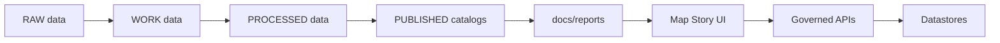

<!-- [KFM_META_BLOCK_V2]
doc_id: kfm://doc/f3c4b2dd-94d6-4b2d-9f1a-0d4f06a0d1a7
title: Kansas Frontier Matrix — Reports Index
type: standard
version: v1
status: draft
owners: KFM Docs Maintainers
created: 2026-03-04
updated: 2026-03-04
policy_label: public
related:
  - docs/reports/self-validation/README.md
  - docs/reports/visualization/README.md
  - docs/reports/telemetry/README.md
  - docs/reports/audit/README.md
tags: [kfm, reports]
notes:
  - This README defines what belongs in docs/reports and provides a governed index to sub-areas.
[/KFM_META_BLOCK_V2] -->

<div align="center">

# 📄 Kansas Frontier Matrix — Reports Index
**One-line purpose:** A governed index of *human-readable* report artifacts (validation, visualization, telemetry, audit) that are traceable, reproducible, and policy-safe.

`docs/reports/README.md`


</div>

> **IMPACT**
> - **Status:** **PROPOSED** — Active directory index (confirm via repo tree)
> - **Owners:** **UNKNOWN** — `KFM Docs Maintainers` (set a concrete team/user)
> - **Policy posture:** **PROPOSED** — default-deny, fail-closed promotion gates

**Quick links:**  
[Report Categories](#report-categories) · [Directory Tree](#directory-tree) · [Quickstart](#quickstart) · [Add a Report](#add-a-report) · [Promotion Gates](#promotion-gates) · [Checklist](#definition-of-done)

---

## Scope

**CONFIRMED:** `docs/reports/` is used as an index for multiple report families (e.g., visualization, self-validation, telemetry, audit) with their own sub-READMEs.

**PROPOSED (contract):** `docs/reports/` is the canonical home for **governed, human-readable reporting artifacts** that:
- summarize or validate pipeline outputs,
- link back to authoritative datasets and catalogs (STAC/DCAT/PROV),
- can be safely referenced by Story Nodes / Focus Mode / documentation.

---

## Where this fits in the repo

**PROPOSED (architecture alignment):**
- `data/` and catalogs (STAC/DCAT/PROV) are the *authoritative* data products.
- `docs/reports/` is a *documentation-facing* surface for results, audits, and visuals.
- UIs and clients should reference governed APIs for data access; reports should not imply direct DB reads.


```mermaid
flowchart LR
  raw[RAW data] --> work[WORK data] --> proc[PROCESSED data] --> pub[PUBLISHED catalogs]
  pub --> reports[docs/reports]
  reports --> ui[Map Story UI]
  ui --> api[Governed APIs]
  api --> stores[Datastores]
```

---

## Acceptable inputs

**PROPOSED (what belongs here):**
- Markdown/PDF “report” documents (summaries, methods, interpretation notes).
- Validation logs and rollups that are meant for human review and audit (ideally also machine-parseable).
- Visualization artifacts (PNG/SVG/GeoJSON exports) *when paired with provenance/metadata*.
- Telemetry and performance metrics snapshots intended for dashboards/review.

---

## Exclusions

**PROPOSED (what must *not* go here):**
- Raw, work, processed datasets (these belong in `data/` with proper lifecycle controls).
- Secrets, tokens, keys, signed URLs, credentials.
- Unredacted sensitive locations, precise coordinates, or “how to locate” guidance.
- Ad-hoc scratch files; anything that should be ephemeral should go to local scratch (not committed).
- Large binaries without a provenance/manifest story (avoid bloating Git history).

> **IMPORTANT:** If governance status is unclear for a would-be report artifact, treat it as **UNKNOWN** and do **not** publish/promote until reviewed.

---

## Report categories

These sub-indexes are the “first stop” entry points.

| Category | Sub-index | What it covers | Claim status |
|---|---|---|---|
| Self-validation | `./self-validation/README.md` | Validation outputs and reproducibility reports | **CONFIRMED** |
| Visualization | `./visualization/README.md` | Maps, dashboards, animations, 3D scenes, explainability visuals | **CONFIRMED** |
| Telemetry | `./telemetry/README.md` | CI/CD + workflow telemetry, metrics snapshots | **CONFIRMED** |
| Audit | `./audit/README.md` | Governance & audit ledgers (machine-readable) | **CONFIRMED** |
| Security | `./security/README.md` | Supply-chain/SBOM/attestations | **PROPOSED** (only add if it exists) |

---

## Directory tree

```plaintext
docs/reports/
├── README.md
│
├── self-validation/
│   ├── README.md
│   ├── stac/
│   │   └── reports/
│   │       └── README.md
│   └── experiments/
│       └── README.md
│
├── visualization/
│   ├── README.md
│   ├── hydrology/
│   │   └── drought/
│   │       └── README.md
│   └── focus_mode/
│       └── story_nodes/
│           └── assets/
│               └── legends/
│                   └── symbols/
│                       └── metadata/
│                           └── climate/
│                               └── README.md
│
├── telemetry/
│   └── README.md
│
└── audit/
    └── README.md
```

---

## Quickstart

```bash
# 1) List report category indexes
find docs/reports -maxdepth 3 -name README.md -print

# 2) Quick-search for a dataset_id, run_id, or report keyword
rg "dataset_id|run_id|STAC|DCAT|PROV|telemetry|ledger" docs/reports

# 3) If reports contain JSON logs, validate they parse (basic sanity check)
find docs/reports -name "*.json" -maxdepth 5 -print0 | xargs -0 -n1 jq -e . >/dev/null
```

---

## Usage

### Add a report

**PROPOSED (minimum additive pattern):**
1. Create a folder under the correct category (or create a new category folder with its own README).
2. Add/extend the local `README.md` index for that folder.
3. Add the report artifact(s) and **pair them with metadata** (provenance, checksums, sensitivity label).
4. Update this `docs/reports/README.md` only if you add a new top-level category.

**Recommended scaffold (copy/paste):**

```plaintext
docs/reports/<category>/<topic>/
├── README.md
├── report.md              # or report.pdf
├── metadata.json          # provenance pointers, inputs, tool versions
└── checksums.sha256       # sha256sum outputs for all artifacts (optional but recommended)
```

### Promote from drafts to reports

**CONFIRMED (concept):** Draft assets belong near drafts; *canonical* narrative outputs should be promoted to `docs/reports/...` (and should link to governed data outputs).

**PROPOSED (how to promote safely):**
- Ensure the underlying dataset is already in the governed lifecycle (RAW → WORK → PROCESSED → PUBLISHED catalogs).
- Ensure the report is redacted/aggregated as needed and labeled with sensitivity classification.
- Ensure the report references dataset IDs / catalog URIs rather than embedding raw source dumps.

---

## Promotion gates

**PROPOSED (fail-closed):** A report is “publishable” only if all gates are satisfied.

| Gate | Requirement | Evidence type |
|---|---|---|
| Identity | Stable report ID/path; timestamp or version where applicable | README + filename |
| Provenance | Links to inputs + transforms + tool versions | `metadata.json` / embedded section |
| Integrity | Checksums recorded for emitted artifacts | `checksums.sha256` |
| Policy | Sensitivity labeled; redaction applied; no “how to locate” details | review + lint |
| Reproducibility | Deterministic regeneration instructions or pinned run reference | README + run reference |

> **NOTE:** If any gate is **UNKNOWN**, treat the report as **not promotable**.

---

## Definition of done

- [ ] **CONFIRMED/PROPOSED/UNKNOWN** labels used for meaningful claims in the new/edited report README(s)
- [ ] No secrets, tokens, signed URLs
- [ ] No precise coordinates / sensitive location leakage; aggregation/redaction applied as required
- [ ] Provenance pointers included (inputs, transforms, versions)
- [ ] Checksums (or equivalent integrity proof) included for non-trivial artifacts
- [ ] Links are relative and stable (no brittle local machine paths)
- [ ] Does **not** imply UI/clients access DB/storage directly (API boundary preserved)

---

## FAQ

**Why not store raw/processed datasets in `docs/reports/`?**  
Because this is a docs/report surface; datasets belong in governed `data/` lifecycle paths with catalogs and validations.

**Can I include images or GeoJSON outputs?**  
Yes—**PROPOSED**: only if paired with provenance/metadata and reviewed for sensitivity.

---

<details>
<summary><strong>Appendix: Suggested naming conventions (PROPOSED)</strong></summary>

- Prefer `kebab-case/` folders.
- Prefer `YYYY-MM-DD/` or `YYYY-MM-DDThhmmZ` for time-stamped runs/logs.
- Prefer a single “index README” per folder that:
  - lists artifacts,
  - states what they are,
  - states what produced them,
  - links to upstream catalogs / dataset IDs.

</details>

---

[⬆ Back to top](#-kansas-frontier-matrix--reports-index)
