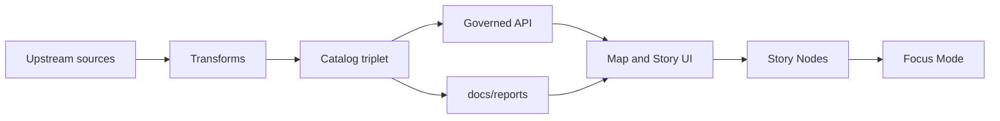

<!-- [KFM_META_BLOCK_V2]
doc_id: kfm://doc/f3c4b2dd-94d6-4b2d-9f1a-0d4f06a0d1a7
title: Kansas Frontier Matrix — Reports Index
type: standard
version: v1.1
status: draft
owners: KFM Docs Maintainers
created: 2026-03-04
updated: 2026-03-05
policy_label: public
related:
  - docs/README.md
  - docs/quality/README.md
  - docs/quality/promotion-readiness-checklist.md
  - docs/stories/README.md
tags: [kfm, reports]
notes:
  - This README defines what belongs in docs/reports and provides a governed index to report sub-areas (when present).
[/KFM_META_BLOCK_V2] -->

<a id="top"></a>

<div align="center">

# 📄 Kansas Frontier Matrix — Reports Index
**One-line purpose:** A governed index of *human-readable* report artifacts (validation, visualization, telemetry, audit) that are traceable, reproducible, and policy-safe.

`docs/reports/README.md`


</div>

> **IMPACT**
> - **Status:** **DRAFT** — scaffold index (categories are added as folders land)
> - **Owners:** **UNKNOWN** — set a concrete team/user (and route reviews via `CODEOWNERS`)
> - **Policy posture:** **CONFIRMED (documented intent)** — fail-closed; redact/generalize sensitive details; cite-or-abstain
> - **Change discipline:** **PROPOSED** — small, reversible, additive changes (avoid churny restructures)

**Quick links:**  
[Evidence Legend](#evidence-legend) · [Scope](#scope) · [Report Categories](#report-categories) · [Directory Tree](#directory-tree) · [Quickstart](#quickstart) · [Add a Report](#add-a-report) · [Promotion Gates](#promotion-gates) · [Checklist](#definition-of-done)

---

## Evidence legend

KFM docs are governed. Every meaningful claim is explicitly labeled:

- **CONFIRMED** = documented requirement or enforced invariant.
- **PROPOSED** = recommended pattern; may not be implemented yet.
- **UNKNOWN** = not verified in this checkout; includes the smallest verification step.

> **CONFIRMED rule:** If you can’t ground it, mark it **UNKNOWN** and list the smallest verification step.

---

## Scope

**CONFIRMED:** `docs/reports/` is an *optional* docs surface for **reports** (non-story) or a stub/redirect to the canonical reports location (if reports live elsewhere).

**UNKNOWN:** Which report category folders currently exist in *your* checkout.  
- **Smallest verification step:** run:
  - `find docs/reports -maxdepth 2 -type d | sort`

**PROPOSED (contract):** `docs/reports/` is the canonical home for **governed, human-readable reporting artifacts** that:
- summarize or validate pipeline outputs,
- link back to authoritative datasets and catalogs (e.g., STAC/DCAT/PROV),
- can be safely referenced by Story Nodes and Focus Mode without leaking sensitive detail.

---

## Where this fits in the repo

**CONFIRMED (documented invariant):** Clients/UI must not access storage directly; all runtime access crosses the governed API + policy boundary.

**CONFIRMED (routing):**
- **Story Nodes** live in `docs/stories/` (this repo’s canonical Story Node surface).
- **Reports** live in `docs/reports/` (this folder), and may be linked *from* Story Nodes.

**PROPOSED (architecture alignment):**
- `data/` + catalogs are the authoritative data products.
- `docs/reports/` is a documentation-facing surface for results, audits, and visuals.
- Reports must not imply direct DB reads; they should point to evidence/canonical IDs/URIs.


```mermaid
flowchart LR
  upstream[Upstream sources] --> pipeline[Transforms]
  pipeline --> catalogs[Catalog triplet]
  catalogs --> api[Governed API]
  api --> ui[Map and Story UI]

  catalogs --> reports[docs/reports]
  reports --> ui

  ui --> stories[Story Nodes]
  stories --> focus[Focus Mode]
```

**Related authoritative docs (read before adding “publishable” artifacts):**
- `../README.md` (docs hub + routing)
- `../quality/README.md` (gates, trust membrane, determinism)
- `../stories/README.md` (Story Node publication workflow)

---

## Acceptable inputs

**PROPOSED (what belongs here):**
- Markdown/PDF report documents (summaries, methods, interpretation notes).
- Validation rollups meant for human review and audit (ideally also machine-parseable).
- Visualization artifacts (PNG/SVG) *when paired with provenance/metadata*.
- Telemetry/performance snapshots intended for review (not raw time-series dumps).

---

## Exclusions

**CONFIRMED (hard exclusions):**
- Secrets, tokens, keys, signed URLs, credentials.
- Raw/work/processed datasets (these belong in governed lifecycle zones under `data/`).
- Unredacted sensitive locations, precise coordinates, or “how to locate” guidance.

**PROPOSED (strong exclusions):**
- Ad-hoc scratch files; anything ephemeral should not be committed.
- Large binaries without a provenance/manifest story (avoid bloating Git history).
- Story Node packs (put those under `docs/stories/`).

> **IMPORTANT:** If governance status is unclear for a would-be report artifact, treat it as **UNKNOWN** and do **not** publish/promote until reviewed.

---

## Report categories

**UNKNOWN:** Which categories exist in your checkout (verify with `find docs/reports -maxdepth 2 -type d`).

**PROPOSED (recommended categories):** Create these folders **only if you need them**, each with its own `README.md` index.

| Category | Expected path | What it covers | Status |
|---|---|---|---|
| Self-validation | `docs/reports/self-validation/` | Validation outputs and reproducibility reports | **PROPOSED** |
| Visualization | `docs/reports/visualization/` | Maps, dashboards, animations, explainability visuals | **PROPOSED** |
| Telemetry | `docs/reports/telemetry/` | CI/CD + workflow telemetry, metrics snapshots | **PROPOSED** |
| Audit | `docs/reports/audit/` | Governance & audit ledgers (human-readable indexes) | **PROPOSED** |
| Security | `docs/reports/security/` | SBOM summaries / supply-chain attestations (if you index them here) | **PROPOSED** |

> **NOTE:** When a category folder is created, add a `README.md` inside it and then (optionally) upgrade this table to link to that README.

---

## Directory tree

### Generate the current tree

This is the authoritative view for *your checkout*:

```bash
command -v tree >/dev/null && tree -L 4 docs/reports || find docs/reports -maxdepth 4 -print | sort
```

### Recommended layout

**PROPOSED** (minimal, scalable):

```plaintext
docs/reports/
├── README.md
│
├── self-validation/            # optional
│   └── README.md
├── visualization/              # optional
│   └── README.md
├── telemetry/                  # optional
│   └── README.md
├── audit/                      # optional
│   └── README.md
└── security/                   # optional
    └── README.md
```

---

## Quickstart

```bash
# 1) Show what exists in this checkout
command -v tree >/dev/null && tree -L 3 docs/reports || find docs/reports -maxdepth 3 -print | sort

# 2) Quick-search for evidence pointers (dataset_id, run_id, STAC/DCAT/PROV, etc.)
rg "dataset_id|dataset_version_id|run_id|STAC|DCAT|PROV|evidence" docs/reports

# 3) If reports include JSON sidecars/logs, validate they parse (basic sanity check)
command -v jq >/dev/null && find docs/reports -name "*.json" -maxdepth 6 -print0 | xargs -0 -n1 jq -e . >/dev/null || true
```

---

## Usage

### Add a report

**PROPOSED (minimum additive pattern):**
1. Create (or choose) a category folder.
2. Create a topic folder under that category.
3. Add/extend the topic `README.md` to index artifacts.
4. Add the report artifact(s) and **pair them with metadata** (provenance pointers, tool versions, checksums, sensitivity label).
5. Update this top-level `docs/reports/README.md` only if you add a *new* category surface.

**Recommended scaffold (copy/paste):**

```plaintext
docs/reports/<category>/<topic>/
├── README.md
├── report.md                   # or report.pdf
├── metadata.json               # provenance pointers, inputs, tool versions, policy label
└── checksums.sha256            # sha256sum outputs for all artifacts (recommended)
```

### Minimum metadata sidecar

**PROPOSED:** For anything you expect to be referenced by Story Nodes / Focus Mode, include a `metadata.json` with (at least) the following fields:

```json
{
  "report_id": "kfm://report/<slug-or-uuid>",
  "generated_at": "YYYY-MM-DDThh:mm:ssZ",
  "policy_label": "public",
  "summary": "1-2 sentence human summary",

  "dataset_id": "kfm://dataset/<id>",
  "dataset_version_id": "kfm://dataset-version/<id>",
  "run_id": "kfm://run/<id>",

  "catalog_refs": {
    "stac_item": "kfm://stac/<item-or-collection>",
    "dcat_dataset": "kfm://dcat/<dataset>",
    "prov_activity": "kfm://prov/<activity>"
  },

  "tools": {
    "pipeline": "name@version",
    "code_ref": "git:<sha>",
    "environment": "container:<digest>"
  },

  "artifacts": [
    {"path": "report.md", "sha256": "<hex>"},
    {"path": "metadata.json", "sha256": "<hex>"}
  ]
}
```

### Checksums file

**PROPOSED:** `checksums.sha256` should list every artifact you intend to treat as publishable.

```bash
# from within docs/reports/<category>/<topic>/
sha256sum report.md metadata.json > checksums.sha256
```

### Reports vs Story Nodes

**CONFIRMED (repo routing):**
- Story Nodes (narrative publications) belong under `docs/stories/`.
- Reports (non-story) belong under `docs/reports/`.

**PROPOSED (safe coupling):**
- A Story Node may link to a report.
- A report may include story-relevant charts/figures, but must still comply with policy: redact/generalize, no sensitive location leakage, cite-or-abstain.

---

## Promotion gates

**PROPOSED (fail-closed):** A report is “publishable” only if all gates are satisfied.

| Gate | Requirement | Evidence type |
|---|---|---|
| Identity | Stable report ID/path; timestamp or version where applicable | README + filename |
| Provenance | Links to inputs + transforms + tool versions | `metadata.json` or embedded section |
| Integrity | Checksums recorded for emitted artifacts | `checksums.sha256` |
| Policy | Sensitivity labeled; redaction applied; no “how to locate” details | review + lint |
| Reproducibility | Deterministic regeneration instructions or pinned run reference | README + run reference |

> **NOTE:** If any gate is **UNKNOWN**, treat the report as **not promotable**.

---

## Definition of done

- [ ] Meaningful claims use **CONFIRMED/PROPOSED/UNKNOWN** labels
- [ ] No secrets, tokens, signed URLs
- [ ] No precise coordinates / sensitive location leakage; aggregation/redaction applied as required
- [ ] Provenance pointers included (inputs, transforms, versions)
- [ ] Checksums (or equivalent integrity proof) included for non-trivial artifacts
- [ ] Links are relative and stable (no brittle local machine paths)
- [ ] Does **not** imply UI/clients access DB/storage directly (API boundary preserved)
- [ ] No broken links to non-existent category READMEs (create the folder+README first, then link)

---

## FAQ

**Why not store raw/processed datasets in `docs/reports/`?**  
Because this is a docs/report surface; datasets belong in governed `data/` lifecycle paths with catalogs and validations.

**Can I include images or GeoJSON outputs?**  
Yes—**PROPOSED**: only if paired with provenance/metadata and reviewed for sensitivity. Prefer images over raw geometry if there is any chance the geometry reveals sensitive locations.

**What if my project keeps reports somewhere else?**  
Then keep `docs/reports/` as a **stub/redirect README** that points to the canonical location (and do not duplicate artifacts).

---

<details>
<summary><strong>Appendix: Suggested naming conventions (PROPOSED)</strong></summary>

- Prefer `kebab-case/` folders.
- Prefer `YYYY-MM-DD/` or `YYYY-MM-DDThhmmZ/` for time-stamped runs/logs.
- Prefer a single “index README” per folder that:
  - lists artifacts,
  - states what they are,
  - states what produced them,
  - links to upstream catalogs / dataset IDs.

</details>

---

[⬆ Back to top](#top)
