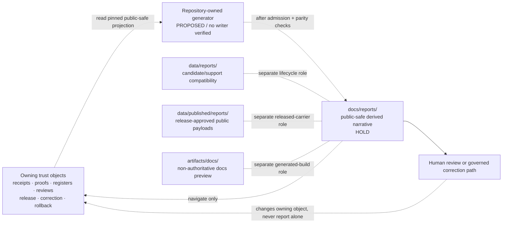

<!-- [KFM_META_BLOCK_V2]
doc_id: kfm://doc/docs-reports-readme
title: docs/reports/ — Steward-Facing Report Narratives
type: readme
subtype: documentation-lane-boundary
version: v1.0
prior_version: unversioned
status: tracked; documentation-only; generated-report lane proposed; admission and writers held
owner: "NEEDS VERIFICATION — the default CODEOWNERS route is @bartytime4life; no report-lane steward, generator owner, or independent reviewer assignment was verified"
created: 2026-05-08
updated: 2026-08-14
policy_label: repository-facing
current_path: docs/reports/README.md
owning_root: docs/
responsibility: >-
  Bound a possible steward-facing generated-report lane without taking over
  evidence, receipts, proofs, policy, release decisions, public report payloads,
  generated-site artifacts, or lifecycle data.
truth_posture: >-
  CONFIRMED current path, history, direct-child inventory, adjacent report lanes,
  and documentation QA workflows / PROPOSED future generated-report role /
  HOLD lane admission and writer activation / UNKNOWN generators, emitted
  reports, runtime consumers, retention, and public effects / NEEDS VERIFICATION
  owner, deterministic parity, sensitivity handling, correction propagation,
  withdrawal, and rollback.
truth_labels: [CONFIRMED, PROPOSED, UNKNOWN, NEEDS VERIFICATION, CONFLICTED, HOLD]
authority_class: tracked documentation lane; authority classification unresolved
authority_rank: subordinate to the docs root, adopted Directory Rules, accepted ADRs, and every owning trust object
canonical_relationship: same-path README update; no new lane, child folder, generator, mirror, public carrier, or machine authority created
evidence_snapshot:
  repository: bartytime4life/Kansas-Frontier-Matrix
  base_ref: main
  base_commit: 2b3f608b9d09cc0c317e7e64a6451da61efd27a1
  target_prior_blob: b5f8ea21d2cb92bbf4ba3f2cf8e5fb245e1cc814
  docs_root_readme_blob: 1f8bac189dac1d01c1185e8b4fb8e25efd11d09f
  directory_rules_blob: fd49a0b83e55cef52c1124281f093e263526898d
  adr_0029_blob: a4de0d7a96b78da59cfc499d1025e1508afd8dd9
  codeowners_blob: dd2a84aa514d8ecd9208bc347f90f9a2ed37dd61
  data_reports_readme_blob: 0d03ed098d7ea938b4be9e03a607d14ce90e90db
  published_reports_readme_blob: 838187dba1dbdb366f1539234e89ba6952b6cc60
  docs_meta_block_workflow_blob: c2054a053ba3050cf41b731d85a7a0996e9231f6
  docs_document_graph_workflow_blob: 636749f75621bf773ac558286789dadb41c47c35
  docs_stale_scan_workflow_blob: 4717668d30f98d9be2e6d2ebf57862e820cd41aa
  link_check_workflow_blob: 7b6c675d879a36d685b19b18fde401fca1bdd00e
  docs_build_workflow_blob: 7816e07d66774d2e2b3b80b66d5d3349a1393861
related:
  - docs/README.md
  - docs/doctrine/directory-rules.md
  - docs/adr/ADR-0029-adopt-directory-governance-standard-v2.md
  - docs/registers/DRIFT_REGISTER.md
  - docs/registers/VERIFICATION_BACKLOG.md
  - data/reports/README.md
  - data/published/reports/README.md
  - data/receipts/README.md
  - data/proofs/README.md
  - release/README.md
  - control_plane/README.md
  - artifacts/docs/README.md
  - tools/README.md
  - pipelines/README.md
notes:
  - "At the pinned snapshot, docs/reports/ contains only this authored README; no generated report or child directory is present."
  - "The adopted Directory Rules canonical docs/ map does not enumerate reports/, so this file does not carry forward the prior claim that the lane is canonical."
  - "A bounded repository search did not confirm a generator or workflow that writes report content here; writer activation therefore remains on HOLD."
  - "The report-family names and generation contract below are proposals for a future admitted lane, not current implementation facts."
[/KFM_META_BLOCK_V2] -->

<a id="top"></a>

# `docs/reports/` — Steward-Facing Report Narratives

> **One-line purpose.** Bound a possible repository-facing lane for deterministic, human-readable projections of governed evidence and release state—without letting a report become evidence, policy, review, release, publication, or root truth.

[](#status)
[](#authority-level)
[](#current-direct-child-map)
[](#writer-and-generation-contract)
[](#responsibility-boundary)

> [!IMPORTANT]
> **This README does not admit a new canonical documentation lane.** `docs/reports/` is present in the repository, but the adopted Directory Rules canonical `docs/` map does not enumerate it. Current presence is implementation evidence, not placement authority. Adding generated reports, child folders, or a writer remains on `HOLD` until the lane, owner, generator, validation, sensitivity, correction, and rollback contract are reviewed.

> [!WARNING]
> **Repository-facing is not confidential.** Content committed here must be treated as publicly readable. A “steward-facing” audience does not authorize secrets, private endpoints, restricted source material, protected locations, living-person or genomic data, precise archaeology or infrastructure details, or sensitive denial reasons.

<a id="table-of-contents"></a>

**Quick navigation:** [Purpose](#purpose) · [Authority](#authority-level) · [Status](#status) · [Belongs](#what-belongs-here) · [Exclusions](#what-does-not-belong-here) · [Inputs](#inputs) · [Outputs](#outputs) · [Validation](#validation) · [Review](#review-burden) · [Related](#related-folders) · [ADRs](#adrs) · [Last reviewed](#last-reviewed) · [Current tree](#current-direct-child-map) · [Boundary](#responsibility-boundary) · [Generation](#writer-and-generation-contract) · [Identity](#report-identity-and-minimum-shape) · [Exposure](#sensitivity-and-exposure) · [Correction](#correction-withdrawal-and-rollback) · [Reader workflow](#reader-workflow) · [Risks](#risks-and-anti-patterns) · [FAQ](#faq) · [Verification](#open-verification-register) · [No-loss](#no-loss-ledger)

---

<a id="1-scope"></a>

## Purpose

At `main@2b3f608b9d09cc0c317e7e64a6451da61efd27a1`, this directory is a tracked documentation boundary containing only this authored README. No generated report, child report family, admitted writer, generation manifest, or report-specific parity check was confirmed.

The **PROPOSED** future responsibility is narrow:

> A public-safe, steward-oriented Markdown projection may summarize already-governed receipts, proofs, registers, reviews, corrections, rollback records, or release decisions when a repository-owned deterministic generator and single-writer contract exist.

That projection remains subordinate to every source object it cites. It cannot:

- create or amend a claim;
- make evidence sufficient;
- decide rights, sensitivity, policy, or review;
- approve promotion or release;
- publish a payload;
- become the only surviving record of a decision;
- substitute for correction, withdrawal, or rollback state.

**Current operating outcome:** `HOLD`. This README may be maintained in place. New generated children and writer activation are not admitted by this change.

[Back to top](#top)

---

<a id="2-repo-fit"></a>

## Authority level

| Field | Current posture |
|---|---|
| **Responsibility root** | `docs/` — human-readable governance and explanation |
| **Current path fact** | `docs/reports/README.md` exists and has history beginning 2026-05-08 |
| **Adopted canonical `docs/` map** | Does not enumerate `reports/` |
| **This file** | Authored lane-boundary README; it may narrow behavior but cannot grant the lane more authority |
| **Future report** | Derivative narrative projection only |
| **Writer authority** | `UNKNOWN`; no generator or workflow was confirmed |
| **Machine authority** | None |
| **Evidence, proof, policy, or release authority** | None |
| **Public-payload authority** | None |
| **Placement outcome for new children** | `HOLD_PENDING_DECISION` |

The adopted Directory Rules establish `docs/` as the human-readable governance and explanation surface, require one authority owner, prohibit parallel authority, and state that a README cannot expand its parent root’s authority. They also warn that a README or placeholder alone does not establish implementation, maturity, or a durable reason to retain speculative scaffolding.

This same-path update preserves history and reduces overclaim. It does **not** decide whether admitting `docs/reports/` is a routine `docs/` root-owner refinement or an ADR-class documentation-lane decision. That classification remains open before implementation.

[Back to top](#top)

---

## Status

| Surface | CONFIRMED at the evidence snapshot | Safe conclusion |
|---|---|---|
| Directory contents | One direct child: `README.md` | No generated report corpus exists here |
| Prior README | Present as blob `b5f8ea21…` | Prior guidance is lineage, not current implementation proof |
| Canonical `docs/` map | Eleven admitted lanes; `reports/` omitted | Do not claim canonical lane status |
| CODEOWNERS | Default `*` route resolves to `@bartytime4life`; no path-specific `docs/reports/` entry | Review routing exists; stewardship and approval remain separate |
| `data/reports/` | Tracked compatibility/candidate lane with its own contract | Not interchangeable with this documentation path |
| `data/published/reports/` | Tracked PUBLISHED payload lane README | Public payload role remains outside `docs/` |
| `data/receipts/` and `data/proofs/` | Tracked accountability roots with many child lanes | Reports may cite them; they do not move here |
| `release/` | Tracked decision root with current naming drift and several child families | Link to the owning root; do not guess a single canonical subpath here |
| Documentation QA | Metadata, local-link, document-graph, and freshness workflows exist | Bounded QA only |
| Documentation build | Explicit generator and preview-publication hold | No rendered site or report publication is established |
| Report generator | Not confirmed by bounded path/code search | Writer activation remains `HOLD` |
| Report-specific parity/freshness enforcement | Not confirmed | Do not label reports immutable or current by automation |

**Overall posture:** tracked README; proposed generated-report responsibility; unresolved lane admission; no generated report implementation; no public or release effect.

### Truth-label split

| Label | Applies to |
|---|---|
| `CONFIRMED` | Path, prior blob, current direct-child inventory, adjacent lane READMEs, adopted Directory Rules, CODEOWNERS route, and documentation workflows |
| `PROPOSED` | Future report families, writer contract, metadata shape, and deterministic generation model |
| `HOLD` | New report children, subfolders, generation, navigation promotion, and writer activation |
| `UNKNOWN` | Active producers, consumers, retention, runtime indexing, external storage, and report correction behavior |
| `NEEDS VERIFICATION` | Lane admission class, owner, generator identity, parity check, public-safety review, report lifecycle, and rollback drill |

[Back to top](#top)

---

<a id="3-what-belongs-here"></a>

## What belongs here

**Currently admitted:** this boundary README and only the minimum control documentation required to explain a future admitted writer relationship.

A generated report may belong here later only when **all** of these conditions are satisfied:

1. **Lane admission is resolved.** The `docs/` owner and required governance reviewers approve the direct-child lane and update the appropriate human and machine navigation surfaces.
2. **One writer exists.** A reviewed repository-owned generator is the only writable source for that report family.
3. **The report is derived.** Every consequential statement resolves to a current, immutable or revision-pinned upstream object.
4. **Inputs retain authority.** Receipts, proofs, registers, policy decisions, reviews, releases, corrections, and rollback objects remain in their owning roots.
5. **The output is public-safe.** No secret, restricted payload, harmful precision, protected location, private person, genomic detail, or sensitive reason leaks into Git.
6. **Generation is deterministic enough to review.** Generator version, input identities and digests, output digest, and regeneration behavior are recorded.
7. **Freshness is explicit.** `as_of`, source revision, correction state, and supersession state are visible; generation time alone is not currentness.
8. **Correction is upstream-first.** A factual or governance correction begins in the owning object and then re-generates the narrative.
9. **No public-payload role exists.** Downloadable or release-bearing report payloads use the governed PUBLISHED report lane, not this path.
10. **Negative tests exist.** Manual edits, missing inputs, stale bindings, sensitive leakage, and authority collapse fail or hold.

### Candidate report families

The following families are **PROPOSED examples**, not current directories or implemented generators:

| Candidate family | Possible human purpose | Required owning inputs |
|---|---|---|
| Release explanation | Explain a release decision and its scope | Release decision, manifest, proof/receipt closure, correction and rollback references |
| Validation roll-up | Summarize bounded validator evidence | Validation receipts, exact revision, test profile, limitations |
| Correction or withdrawal digest | Explain a changed or withdrawn public state | Correction/withdrawal record, prior release, replacement or denial state |
| Rollback drill narrative | Explain a bounded rollback exercise | Rollback decision/card, drill receipt, target identity, post-drill result |
| Rights/redaction summary | Explain public-safe transforms without leaking protected detail | Policy decision, redaction/generalization receipts, review state |
| Governance health snapshot | Summarize registered drift and verification state | Pinned human and machine registers, current revision, known gaps |
| Governed-AI outcome summary | Aggregate finite outcomes and citation health | AI receipts, citation-validation evidence, policy-safe aggregation |
| Documentation QA summary | Explain metadata, link, graph, and staleness results | Exact workflow run or generated QA artifact; no release implication |

A report family is not admitted merely because it appears in this table.

[Back to top](#top)

---

<a id="4-what-does-not-belong-here"></a>

## What does NOT belong here

| Do not place or author here | Owning surface or action | Reason |
|---|---|---|
| Evidence, proofs, receipts, or provenance records | [`data/proofs/`](../../data/proofs/README.md), [`data/receipts/`](../../data/receipts/README.md), and their governed families | These are accountability objects, not narrative projections |
| Release, promotion, correction, withdrawal, or rollback decisions | [`release/`](../../release/README.md) | A report cannot approve or replace a decision |
| Public report payloads or downloadable released editions | [`data/published/reports/`](../../data/published/reports/README.md) | PUBLISHED carriers require release closure |
| Unreleased report candidates or compatibility support material | [`data/reports/`](../../data/reports/README.md), only within its current contract | Candidate lifecycle is not documentation authority |
| Generated documentation site or preview output | [`artifacts/docs/`](../../artifacts/docs/README.md) or external CI artifact | Preview/build output is not authored documentation or release proof |
| Raw lint, coverage, render, or test bundles | Appropriate CI artifact or `artifacts/qa/` boundary | Tool output is not a steward narrative by itself |
| Human-authored research, architecture, dossier, atlas, runbook, or decision text | The matching admitted `docs/` lane | Authored content and generated projections require different writers |
| Machine registers | [`control_plane/`](../../control_plane/README.md) | Reports may explain registered state, not host it |
| Contracts, schemas, or policy source | `contracts/`, `schemas/`, `policy/` | Meaning, shape, and admissibility remain separate authorities |
| Runtime code, generators, tests, or fixtures | `tools/`, `pipelines/`, `packages/`, `apps/`, `tests/`, `fixtures/` as selected by responsibility | A documentation path cannot own executable behavior |
| Secrets, credentials, private endpoints, raw prompts, private logs, or unsafe coordinates | Never ordinary repository documentation | Repository visibility is an exposure boundary |
| A manually written “generated” report | Fix or create the admitted generator first | Manual prose would create a second writer |
| Placeholder child folders or `.gitkeep` scaffolding | Keep the path absent until admitted implementation exists | A future taxonomy is not a reason to reserve directories |

[Back to top](#top)

---

<a id="7-inputs-and-outputs"></a>

## Inputs

### Inputs to this README

This boundary was reconciled from:

- the current `docs/reports/` direct-child inventory and Git history;
- the parent [`docs/` contract](../README.md);
- the exact Directory Rules bytes adopted by ADR-0029;
- the default CODEOWNERS route;
- the current `data/reports/`, `data/published/reports/`, `data/receipts/`, `data/proofs/`, `release/`, `control_plane/`, and `artifacts/docs/` boundary READMEs;
- repository-native documentation QA workflows.

### Inputs to a future report

A future generator may read only the minimum public-safe projection required for the report. Each input must be identified by stable object ID and immutable digest or revision—not merely a mutable path.

| Input class | Required disclosure in the report |
|---|---|
| Receipt or run record | Stable object/run ID, object family, content digest, producer/run identity, scope, limitations |
| Proof or EvidenceBundle | Bundle/proof ID, digest, evidence scope, unresolved gaps |
| Register snapshot | Register identity, commit/blob or version, `as_of`, known divergence |
| Review or policy decision | Decision ID, outcome, policy/rule version, obligations safe to disclose |
| Release/correction/rollback state | Stable decision ID, effective state, prior/replacement state, rollback or correction reference |
| Workflow or QA result | Exact commit/run identity, profile, bounded conclusion, non-effects |

A report generator must not read RAW, WORK, QUARANTINE, internal canonical stores, or sensitive source payloads merely because its output is “for stewards.” Any exceptional internal report needs a separate access-controlled carrier outside public repository documentation.

[Back to top](#top)

---

## Outputs

**Current output:** one authored boundary README.

**Possible future output after admission:** deterministic, public-safe Markdown projections with stable identity, explicit source bindings, correction state, and generated-file markers.

This lane does not emit:

- evidence or proof;
- policy, review, promotion, or release decisions;
- public payloads;
- runtime responses;
- machine registers;
- generated-site builds;
- source activation;
- lifecycle promotion.

A report link may help a reviewer navigate. It cannot become the only reference used by a governed client, release assembler, or public API.

[Back to top](#top)

---

<a id="10-validation"></a>

## Validation

### Current repository-native documentation QA

| Workflow | Confirmed responsibility | Boundary |
|---|---|---|
| `docs-meta-block` | Validate bounded metadata and emit a review-only registry delta | Does not mutate the registry or create authority |
| `link-check` | Check supported local targets in changed Markdown without network access | Does not validate external URLs or historical unchanged files |
| `docs-document-graph` | Build a bounded review projection of explicit document relationships | Does not decide canonicality or lane admission |
| `docs-stale-scan` | Produce advisory freshness and verification-debt findings | Does not correct, assign an owner, or approve content |
| `docs-build` | Assert an explicit hold while no accepted site generator or preview handoff exists | A green held run means no docs site was built or published |

These checks apply to this README as documentation. They do **not** prove any report generator, generated output, parity contract, report freshness, release state, or public safety.

### Required future report-specific controls

Before the first generated child is admitted, establish:

1. lane admission and single-writer validation;
2. generated-file marker and edit-policy validation;
3. generator/input/output digest parity;
4. stable input-ID resolution;
5. type separation so trust objects cannot be copied into the report lane;
6. public-safety and secret scanning appropriate to report content;
7. correction, withdrawal, and supersession propagation tests;
8. stale and missing-input behavior with finite `HOLD` or `ERROR` results;
9. no-network fixture coverage for the generator;
10. authoring/generation receipt integrity where the repository requires it.

### Negative checks

A future control should reject or hold:

- a non-README file without a registered generator and source binding;
- a hand edit to a generated report;
- a report whose cited object no longer resolves or whose digest changed;
- copied receipt, proof, manifest, register, or decision payloads;
- a “current” badge derived only from `generated_at`;
- an output containing secrets, unsafe precision, restricted content, or sensitive denial details;
- a report that declares approval, release, publication, or proof closure on its own;
- a generator that writes both a trust object and its approving narrative without independent review;
- a placeholder directory created only to reserve a future taxonomy.

**Current result:** report-specific enforcement is `UNKNOWN`; writer activation remains `HOLD`.

[Back to top](#top)

---

<a id="11-review-burden"></a>

## Review burden

| Change | Minimum review posture |
|---|---|
| This README only | Documentation-root and directory-governance review |
| Lane admission or canonical-map update | `docs/` owner, directory governance, architecture, and affected report consumers; determine whether an ADR is required |
| New generator or report family | Documentation reviewer, generator/tool owner, and each owning object-family reviewer |
| Release or correction report | Release/correction reviewer in addition to docs and tooling |
| Rights, sensitivity, archaeology, living-person, genomic, rare-species, land/title, or infrastructure summary | Applicable qualified policy/sensitivity reviewer and independent review |
| Generated output drift | Fix upstream inputs or generator; do not approve a manual report edit |
| Public report payload | Separate governed release review under `data/published/reports/` and `release/` |

`.github/CODEOWNERS` currently routes unmatched paths to `@bartytime4life`. That route is not a StewardshipAssignment, ReviewRecord, separation-of-duties control, policy decision, release approval, or proof that review occurred.

No report-lane steward, generator owner, independent reviewer, retention owner, or incident/correction responder was verified.

[Back to top](#top)

---

<a id="15-related-folders-and-docs"></a>

## Related folders

| Surface | Relationship to this path |
|---|---|
| [`../README.md`](../README.md) | Parent `docs/` authority and exposure contract |
| [`../doctrine/directory-rules.md`](../doctrine/directory-rules.md) | Adopted placement, README, generated-output, migration, and review-trigger rules |
| [`../registers/DRIFT_REGISTER.md`](../registers/DRIFT_REGISTER.md) | Human drift register; presence now confirmed |
| [`../registers/VERIFICATION_BACKLOG.md`](../registers/VERIFICATION_BACKLOG.md) | Human verification backlog; presence now confirmed |
| [`../../data/reports/README.md`](../../data/reports/README.md) | Transitional candidate/support lane; not a generated-doc or public-payload lane |
| [`../../data/published/reports/README.md`](../../data/published/reports/README.md) | Release-approved public report payload lane |
| [`../../data/receipts/README.md`](../../data/receipts/README.md) | Accountability receipts; possible future report inputs |
| [`../../data/proofs/README.md`](../../data/proofs/README.md) | Proof and EvidenceBundle families; possible future report inputs |
| [`../../release/README.md`](../../release/README.md) | Release, correction, withdrawal, and rollback decision authority |
| [`../../control_plane/README.md`](../../control_plane/README.md) | Machine governance projections and indexes |
| [`../../artifacts/docs/README.md`](../../artifacts/docs/README.md) | Non-authoritative generated documentation preview boundary |
| [`../../tools/README.md`](../../tools/README.md) | Possible home for a repository-wide report generator after placement review |
| [`../../pipelines/README.md`](../../pipelines/README.md) | Possible home when report generation is part of lifecycle transformation |
| [ADR-0029](../adr/ADR-0029-adopt-directory-governance-standard-v2.md) | Accepted adoption boundary for Directory Rules v2 |

Do not select a generator path from this table by convenience. Classify the executable by responsibility before implementation.

[Back to top](#top)

---

## ADRs

| Decision | Status | Effect on `docs/reports/` |
|---|---|---|
| [ADR-0029](../adr/ADR-0029-adopt-directory-governance-standard-v2.md) | `accepted` | Adopts the Directory Rules bytes and their canonical `docs/` map; does not separately admit this lane |
| [ADR-0011](../adr/ADR-0011-receipts-vs-proofs-vs-manifests-vs-catalog-separation.md) | `proposed` | Supports object-family separation but cannot authorize placement or implementation |
| [ADR-0024](../adr/ADR-0024-steward-separation-of-duties-for-release.md) | `proposed` | Informs future review posture; creates no current control |
| [ADR-0025](../adr/ADR-0025-public-client-never-reads-canonical-internal-stores.md) | `proposed` | Reinforces the public-boundary design; creates no current route or report consumer |

**No accepted ADR or verified `docs/` root-owner decision was found that specifically admits `docs/reports/`, chooses its writer, or defines its generated-output lifecycle.**

Before adding children, decide and record:

1. whether this is an admitted `docs/` lane or a path to retire/migrate;
2. whether that decision is routine root-owner refinement or ADR-class;
3. the single writer and generator home;
4. the relationship to `data/reports/`, `data/published/reports/`, `artifacts/docs/`, and any report consumers;
5. the report identity, retention, sensitivity, correction, and rollback contract.

[Back to top](#top)

---

## Last reviewed

- **Date:** 2026-08-14
- **Base:** `main@2b3f608b9d09cc0c317e7e64a6451da61efd27a1`
- **Prior target blob:** `b5f8ea21d2cb92bbf4ba3f2cf8e5fb245e1cc814`
- **Review type:** same-path documentation modernization and current-repository reconciliation
- **Direct-child inspection:** complete for `docs/reports/` at the pinned snapshot
- **Bounded writer search:** no report generator confirmed
- **Runtime, deployment, external storage, and report consumer inspection:** not performed
- **Release or public state changed:** none

Re-review when:

- the lane is admitted, rejected, migrated, deprecated, or retired;
- a child path, generator, report family, writer, consumer, or navigation entry is proposed;
- a governing ADR or the adopted Directory Rules changes;
- a report-specific validator or workflow is added;
- sensitivity, exposure, retention, generation, or storage posture changes;
- correction, withdrawal, security incident, or rollback affects a report;
- `data/reports/`, `data/published/reports/`, `artifacts/docs/`, or release/report relationships change materially.

Review is event- and risk-based; this file does not carry forward the prior blanket six-month timer.

[Back to top](#top)

---

<a id="5-directory-layout-proposed"></a>

## Current direct-child map

The current map is intentionally small and records only verified direct children:

```text
docs/reports/
└── README.md              # authored boundary; not a generated report
```

There are no verified `release/`, `rollback/`, `correction/`, `review/`, `governance/`, `ai/`, `drift/`, or `verification/` child directories here at the pinned snapshot.

This README does not reserve those names. Create a child only when an admitted report family and its writer require it. A proposed future tree belongs in the decision or implementation PR that supplies the generator, tests, and rollback—not in the repository as empty scaffolding.

[Back to top](#top)

---

<a id="6-how-a-report-gets-here--flow"></a>

## Responsibility boundary


```mermaid
flowchart LR
    TRUST["Owning trust objects<br/>receipts · proofs · registers · reviews<br/>release · correction · rollback"]
    GEN["Repository-owned generator<br/>PROPOSED / no writer verified"]
    DOCREP["docs/reports/<br/>public-safe derived narrative<br/>HOLD"]
    CAND["data/reports/<br/>candidate/support compatibility"]
    PUB["data/published/reports/<br/>release-approved public payloads"]
    PREVIEW["artifacts/docs/<br/>non-authoritative docs preview"]
    REVIEW["Human review or governed correction path"]

    TRUST -. "read pinned public-safe projection" .-> GEN
    GEN -. "after admission + parity checks" .-> DOCREP
    DOCREP -. "navigate only" .-> TRUST
    DOCREP --> REVIEW
    REVIEW -. "changes owning object, never report alone" .-> TRUST

    CAND -. "separate lifecycle role" .- DOCREP
    PUB -. "separate released-carrier role" .- DOCREP
    PREVIEW -. "separate generated-build role" .- DOCREP
```

The dashed generator path is **PROPOSED**. The current repository snapshot does not establish it.

### Boundary rules

- A report may **project** an owning object; it cannot become that object.
- A report may **link** to a release; it cannot release itself.
- A report may **surface** a discrepancy; the correction occurs through the owning register, decision, evidence, or release object.
- A report may be read by people; normal public clients must not depend on it as canonical state.
- A report must not feed generated prose back into evidence or policy without a separate governed intake and review transition.
- The same process must not generate the evidence, decide its admissibility, approve release, and publish the narrative without separated controls appropriate to consequence.

[Back to top](#top)

---

<a id="8-authoring-vs-generation"></a>

## Writer and generation contract

**Current writer state:** no generator or report-family writer is admitted.

A future implementation must establish a single writer for each report family and make manual edits detectable.

| Requirement | Minimum future behavior |
|---|---|
| **Writer identity** | One reviewed generator path and owner per family |
| **Generator version** | Immutable commit, package version, or content digest |
| **Input freeze** | Stable IDs plus content digests or immutable revisions |
| **Network posture** | Fixture/no-network generation by default; any retrieved input is frozen before report generation |
| **Determinism** | Identical admitted inputs and generator version produce review-equivalent bytes or a documented bounded variance |
| **Generated marker** | Visible “do not hand-edit” notice and source/generator references |
| **Output digest** | Digest recorded outside the report as an accountability object where required |
| **Parity check** | CI re-generation or source/output manifest comparison |
| **Failure behavior** | Missing, changed, denied, or stale input returns `HOLD` or `ERROR`; never a plausible narrative |
| **Change path** | Edit owning input or generator, regenerate, review |
| **Receipt** | Authoring/generation receipt in its governed accountability lane when required |
| **Review separation** | Generator execution is not approval of its inputs, conclusions, or release state |

### Authored exceptions

Only lane-control documents admitted by the `docs/` owner may be authored here, such as this README or a future child-boundary README. Such documents must be clearly distinguishable from generated reports.

A generated report should never be “fixed” by editing its Markdown. Correct the owning object or generator and re-emit it.

[Back to top](#top)

---

<a id="9-naming-and-report-shape"></a>

## Report identity and minimum shape

The following shape is **PROPOSED** for a future generated Markdown report. It is not a current schema and does not reserve a file name.

```yaml
report:
  report_id: "<deterministic family + scope + input-set identity>"
  report_family: "<admitted family id>"
  status: "GENERATED_PROJECTION"
  authority_effect: "NONE"
  generator:
    path: "<verified repository path>"
    version: "<commit, version, or digest>"
  inputs:
    - object_id: "<stable owning-object id>"
      object_type: "<receipt|proof|register|review|release|correction|rollback>"
      content_digest: "sha256:<digest>"
      revision: "<immutable revision when applicable>"
  scope:
    as_of: "<ISO-8601 time or bounded interval>"
    geography: "<public-safe scope or null>"
    release_ref: "<stable release id or null>"
  correction_state:
    status: "<CURRENT|SUPERSEDED|WITHDRAWN|NEEDS_VERIFICATION>"
    supersedes: []
    superseded_by: null
  exposure:
    policy_label: "repository-facing"
    sensitivity_result: "<public-safe decision ref>"
  generated_at: "<ISO-8601 timestamp>"
  output_digest: "sha256:<digest>"
  generation_receipt_ref: "<governed receipt id>"
  edit_policy: "DO_NOT_HAND_EDIT"
```

### Identity rules

- The path is not the report identity.
- A rolling “latest” view must resolve from governed state and may not erase edition identity.
- `generated_at` states when bytes were built; `as_of` states what period or revision they describe.
- A report must cite object IDs and digests, not only filenames.
- If inputs change, either regenerate the same edition under an explicit correction rule or emit a superseding report identity.
- A report cannot assign itself `CONFIRMED`; confidence and result language must reflect the cited owning objects and unresolved gaps.
- A report that cannot resolve an input must abstain from the affected conclusion and record the gap.

[Back to top](#top)

---

## Sensitivity and exposure

`docs/reports/` is tracked repository documentation. Treat every byte as potentially public and permanently recoverable through Git history.

### Required posture

- Redact or generalize before generation; do not rely on CSS, map style, collapsed details, client filtering, or a later scrub.
- Do not include exact sensitive coordinates, precise infrastructure topology, rare-species occurrences, archaeology provenience, living-person records, genomic/DNA data, private land/title detail, credentials, signed URLs, or private endpoint names.
- Do not expose a denial reason when the reason itself reveals protected content.
- Aggregate summaries require review when small groups, narrow geographies, time precision, or cross-report joins could re-identify protected facts.
- Source terms and attribution obligations survive into the report.
- AI-generated wording must be checked against the same evidence and exposure rules; model fluency is not a transform receipt.
- A restricted operational report requires an access-controlled system outside ordinary public repository documentation.

A safe summary may state that content was denied, generalized, or withheld without reproducing the protected payload.

[Back to top](#top)

---

## Correction, withdrawal, and rollback

A report is derived. Therefore the correction sequence begins upstream:

```text
owning object corrected / superseded / withdrawn
    -> affected report inputs invalidated
    -> report regeneration or withdrawal decision
    -> navigation, index, cache, search, and AI consumer update
    -> preserved lineage and rollback target
```

### Rules

1. Never silently edit a release-bound report to hide a prior conclusion.
2. Preserve the prior report identity and its correction/supersession relationship when safe and required.
3. Withdraw a report when its owning evidence, policy, review, or release state is withdrawn and no corrected public-safe projection exists.
4. A report rollback restores a prior derived projection only when its owning objects remain valid; it cannot resurrect superseded truth.
5. Public report payload correction occurs through `release/` and `data/published/reports/`, not by changing this lane alone.
6. Any index, documentation graph, search view, cache, review console, or governed-AI consumer that uses a report must honor correction and withdrawal state.
7. When a sensitive leak occurs, containment and history-remediation decisions require security and repository governance review; a normal revert may be insufficient.

No generated report currently exists in this lane, so operational correction and rollback behavior remain `UNKNOWN`.

[Back to top](#top)

---

<a id="13-quickstart-reader"></a>

## Reader workflow

When reading a future generated report:

1. Check that the file declares a generator and `DO_NOT_HAND_EDIT`.
2. Read `as_of`, scope, release reference, and correction state.
3. Resolve every load-bearing input ID and digest.
4. Inspect the owning evidence, receipt, proof, register, review, or release object.
5. Confirm policy and sensitivity posture at the report’s revision.
6. Treat missing, mutable, path-only, or mismatched references as `NEEDS VERIFICATION`.
7. Check for a superseding, withdrawn, or corrected report.
8. Do not cite the report as the decision when an owning object exists.
9. Open a governed correction or drift record rather than editing generated prose.

At the current snapshot there is no generated report to follow this workflow against.

[Back to top](#top)

---

<a id="12-anti-patterns-and-drift"></a>

## Risks and anti-patterns

| Anti-pattern | Failure | Required response |
|---|---|---|
| **Canonicality by presence** | Calling the lane canonical because the directory exists | Keep authority unresolved until admitted |
| **Scaffold reservation** | Creating empty report-family directories | Remove or hold until an implementation requires them |
| **Parallel report planes** | Treating `docs/reports/`, `data/reports/`, and `data/published/reports/` as interchangeable | Preserve candidate, narrative, and PUBLISHED roles |
| **Hand-authored generated report** | A person writes or patches a report directly | Fix the generator/input; regenerate |
| **Report as evidence** | A downstream claim cites only report prose | Resolve the owning EvidenceBundle/proof/receipt |
| **Report as approval** | A green summary is treated as release or policy approval | Read the actual decision object |
| **Currentness by timestamp** | `generated_at` is treated as source freshness | Require `as_of`, input revisions, and correction state |
| **Path-only citation** | Report links to a mutable file without ID/digest | Bind stable identity and immutable revision |
| **Sensitive summary leakage** | Narrative reveals protected payload or denial reason | Contain, review, redact/generalize, regenerate |
| **Correction drift** | Owning object changes but report remains “current” | Invalidate and regenerate or withdraw |
| **Generator self-approval** | One process produces inputs, policy outcome, release, and report | Separate duties appropriate to consequence |
| **Public-client dependency** | API/UI reads report Markdown as canonical state | Use governed interfaces and owning released objects |
| **Report recursion** | A report cites another report as its sole support | Resolve to the original owning objects |
| **Docs-build confusion** | Rendered documentation preview is called a report release | Keep `artifacts/docs/` and report publication separate |

[Back to top](#top)

---

<a id="14-faq"></a>

## FAQ

### Can I add a report file here now?

Not under the current evidence. Lane admission, a single writer, generator binding, tests, sensitivity review, and correction/rollback behavior remain unresolved. The finite outcome is `HOLD`.

### Can I write a one-off stakeholder report by hand?

Not as a generated report here. Use the admitted authored documentation or work-product lane selected by its responsibility and lifecycle. A public deliverable requires the governed PUBLISHED report path and release decision.

### Is `docs/reports/` private because it is “steward-facing”?

No. It is repository-facing documentation and must be treated as publicly readable.

### Where does an unreleased report candidate belong?

`data/reports/` currently declares a transitional candidate/support role. Use it only within that boundary and after checking the actual object, rights, sensitivity, writer, and lifecycle. This README does not promote that compatibility lane.

### Where does a released PDF or Markdown report belong?

Under the governed `data/published/reports/` carrier lane after evidence, policy, review, release, correction, and rollback closure. The release decision remains under `release/`.

### Can a report approve a release or prove a validator passed?

No. It may summarize a release decision or exact validator evidence, but the owning decision and receipt remain authoritative.

### Can CI coverage or lint HTML go here?

Raw QA/build outputs belong in the relevant CI artifact or generated QA boundary. A later admitted public-safe narrative could summarize them, but no such generator is verified now.

### May AI generate report prose?

Only as subordinate generation over pinned governed inputs, with citation, policy, sensitivity, finite-failure, receipt, and review controls. Raw model output is not evidence and cannot approve its own report.

### What does a green documentation workflow prove?

Only the bounded QA declared by that workflow. It does not prove report correctness, freshness, release, publication, sensitivity safety, or lane admission.

### Could this lane be retired instead of admitted?

Yes. Retirement is a governance decision requiring inbound-reference and consumer inspection, migration or tombstone handling where needed, and rollback. This README does not choose admission or retirement.

[Back to top](#top)

---

<a id="16-open-questions--verification-backlog"></a>

## Open verification register

| ID | Question | Status | Evidence needed |
|---|---|---:|---|
| `RPT-001` | Is `docs/reports/` an admitted documentation lane, a compatibility path, or a retirement candidate? | `HOLD` | `docs/` owner decision, Directory Rules classification, applicable ADR analysis |
| `RPT-002` | Does any current code or workflow write report content here? | `NEEDS VERIFICATION` | Recursive writer search, workflow inspection, runtime or generated artifact |
| `RPT-003` | Which concrete report family provides enough value to justify the lane? | `UNKNOWN` | Consumer need, owning inputs, acceptance criteria, correction path |
| `RPT-004` | Who owns the lane and each future generator? | `NEEDS VERIFICATION` | Stewardship assignment and executable CODEOWNERS identity |
| `RPT-005` | What stable identity and versioning contract governs reports? | `PROPOSED` | Contract decision, fixtures, validator, compatibility tests |
| `RPT-006` | How are input digests, output digests, generation receipts, and parity checked? | `UNKNOWN` | Generator implementation and no-network test evidence |
| `RPT-007` | What public-safety, rights, and sensitivity profile applies? | `NEEDS VERIFICATION` | Policy decision, negative fixtures, specialist review |
| `RPT-008` | How are freshness, supersession, correction, withdrawal, and rollback propagated? | `UNKNOWN` | State model, consumers, tests, drill evidence |
| `RPT-009` | Which navigation, documentation graph, search, UI, or AI consumers use this path? | `NEEDS VERIFICATION` | Inbound-link and runtime-consumer inventory |
| `RPT-010` | How should this lane relate to `data/reports/`, `data/published/reports/`, and `artifacts/docs/` over time? | `HOLD` | Object-family inventory, writers/consumers, migration and rollback plan |
| `RPT-011` | Should the human and machine document registries index this boundary? | `NEEDS VERIFICATION` | Registry authority review and emitted review-only delta |
| `RPT-012` | What retention and external-storage policy applies to generated report editions? | `UNKNOWN` | Retention owner, storage model, correction and legal requirements |

Unknowns narrow the claim and block higher-risk transitions. They do not authorize plausible defaults.

[Back to top](#top)

---

<a id="17-appendix"></a>

## No-loss ledger

| Prior material | v1.0 disposition |
|---|---|
| “Narrative window, never source of truth” principle | Preserved and strengthened |
| Distinction from receipts, proofs, manifests, policy, and registers | Preserved |
| Distinction from public report payloads | Preserved and reconciled with current `data/published/reports/` README |
| Generated/read-only intent | Preserved as a future contract; no longer stated as implemented fact |
| Proposed report-family catalog | Preserved as non-admitted candidate families |
| Large proposed child tree | Replaced by the verified one-file current tree; no speculative directories reserved |
| Upstream/downstream flow | Preserved with current `HOLD` and adjacent-lane separation |
| Authoring-versus-generation rule | Preserved; single-writer and parity requirements expanded |
| Naming/header guidance | Replaced by a stable identity and minimum-shape proposal |
| Validation and freshness expectations | Preserved and separated into current docs QA versus future report-specific controls |
| Review and CODEOWNERS notes | Corrected to the current default route and non-approval boundary |
| Anti-patterns, reader workflow, FAQ, glossary concepts | Preserved and consolidated |
| Register presence TODOs | Corrected; DRIFT and VERIFICATION_BACKLOG paths are present |
| “Repo presence unverified” claim | Corrected; path and direct children are confirmed |
| Prior canonical-lane claim | Not carried forward because the adopted `docs/` map omits `reports/` |
| Blanket six-month review timer | Replaced with adopted event- and risk-based triggers |
| Release subpath examples | Narrowed to the owning `release/` root because current naming drift remains unresolved |
| Public/release/deployment effect | None |

### Rollback

Revert the commit that introduced v1.0. The path and every adjacent authority root remain unchanged, and no generated child, generator, lifecycle object, report payload, release, or public state is created by this documentation update.

### Change history

#### v1.0 — 2026-08-14

- added a complete metadata block and pinned evidence snapshot;
- reconciled the lane against adopted Directory Rules and the current `docs/` root map;
- confirmed that the directory contains only this README;
- removed unsupported canonicality, generator, and enforcement claims;
- separated current repository facts from a future generated-report contract;
- reconciled `docs/reports/`, `data/reports/`, `data/published/reports/`, and `artifacts/docs/`;
- added single-writer, identity, sensitivity, correction, withdrawal, rollback, negative-test, and open-verification controls;
- preserved stable path and legacy anchors;
- changed documentation only.

#### Unversioned editions — 2026-05-08 through 2026-05-12

Initial path creation and comprehensive generated-report guidance. Retained as Git history and reconciled through the no-loss ledger above.

[Back to top](#top)

---

<sub>This file is an authored boundary document. It does not admit generated report content, create a writer, approve a report family, or authorize release or publication.</sub>
