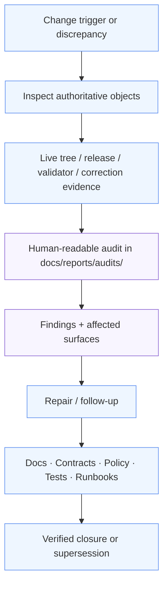

<!-- [KFM_META_BLOCK_V2]
doc_id: kfm://doc/NEEDS_VERIFICATION
title: audits
type: standard
version: v1
status: draft
owners: @bartytime4life
created: NEEDS_VERIFICATION
updated: 2026-03-25
policy_label: NEEDS_VERIFICATION
related: [../README.md, ../readme-structure-reconciliation.md, ../../governance/README.md, ../../runbooks/README.md, ../../../.github/CODEOWNERS]
tags: [kfm, docs, reports, audits]
notes: [broad /docs/ ownership is confirmed in CODEOWNERS; audit-specific owner split still needs verification, doc_id and created date are placeholders pending repo verification]
[/KFM_META_BLOCK_V2] -->

# audits

Governed landing page for audit-shaped report summaries in Kansas Frontier Matrix (KFM): human-readable findings, follow-up, correction, and trust-surface review notes that stay downstream of evidence, policy, and release state.

> Status: experimental directory · draft README revision  
> Owners: `@bartytime4life` for broad `/docs/` coverage · narrower audit-specific split: `NEEDS VERIFICATION`  
> [](./README.md)
> [](./README.md)
> [](../README.md)
> [](./README.md)
> [](../../../.github/CODEOWNERS)
> Quick jumps: [Scope](#scope) · [Repo fit](#repo-fit) · [Inputs](#inputs) · [Exclusions](#exclusions) · [Current verified snapshot](#current-verified-snapshot) · [Directory tree](#directory-tree) · [Quickstart](#quickstart) · [Usage](#usage) · [Diagram](#diagram) · [Tables](#tables) · [Definition of done](#definition-of-done) · [FAQ](#faq) · [Appendix](#appendix)

> [!IMPORTANT]
> `docs/reports/audits/` is a documentation surface for human-readable audit summaries. It does not replace `data/`, `contracts/`, `schemas/`, `policy/`, `tests/`, release manifests, correction notices, or any other authoritative proof object.

Status markers used in this README: **CONFIRMED · INFERRED · PROPOSED · UNKNOWN · NEEDS VERIFICATION**

## Scope

`docs/reports/audits/` is the report-facing home for audit-shaped materials that people need to read, review, compare, and act on.

In KFM terms, this directory is for audit summaries that explain where a governed surface, report family, release flow, documentation claim, correction path, or trust-visible experience does or does not line up with evidence, policy, release state, or verified inventory.

Good audit material here should make gaps visible without pretending the audit itself is the thing that governs behavior.

Typical content includes:

- repo-structure or documentation audits
- release-evidence or correction-propagation summaries
- trust-surface audits for reader-facing behavior
- validation-coverage summaries written for docs readers
- review-facing summaries that name findings, affected surfaces, and follow-up
- compact public-safe tables or figures that clarify an audit result

## Repo fit

| Item | Value |
|---|---|
| Path | `docs/reports/audits/README.md` |
| Local role | Directory contract and navigation index for audit-shaped reports under `docs/reports/` |
| Upstream links | [reports index](../README.md) · [docs index](../../README.md) · [governance](../../governance/) · [runbooks](../../runbooks/) |
| Adjacent governed boundaries | [data](../../../data/) · [contracts](../../../contracts/) · [schemas](../../../schemas/) · [policy](../../../policy/) · [tests](../../../tests/) |
| Related report families | [releases](../releases/) · [validation](../validation/) · [self-validation](../self-validation/) · [telemetry](../telemetry/) · [story nodes](../story_nodes/) |
| Owner source | [`.github/CODEOWNERS`](../../../.github/CODEOWNERS) |
| Current live contents | `README.md` only |
| Core rule | Audits document findings, limits, repair direction, and correction posture; they do not become a second truth path |

## Inputs

| Input type | Belongs here? | Notes |
|---|---|---|
| Human-readable audit indexes and landing pages | Yes | Best fit for directory contracts and reader-facing navigation |
| Repo-structure or documentation drift audits | Yes | Keep findings linked to concrete paths, current inventory, and recommended repair |
| Release-evidence or correction-propagation summaries | Yes | Must point back to release, proof-pack, rollback, correction, or supersession context |
| Trust-surface or review-facing audits | Yes | Keep affected surfaces, caveat state, and follow-up visible |
| Validation-coverage summaries written for docs readers | Yes | Link to validator, fixtures, run receipt, or other authoritative source |
| Small derivative tables or figures used only to explain findings | Sometimes | Allowed only when clearly non-authoritative and public-safe |

## Exclusions

| Does not belong here | Put it here instead | Why |
|---|---|---|
| Canonical raw / work / processed / catalog data | [../../../data/](../../../data/) | Audits are documentation surfaces, not truth-path storage |
| Schemas, contract definitions, DTOs, API envelopes | [../../../schemas/](../../../schemas/) · [../../../contracts/](../../../contracts/) | Machine-checked interfaces belong in contract-bearing homes |
| Policy bundles, reason registries, enforcement rules | [../../../policy/](../../../policy/) | Policy must remain executable outside report prose |
| Tests, fixtures, validators, workflow logic | [../../../tests/](../../../tests/) and execution surfaces | Audits may summarize tests; they do not replace them |
| Secrets, tokens, signed URLs, internal-only endpoints | Never in docs | These are not acceptable audit payloads |
| Precise restricted coordinates or sensitive locational detail | Governed redaction / generalization path | Audits must preserve policy-safe visibility |
| Free-form AI narrative without evidence linkage | Not here | Audit prose must stay evidence-linked and bounded |

## Current verified snapshot

| Path / signal | Status | Notes |
|---|---|---|
| `docs/reports/audits/` exists in the live public repo tree | CONFIRMED | Current directory listing shows the folder |
| `docs/reports/audits/README.md` exists | CONFIRMED | The current file is scaffold-only and needs a real directory contract |
| Additional files under `docs/reports/audits/` | CONFIRMED none visible | No child files were visible beyond `README.md` in the current listing |
| Parent `docs/reports/README.md` report contract | CONFIRMED | It frames reports as downstream documentation surfaces and identifies `audits/` as the home for review, correction, or supersession summaries |
| `docs/reports/readme-structure-reconciliation.md` | CONFIRMED | Useful as a diagnostic artifact, but it can outrun live repo reality if left unverified |
| Audit-specific automation / CI | UNKNOWN / NEEDS VERIFICATION | No audit-specific workflow wiring is asserted here |

> [!WARNING]
> The live repo tree wins over older reconciliation prose. If `../readme-structure-reconciliation.md` and the current directory listing disagree, update the historical note or mark it historical; do not let audit prose imply files, automation, or coverage that are not actually present.

## Directory tree

### Current live view

```text
docs/reports/audits/
└── README.md   # current directory contract; previously scaffold-only
```

### Stable footprint this README supports

```text
docs/reports/audits/
├── README.md
└── YYYY-MM-DD-<audit-scope>.md   # PROPOSED / one consequential audit per file
```

Guidance:

- Keep this directory small, legible, and easy to scan.
- Prefer one audit file per consequential review event over nested subtrees.
- Split further only when repeated reader need and repeated file volume make it necessary.
- If a future audit family becomes large enough to deserve its own subtree, update both this README and `../README.md` in the same change.

## Quickstart

```bash
# inspect the audit directory contract
sed -n '1,260p' docs/reports/audits/README.md

# list what currently exists in the audit surface
find docs/reports/audits -maxdepth 2 -type f | sort

# inspect the parent report contract
sed -n '1,260p' docs/reports/README.md

# inspect the reconciliation note before trusting its inventory claims
sed -n '1,260p' docs/reports/readme-structure-reconciliation.md

# trace audit-linked trust objects and report surfaces
rg -n "audit_ref|CorrectionNotice|ReleaseManifest|ValidationReport|DecisionEnvelope|RuntimeResponseEnvelope|docs/reports/audits" docs contracts schemas policy tests
```

## Usage

### Start here when…

- a README, runbook, or report claims a structure or behavior that needs a human-readable verification pass
- a release, correction, rollback, or supersession needs a narrative audit summary
- a trust-visible surface needs a reader-facing explanation of what failed, drifted, or was repaired
- an earlier report or reconciliation note needs to be checked against the live tree
- maintainers need a compact, citable summary of findings before updating docs, contracts, policy, tests, or runbooks

### Write an audit without inventing a new truth path

1. Start from a governed object or verified inventory, not from memory.
2. Name the scope clearly: repo structure, release evidence, correction propagation, trust-surface behavior, validation coverage, or another explicit audit class.
3. Keep **CONFIRMED**, **INFERRED**, **PROPOSED**, **UNKNOWN**, and **NEEDS VERIFICATION** visibly separated.
4. Link back to the authoritative objects the audit is discussing.
5. Name affected surfaces, paths, or report families directly.
6. End with a repair path, follow-up path, or closure condition.
7. Update this README if the audit introduces a stable new pattern for files in this directory.

### Recommended minimum trust block inside any consequential audit

> **Audit class:** repo / release / correction / trust-surface / validation / other  
> **Time basis:** audit date plus any release or correction date that matters  
> **Evidence basis:** live repo tree, release object, validator output, correction object, or other inspectable source  
> **Affected surfaces:** paths, docs surfaces, runtime surfaces, or report families  
> **Release / correction basis:** release ID, `ReleaseManifest`, proof-pack, rollback note, `CorrectionNotice`, or `NEEDS VERIFICATION`  
> **Sensitivity posture:** public-safe / generalized / restricted / withheld  
> **Follow-up state:** open / mitigated / closed / superseded

That block is not a substitute for real contracts or proof objects. It is a reader-facing reminder that audits remain downstream of governed evidence and release state.

## Diagram



## Tables

### Audit classes at a glance

| Audit class | Primary use | Minimum linkage | Must not do |
|---|---|---|---|
| Repo structure / inventory audit | Check claimed paths or scaffolds against the live tree | path listing, affected files, follow-up repair | Pretend scaffolded or implied files are active just because prose mentions them |
| Release evidence audit | Summarize whether release-facing docs align with release objects | release ID, manifest, proof-pack, docs gate context | Replace the actual release object |
| Correction / supersession audit | Explain how a known issue propagates through docs or report surfaces | correction notice, affected surfaces, replacement path | Quietly hide or absorb the correction |
| Trust-surface audit | Review reader-facing behavior such as caveat visibility, state cues, or drill-through | runtime or docs evidence, affected surfaces, visible state | Turn UX commentary into source-of-truth claims |
| Validation coverage audit | Explain what was checked and where coverage is still missing | validator, fixtures, run receipt, or linked summary | Stand in for the validator itself |

### Minimum outward cues for any consequential audit

| Cue | Why it matters | Example |
|---|---|---|
| Time basis | Prevents hidden temporal collapse | `Audit run: 2026-03-25` |
| Evidence basis | Preserves inspectability | live repo tree, validator output, correction object |
| Affected surface list | Makes blast radius visible | `docs/reports/README.md`, `Map`, `Focus`, `Export` |
| Release / correction basis | Keeps audit downstream of governed state | release ID, proof-pack, rollback note, correction reference |
| State label | Keeps uncertainty readable | `CONFIRMED`, `UNKNOWN`, `NEEDS VERIFICATION` |
| Follow-up state | Prevents audits from becoming dead prose | `open`, `mitigated`, `closed`, `superseded` |

### Audit trigger matrix

| Trigger | Start here | Check next | Typical outputs |
|---|---|---|---|
| README or tree drift | [reports index](../README.md) | live repo listing, related docs | updated README, retired stale claim, follow-up audit |
| Release-summary mismatch | [releases](../releases/) | runbooks, release objects, correction context | release evidence audit, repair list, correction note |
| Correction visibility gap | [reports index](../README.md) | governance, runbooks, affected surfaces | correction propagation audit, supersession follow-up |
| Trust-surface caveat failure | [governance](../../governance/) | validation and policy surfaces | trust-surface audit, blocking repair |
| Validator / docs alignment question | [validation](../validation/) · [self-validation](../self-validation/) | tests, contracts, schemas | coverage audit, docs repair, follow-up work item |

## Definition of done

A change to this directory is ready when:

- [ ] the file says what belongs here and what does not
- [ ] current live contents are separated from proposed future patterns
- [ ] every consequential audit pattern stays downstream of evidence, release, correction, and policy state
- [ ] no prose implies automation, child files, or owners that were not actually verified
- [ ] links, tables, code fences, and Mermaid render cleanly on GitHub
- [ ] any new stable audit pattern updates this README in the same change
- [ ] sensitive detail, secrets, or internal-only endpoints are excluded
- [ ] the older reconciliation note is treated as diagnostic or historical when it disagrees with the verified tree
- [ ] audit files point back to authoritative objects instead of replacing them

## FAQ

### Are audit reports authoritative in KFM?

No. They are documentation surfaces for findings and follow-up. Authoritative truth still lives on the governed evidence path and in the authoritative objects the audit references.

### When should an audit live here instead of in `runbooks/`, `security/`, or `tests/`?

Use `docs/reports/audits/` when the output is meant to be a human-readable audit summary. If the artifact is executable, machine-checked, secret-bearing, or subsystem-operational, keep it in its governing home and let the audit point to it.

### Does this directory replace `../readme-structure-reconciliation.md`?

No. That file remains a useful diagnostic or historical artifact. This README is the current directory contract. When the two disagree, verified inventory should win.

### Can an audit include AI-assisted material?

Yes, but only when it remains explicitly downstream of admissible evidence, policy-safe scope, and clear status labels. AI prose must never become a second truth path here.

## Appendix

<details>
<summary>Suggested filename patterns and a minimal audit stub</summary>

### Suggested filename patterns

Use one file per consequential audit event.

```text
YYYY-MM-DD-<audit-scope>.md
YYYY-MM-DD-<audit-scope>-followup.md
```

Examples:

```text
2026-03-25-reports-surface-audit.md
2026-03-25-reconciliation-followup.md
2026-03-25-release-evidence-audit.md
```

### Minimal audit stub

```md
# 2026-03-25-<audit-scope>

Audit summary for `<scope>`.

> **Audit class:** repo / release / correction / trust-surface / validation
> **Time basis:** 2026-03-25
> **Evidence basis:** <live repo tree / release object / validator output / correction object>
> **Affected surfaces:** <paths or runtime surfaces>
> **Release / correction basis:** <release ID or correction reference>
> **Sensitivity posture:** public-safe / generalized / restricted / withheld
> **Follow-up state:** open / mitigated / closed / superseded

## Findings

| Finding | Status | Evidence route | Recommended repair |
|---|---|---|---|
| | CONFIRMED / UNKNOWN / NEEDS VERIFICATION | | |

## Follow-up

1. Update the affected governing home.
2. Update any impacted docs surface.
3. Close or supersede this audit once the repair is verified.
```

### Keep this directory intentionally small

Audit directories become unreadable quickly when they absorb everything that “feels important.” Bias toward clarity, one-file-per-audit, and strong links back to authoritative objects.

</details>

[Back to top](#audits)
