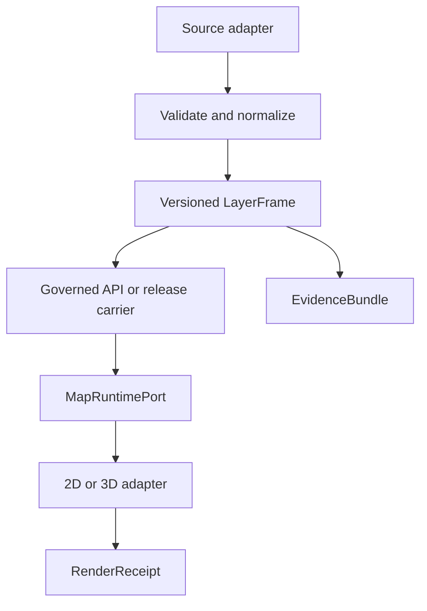

# KFM Explorer — Kansas-First Layers, Animation, Live Updates, 3D & Performance Roadmap

Status: PROPOSED / documentation-only / staged roadmap. This document does not admit a source, activate a runtime feed, change a release or publication state, deploy a service, or authorize a warning product.

## Executive decision

Build the Explorer around one governed `LayerFrame` contract and one renderer-neutral `MapRuntimePort`. Every visible layer should be a time-bounded, source-identified frame with a finite trust state, a legend, rights/sensitivity policy, fallback behavior, and an EvidenceBundle route. Keep the map 2D-first, start playback paused, and treat 3D, live feeds, particles, historic overlays, and AI explanations as adapters behind the same contract.

The first end-to-end proof should be a small Kansas hydrology slice: one versioned HUC/reach snapshot, one Kansas gauge, one exact parameter/statistic/unit/qualifier, one hydrograph, one map selection, one EvidenceBundle, and honest stale/unavailable/ambiguous outcomes. Terrain and weather can proceed as fixture-first work, but neither should be presented as production data until source admission, rights, reproducibility, browser, and performance gates pass.

## 1. Evidence snapshot and boundaries

### Confirmed in the current repository

- Current implementation authority is `bartytime4life/Kansas-Frontier-Matrix`, `main@b44494c1cf0807ed28b606e8a41b255bebdf4ad7` (the branch was opened from the immediately preceding preflight head `eca6c8a2353fbe28ace619288231a047e5d485f5`).
- `apps/explorer-web` has a map-first shell, 18 typed views, 24 typed layer/evidence records, source-observatory and deep-time presentation paths, and explicit HOLD states.
- `@kfm/maplibre` is pinned to MapLibre GL JS `6.7.0` and owns the renderer seam. The adapter is intentionally bounded to an inline local style and rejects external style/resource/source paths.
- `MapRuntimePort` is renderer-neutral; it exposes finite runtime state, trust states such as stale/abstained/denied/conflict/degraded/withdrawn/rolled-back/error, camera synchronization, and selection history/evidence references.
- Browser runtime activation and browser evidence are currently false; terrain, compare, external transport, public release, and performance proof remain held. The legacy MapLibre performance harness exits HOLD, and the current performance-governance validator is a placeholder.
- The repository’s Directory Rules state that names and locations do not grant truth, release, publication, sensitivity clearance, or source rights. Public/UI code must consume governed APIs or release-approved carriers rather than raw or arbitrary upstream storage.
- Notion and Drive records are useful coordination and design lineage, but several contain stale commit/version pins. Re-pin against the exact current repository before implementation decisions.

### Non-negotiable product rules

1. “Live” means a source-specific freshness state, not a universal badge. Show `latest captured`, `updated`, `stale`, `unavailable`, or `error` with the relevant clock.
2. Missing data is not zero; a gap is not continuity; a visual symbol, pixel, interpolation, camera move, or AI sentence is not itself an observation.
3. Keep observation time, forecast initialization/valid time, story time, camera time, and render time separate.
4. Do not interpolate across incompatible units, CRSs, forecast runs, categorical classes, historical boundary editions, or uncertain dates.
5. Source activation, release, publication, warning behavior, exact sensitive locations, and arbitrary remote assets stay behind their existing policy gates.
6. Every 3D object, particle field, terrain surface, and derived visual must point back to the frame and evidence that authorized it.

## 2. Target architecture

### Core records

Create or ratify these as typed contracts in the repository’s existing contract/schema authority. Do not create a new root or choose a schema home by convenience; resolve the existing LayerManifest handoff first.

`LayerManifest`

- `layer_id`, domain, human title, question answered, representation (`vector`, `raster`, `terrain`, `particle`, `model`, `historical_scan`, `annotation`), geometry/raster schema, and permitted zoom/scale.
- Source/product/version identity, access and attribution, coverage, CRS, vertical datum where relevant, units, map/boundary edition, and rights/sensitivity decision.
- Time model: observation interval, forecast run/lead/valid interval, historical effective interval, or story time; date precision and unknown-time semantics.
- QA status, uncertainty description, refresh cadence, stale threshold, release/evidence references, legend, ordered fallbacks, and render budget.

`LayerFrame`

- `frame_id`, `layer_id`, dataset/version digest, spatial bounds/resolution, CRS/vertical reference, units, source timestamps, KFM retrieval/transform/review/release timestamps, and correction/supersession state.
- `status`: `AVAILABLE | STALE | UNAVAILABLE | ERROR | ABSTAINED | DENIED | CONFLICT | DEGRADED | WITHDRAWN | ROLLED_BACK`.
- `evidence_refs`, `quality_flags`, `uncertainty`, `coverage`, `legend`, and a stable `frame_key` for caching and comparison.

`RenderReceipt`

- Frame IDs and evidence refs actually rendered; map style and renderer version; adapter/plugin IDs and versions; projection/camera; terrain exaggeration; active fallbacks; capability profile; warnings; and disposal/context-loss outcome.
- It proves what the client attempted to render. It does not prove source truth, release approval, or scientific validity by itself.

`WorkspaceState`

- Public-safe view, AOI, layer IDs, time cursor, compare cursor, camera, playback state, and selected evidence IDs.
- Keep it URL-shareable only when every identifier is public-safe and release-approved. Do not put raw URLs, tokens, restricted coordinates, or unreviewed source IDs in the URL.

### Runtime flow



The browser should never fetch arbitrary upstream URLs. A connector may emit raw/quarantine material and receipts; a watcher may emit candidate events and receipts; only a governed promotion/release path makes a frame consumable by the public client.

### Layer stack and visibility policy

Use a stable, explicit order. Each view should declare its stack instead of relying on global layer magic.

1. **Foundation:** basemap, administrative boundaries, place labels, roads, rail, waterways, terrain/hillshade.
2. **Environment:** precipitation/radar, temperature, pressure, UV, air quality, smoke, soil moisture, vegetation indices.
3. **Living systems:** habitat/land cover, plants, fauna, ecological observations and generalized ranges.
4. **Earth and resources:** geology, geomorphology, soils, wells, mineral/resource context.
5. **History and change:** historical scans, older DEMs, older hydrology editions, land-cover/agriculture change.
6. **Hazards:** flood/drought/heat/wildfire/severe-weather context and alert lifecycle.
7. **Analysis:** selection, measurement, profile, compare, uncertainty, annotations, story camera.

Default visibility should be sparse. A view may enable several environmental layers, but it should not combine all animated fields at once. The map should expose the active stack, frame timestamps, source status, and a one-click Evidence/Methods panel.

## 3. Visual and data plan by requested domain

| Domain | Recommended representation | Animation or interaction | Evidence and safety rules | First proof |
|---|---|---|---|---|
| Water | River/reach lines, waterbody polygons, gauge symbols, hydrograph, optional flow arrows | Time scrub gauge observations; replay a released hydrograph; flow particles only when a direction/velocity product exists | Distinguish waterbody geometry, gauge measurement, modeled flow, flood extent, and regulatory zone. Show parameter, statistic, unit, qualifier, provisional/final, and station identity. | Versioned HUC/reach fixture plus one Kansas gauge and EvidenceBundle |
| Smoke | Fire hotspots, HMS smoke polygons, product-specific concentration/transport rasters, optional height bands | Step or buffer forecast frames; animate transport only from a declared model/product clock | Separate detected fire, smoke analysis, and smoke forecast. Preserve legend, spatial support, confidence, issue/run/valid time, limitations, and health-source links. KFM is not a warning service. | One replayable smoke frame sequence with stale/forecast labeling |
| Animals | Generalized observations, range polygons, grid/hex density, effort-aware counts | Animate only authorized telemetry or a time series; otherwise use step changes or small multiples | Exact rare-species locations default to deny/generalize. Do not convert sampling gaps into absence. Preserve observation date precision, observer/survey effort, rights, and uncertainty. | Public-safe generalized occurrence fixture |
| Plants | Survey points/areas, vegetation classes, phenology windows, invasive-species context, land-cover raster | Seasonal step/scrub; limited transition animation for comparable classes | Preserve map scale and survey method. Avoid decorative “growth” animation that implies measured biomass. Distinguish observation, classification, and modeled suitability. | One scale-labeled plant/land-cover time slice |
| Temperature | Continuous raster, isolines, station dots, anomaly or departure layer | Frame stepping or buffered playback; observation and forecast clocks separate | Show units, statistical period, station/instrument/QC, forecast issue/run/valid time, and interpolation method. Sparse stations must not imply a validated continuous field without a declared method. | Station observation fixture → time series → map selection |
| UV index | Forecast/analysis raster or station/point categories with numeric legend | Hourly/day scrub; paused by default; display local date/time | Show index value/category, forecast vs observation/analysis, valid time, and location/time-zone basis. Use text and pattern/shape in addition to color. | One forecast frame and accessible category panel |
| Barometric pressure | Station symbols, isobars or anomaly raster only when the source supports it | Step observations/analysis; optional gentle frame crossfade as presentation only | Keep station pressure and sea-level pressure distinct; preserve unit, elevation correction, station, QC, and time. Never infer an isobar field from sparse points without a stated interpolation method. | One pressure station set with exact unit and timestamp |
| Historical maps | Rights-cleared scan/tiles, georeferenced image, control points, edition/date metadata | Swipe, opacity, side-by-side, compare cursor; no automatic morph across uncertain control | Store archive/item/call number, creator, edition/date/interval, scale, rights, original digest, control points, transform/software, RMSE/checkpoints, CRS, extrapolation, derivative digest, uncertainty, review. | One Kansas historical scan with reproducible georeferencing receipt |
| Hazards | Event points/polygons/tracks/alert zones with severity and lifecycle styling | Animate issued/effective/expired/revised states or event tracks; preserve the alert clock | Context and provenance first. Show issued/effective/expiration/revision, source, confidence, affected area, and official warning link. Do not promise emergency completeness or substitute for official alerts. | One historical/context hazard slice with finite unavailable state |
| Current elevation | Raster DEM terrain, hillshade, tinted relief, contours, profile/sample panel, optional 3D | Camera tilt and profile cursor; frame switch only between compatible DEM products | Show DEM product/version, resolution, CRS, vertical datum/geoid, units, nodata, accuracy/limitations, exaggeration, and source date. Use unexaggerated values for numeric samples. | PR #4452 Ellsworth candidate remains fixture-only until vertical metadata is resolved |
| Older elevation | Dated DEM editions, side-by-side/difference raster, profiles | Compare cursor and difference mode; no “change” claim without co-registration | Co-register horizontal/vertical datums; align resolution and nodata; report uncertainty, control/checkpoints, and whether difference is measured or artifact. Keep old surface as historical reference, not current truth. | Two DEM fixture frames and an uncertainty-aware difference panel |
| Older hydrology | Versioned WBD/NHD/NHDPlus/3DHP/agency editions as separate layers | Edition slider or side-by-side; typed relation to current edition | 3DHP and legacy products must not be silently merged. Preserve edition, effective date, maintenance status, schema, crosswalk, and legal/operational limitations. | One Kansas watershed/reach evolution comparison |

## 4. Animation system

Separate five clocks and one state machine:

- `dataClock`: observation or historical phenomenon time.
- `forecastClock`: initialization, lead, valid, ensemble/member, and issuance time.
- `storyClock`: progress through a curated report/story.
- `cameraClock`: camera path/time for a tour or profile.
- `renderClock`: requestAnimationFrame and GPU presentation time.

Use a finite playback state: `PAUSED`, `BUFFERING`, `PLAYING`, `STEPPING`, `SCRUBBING`, `DEGRADED`, `STOPPED`, `ERROR`. Start `PAUSED`; make play, pause, step, speed, loop, frame timestamp, and source status visible. Escape, map interaction, hidden-tab transitions, reduced-motion settings, evidence failure, and source withdrawal should pause or reduce animation.

Animation modes:

1. **Frame replay:** discrete observations, forecasts, scans, or edition snapshots. The safest default.
2. **Buffered playback:** play only frames already validated and released; show gaps rather than filling them.
3. **Live append/replace:** poll or receive a governed update, add a new frame, mark the latest captured time, and retain corrections/supersessions.
4. **Compare scrub:** synchronize two frame keys or editions without implying that two unlike values are directly comparable.
5. **Process visualization:** particles, arrows, smoke transport, or water flow only when the underlying product defines the field and units.
6. **Story/camera animation:** move the camera and annotation state independently from scientific time.

Interpolation policy:

- Numeric interpolation is allowed only within one product, unit, CRS, compatible time model, and declared method.
- Categorical, boundary-edition, sparse-observation, uncertain-date, forecast-run, and rights-sensitive data use steps or side-by-side comparison.
- Crossfade is a display transition, never a new observation. Label it “visual transition” in methods if it could be mistaken for a value.
- Reduced motion preserves the same facts by using a static frame, step controls, and textual change summaries.

## 5. Live update and freshness plan

### Update pipeline

1. **Source adapter:** allowlisted product/host/path/parameters; bounded geography, time, pages, bytes, features, and decompressed size; timeout, retry, circuit breaker, and cache policy.
2. **Raw/quarantine receipt:** preserve original bytes or source response identity, retrieval time, terms, and request metadata without making it public.
3. **Normalize/validate:** schema, content, CRS, units, geometry, time, QC, station/product identity, and duplicate/correction checks.
4. **Frame builder:** create a versioned `LayerFrame`, calculate coverage/freshness, link evidence, and record derived transformations.
5. **Governed API/release carrier:** expose only approved frames, bounded queries, and finite status envelopes. Use conditional requests, ETag/Last-Modified where permitted, and explicit cache TTL.
6. **Client adapter:** update a stable source/layer ID, retain frame history, cancel obsolete requests, and produce a `RenderReceipt`.

“Live” should be implemented as a status-aware frame stream, not an unbounded socket. Start with scheduled polling for one proof source, then evaluate deltas/events only when delivery, replay, correction, authentication, and backpressure are specified. Handle late data, revised observations, withdrawn products, clock skew, duplicate frames, and source downtime.

Expose these user-facing timestamps separately:

- `observed_at` / phenomenon interval
- `issued_at`, `run_at`, `valid_at` for forecasts or alerts
- `source_updated_at` / provider revision
- `retrieved_at` / KFM ingestion time
- `released_at` / expiry or withdrawal time

Current, latest, and live are not synonyms. A frame can be the latest captured frame and still be stale for the layer’s declared cadence.

### Candidate source lanes

| Product family | Role in roadmap | Admission note |
|---|---|---|
| USGS 3DEP | Terrain and older DEM reference | Resolve exact Kansas product, datum/geoid, accuracy, licensing, tile/index strategy, and numeric-sample contract. |
| USGS Water Data OGC APIs | Gauge observations, daily values, metadata | Preserve parameter/statistic/unit/qualifier/approval status and station history; cache and rate-limit. |
| USGS 3DHP, WBD, NHD/NHDPlus legacy | Modern and historical hydrology editions | Keep maintained 3DHP separate from legacy reference editions and document crosswalk/edition status. |
| NWS API, NCEI NEXRAD, MRMS | Forecasts, alerts, observations, radar | Preserve forecast/run/valid clocks, station/QC, radar scan/product identity, and freshness. |
| NOAA HMS, HYSPLIT, NASA FIRMS | Smoke analysis, smoke forecasts, active-fire detections | Product-specific legends and uncertainty; never collapse detection, analysis, and forecast into one smoke layer. |
| EPA AQS, AirNow | Air-quality observations and current public AQI context | Preserve monitor, instrument, QC, variable, units, and advisory status. |
| NRCS SSURGO/SDA, SMAP, NASS/CDL | Soil, moisture, crops/land cover | Preserve map scale, survey area, map unit/component distinction, and observation vs model labels. |
| USGS HTMC/TopoView, LOC, NARA, BLM GLO, Kansas Memory, KDOT | Historical maps and factual series | Candidate only until item identity, rights, georeferencing, edition, and derivative digest are verified. |

## 6. Elevation and base-map change design

Treat the base map, terrain surface, and elevation-change analysis as different products:

- **Base-map edition:** visual context and labels; changing it must be an explicit `mapEdition` transition with a receipt, not an invisible style swap.
- **Terrain surface:** a DEM/raster-derived surface that changes camera depth and relief. It must expose product/version/vertical reference and 2D fallback.
- **Elevation change:** a measured or modeled difference between two compatible surfaces or an admitted change product. It must carry co-registration method, horizontal/vertical datum, resolution, nodata, uncertainty, and a “not interpretable” state.

Use one unexaggerated source for numeric samples, contours, and profiles. Terrain exaggeration is a presentation parameter; default to `1.0` and show the actual exaggeration. The current 3DEP candidate is a fixture/HOLD, not a runtime elevation claim; its unresolved geoid and tile-applicable accuracy must be resolved before promotion.

Water surfaces, bridges, embankments, and hydrology overlays require special handling. Do not infer flood depth or channel change from a hillshade alone. If a standard DEM flattens water surfaces, disclose that behavior. Keep `surface_elevation`, `water_level`, `terrain_elevation`, and `flood_extent` as separate typed values.

## 7. Advanced MapLibre GL / 3D roadmap

### Baseline, in order

1. MapLibre 2D source/layer lifecycle and camera synchronization through `MapRuntimePort`.
2. Raster DEM terrain, hillshade, sky/fog, contours/profile, and terrain denial/fallback.
3. Globe projection and controlled pitch/bearing with scale/measurement warnings.
4. Fill-extrusion for bounded 2.5D thematic geometry, with explicit vertical units and visual-only labels.
5. Custom WebGL layers for water/smoke/flow particles or volume-like effects, only with a frame-backed field and a budget.
6. Interleaved deck.gl or other rendering plugins only after dependency, licensing, adapter, context-loss, accessibility, and disposal proofs.
7. 3D Tiles/glTF/three.js for buildings, infrastructure, archaeological or natural-resource objects only when assets have rights, generalized/sensitive geometry policy, provenance, and an EvidenceBundle.
8. Point-cloud/lidar/EPT/COPC and COG/PMTiles protocols only through governed, bounded adapters; never accept arbitrary remote protocol URLs from the client.
9. Clipping planes, section/profile views, shadows, lighting, and scene annotations as optional analysis controls, not default decoration.

### 3D acceptance rules

- WebGL2 is the baseline capability; WebGL context loss/restoration and resource disposal are tested.
- Every custom layer has a unique ID, `render` lifecycle, explicit `renderingMode`, known GL-state restoration, and `onRemove` cleanup.
- Every plugin is pinned, allowlisted, bundle-budgeted, and replaceable by a 2D fallback.
- 3D and 2D share the same selected feature/frame/evidence semantics. A 3D symbol must not gain authority merely because it is spatially impressive.
- Low-memory, reduced-motion, no-WebGL, blocked-worker, and denied-asset states remain useful and legible.
- GPU effects cannot silently change a data value. Use labels such as `visualization`, `forecast`, `model`, or `derived` where needed.

## 8. React programming ideas

Keep React responsible for application state and controls; keep the MapLibre instance and high-frequency rendering outside the React render loop.

Suggested modules:

- `features/layer_frame`: typed manifest/frame/status selectors, legend and methods models.
- `features/time_cursor`: data/forecast/story clock coordination, frame stepping, gap handling.
- `features/playback`: finite state machine, reduced-motion policy, visibility/Escape pause behavior.
- `features/map_runtime`: existing `MapRuntimePort`, snapshot store, adapter lifecycle, selection forwarding.
- `features/layer_catalog`: search, domain grouping, source/freshness/rights filters.
- `features/evidence_drawer`: EvidenceBundle, provenance, methods, uncertainty, rights, corrections.
- `features/compare`: edition/frame pairing, alignment warnings, opacity/swipe/profile controls.
- `features/capability_profile`: WebGL, memory, DPR, worker, reduced-motion, network and battery hints.
- `workers/`: parsing, reprojection/derived-grid preparation, particle buffers, geometry simplification; communicate with versioned messages and transferable buffers.

Patterns:

- Use `useSyncExternalStore` for the `MapRuntimePort` snapshot; return cached immutable snapshots and stable subscribe/getSnapshot functions.
- Use `useReducer` with discriminated unions for playback, layer selection, source health, compare, and evidence drawer state.
- Use `useEffect` only for map construction/teardown, external subscriptions, worker lifecycle, and cancellable requests.
- Memoize style specifications and selector outputs; do not put tile/particle/hover-frequency state in ordinary React state.
- Use `AbortController` for frame requests and a request token to prevent late responses from replacing a newer frame.
- Use `useDeferredValue` or a transition for catalog/search UI, not for authoritative map data.
- Keep camera updates imperative and throttled; publish a coalesced snapshot to React rather than rendering on every `move` event.
- Add error boundaries around optional 3D/plugins and surface the finite fallback state rather than unmounting the whole explorer.
- Test reducer/state-machine transitions as pure functions; test adapter lifecycle and evidence propagation separately from visual snapshots.

Example state shape:

```ts
type FrameStatus =
  | { kind: "available"; frameId: string }
  | { kind: "stale"; frameId: string; staleSince: string }
  | { kind: "unavailable"; reason: string }
  | { kind: "abstained"; reason: string }
  | { kind: "error"; retryAt?: string; reason: string };

type ExplorerMapSnapshot = Readonly<{
  camera: Camera;
  selectedFeatureId?: string;
  visibleFrames: readonly LayerFrame[];
  statusByLayer: Readonly<Record<string, FrameStatus>>;
  evidenceRefs: readonly string[];
}>;
```

The exact contract belongs in repository schema/design review; this snippet is an implementation idea, not a ratified schema.

## 9. Performance plan

### Proposed budget axes

Do not declare thresholds until a deterministic browser fixture and representative low/mid/high capability profiles exist. Measure:

- time to first useful canvas, runtime READY, and first interactive camera;
- frame switch latency and stale/fallback response time;
- pan/zoom frame rate, animation frame rate, long-task time, and main-thread utilization;
- GPU draw calls, texture/buffer memory, worker queue, JS heap, and context-loss recovery;
- tile/request count, bytes, decompression time, cache hit rate, abort rate, and retry/circuit behavior;
- 3D scene/object count, particle count, terrain tile count, DPR, and device-tier downgrade;
- long-session stability, tab visibility, reduced-motion behavior, and disposal leaks.

Record p50/p95/p99 where useful and store versioned evidence artifacts with the exact browser, OS/device profile, commit, fixtures, network mode, camera, layer stack, frame IDs, and thresholds. A green local run is not a release proof until the repository’s performance authority accepts the artifact.

### Optimizations

- Generalize vector geometry and labels by zoom; clip to AOI; use stable source IDs and layer IDs.
- Use raster overviews/tiling and bounded COG/PMTiles range access; precompute expensive reprojection/aggregation.
- Keep only the active frame plus one adjacent prefetched frame; use an LRU cache keyed by source/product/version/frame/bbox/resolution/CRS.
- Abort obsolete requests and worker jobs. Dedupe equivalent frame requests and batch source updates.
- Parse/normalize/derive in workers; consider OffscreenCanvas only for compatible custom rendering/particle workloads, not as an assumption that the whole MapLibre map can move off the main thread.
- Cap particles, terrain detail, 3D objects, and animation rate by a capability profile. Offer a `2D Lite` mode with the same facts.
- Use requestAnimationFrame only while visible and animating; stop timers and listeners when a layer/view is inactive.
- Avoid React rerenders from map move/tile/particle events; coalesce external snapshots and keep high-frequency buffers imperative.
- Code-split optional domains, historical tools, 3D plugins, and heavy analysis panels.
- Reuse WebGL buffers/textures, restore GL state in custom layers, release resources on removal, and test context loss.
- Keep the default view visually quiet: do not start radar, smoke particles, flow particles, terrain, and multiple raster overlays simultaneously.
- Redact/aggregate telemetry; never emit exact sensitive feature coordinates, raw source URLs, tokens, or restricted IDs.

## 10. Dependency-ordered implementation phases

| Phase | Deliverable | Proof of done | Explicit hold |
|---|---|---|---|
| 0. Re-pin and contract decision | Re-pin design records to current main; decide LayerManifest/LayerFrame schema home; define status, evidence, receipt, and performance-artifact locations | ADR/contract review identifies authority, owners, rollback, and consumers | No source activation or runtime transport |
| 1. Frame-first seam | Fixture-only LayerFrame store, selectors, finite states, legends, EvidenceBundle linkage, RenderReceipt skeleton | Synthetic map selection → frame → evidence drawer → report draft | No public payloads |
| 2. Time and animation | Shared clocks, paused playback, step/scrub/compare, gap/forecast-run rules, reduced motion, visibility/Escape pause | Deterministic fixture replay with accessible static fallback | No autoplay/live source |
| 3. Hydrology proof | One USGS water product path, HUC/reach crosswalk, Kansas gauge, hydrograph and exact qualifiers | Reproducible released fixture, ambiguous join abstention, stale/no-results/error states | No broad source rollout |
| 4. Terrain proof | Reuse/resolve Ellsworth DEM fixture, unexaggerated sample, hillshade/contour/profile, terrain fallback | Datum/geoid/accuracy/rights and browser evidence; 2D/terrain parity | No production elevation-change claim |
| 5. Weather and atmosphere | Temperature, pressure, UV, observations/forecasts, radar frame contracts | Distinct clocks, station/QC/units, bounded polling, finite freshness | No warning guarantee |
| 6. Smoke and air | HMS/HYSPLIT/FIRMS/AQS/AirNow product-specific frames | Detection/analysis/forecast separation, health-source links, uncertainty, replay | No single “smoke truth” composite |
| 7. Plants, animals, habitat | Generalized public-safe occurrence/habitat/land-cover frames | Sampling/scale/rights/sensitivity and no-absence semantics | Exact sensitive locations denied |
| 8. Historical and change | Historical scans, older DEMs, older hydrology editions, crosswalk/compare tools | Rights, item identity, georef RMSE/checkpoints, datums, uncertainty, edition labels | No unqualified boundary/elevation-change claim |
| 9. Hazard context | Lifecycle-aware hazard/event layers and links | Issued/effective/expired/revised status; official-source handoff | Not an emergency alerting service |
| 10. Advanced 3D | Terrain/globe/fill-extrusion/custom layers, then optional plugins/3D assets | WebGL2/context loss/disposal, asset provenance, low-end fallback, 2D/3D semantic parity | No arbitrary remote models or unproven 3D Tiles/glTF lane |
| 11. Performance governance | Replace placeholder perf validator only after thresholds, fixtures, artifact home, CI authority, and profiles are approved | Repeatable p50/p95/p99 evidence plus long-session and accessibility results | No performance green claim from the retired harness |
| 12. Release/correction operations | Source watch, expiry/withdrawal/correction, rollback, release readback, user-facing methods | Released frame can be reproduced, withdrawn, superseded, and explained | Deployment/publication remains separate approval |

## 11. Acceptance checklist for every new layer

- [ ] Source, product, version, owner/steward, access, terms, attribution, and redistribution rights are identified.
- [ ] Spatial coverage, scale/resolution, CRS, vertical datum, units, nodata, and geometry/raster schema are explicit.
- [ ] Observation/forecast/historical/story clocks and date precision are explicit.
- [ ] QA/QC, uncertainty, sampling effort, model limitations, and interpolation/derivation method are present.
- [ ] Frame digest, retrieval/ingestion/release/expiry/correction timestamps, and supersession chain are reproducible.
- [ ] EvidenceBundle and report route exist; render receipt records the actual frame and visual parameters.
- [ ] Finite stale/unavailable/error/abstain/deny behavior is designed and tested.
- [ ] Public client path uses an allowlisted governed carrier, not arbitrary source URLs or raw storage.
- [ ] Sensitivity/generalization and accessibility/reduced-motion behavior are reviewed.
- [ ] Performance budget, fixture, capability downgrade, and cleanup behavior are measured or explicitly marked not yet measured.
- [ ] Correction/withdrawal/rollback and source-watch ownership are assigned.

## 12. Decisions still needing human review

1. Which existing contract/schema authority owns `LayerManifest` and `LayerFrame` without creating a parallel lane?
2. Which first USGS water product/version and Kansas gauge make the smallest reproducible public-safe proof?
3. Which exact 3DEP tile/product and vertical reference can support a numeric Kansas terrain sample?
4. Which historical-map collection and derivative rights permit a public compare experience?
5. What low/mid/high browser/device profiles and p50/p95/p99 performance thresholds are release-authoritative?
6. Which 3D plugin/asset formats, if any, are worth their security, bundle, accessibility, and maintenance cost?
7. What telemetry is permissible after redaction and aggregation, and who owns performance artifact review?

## 13. Source register

### Repository and project records

- [Current Explorer catalog](https://github.com/bartytime4life/Kansas-Frontier-Matrix/blob/b44494c1cf0807ed28b606e8a41b255bebdf4ad7/apps/explorer-web/src/site/catalog.ts) — confirmed repository state and HOLD labels.
- [Current site composition](https://github.com/bartytime4life/Kansas-Frontier-Matrix/blob/b44494c1cf0807ed28b606e8a41b255bebdf4ad7/apps/explorer-web/src/site/README.md) — confirmed map-first shell and bounded runtime status.
- [MapRuntimePort](https://github.com/bartytime4life/Kansas-Frontier-Matrix/blob/b44494c1cf0807ed28b606e8a41b255bebdf4ad7/packages/maplibre/src/map-runtime-port.ts) — renderer-neutral boundary.
- [MapLibre adapter](https://github.com/bartytime4life/Kansas-Frontier-Matrix/blob/b44494c1cf0807ed28b606e8a41b255bebdf4ad7/packages/maplibre/src/maplibre-adapter.ts) — bounded inline-style seam and external-resource hold.
- [Directory Rules](https://github.com/bartytime4life/Kansas-Frontier-Matrix/blob/b44494c1cf0807ed28b606e8a41b255bebdf4ad7/docs/doctrine/directory-rules.md) — path/authority, public-boundary, and generated-artifact rules.
- [Notion Living Atlas design](https://app.notion.com/p/3d2a92021bf681d68e6dfad0564d8687?pvs=204) and [Notion real-data hub](https://app.notion.com/p/3d6a92021bf6816cae0ec1ccbd15e21e?pvs=204) — current coordination/design lineage; older pins are not implementation authority.
- [Drive Living Atlas design master](https://docs.google.com/document/d/1aivNyfMjQ8urQO6vjt4YvkT1ltF1t7fxCahEcnGV4Dw/edit) — design lineage and book-guided interface/animation requirements.

### Current technical references

- [MapLibre 3D terrain example](https://maplibre.org/maplibre-gl-js/docs/examples/3d-terrain/) — raster DEM terrain, hillshade, sky, pitch, and terrain controls.
- [MapLibre CustomLayerInterface](https://maplibre.org/maplibre-gl-js/docs/API/interfaces/CustomLayerInterface/) — custom WebGL lifecycle, rendering mode, shared context, repaint, context-loss, and cleanup requirements.
- [MapLibre live realtime data example](https://maplibre.org/maplibre-gl-js/docs/examples/add-live-realtime-data/) — renderer-side source update mechanics; it is not a KFM source-authority recommendation.
- [MapLibre COG raster example](https://maplibre.org/maplibre-gl-js/docs/examples/add-a-cog-raster-source/) — candidate raster delivery pattern subject to KFM admission/security gates.
- [React `useSyncExternalStore`](https://react.dev/reference/react/useSyncExternalStore) — external store subscription pattern for the renderer-neutral runtime.
- [MDN OffscreenCanvas](https://developer.mozilla.org/en-US/docs/Web/API/OffscreenCanvas) and [MDN WebGL best practices](https://developer.mozilla.org/en-US/docs/Web/API/WebGL_API/WebGL_best_practices) — worker/off-main-thread and GPU lifecycle considerations.
- [PMTiles](https://github.com/protomaps/PMTiles) and [STAC](https://stacspec.org/) — candidate packaging/catalog standards, not admitted KFM dependencies.

### Public-source candidates

- [USGS 3DEP products and services](https://www.usgs.gov/3d-elevation-program/about-3dep-products-services), [3DEP standards](https://www.usgs.gov/3d-elevation-program/3dep-standards-and-specifications), and [3DEP FAQs](https://www.usgs.gov/3d-elevation-program/science/faqs).
- [USGS 3DHP data products](https://www.usgs.gov/3d-hydrography-program/access-3dhp-data-products) and [Watershed Boundary Dataset](https://www.usgs.gov/national-hydrography/watershed-boundary-dataset).
- [USGS Water Data OGC APIs](https://api.waterdata.usgs.gov/docs/ogcapi/) and [Water Services historical data](https://waterservices.usgs.gov/).
- [National Weather Service API](https://www.weather.gov/documentation/services-web-api) and [NCEI NEXRAD](https://www.ncei.noaa.gov/products/radar/next-generation-weather-radar).
- [NOAA HMS fire and smoke](https://www.ospo.noaa.gov/products/land/hms.html), [NOAA HYSPLIT smoke forecasting](https://www.arl.noaa.gov/hysplit/smoke-forecasting/), and [NASA FIRMS](https://firms.modaps.eosdis.nasa.gov/).
- [EPA Air Quality System](https://www.epa.gov/aqs), [AirNow](https://www.airnow.gov/), and [USDA NRCS SSURGO](https://www.nrcs.usda.gov/resources/data-and-reports/soil-survey-geographic-database-ssurgo).
- Historical-map candidates: [USGS TopoView](https://ngmdb.usgs.gov/maps/Topoview/), [Library of Congress maps](https://www.loc.gov/maps/), [BLM General Land Office Records](https://glorecords.blm.gov/), and [Kansas Memory](https://www.kansasmemory.org/). Each remains `CANDIDATE / NEEDS VERIFICATION` until item identity, rights, georeferencing, and derivative controls are accepted.

### Sourced facts vs recommendations vs unknowns

- **Sourced facts:** repository state, current MapLibre/React/browser documentation, and public agency product/API descriptions listed above.
- **Recommendations:** the contracts, visual encodings, phase order, animation rules, React module split, and performance tactics in this document.
- **Unknown / needs verification:** source admission, exact product versions and rights, Kansas coverage, vertical datum/geoid and terrain accuracy, historical scan permissions, live cadence/limits, layer contract ownership, and release-authoritative performance thresholds.

The next actionable slice is Phase 0 plus Phase 1, followed by the hydrology proof. Keep this document and its receipt in draft review until a human confirms the contract owner, source lane, and release/performance authorities.
