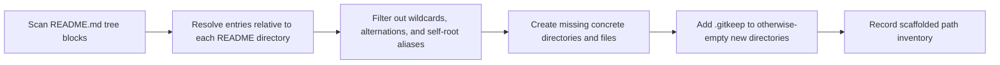

<!-- [KFM_META_BLOCK_V2]
doc_id: kfm://doc/<NEEDS-UUID>
title: README Structure Reconciliation Report
type: standard
version: v1
status: draft
owners: <NEEDS-OWNER-VERIFICATION>
created: <NEEDS-CREATED-DATE>
updated: <NEEDS-UPDATED-DATE>
policy_label: <NEEDS-POLICY-LABEL>
related: [README.md, .github/workflows/README.md, contracts/README.md, schemas/README.md, policy/README.md, tests/README.md]
tags: [kfm, docs, repo-structure, scaffolding, readme]
notes: [doc_id/owners/dates/policy label need verification, current working-tree parity of listed paths needs a fresh recheck]
[/KFM_META_BLOCK_V2] -->

# README Structure Reconciliation Report

Structural reconciliation snapshot for README-declared tree entries and the concrete paths scaffolded to align the working tree with those declarations.


**Quick jump:** [Repo fit](#repo-fit) · [Method](#method) · [Summary](#summary-of-scaffolded-work) · [High-signal paths](#high-signal-path-families) · [Scaffolded paths](#scaffolded-paths-by-area) · [Verification caveats](#verification-caveats) · [Follow-up](#recommended-follow-up)

> [!IMPORTANT]
> This report records **structural alignment** between `README.md` tree declarations and scaffolded paths.  
> It does **not** certify that listed files are implemented, wired, merge-enforced, policy-executed, or otherwise behaviorally complete.

> [!CAUTION]
> Current filesystem parity for every listed path is **NEEDS VERIFICATION**.  
> Treat this document as a **reported scaffold snapshot** unless it is regenerated from the live working tree.

## Repo fit

| Item | Value |
|---|---|
| Likely target path | `docs/reports/readme-structure-reconciliation.md` **(INFERRED)** |
| Upstream inputs | Repo `README.md` tree blocks plus adjacent documentation surfaces that shape structural expectations |
| Downstream use | Reviewer orientation, scaffold verification, documentation reconciliation, and future machine-generated inventory snapshots |
| Accepted inputs | Code-fenced tree blocks containing concrete `──` entries that resolve to real repo paths |
| Exclusions | Wildcards, alternation placeholders, self-root aliases, and any claim that scaffolded paths are functionally implemented |
| Interpretation rule | Presence in this report means **scaffolded to match a declaration**, not **confirmed as operational** |

## Method

The reconciliation process used the following rules:

- Scanned every `README.md` for code-fenced tree lines containing `──` entries.
- Resolved each entry relative to the README directory.
- Ignored wildcard or alternation placeholders such as `*`, `(...)`, and `|`.
- Ignored self-root aliases that restated the local README directory instead of declaring a child path.
- Created missing directories and files for concrete paths.
- Added `.gitkeep` files to otherwise-empty newly created directories so they remain trackable in git.



> [!NOTE]
> `.gitkeep` placements are **implicit companion artifacts** of the scaffold operation and are intentionally omitted from the explicit path inventory below.

## Summary of scaffolded work

**Reported total:** **130** concrete scaffolded paths  
**Breakdown:** **80** directories + **50** files  
**Implicit companions not counted:** `.gitkeep` files added to otherwise-empty new directories

| Area | Paths | Files | Directories | Why it matters |
|---|---:|---:|---:|---|
| `.github` | 24 | 8 | 16 | GitHub-facing scaffolding, action directories, and workflow placeholders |
| `policy` | 24 | 14 | 10 | Policy bundle surface, registries, runbooks, and review-facing docs |
| `scripts` | 20 | 18 | 2 | Validator, release, and consistency script placeholders |
| `infra` | 12 | 0 | 12 | Deployment, monitoring, GitOps, and environment-shape directories |
| `schemas` | 12 | 0 | 12 | Schema-family surface area only; not proof of mounted schema authority |
| `examples` | 10 | 6 | 4 | Example objects and validity buckets for future fixtures and reference artifacts |
| `tools` | 10 | 2 | 8 | Tooling layout and executable-adjacent scaffolding |
| `brand` | 8 | 0 | 8 | Brand asset, token, and template structure |
| `data` | 4 | 0 | 4 | DCAT / PROV / STAC / quarantine structure |
| `tests` | 3 | 0 | 3 | Test-lane placeholders only |
| `migrations` | 2 | 2 | 0 | Early SQL migration stubs |
| `configs` | 1 | 0 | 1 | Systemd configuration surface |

## High-signal path families

Some scaffolded paths are easy to over-read. The table below keeps their meaning disciplined.

| Path family | Why reviewers may over-read it | How this report treats it |
|---|---|---|
| `.github/workflows/*.yml` | Looks like active merge gates or release automation | **Structure only** until workflow contents and branch protection behavior are re-verified |
| `policy/*.rego` and `policy/*.json` | Looks like executable policy bundles and vocabularies | **Scaffold only** until policy loading, tests, and decision outputs are verified |
| `scripts/*` and `tools/*` | Looks like runnable validators and trusted maintenance entrypoints | **Placeholder surface** until command behavior and CI integration are verified |
| `migrations/*.sql` | Looks like applied database state | **Stub existence only** until migration order, idempotency, and execution history are verified |
| `schemas/*` and `contracts/*` adjacent scaffolds | Looks like singular machine-checkable contract authority | **Directory surface only**; schema authority still requires an explicit decision and live files |
| `examples/*.json`, `tests/*`, `policy/{valid,invalid}` | Looks like active fixtures and negative-path coverage | **Future-proofing structure** until fixture inventory and harnesses are verified |

## Scaffolded paths by area

### `.github` and repo-governance surfaces

<details>
<summary><strong>.github</strong> — 24 paths</summary>

```text
.github/ISSUE_TEMPLATE/config.yml
.github/actions/action.yml
.github/actions/metadata-validate
.github/actions/metadata-validate-v2
.github/actions/opa-gate
.github/actions/provenance-guard
.github/actions/sbom-produce-and-sign
.github/actions/src
.github/apps
.github/contracts
.github/data
.github/docs
.github/infra
.github/packages
.github/policy
.github/scripts
.github/tests
.github/tools
.github/workflows/promote-and-reconcile.yml
.github/workflows/release-evidence.yml
.github/workflows/verify-contracts-and-policy.yml
.github/workflows/verify-docs.yml
.github/workflows/verify-runtime.yml
.github/workflows/verify-tests-and-reproducibility.yml
```

</details>

### Brand, config, and data structure

<details>
<summary><strong>brand</strong> — 8 paths</summary>

```text
brand/LICENSES
brand/assets
brand/icons
brand/logos
brand/source
brand/templates
brand/tokens
brand/usage
```

</details>

<details>
<summary><strong>configs</strong> — 1 path</summary>

```text
configs/systemd
```

</details>

<details>
<summary><strong>data</strong> — 4 paths</summary>

```text
data/dcat
data/prov
data/quarantine
data/stac
```

</details>

### Examples and infrastructure

<details>
<summary><strong>examples</strong> — 10 paths</summary>

```text
examples/catalog_closure.json
examples/dataset_version.json
examples/evidence_bundle.json
examples/hydrology
examples/ingest_receipt.json
examples/invalid
examples/release_manifest.json
examples/source_descriptor.json
examples/thin_slice
examples/valid
```

</details>

<details>
<summary><strong>infra</strong> — 12 paths</summary>

```text
infra/apps
infra/compose
infra/contracts
infra/docs
infra/gitops
infra/kubernetes
infra/monitoring
infra/policy
infra/runbooks
infra/systemd
infra/terraform
infra/tests
```

</details>

### Migrations and policy

<details>
<summary><strong>migrations</strong> — 2 paths</summary>

```text
migrations/0001_enable_extensions.sql
migrations/0002_spatial_indexes.sql
```

</details>

<details>
<summary><strong>policy</strong> — 24 paths</summary>

```text
policy/access.rego
policy/bundles
policy/citations.rego
policy/completeness.rego
policy/evidence.rego
policy/exceptions
policy/fixtures
policy/generalization.rego
policy/invalid
policy/local-check.md
policy/obligation_codes.json
policy/pack.rego
policy/provenance
policy/publication
policy/reason_codes.json
policy/release.rego
policy/review-checklist.md
policy/review.rego
policy/reviewer_roles.json
policy/runbooks
policy/runtime
policy/sensitivity
policy/valid
policy/withholding.rego
```

</details>

### Schemas, scripts, tests, and tools

<details>
<summary><strong>schemas</strong> — 12 paths</summary>

```text
schemas/apis
schemas/contracts
schemas/deployment
schemas/docs
schemas/events
schemas/examples
schemas/invalid
schemas/observability
schemas/policy
schemas/profiles
schemas/tests
schemas/valid
```

</details>

<details>
<summary><strong>scripts</strong> — 20 paths</summary>

```text
scripts/attach_evidence.sh
scripts/crosslink_consistency.py
scripts/domain_freshness.sh
scripts/emit_error_json.sh
scripts/example_record_valid.sh
scripts/focus_mode_gate.sh
scripts/has_metadata.sh
scripts/md_required_sections.sh
scripts/release
scripts/run_receipt_valid.sh
scripts/spdx_ok.sh
scripts/spec_hash_valid.sh
scripts/stac_valid.sh
scripts/validate_jsonld.sh
scripts/validate_prov.py
scripts/validate_stac.py
scripts/validators
scripts/verify_checksums.sh
scripts/verify_fingerprint.py
scripts/write_index_entry.sh
```

</details>

<details>
<summary><strong>tests</strong> — 3 paths</summary>

```text
tests/correction
tests/release_assembly
tests/runtime_proof
```

</details>

<details>
<summary><strong>tools</strong> — 10 paths</summary>

```text
tools/attest
tools/bash
tools/catalog
tools/catalog_qa
tools/ci
tools/config.yml
tools/partition
tools/run_catalog_qa.py
tools/sql
tools/validate
```

</details>

## Interpretation legend

| Label | Meaning in this report |
|---|---|
| **CONFIRMED** | The reconciliation method and the explicit scaffold inventory recorded here |
| **INFERRED** | Editorial grouping, counts, and the likely target location of this report |
| **PROPOSED** | Follow-up steps that would make this report safer and more durable in the repo |
| **UNKNOWN** | Anything about mounted implementation, command behavior, file contents, or workflow execution not directly proven here |
| **NEEDS VERIFICATION** | Current working-tree parity of every listed path, especially high-signal executable-looking files |

## Verification caveats

This report should be read with four constraints in mind:

1. **Scaffolded is not implemented.**  
   A path in this report proves that the working tree was brought into alignment with a README declaration at the time of the scaffold pass. It does not prove executable content, valid wiring, or merge-enforced behavior.

2. **Historical drift is possible.**  
   If files were later removed, renamed, or superseded, this document becomes a historical structure snapshot rather than a live inventory.

3. **Executable-looking files carry extra risk.**  
   Workflow YAML, Rego files, SQL migrations, validators, and tool entrypoints visually imply maturity. This report intentionally avoids making that leap.

4. **Authoritative inventory should eventually be generated, not narrated.**  
   For long-horizon maintainability, a machine-generated inventory or verification command should supersede a hand-maintained scaffold report.

## Recommended follow-up

- [ ] Re-run reconciliation against the **current** working tree and replace this document with a verified snapshot.
- [ ] Mark this report explicitly as **historical** if it is kept for audit purposes rather than live inventory.
- [ ] Distinguish future states using separate labels such as **scaffolded**, **implemented**, **wired**, and **verified**.
- [ ] Pair high-signal path families with real artifacts before treating them as trust-bearing evidence:
  - workflow YAML with active required checks
  - schema files with fixtures
  - policy bundles with tests
  - script and tool entrypoints with documented commands
- [ ] Add or link an authoritative inventory source if one becomes available.

## Non-goals

This report does **not** attempt to:

- prove that the listed files contain complete or correct contents
- certify CI/CD behavior, branch protection, or review enforcement
- resolve contract authority between `contracts/` and `schemas/`
- prove mounted runtime, database, or release state
- substitute for a generated repo inventory or verification command

## Maintenance note

When this document is updated, prefer one of the following patterns:

1. **Verified snapshot pattern**  
   Regenerate the list from the current tree, stamp the date, and state that the inventory is current as of that run.

2. **Historical record pattern**  
   Freeze the document as a dated scaffold report and point maintainers to the current authoritative inventory source.

3. **Hybrid pattern**  
   Keep this report as historical context, but surface the live inventory elsewhere and link to it prominently.

---

[Back to top](#readme-structure-reconciliation-report)
