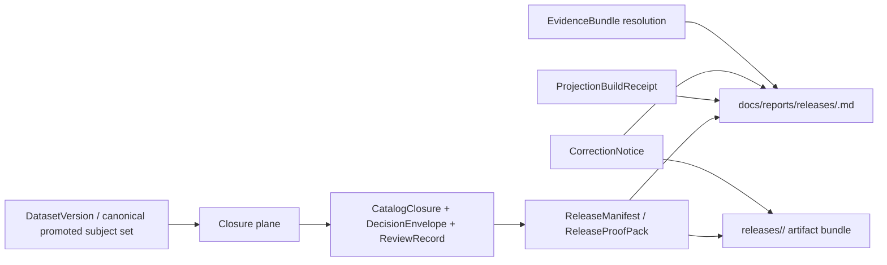

<!-- [KFM_META_BLOCK_V2]
doc_id: kfm://doc/<uuid-NEEDS-VERIFICATION>
title: Release Reports
type: standard
version: v1
status: draft
owners: TODO (NEEDS VERIFICATION)
created: YYYY-MM-DD (NEEDS VERIFICATION)
updated: YYYY-MM-DD (NEEDS VERIFICATION)
policy_label: public
related: [../../../releases/ (INFERRED), ../../runbooks/publication.md (PROPOSED), ../../runbooks/correction.md (PROPOSED), ../../runbooks/rollback.md (PROPOSED), ../daily/README.md (NEEDS VERIFICATION)]
tags: [kfm, releases, reports]
notes: [Current-session evidence remained doctrine-heavy and PDF-visible; exact repo tree, owners, dates, and neighboring file existence need direct repository verification.]
[/KFM_META_BLOCK_V2] -->

# Release Reports

Governed, human-readable summaries of released scope, proof, freshness, and correction state.

> **Status:** experimental  
> **Owners:** TODO (NEEDS VERIFICATION)  
> **Path:** `docs/reports/releases/README.md`  
>      
> **Quick jump:** [Scope](#scope) · [Repo fit](#repo-fit) · [Inputs](#inputs) · [Exclusions](#exclusions) · [Directory tree](#directory-tree) · [Quickstart](#quickstart) · [Usage](#usage) · [Diagram](#diagram) · [Reference tables](#reference-tables) · [Task list](#task-list) · [FAQ](#faq) · [Appendix](#appendix)

> [!IMPORTANT]
> This directory is a **downstream release surface**. It must not promote a release, replace a release artifact set, or become a second truth store.

> [!NOTE]
> Truth labels in this README are deliberate: **CONFIRMED**, **INFERRED**, **PROPOSED**, **UNKNOWN**, and **NEEDS VERIFICATION**. The attached corpus strongly supports the release object model and correction-visible posture; exact repo paths and neighboring file presence do **not** count as confirmed without direct repository evidence.

## Scope

This directory should make released material **readable without making it vague**.

In KFM terms, release reports belong **after** governed promotion and release assembly. Their job is to help a maintainer, reviewer, steward, or public-facing reader move from a short narrative summary to the exact release-bearing proof objects, freshness basis, and correction lineage that back outward claims.

A good release report answers four questions quickly:

1. What release scope is this describing?
2. What proof and policy state made it publishable?
3. What freshness limits, generalization rules, or caveats remain visible?
4. What changed later, and where is the correction lineage?

### What this README can actually claim today

| Claim | Status | Why |
|---|---|---|
| KFM needs typed release objects and visible correction lineage. | **CONFIRMED** | Strongly established in the attached doctrine. |
| Human-readable release summaries should stay downstream of promotion and release assembly. | **CONFIRMED** | Release assembly, derived delivery, and runtime trust cues are explicitly separated in the corpus. |
| `docs/reports/releases/` is the exact mounted repo location for this directory. | **NEEDS VERIFICATION** | Requested target path in this session; not directly reverified from a mounted repo tree. |
| Named sibling docs such as publication/correction/rollback runbooks exist at the listed paths. | **PROPOSED** | These are useful companion docs and appear as starter paths elsewhere in the corpus, but were not mounted here. |
| A top-level `releases/` area is the companion artifact surface. | **INFERRED** | Multiple attached KFM docs use `releases/` starter paths for manifest/proof-pack assembly, but current repo presence was not directly verified. |

[Back to top](#release-reports)

## Repo fit

### Path

`docs/reports/releases/README.md`

### Why this directory exists

This README belongs in the docs layer because its job is **explanation, navigation, and release literacy**. It should summarize promoted scope without duplicating machine-bearing artifacts or turning prose into authority.

### Upstream / downstream relationships

| Direction | Reference | Role here | Status |
|---|---|---|---|
| Upstream | `CatalogClosure` | Outward metadata closure and release linkage that reports should summarize, not restate wholesale. | **CONFIRMED** |
| Upstream | `DecisionEnvelope` / `ReviewRecord` | Public-safe policy/review context when that context materially changes release meaning. | **CONFIRMED** |
| Upstream | `ReleaseManifest` / `ReleaseProofPack` | Primary release-bearing proof objects that this directory should point to. | **CONFIRMED** |
| Upstream | `CorrectionNotice` | Visible lineage for supersession, withdrawal, narrowing, or replacement. | **CONFIRMED** |
| Upstream | `ProjectionBuildReceipt` | Delivery freshness and stale-after basis for derived outward layers. | **CONFIRMED** |
| Runtime support | `EvidenceBundle` | One-hop support path for consequential outward claims, previews, or report-linked story/export surfaces. | **CONFIRMED** |
| Downstream | `../../../releases/` | Likely home of packaged release artifacts and release bundles. | **INFERRED** |
| Adjacent | `../../runbooks/publication.md` | Companion publication procedure and release-assembly guidance. | **PROPOSED** |
| Adjacent | `../../runbooks/correction.md` | Companion correction and supersession procedure. | **PROPOSED** |
| Adjacent | `../../runbooks/rollback.md` | Companion rollback and withdrawal procedure. | **PROPOSED** |
| Sibling | `../daily/README.md` | Daily or run-scale reporting surface, if present. | **NEEDS VERIFICATION** |

### Audience fit

| Audience | What this directory should do for them | What it must not do |
|---|---|---|
| Maintainers | Provide a stable narrative index of released scope and proof. | Invent repo state or blur placeholders into facts. |
| Reviewers / stewards | Make release lineage, review posture, and correction state easy to inspect. | Hide public-safety caveats behind tidy prose. |
| Builders / operators | Point cleanly to manifests, proof packs, freshness basis, and artifact sets. | Replace runbooks, CI logs, or emitted proof objects. |
| Public / civic readers | Explain what is released and what caveats apply. | Present unsupported or uncited claims as authoritative. |

[Back to top](#release-reports)

## Inputs

### Accepted inputs

This directory should accept only **release-safe, outward-facing summaries** derived from governed release state, such as:

- release notes tied to a stable release identifier
- scope summaries for a promoted or otherwise outward-valid release
- human-readable change summaries
- artifact pointers into the packaged release set
- visible correction, supersession, withdrawal, or narrowing state
- freshness and stale-visible notes
- public-safe evidence pointers
- public-safe rights, sensitivity, or generalization caveats

### Accepted supporting objects

| Object family | What belongs in the report |
|---|---|
| `CatalogClosure` | Release-facing catalog identity, outward profile references, and discoverability linkage. |
| `DecisionEnvelope` / `ReviewRecord` | Public-safe summary of review or obligations when they materially affect what readers may rely on. |
| `ReleaseManifest` / `ReleaseProofPack` | Stable release ID, scope summary, artifact links, proof links, and rollback/correction posture. |
| `ProjectionBuildReceipt` | Freshness basis, release linkage, stale-after posture, and derived-surface build context. |
| `EvidenceBundle` | Short evidence summary plus drill-through path where outward support should remain inspectable. |
| `CorrectionNotice` | Replacement or change lineage, public note, affected surfaces, and rebuild linkage. |
| `RuntimeResponseEnvelope` | Optional only when the report is documenting a released governed-assistance surface or runtime change. |

## Exclusions

### What does **not** belong here

| Exclusion | Goes somewhere else | Why |
|---|---|---|
| RAW / WORK / QUARANTINE material | intake, staging, or candidate lanes | Not public-safe release scope |
| Unpublished candidate datasets or pre-promotion outputs | canonical / review / candidate surfaces | A release report must not preview unreleased truth |
| Schemas, fixtures, policy bundles, registries | `contracts/`, `schemas/`, `policy/` | Executable control artifacts are not release reports |
| CI traces, raw logs, dashboards, metrics dumps | ops / observability surfaces | Reports may point to them; they should not absorb them |
| Binary manifests, proof bundles, SBOMs, signatures | `../../../releases/` | Packaged artifacts are machine-bearing outputs |
| Free-form essays detached from release state | story or domain docs | This directory should remain release-anchored |
| Sensitive precise-location detail when policy requires generalization | stewarded policy-safe surfaces only | Visible withholding/generalization is safer than leakage |
| Promotion decisions themselves | review / release assembly surfaces | Reports summarize outcomes; they do not perform them |

> [!WARNING]
> Do not let this directory become a tidy dumping ground for “finished looking” material that has not passed release closure, review, or correction handling.

[Back to top](#release-reports)

## Directory tree

Everything beyond this README is **INFERRED**, **PROPOSED**, or **NEEDS VERIFICATION** unless directly confirmed from a mounted repo tree.

```text
docs/
└── reports/
    └── releases/
        ├── README.md                            # This directory contract
        ├── YYYY-MM-DD.<release-id>.md           # PROPOSED per-release report page
        └── assets/                              # PROPOSED doc-safe figures, tables, thumbnails
            └── <release-id>/                    # PROPOSED report-local assets

releases/                                        # INFERRED companion artifact surface
└── rel.<release-id>/                            # PROPOSED starter naming pattern
    ├── manifest.json                            # PROPOSED release manifest
    ├── proofpack.json                           # PROPOSED release proof pack
    ├── sbom.*                                   # INFERRED / NEEDS VERIFICATION
    ├── attestations/                            # INFERRED / NEEDS VERIFICATION
    └── corrections/                             # PROPOSED / NEEDS VERIFICATION
```

### Starter naming patterns

| Surface | Starter pattern | Status |
|---|---|---|
| Per-release report page | `YYYY-MM-DD.<release-id>.md` | **PROPOSED** |
| Release bundle directory | `releases/rel.<release-id>/` | **PROPOSED** |
| Report-local assets | `docs/reports/releases/assets/<release-id>/` | **PROPOSED** |

### Interpretation rule

- `docs/reports/releases/` stays **reader-friendly**.
- `releases/` stays **artifact-bearing**.
- The report may summarize and link machine outputs, but it must not become the machine output.

[Back to top](#release-reports)

## Quickstart

1. **Confirm the subject is already outward-valid.**  
   If the material is still candidate, quarantined, or under unresolved review, it does not belong here.

2. **Resolve the release-bearing objects.**  
   At minimum, gather the stable release identifier and the current outward-safe references for:
   - `CatalogClosure`
   - `DecisionEnvelope` / `ReviewRecord` when applicable
   - `ReleaseManifest` / `ReleaseProofPack`
   - `CorrectionNotice` if one exists
   - freshness or projection state

3. **Write the human-readable summary.**  
   Keep the report short, precise, and visibly governed:
   - what shipped
   - what changed
   - what caveats remain
   - where the proof lives

4. **Link to machine-bearing artifacts instead of restating them.**  
   Prefer paths into `../../../releases/` over copied manifest fields.

5. **Make trust state visible.**  
   Readers should be able to tell whether the release is:
   - promoted
   - generalized
   - partial
   - stale-visible
   - corrected
   - superseded
   - withdrawn

### Minimal starter entry

```md
## 2026-03-27 · <release-id>

**State:** promoted  
**Scope:** <lane / geography / time basis>  
**Summary:** <one-paragraph outward-safe release note>

**Artifacts**
- Release manifest: `../../../releases/<release-id>/manifest.json`
- Proof pack: `../../../releases/<release-id>/proofpack.json`
- SBOM / attestations: `../../../releases/<release-id>/...`

**Evidence & policy**
- Catalog closure: <short outward-safe note>
- Review / policy note: <if materially relevant>
- Freshness basis: <if applicable>
- Generalization / withholding: <if applicable>

**Correction state**
- Current state: none | corrected | superseded | withdrawn
- If changed later: link the correction notice or replacement release
```

> [!TIP]
> If KFM is exercising its first fully governed end-to-end path, favor a **hydrology-first** report example. The corpus repeatedly treats hydrology as the preferred first thin slice because it is public-safe, place/time-rich, and operationally legible.

[Back to top](#release-reports)

## Usage

### What each release report should make obvious

| Reader question | The report should answer it fast |
|---|---|
| What is this release? | Stable release ID, title, scope, and date |
| What changed? | Compact release scope or delta summary |
| Why should I trust it? | Proof links, evidence summary, policy-safe context |
| Is it current? | Freshness basis, stale-visible notes, projection context |
| Did anything change later? | Correction, supersession, rollback, or withdrawal linkage |
| Where are the actual artifacts? | Direct path into packaged release outputs |

### Writing rules

- Prefer **release scope** over launch language.
- Prefer **visible caveats** over implied certainty.
- Prefer **links to proof** over long copied metadata.
- Prefer **correction lineage** over “latest only” erasure.
- Prefer **public-safe wording** over operator shorthand.
- Keep one report entry tied to one identifiable release event.

### What a good entry feels like

A good entry reads like a release-aware dossier note: short enough to scan, strong enough that a reviewer can move from the summary to the exact release-bearing artifacts without guessing, and clear enough that a public-facing reader can see what is safe to rely on.

[Back to top](#release-reports)

## Diagram



### Interpretation

The report is a **docs-side summary surface** built downstream of release closure. It sits beside packaged release artifacts, keeps correction and freshness visible, and remains subordinate to the release-bearing objects that actually carry proof.

[Back to top](#release-reports)

## Reference tables

### Release-related objects this directory should surface

| Object | Minimum visible treatment in this directory | Why it matters |
|---|---|---|
| `CatalogClosure` | Discoverability or outward metadata closure summary | Readers need to know the release is outwardly assembled, not just processed |
| `DecisionEnvelope` / `ReviewRecord` | Public-safe policy/review summary when materially relevant | Publication is governed, not decorative |
| `ReleaseManifest` / `ReleaseProofPack` | Stable ID, scope summary, artifact path, proof link | Release must remain inspectable |
| `ProjectionBuildReceipt` | Freshness basis and stale-after posture | Derived surfaces must not look silently current |
| `EvidenceBundle` | Short support summary and drill-through path | Claims should not float free of evidence |
| `CorrectionNotice` | Visible correction, supersession, withdrawal, or narrowing note | Lineage must remain visible |

### Per-report minimum contract

| Field | Minimum expectation |
|---|---|
| Release identifier | Stable, human-usable release ref |
| State | `promoted`, `partial`, `corrected`, `superseded`, `withdrawn`, etc. |
| Scope line | Domain/lane, geography, and time basis |
| Artifact links | Manifest, proof pack, and any other outward artifact pointers |
| Evidence note | Short support summary or evidence drill-through path |
| Freshness note | Freshness basis or stale-visible warning where relevant |
| Policy note | Generalization, withholding, or other public-safe caveat where relevant |
| Correction note | None, or explicit change lineage with replacement path |

### Visible release states

| State | Meaning here | Reader should see |
|---|---|---|
| `promoted` | Current outward-valid release | release ID, date, proof, scope |
| `partial` | Coverage or completeness is limited | what is missing and why |
| `generalized` | Detail is intentionally reduced | visible generalization note |
| `stale-visible` | Derived view is older than its freshness basis | stale basis and rebuild expectation |
| `superseded` | A newer release replaces this one | direct replacement link |
| `withdrawn` | Release is no longer outward-valid | withdrawal note and reason |
| `corrected` | Release remains visible through correction lineage | correction notice and replacement path |

### Required trust signals

| Signal | Minimum expectation |
|---|---|
| Time clarity | Release date and relevant time basis are visible |
| Evidence linkage | Evidence summary or drill-through path is present |
| Policy visibility | Generalization, withholding, or other public-safe caveats are visible |
| Freshness visibility | Projection or stale-visible state is visible when relevant |
| Correction visibility | Replacement / correction state is not hidden |
| Artifact traceability | Report points to packaged artifacts instead of vaguely describing them |

[Back to top](#release-reports)

## Task list

### Definition of done for this directory

- [ ] This README states the directory role as a **downstream release surface**.
- [ ] The directory does **not** claim authority over machine artifacts or canonical truth.
- [ ] Every report entry is tied to a stable release identifier.
- [ ] Reports point to packaged artifacts rather than duplicating them.
- [ ] Freshness, projection staleness, and correction state are visible where relevant.
- [ ] No unpublished candidate, RAW, WORK, or QUARANTINE material is surfaced here.
- [ ] Rights, sensitivity, generalization, and partial-coverage caveats are not hidden.
- [ ] The report layer remains understandable to non-operators without losing traceability.
- [ ] Owners, dates, neighboring paths, and actual directory contents are reverified against the mounted repo before publication.

### Review gates for each report entry

- [ ] Release state is confirmed outward-safe.
- [ ] Release manifest and proof link are present.
- [ ] Review/policy note is present when materially relevant.
- [ ] Correction link is present when applicable.
- [ ] No policy-unsafe precision is revealed.
- [ ] The entry can be read without opening the manifest, but does not replace the manifest.
- [ ] A maintainer can navigate from the report to the artifact set in one hop.

[Back to top](#release-reports)

## FAQ

### Is this directory the release artifact store?

No. This directory should describe release scope and proof in human-readable form. Machine-bearing artifacts belong in the release bundle or equivalent packaged release area.

### Can a report entry link to candidate data or unpublished internal outputs?

No. Successful internal processing does not equal public-safe publication.

### Are correction notices optional once a newer release exists?

No. Visible lineage is part of KFM’s trust model. Supersession, narrowing, withdrawal, and replacement should remain legible.

### Should this directory act like a plain changelog?

Not by default. A useful release report can include a changelog summary, but it should remain tied to release scope, proof, evidence, policy posture, freshness, and correction state.

### Can this directory host screenshots, charts, or thumbnails?

Yes, if they are doc-safe, outward-safe, and clearly subordinate to the release-bearing objects they illustrate.

[Back to top](#release-reports)

## Appendix

<details>
<summary><strong>Starter release-report outline (PROPOSED)</strong></summary>

### Front block
- Release title
- Stable release ID
- State (`promoted`, `superseded`, `withdrawn`, etc.)
- Date published
- Scope line

### Summary
- One paragraph explaining the release in plain language

### Scope
- Domains / lanes touched
- Geography
- Time basis
- Key caveats

### Proof & artifacts
- Manifest
- Proof pack
- SBOM / attestations
- Evidence summary

### Trust state
- Freshness / stale-visible state
- Generalization / withholding
- Partial coverage if applicable

### Correction lineage
- none / corrected / superseded / withdrawn
- direct replacement or notice links

### Reviewer note
- short human-readable note if the release carries an unusual policy or interpretive burden

</details>

<details>
<summary><strong>Glossary quick-reference</strong></summary>

| Term | Working meaning here |
|---|---|
| **CatalogClosure** | Outward metadata closure that links discoverability to a release-bearing subject set |
| **DecisionEnvelope** | Machine-readable policy result that records subject, action, reasons, obligations, and audit linkage |
| **ReviewRecord** | Human approval, denial, escalation, or note tied to a policy-significant transition |
| **ReleaseManifest** | Release-bearing object that identifies outward release scope |
| **ReleaseProofPack** | Proof bundle backing the release with validation, evidence, and integrity context |
| **ProjectionBuildReceipt** | Record showing how a derived outward layer was built from a known release scope |
| **EvidenceBundle** | Inspectable support bundle for a claim, feature, export preview, or answer |
| **CorrectionNotice** | Visible lineage object for replacement, withdrawal, narrowing, or correction |
| **stale-visible** | A state in which staleness is shown rather than hidden |
| **public-safe** | Safe for outward-facing release under current policy and review state |

</details>

---

[Back to top](#release-reports)
