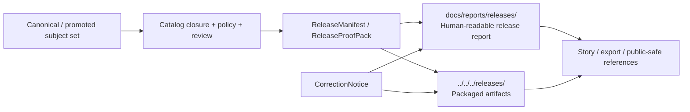

<!-- [KFM_META_BLOCK_V2]
doc_id: kfm://doc/<uuid-NEEDS-VERIFICATION>
title: Release Reports
type: standard
version: v1
status: draft
owners: TODO (NEEDS VERIFICATION)
created: YYYY-MM-DD
updated: YYYY-MM-DD
policy_label: public
related: [../../../releases/ (INFERRED), ../../runbooks/publication.md (PROPOSED), ../../runbooks/correction.md (PROPOSED), ../../runbooks/rollback.md (PROPOSED), ../daily/README.md (NEEDS VERIFICATION)]
tags: [kfm, releases, reports]
notes: [Target path requested in current session; current-session repo tree was not mounted, so owners, dates, neighboring file existence, and exact directory contents remain review items.]
[/KFM_META_BLOCK_V2] -->

# Release Reports

Governed, human-readable summaries of published release scope, proof, and correction state.

> **Status:** experimental  
> **Owners:** TODO (NEEDS VERIFICATION)  
> **Path:** `docs/reports/releases/README.md`  
>      
> **Quick jump:** [Scope](#scope) · [Repo fit](#repo-fit) · [Inputs](#inputs) · [Exclusions](#exclusions) · [Directory tree](#directory-tree) · [Quickstart](#quickstart) · [Usage](#usage) · [Diagram](#diagram) · [Reference tables](#reference-tables) · [Task list](#task-list) · [FAQ](#faq) · [Appendix](#appendix)

> [!IMPORTANT]
> This directory is a **downstream release surface**. It does **not** promote a release, replace the release artifact set, or act as a second truth store.

> [!NOTE]
> Current-session implementation evidence was PDF-only. Anything beyond the doctrinal role of this directory is labeled **CONFIRMED**, **INFERRED**, **PROPOSED**, **UNKNOWN**, or **NEEDS VERIFICATION** on purpose.

## Scope

This directory should explain **what was published**, **why it is publishable**, **what proof and policy state back it**, and **how correction or supersession remains visible afterward**.

In KFM terms, release reports belong **after** governed promotion, not before it. They are the readable companion to release-bearing objects such as `ReleaseManifest`, `ReleaseProofPack`, `CorrectionNotice`, `ProjectionBuildReceipt`, and evidence-linked outward summaries. They should help a maintainer, reviewer, steward, or public-facing reader answer four questions quickly:

1. What release scope is this report describing?
2. What proof, evidence, and policy state back it?
3. What caveats, freshness limits, or generalization rules remain visible?
4. What changed later, and where is the correction lineage?

### Current posture

| Area | Status | Notes |
|---|---|---|
| Directory role as a release-facing report surface | **CONFIRMED** | KFM doctrine explicitly treats export/report surfaces as downstream public-safe objects tied to release state, policy posture, and correction linkage. |
| Actual mounted contents of `docs/reports/releases/` beyond this README | **UNKNOWN** | The current session did not include a mounted repo tree. |
| Top-level packaged release artifacts under `releases/` | **INFERRED** | Internal KFM repo guidance points to a top-level `releases/` area for versioned release artifacts. |
| Publication / correction / rollback runbooks | **PROPOSED** | Named in doctrine as high-value next docs, but not verified as mounted files. |

[Back to top](#release-reports)

## Repo fit

### Path

`docs/reports/releases/README.md`

### Why this directory exists

Release reports are the **human-readable release layer** inside docs. They should summarize promoted scope without duplicating machine artifacts or mutating canonical truth.

### Upstream / downstream relationships

| Direction | Reference | Role here | Status |
|---|---|---|---|
| Upstream | `ReleaseManifest` / `ReleaseProofPack` | Primary release-bearing proof objects this directory should summarize, not replace. | **CONFIRMED** |
| Upstream | `CorrectionNotice` | Keeps visible lineage when a release is superseded, narrowed, withdrawn, or corrected. | **CONFIRMED** |
| Upstream | `ProjectionBuildReceipt` | Declares freshness basis and rebuild linkage for derived release surfaces. | **CONFIRMED** |
| Upstream | `EvidenceBundle` summary | Supports inspectable outward claims and evidence drill-through. | **CONFIRMED** |
| Downstream | [`../../../releases/`](../../../releases/) | Likely home of packaged release artifacts, manifests, SBOMs, signatures, and proof bundles. | **INFERRED** |
| Adjacent | [`../../runbooks/publication.md`](../../runbooks/publication.md) | Publication procedure and release assembly guidance. | **PROPOSED** |
| Adjacent | [`../../runbooks/correction.md`](../../runbooks/correction.md) | Correction and supersession procedure. | **PROPOSED** |
| Adjacent | [`../../runbooks/rollback.md`](../../runbooks/rollback.md) | Rollback and recovery procedure. | **PROPOSED** |
| Sibling | [`../daily/README.md`](../daily/README.md) | Daily or run-scale reporting surface, if present. | **NEEDS VERIFICATION** |

### Audience fit

| Audience | What this directory should do for them | What it must not do |
|---|---|---|
| Maintainers | Provide a stable narrative index of released scope and proof. | Invent repo state or hide unknowns. |
| Reviewers / stewards | Show release lineage, policy posture, and correction state clearly. | Blur approval context into vague prose. |
| Builders / operators | Point cleanly to manifests, proof packs, and public-safe caveats. | Replace runbooks, CI logs, or machine artifacts. |
| Public / civic readers | Explain what is released and what caveats apply. | Present uncited or unsupported claims as authoritative. |

[Back to top](#release-reports)

## Inputs

### Accepted inputs

This directory should accept only **release-safe, outward-facing summaries** derived from governed release state, such as:

- promoted release summaries tied to a stable release identifier
- release scope statements
- human-readable change summaries
- links to `ReleaseManifest` / `ReleaseProofPack`
- visible correction or supersession state
- freshness or projection-staleness notes
- public-safe evidence pointers
- public-safe rights, sensitivity, or generalization caveats
- public-safe export/report summaries

### Accepted supporting objects

| Object family | What belongs in the report |
|---|---|
| `ReleaseManifest` / `ReleaseProofPack` | Scope, version, proof links, integrity pointers, docs/accessibility status if surfaced |
| `CorrectionNotice` | Replacement, withdrawal, narrowing, correction cause, user-visible next action |
| `ProjectionBuildReceipt` | Freshness basis, stale-after posture, derived-layer rebuild linkage |
| `EvidenceBundle` | Short evidence summary plus drill-through path |
| `DecisionEnvelope` / `ReviewRecord` | Only the outward-safe, relevant policy/review summary |
| `RuntimeResponseEnvelope` | Optional only when a report is documenting a released governed-assistance capability |

## Exclusions

### What does **not** belong here

| Exclusion | Goes somewhere else | Why |
|---|---|---|
| RAW / WORK / QUARANTINE material | source / intake / candidate lanes | Not public-safe release scope |
| Unpublished candidate datasets or pre-promotion outputs | canonical / review / candidate surfaces | A release report must not preview unreleased truth |
| JSON Schemas, fixtures, policy bundles, registry files | `contracts/`, `schemas/`, `policy/` | These are executable control artifacts, not release reports |
| CI traces, raw logs, dashboards, metrics dumps | ops / observability surfaces | Reports may link them; they should not duplicate them |
| Binary release artifacts, SBOMs, signatures, manifests | `../../../releases/` | Packaged artifacts are machine-bearing outputs |
| Free-form essays detached from release state | story or domain docs | This directory should remain release-anchored |
| Sensitive precise-location detail when policy requires generalization | stewarded policy-safe surfaces only | Visible withholding/generalization is preferred to leakage |

> [!WARNING]
> Do not let this directory become a quiet dumping ground for “finished looking” material that has not passed promotion, correction, or policy handling.

[Back to top](#release-reports)

## Directory tree

Starter shape only. Everything beyond this README is **INFERRED**, **PROPOSED**, or **NEEDS VERIFICATION** unless directly confirmed later.

```text
docs/
└── reports/
    └── releases/
        ├── README.md                          # This guide
        ├── <release-id>.md                    # PROPOSED per-release summary page
        └── assets/                            # PROPOSED doc-safe tables, charts, thumbnails
            └── <release-id>/                  # PROPOSED report-local assets

releases/                                      # INFERRED packaged release area
└── <release-id>/                              # INFERRED machine-bearing artifacts
    ├── manifest.*                             # INFERRED
    ├── proof/                                 # INFERRED
    ├── sbom.*                                 # INFERRED
    ├── attestations/                          # INFERRED
    └── correction/                            # INFERRED / NEEDS VERIFICATION
```

### Interpretation rule

- `docs/reports/releases/` should stay **reader-friendly**.
- `releases/` should stay **artifact-bearing**.
- The report may summarize and link machine outputs, but it should not become the machine output.

[Back to top](#release-reports)

## Quickstart

1. **Confirm the subject is already released or otherwise explicitly public-safe.**  
   If the object is still candidate, quarantined, or under unresolved review, it does not belong here.

2. **Resolve the release-bearing objects.**  
   At minimum, collect the stable release identifier and the current release-safe references for:
   - `ReleaseManifest` / `ReleaseProofPack`
   - `CorrectionNotice` (if any)
   - `EvidenceBundle` summary
   - freshness / projection state

3. **Write the human-readable release summary.**  
   Keep the report short, precise, and visibly governed:
   - what shipped
   - what changed
   - what caveats remain
   - where the proof lives

4. **Link to machine-bearing artifacts instead of restating them.**  
   Prefer links into `../../../releases/` over duplicated manifest text.

5. **Check visible trust state before publish.**  
   Readers should be able to tell whether the release is:
   - promoted
   - generalized
   - partial
   - stale-visible
   - superseded
   - withdrawn
   - corrected

### Minimal starter entry

```md
## 2026-03-20 · <release-id>

**State:** promoted  
**Scope:** <lane / geography / time basis>  
**Summary:** <one-paragraph outward-safe release note>

**Artifacts**
- Manifest: `../../../releases/<release-id>/...`
- Proof: `../../../releases/<release-id>/...`
- SBOM / attestations: `../../../releases/<release-id>/...`

**Evidence & policy**
- Evidence summary: <short outward-safe note>
- Generalization / withholding: <if applicable>
- Freshness basis: <if applicable>

**Correction state**
- Current state: none | corrected | superseded | withdrawn
- If changed later: link the replacement / correction notice
```

> [!TIP]
> If KFM is exercising its first fully governed path, favor a **hydrology-first** release example. The doctrine repeatedly treats hydrology as the preferred first thin slice because it is public-safe, place/time-rich, and operationally legible.

[Back to top](#release-reports)

## Usage

### What each release report should make obvious

| Reader question | The report should answer it fast |
|---|---|
| What is this release? | Stable release ID, title, scope, and date |
| What changed? | A compact summary of release scope or delta |
| Why should I trust it? | Proof links, evidence summary, policy-safe context |
| Is it current? | Freshness basis, stale-visible notes, projection context |
| Did anything go wrong later? | Correction, supersession, rollback, or withdrawal linkage |
| Where are the actual artifacts? | Direct path into packaged release outputs |

### Writing rules

- Prefer **release scope** over marketing language.
- Prefer **visible caveats** over implied certainty.
- Prefer **links to proof** over long copied metadata.
- Prefer **correction lineage** over “latest only” erasure.
- Prefer **public-safe wording** over operator shorthand.
- Keep one report entry tied to one identifiable release event.

### What a good entry feels like

A good entry reads like a release-aware dossier note, not a changelog fragment and not a press blurb. It should be brief enough to scan, but strong enough that a reviewer can move from the report to the exact release-bearing artifacts without guessing.

## Diagram



### Interpretation

The report is **downstream** of governed promotion and **parallel** to packaged artifacts. It should summarize release scope and lineage, while the artifact set remains the machine-bearing source for manifests, proof, attestations, and package payloads.

[Back to top](#release-reports)

## Reference tables

### Release-bearing objects this directory should surface

| Object | Minimum visible treatment in this directory | Why it matters |
|---|---|---|
| `ReleaseManifest` / `ReleaseProofPack` | Stable ID, version/scope summary, proof link | Release must stay inspectable |
| `CorrectionNotice` | Visible correction, supersession, withdrawal, or narrowing note | Lineage must remain visible |
| `ProjectionBuildReceipt` | Freshness basis and rebuild relationship | Prevent stale derived outputs from looking authoritative |
| `EvidenceBundle` | Short evidence summary and drill-through path | Public claims should not float free of evidence |
| `DecisionEnvelope` / `ReviewRecord` | Public-safe policy/review summary only | Publication is governed, not decorative |
| `RuntimeResponseEnvelope` | Optional only when reporting released governed-assistance behavior | Keeps language-model or runtime surfaces accountable |

### Visible release states

| State | Meaning here | Reader should see |
|---|---|---|
| `promoted` | Current released scope | release ID, date, proof, scope |
| `partial` | Coverage or completeness is limited | what is missing and why |
| `generalized` | Detail is intentionally reduced | visible generalization note |
| `stale-visible` | Derived view is older than freshness basis | stale basis and rebuild expectation |
| `superseded` | A newer release replaces this one | direct replacement link |
| `withdrawn` | Release is no longer outward-valid | withdrawal note and reason |
| `corrected` | Release remains visible through correction lineage | correction notice and replacement path |

### Required trust signals

| Signal | Minimum expectation |
|---|---|
| Time clarity | Release date and relevant time basis are visible |
| Evidence linkage | Evidence summary or drill-through path is present |
| Policy visibility | Generalization, withholding, or other public-safe caveats are visible |
| Correction visibility | Replacement / correction state is not hidden |
| Artifact traceability | Report points to packaged artifacts instead of vaguely describing them |

[Back to top](#release-reports)

## Task list

### Definition of done for this directory

- [ ] This README states the directory role as a **downstream release surface**.
- [ ] The directory does **not** claim authority over machine artifacts or canonical truth.
- [ ] Every example/report entry is tied to a stable release identifier.
- [ ] Reports point to packaged artifacts rather than duplicating them.
- [ ] Freshness, projection staleness, and correction state are visible where relevant.
- [ ] No unpublished candidate, RAW, WORK, or QUARANTINE material is surfaced here.
- [ ] Rights, sensitivity, generalization, and partial-coverage caveats are not hidden.
- [ ] The report layer remains understandable to non-operators without losing traceability.
- [ ] This doc is updated once real repo paths, owners, and neighboring indexes are verified.

### Review gates for each report entry

- [ ] Release state is confirmed public-safe.
- [ ] Proof link is present.
- [ ] Correction link is present when applicable.
- [ ] No policy-unsafe precision is revealed.
- [ ] The entry can be read without opening the manifest, but does not replace the manifest.
- [ ] A maintainer can navigate from the report to the artifact set in one hop.

[Back to top](#release-reports)

## FAQ

### Is this directory the release artifact store?

No. This directory should describe release scope and proof in human-readable form. The machine-bearing artifacts should live in the packaged release area, likely `../../../releases/` if that top-level shape is confirmed.

### Can a report entry link to candidate data or unpublished internal outputs?

No. The doctrinal posture is explicit: successful internal processing does not equal public-safe publication.

### Are correction notices optional once a newer release exists?

No. Visible lineage is part of KFM’s trust model. Supersession, narrowing, withdrawal, and replacement should remain legible.

### Should this directory act like a plain changelog?

Not by default. A useful release report can include a changelog summary, but it should remain tied to release scope, proof, evidence, policy posture, and correction state.

### Can this directory host screenshots, charts, or thumbnails?

Yes, if they are doc-safe, outward-safe, and clearly subordinate to the release-bearing objects they illustrate.

[Back to top](#release-reports)

## Appendix

<details>
<summary><strong>Starter release-report outline (PROPOSED)</strong></summary>

### Front block
- Release title
- Stable release ID
- State (`promoted`, `superseded`, `withdrawn`, etc.)
- Date published
- Scope line

### Summary
- One paragraph explaining the release in plain language

### Scope
- Domains / lanes touched
- Geography
- Time basis
- Key caveats

### Proof & artifacts
- Manifest
- Proof pack
- SBOM / attestations
- Evidence summary

### Trust state
- Freshness / stale-visible state
- Generalization / withholding
- Partial coverage if applicable

### Correction lineage
- none / corrected / superseded / withdrawn
- direct replacement or notice links

### Reviewer note
- short human-readable note if the release has a special policy or interpretive burden

</details>

<details>
<summary><strong>Glossary quick-reference</strong></summary>

| Term | Working meaning here |
|---|---|
| **ReleaseManifest** | Release-bearing object that identifies the outward release scope |
| **ReleaseProofPack** | Proof bundle that backs the release with evidence, validation, and integrity context |
| **CorrectionNotice** | Visible lineage object for replacement, withdrawal, narrowing, or correction |
| **ProjectionBuildReceipt** | Record of how a derived outward layer was built from a known release scope |
| **EvidenceBundle** | Inspectable support bundle for a claim, feature, export preview, or answer |
| **stale-visible** | A state in which staleness is shown rather than hidden |
| **public-safe** | Safe for outward-facing release under current policy and review state |

</details>

---

[Back to top](#release-reports)
