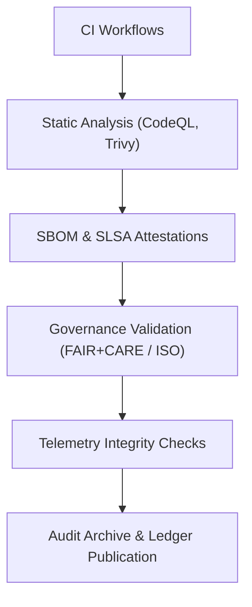

<div align="center">

# 🛡️ **Kansas Frontier Matrix — Security & Compliance Reports Index**
`docs/reports/security/README.md`

**Purpose:**  
Centralized index for **security validations, SBOM attestations, compliance audits, and FAIR+CARE governance verifications** across all Kansas Frontier Matrix (KFM) modules.  
This document aligns with **ISO 27001, ISO 50001, ISO 14064, FAIR+CARE**, and **Diamond⁹ Ω / Crown∞Ω** tiers of trust and reproducibility.

[](../../README.md)
[](../../../LICENSE)
[](../../standards/faircare.md)
[](../../../releases/v10.0.0/manifest.zip)

</div>

---

## 📘 Overview
This directory stores **security audit outputs, compliance validations, vulnerability scans, and verification evidence** generated by automated CI/CD and governance pipelines.  
All reports conform to **MCP-DL v6.3 documentation-first** requirements—each is reproducible, timestamped, and cryptographically signed.

---

## 🗂️ Directory Layout
```
docs/reports/security/
 ├── codeql/                   # Static analysis and dependency vulnerability scan reports
 ├── trivy/                    # Container image and SBOM security scans
 ├── attestations/             # SLSA provenance attestations, digital signatures, and supply-chain proofs
 ├── governance/               # FAIR+CARE and ISO 27001 alignment evidence
 ├── telemetry/                # Runtime anomaly and integrity monitoring summaries
 ├── audits/                   # Periodic internal/external audit logs and compliance summaries
 └── README.md                 # This index file
```

---

## ⚙️ Automated Workflows
| Workflow Name | Description | Output Location |
|----------------|-------------|----------------|
| `codeql.yml` | GitHub CodeQL static analysis; checks for insecure patterns, taint flows. | `codeql/` |
| `trivy.yml` | Trivy scanner validates container images + SBOM dependencies. | `trivy/` |
| `sbom-validate.yml` | Confirms SPDX SBOM integrity and hashes against manifest. | `attestations/` |
| `faircare-validate.yml` | Verifies FAIR+CARE ethical metadata completeness. | `governance/` |
| `focus-telemetry-validate.yml` | Cross-checks runtime telemetry and energy metrics for anomalies. | `telemetry/` |
| `governance-ledger.yml` | Updates distributed ledger attestations for Diamond⁹ Ω status. | `audits/` |

Each workflow generates machine-readable JSON and human-readable PDF summaries.  
Artifacts are timestamped, signed, and cross-linked to the **governance ledger**.

---

## 🧾 Report Types
| Category | File Example | Standard Alignment | Retention |
|-----------|--------------|--------------------|------------|
| **Vulnerability Scans** | `codeql-summary-<date>.json` | OWASP Top 10, SLSA Level 3 | Rolling 12 months |
| **SBOM Integrity** | `sbom-attestation-<hash>.json` | SPDX 2.3, NTIA SBOM Guidelines | Permanent |
| **Governance Audits** | `faircare-audit-<quarter>.pdf` | FAIR + CARE v3, ISO 26000 | 5 years |
| **Energy & Telemetry Reports** | `focus-telemetry-LCA-<date>.json` | ISO 50001 / 14064 | Annual |
| **Security Attestations** | `slsa-provenance-<build>.json` | SLSA v1.0, in-toto | Permanent |

---

## 🧩 Integration & Validation Flow (Mermaid)


---

## ⚖️ FAIR+CARE Alignment
| Principle | Implementation |
|------------|----------------|
| **Findable** | Reports indexed via STAC/DCAT metadata and tagged in manifest zip. |
| **Accessible** | All reports stored under `docs/reports/security/` with open license and hash verification. |
| **Interoperable** | JSON schemas follow SPDX and SLSA formats; machine-parsable. |
| **Reusable** | Audit summaries include provenance and version context for downstream reuse. |
| **CARE (Collective Benefit)** | Scans exclude personal data; AI outputs are ethically validated. |
| **CARE (Authority to Control)** | Data owners govern their own security data per governance_ref. |

---

## 🕰️ Version History
| Version | Date | Author | Summary |
|----------|------|---------|---------|
| v10.0.0 | 2025-11-09 | FAIR+CARE Council / Security Ops Team | Initial v10 release; added SLSA attestations and telemetry ledger integration. |
| v9.7.0 | 2025-05-12 | Governance Team | Unified security and compliance reports under FAIR+CARE schema. |
| v9.5.0 | 2025-02-10 | DevSecOps Lead | Introduced CodeQL and Trivy CI workflows; added SBOM validation. |

---

<div align="center">

© 2025 Kansas Frontier Matrix · Master Coder Protocol v6.3 · FAIR+CARE Certified · Diamond⁹ Ω / Crown∞Ω Ultimate Certified  
[Back to Reports Index](../README.md) · [Governance Charter](../../standards/governance/ROOT-GOVERNANCE.md)

</div>

